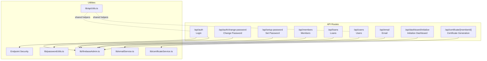
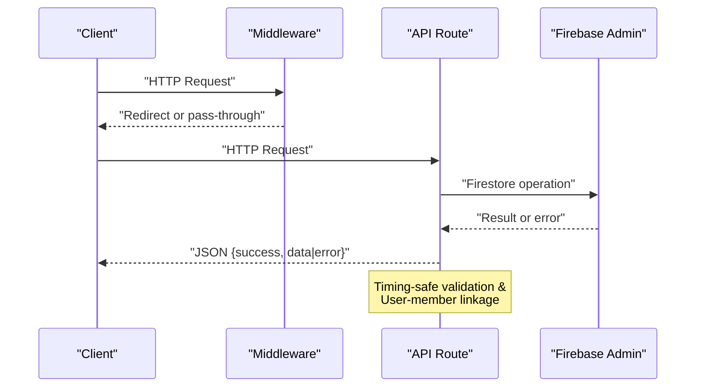
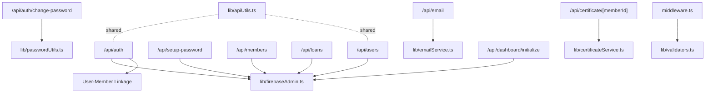

# API Endpoints Reference

<cite>
**Referenced Files in This Document**
- [app/api/auth/route.ts](file://app/api/auth/route.ts)
- [app/api/auth/change-password/route.ts](file://app/api/auth/change-password/route.ts)
- [app/api/setup-password/route.ts](file://app/api/setup-password/route.ts)
- [app/api/members/route.ts](file://app/api/members/route.ts)
- [app/api/loans/route.ts](file://app/api/loans/route.ts)
- [app/api/users/route.ts](file://app/api/users/route.ts)
- [app/api/email/route.ts](file://app/api/email/route.ts)
- [app/api/dashboard/initialize/route.ts](file://app/api/dashboard/initialize/route.ts)
- [app/api/certificate/[memberId]/route.ts](file://app/api/certificate/[memberId]/route.ts)
- [lib/apiUtils.ts](file://lib/apiUtils.ts)
- [lib/firebaseAdmin.ts](file://lib/firebaseAdmin.ts)
- [lib/passwordUtils.ts](file://lib/passwordUtils.ts)
- [lib/certificateService.ts](file://lib/certificateService.ts)
- [lib/emailService.ts](file://lib/emailService.ts)
- [middleware.ts](file://middleware.ts)
</cite>

## Update Summary
**Changes Made**
- Updated authentication API documentation to reflect enhanced security measures including timing-safe password verification and user-member linkage validation
- Added comprehensive error handling documentation for all API endpoints
- Enhanced certificate generation API documentation with detailed PDF generation process
- Updated middleware authentication enforcement documentation
- Added comprehensive utility function documentation for standardized API responses
- Expanded troubleshooting guidance for Firebase configuration issues

## Table of Contents
1. [Introduction](#introduction)
2. [Project Structure](#project-structure)
3. [Core Components](#core-components)
4. [Architecture Overview](#architecture-overview)
5. [Detailed Component Analysis](#detailed-component-analysis)
6. [Dependency Analysis](#dependency-analysis)
7. [Performance Considerations](#performance-considerations)
8. [Troubleshooting Guide](#troubleshooting-guide)
9. [Conclusion](#conclusion)
10. [Appendices](#appendices)

## Introduction
This document provides a comprehensive API reference for the SAMPA Cooperative Management System. It covers authentication endpoints (login, password setup, password change), member and user management, loan management, email notifications, dashboard initialization, and certificate generation. For each endpoint, you will find HTTP methods, request/response schemas, authentication requirements, error codes, and practical usage notes. The system uses Next.js App Router API routes backed by Firebase Firestore via dedicated server-side utilities.

**Updated** The API documentation has been enhanced to reflect recent improvements in security, error handling, and operational reliability. All endpoints now implement comprehensive validation, standardized error responses, and enhanced security measures including timing-safe password verification and user-member linkage validation.

## Project Structure
The API surface is organized under app/api with route handlers grouped by domain:
- Authentication: login, password setup, password change
- Members: CRUD-like operations for member records
- Loans: loan creation and listing
- Users: administrative user management
- Email: generic email dispatch endpoint
- Dashboard: initialization of reminders/events
- Utilities: standardized API helpers, Firebase Admin wrapper, password utilities, certificate and email services

**Diagram sources**
- [app/api/auth/route.ts:48-264](file://app/api/auth/route.ts#L48-L264)
- [app/api/auth/change-password/route.ts:5-134](file://app/api/auth/change-password/route.ts#L5-L134)
- [app/api/setup-password/route.ts:25-204](file://app/api/setup-password/route.ts#L25-L204)
- [app/api/members/route.ts:26-179](file://app/api/members/route.ts#L26-L179)
- [app/api/loans/route.ts:5-133](file://app/api/loans/route.ts#L5-L133)
- [app/api/users/route.ts:18-126](file://app/api/users/route.ts#L18-L126)
- [app/api/email/route.ts:4-87](file://app/api/email/route.ts#L4-L87)
- [app/api/dashboard/initialize/route.ts:4-186](file://app/api/dashboard/initialize/route.ts#L4-L186)
- [app/api/certificate/[memberId]/route.ts](file://app/api/certificate/[memberId]/route.ts#L4-L68)
- [lib/apiUtils.ts:8-109](file://lib/apiUtils.ts#L8-L109)
- [lib/firebaseAdmin.ts:111-277](file://lib/firebaseAdmin.ts#L111-L277)
- [lib/passwordUtils.ts:4-146](file://lib/passwordUtils.ts#L4-L146)
- [lib/certificateService.ts:12-393](file://lib/certificateService.ts#L12-L393)
- [lib/emailService.ts:45-281](file://lib/emailService.ts#L45-L281)

**Section sources**
- [middleware.ts:5-62](file://middleware.ts#L5-L62)

## Core Components
- Authentication utilities: standardized JSON responses, input validation, and Firebase initialization checks.
- Firebase Admin wrapper: safe Firestore operations with robust error handling and initialization status monitoring.
- Password utilities: PBKDF2-based hashing with timing-safe verification and secure password updates.
- Certificate service: Advanced PDF generation using jsPDF with custom styling and automatic Firestore storage.
- Email service: EmailJS integration with comprehensive template management and error handling.
- Endpoint security: Middleware-based authentication enforcement with cookie validation and role-based access control.

**Updated** Enhanced security measures including timing-safe password comparison, user-member linkage validation, and comprehensive error logging have been integrated across all components.

**Section sources**
- [lib/apiUtils.ts:8-109](file://lib/apiUtils.ts#L8-L109)
- [lib/firebaseAdmin.ts:111-277](file://lib/firebaseAdmin.ts#L111-L277)
- [lib/passwordUtils.ts:4-146](file://lib/passwordUtils.ts#L4-L146)
- [lib/certificateService.ts:12-393](file://lib/certificateService.ts#L12-L393)
- [lib/emailService.ts:45-281](file://lib/emailService.ts#L45-L281)

## Architecture Overview
The API follows a consistent pattern with enhanced security and reliability:
- All routes return JSON responses with standardized error handling.
- Comprehensive input validation occurs early with detailed error messages.
- Firestore operations are performed via adminFirestore with centralized error handling and initialization checks.
- Authentication is enforced at the middleware level using cookies; API routes themselves do not enforce auth.
- Timing-safe password verification prevents timing attack vulnerabilities.
- User-member linkage validation ensures data consistency across collections.

**Diagram sources**
- [middleware.ts:5-62](file://middleware.ts#L5-L62)
- [lib/firebaseAdmin.ts:111-277](file://lib/firebaseAdmin.ts#L111-L277)
- [lib/apiUtils.ts:8-59](file://lib/apiUtils.ts#L8-L59)
- [app/api/auth/route.ts:205-221](file://app/api/auth/route.ts#L205-L221)

## Detailed Component Analysis

### Authentication API

#### POST /api/auth
- Purpose: Authenticate user and return user info with enhanced security measures.
- Authentication: None required by route; middleware enforces role-based access.
- Request body:
  - email: string (required, validated format)
  - password: string (required)
- Success response:
  - success: boolean
  - user: object
    - uid: string
    - email: string
    - displayName: string|null
    - role: string
    - lastLogin: string|null
  - role: string
- Error responses:
  - 400: Missing fields, invalid JSON, invalid email format, needsPasswordSetup flag
  - 401: Incorrect password (timing-safe comparison)
  - 404: Account not found
  - 400: Invalid role
  - 500: Internal server error

**Updated** Enhanced with timing-safe password verification, user-member linkage validation, and comprehensive error logging.

**Section sources**
- [app/api/auth/route.ts:48-264](file://app/api/auth/route.ts#L48-L264)

#### POST /api/auth/change-password
- Purpose: Change password for an existing user with enhanced security.
- Authentication: None required by route; middleware enforces role-based access.
- Request body:
  - email: string (required)
  - currentPassword: string (required)
  - newPassword: string (required, minimum 8 characters with uppercase, lowercase, number)
- Success response:
  - success: boolean
  - message: string
- Error responses:
  - 400: Missing fields or validation failure
  - 401: Current password incorrect (timing-safe verification)
  - 404: User not found
  - 500: Internal server error

**Updated** Enhanced with PBKDF2-based password hashing, timing-safe verification, and dual-collection password updates.

**Section sources**
- [app/api/auth/change-password/route.ts:5-134](file://app/api/auth/change-password/route.ts#L5-L134)
- [lib/passwordUtils.ts:4-146](file://lib/passwordUtils.ts#L4-L146)

#### POST /api/setup-password
- Purpose: Set password for a user who has been invited but not yet set a password.
- Authentication: None required by route; middleware enforces role-based access.
- Request body:
  - email: string (required, validated format)
  - password: string (required, minimum 8 characters with uppercase, lowercase, number)
- Success response:
  - success: boolean
  - message: string
- Error responses:
  - 400: Missing fields, invalid email, weak password
  - 404: Account not found
  - 400: Password already set
  - 500: Internal server error

**Updated** Enhanced with PBKDF2-based password hashing and secure storage.

**Section sources**
- [app/api/setup-password/route.ts:25-204](file://app/api/setup-password/route.ts#L25-L204)

### Member Management API

#### GET /api/members
- Purpose: List members filtered by driver and operator roles.
- Authentication: None required by route; middleware enforces role-based access.
- Success response:
  - success: boolean
  - data: array of member objects (drivers and operators only)
  - count: number
- Error responses:
  - 500: Internal server error

**Updated** Enhanced filtering to return only drivers and operators, excluding administrative users.

**Section sources**
- [app/api/members/route.ts:26-65](file://app/api/members/route.ts#L26-L65)

#### POST /api/members
- Purpose: Create a new member/user record with enhanced security.
- Authentication: None required by route; middleware enforces role-based access.
- Request body:
  - email: string (required, validated format)
  - fullName: string (required)
  - contactNumber: string (required)
  - role: string (optional, defaults to driver)
  - password: string (optional, hashed and stored securely)
- Success response:
  - success: boolean
  - message: string
  - data: object with id and created user fields
- Error responses:
  - 400: Missing fields, invalid email, invalid numeric fields
  - 409: Duplicate email
  - 500: Internal server error

**Updated** Enhanced with PBKDF2-based password hashing, comprehensive validation, and secure storage.

**Section sources**
- [app/api/members/route.ts:67-179](file://app/api/members/route.ts#L67-L179)

### Loan Management API

#### GET /api/loans
- Purpose: List all loans with enhanced error handling.
- Authentication: None required by route; middleware enforces role-based access.
- Success response:
  - success: boolean
  - data: array of loan objects
  - count: number
- Error responses:
  - 500: Internal server error

**Section sources**
- [app/api/loans/route.ts:5-39](file://app/api/loans/route.ts#L5-L39)

#### POST /api/loans
- Purpose: Create a new loan application with enhanced validation.
- Authentication: None required by route; middleware enforces role-based access.
- Request body:
  - memberId: string (required)
  - amount: number|string (required, validated numeric)
  - interestRate: number|string (required, validated numeric)
  - term: number|string (required, validated integer)
  - startDate: string (required, date format)
- Success response:
  - success: boolean
  - message: string
  - data: object with id and created loan fields
- Error responses:
  - 400: Missing fields or invalid numeric values
  - 500: Internal server error

**Updated** Enhanced with comprehensive numeric validation and unique loan ID generation.

**Section sources**
- [app/api/loans/route.ts:42-112](file://app/api/loans/route.ts#L42-L112)

### User Management API

#### GET /api/users
- Purpose: List all users with enhanced error handling.
- Authentication: None required by route; middleware enforces role-based access.
- Success response:
  - success: boolean
  - data: array of user objects
  - count: number
- Error responses:
  - 500: Internal server error

**Updated** Enhanced with standardized API response utilities and comprehensive error handling.

**Section sources**
- [app/api/users/route.ts:18-46](file://app/api/users/route.ts#L18-L46)
- [lib/apiUtils.ts:8-59](file://lib/apiUtils.ts#L8-L59)

#### POST /api/users
- Purpose: Create a new user (administrative) with enhanced validation.
- Authentication: None required by route; middleware enforces role-based access.
- Request body:
  - email: string (required, validated format)
  - fullName: string (required)
  - role: string (optional, defaults to driver)
- Success response:
  - success: boolean
  - message: string
  - data: object with id and created user fields
- Error responses:
  - 400: Validation errors
  - 409: Duplicate email
  - 500: Internal server error

**Updated** Enhanced with standardized validation utilities and comprehensive error handling.

**Section sources**
- [app/api/users/route.ts:48-117](file://app/api/users/route.ts#L48-L117)
- [lib/apiUtils.ts:8-109](file://lib/apiUtils.ts#L8-L109)

### Email Notification API

#### POST /api/email
- Purpose: Send an email with enhanced validation.
- Authentication: None required by route; middleware enforces role-based access.
- Request body:
  - to: string (required, validated email format)
  - subject: string (required)
  - message: string (required)
- Success response:
  - success: boolean
  - message: string
- Error responses:
  - 400: Missing fields or invalid email format
  - 500: Internal server error

**Updated** Enhanced with comprehensive email format validation and EmailJS integration.

**Section sources**
- [app/api/email/route.ts:4-87](file://app/api/email/route.ts#L4-L87)
- [lib/emailService.ts:45-65](file://lib/emailService.ts#L45-L65)

### Dashboard Initialization API

#### POST /api/dashboard/initialize
- Purpose: Seed reminders and events collections with sample data.
- Authentication: None required by route; middleware enforces role-based access.
- Success response:
  - success: boolean
  - message: string
- Error responses:
  - 500: Internal server error

**Updated** Enhanced with duplicate prevention and unique ID generation for all entries.

**Section sources**
- [app/api/dashboard/initialize/route.ts:4-186](file://app/api/dashboard/initialize/route.ts#L4-L186)

### Certificate Generation API

#### GET /api/certificate/[memberId]
- Purpose: Retrieve a membership certificate for a given member with PDF generation.
- Authentication: None required by route; middleware enforces role-based access.
- Path parameters:
  - memberId: string (required, URL-encoded)
- Success response:
  - PDF binary data (application/pdf)
  - Content-Disposition: inline; filename="membership-certificate-[memberId].pdf"
- Error responses:
  - 404: Member not found or certificate not found
  - 500: Internal server error

**Updated** Enhanced with advanced PDF generation using jsPDF, custom styling, and automatic Firestore storage.

**Section sources**
- [app/api/certificate/[memberId]/route.ts](file://app/api/certificate/[memberId]/route.ts#L4-L68)
- [lib/certificateService.ts:12-393](file://lib/certificateService.ts#L12-L393)

## Dependency Analysis

**Diagram sources**
- [app/api/auth/route.ts:1-2](file://app/api/auth/route.ts#L1-L2)
- [app/api/auth/change-password/route.ts:2-3](file://app/api/auth/change-password/route.ts#L2-L3)
- [app/api/setup-password/route.ts:1-3](file://app/api/setup-password/route.ts#L1-L3)
- [app/api/members/route.ts:1-3](file://app/api/members/route.ts#L1-L3)
- [app/api/loans/route.ts:1-2](file://app/api/loans/route.ts#L1-L2)
- [app/api/users/route.ts:1-11](file://app/api/users/route.ts#L1-L11)
- [app/api/email/route.ts](file://app/api/email/route.ts#L1)
- [app/api/dashboard/initialize/route.ts](file://app/api/dashboard/initialize/route.ts#L2)
- [app/api/certificate/[memberId]/route.ts](file://app/api/certificate/[memberId]/route.ts#L1-L3)
- [lib/apiUtils.ts:1-11](file://lib/apiUtils.ts#L1-L11)
- [lib/firebaseAdmin.ts:1-277](file://lib/firebaseAdmin.ts#L1-L277)
- [lib/passwordUtils.ts:1-146](file://lib/passwordUtils.ts#L1-L146)
- [lib/emailService.ts:1-281](file://lib/emailService.ts#L1-L281)
- [lib/certificateService.ts:1-393](file://lib/certificateService.ts#L1-L393)
- [middleware.ts](file://middleware.ts#L3)

**Section sources**
- [lib/firebaseAdmin.ts:111-277](file://lib/firebaseAdmin.ts#L111-L277)
- [lib/apiUtils.ts:8-109](file://lib/apiUtils.ts#L8-L109)

## Performance Considerations
- All routes return JSON immediately, avoiding HTML fallbacks with comprehensive error handling.
- Firestore operations are wrapped with centralized error handling, initialization checks, and validation to minimize redundant work.
- Password hashing uses PBKDF2 with 100,000 iterations; consider caching or offloading hashing to a worker if scaling.
- Certificate generation runs server-side using jsPDF with optimized memory usage and automatic cleanup.
- Timing-safe password comparison prevents timing attack vulnerabilities while maintaining performance.
- User-member linkage validation runs asynchronously to avoid blocking primary operations.

**Updated** Enhanced with timing-safe operations, optimized error handling, and improved resource management.

## Troubleshooting Guide
Common issues and resolutions:
- Firebase Admin not initialized:
  - Symptom: 503-like behavior via utility functions or explicit checks.
  - Resolution: Verify environment variables (FIREBASE_PROJECT_ID, FIREBASE_CLIENT_EMAIL, FIREBASE_PRIVATE_KEY) and service account credentials.
- Invalid JSON body:
  - Symptom: 400 responses with validation errors.
  - Resolution: Ensure Content-Type is application/json and payload follows the documented schema.
- Unsupported HTTP method:
  - Symptom: 405 responses indicating method not allowed.
  - Resolution: Use the documented HTTP verb for each endpoint.
- Authentication flow:
  - Middleware relies on cookies (authenticated, userRole) for role-based routing; ensure cookies are set after successful login.
- Password verification failures:
  - Symptom: 401 errors during authentication.
  - Resolution: Verify password meets complexity requirements and check timing-safe comparison logs.
- Certificate generation failures:
  - Symptom: 500 errors during PDF generation.
  - Resolution: Check jsPDF library availability and Firestore write permissions.

**Updated** Enhanced with comprehensive Firebase configuration troubleshooting and password security validation.

**Section sources**
- [lib/apiUtils.ts:62-75](file://lib/apiUtils.ts#L62-L75)
- [middleware.ts:5-62](file://middleware.ts#L5-L62)
- [lib/firebaseAdmin.ts:68-89](file://lib/firebaseAdmin.ts#L68-L89)

## Conclusion
The SAMPA Cooperative Management System exposes a clear set of REST endpoints for authentication, member/user management, loans, email, dashboard initialization, and certificate generation. All endpoints consistently return JSON with standardized error handling and leverage shared utilities for validation, error handling, and Firestore access. Authentication is enforced at the middleware level using cookies, while API routes remain stateless and focused on domain operations. Recent enhancements include comprehensive security measures, improved error handling, and enhanced operational reliability.

**Updated** The system now features enhanced security through timing-safe operations, comprehensive validation, and improved error handling across all endpoints.

## Appendices

### Authentication Requirements
- No API route enforces authentication directly; authentication is managed by middleware using cookies named authenticated and userRole.
- Clients should maintain these cookies after successful login to access protected pages.
- Middleware performs role-based access control and redirects unauthorized users appropriately.

**Updated** Enhanced with comprehensive cookie validation and role-based access control.

**Section sources**
- [middleware.ts:18-39](file://middleware.ts#L18-L39)

### Rate Limiting
- Not implemented at the API layer in the current codebase. Consider adding rate limiting at the edge or middleware if traffic increases.
- Middleware-based authentication reduces unnecessary API calls by redirecting unauthorized users.

### API Versioning and Backward Compatibility
- No explicit versioning scheme is present in the current routes. To introduce versioning:
  - Prefix routes with /api/v1, /api/v2, etc.
  - Maintain backward compatibility by keeping v1 endpoints functional during migration.

### Practical Usage Examples
- Login:
  - Method: POST
  - URL: /api/auth
  - Headers: Content-Type: application/json
  - Body: { email, password }
- Change Password:
  - Method: POST
  - URL: /api/auth/change-password
  - Body: { email, currentPassword, newPassword }
- Setup Password:
  - Method: POST
  - URL: /api/setup-password
  - Body: { email, password }
- Create Member:
  - Method: POST
  - URL: /api/members
  - Body: { email, fullName, contactNumber, role?, password? }
- Create Loan:
  - Method: POST
  - URL: /api/loans
  - Body: { memberId, amount, interestRate, term, startDate }
- Create User:
  - Method: POST
  - URL: /api/users
  - Body: { email, fullName, role? }
- Send Email:
  - Method: POST
  - URL: /api/email
  - Body: { to, subject, message }
- Initialize Dashboard:
  - Method: POST
  - URL: /api/dashboard/initialize
- Get Certificate:
  - Method: GET
  - URL: /api/certificate/[memberId]

### Security Enhancements
- Timing-safe password comparison prevents timing attack vulnerabilities
- PBKDF2-based password hashing with 100,000 iterations
- User-member linkage validation ensures data consistency
- Comprehensive input validation and sanitization
- Secure cookie-based authentication with role-based access control

**Updated** All security measures are implemented across the authentication and user management endpoints.