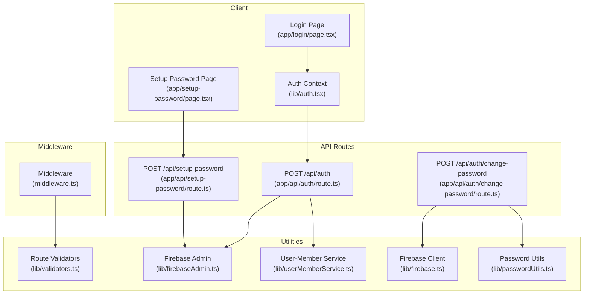
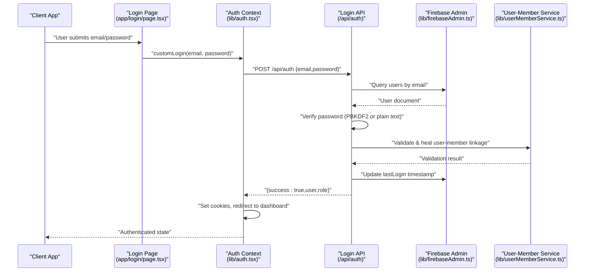
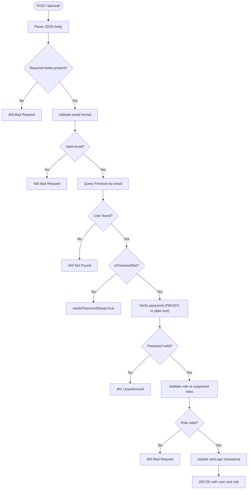
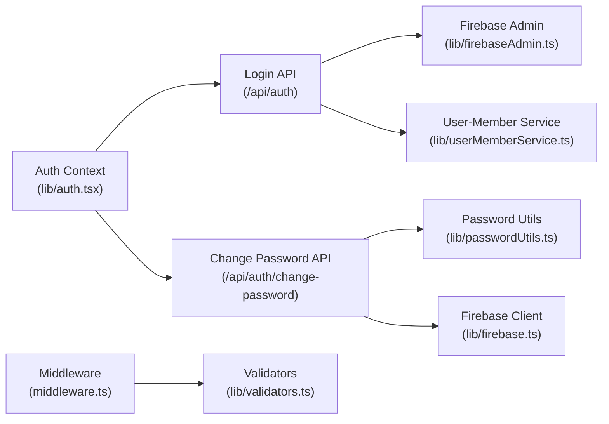

# Authentication API

<cite>
**Referenced Files in This Document**
- [route.ts](file://app/api/auth/route.ts)
- [route.ts](file://app/api/auth/change-password/route.ts)
- [route.ts](file://app/api/setup-password/route.ts)
- [auth.tsx](file://lib/auth.tsx)
- [passwordUtils.ts](file://lib/passwordUtils.ts)
- [firebaseAdmin.ts](file://lib/firebaseAdmin.ts)
- [firebase.ts](file://lib/firebase.ts)
- [middleware.ts](file://middleware.ts)
- [validators.ts](file://lib/validators.ts)
- [userMemberService.ts](file://lib/userMemberService.ts)
- [page.tsx](file://app/login/page.tsx)
- [page.tsx](file://app/setup-password/page.tsx)
- [ROLE_BASED_ACCESS_CONTROL.md](file://ROLE_BASED_ACCESS_CONTROL.md)
</cite>

## Table of Contents
1. [Introduction](#introduction)
2. [Project Structure](#project-structure)
3. [Core Components](#core-components)
4. [Architecture Overview](#architecture-overview)
5. [Detailed Component Analysis](#detailed-component-analysis)
6. [Dependency Analysis](#dependency-analysis)
7. [Performance Considerations](#performance-considerations)
8. [Troubleshooting Guide](#troubleshooting-guide)
9. [Conclusion](#conclusion)
10. [Appendices](#appendices)

## Introduction
This document provides comprehensive API documentation for the authentication endpoints in the SAMPA Cooperative Management System. It focuses on:
- The main login endpoint (/api/auth) with POST method, including request/response schemas, password verification (PBKDF2 with salt, timing-safe comparison), backward compatibility with plain text passwords, and role validation.
- Password setup endpoint (/api/setup-password) for initial user registration and change password endpoint (/api/auth/change-password) for authenticated users.
- Authentication flow, security considerations (rate limiting, session management), and integration examples for client applications.

## Project Structure
The authentication system spans server-side API routes, client-side authentication context, and supporting utilities for Firebase integration, password hashing, and role-based routing.

**Diagram sources**
- [route.ts](file://app/api/auth/route.ts#L48-L264)
- [route.ts](file://app/api/auth/change-password/route.ts#L5-L98)
- [route.ts](file://app/api/setup-password/route.ts#L25-L146)
- [auth.tsx](file://lib/auth.tsx#L158-L348)
- [passwordUtils.ts](file://lib/passwordUtils.ts#L4-L62)
- [firebaseAdmin.ts](file://lib/firebaseAdmin.ts#L111-L266)
- [firebase.ts](file://lib/firebase.ts#L90-L307)
- [validators.ts](file://lib/validators.ts#L199-L235)
- [userMemberService.ts](file://lib/userMemberService.ts#L99-L198)
- [middleware.ts](file://middleware.ts#L5-L56)

**Section sources**
- [route.ts](file://app/api/auth/route.ts#L48-L264)
- [route.ts](file://app/api/auth/change-password/route.ts#L5-L98)
- [route.ts](file://app/api/setup-password/route.ts#L25-L146)
- [auth.tsx](file://lib/auth.tsx#L158-L348)
- [passwordUtils.ts](file://lib/passwordUtils.ts#L4-L62)
- [firebaseAdmin.ts](file://lib/firebaseAdmin.ts#L111-L266)
- [firebase.ts](file://lib/firebase.ts#L90-L307)
- [validators.ts](file://lib/validators.ts#L199-L235)
- [userMemberService.ts](file://lib/userMemberService.ts#L99-L198)
- [middleware.ts](file://middleware.ts#L5-L56)

## Core Components
- Login API (/api/auth):
  - Validates JSON payload, email format, and presence of credentials.
  - Queries Firestore for user by email.
  - Enforces password policy: hashed PBKDF2 with salt or legacy plain text.
  - Uses timing-safe string comparison to prevent timing attacks.
  - Validates role against supported roles array and normalizes role values.
  - Updates lastLogin timestamp and performs user-member linkage validation.
  - Returns user object with uid, email, displayName, role, lastLogin.

- Password Setup API (/api/setup-password):
  - Validates email and password strength.
  - Ensures account exists and password is not yet set.
  - Hashes password using PBKDF2 with salt and stores in Firestore.

- Change Password API (/api/auth/change-password):
  - Validates input and user existence by email.
  - Verifies current password using PBKDF2 with stored salt.
  - Updates password hash and salt, and propagates to members collection if present.

- Client Integration:
  - Auth context handles login flow, sets cookies, and redirects to role-specific dashboards.
  - Login and setup pages integrate with the APIs and display user-friendly feedback.

**Section sources**
- [route.ts](file://app/api/auth/route.ts#L48-L264)
- [route.ts](file://app/api/auth/change-password/route.ts#L5-L98)
- [route.ts](file://app/api/setup-password/route.ts#L25-L146)
- [auth.tsx](file://lib/auth.tsx#L197-L348)
- [page.tsx](file://app/login/page.tsx#L26-L79)
- [page.tsx](file://app/setup-password/page.tsx#L94-L132)

## Architecture Overview
The authentication flow integrates client-side UI, serverless API routes, Firebase Admin SDK for server-side queries, and client-side Firebase for password updates. Middleware enforces role-based routing and session cookies.

**Diagram sources**
- [page.tsx](file://app/login/page.tsx#L26-L79)
- [auth.tsx](file://lib/auth.tsx#L356-L514)
- [route.ts](file://app/api/auth/route.ts#L48-L264)
- [firebaseAdmin.ts](file://lib/firebaseAdmin.ts#L150-L194)
- [userMemberService.ts](file://lib/userMemberService.ts#L99-L198)

## Detailed Component Analysis

### Login Endpoint (/api/auth)
- Method: POST
- Request Body Schema:
  - email: string (required, validated format)
  - password: string (required)
- Response Format:
  - success: boolean
  - user: object
    - uid: string
    - email: string
    - displayName: string | null
    - role: string
    - lastLogin: string | null
  - role: string (included for client-side routing)
  - error: string | null (on failure)
  - needsPasswordSetup: boolean | null (on password-not-set scenario)

- Processing Logic:
  - Parses JSON body and validates presence of email and password.
  - Validates email format using regex.
  - Queries Firestore for user by email.
  - Checks isPasswordSet flag; if false, returns needsPasswordSetup indicator.
  - Verifies password:
    - New format: PBKDF2-HMAC-SHA256 with 100k iterations and random salt.
    - Legacy format: timing-safe comparison against stored plain text password.
  - Validates role against supported roles array; normalizes role to lowercase and trims whitespace.
  - Updates lastLogin timestamp in Firestore.
  - Validates and heals user-member linkage.
  - Returns success with user object and role.

- Error Responses:
  - 400: Invalid JSON, missing email/password, invalid email format, password not set, invalid role.
  - 401: Incorrect password.
  - 404: Account not found.
  - 500: Internal server error.

**Diagram sources**
- [route.ts](file://app/api/auth/route.ts#L48-L264)

**Section sources**
- [route.ts](file://app/api/auth/route.ts#L48-L264)

### Password Setup Endpoint (/api/setup-password)
- Method: POST
- Request Body Schema:
  - email: string (required, validated format)
  - password: string (required, minimum 8 characters)
- Response Format:
  - success: boolean
  - message: string | null (on success)
  - error: string | null (on failure)

- Processing Logic:
  - Validates email and password strength.
  - Queries Firestore for user by email.
  - Ensures isPasswordSet is false.
  - Hashes password using PBKDF2 with salt and stores passwordHash, salt, and isPasswordSet.

- Error Responses:
  - 400: Missing fields, invalid email, weak password, password already set, account not found.
  - 500: Internal server error.

**Section sources**
- [route.ts](file://app/api/setup-password/route.ts#L25-L146)

### Change Password Endpoint (/api/auth/change-password)
- Method: POST
- Request Body Schema:
  - email: string (required)
  - currentPassword: string (required)
  - newPassword: string (required, minimum 6 characters)
- Response Format:
  - success: boolean
  - message: string | null (on success)
  - error: string | null (on failure)

- Processing Logic:
  - Validates input and password length.
  - Queries Firestore by email to retrieve user ID.
  - Uses password utility to verify current password with PBKDF2 and stored salt.
  - Hashes new password and updates both users and members collections if present.

- Error Responses:
  - 400: Missing fields, invalid email, weak password, user not found.
  - 401: Current password incorrect.
  - 500: Internal server error.

**Section sources**
- [route.ts](file://app/api/auth/change-password/route.ts#L5-L98)
- [passwordUtils.ts](file://lib/passwordUtils.ts#L4-L62)

### Client Integration and Session Management
- Client-side login flow:
  - The login page triggers customLogin which calls the Login API.
  - On success, cookies are set for authenticated and userRole, and the user is redirected to their role-specific dashboard.
  - On needsPasswordSetup, the client redirects to the setup-password page.

- Middleware and role-based routing:
  - Middleware reads authentication cookies and enforces route access based on user roles.
  - Validators define allowed paths per role and prevent cross-access between admin and user dashboards.

- Security considerations:
  - Cookies are not HTTP-only to allow client-side access for role-based routing.
  - Logout clears cookies, localStorage, and sessionStorage to prevent session persistence.

**Section sources**
- [page.tsx](file://app/login/page.tsx#L26-L79)
- [auth.tsx](file://lib/auth.tsx#L197-L348)
- [middleware.ts](file://middleware.ts#L5-L56)
- [validators.ts](file://lib/validators.ts#L199-L235)
- [ROLE_BASED_ACCESS_CONTROL.md](file://ROLE_BASED_ACCESS_CONTROL.md#L1-L89)

## Dependency Analysis
The authentication system exhibits clear separation of concerns:
- API routes depend on Firebase Admin SDK for Firestore operations.
- Client-side authentication context orchestrates UI flows and cookie management.
- Password utilities encapsulate PBKDF2 hashing and verification.
- Middleware and validators enforce role-based access control.

**Diagram sources**
- [auth.tsx](file://lib/auth.tsx#L158-L348)
- [route.ts](file://app/api/auth/route.ts#L48-L264)
- [route.ts](file://app/api/auth/change-password/route.ts#L5-L98)
- [firebaseAdmin.ts](file://lib/firebaseAdmin.ts#L111-L266)
- [firebase.ts](file://lib/firebase.ts#L90-L307)
- [passwordUtils.ts](file://lib/passwordUtils.ts#L4-L62)
- [middleware.ts](file://middleware.ts#L5-L56)
- [validators.ts](file://lib/validators.ts#L199-L235)

**Section sources**
- [auth.tsx](file://lib/auth.tsx#L158-L348)
- [route.ts](file://app/api/auth/route.ts#L48-L264)
- [route.ts](file://app/api/auth/change-password/route.ts#L5-L98)
- [firebaseAdmin.ts](file://lib/firebaseAdmin.ts#L111-L266)
- [firebase.ts](file://lib/firebase.ts#L90-L307)
- [passwordUtils.ts](file://lib/passwordUtils.ts#L4-L62)
- [middleware.ts](file://middleware.ts#L5-L56)
- [validators.ts](file://lib/validators.ts#L199-L235)

## Performance Considerations
- PBKDF2 cost parameters:
  - 100k iterations with SHA-256 provide strong security; consider monitoring login latency and adjusting parameters if needed.
- Database queries:
  - Single-field equality query on email is efficient; ensure Firestore indexes are configured accordingly.
- Asynchronous operations:
  - Password hashing and Firestore updates are asynchronous; errors are handled gracefully without failing the login flow.

[No sources needed since this section provides general guidance]

## Troubleshooting Guide
Common issues and resolutions:
- Invalid credentials:
  - Ensure email and password are provided and formatted correctly.
  - Verify password meets strength requirements and matches stored hash.
- Account not found:
  - Confirm the email exists in the users collection.
- Password not set:
  - Redirect to setup-password endpoint to configure a password.
- Invalid role:
  - Ensure the user’s role is one of the supported roles and normalized to lowercase.
- Database initialization errors:
  - Check Firebase Admin credentials and environment variables.
- Middleware redirect loops:
  - Verify cookies are set correctly and validators permit access to the requested route.

**Section sources**
- [route.ts](file://app/api/auth/route.ts#L70-L192)
- [route.ts](file://app/api/setup-password/route.ts#L30-L104)
- [firebaseAdmin.ts](file://lib/firebaseAdmin.ts#L13-L108)
- [validators.ts](file://lib/validators.ts#L199-L235)

## Conclusion
The SAMPA Cooperative Management System implements a robust, role-aware authentication system with secure password handling, clear API contracts, and client-side integration. The documented endpoints and flows enable reliable authentication, password management, and role-based routing across the application.

[No sources needed since this section summarizes without analyzing specific files]

## Appendices

### API Definitions

- POST /api/auth
  - Request: { email: string, password: string }
  - Success Response: { success: true, user: { uid, email, displayName, role, lastLogin }, role: string }
  - Error Responses: 400 (invalid input/format, role validation), 401 (incorrect password), 404 (account not found), 500 (internal error)

- POST /api/setup-password
  - Request: { email: string, password: string }
  - Success Response: { success: true, message: string }
  - Error Responses: 400 (invalid input/format, password already set, account not found), 500 (internal error)

- POST /api/auth/change-password
  - Request: { email: string, currentPassword: string, newPassword: string }
  - Success Response: { success: true, message: string }
  - Error Responses: 400 (invalid input/format, user not found), 401 (incorrect current password), 500 (internal error)

### Supported Roles
- Admin: admin, secretary, chairman, vice chairman, manager, treasurer, board of directors
- User: member, driver, operator

**Section sources**
- [route.ts](file://app/api/auth/route.ts#L177-L192)
- [ROLE_BASED_ACCESS_CONTROL.md](file://ROLE_BASED_ACCESS_CONTROL.md#L9-L24)