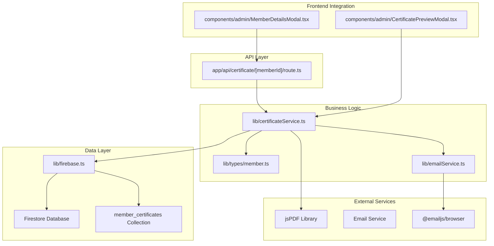
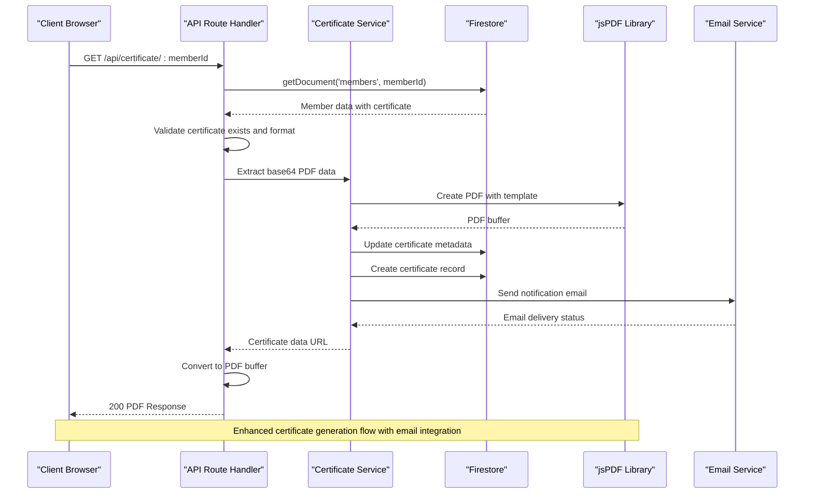
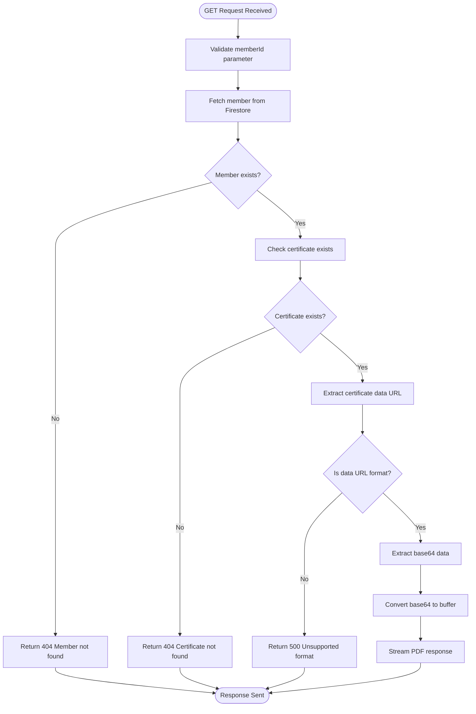
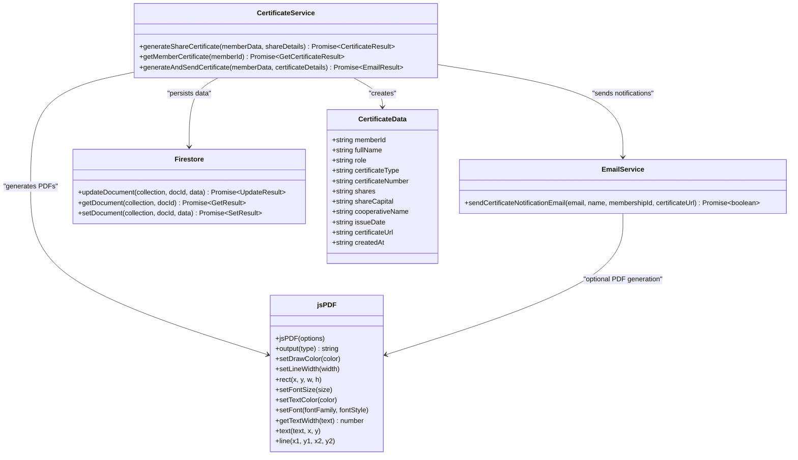
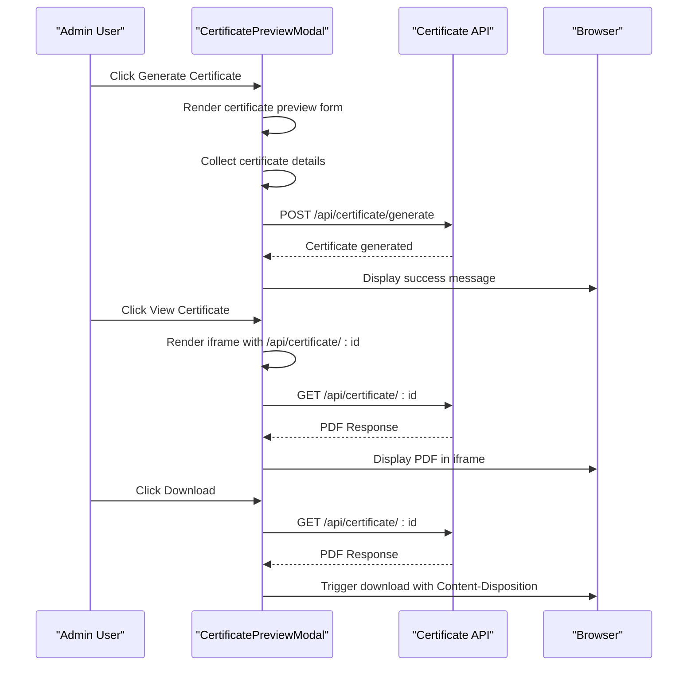
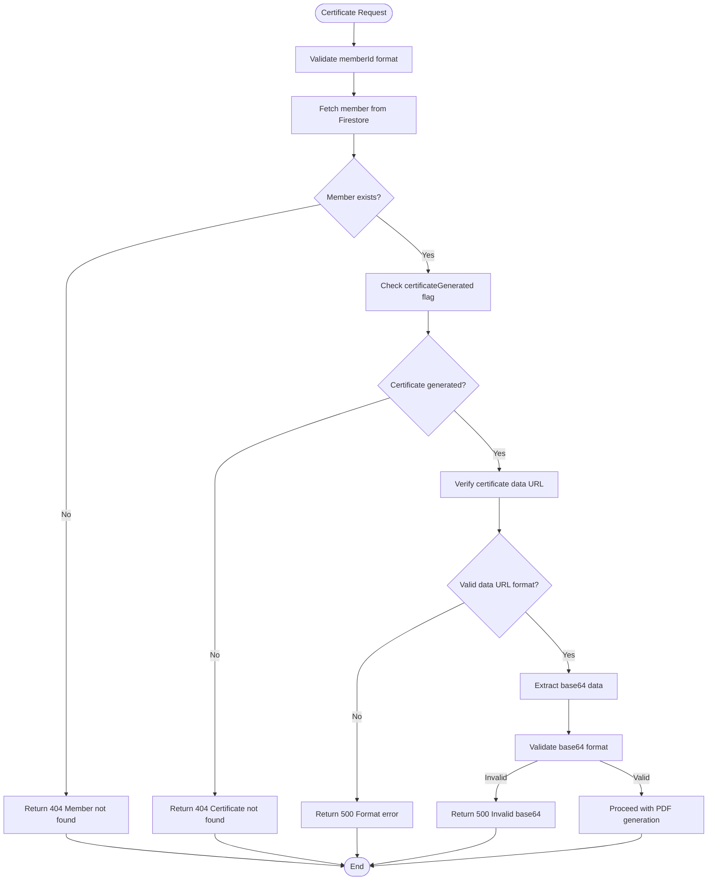

# Certificate Generation API

<cite>
**Referenced Files in This Document**
- [route.ts](file://app/api/certificate/[memberId]/route.ts)
- [certificateService.ts](file://lib/certificateService.ts)
- [firebase.ts](file://lib/firebase.ts)
- [member.ts](file://lib/types/member.ts)
- [MemberDetailsModal.tsx](file://components/admin/MemberDetailsModal.tsx)
- [CertificatePreviewModal.tsx](file://components/admin/CertificatePreviewModal.tsx)
- [package.json](file://package.json)
- [emailService.ts](file://lib/emailService.ts)
</cite>

## Update Summary
**Changes Made**
- Enhanced certificate generation API with improved error handling and validation
- Expanded certificate types support beyond membership certificates to include share certificates
- Integrated email notification system for automatic certificate delivery
- Added comprehensive certificate data validation and format checking
- Implemented certificate tracking system with member_certificates collection
- Enhanced frontend integration with certificate preview modal and generation workflow

## Table of Contents
1. [Introduction](#introduction)
2. [Project Structure](#project-structure)
3. [Core Components](#core-components)
4. [Architecture Overview](#architecture-overview)
5. [Detailed Component Analysis](#detailed-component-analysis)
6. [API Specification](#api-specification)
7. [Certificate Templates and Data Models](#certificate-templates-and-data-models)
8. [Validation and Security](#validation-and-security)
9. [Integration Examples](#integration-examples)
10. [Performance Considerations](#performance-considerations)
11. [Troubleshooting Guide](#troubleshooting-guide)
12. [Conclusion](#conclusion)

## Introduction
This document provides comprehensive API documentation for the certificate generation endpoints, focusing on PDF export functionality for member certificates. The system now supports multiple certificate types including membership and share certificates, with enhanced error handling, comprehensive validation, and integrated email notification system for automatic certificate delivery. The API covers GET endpoint for certificate retrieval, certificate types (membership, share certificates), template selection, request/response schemas, dynamic content injection, member information embedding, official formatting, validation processes, PDF generation workflow using jsPDF, template customization, branding requirements, examples of certificate templates, dynamic content placeholders, batch certificate generation considerations, security features, and integration examples for automated issuance, email delivery, and storage management.

## Project Structure
The certificate generation functionality spans several key areas with enhanced capabilities:
- API route handler for retrieving certificates via GET requests with improved error handling
- Certificate service for generating and retrieving multiple certificate types (membership, share)
- Firebase integration for Firestore document operations and certificate tracking
- TypeScript types for member and certificate data structures
- Frontend integration for certificate display, download, and generation workflow
- Email service integration for automatic certificate delivery notifications
- Dependencies for PDF generation, email services, and certificate management



**Diagram sources**
- [route.ts:1-68](file://app/api/certificate/[memberId]/route.ts#L1-L68)
- [certificateService.ts:1-393](file://lib/certificateService.ts#L1-L393)
- [firebase.ts:90-307](file://lib/firebase.ts#L90-L307)
- [member.ts:27-85](file://lib/types/member.ts#L27-L85)
- [CertificatePreviewModal.tsx:1-495](file://components/admin/CertificatePreviewModal.tsx#L1-L495)
- [MemberDetailsModal.tsx:225-266](file://components/admin/MemberDetailsModal.tsx#L225-L266)
- [emailService.ts:1-281](file://lib/emailService.ts#L1-L281)

**Section sources**
- [route.ts:1-68](file://app/api/certificate/[memberId]/route.ts#L1-L68)
- [certificateService.ts:1-393](file://lib/certificateService.ts#L1-L393)
- [firebase.ts:1-309](file://lib/firebase.ts#L1-L309)
- [member.ts:1-85](file://lib/types/member.ts#L1-L85)
- [CertificatePreviewModal.tsx:1-495](file://components/admin/CertificatePreviewModal.tsx#L1-L495)
- [MemberDetailsModal.tsx:1-271](file://components/admin/MemberDetailsModal.tsx#L1-L271)
- [emailService.ts:1-281](file://lib/emailService.ts#L1-L281)

## Core Components
The certificate generation system consists of four primary components with enhanced functionality:

### API Route Handler
The Next.js API route handles GET requests for certificate retrieval with comprehensive error handling, parameter validation, and content-type checking for PDF data URLs.

### Certificate Service
Provides certificate generation functions for multiple certificate types using jsPDF for PDF creation, Firestore for data persistence, and email notifications for automatic delivery.

### Firebase Integration
Manages Firestore operations including document retrieval, updates, certificate tracking, and connection validation across multiple collections.

### Email Service Integration
Handles automatic email notifications for certificate generation with configurable templates and error handling for email delivery failures.

**Section sources**
- [route.ts:4-68](file://app/api/certificate/[memberId]/route.ts#L4-L68)
- [certificateService.ts:10-393](file://lib/certificateService.ts#L10-L393)
- [firebase.ts:90-307](file://lib/firebase.ts#L90-L307)
- [emailService.ts:145-176](file://lib/emailService.ts#L145-L176)

## Architecture Overview
The certificate generation workflow follows a clear separation of concerns with enhanced error handling and email integration:



**Diagram sources**
- [route.ts:4-68](file://app/api/certificate/[memberId]/route.ts#L4-L68)
- [certificateService.ts:317-393](file://lib/certificateService.ts#L317-L393)
- [firebase.ts:115-146](file://lib/firebase.ts#L115-L146)
- [emailService.ts:145-176](file://lib/emailService.ts#L145-L176)

## Detailed Component Analysis

### API Route Handler Analysis
The route handler implements robust error handling and content negotiation with enhanced validation:



**Diagram sources**
- [route.ts:4-68](file://app/api/certificate/[memberId]/route.ts#L4-L68)

Key features:
- Parameter decoding for special characters
- Comprehensive error handling with appropriate HTTP status codes
- Content-type validation for PDF data URLs
- Proper response headers for PDF streaming
- Enhanced certificate format validation

**Section sources**
- [route.ts:4-68](file://app/api/certificate/[memberId]/route.ts#L4-L68)

### Certificate Service Analysis
The certificate service implements multiple certificate generation types with official formatting and email integration:



**Diagram sources**
- [certificateService.ts:12-393](file://lib/certificateService.ts#L12-L393)
- [emailService.ts:145-176](file://lib/emailService.ts#L145-L176)
- [member.ts:27-85](file://lib/types/member.ts#L27-L85)

**Section sources**
- [certificateService.ts:12-393](file://lib/certificateService.ts#L12-L393)
- [emailService.ts:145-176](file://lib/emailService.ts#L145-L176)
- [member.ts:27-85](file://lib/types/member.ts#L27-L85)

### Frontend Integration Analysis
The frontend provides comprehensive certificate viewing, download, and generation capabilities:



**Diagram sources**
- [CertificatePreviewModal.tsx:103-119](file://components/admin/CertificatePreviewModal.tsx#L103-L119)
- [route.ts:46-53](file://app/api/certificate/[memberId]/route.ts#L46-L53)
- [MemberDetailsModal.tsx:248-266](file://components/admin/MemberDetailsModal.tsx#L248-L266)

**Section sources**
- [CertificatePreviewModal.tsx:103-119](file://components/admin/CertificatePreviewModal.tsx#L103-L119)
- [MemberDetailsModal.tsx:248-266](file://components/admin/MemberDetailsModal.tsx#L248-L266)

## API Specification

### Endpoint Definition
**GET** `/api/certificate/[memberId]`

#### Path Parameters
- `memberId` (string, required): Unique identifier of the member whose certificate is requested

#### Query Parameters
None

#### Request Headers
- `Accept`: `application/pdf` (recommended for direct PDF rendering)

#### Response Codes
- `200 OK`: Certificate PDF successfully returned
- `404 Not Found`: Member not found or certificate not generated
- `500 Internal Server Error`: Server-side processing error or unsupported certificate format

#### Success Response
- **Content-Type**: `application/pdf`
- **Content-Disposition**: `inline; filename="membership-certificate-{memberId}.pdf"`
- **Content-Length**: Binary length of PDF data
- **Body**: PDF binary data

#### Error Responses
- **404 Not Found**: `{ error: "Member not found" }`
- **404 Not Found**: `{ error: "Certificate not found for this member" }`
- **500 Internal Server Error**: `{ error: "Certificate format not supported" }`
- **500 Internal Server Error**: `{ error: "Internal server error" }`

### Enhanced Certificate Generation Endpoint
**POST** `/api/certificate/generate`

#### Request Body
```json
{
  "memberData": {
    "id": "string",
    "firstName": "string",
    "lastName": "string",
    "middleName": "string",
    "suffix": "string",
    "email": "string",
    "phoneNumber": "string",
    "createdAt": "string"
  },
  "certificateDetails": {
    "certificateNumber": "string",
    "shares": "string",
    "shareCapital": "string",
    "cooperativeName": "string",
    "day": "string",
    "month": "string",
    "year": "string",
    "secretaryName": "string",
    "chairmanName": "string"
  }
}
```

#### Response
```json
{
  "success": true,
  "certificateUrl": "data:application/pdf;base64,...",
  "certificateNumber": "string"
}
```

**Section sources**
- [route.ts:4-68](file://app/api/certificate/[memberId]/route.ts#L4-L68)
- [certificateService.ts:317-393](file://lib/certificateService.ts#L317-L393)

## Certificate Templates and Data Models

### Certificate Types
The system now supports multiple certificate types with enhanced functionality:
- **Membership certificates** (legacy support)
- **Share certificates** (primary focus with enhanced features)
- **Loan certificates** (future expansion potential)
- **Savings certificates** (future expansion potential)
- **Good standing certificates** (future expansion potential)

### Template Structure
The share certificate template includes comprehensive official cooperative branding:
- **Official cooperative branding** (header, decorative borders, seal)
- **Certificate title and subtitle** with legal disclaimers
- **Member identification details** in structured table format
- **Signature and seal placeholders** with official styling
- **Legal text sections** with transfer restrictions
- **Footer with shares information** and par value details
- **Timestamped certificate creation** with issue date

### Data Model Schema

#### CertificateData Object
| Field | Type | Description |
|-------|------|-------------|
| `memberId` | string | Member's unique identifier |
| `fullName` | string | Complete member name |
| `role` | string | Member's role in cooperative |
| `certificateType` | string | Type of certificate generated |
| `certificateNumber` | string | Unique certificate identifier |
| `shares` | string | Number of shares held |
| `shareCapital` | string | Share capital description |
| `cooperativeName` | string | Cooperative name |
| `issueDate` | string | ISO date string of certificate issue |
| `secretaryName` | string | Secretary's name |
| `chairmanName` | string | Chairman's name |
| `certificateUrl` | string | Base64-encoded PDF data URL |
| `createdAt` | string | ISO timestamp of certificate creation |

#### Enhanced Member Object Extension
| Field | Type | Description |
|-------|------|-------------|
| `shareCertificate` | CertificateData | Generated share certificate data |
| `shareCertificateGenerated` | boolean | Flag indicating share certificate availability |
| `shareCertificateGeneratedAt` | string | ISO timestamp of share certificate generation |
| `certificate` | CertificateData | Legacy membership certificate data |
| `certificateGenerated` | boolean | Legacy flag for membership certificate |
| `certificateGeneratedAt` | string | Legacy timestamp for membership certificate |

### Dynamic Content Placeholders
Template supports dynamic content injection through:
- Member name concatenation (firstName, middleName, lastName, suffix)
- Role-based formatting
- Registration date localization
- Automatic table generation from member data
- Interactive certificate preview with real-time updates
- Configurable certificate numbers and share details

**Section sources**
- [member.ts:27-85](file://lib/types/member.ts#L27-L85)
- [certificateService.ts:12-393](file://lib/certificateService.ts#L12-L393)
- [CertificatePreviewModal.tsx:58-101](file://components/admin/CertificatePreviewModal.tsx#L58-L101)

## Validation and Security

### Enhanced Member Verification Process


**Diagram sources**
- [route.ts:14-44](file://app/api/certificate/[memberId]/route.ts#L14-L44)

### Enhanced Data Integrity Validation
- Member ID parameter validation with URL decoding
- Firestore document existence verification
- Certificate data URL format validation with dual parsing logic
- Base64 data extraction and conversion with fallback handling
- Response content-type verification
- Certificate type validation for different certificate formats
- Email notification delivery confirmation

### Security Features
Enhanced implementation includes:
- Parameter encoding/decoding for safe member IDs with URL decoding
- Firestore-based certificate storage with separate collections
- PDF streaming without exposing internal storage paths
- Basic access control through member existence checks
- Email service configuration validation
- Certificate tracking with timestamps and status monitoring
- Secure certificate number generation with unique identifiers

**Section sources**
- [route.ts:8-44](file://app/api/certificate/[memberId]/route.ts#L8-L44)
- [certificateService.ts:339-393](file://lib/certificateService.ts#L339-L393)
- [firebase.ts:115-146](file://lib/firebase.ts#L115-L146)

## Integration Examples

### Enhanced Automated Certificate Issuance
```typescript
// Example: Generate share certificate with email notification
async function onMemberRegistration(memberData: Member) {
  const certificateDetails = {
    certificateNumber: `SC-${Date.now().toString().slice(-8)}`,
    shares: '100',
    shareCapital: 'Common Share Capital',
    cooperativeName: 'SAMPA COOPERATIVE',
    day: new Date().getDate().toString(),
    month: new Date().toLocaleString('en-US', { month: 'long' }),
    year: new Date().getFullYear().toString(),
    secretaryName: '',
    chairmanName: ''
  };

  const result = await generateAndSendCertificate(memberData, certificateDetails);
  
  if (result.success) {
    console.log('Certificate generated and email sent successfully');
    return result.certificateUrl;
  } else {
    console.error('Certificate generation failed:', result.error);
    throw new Error(result.error);
  }
}
```

### Advanced Email Delivery Integration
```typescript
// Example: Send certificate via email after generation with tracking
async function sendCertificateEmail(memberId: string, emailAddress: string) {
  try {
    // Generate certificate
    const memberResult = await firestore.getDocument('members', memberId);
    const certificateUrl = memberResult.data.shareCertificate.certificateUrl;
    
    // Configure email with certificate attachment and tracking
    const emailData = {
      to_email: emailAddress,
      to_name: `${memberResult.data.firstName} ${memberResult.data.lastName}`,
      membership_id: memberResult.data.id,
      certificate_url: `/api/certificate/${memberId}`,
      subject: 'Your Official Share Certificate - SAMPA Cooperative',
      message: 'Please find your share certificate attached.'
    };
    
    // Send email with certificate link
    const emailResult = await sendCertificateNotificationEmail(
      emailAddress,
      `${memberResult.data.firstName} ${memberResult.data.lastName}`,
      memberResult.data.id,
      `/api/certificate/${memberId}`
    );
    
    if (emailResult) {
      // Update certificate status to sent
      await firestore.updateDocument('member_certificates', memberResult.data.id, {
        sentAt: new Date().toISOString(),
        status: 'sent'
      });
    }
    
    return emailResult;
  } catch (error) {
    console.error('Email delivery failed:', error);
    throw error;
  }
}
```

### Enhanced Storage Management
```typescript
// Example: Batch certificate generation with email notifications
async function generateBatchCertificates(memberIds: string[]) {
  const results = await Promise.all(
    memberIds.map(async (id) => {
      const memberResult = await firestore.getDocument('members', id);
      if (memberResult.success && memberResult.data.shareCertificateGenerated) {
        return generateAndSendCertificate(memberResult.data, {
          certificateNumber: `SC-${Date.now().toString().slice(-8)}`,
          shares: '100',
          shareCapital: 'Common Share Capital',
          cooperativeName: 'SAMPA COOPERATIVE',
          day: new Date().getDate().toString(),
          month: new Date().toLocaleString('en-US', { month: 'long' }),
          year: new Date().getFullYear().toString(),
          secretaryName: '',
          chairmanName: ''
        });
      }
      return { success: false, error: 'Member not eligible' };
    })
  );
  
  return results;
}
```

**Section sources**
- [certificateService.ts:317-393](file://lib/certificateService.ts#L317-L393)
- [emailService.ts:145-176](file://lib/emailService.ts#L145-L176)

## Performance Considerations
- PDF generation occurs on-demand with enhanced caching potential
- Certificate data stored as base64 in Firestore for immediate retrieval
- Email notifications processed asynchronously for better performance
- Certificate tracking system enables efficient query optimization
- Consider implementing certificate caching for frequently accessed certificates
- Large PDFs may impact response times; consider compression options
- Firestore queries optimized for single document retrieval by ID
- Email service configuration validation reduces runtime errors

## Troubleshooting Guide

### Common Issues and Solutions

#### Certificate Not Found Errors
**Symptoms**: 404 responses when requesting certificates
**Causes**: 
- Member ID doesn't exist in database
- Certificate not yet generated for member
- Incorrect member ID format or encoding issues
- Certificate type mismatch (membership vs share)

**Solutions**:
- Verify member exists in Firestore members collection
- Ensure certificate generation process completed successfully
- Check for proper URL encoding of member IDs containing special characters
- Verify certificate type matches expected format (share vs membership)

#### Enhanced PDF Generation Failures
**Symptoms**: 500 errors during certificate retrieval
**Causes**:
- Invalid base64 data format with dual parsing logic failure
- jsPDF library initialization issues
- Firestore connection problems
- Email service configuration errors

**Solutions**:
- Validate certificate data URL format starts with "data:application/pdf"
- Check jsPDF library dependencies in package.json
- Verify Firestore connection and authentication
- Validate EmailJS configuration with proper environment variables
- Implement fallback mechanisms for certificate format detection

#### Email Delivery Issues
**Symptoms**: Certificate generation succeeds but email not delivered
**Causes**:
- Missing EmailJS configuration (public key, service ID, template ID)
- Invalid email addresses or formatting issues
- Email service rate limiting or quota exceeded
- Network connectivity issues

**Solutions**:
- Verify NEXT_PUBLIC_EMAILJS_PUBLIC_KEY, NEXT_PUBLIC_EMAILJS_SERVICE_ID, and NEXT_PUBLIC_EMAILJS_TEMPLATE_ID environment variables
- Test email service initialization with console logs
- Implement retry mechanisms for email delivery
- Monitor email service status and error rates

#### Performance Issues
**Symptoms**: Slow certificate loading times or generation delays
**Causes**:
- Large PDF file sizes
- High concurrent request volume
- Network latency issues
- Email service processing delays
- Firestore query performance bottlenecks

**Solutions**:
- Implement certificate caching mechanisms
- Consider PDF compression options
- Deploy CDN for static certificate delivery
- Optimize Firestore queries and indexes
- Implement asynchronous email processing
- Monitor and scale email service resources

**Section sources**
- [route.ts:61-67](file://app/api/certificate/[memberId]/route.ts#L61-L67)
- [certificateService.ts:270-276](file://lib/certificateService.ts#L270-L276)
- [emailService.ts:45-65](file://lib/emailService.ts#L45-L65)

## Conclusion
The enhanced certificate generation API provides a robust foundation for issuing multiple types of certificates with official formatting, comprehensive error handling, and integrated email notification system. The system now supports share certificates as the primary certificate type while maintaining backward compatibility with membership certificates. Key improvements include enhanced error handling, comprehensive certificate data validation, expanded certificate types support, automatic email delivery notifications, and certificate tracking system. The architecture demonstrates clear separation of concerns with proper PDF streaming, secure storage, and seamless frontend integration. Future enhancements could include additional certificate types (loan, savings, good standing), advanced security features, improved performance optimizations, and enhanced certificate management interfaces for administrative oversight.