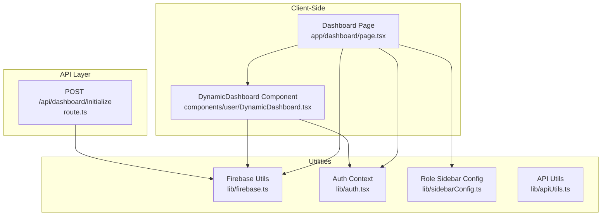
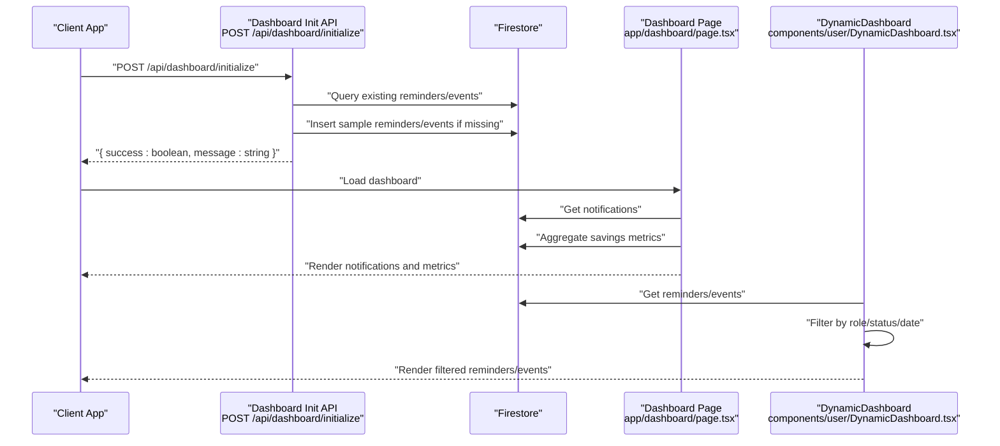
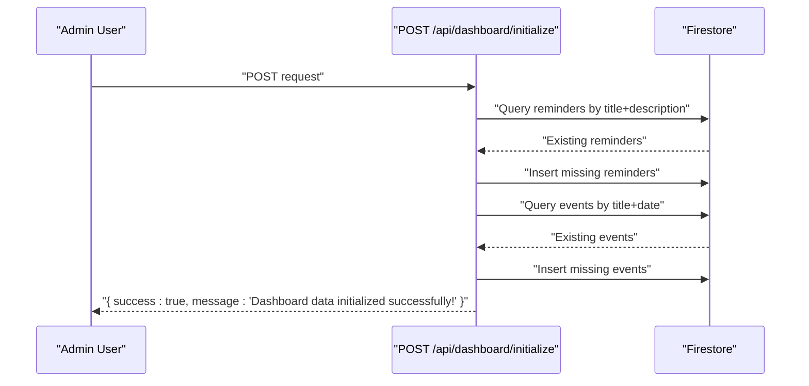
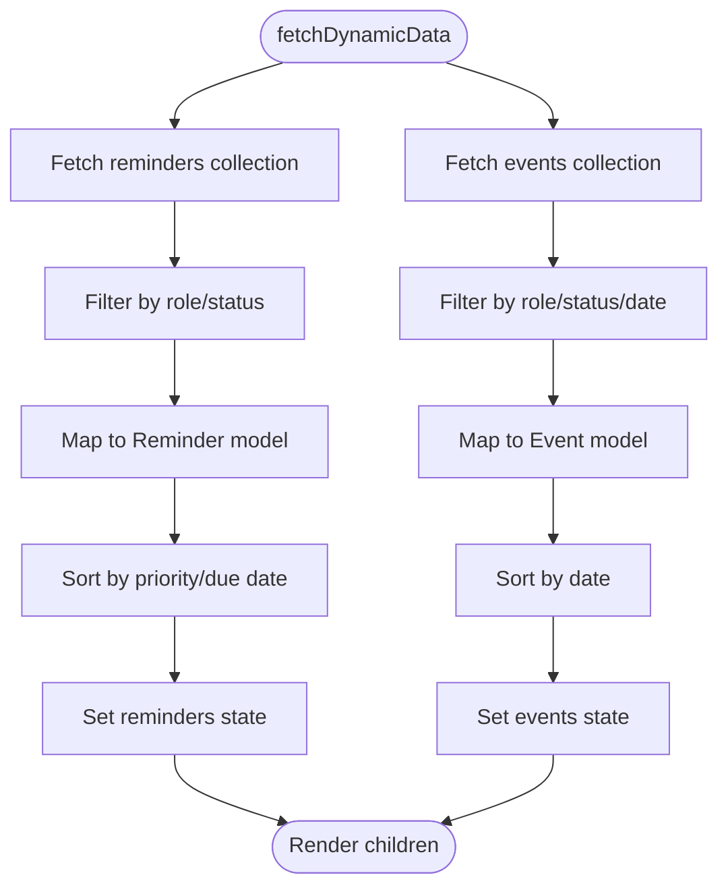
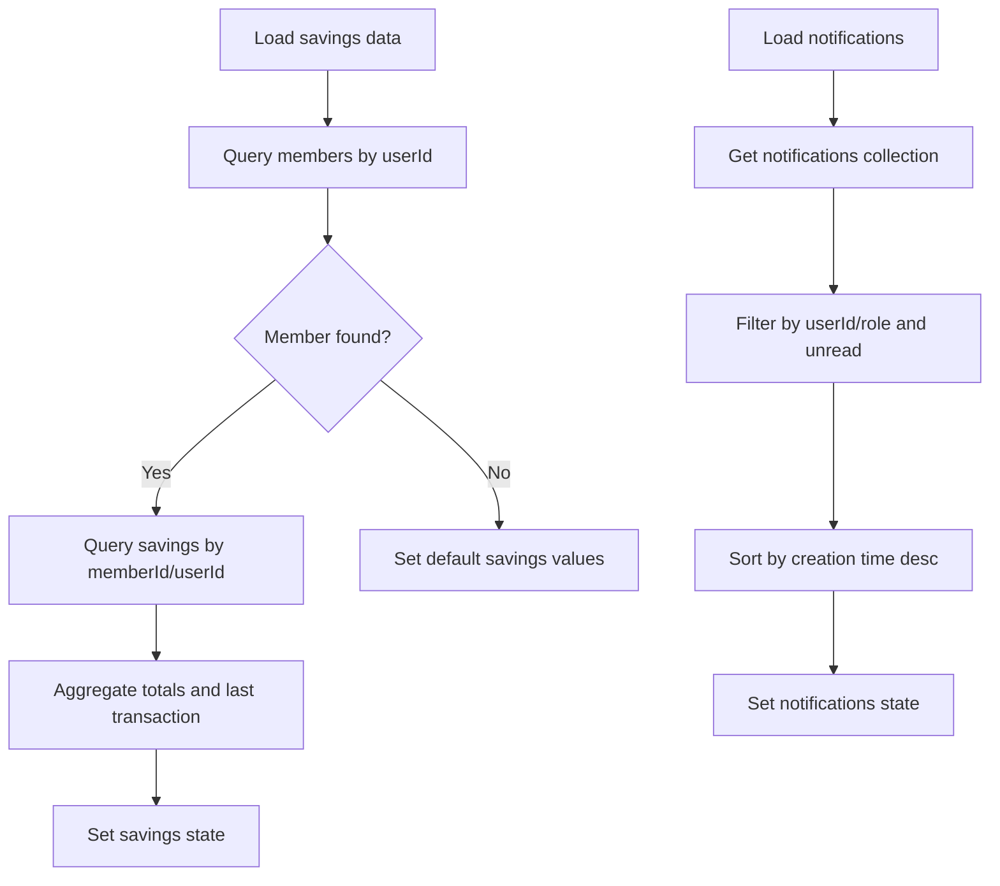
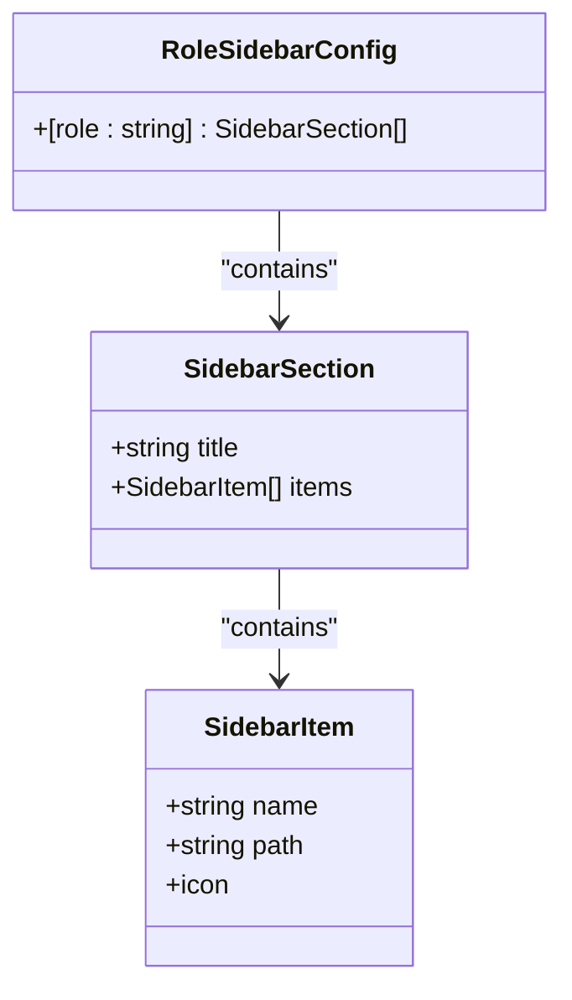
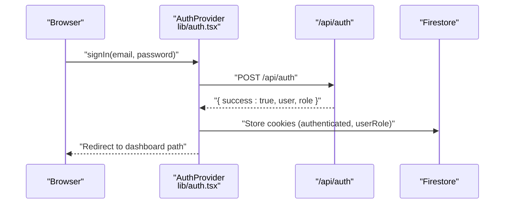
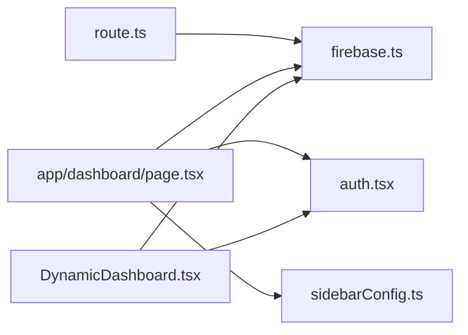

# Dashboard Initialization API

<cite>
**Referenced Files in This Document**
- [route.ts](file://app/api/dashboard/initialize/route.ts)
- [DynamicDashboard.tsx](file://components/user/DynamicDashboard.tsx)
- [page.tsx](file://app/dashboard/page.tsx)
- [sidebarConfig.ts](file://lib/sidebarConfig.ts)
- [firebase.ts](file://lib/firebase.ts)
- [apiUtils.ts](file://lib/apiUtils.ts)
- [auth.tsx](file://lib/auth.tsx)
</cite>

## Table of Contents
1. [Introduction](#introduction)
2. [Project Structure](#project-structure)
3. [Core Components](#core-components)
4. [Architecture Overview](#architecture-overview)
5. [Detailed Component Analysis](#detailed-component-analysis)
6. [Dependency Analysis](#dependency-analysis)
7. [Performance Considerations](#performance-considerations)
8. [Troubleshooting Guide](#troubleshooting-guide)
9. [Conclusion](#conclusion)

## Introduction
This document provides comprehensive API documentation for the dashboard initialization and user-specific data loading functionality. It covers:
- The dashboard initialization endpoint that seeds reminders and events into Firestore
- User context loading and role-based menu generation
- Recent activity retrieval and system status information
- Request/response schemas for dashboard data including user profile, role permissions, recent activities, notifications, and personalized metrics
- Data aggregation processes for dashboard summaries, trend analysis, and performance indicators
- Caching strategies, real-time updates, and data freshness guarantees
- Examples of dashboard data structures, user preference storage, and role-based content filtering
- Performance optimization techniques and integration examples for rendering, real-time updates, and user preference synchronization

## Project Structure
The dashboard initialization feature spans API routes, client-side components, and utility libraries:
- API route for seeding dashboard data
- Client-side dashboard page and dynamic data loader
- Role-based sidebar configuration
- Firebase utilities for Firestore operations
- Authentication utilities for user context and role resolution

**Diagram sources**
- [route.ts](file://app/api/dashboard/initialize/route.ts#L1-L186)
- [page.tsx](file://app/dashboard/page.tsx#L1-L312)
- [DynamicDashboard.tsx](file://components/user/DynamicDashboard.tsx#L1-L149)
- [firebase.ts](file://lib/firebase.ts#L1-L309)
- [auth.tsx](file://lib/auth.tsx#L1-L682)
- [sidebarConfig.ts](file://lib/sidebarConfig.ts#L1-L262)
- [apiUtils.ts](file://lib/apiUtils.ts#L1-L109)

**Section sources**
- [route.ts](file://app/api/dashboard/initialize/route.ts#L1-L186)
- [page.tsx](file://app/dashboard/page.tsx#L1-L312)
- [DynamicDashboard.tsx](file://components/user/DynamicDashboard.tsx#L1-L149)
- [firebase.ts](file://lib/firebase.ts#L1-L309)
- [auth.tsx](file://lib/auth.tsx#L1-L682)
- [sidebarConfig.ts](file://lib/sidebarConfig.ts#L1-L262)
- [apiUtils.ts](file://lib/apiUtils.ts#L1-L109)

## Core Components
- Dashboard initialization API: Seeds reminders and events into Firestore and returns a success/failure response
- Dynamic dashboard component: Loads and filters reminders and events per user role and status
- Dashboard page: Aggregates savings metrics for members and displays notifications
- Firebase utilities: Provides standardized Firestore operations and error handling
- Authentication context: Supplies user context and role for filtering and routing
- Role-based sidebar configuration: Defines role-specific navigation menus

**Section sources**
- [route.ts](file://app/api/dashboard/initialize/route.ts#L1-L186)
- [DynamicDashboard.tsx](file://components/user/DynamicDashboard.tsx#L1-L149)
- [page.tsx](file://app/dashboard/page.tsx#L1-L312)
- [firebase.ts](file://lib/firebase.ts#L1-L309)
- [auth.tsx](file://lib/auth.tsx#L1-L682)
- [sidebarConfig.ts](file://lib/sidebarConfig.ts#L1-L262)

## Architecture Overview
The dashboard initialization and data loading architecture integrates API-driven seeding with client-side filtering and aggregation.

**Diagram sources**
- [route.ts](file://app/api/dashboard/initialize/route.ts#L1-L186)
- [page.tsx](file://app/dashboard/page.tsx#L1-L312)
- [DynamicDashboard.tsx](file://components/user/DynamicDashboard.tsx#L1-L149)
- [firebase.ts](file://lib/firebase.ts#L1-L309)

## Detailed Component Analysis

### Dashboard Initialization Endpoint
- Purpose: Seed reminders and events collections with sample data if they do not exist
- Method: POST
- Path: /api/dashboard/initialize
- Request body: None (uses hardcoded sample data)
- Response:
  - Success: { success: true, message: string }
  - Failure: { success: false, message: string, error: string }

**Diagram sources**
- [route.ts](file://app/api/dashboard/initialize/route.ts#L1-L186)

**Section sources**
- [route.ts](file://app/api/dashboard/initialize/route.ts#L1-L186)

### Dynamic Dashboard Data Loading
- Component: DynamicDashboard
- Responsibilities:
  - Load reminders and events from Firestore
  - Filter by user role ('all', specific role) and status ('active', 'published')
  - Sort reminders by priority and due date; sort events by upcoming date
  - Provide data to child components

**Diagram sources**
- [DynamicDashboard.tsx](file://components/user/DynamicDashboard.tsx#L1-L149)

**Section sources**
- [DynamicDashboard.tsx](file://components/user/DynamicDashboard.tsx#L1-L149)

### Member Dashboard Metrics and Notifications
- Component: DashboardPage
- Responsibilities:
  - Aggregate savings metrics for members (current balance, total deposits, withdrawals, last transaction)
  - Load and filter notifications based on user role targeting and unread status
  - Render notifications dropdown with status badges and timestamps

**Diagram sources**
- [page.tsx](file://app/dashboard/page.tsx#L1-L312)

**Section sources**
- [page.tsx](file://app/dashboard/page.tsx#L1-L312)

### Role-Based Menu Generation
- Utility: roleSidebarConfig
- Behavior: Returns role-specific sidebar sections and items
- Fallback: Defaults to admin config if role not found

**Diagram sources**
- [sidebarConfig.ts](file://lib/sidebarConfig.ts#L1-L262)

**Section sources**
- [sidebarConfig.ts](file://lib/sidebarConfig.ts#L1-L262)

### Authentication and User Context
- Context: AuthProvider supplies user, loading state, and role
- Dashboard path resolution: getDashboardPath maps roles to specific dashboards
- Cookie-based session: Stores authenticated user ID and role

**Diagram sources**
- [auth.tsx](file://lib/auth.tsx#L1-L682)

**Section sources**
- [auth.tsx](file://lib/auth.tsx#L1-L682)

### Request/Response Schemas

#### Dashboard Initialization Response
- Success response:
  - success: boolean
  - message: string
- Failure response:
  - success: boolean
  - message: string
  - error: string

#### Dynamic Dashboard Data Models
- Reminder
  - id: string
  - title: string
  - description: string
  - status: string
  - createdAt: string
  - dueDate: string (optional)
  - userId: string (optional)
  - userRole: string (optional)
  - priority: 'low' | 'medium' | 'high' (default: 'medium')

- Event
  - id: string
  - title: string
  - description: string
  - date: string
  - location: string (optional)
  - status: string
  - createdAt: string
  - userRole: string (optional)
  - applicableTo: string[] (optional)

#### Member Dashboard Metrics
- savingsData:
  - currentBalance: string
  - totalDeposits: string
  - totalWithdrawals: string
  - lastTransaction: string

#### Notifications
- Notification item:
  - id: string
  - title: string
  - message: string
  - type: string
  - status: string
  - createdAt: string
  - userId: string (optional)
  - userRole: string (optional)

**Section sources**
- [route.ts](file://app/api/dashboard/initialize/route.ts#L1-L186)
- [DynamicDashboard.tsx](file://components/user/DynamicDashboard.tsx#L1-L149)
- [page.tsx](file://app/dashboard/page.tsx#L1-L312)

### Data Aggregation and Trend Analysis
- Savings aggregation:
  - Sum deposits and withdrawals by memberId/userId
  - Compute current balance as difference
  - Track last transaction date
- Notifications:
  - Filter by target audience (userId, userRole, 'all')
  - Sort by creation time descending
  - Badge unread/new notifications
- Reminders and Events:
  - Filter by role ('all' or matching user role)
  - Filter by status ('active', 'published')
  - Sort reminders by priority and due date; sort events by upcoming date

**Section sources**
- [page.tsx](file://app/dashboard/page.tsx#L1-L312)
- [DynamicDashboard.tsx](file://components/user/DynamicDashboard.tsx#L1-L149)

### Caching Strategies and Data Freshness
- Client-side caching:
  - React state for reminders, events, notifications, and savings data
  - Loading flags to avoid redundant fetches
- Firestore queries:
  - Current implementation fetches on mount and when user context changes
  - No explicit TTL or cache-control headers configured in the provided code
- Recommendations:
  - Implement in-memory cache with expiry for frequent reads
  - Use Firestore query cursors or pagination for large datasets
  - Introduce optimistic updates and background refetch strategies
  - Consider client-side indexing for role/status/date filters

**Section sources**
- [DynamicDashboard.tsx](file://components/user/DynamicDashboard.tsx#L1-L149)
- [page.tsx](file://app/dashboard/page.tsx#L1-L312)
- [firebase.ts](file://lib/firebase.ts#L1-L309)

### Real-Time Updates and Integration Examples
- Real-time updates:
  - Current implementation uses on-demand fetches; no Firestore listeners are shown
  - To enable real-time updates, integrate Firestore listeners in components and update state accordingly
- Integration examples:
  - Dashboard page: Subscribe to notifications and savings collections; update UI reactively
  - Dynamic dashboard: Subscribe to reminders and events; apply role-based filters and sorting
  - User preference synchronization: Store preferences in Firestore under user document and sync via listeners

**Section sources**
- [page.tsx](file://app/dashboard/page.tsx#L1-L312)
- [DynamicDashboard.tsx](file://components/user/DynamicDashboard.tsx#L1-L149)

## Dependency Analysis
The dashboard initialization and data loading depend on:
- Firebase utilities for Firestore operations
- Authentication context for user role and ID
- Role-based sidebar configuration for navigation
- API utilities for standardized responses (used in other routes; relevant for consistency)

**Diagram sources**
- [route.ts](file://app/api/dashboard/initialize/route.ts#L1-L186)
- [page.tsx](file://app/dashboard/page.tsx#L1-L312)
- [DynamicDashboard.tsx](file://components/user/DynamicDashboard.tsx#L1-L149)
- [firebase.ts](file://lib/firebase.ts#L1-L309)
- [auth.tsx](file://lib/auth.tsx#L1-L682)
- [sidebarConfig.ts](file://lib/sidebarConfig.ts#L1-L262)

**Section sources**
- [route.ts](file://app/api/dashboard/initialize/route.ts#L1-L186)
- [page.tsx](file://app/dashboard/page.tsx#L1-L312)
- [DynamicDashboard.tsx](file://components/user/DynamicDashboard.tsx#L1-L149)
- [firebase.ts](file://lib/firebase.ts#L1-L309)
- [auth.tsx](file://lib/auth.tsx#L1-L682)
- [sidebarConfig.ts](file://lib/sidebarConfig.ts#L1-L262)

## Performance Considerations
- Data prefetching:
  - Preload user context and role before rendering dashboard components
  - Fetch notifications and savings data concurrently after user context is ready
- Lazy loading:
  - Defer loading of heavy widgets until user interacts or scrolls into view
  - Split dashboard into sections and load progressively
- Efficient query patterns:
  - Use Firestore composite indexes for role/status/date filters
  - Limit query result sizes and paginate when necessary
- Caching:
  - Implement short-lived cache for frequently accessed data
  - Invalidate cache on user actions that modify data
- Rendering:
  - Memoize computed metrics and filtered lists
  - Use virtualized lists for long event/reminders lists

[No sources needed since this section provides general guidance]

## Troubleshooting Guide
- API route errors:
  - Ensure Firebase is initialized before Firestore operations
  - Validate request body parsing and error handling
  - Confirm consistent JSON responses using standardized utilities
- Client-side data loading:
  - Verify user context is loaded before fetching dashboard data
  - Check Firestore rules permit read access to collections
  - Inspect network tab for failed queries and permission-denied errors
- Role-based filtering:
  - Normalize role strings to lowercase for matching
  - Confirm role fallback defaults to admin configuration
- Notifications and metrics:
  - Validate notification targeting logic (userId, userRole, 'all')
  - Ensure savings aggregation handles missing or malformed data gracefully

**Section sources**
- [apiUtils.ts](file://lib/apiUtils.ts#L1-L109)
- [firebase.ts](file://lib/firebase.ts#L1-L309)
- [auth.tsx](file://lib/auth.tsx#L1-L682)
- [sidebarConfig.ts](file://lib/sidebarConfig.ts#L1-L262)
- [page.tsx](file://app/dashboard/page.tsx#L1-L312)
- [DynamicDashboard.tsx](file://components/user/DynamicDashboard.tsx#L1-L149)

## Conclusion
The dashboard initialization and user-specific data loading system combines a seeding API route with client-side filtering and aggregation. By leveraging role-based configurations, standardized Firestore utilities, and robust authentication context, the system supports personalized dashboards with reminders, events, notifications, and metrics. For production readiness, implement real-time listeners, caching strategies, and optimized query patterns to ensure responsiveness and scalability.