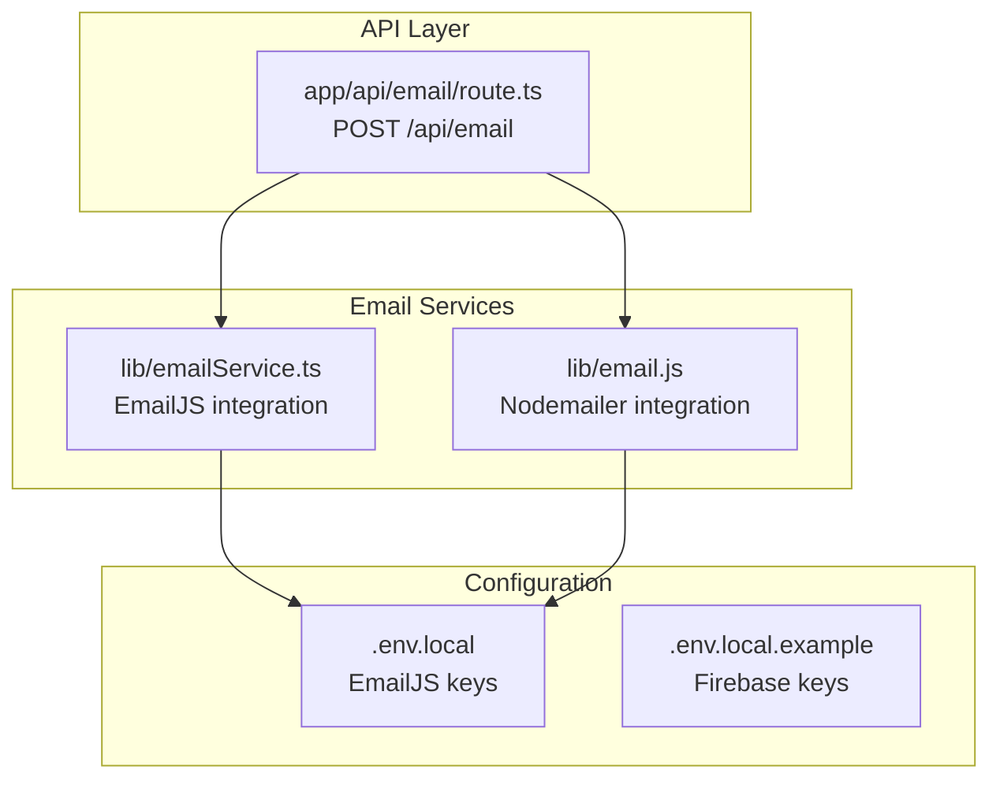
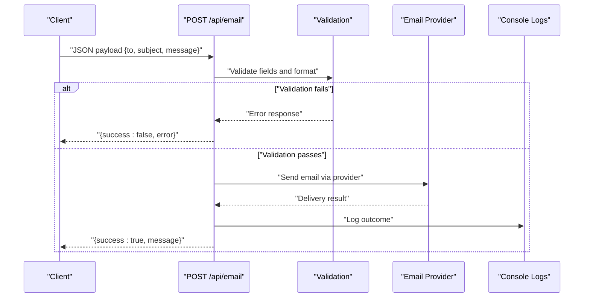
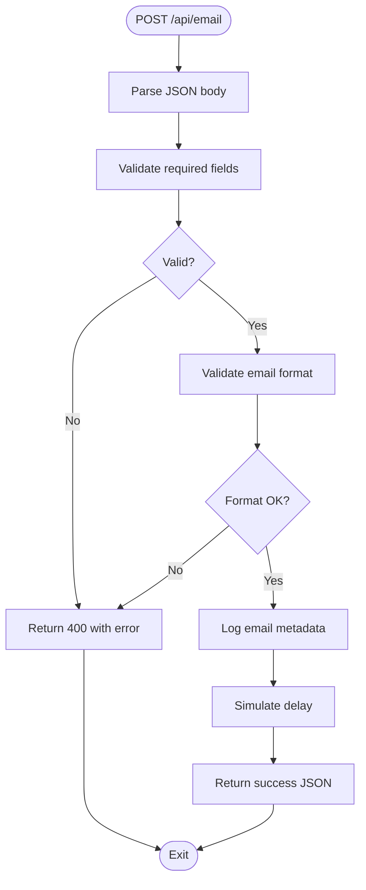
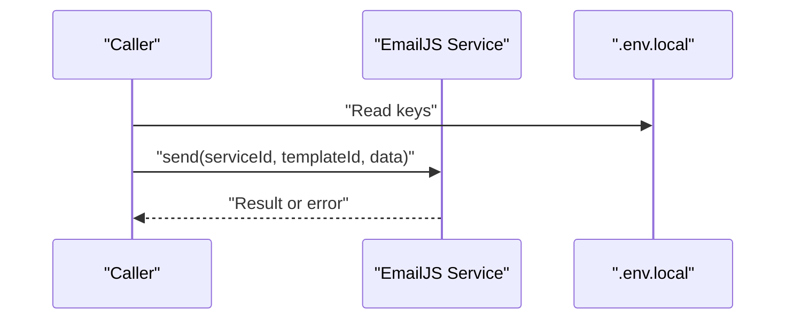
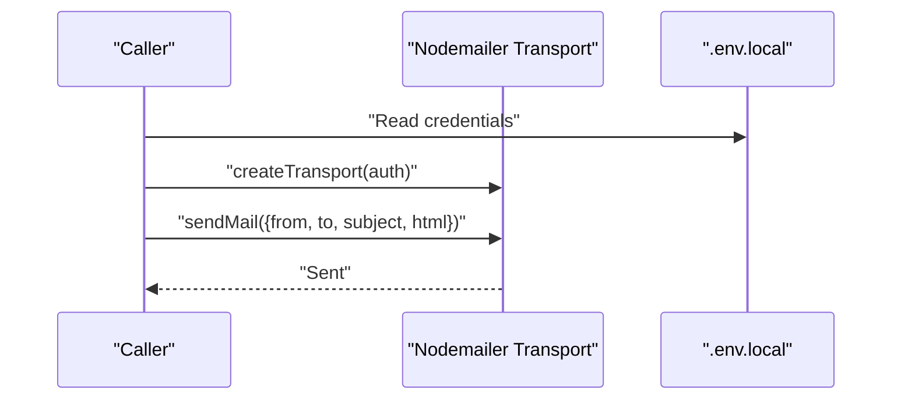
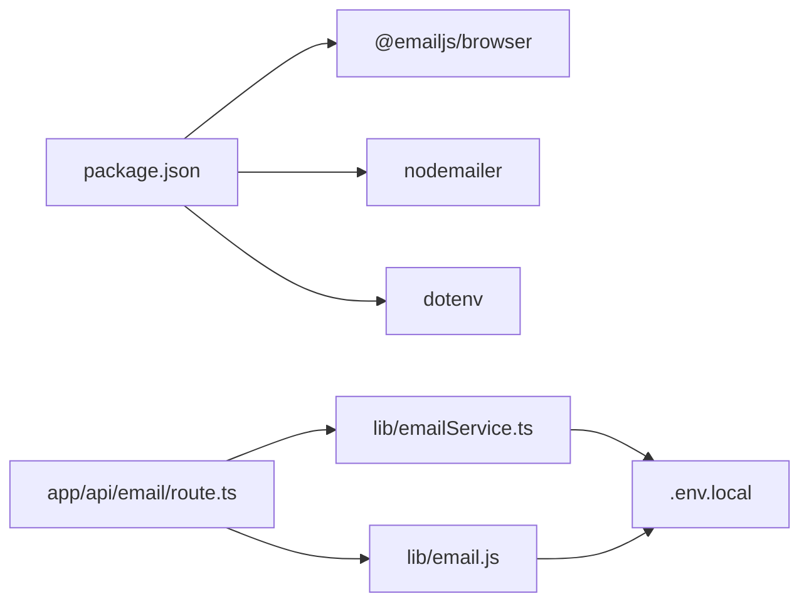

# Email Notification API

<cite>
**Referenced Files in This Document**
- [route.ts](file://app/api/email/route.ts)
- [emailService.ts](file://lib/emailService.ts)
- [email.js](file://lib/email.js)
- [.env.local](file://.env.local)
- [.env.local.example](file://.env.local.example)
- [package.json](file://package.json)
- [API_BEST_PRACTICES.md](file://docs/API_BEST_PRACTICES.md)
- [API_JSON_RESPONSES.md](file://docs/API_JSON_RESPONSES.md)
</cite>

## Table of Contents
1. [Introduction](#introduction)
2. [Project Structure](#project-structure)
3. [Core Components](#core-components)
4. [Architecture Overview](#architecture-overview)
5. [Detailed Component Analysis](#detailed-component-analysis)
6. [Dependency Analysis](#dependency-analysis)
7. [Performance Considerations](#performance-considerations)
8. [Troubleshooting Guide](#troubleshooting-guide)
9. [Conclusion](#conclusion)
10. [Appendices](#appendices)

## Introduction
This document provides comprehensive API documentation for the email notification endpoints, focusing on automated email delivery and template management. It covers:
- The POST endpoint for sending emails, including request schema, recipient information, email template selection, dynamic content variables, and delivery options.
- Email template management with creation, editing, and version control strategies.
- Email queue management for bulk operations, retry mechanisms, and delivery tracking.
- Email service integrations with EmailJS and Nodemailer, including configuration options, SMTP settings, and API keys.
- Request/response schemas for email objects with fields such as emailId, templateName, recipients, subject, bodyContent, sentAt, and deliveryStatus.
- Examples of email templates for different scenarios (welcome, password reset, loan approval, certificate issuance), dynamic content injection, and error handling.
- Deliverability best practices, spam prevention, and compliance requirements including GDPR considerations.

## Project Structure
The email notification functionality spans two primary areas:
- An API route that exposes a POST endpoint for sending emails.
- Two email service libraries: one integrating with EmailJS and another with Nodemailer.

**Diagram sources**
- [route.ts](file://app/api/email/route.ts#L1-L87)
- [emailService.ts](file://lib/emailService.ts#L1-L113)
- [email.js](file://lib/email.js#L1-L28)
- [.env.local](file://.env.local#L1-L9)
- [.env.local.example](file://.env.local.example#L1-L10)

**Section sources**
- [route.ts](file://app/api/email/route.ts#L1-L87)
- [emailService.ts](file://lib/emailService.ts#L1-L113)
- [email.js](file://lib/email.js#L1-L28)
- [.env.local](file://.env.local#L1-L9)
- [.env.local.example](file://.env.local.example#L1-L10)

## Core Components
- Email API route: Validates incoming requests, performs basic checks, and returns standardized JSON responses. It currently logs and simulates sending behavior and does not yet integrate with a production email provider.
- EmailJS service: Encapsulates EmailJS initialization and templated email sending, including convenience functions for common scenarios (registration, auto-credentials, loan approval).
- Nodemailer service: Provides a transport configured for Gmail with environment-based credentials for sending transactional emails.

Key responsibilities:
- Validate and sanitize inputs.
- Integrate with external email providers.
- Return consistent JSON responses with success/error indicators.
- Support template-driven content with dynamic variables.

**Section sources**
- [route.ts](file://app/api/email/route.ts#L4-L56)
- [emailService.ts](file://lib/emailService.ts#L1-L38)
- [email.js](file://lib/email.js#L6-L27)

## Architecture Overview
The email notification architecture consists of:
- A Next.js API route that accepts POST requests.
- A service layer that selects and invokes an email provider (EmailJS or Nodemailer).
- Environment variables for provider credentials.

**Diagram sources**
- [route.ts](file://app/api/email/route.ts#L4-L56)
- [emailService.ts](file://lib/emailService.ts#L19-L38)
- [email.js](file://lib/email.js#L6-L27)

## Detailed Component Analysis

### POST /api/email Endpoint
Purpose:
- Accepts a JSON payload to send an email.
- Validates presence and format of the recipient email address.
- Returns standardized JSON responses for success and error conditions.

Request schema:
- Required fields:
  - to: string (email address)
  - subject: string
  - message: string
- Optional fields:
  - Additional provider-specific fields can be included depending on the selected provider.

Response schema:
- On success:
  - success: boolean (true)
  - message: string
- On failure:
  - success: boolean (false)
  - error: string

Behavior highlights:
- Uses a regex to validate email format.
- Logs the outgoing email metadata.
- Simulates a short delay to mimic network latency.

**Diagram sources**
- [route.ts](file://app/api/email/route.ts#L4-L56)

**Section sources**
- [route.ts](file://app/api/email/route.ts#L4-L56)

### EmailJS Integration (lib/emailService.ts)
Purpose:
- Initialize EmailJS with environment-provided keys.
- Provide a generic sendEmail function and specialized functions for common templates.

Key elements:
- Environment variables:
  - NEXT_PUBLIC_EMAILJS_PUBLIC_KEY
  - NEXT_PUBLIC_EMAILJS_SERVICE_ID
  - NEXT_PUBLIC_EMAILJS_TEMPLATE_ID
- Generic sendEmail(templateId, emailData):
  - Validates configuration.
  - Sends the email using EmailJS.
  - Returns a boolean indicating success/failure.
- Specialized functions:
  - sendMemberRegistrationEmail(email, name)
  - sendAutoCredentialsEmail(email, name, tempPassword)
  - sendLoanApprovalEmail(email, name, loanId)

Dynamic content variables:
- The specialized functions inject variables such as reset_link, temp_password, and loan_id into the email payload.

**Diagram sources**
- [emailService.ts](file://lib/emailService.ts#L1-L38)
- [.env.local](file://.env.local#L1-L4)

**Section sources**
- [emailService.ts](file://lib/emailService.ts#L1-L113)
- [.env.local](file://.env.local#L1-L4)

### Nodemailer Integration (lib/email.js)
Purpose:
- Configure a transport using Nodemailer with Gmail.
- Send a simple HTML email with a link.

Key elements:
- Transport configuration:
  - Service: "gmail"
  - Auth: user and pass from environment variables
- Environment variables:
  - EMAIL_FORM
  - EMAIL_PASS
  - EMAIL_FROM

**Diagram sources**
- [email.js](file://lib/email.js#L6-L27)
- [.env.local](file://.env.local#L1-L9)

**Section sources**
- [email.js](file://lib/email.js#L1-L28)
- [.env.local](file://.env.local#L1-L9)

### Email Template Management
Current state:
- The EmailJS service includes predefined functions that encapsulate common templates and dynamic variables.
- There is no dedicated template CRUD API in the current codebase.

Recommended approach:
- Create a template management API with endpoints for:
  - Listing templates
  - Creating templates
  - Updating templates
  - Versioning templates
  - Deleting templates (soft delete recommended)
- Store templates in a persistent storage (e.g., Firestore) with fields such as:
  - templateId
  - name
  - subject
  - body (HTML or Markdown)
  - variables (array of supported placeholders)
  - isActive
  - createdAt
  - updatedAt
  - version

Dynamic content injection:
- Use the variables array to validate and inject dynamic values at send time.
- Sanitize HTML content to prevent XSS.

Version control:
- Maintain a version history per template.
- Allow rollback to previous versions.

**Section sources**
- [emailService.ts](file://lib/emailService.ts#L41-L113)

### Email Queue Management and Delivery Tracking
Current state:
- The API route simulates sending and does not enqueue emails.
- There is no delivery tracking mechanism.

Recommended implementation:
- Introduce a queue system (e.g., Firestore collection or Redis) to store pending email jobs with fields:
  - jobId
  - templateId
  - recipient
  - subject
  - body
  - variables
  - status (pending, processing, delivered, failed)
  - retries
  - maxRetries
  - createdAt
  - updatedAt
  - deliveredAt
- Background worker:
  - Poll the queue for pending jobs.
  - Attempt delivery using the selected provider.
  - Update job status and handle retries with exponential backoff.
- Retry mechanisms:
  - Max retries configurable.
  - Backoff strategy (e.g., 1s, 5s, 30s, 5m).
  - Failure reasons categorized (invalid email, provider error, rate limit).
- Delivery tracking:
  - Record timestamps for sent/delivered/failed states.
  - Optionally integrate with provider webhooks for event callbacks.

**Section sources**
- [route.ts](file://app/api/email/route.ts#L32-L37)

### Request and Response Schemas
Request schema (POST /api/email):
- to: string (required)
- subject: string (required)
- message: string (required)
- Additional provider-specific fields (optional)

Response schema (success):
- success: boolean (true)
- message: string

Response schema (error):
- success: boolean (false)
- error: string

Email object schema (proposed for queue and tracking):
- emailId: string
- templateName: string
- recipients: array of strings
- subject: string
- bodyContent: string
- sentAt: timestamp
- deliveryStatus: enum (pending, processing, delivered, failed)
- errorMessage: string (optional)
- retries: number
- maxRetries: number

**Section sources**
- [route.ts](file://app/api/email/route.ts#L6-L18)
- [route.ts](file://app/api/email/route.ts#L39-L45)

### Email Templates for Different Scenarios
Examples of templates and dynamic variables:
- Welcome email:
  - Variables: to_name, reset_link
  - Purpose: welcome new members and guide them to set up passwords
- Auto-credentials email:
  - Variables: to_name, email, temp_password
  - Purpose: provide initial login credentials
- Loan approval email:
  - Variables: to_name, loan_id
  - Purpose: notify members of loan approval
- Certificate issuance email:
  - Variables: to_name, certificate_url
  - Purpose: notify members of certificate generation

Dynamic content injection:
- Inject variables into the email payload before sending.
- Ensure variables are sanitized and validated.

**Section sources**
- [emailService.ts](file://lib/emailService.ts#L41-L113)

## Dependency Analysis
External dependencies:
- @emailjs/browser: Used by the EmailJS service for browser-based email sending.
- nodemailer: Used by the Nodemailer service for SMTP-based email sending.
- dotenv: Loads environment variables from .env files.

Internal dependencies:
- The API route depends on the email service libraries for actual sending.
- Environment variables are consumed by both services.

**Diagram sources**
- [package.json](file://package.json#L16-L39)
- [route.ts](file://app/api/email/route.ts#L1-L2)
- [emailService.ts](file://lib/emailService.ts#L1-L1)
- [email.js](file://lib/email.js#L1-L4)
- [.env.local](file://.env.local#L1-L9)

**Section sources**
- [package.json](file://package.json#L16-L39)
- [emailService.ts](file://lib/emailService.ts#L1-L1)
- [email.js](file://lib/email.js#L1-L4)
- [route.ts](file://app/api/email/route.ts#L1-L2)

## Performance Considerations
- Asynchronous processing: Offload email sending to a queue to avoid blocking the API request.
- Rate limiting: Respect provider rate limits and implement throttling.
- Retries: Use exponential backoff to reduce load on providers during outages.
- Caching: Cache frequently used templates to minimize provider calls.
- Monitoring: Track delivery metrics and error rates to optimize performance.

## Troubleshooting Guide
Common issues and resolutions:
- Missing environment variables:
  - Ensure NEXT_PUBLIC_EMAILJS_PUBLIC_KEY, NEXT_PUBLIC_EMAILJS_SERVICE_ID, NEXT_PUBLIC_EMAILJS_TEMPLATE_ID are set.
  - For Nodemailer, ensure EMAIL_FORM, EMAIL_PASS, EMAIL_FROM are configured.
- Invalid email format:
  - The API route validates the recipient email; ensure it matches the expected format.
- Provider errors:
  - EmailJS: Check serviceId, templateId, and public key.
  - Nodemailer: Verify credentials and transport configuration.
- JSON response errors:
  - Ensure all routes return JSON using standardized patterns.

Best practices:
- Use standardized response utilities to maintain consistent JSON responses.
- Log errors without exposing sensitive details.
- Validate request bodies and handle parsing errors gracefully.

**Section sources**
- [route.ts](file://app/api/email/route.ts#L10-L30)
- [emailService.ts](file://lib/emailService.ts#L20-L24)
- [email.js](file://lib/email.js#L7-L13)
- [API_BEST_PRACTICES.md](file://docs/API_BEST_PRACTICES.md#L1-L230)
- [API_JSON_RESPONSES.md](file://docs/API_JSON_RESPONSES.md#L1-L139)

## Conclusion
The current email notification API provides a foundation for sending emails with validation and standardized responses. To achieve full automation, template management, queueing, retries, and delivery tracking, extend the implementation by:
- Adding a template management API and persistent storage.
- Implementing a queue system with a background worker.
- Integrating provider webhooks for delivery tracking.
- Enhancing error handling and observability.

These enhancements will improve reliability, scalability, and maintainability while ensuring compliance with deliverability best practices and GDPR requirements.

## Appendices

### Configuration Options
- EmailJS:
  - NEXT_PUBLIC_EMAILJS_PUBLIC_KEY
  - NEXT_PUBLIC_EMAILJS_SERVICE_ID
  - NEXT_PUBLIC_EMAILJS_TEMPLATE_ID
- Nodemailer (Gmail):
  - EMAIL_FORM
  - EMAIL_PASS
  - EMAIL_FROM

**Section sources**
- [.env.local](file://.env.local#L1-L9)
- [.env.local.example](file://.env.local.example#L1-L10)
- [emailService.ts](file://lib/emailService.ts#L4-L6)
- [email.js](file://lib/email.js#L7-L13)

### Deliverability Best Practices and GDPR Considerations
- Best practices:
  - Use SPF, DKIM, and DMARC records.
  - Avoid spammy words and excessive links.
  - Provide unsubscribe or manage preferences links.
  - Segment lists and personalize content.
- GDPR:
  - Obtain consent for processing personal data.
  - Provide right to access, rectification, erasure, and data portability.
  - Implement data minimization and retention policies.
  - Ensure secure transmission and storage of personal data.

**Section sources**
- [API_BEST_PRACTICES.md](file://docs/API_BEST_PRACTICES.md#L1-L230)
- [API_JSON_RESPONSES.md](file://docs/API_JSON_RESPONSES.md#L1-L139)