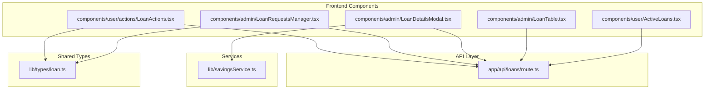
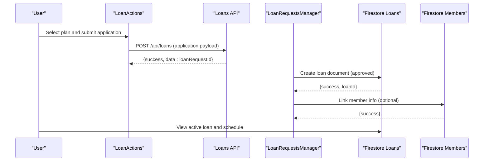
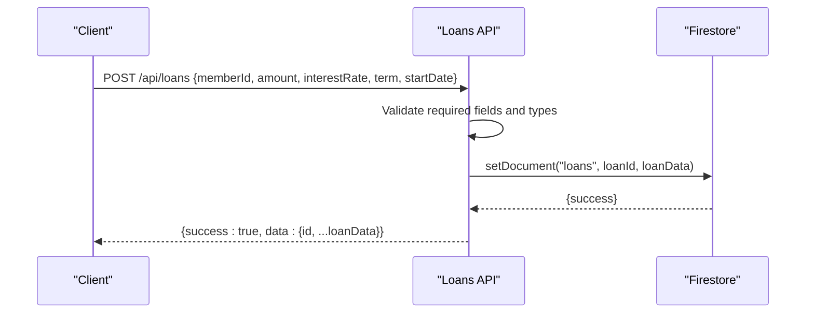
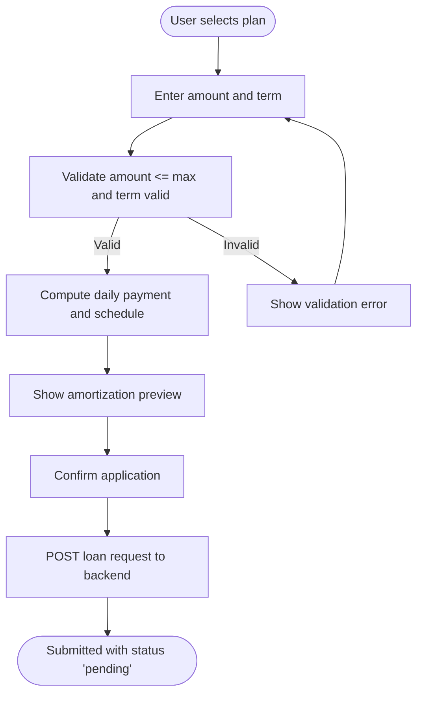
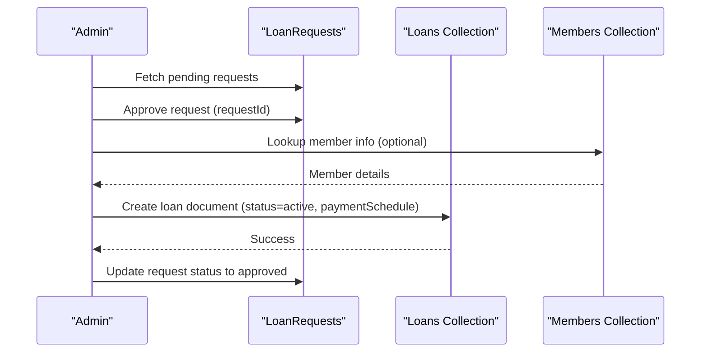
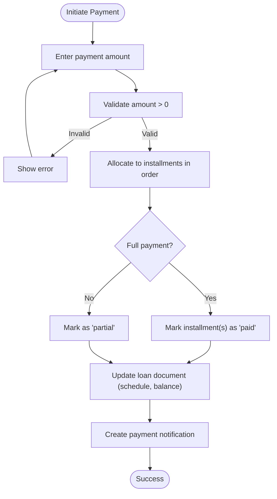
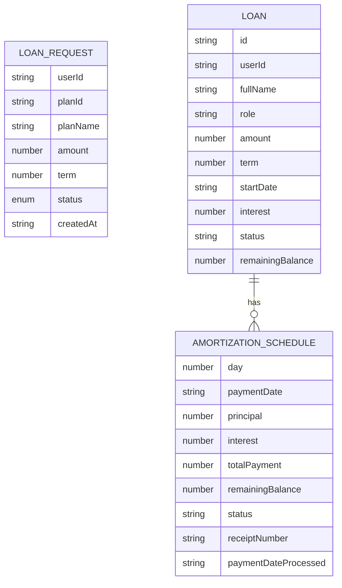
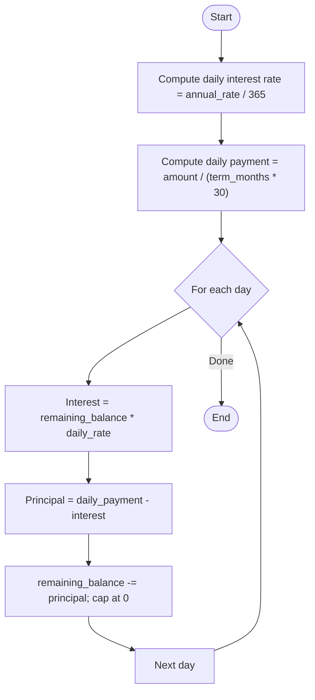
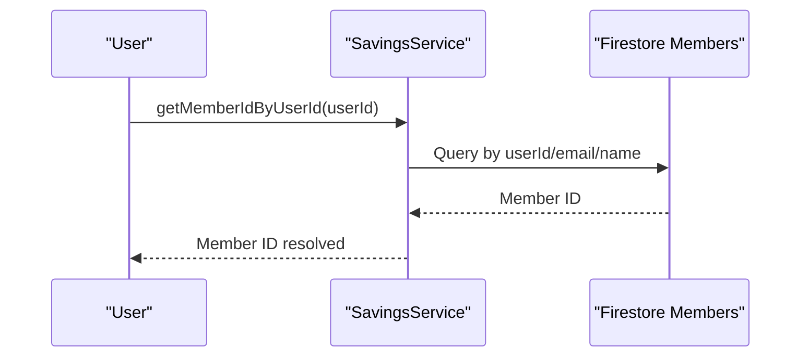
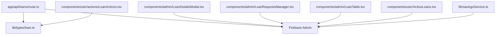

# Loan Management API

<cite>
**Referenced Files in This Document**
- [app/api/loans/route.ts](file://app/api/loans/route.ts)
- [components/user/actions/LoanActions.tsx](file://components/user/actions/LoanActions.tsx)
- [components/admin/LoanDetailsModal.tsx](file://components/admin/LoanDetailsModal.tsx)
- [components/admin/LoanRequestsManager.tsx](file://components/admin/LoanRequestsManager.tsx)
- [components/admin/LoanTable.tsx](file://components/admin/LoanTable.tsx)
- [lib/types/loan.ts](file://lib/types/loan.ts)
- [lib/savingsService.ts](file://lib/savingsService.ts)
- [app/admin/loans/requests/page.tsx](file://app/admin/loans/requests/page.tsx)
- [components/user/ActiveLoans.tsx](file://components/user/ActiveLoans.tsx)
</cite>

## Table of Contents
1. [Introduction](#introduction)
2. [Project Structure](#project-structure)
3. [Core Components](#core-components)
4. [Architecture Overview](#architecture-overview)
5. [Detailed Component Analysis](#detailed-component-analysis)
6. [Dependency Analysis](#dependency-analysis)
7. [Performance Considerations](#performance-considerations)
8. [Troubleshooting Guide](#troubleshooting-guide)
9. [Conclusion](#conclusion)

## Introduction
This document provides comprehensive API documentation for the loan management system, covering the complete loan lifecycle from application to repayment. It documents endpoints, request/response schemas, validation rules, interest calculation algorithms, risk assessment criteria, and integrations with the savings and member systems. The system supports loan applications, approvals, payment processing, and loan tracking with amortization schedules and outstanding balance calculations.

## Project Structure
The loan management functionality spans API routes, frontend components, and shared types/services:
- API routes define backend endpoints for loan operations.
- Frontend components implement user workflows for applying, reviewing, and managing loans.
- Shared types define loan-related data structures.
- Services integrate with Firebase and member/savings systems.

**Diagram sources**
- [app/api/loans/route.ts](file://app/api/loans/route.ts#L1-L133)
- [components/user/actions/LoanActions.tsx](file://components/user/actions/LoanActions.tsx#L1-L619)
- [components/admin/LoanDetailsModal.tsx](file://components/admin/LoanDetailsModal.tsx#L1-L844)
- [components/admin/LoanRequestsManager.tsx](file://components/admin/LoanRequestsManager.tsx#L1-L580)
- [components/admin/LoanTable.tsx](file://components/admin/LoanTable.tsx#L114-L194)
- [components/user/ActiveLoans.tsx](file://components/user/ActiveLoans.tsx#L162-L177)
- [lib/types/loan.ts](file://lib/types/loan.ts#L1-L19)
- [lib/savingsService.ts](file://lib/savingsService.ts#L1-L455)

**Section sources**
- [app/api/loans/route.ts](file://app/api/loans/route.ts#L1-L133)
- [components/user/actions/LoanActions.tsx](file://components/user/actions/LoanActions.tsx#L1-L619)
- [components/admin/LoanDetailsModal.tsx](file://components/admin/LoanDetailsModal.tsx#L1-L844)
- [components/admin/LoanRequestsManager.tsx](file://components/admin/LoanRequestsManager.tsx#L1-L580)
- [components/admin/LoanTable.tsx](file://components/admin/LoanTable.tsx#L114-L194)
- [components/user/ActiveLoans.tsx](file://components/user/ActiveLoans.tsx#L162-L177)
- [lib/types/loan.ts](file://lib/types/loan.ts#L1-L19)
- [lib/savingsService.ts](file://lib/savingsService.ts#L1-L455)

## Core Components
- Loan API Route: Provides GET and POST endpoints for retrieving and creating loans, with basic validation and response formatting.
- Loan Application Workflow: Handles user application submission, plan selection, amortization preview, and persistence to loan requests.
- Loan Approval Workflow: Manages approval/rejection of loan requests and creation of active loans with payment schedules.
- Payment Processing: Enables payment confirmations, partial/full payment allocation, receipt generation, and status updates.
- Loan Tracking: Displays amortization schedules, remaining balances, and payment history.

**Section sources**
- [app/api/loans/route.ts](file://app/api/loans/route.ts#L4-L133)
- [components/user/actions/LoanActions.tsx](file://components/user/actions/LoanActions.tsx#L75-L222)
- [components/admin/LoanRequestsManager.tsx](file://components/admin/LoanRequestsManager.tsx#L349-L390)
- [components/admin/LoanDetailsModal.tsx](file://components/admin/LoanDetailsModal.tsx#L298-L374)
- [components/admin/LoanTable.tsx](file://components/admin/LoanTable.tsx#L146-L179)

## Architecture Overview
The loan lifecycle integrates frontend components with API routes and Firestore collections. Users apply for loans via LoanActions, which submits loan requests. Administrators review and approve requests, creating active loans with payment schedules. Payments are processed through LoanDetailsModal, updating loan documents and notifying users.

**Diagram sources**
- [components/user/actions/LoanActions.tsx](file://components/user/actions/LoanActions.tsx#L174-L222)
- [app/api/loans/route.ts](file://app/api/loans/route.ts#L42-L112)
- [components/admin/LoanRequestsManager.tsx](file://components/admin/LoanRequestsManager.tsx#L349-L390)
- [components/admin/LoanTable.tsx](file://components/admin/LoanTable.tsx#L146-L179)

## Detailed Component Analysis

### Loan API Endpoints
- GET /api/loans
  - Purpose: Retrieve all loans.
  - Response: success flag, array of loan objects, and count.
  - Notes: Basic collection retrieval with error handling.
- POST /api/loans
  - Purpose: Create a new loan application.
  - Request body fields:
    - memberId (required)
    - amount (required)
    - interestRate (required)
    - term (required)
    - startDate (required)
  - Validation:
    - Required fields present.
    - Numeric fields parse correctly.
  - Behavior:
    - Creates a loan document with status "pending".
    - Generates a unique loan ID.
    - Returns success with created loan data.

**Diagram sources**
- [app/api/loans/route.ts](file://app/api/loans/route.ts#L42-L112)

**Section sources**
- [app/api/loans/route.ts](file://app/api/loans/route.ts#L4-L133)

### Loan Application Workflow
- Plan Selection and Validation:
  - Users choose a loan plan and specify amount and term.
  - Client-side validation ensures amount does not exceed plan max and term is valid.
- Amortization Preview:
  - Daily payment and interest calculations are computed for the selected plan.
  - Amortization schedule is paginated for review.
- Submission:
  - Application payload includes user info, plan details, and calculated schedule.
  - Saved to loan requests collection with status "pending".

**Diagram sources**
- [components/user/actions/LoanActions.tsx](file://components/user/actions/LoanActions.tsx#L75-L222)

**Section sources**
- [components/user/actions/LoanActions.tsx](file://components/user/actions/LoanActions.tsx#L75-L222)
- [lib/types/loan.ts](file://lib/types/loan.ts#L1-L19)

### Loan Approval Workflow
- Approval:
  - Admin retrieves loan requests and approves selected requests.
  - On approval, a new loan document is created in the "loans" collection with status "active".
  - Payment schedule is generated and stored with member details.
- Rejection:
  - Admin can reject requests with a reason; status updated accordingly.

**Diagram sources**
- [components/admin/LoanRequestsManager.tsx](file://components/admin/LoanRequestsManager.tsx#L349-L390)
- [components/admin/LoanTable.tsx](file://components/admin/LoanTable.tsx#L146-L179)

**Section sources**
- [components/admin/LoanRequestsManager.tsx](file://components/admin/LoanRequestsManager.tsx#L349-L390)
- [components/admin/LoanTable.tsx](file://components/admin/LoanTable.tsx#L146-L179)

### Payment Processing Endpoints and Logic
- Payment Initiation:
  - Admin opens loan details modal and initiates payment.
  - User enters payment amount; remaining balance is shown.
- Payment Allocation:
  - System allocates payments to installments in order until the amount is exhausted.
  - Supports full and partial payments; marks installments accordingly.
- Receipt Generation:
  - Unique receipt number is generated for each payment session.
- Status Updates:
  - Updated payment schedule and remaining balance are persisted.
  - If all installments are paid, loan status is updated to "completed".
- Notifications:
  - Payment notifications are created for users with details.

**Diagram sources**
- [components/admin/LoanDetailsModal.tsx](file://components/admin/LoanDetailsModal.tsx#L298-L374)

**Section sources**
- [components/admin/LoanDetailsModal.tsx](file://components/admin/LoanDetailsModal.tsx#L298-L374)

### Loan Tracking Endpoints and Schemas
- Loan Listing:
  - GET /api/loans returns all loans with success flag, data array, and count.
- Loan Details:
  - Admin and user views show loan details, amortization schedule, remaining balance, and payment history.
- Request Schema (LoanRequest):
  - Fields: userId, planId, planName, amount, term, status, createdAt.
- Loan Object Schema (from frontend usage):
  - Fields: id, userId, fullName, role, amount, term, startDate, interest, status, remainingBalance?, paymentSchedule?.
- Payment Schedule Item:
  - Fields: day, paymentDate, principal, interest, totalPayment, remainingBalance, status, receiptNumber?, paymentDateProcessed?.

**Diagram sources**
- [lib/types/loan.ts](file://lib/types/loan.ts#L11-L19)
- [components/admin/LoanDetailsModal.tsx](file://components/admin/LoanDetailsModal.tsx#L9-L33)

**Section sources**
- [app/api/loans/route.ts](file://app/api/loans/route.ts#L4-L39)
- [lib/types/loan.ts](file://lib/types/loan.ts#L1-L19)
- [components/admin/LoanDetailsModal.tsx](file://components/admin/LoanDetailsModal.tsx#L9-L33)

### Validation Rules and Risk Assessment Criteria
- Loan Application Validation:
  - Amount must be greater than zero and not exceed plan maximum.
  - Term must be a positive integer included in plan options.
  - Selected plan must be valid.
- Payment Validation:
  - Payment amount must be greater than zero.
  - Remaining balance is considered for allocation.
- Risk Assessment:
  - Current implementation relies on plan-defined maxAmount and termOptions.
  - Member linking and savings balances can inform risk decisions (see Integrations).

**Section sources**
- [components/user/actions/LoanActions.tsx](file://components/user/actions/LoanActions.tsx#L78-L95)
- [components/admin/LoanDetailsModal.tsx](file://components/admin/LoanDetailsModal.tsx#L282-L295)

### Interest Calculation Algorithms
- Daily Interest Rate:
  - Calculated from annual interest rate divided by 365 days.
- Daily Payment:
  - Derived from loan amount divided by total days (term in months × 30).
- Amortization Schedule:
  - Each day’s interest equals remaining balance × daily interest rate.
  - Principal equals daily payment minus interest.
  - Remaining balance decremented by principal; capped at zero.

**Diagram sources**
- [components/admin/LoanDetailsModal.tsx](file://components/admin/LoanDetailsModal.tsx#L94-L133)
- [components/user/actions/LoanActions.tsx](file://components/user/actions/LoanActions.tsx#L38-L73)

**Section sources**
- [components/admin/LoanDetailsModal.tsx](file://components/admin/LoanDetailsModal.tsx#L94-L133)
- [components/user/actions/LoanActions.tsx](file://components/user/actions/LoanActions.tsx#L38-L73)

### Integrations with Savings and Member Systems
- Member Resolution:
  - Services link user IDs to member documents via userId, email, or decoded email fallback.
- Savings Integration:
  - Savings service provides member ID resolution and atomic savings transactions.
  - Can be leveraged to assess member financial health for risk evaluation.
- Notification System:
  - Payment notifications are created with details for user communication.

**Diagram sources**
- [lib/savingsService.ts](file://lib/savingsService.ts#L21-L135)

**Section sources**
- [lib/savingsService.ts](file://lib/savingsService.ts#L21-L135)
- [components/admin/LoanDetailsModal.tsx](file://components/admin/LoanDetailsModal.tsx#L377-L411)

## Dependency Analysis
- API route depends on Firebase Admin for Firestore operations.
- Frontend components depend on shared types and services for data modeling and member resolution.
- Admin components coordinate between loan requests and active loans collections.
- Payment processing depends on amortization schedule structure and status fields.

**Diagram sources**
- [app/api/loans/route.ts](file://app/api/loans/route.ts#L1-L2)
- [lib/types/loan.ts](file://lib/types/loan.ts#L1-L19)
- [components/user/actions/LoanActions.tsx](file://components/user/actions/LoanActions.tsx#L1-L12)
- [components/admin/LoanDetailsModal.tsx](file://components/admin/LoanDetailsModal.tsx#L1-L8)
- [components/admin/LoanRequestsManager.tsx](file://components/admin/LoanRequestsManager.tsx#L1-L5)
- [components/admin/LoanTable.tsx](file://components/admin/LoanTable.tsx#L1-L5)
- [components/user/ActiveLoans.tsx](file://components/user/ActiveLoans.tsx#L1-L5)
- [lib/savingsService.ts](file://lib/savingsService.ts#L1-L3)

**Section sources**
- [app/api/loans/route.ts](file://app/api/loans/route.ts#L1-L133)
- [lib/types/loan.ts](file://lib/types/loan.ts#L1-L19)
- [components/user/actions/LoanActions.tsx](file://components/user/actions/LoanActions.tsx#L1-L12)
- [components/admin/LoanDetailsModal.tsx](file://components/admin/LoanDetailsModal.tsx#L1-L8)
- [components/admin/LoanRequestsManager.tsx](file://components/admin/LoanRequestsManager.tsx#L1-L5)
- [components/admin/LoanTable.tsx](file://components/admin/LoanTable.tsx#L1-L5)
- [components/user/ActiveLoans.tsx](file://components/user/ActiveLoans.tsx#L1-L5)
- [lib/savingsService.ts](file://lib/savingsService.ts#L1-L3)

## Performance Considerations
- Amortization computation is client-side for preview; for large terms, consider server-side generation to reduce client load.
- Pagination in amortization schedules helps manage rendering performance.
- Firestore queries should be indexed appropriately for loan requests and loans collections to optimize listing and filtering.

## Troubleshooting Guide
- API Errors:
  - Validation failures return structured errors with 400 status.
  - Internal errors return 500 with generic messages; inspect server logs for details.
- Payment Issues:
  - Ensure payment amount is valid and greater than zero.
  - Verify remaining balance reflects unpaid installments.
- Member/Missing Data:
  - If member info is missing, fallback to user data; confirm user/member linkage.

**Section sources**
- [app/api/loans/route.ts](file://app/api/loans/route.ts#L47-L67)
- [components/admin/LoanDetailsModal.tsx](file://components/admin/LoanDetailsModal.tsx#L282-L295)

## Conclusion
The loan management system provides a clear lifecycle from application to repayment, with robust frontend workflows and backend API support. While the current API exposes minimal filtering and pagination, the frontend components demonstrate comprehensive tracking and payment capabilities. Extending the API with filtering, pagination, and explicit status transitions would further enhance operational efficiency and auditability.