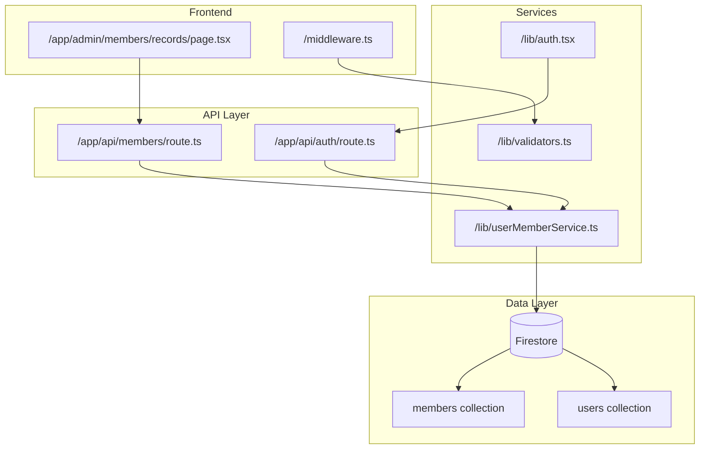
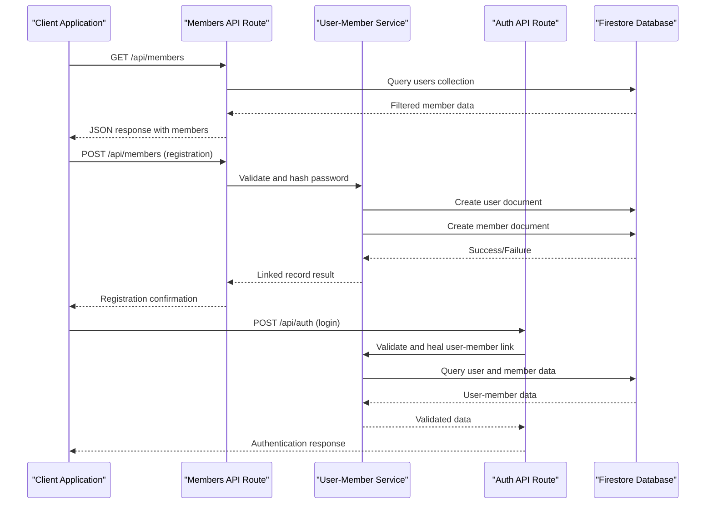
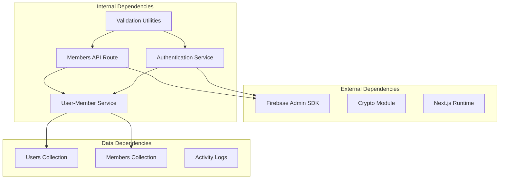

# Member Management API

<cite>
**Referenced Files in This Document**
- [route.ts](file://app/api/members/route.ts)
- [userMemberService.ts](file://lib/userMemberService.ts)
- [auth.tsx](file://lib/auth.tsx)
- [validators.ts](file://lib/validators.ts)
- [middleware.ts](file://middleware.ts)
- [API_JSON_RESPONSES.md](file://docs/API_JSON_RESPONSES.md)
- [USER_MEMBER_LINKING.md](file://docs/USER_MEMBER_LINKING.md)
- [page.tsx](file://app/admin/members/records/page.tsx)
- [route.ts](file://app/api/auth/route.ts)
</cite>

## Table of Contents
1. [Introduction](#introduction)
2. [Project Structure](#project-structure)
3. [Core Components](#core-components)
4. [Architecture Overview](#architecture-overview)
5. [Detailed Component Analysis](#detailed-component-analysis)
6. [Dependency Analysis](#dependency-analysis)
7. [Performance Considerations](#performance-considerations)
8. [Troubleshooting Guide](#troubleshooting-guide)
9. [Conclusion](#conclusion)

## Introduction
This document provides comprehensive API documentation for member management endpoints in the SAMPA-Coop cooperative system. It covers the available CRUD operations for cooperative members, focusing on:
- GET endpoint for retrieving members with filtering and search capabilities
- POST endpoint for member registration with request schema and validation
- PUT and DELETE endpoints and their current limitations
- Request/response schemas for member objects
- Examples of search queries, bulk operations, and validation error responses
- Data privacy considerations, member consent requirements, and integration patterns with the user authentication system

The member management API is implemented as a Next.js API route that interacts with Firestore. The system maintains a strict separation between authentication data (users collection) and member profile data (members collection), with automatic validation and healing mechanisms to ensure consistency.

## Project Structure
The member management functionality spans several key areas:
- API routes for member operations
- Authentication and authorization utilities
- User-member linking service for data consistency
- Frontend components for member records management
- Middleware for route protection and access control



**Diagram sources**
- [route.ts](file://app/api/members/route.ts#L1-L179)
- [userMemberService.ts](file://lib/userMemberService.ts#L1-L287)
- [validators.ts](file://lib/validators.ts#L1-L236)
- [middleware.ts](file://middleware.ts#L1-L62)

**Section sources**
- [route.ts](file://app/api/members/route.ts#L1-L179)
- [userMemberService.ts](file://lib/userMemberService.ts#L1-L287)
- [validators.ts](file://lib/validators.ts#L1-L236)
- [middleware.ts](file://middleware.ts#L1-L62)

## Core Components
The member management system consists of three primary components:

### API Route Handler
The main API handler in `/app/api/members/route.ts` provides:
- GET endpoint for retrieving all members with filtering
- POST endpoint for member registration
- Method validation for PUT and DELETE operations

### User-Member Linking Service
The service in `/lib/userMemberService.ts` ensures data consistency between users and members collections:
- Generates consistent user IDs from email addresses
- Creates linked user-member records atomically
- Validates and heals user-member linkages
- Provides update operations that synchronize both collections

### Authentication Integration
The authentication system in `/lib/auth.tsx` and `/app/api/auth/route.ts` integrates with member management:
- Role-based access control for member operations
- User authentication and session management
- Password hashing and verification
- Dashboard routing based on member roles

**Section sources**
- [route.ts](file://app/api/members/route.ts#L25-L179)
- [userMemberService.ts](file://lib/userMemberService.ts#L14-L92)
- [auth.tsx](file://lib/auth.tsx#L10-L682)
- [route.ts](file://app/api/auth/route.ts#L47-L200)

## Architecture Overview
The member management architecture follows a layered approach with clear separation of concerns:



**Diagram sources**
- [route.ts](file://app/api/members/route.ts#L25-L158)
- [userMemberService.ts](file://lib/userMemberService.ts#L99-L198)
- [route.ts](file://app/api/auth/route.ts#L47-L200)

The architecture ensures:
- Single source of truth for user identification
- Atomic operations for user-member record creation
- Automatic validation and healing of data inconsistencies
- Secure password handling with hashing and verification
- Role-based access control for member operations

## Detailed Component Analysis

### GET /api/members - Retrieve All Members
The GET endpoint provides comprehensive member retrieval with filtering capabilities:

**Endpoint**: `GET /api/members`
**Response Format**: JSON with standardized structure

**Response Schema**:
```json
{
  "success": true,
  "data": [
    {
      "id": "string",
      "email": "string",
      "fullName": "string",
      "contactNumber": "string",
      "role": "string",
      "createdAt": "string",
      "isPasswordSet": "boolean"
    }
  ],
  "count": "number"
}
```

**Filtering Logic**:
- Filters users by roles: 'member', 'driver', 'operator'
- Returns only documents where role matches member categories
- Excludes administrative users from member listings

**Current Limitations**:
- No pagination support
- No advanced search filters
- No sorting options
- No bulk operations

**Section sources**
- [route.ts](file://app/api/members/route.ts#L25-L65)

### POST /api/members - Member Registration
The POST endpoint handles member registration with comprehensive validation:

**Endpoint**: `POST /api/members`
**Request Schema**:
```json
{
  "email": "string",
  "fullName": "string",
  "contactNumber": "string",
  "role": "string",
  "password": "string"
}
```

**Validation Rules**:
- Required fields: email, fullName, contactNumber
- Email format validation using regex pattern
- Duplicate email prevention
- Role normalization to lowercase
- Optional password hashing

**Response Schema**:
```json
{
  "success": true,
  "message": "string",
  "data": {
    "id": "string",
    "email": "string",
    "fullName": "string",
    "contactNumber": "string",
    "role": "string",
    "createdAt": "string",
    "isPasswordSet": "boolean"
  }
}
```

**Security Features**:
- Password hashing using PBKDF2 with 100,000 iterations
- Salt generation for each password
- Base64 encoding for storage
- Timing-safe password comparison

**Section sources**
- [route.ts](file://app/api/members/route.ts#L67-L158)

### PUT /api/members - Member Updates
**Endpoint**: `PUT /api/members`
**Current Status**: Method not allowed (405)

The API currently does not support member updates through this endpoint. The system maintains a strict separation between authentication data and member profiles, with updates handled through dedicated services.

**Section sources**
- [route.ts](file://app/api/members/route.ts#L160-L169)

### DELETE /api/members - Member Removal
**Endpoint**: `DELETE /api/members`
**Current Status**: Method not allowed (405)

The API does not currently support member deletion. The system is designed to maintain data integrity and audit trails, requiring administrative intervention for member removal.

**Section sources**
- [route.ts](file://app/api/members/route.ts#L171-L179)

### User-Member Linking Service
The user-member linking service ensures data consistency across collections:

**Core Functions**:
- `generateUserId(email)`: Creates consistent user ID from email
- `createLinkedUserMember(userData)`: Atomically creates user and member records
- `validateAndHealUserMemberLink(userId)`: Validates and repairs linkages
- `updateUserMember(userId, updateData)`: Synchronizes updates across collections

**Data Synchronization**:
- Both collections use the same document ID
- Members collection includes `userId` field linking to user document
- Automatic healing prevents "No member found" errors
- Parallel updates ensure atomicity

**Section sources**
- [userMemberService.ts](file://lib/userMemberService.ts#L14-L92)
- [userMemberService.ts](file://lib/userMemberService.ts#L99-L198)
- [userMemberService.ts](file://lib/userMemberService.ts#L246-L287)

## Dependency Analysis
The member management system has well-defined dependencies and relationships:



**Diagram sources**
- [route.ts](file://app/api/members/route.ts#L1-L3)
- [userMemberService.ts](file://lib/userMemberService.ts#L6-L8)
- [validators.ts](file://lib/validators.ts#L1-L236)

**Key Dependencies**:
- Firebase Admin SDK for database operations
- Crypto module for password hashing
- Next.js server runtime for API handling
- User-member service for data consistency
- Validation utilities for access control

**Section sources**
- [route.ts](file://app/api/members/route.ts#L1-L3)
- [userMemberService.ts](file://lib/userMemberService.ts#L6-L8)
- [validators.ts](file://lib/validators.ts#L1-L236)

## Performance Considerations
The member management system incorporates several performance optimizations:

### Database Operations
- Single collection queries for member retrieval
- Efficient filtering using Firestore queries
- Minimal data transformation in API layer
- Batch operations for user-member synchronization

### Security Optimizations
- PBKDF2 with 100,000 iterations for password hashing
- Timing-safe string comparison to prevent timing attacks
- Salt generation for each password
- Base64 encoding for secure storage

### Caching Strategies
- Client-side caching in frontend components
- Database query optimization
- Minimal payload sizes in API responses
- Efficient pagination in frontend components

## Troubleshooting Guide

### Common Issues and Solutions

**Member Registration Failures**:
- Duplicate email addresses: Check existing user records before registration
- Invalid email format: Validate email using regex pattern
- Password hash errors: Ensure proper PBKDF2 implementation
- Database connection issues: Verify Firebase configuration

**Authentication Problems**:
- Account not found: Verify email exists in users collection
- Incorrect password: Check password hash verification
- Role validation errors: Confirm user role assignment
- Session management issues: Validate cookie handling

**Data Consistency Issues**:
- "No member found" errors: Trigger automatic healing process
- Inconsistent IDs: Use generateUserId() function
- Missing member records: Implement user-member validation
- Update synchronization failures: Use updateUserMember() service

**Section sources**
- [route.ts](file://app/api/members/route.ts#L73-L108)
- [route.ts](file://app/api/auth/route.ts#L128-L140)
- [userMemberService.ts](file://lib/userMemberService.ts#L99-L198)

### Error Response Patterns
The system follows standardized error response patterns:

**Validation Errors** (400):
- Missing required fields
- Invalid email format
- Duplicate email addresses

**Authentication Errors** (401):
- Incorrect password
- Account not found
- Password not set

**Server Errors** (500):
- Database operation failures
- Internal server errors
- Unhandled exceptions

**Section sources**
- [API_JSON_RESPONSES.md](file://docs/API_JSON_RESPONSES.md#L1-L139)

## Conclusion
The SAMPA-Coop member management API provides a robust foundation for cooperative member operations with strong emphasis on data consistency, security, and user experience. The current implementation focuses on essential CRUD operations with comprehensive validation and security measures.

Key strengths of the system include:
- Automatic user-member data synchronization
- Secure password handling with modern cryptographic standards
- Role-based access control integration
- Comprehensive error handling and validation
- Self-healing mechanisms for data consistency

Future enhancements could include:
- Pagination support for large member datasets
- Advanced search and filtering capabilities
- Bulk operations for administrative tasks
- Enhanced audit trails and activity logging
- Support for member updates and deletions
- Real-time member status updates

The system's architecture provides a solid foundation for scaling member management operations while maintaining data integrity and user privacy standards.