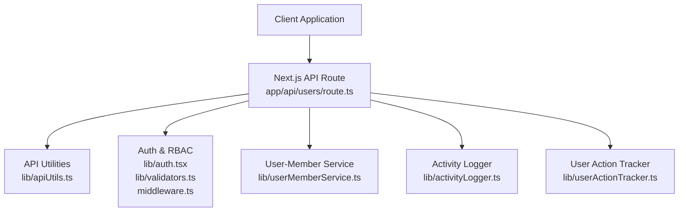
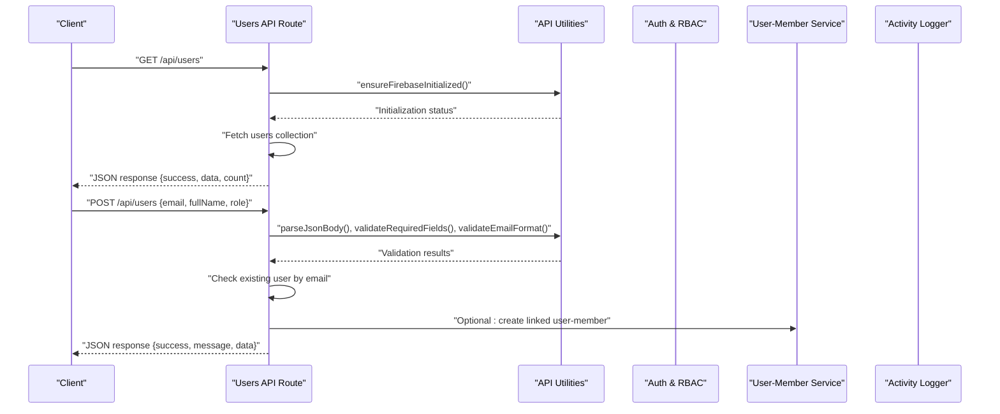
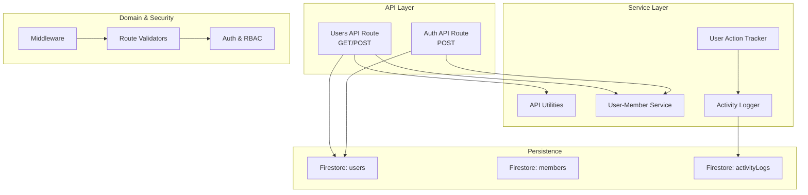
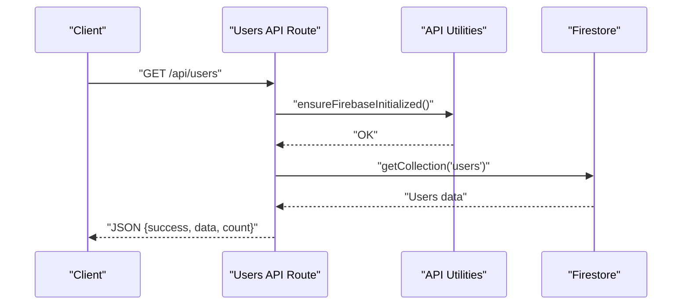
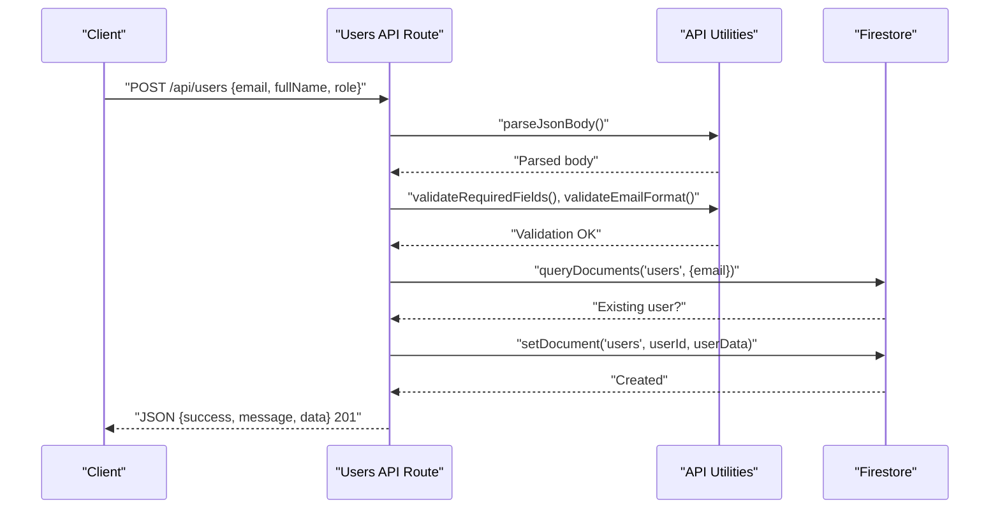
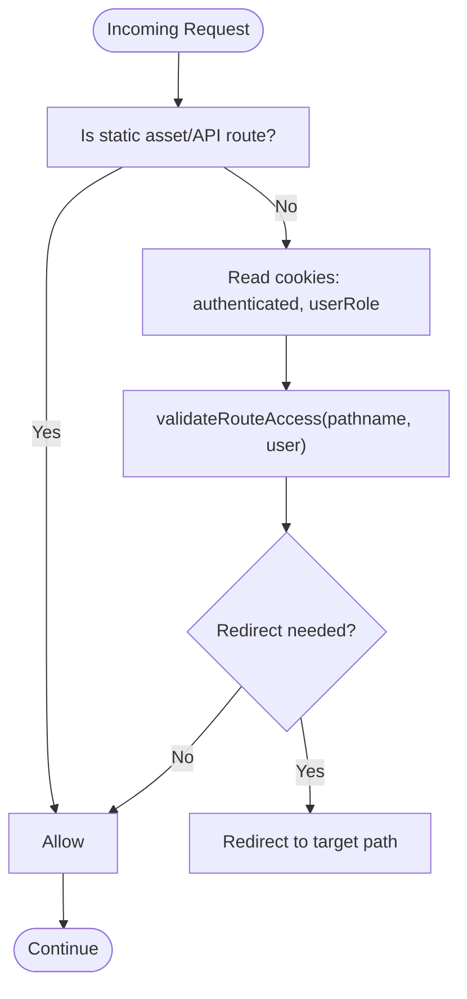
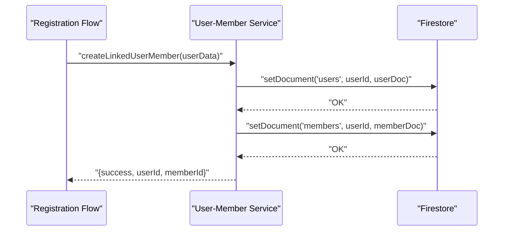
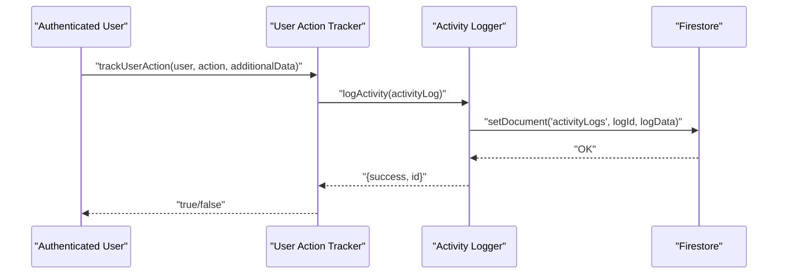
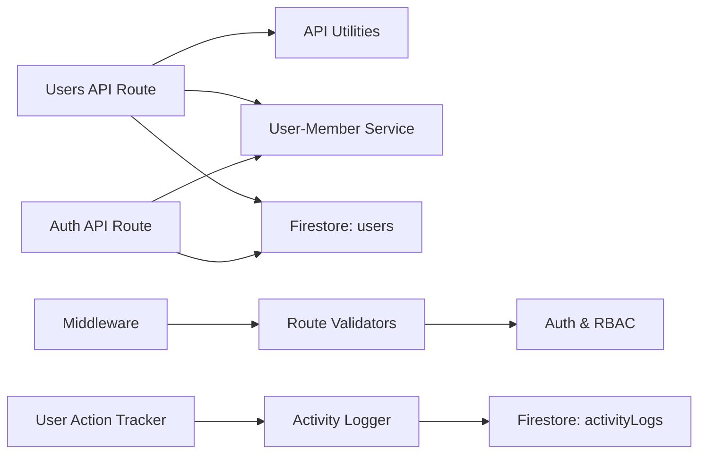

# User Management API

<cite>
**Referenced Files in This Document**
- [app/api/users/route.ts](file://app/api/users/route.ts)
- [lib/apiUtils.ts](file://lib/apiUtils.ts)
- [lib/userMemberService.ts](file://lib/userMemberService.ts)
- [lib/activityLogger.ts](file://lib/activityLogger.ts)
- [lib/userActionTracker.ts](file://lib/userActionTracker.ts)
- [lib/auth.tsx](file://lib/auth.tsx)
- [middleware.ts](file://middleware.ts)
- [lib/validators.ts](file://lib/validators.ts)
- [docs/API_JSON_RESPONSES.md](file://docs/API_JSON_RESPONSES.md)
- [docs/USER_MEMBER_LINKING.md](file://docs/USER_MEMBER_LINKING.md)
- [ROLE_BASED_ACCESS_CONTROL.md](file://ROLE_BASED_ACCESS_CONTROL.md)
</cite>

## Table of Contents
1. [Introduction](#introduction)
2. [Project Structure](#project-structure)
3. [Core Components](#core-components)
4. [Architecture Overview](#architecture-overview)
5. [Detailed Component Analysis](#detailed-component-analysis)
6. [Dependency Analysis](#dependency-analysis)
7. [Performance Considerations](#performance-considerations)
8. [Troubleshooting Guide](#troubleshooting-guide)
9. [Conclusion](#conclusion)
10. [Appendices](#appendices)

## Introduction
This document provides comprehensive API documentation for user management endpoints focused on administrative user operations and role assignments. It covers:
- GET endpoint for retrieving users
- POST endpoint for user creation
- PUT and DELETE endpoints (unsupported in current implementation)
- Request/response schemas for user objects
- Examples of bulk operations, role hierarchy validation, and permission checking
- User provisioning workflows, password reset procedures, and integration with the member registration system
- Security considerations including role-based access control, audit logging, and compliance requirements

Note: As implemented, the users API currently supports GET and POST. PUT and DELETE are explicitly unsupported and return method-not-allowed responses.

## Project Structure
The user management API resides under the Next.js app router at app/api/users/route.ts. Supporting utilities and services include:
- API response utilities for consistent JSON responses
- User-member linkage service for cross-collection consistency
- Activity logging and user action tracking for audit trails
- Authentication and role-based access control utilities
- Middleware for route protection

**Diagram sources**
- [app/api/users/route.ts](file://app/api/users/route.ts#L1-L126)
- [lib/apiUtils.ts](file://lib/apiUtils.ts#L1-L109)
- [lib/userMemberService.ts](file://lib/userMemberService.ts#L1-L287)
- [lib/activityLogger.ts](file://lib/activityLogger.ts#L1-L165)
- [lib/userActionTracker.ts](file://lib/userActionTracker.ts#L1-L118)
- [lib/auth.tsx](file://lib/auth.tsx#L1-L682)
- [lib/validators.ts](file://lib/validators.ts#L1-L236)
- [middleware.ts](file://middleware.ts#L1-L62)

**Section sources**
- [app/api/users/route.ts](file://app/api/users/route.ts#L1-L126)
- [lib/apiUtils.ts](file://lib/apiUtils.ts#L1-L109)
- [lib/userMemberService.ts](file://lib/userMemberService.ts#L1-L287)
- [lib/activityLogger.ts](file://lib/activityLogger.ts#L1-L165)
- [lib/userActionTracker.ts](file://lib/userActionTracker.ts#L1-L118)
- [lib/auth.tsx](file://lib/auth.tsx#L1-L682)
- [lib/validators.ts](file://lib/validators.ts#L1-L236)
- [middleware.ts](file://middleware.ts#L1-L62)

## Core Components
- Users API Route: Implements GET and POST for user retrieval and creation. PUT and DELETE explicitly return method-not-allowed.
- API Utilities: Provide standardized JSON responses, validation helpers, and Firebase initialization checks.
- User-Member Service: Ensures consistent IDs and synchronized updates between users and members collections.
- Activity Logger and User Action Tracker: Enable audit logging for user-related actions.
- Authentication and RBAC: Defines roles, route validation, and middleware enforcement.
- Documentation: Ensures all API routes return JSON and outlines best practices.

**Section sources**
- [app/api/users/route.ts](file://app/api/users/route.ts#L18-L126)
- [lib/apiUtils.ts](file://lib/apiUtils.ts#L8-L109)
- [lib/userMemberService.ts](file://lib/userMemberService.ts#L1-L287)
- [lib/activityLogger.ts](file://lib/activityLogger.ts#L1-L165)
- [lib/userActionTracker.ts](file://lib/userActionTracker.ts#L1-L118)
- [lib/auth.tsx](file://lib/auth.tsx#L11-L31)
- [docs/API_JSON_RESPONSES.md](file://docs/API_JSON_RESPONSES.md#L20-L86)

## Architecture Overview
The user management API follows a layered architecture:
- Presentation Layer: Next.js API route handlers
- Service Layer: Utilities for validation, persistence, and cross-collection synchronization
- Domain Layer: Authentication, roles, and middleware enforcement
- Persistence Layer: Firestore collections for users and members

**Diagram sources**
- [app/api/users/route.ts](file://app/api/users/route.ts#L18-L117)
- [lib/apiUtils.ts](file://lib/apiUtils.ts#L61-L109)
- [lib/userMemberService.ts](file://lib/userMemberService.ts#L23-L92)
- [lib/auth.tsx](file://lib/auth.tsx#L158-L195)

## Detailed Component Analysis

### Users API Route
- Purpose: Administrative user operations with GET and POST; PUT/DELETE explicitly unsupported.
- GET /api/users
  - Retrieves all users from the users collection.
  - Returns success with data and count.
- POST /api/users
  - Parses JSON body and validates required fields and email format.
  - Checks for existing user by email.
  - Creates user document with default role and timestamps.
  - Returns success with created user data and 201 status.

Unsupported Methods
- PUT and DELETE return method-not-allowed errors.

Security and Error Handling
- Uses standardized API utilities for consistent JSON responses.
- Ensures Firebase initialization before operations.
- Catches and logs unexpected errors, returning user-friendly JSON.

**Section sources**
- [app/api/users/route.ts](file://app/api/users/route.ts#L18-L126)
- [lib/apiUtils.ts](file://lib/apiUtils.ts#L8-L59)

### Request/Response Schemas

User Object Schema
- Fields: uid, email, displayName, role, lastLogin, createdAt, updatedAt
- Notes: Current implementation stores email, displayName, role, createdAt. lastLogin and updatedAt are not present in the users route’s POST response.

Example Request: POST /api/users
- Required: email, fullName
- Optional: role (defaults to member if omitted)

Example Response: GET /api/users
- Success: { success: true, data: [User], count: number }

Example Response: POST /api/users
- Success: { success: true, message: string, data: { id, email, fullName, role, createdAt } }

Notes
- The user object schema differs slightly from the AppUser type used in authentication (which includes lastLogin). The users API route does not populate lastLogin or updatedAt.

**Section sources**
- [app/api/users/route.ts](file://app/api/users/route.ts#L48-L117)
- [lib/auth.tsx](file://lib/auth.tsx#L11-L31)

### Filtering and Bulk Operations
Current Implementation
- GET /api/users retrieves all users without filtering by role, status, or date ranges.
- No built-in bulk user operations exist in the users API.

Recommendations
- Extend GET to accept query parameters for role, status, and date ranges.
- Implement batch operations for role updates and deactivation with audit logging.

**Section sources**
- [app/api/users/route.ts](file://app/api/users/route.ts#L18-L46)

### Role Assignments and Hierarchies
Supported Roles
- Admin roles: admin, secretary, chairman, vice chairman, manager, treasurer, board of directors
- User roles: member, driver, operator

Role-Based Access Control
- Middleware validates route access based on user roles.
- Validators enforce role-specific access and prevent route conflicts.
- Dashboard redirection is role-aware.

Permission Checking
- Use validator functions to check access to admin/user routes.
- ValidateRoleSpecificAdminRoute restricts access to role-specific dashboards.

**Section sources**
- [lib/validators.ts](file://lib/validators.ts#L9-L80)
- [lib/validators.ts](file://lib/validators.ts#L199-L235)
- [middleware.ts](file://middleware.ts#L5-L56)
- [ROLE_BASED_ACCESS_CONTROL.md](file://ROLE_BASED_ACCESS_CONTROL.md#L9-L24)

### User Provisioning and Member Registration Integration
User-Member Linking
- Consistent ID generation using email normalization.
- Atomic creation of user and member documents with shared userId.
- Automatic validation and healing of linkages on login.

Provisioning Workflow
- Registration creates both users and members with synchronized data.
- Login validates and heals linkages, ensuring consistent IDs and roles.

**Section sources**
- [lib/userMemberService.ts](file://lib/userMemberService.ts#L14-L92)
- [lib/userMemberService.ts](file://lib/userMemberService.ts#L99-L198)
- [docs/USER_MEMBER_LINKING.md](file://docs/USER_MEMBER_LINKING.md#L19-L45)

### Password Reset Procedures
Current State
- The authentication route indicates when a password is not set and requires setup.
- Password reset via Firestore is not implemented in the current codebase.

Recommended Approach
- Implement a secure server-side password reset flow with tokens and audit logging.
- Integrate with activity logging for compliance.

**Section sources**
- [app/api/auth/route.ts](file://app/api/auth/route.ts#L128-L140)
- [lib/auth.tsx](file://lib/auth.tsx#L637-L642)

### Audit Trail Preservation
Activity Logging
- Activity logs capture user actions with userId, userEmail, userName, role, action, timestamp, and optional IP/user-agent.
- User action tracker wraps operations to automatically log activities.

Usage
- Track user actions such as login, profile updates, and administrative operations.
- Retrieve logs by user or date range for compliance reporting.

**Section sources**
- [lib/activityLogger.ts](file://lib/activityLogger.ts#L4-L43)
- [lib/userActionTracker.ts](file://lib/userActionTracker.ts#L10-L47)

### Security Considerations
- Role-Based Access Control: Middleware and validators enforce role-specific access.
- JSON Responses: All routes return JSON to prevent HTML injection and ensure predictable client handling.
- Error Handling: Standardized error responses hide internal details while logging for debugging.
- Compliance: Activity logs preserve audit trails for regulatory requirements.

**Section sources**
- [middleware.ts](file://middleware.ts#L5-L56)
- [lib/validators.ts](file://lib/validators.ts#L199-L235)
- [docs/API_JSON_RESPONSES.md](file://docs/API_JSON_RESPONSES.md#L20-L30)
- [lib/activityLogger.ts](file://lib/activityLogger.ts#L20-L43)

## Architecture Overview

**Diagram sources**
- [app/api/users/route.ts](file://app/api/users/route.ts#L1-L126)
- [app/api/auth/route.ts](file://app/api/auth/route.ts#L48-L264)
- [lib/apiUtils.ts](file://lib/apiUtils.ts#L1-L109)
- [lib/userMemberService.ts](file://lib/userMemberService.ts#L1-L287)
- [lib/activityLogger.ts](file://lib/activityLogger.ts#L1-L165)
- [lib/userActionTracker.ts](file://lib/userActionTracker.ts#L1-L118)
- [lib/validators.ts](file://lib/validators.ts#L1-L236)
- [middleware.ts](file://middleware.ts#L1-L62)

## Detailed Component Analysis

### GET /api/users
- Behavior: Fetches all users from the users collection.
- Response: Success with data array and count.
- Filters: Not implemented in current route.

**Diagram sources**
- [app/api/users/route.ts](file://app/api/users/route.ts#L18-L46)
- [lib/apiUtils.ts](file://lib/apiUtils.ts#L61-L75)

**Section sources**
- [app/api/users/route.ts](file://app/api/users/route.ts#L18-L46)

### POST /api/users
- Behavior: Creates a new user with email, fullName, and optional role.
- Validation: Required fields and email format.
- Uniqueness: Checks for existing user by email.
- Response: Success with created user data and 201 status.

**Diagram sources**
- [app/api/users/route.ts](file://app/api/users/route.ts#L48-L117)
- [lib/apiUtils.ts](file://lib/apiUtils.ts#L77-L109)

**Section sources**
- [app/api/users/route.ts](file://app/api/users/route.ts#L48-L117)
- [lib/apiUtils.ts](file://lib/apiUtils.ts#L90-L109)

### Unsupported Methods: PUT and DELETE
- Behavior: Return method-not-allowed errors with JSON responses.
- Rationale: Administrative user updates and deletions are not implemented in the current route.

**Section sources**
- [app/api/users/route.ts](file://app/api/users/route.ts#L119-L126)

### Role-Based Access Control and Middleware
- Middleware reads cookies to extract authenticated user UID and role.
- Validators enforce route access and prevent conflicts between admin and user dashboards.
- Dashboard redirection is role-aware.

**Diagram sources**
- [middleware.ts](file://middleware.ts#L5-L56)
- [lib/validators.ts](file://lib/validators.ts#L199-L235)

**Section sources**
- [middleware.ts](file://middleware.ts#L5-L56)
- [lib/validators.ts](file://lib/validators.ts#L1-L236)
- [ROLE_BASED_ACCESS_CONTROL.md](file://ROLE_BASED_ACCESS_CONTROL.md#L25-L48)

### User-Member Linking Service
- Consistent ID generation from email.
- Atomic creation of user and member documents.
- Validation and healing of linkages on login.
- Parallel updates across both collections.

**Diagram sources**
- [lib/userMemberService.ts](file://lib/userMemberService.ts#L23-L92)

**Section sources**
- [lib/userMemberService.ts](file://lib/userMemberService.ts#L1-L287)
- [docs/USER_MEMBER_LINKING.md](file://docs/USER_MEMBER_LINKING.md#L19-L45)

### Activity Logging and User Action Tracking
- Activity logs capture structured entries with user context.
- User action tracker wraps operations to automatically log activities.
- Logs can be filtered by user or date range.

**Diagram sources**
- [lib/userActionTracker.ts](file://lib/userActionTracker.ts#L10-L47)
- [lib/activityLogger.ts](file://lib/activityLogger.ts#L20-L43)

**Section sources**
- [lib/userActionTracker.ts](file://lib/userActionTracker.ts#L1-L118)
- [lib/activityLogger.ts](file://lib/activityLogger.ts#L1-L165)

## Dependency Analysis

**Diagram sources**
- [app/api/users/route.ts](file://app/api/users/route.ts#L1-L126)
- [app/api/auth/route.ts](file://app/api/auth/route.ts#L1-L295)
- [lib/apiUtils.ts](file://lib/apiUtils.ts#L1-L109)
- [lib/userMemberService.ts](file://lib/userMemberService.ts#L1-L287)
- [lib/validators.ts](file://lib/validators.ts#L1-L236)
- [middleware.ts](file://middleware.ts#L1-L62)
- [lib/userActionTracker.ts](file://lib/userActionTracker.ts#L1-L118)
- [lib/activityLogger.ts](file://lib/activityLogger.ts#L1-L165)

**Section sources**
- [app/api/users/route.ts](file://app/api/users/route.ts#L1-L126)
- [app/api/auth/route.ts](file://app/api/auth/route.ts#L1-L295)
- [lib/apiUtils.ts](file://lib/apiUtils.ts#L1-L109)
- [lib/userMemberService.ts](file://lib/userMemberService.ts#L1-L287)
- [lib/validators.ts](file://lib/validators.ts#L1-L236)
- [middleware.ts](file://middleware.ts#L1-L62)
- [lib/userActionTracker.ts](file://lib/userActionTracker.ts#L1-L118)
- [lib/activityLogger.ts](file://lib/activityLogger.ts#L1-L165)

## Performance Considerations
- JSON Response Consistency: All routes return JSON, reducing client-side parsing overhead and preventing HTML fallbacks.
- Minimal Validation Overhead: Input validation is lightweight and centralized.
- Firestore Queries: Current GET retrieves all users; consider pagination and filtering for scalability.
- Parallel Operations: User-member updates execute in parallel where possible.

[No sources needed since this section provides general guidance]

## Troubleshooting Guide
Common Issues and Resolutions
- Method Not Allowed: PUT/DELETE on users route return 405; use POST for creation.
- Firebase Initialization: Ensure Firebase Admin is initialized; route checks and returns service-unavailable when not ready.
- Validation Failures: Missing required fields or invalid email format trigger 400 with user-friendly messages.
- Duplicate User: Attempting to create a user with an existing email returns 409.
- Unexpected Errors: All routes include try/catch and return JSON error responses with appropriate status codes.

**Section sources**
- [app/api/users/route.ts](file://app/api/users/route.ts#L119-L126)
- [lib/apiUtils.ts](file://lib/apiUtils.ts#L61-L75)
- [lib/apiUtils.ts](file://lib/apiUtils.ts#L90-L109)

## Conclusion
The user management API provides a solid foundation for administrative user operations with consistent JSON responses, robust validation, and integrated audit logging. While the current implementation focuses on GET and POST, the architecture supports extension for filtering, bulk operations, and enhanced administrative capabilities. The role-based access control and middleware ensure secure routing, and the user-member linking service maintains data consistency across collections.

[No sources needed since this section summarizes without analyzing specific files]

## Appendices

### API Definitions

GET /api/users
- Description: Retrieve all users.
- Response: { success: boolean, data: User[], count: number }

POST /api/users
- Description: Create a new user.
- Request Body: { email: string, fullName: string, role?: string }
- Response: { success: boolean, message: string, data: { id: string, email: string, fullName: string, role: string, createdAt: string } }

Unsupported
- PUT /api/users: Method not allowed.
- DELETE /api/users: Method not allowed.

**Section sources**
- [app/api/users/route.ts](file://app/api/users/route.ts#L18-L126)

### Role Reference
- Admin Roles: admin, secretary, chairman, vice chairman, manager, treasurer, board of directors
- User Roles: member, driver, operator

**Section sources**
- [lib/validators.ts](file://lib/validators.ts#L17-L18)
- [lib/validators.ts](file://lib/validators.ts#L75-L77)
- [ROLE_BASED_ACCESS_CONTROL.md](file://ROLE_BASED_ACCESS_CONTROL.md#L9-L24)

### Compliance and Audit Logging
- Activity logs capture actions with timestamps and user context.
- Use getUserActivityLogs and getActivityLogsByDateRange for reporting.
- Track user actions using trackUserAction for administrative oversight.

**Section sources**
- [lib/activityLogger.ts](file://lib/activityLogger.ts#L45-L165)
- [lib/userActionTracker.ts](file://lib/userActionTracker.ts#L10-L47)