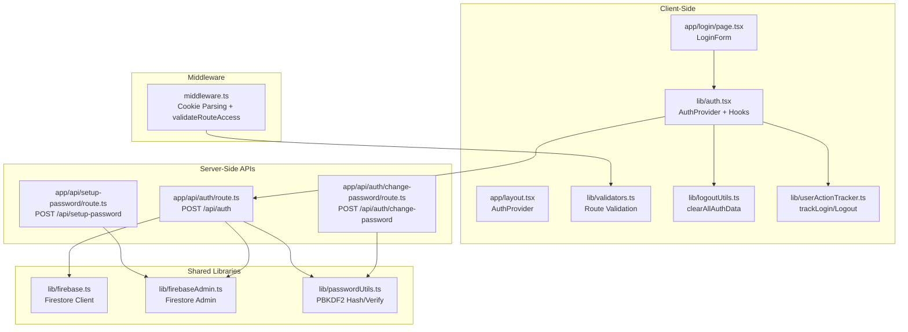
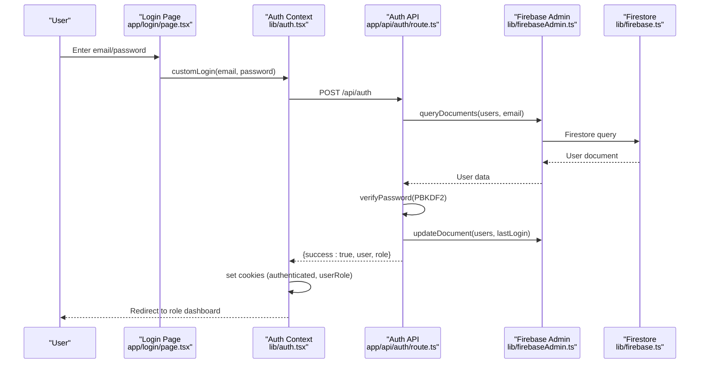
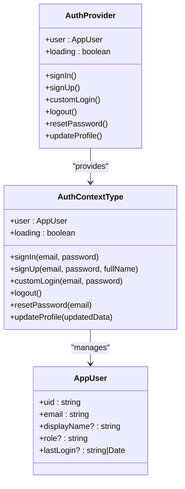
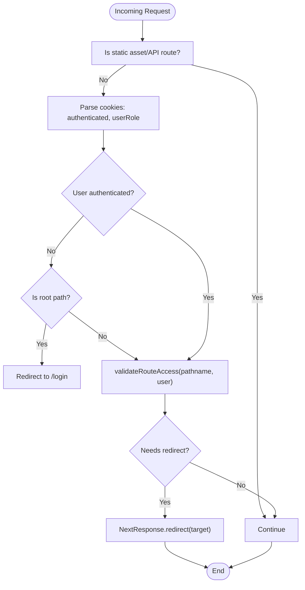
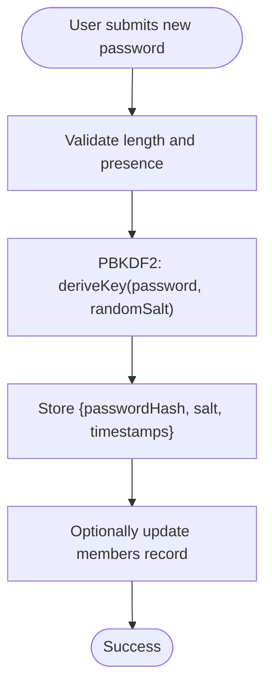
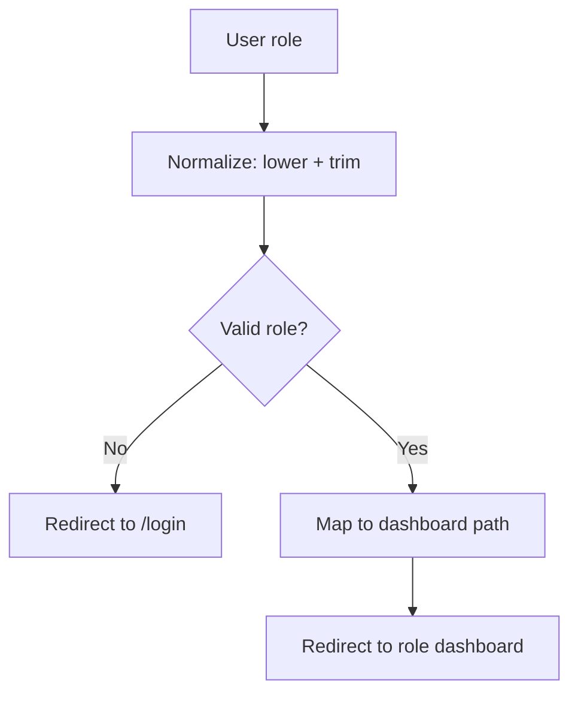
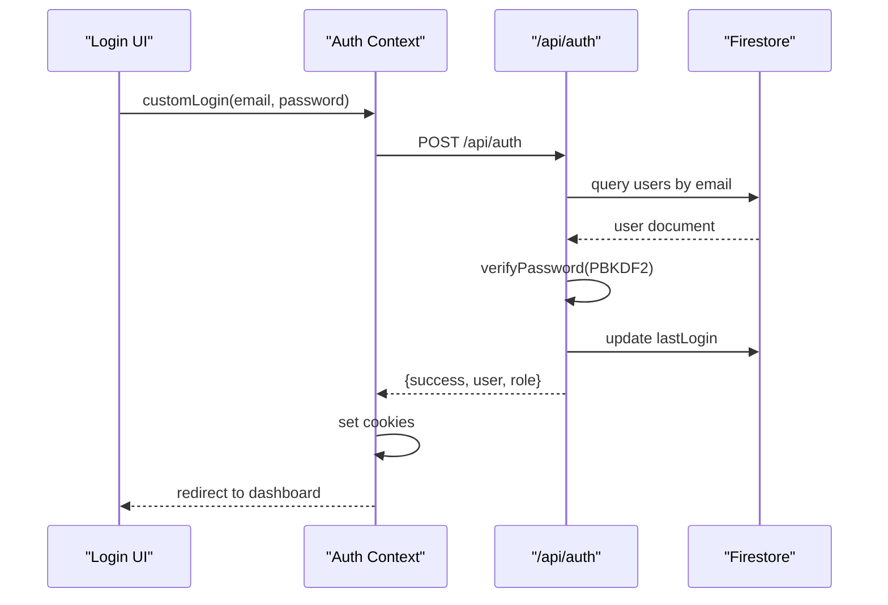
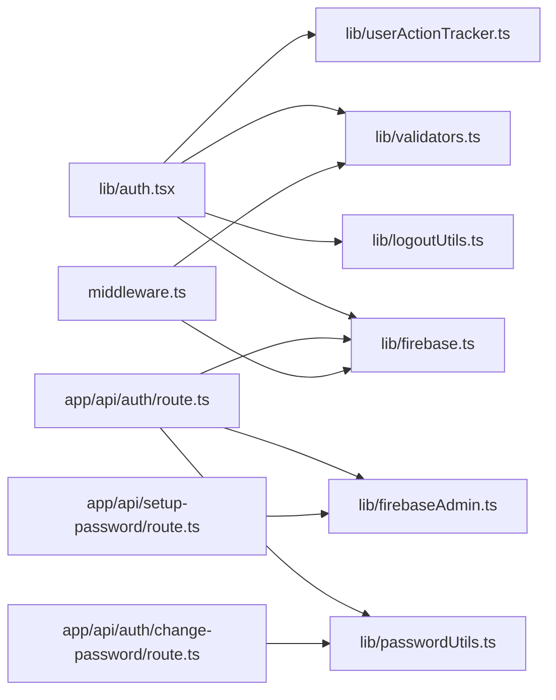

# Authentication & Authorization System

<cite>
**Referenced Files in This Document**
- [lib/auth.tsx](file://lib/auth.tsx)
- [middleware.ts](file://middleware.ts)
- [lib/firebase.ts](file://lib/firebase.ts)
- [lib/firebaseAdmin.ts](file://lib/firebaseAdmin.ts)
- [lib/passwordUtils.ts](file://lib/passwordUtils.ts)
- [app/api/auth/route.ts](file://app/api/auth/route.ts)
- [app/api/auth/change-password/route.ts](file://app/api/auth/change-password/route.ts)
- [app/api/setup-password/route.ts](file://app/api/setup-password/route.ts)
- [lib/validators.ts](file://lib/validators.ts)
- [lib/logoutUtils.ts](file://lib/logoutUtils.ts)
- [lib/userActionTracker.ts](file://lib/userActionTracker.ts)
- [app/layout.tsx](file://app/layout.tsx)
- [app/login/page.tsx](file://app/login/page.tsx)
- [ROLE_BASED_ACCESS_CONTROL.md](file://ROLE_BASED_ACCESS_CONTROL.md)
</cite>

## Table of Contents
1. [Introduction](#introduction)
2. [Project Structure](#project-structure)
3. [Core Components](#core-components)
4. [Architecture Overview](#architecture-overview)
5. [Detailed Component Analysis](#detailed-component-analysis)
6. [Dependency Analysis](#dependency-analysis)
7. [Performance Considerations](#performance-considerations)
8. [Troubleshooting Guide](#troubleshooting-guide)
9. [Conclusion](#conclusion)

## Introduction
This document explains the SAMPA Cooperative Management System’s authentication and authorization architecture. It covers centralized authentication state management using React Context and Firestore, middleware-based route protection, password security with PBKDF2 hashing, session and token handling via browser cookies, role-based access control (RBAC), and the complete authentication flow from login to dashboard access. It also documents API endpoints, error handling strategies, and security best practices, with practical guidance for extending the system.

## Project Structure
The authentication system spans client-side React components, serverless API routes, middleware, and shared utilities:
- Client-side state and flows: React Context provider, login page, and shared utilities
- Server-side authentication: API routes for login, password setup, and password changes
- Middleware: route protection and role-aware redirection
- Shared libraries: Firebase client/admin initialization, validators, password utilities, logout utilities, and action tracking



**Diagram sources**
- [app/layout.tsx](file://app/layout.tsx#L22-L36)
- [app/login/page.tsx](file://app/login/page.tsx#L12-L223)
- [lib/auth.tsx](file://lib/auth.tsx#L158-L680)
- [lib/validators.ts](file://lib/validators.ts#L199-L235)
- [middleware.ts](file://middleware.ts#L5-L56)
- [app/api/auth/route.ts](file://app/api/auth/route.ts#L48-L264)
- [app/api/setup-password/route.ts](file://app/api/setup-password/route.ts#L25-L146)
- [app/api/auth/change-password/route.ts](file://app/api/auth/change-password/route.ts#L5-L98)
- [lib/firebase.ts](file://lib/firebase.ts#L89-L307)
- [lib/firebaseAdmin.ts](file://lib/firebaseAdmin.ts#L110-L266)
- [lib/passwordUtils.ts](file://lib/passwordUtils.ts#L3-L146)
- [lib/logoutUtils.ts](file://lib/logoutUtils.ts#L16-L93)
- [lib/userActionTracker.ts](file://lib/userActionTracker.ts#L84-L94)

**Section sources**
- [app/layout.tsx](file://app/layout.tsx#L22-L36)
- [lib/auth.tsx](file://lib/auth.tsx#L158-L680)
- [middleware.ts](file://middleware.ts#L5-L56)
- [lib/validators.ts](file://lib/validators.ts#L199-L235)
- [app/api/auth/route.ts](file://app/api/auth/route.ts#L48-L264)
- [app/api/setup-password/route.ts](file://app/api/setup-password/route.ts#L25-L146)
- [app/api/auth/change-password/route.ts](file://app/api/auth/change-password/route.ts#L5-L98)
- [lib/firebase.ts](file://lib/firebase.ts#L89-L307)
- [lib/firebaseAdmin.ts](file://lib/firebaseAdmin.ts#L110-L266)
- [lib/passwordUtils.ts](file://lib/passwordUtils.ts#L3-L146)
- [lib/logoutUtils.ts](file://lib/logoutUtils.ts#L16-L93)
- [lib/userActionTracker.ts](file://lib/userActionTracker.ts#L84-L94)

## Core Components
- React Context Provider: Centralizes authentication state, exposes sign-in/sign-up, logout, password reset, and profile update functions. Manages cookies for authenticated user identity and role.
- Middleware: Reads cookies to reconstruct user identity, validates route access, and enforces role-based redirection.
- Validators: Provides role-specific validation and route conflict prevention.
- Password Utilities: Implements PBKDF2-based hashing and verification with timing-safe comparison.
- Firebase Integrations: Client-side Firestore helpers and Admin SDK utilities for server-side operations.
- Logout Utilities: Ensures immediate logout by clearing cookies, localStorage, and sessionStorage.
- Action Tracking: Logs login/logout/profile updates for auditability.

**Section sources**
- [lib/auth.tsx](file://lib/auth.tsx#L41-L61)
- [lib/auth.tsx](file://lib/auth.tsx#L158-L680)
- [middleware.ts](file://middleware.ts#L5-L56)
- [lib/validators.ts](file://lib/validators.ts#L9-L235)
- [lib/passwordUtils.ts](file://lib/passwordUtils.ts#L64-L146)
- [lib/firebase.ts](file://lib/firebase.ts#L89-L307)
- [lib/firebaseAdmin.ts](file://lib/firebaseAdmin.ts#L110-L266)
- [lib/logoutUtils.ts](file://lib/logoutUtils.ts#L16-L93)
- [lib/userActionTracker.ts](file://lib/userActionTracker.ts#L84-L94)

## Architecture Overview
The system uses a hybrid approach:
- Client-side React Context manages authentication state and user-facing flows.
- Serverless API routes handle credential verification, password setup, and password changes.
- Middleware enforces route protection using cookies and validators.
- Firestore stores user profiles, roles, and hashed passwords.



**Diagram sources**
- [app/login/page.tsx](file://app/login/page.tsx#L26-L79)
- [lib/auth.tsx](file://lib/auth.tsx#L356-L514)
- [app/api/auth/route.ts](file://app/api/auth/route.ts#L48-L264)
- [lib/firebaseAdmin.ts](file://lib/firebaseAdmin.ts#L150-L194)
- [lib/firebase.ts](file://lib/firebase.ts#L184-L240)

**Section sources**
- [lib/auth.tsx](file://lib/auth.tsx#L197-L348)
- [app/api/auth/route.ts](file://app/api/auth/route.ts#L48-L264)
- [lib/firebaseAdmin.ts](file://lib/firebaseAdmin.ts#L150-L215)
- [lib/firebase.ts](file://lib/firebase.ts#L184-L240)

## Detailed Component Analysis

### Centralized Authentication State Management (React Context)
- Exposes typed context with user state, loading, and methods: signIn, signUp, customLogin, logout, resetPassword, updateProfile, createUser.
- On mount, reads cookies to hydrate user state from Firestore.
- Uses PBKDF2 hashing for password verification and timing-safe comparison to mitigate timing attacks.
- Automatically redirects users to role-specific dashboards after successful login.
- Tracks login/logout/profile updates for auditability.



**Diagram sources**
- [lib/auth.tsx](file://lib/auth.tsx#L41-L61)
- [lib/auth.tsx](file://lib/auth.tsx#L11-L31)
- [lib/auth.tsx](file://lib/auth.tsx#L158-L680)

**Section sources**
- [lib/auth.tsx](file://lib/auth.tsx#L41-L61)
- [lib/auth.tsx](file://lib/auth.tsx#L11-L31)
- [lib/auth.tsx](file://lib/auth.tsx#L158-L680)

### Middleware-Based Route Protection
- Parses cookies to reconstruct user identity and role.
- Skips middleware for static assets and API routes.
- Uses validators to prevent route conflicts and enforce role-specific access.
- Redirects unauthenticated users to appropriate login pages and unauthorized users to an unauthorized page.



**Diagram sources**
- [middleware.ts](file://middleware.ts#L5-L56)
- [lib/validators.ts](file://lib/validators.ts#L199-L235)

**Section sources**
- [middleware.ts](file://middleware.ts#L5-L56)
- [lib/validators.ts](file://lib/validators.ts#L9-L235)

### Password Security Implementation
- PBKDF2 hashing with 100k iterations and SHA-256, salt randomly generated per user.
- Timing-safe comparison to prevent timing attacks.
- Separate server-side verification using Node crypto PBKDF2 for legacy and new formats.
- Password change endpoint validates inputs and updates hashes in both users and members collections.



**Diagram sources**
- [lib/passwordUtils.ts](file://lib/passwordUtils.ts#L64-L146)
- [app/api/auth/change-password/route.ts](file://app/api/auth/change-password/route.ts#L5-L98)
- [app/api/auth/route.ts](file://app/api/auth/route.ts#L19-L45)

**Section sources**
- [lib/passwordUtils.ts](file://lib/passwordUtils.ts#L3-L146)
- [app/api/auth/change-password/route.ts](file://app/api/auth/change-password/route.ts#L5-L98)
- [app/api/auth/route.ts](file://app/api/auth/route.ts#L19-L45)

### User Session Management and Token Handling
- Authentication cookies: authenticated (user uid) and userRole (role).
- Cookies are non-HTTP-only to allow client-side access for routing decisions.
- Logout clears cookies, localStorage, and sessionStorage immediately to prevent session leakage.
- Automatic logout utilities provide standardized logout behavior across admin and user contexts.

**Section sources**
- [lib/auth.tsx](file://lib/auth.tsx#L314-L322)
- [lib/logoutUtils.ts](file://lib/logoutUtils.ts#L16-L93)

### Role-Based Access Control (RBAC)
- Dashboard path resolution based on role with case-insensitive normalization and whitespace trimming.
- Middleware enforces role-specific access and prevents cross-role dashboard access.
- Supports admin roles (admin, secretary, chairman, vice chairman, manager, treasurer, board of directors) and user roles (member, driver, operator).



**Diagram sources**
- [lib/auth.tsx](file://lib/auth.tsx#L111-L156)
- [lib/validators.ts](file://lib/validators.ts#L138-L191)
- [ROLE_BASED_ACCESS_CONTROL.md](file://ROLE_BASED_ACCESS_CONTROL.md#L25-L48)

**Section sources**
- [lib/auth.tsx](file://lib/auth.tsx#L111-L156)
- [lib/validators.ts](file://lib/validators.ts#L138-L191)
- [ROLE_BASED_ACCESS_CONTROL.md](file://ROLE_BASED_ACCESS_CONTROL.md#L9-L24)

### Authentication Flow: From Login to Dashboard
- User enters credentials on the login page.
- Client calls customLogin which posts to /api/auth.
- Server validates email, queries Firestore, verifies password, checks role validity, updates last login, and returns user + role.
- Client sets cookies and redirects to role-specific dashboard.



**Diagram sources**
- [app/login/page.tsx](file://app/login/page.tsx#L26-L79)
- [lib/auth.tsx](file://lib/auth.tsx#L356-L514)
- [app/api/auth/route.ts](file://app/api/auth/route.ts#L48-L264)

**Section sources**
- [app/login/page.tsx](file://app/login/page.tsx#L26-L79)
- [lib/auth.tsx](file://lib/auth.tsx#L356-L514)
- [app/api/auth/route.ts](file://app/api/auth/route.ts#L48-L264)

### API Endpoints for Authentication Operations
- POST /api/auth: Validates credentials, checks role, updates last login, returns user + role.
- POST /api/setup-password: Hashes and stores password for accounts without a password.
- POST /api/auth/change-password: Verifies current password and updates to new password.

```mermaid
erDiagram
AUTH_ENDPOINTS {
string METHOD
string PATH
string DESCRIPTION
}
AUTH_ENDPOINTS {
"POST" "app/api/auth/route.ts" "Authenticate user"
"POST" "app/api/setup-password/route.ts" "Set password for new accounts"
"POST" "app/api/auth/change-password/route.ts" "Change existing password"
}
```

**Diagram sources**
- [app/api/auth/route.ts](file://app/api/auth/route.ts#L48-L264)
- [app/api/setup-password/route.ts](file://app/api/setup-password/route.ts#L25-L146)
- [app/api/auth/change-password/route.ts](file://app/api/auth/change-password/route.ts#L5-L98)

**Section sources**
- [app/api/auth/route.ts](file://app/api/auth/route.ts#L48-L264)
- [app/api/setup-password/route.ts](file://app/api/setup-password/route.ts#L25-L146)
- [app/api/auth/change-password/route.ts](file://app/api/auth/change-password/route.ts#L5-L98)

## Dependency Analysis
- Client Context depends on:
  - Firebase client for Firestore operations
  - Validators for route access
  - Logout utilities for cleanup
  - Action tracker for audit logs
- API routes depend on:
  - Firebase Admin for secure server-side Firestore operations
  - Password utilities for hashing/verification
- Middleware depends on:
  - Validators for access control
  - Cookies for user identity reconstruction



**Diagram sources**
- [lib/auth.tsx](file://lib/auth.tsx#L158-L680)
- [lib/firebase.ts](file://lib/firebase.ts#L89-L307)
- [lib/validators.ts](file://lib/validators.ts#L199-L235)
- [lib/logoutUtils.ts](file://lib/logoutUtils.ts#L16-L93)
- [lib/userActionTracker.ts](file://lib/userActionTracker.ts#L84-L94)
- [app/api/auth/route.ts](file://app/api/auth/route.ts#L48-L264)
- [lib/firebaseAdmin.ts](file://lib/firebaseAdmin.ts#L110-L266)
- [lib/passwordUtils.ts](file://lib/passwordUtils.ts#L64-L146)
- [middleware.ts](file://middleware.ts#L5-L56)
- [app/api/setup-password/route.ts](file://app/api/setup-password/route.ts#L25-L146)
- [app/api/auth/change-password/route.ts](file://app/api/auth/change-password/route.ts#L5-L98)

**Section sources**
- [lib/auth.tsx](file://lib/auth.tsx#L158-L680)
- [lib/validators.ts](file://lib/validators.ts#L199-L235)
- [lib/firebase.ts](file://lib/firebase.ts#L89-L307)
- [lib/firebaseAdmin.ts](file://lib/firebaseAdmin.ts#L110-L266)
- [lib/passwordUtils.ts](file://lib/passwordUtils.ts#L64-L146)
- [lib/logoutUtils.ts](file://lib/logoutUtils.ts#L16-L93)
- [lib/userActionTracker.ts](file://lib/userActionTracker.ts#L84-L94)
- [middleware.ts](file://middleware.ts#L5-L56)
- [app/api/auth/route.ts](file://app/api/auth/route.ts#L48-L264)
- [app/api/setup-password/route.ts](file://app/api/setup-password/route.ts#L25-L146)
- [app/api/auth/change-password/route.ts](file://app/api/auth/change-password/route.ts#L5-L98)

## Performance Considerations
- Client-side hashing uses Web Crypto for PBKDF2; ensure minimal iterations to balance security and UX.
- Server-side PBKDF2 uses crypto.pbkdf2; maintain consistent iteration counts across environments.
- Middleware short-circuits static assets and API routes to avoid unnecessary processing.
- Firestore queries are scoped to email equality; ensure indexes exist for optimal performance.

## Troubleshooting Guide
Common issues and resolutions:
- Missing or invalid Firebase configuration:
  - Verify environment variables for Firebase Admin SDK and client initialization.
  - Check initialization status and error logs.
- Authentication failures:
  - Confirm user exists and has a valid role.
  - Ensure password is set and hashes match.
- Route protection errors:
  - Validate cookies are set and readable.
  - Check middleware matcher configuration and validator logic.
- Password reset:
  - Current implementation throws a not-implemented error; implement secure server-side reset flow with tokens.

**Section sources**
- [lib/firebaseAdmin.ts](file://lib/firebaseAdmin.ts#L13-L108)
- [app/api/auth/route.ts](file://app/api/auth/route.ts#L101-L140)
- [middleware.ts](file://middleware.ts#L58-L62)
- [lib/auth.tsx](file://lib/auth.tsx#L637-L642)

## Conclusion
The SAMPA Cooperative Management System implements a robust, layered authentication and authorization architecture. React Context centralizes state and flows, middleware enforces role-based access, and serverless API routes securely validate credentials and manage passwords. The system balances usability with strong security practices, including PBKDF2 hashing, timing-safe comparisons, and immediate logout cleanup. The documented APIs and utilities provide a clear foundation for extending the system with additional security measures and features.