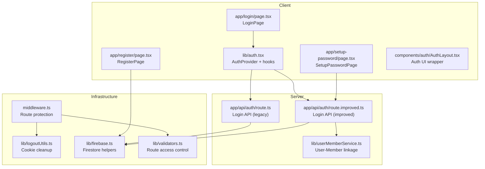
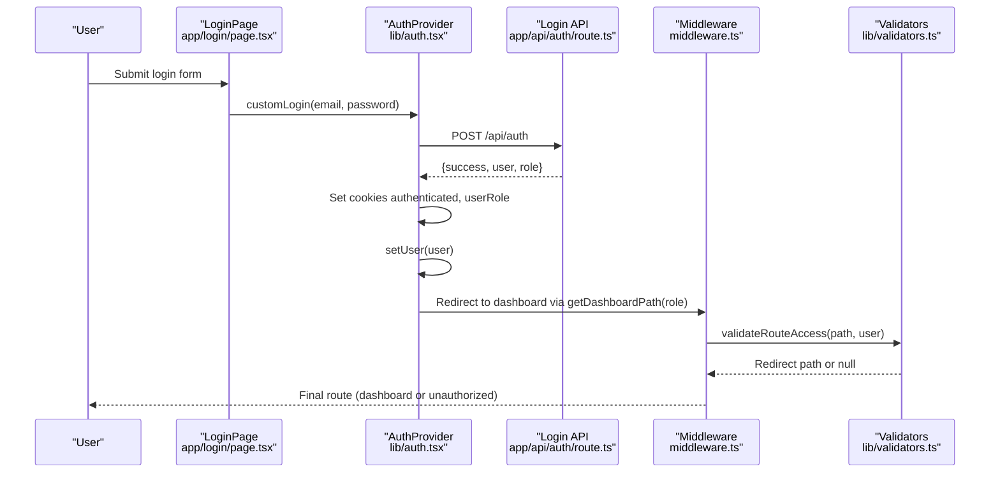
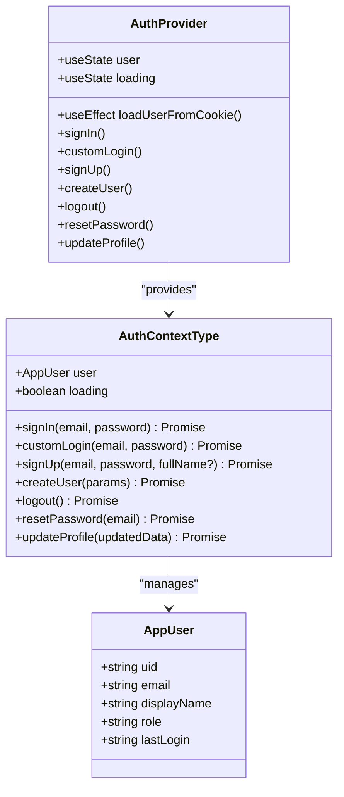
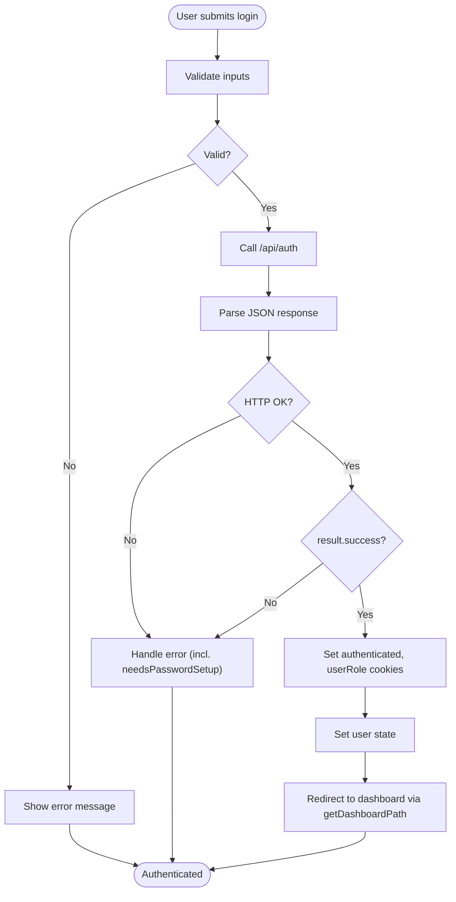
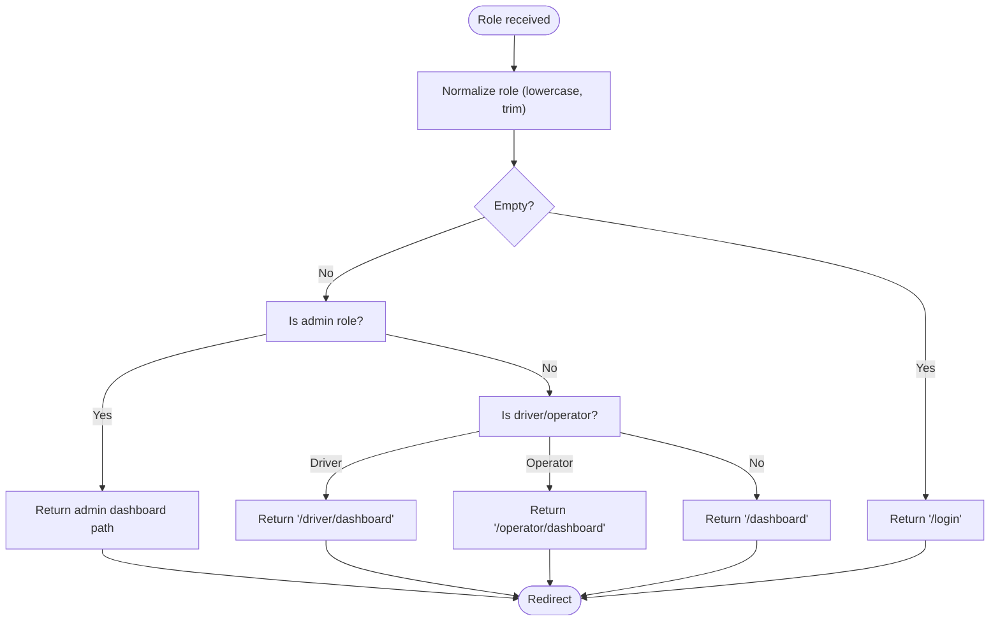
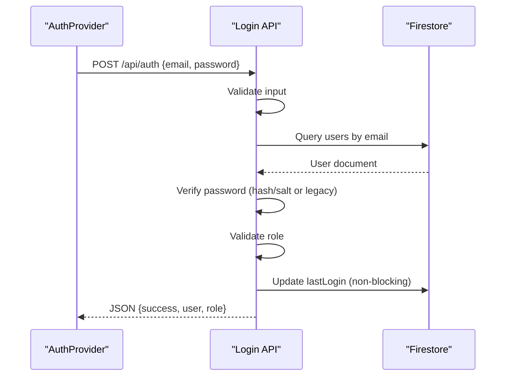
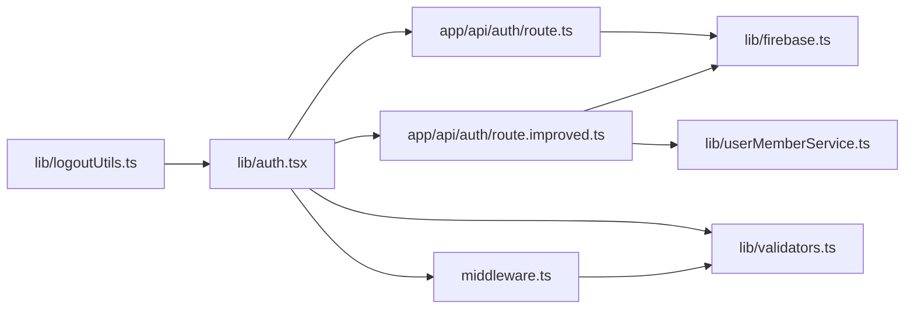

# Authentication Flow & State Management

<cite>
**Referenced Files in This Document**
- [lib/auth.tsx](file://lib/auth.tsx)
- [app/api/auth/route.ts](file://app/api/auth/route.ts)
- [app/api/auth/route.improved.ts](file://app/api/auth/route.improved.ts)
- [lib/logoutUtils.ts](file://lib/logoutUtils.ts)
- [components/auth/AuthLayout.tsx](file://components/auth/AuthLayout.tsx)
- [app/login/page.tsx](file://app/login/page.tsx)
- [app/register/page.tsx](file://app/register/page.tsx)
- [app/setup-password/page.tsx](file://app/setup-password/page.tsx)
- [lib/userActionTracker.ts](file://lib/userActionTracker.ts)
- [lib/firebase.ts](file://lib/firebase.ts)
- [middleware.ts](file://middleware.ts)
- [lib/userMemberService.ts](file://lib/userMemberService.ts)
- [lib/validators.ts](file://lib/validators.ts)
</cite>

## Table of Contents
1. [Introduction](#introduction)
2. [Project Structure](#project-structure)
3. [Core Components](#core-components)
4. [Architecture Overview](#architecture-overview)
5. [Detailed Component Analysis](#detailed-component-analysis)
6. [Dependency Analysis](#dependency-analysis)
7. [Performance Considerations](#performance-considerations)
8. [Troubleshooting Guide](#troubleshooting-guide)
9. [Conclusion](#conclusion)
10. [Appendices](#appendices)

## Introduction
This document explains the centralized authentication flow and state management system built with React Context in lib/auth.tsx. It covers user state management, loading states, authentication lifecycle, cookie-based session handling, and role-based dashboard redirection. It also documents the signIn, signUp, customLogin, and createUser functions, including parameter validation, error handling, and return value structures. Practical guidance is included for implementing new authentication features, extending the authentication context, and handling edge cases such as expired sessions and invalid credentials.

## Project Structure
The authentication system spans client-side React context, serverless API routes, middleware-based route protection, and utility modules for cookies, Firebase access, and user-member linkage.

**Diagram sources**
- [lib/auth.tsx](file://lib/auth.tsx#L158-L680)
- [app/api/auth/route.ts](file://app/api/auth/route.ts#L48-L264)
- [app/api/auth/route.improved.ts](file://app/api/auth/route.improved.ts#L22-L197)
- [lib/logoutUtils.ts](file://lib/logoutUtils.ts#L16-L32)
- [middleware.ts](file://middleware.ts#L5-L56)
- [lib/firebase.ts](file://lib/firebase.ts#L90-L307)
- [lib/userMemberService.ts](file://lib/userMemberService.ts#L99-L198)
- [lib/validators.ts](file://lib/validators.ts#L199-L235)

**Section sources**
- [lib/auth.tsx](file://lib/auth.tsx#L1-L682)
- [app/api/auth/route.ts](file://app/api/auth/route.ts#L1-L295)
- [app/api/auth/route.improved.ts](file://app/api/auth/route.improved.ts#L1-L228)
- [lib/logoutUtils.ts](file://lib/logoutUtils.ts#L1-L93)
- [middleware.ts](file://middleware.ts#L1-L62)
- [lib/firebase.ts](file://lib/firebase.ts#L1-L309)
- [lib/userMemberService.ts](file://lib/userMemberService.ts#L1-L287)
- [lib/validators.ts](file://lib/validators.ts#L1-L236)

## Core Components
- Centralized authentication context (AuthProvider) manages user state, loading flags, and authentication actions.
- Cookie-based session management stores authenticated and userRole cookies for client-side access.
- Role-based redirection uses getDashboardPath to route users to appropriate dashboards.
- API routes validate credentials, enforce role checks, and maintain lastLogin timestamps.
- Middleware enforces route access based on roles and redirects unauthorized users.
- Utility modules provide cookie cleanup, Firebase helpers, and user-member linkage validation.

**Section sources**
- [lib/auth.tsx](file://lib/auth.tsx#L41-L61)
- [lib/auth.tsx](file://lib/auth.tsx#L111-L156)
- [app/api/auth/route.ts](file://app/api/auth/route.ts#L177-L192)
- [middleware.ts](file://middleware.ts#L18-L49)
- [lib/logoutUtils.ts](file://lib/logoutUtils.ts#L16-L32)
- [lib/firebase.ts](file://lib/firebase.ts#L90-L307)
- [lib/userMemberService.ts](file://lib/userMemberService.ts#L99-L198)

## Architecture Overview
The authentication flow integrates client-side React Context with serverless API routes and middleware-based access control.

**Diagram sources**
- [app/login/page.tsx](file://app/login/page.tsx#L26-L79)
- [lib/auth.tsx](file://lib/auth.tsx#L356-L514)
- [app/api/auth/route.ts](file://app/api/auth/route.ts#L48-L248)
- [middleware.ts](file://middleware.ts#L47-L53)
- [lib/validators.ts](file://lib/validators.ts#L199-L235)

## Detailed Component Analysis

### Centralized Authentication Context (AuthProvider)
- Provides user state, loading state, and actions: signIn, customLogin, signUp, createUser, logout, resetPassword, updateProfile.
- Loads user from cookies on mount and sets state accordingly.
- Uses Firestore helpers for direct operations (signUp, createUser) and fetch-based API calls for authentication (signIn, customLogin).
- Sets authenticated and userRole cookies upon successful login.
- Tracks login/logout/profile update actions via userActionTracker.
- Exposes getDashboardPath for role-based redirection.

Key behaviors:
- Cookie loading and user hydration on initial render.
- Input validation and robust error handling for API calls.
- Role validation and redirection to appropriate dashboards.
- Automatic lastLogin updates on successful authentication.

**Section sources**
- [lib/auth.tsx](file://lib/auth.tsx#L158-L680)
- [lib/auth.tsx](file://lib/auth.tsx#L111-L156)
- [lib/userActionTracker.ts](file://lib/userActionTracker.ts#L84-L94)

#### Class Diagram: Auth Context Types

**Diagram sources**
- [lib/auth.tsx](file://lib/auth.tsx#L11-L61)
- [lib/auth.tsx](file://lib/auth.tsx#L158-L680)

### Authentication Flow: Login and Redirection
- LoginPage calls customLogin from useAuth.
- customLogin validates inputs, calls /api/auth, parses JSON, handles HTTP and application-level errors, sets cookies, hydrates user state, and redirects to dashboard via getDashboardPath.
- Middleware intercepts navigation, reads cookies, and enforces route access using validators.

**Diagram sources**
- [app/login/page.tsx](file://app/login/page.tsx#L26-L79)
- [lib/auth.tsx](file://lib/auth.tsx#L356-L514)
- [app/api/auth/route.ts](file://app/api/auth/route.ts#L48-L248)

**Section sources**
- [app/login/page.tsx](file://app/login/page.tsx#L26-L79)
- [lib/auth.tsx](file://lib/auth.tsx#L356-L514)
- [app/api/auth/route.ts](file://app/api/auth/route.ts#L48-L248)

### Cookie-Based Session Management
- Cookies set on successful login:
  - authenticated: user uid
  - userRole: user role
- Cookies are readable by client-side code and used by middleware for route protection.
- clearAllAuthData removes both cookies and localStorage/sessionStorage entries to ensure complete logout.

Security considerations:
- Cookies are not httpOnly; they are intentionally client-readable to enable client-side role checks and automatic redirection.
- Consider adding SameSite and Secure attributes for enhanced security in production.

Automatic cleanup:
- logout clears user state and invokes clearAllAuthData.
- Middleware reads cookies to determine access and redirects as needed.

**Section sources**
- [lib/auth.tsx](file://lib/auth.tsx#L314-L322)
- [lib/logoutUtils.ts](file://lib/logoutUtils.ts#L16-L32)
- [middleware.ts](file://middleware.ts#L18-L39)

### Role-Based Dashboard Redirection
- getDashboardPath maps normalized roles to specific dashboard routes.
- Middleware and validators enforce role-specific access and prevent cross-role navigation.
- Route conflicts are resolved to ensure users land on their correct dashboard.

**Diagram sources**
- [lib/auth.tsx](file://lib/auth.tsx#L111-L156)
- [lib/validators.ts](file://lib/validators.ts#L138-L191)

**Section sources**
- [lib/auth.tsx](file://lib/auth.tsx#L111-L156)
- [lib/validators.ts](file://lib/validators.ts#L138-L191)

### API Routes: Validation and Access Control
- Legacy route (/api/auth) validates input, queries Firestore, compares password hashes, checks role validity, updates lastLogin, and returns JSON.
- Improved route adds enhanced error handling, generic error messages, and non-blocking lastLogin updates.
- Both routes ensure JSON responses and avoid HTML fallbacks.

**Diagram sources**
- [app/api/auth/route.ts](file://app/api/auth/route.ts#L48-L248)
- [app/api/auth/route.improved.ts](file://app/api/auth/route.improved.ts#L22-L197)

**Section sources**
- [app/api/auth/route.ts](file://app/api/auth/route.ts#L48-L248)
- [app/api/auth/route.improved.ts](file://app/api/auth/route.improved.ts#L22-L197)

### User Registration and Password Setup
- RegisterPage performs client-side validation and creates user documents in Firestore with hashed passwords.
- SetupPasswordPage handles password setup for accounts that require it, calling a dedicated API route.

**Section sources**
- [app/register/page.tsx](file://app/register/page.tsx#L152-L210)
- [app/setup-password/page.tsx](file://app/setup-password/page.tsx#L94-L132)

### Middleware and Route Access Control
- Reads authenticated and userRole cookies to infer user identity.
- Uses validators to determine redirect paths for protected routes.
- Redirects unauthenticated users to appropriate login pages and prevents cross-role access.

**Section sources**
- [middleware.ts](file://middleware.ts#L5-L56)
- [lib/validators.ts](file://lib/validators.ts#L199-L235)

## Dependency Analysis
The authentication system exhibits clear separation of concerns:
- Client context depends on API routes for authentication and on validators/middleware for access control.
- API routes depend on Firestore helpers and user-member service for linkage validation.
- Logout utilities centralize cookie/session cleanup.

**Diagram sources**
- [lib/auth.tsx](file://lib/auth.tsx#L1-L682)
- [app/api/auth/route.ts](file://app/api/auth/route.ts#L1-L295)
- [app/api/auth/route.improved.ts](file://app/api/auth/route.improved.ts#L1-L228)
- [lib/validators.ts](file://lib/validators.ts#L1-L236)
- [middleware.ts](file://middleware.ts#L1-L62)
- [lib/firebase.ts](file://lib/firebase.ts#L1-L309)
- [lib/userMemberService.ts](file://lib/userMemberService.ts#L1-L287)
- [lib/logoutUtils.ts](file://lib/logoutUtils.ts#L1-L93)

**Section sources**
- [lib/auth.tsx](file://lib/auth.tsx#L1-L682)
- [app/api/auth/route.ts](file://app/api/auth/route.ts#L1-L295)
- [app/api/auth/route.improved.ts](file://app/api/auth/route.improved.ts#L1-L228)
- [lib/validators.ts](file://lib/validators.ts#L1-L236)
- [middleware.ts](file://middleware.ts#L1-L62)
- [lib/firebase.ts](file://lib/firebase.ts#L1-L309)
- [lib/userMemberService.ts](file://lib/userMemberService.ts#L1-L287)
- [lib/logoutUtils.ts](file://lib/logoutUtils.ts#L1-L93)

## Performance Considerations
- Client-side hashing uses PBKDF2 with 100k iterations; consider adjusting for device capabilities and latency tolerance.
- API routes perform non-blocking lastLogin updates to minimize latency.
- Middleware avoids heavy computations and relies on cookie parsing and validator lookups.
- Firestore helpers encapsulate connection validation and error handling to reduce repeated checks.

[No sources needed since this section provides general guidance]

## Troubleshooting Guide
Common issues and resolutions:
- Invalid response format from API: The client-side login functions detect non-JSON responses and log raw text for debugging. Ensure API routes always return JSON.
- Password setup required: When accounts exist without a password set, the API signals needsPasswordSetup; the client redirects to the setup page.
- Role not assigned or invalid role: The API validates role presence and validity; on failure, the client logs warnings and redirects to login.
- Expired or missing cookies: On mount, the context attempts to hydrate from cookies; if missing or malformed, user state resets to null.
- Logout inconsistencies: Use clearAllAuthData to remove cookies and storage entries; ensure immediate redirect to prevent back navigation.

**Section sources**
- [lib/auth.tsx](file://lib/auth.tsx#L226-L248)
- [lib/auth.tsx](file://lib/auth.tsx#L260-L290)
- [app/api/auth/route.ts](file://app/api/auth/route.ts#L128-L140)
- [app/api/auth/route.ts](file://app/api/auth/route.ts#L165-L175)
- [lib/logoutUtils.ts](file://lib/logoutUtils.ts#L16-L32)

## Conclusion
The authentication system leverages a centralized React Context to manage user state, integrates with serverless API routes for credential validation, and enforces role-based access control via middleware and validators. Cookie-based session management enables seamless client-side redirection and route protection. The design balances usability with security, providing clear extension points for new features and robust error handling for edge cases.

[No sources needed since this section summarizes without analyzing specific files]

## Appendices

### Function Reference: Authentication Actions
- signIn(email, password): Calls API, validates response, sets cookies, hydrates state, tracks login, and redirects.
- customLogin(email, password): Similar to signIn but returns structured result with needsPasswordSetup flag.
- signUp(email, password, fullName?): Validates uniqueness, hashes password, creates user in Firestore, sets cookies, hydrates state.
- createUser(userData): Server-side creation with role validation and password hashing.
- logout(): Clears state and cookies, tracks logout.
- resetPassword(email): Throws for unimplemented flow.
- updateProfile(updatedData): Updates Firestore and local state, tracks profile update.

**Section sources**
- [lib/auth.tsx](file://lib/auth.tsx#L197-L348)
- [lib/auth.tsx](file://lib/auth.tsx#L356-L514)
- [lib/auth.tsx](file://lib/auth.tsx#L516-L561)
- [lib/auth.tsx](file://lib/auth.tsx#L568-L619)
- [lib/auth.tsx](file://lib/auth.tsx#L621-L635)
- [lib/auth.tsx](file://lib/auth.tsx#L637-L642)
- [lib/auth.tsx](file://lib/auth.tsx#L644-L673)

### Practical Examples

- Implementing a new authentication feature:
  - Extend AuthContextType with the new action signature.
  - Add the implementation in AuthProvider, handling input validation and API calls.
  - Update the AuthLayout wrapper for UI consistency.
  - Example path reference: [components/auth/AuthLayout.tsx](file://components/auth/AuthLayout.tsx#L9-L22)

- Extending the authentication context:
  - Add new methods to AuthContextType and implement them in AuthProvider.
  - Ensure cookie/session cleanup is handled via clearAllAuthData on logout.
  - Example path reference: [lib/logoutUtils.ts](file://lib/logoutUtils.ts#L16-L32)

- Handling edge cases:
  - Expired sessions: On mount, if cookies are missing or invalid, user state resets to null; rely on middleware to redirect to login.
  - Invalid credentials: API routes return JSON errors; client displays user-friendly messages.
  - Role conflicts: Validators prevent cross-role access; middleware redirects to appropriate dashboards.
  - Example path references:
    - [middleware.ts](file://middleware.ts#L47-L53)
    - [lib/validators.ts](file://lib/validators.ts#L199-L235)

**Section sources**
- [components/auth/AuthLayout.tsx](file://components/auth/AuthLayout.tsx#L9-L22)
- [lib/logoutUtils.ts](file://lib/logoutUtils.ts#L16-L32)
- [middleware.ts](file://middleware.ts#L47-L53)
- [lib/validators.ts](file://lib/validators.ts#L199-L235)