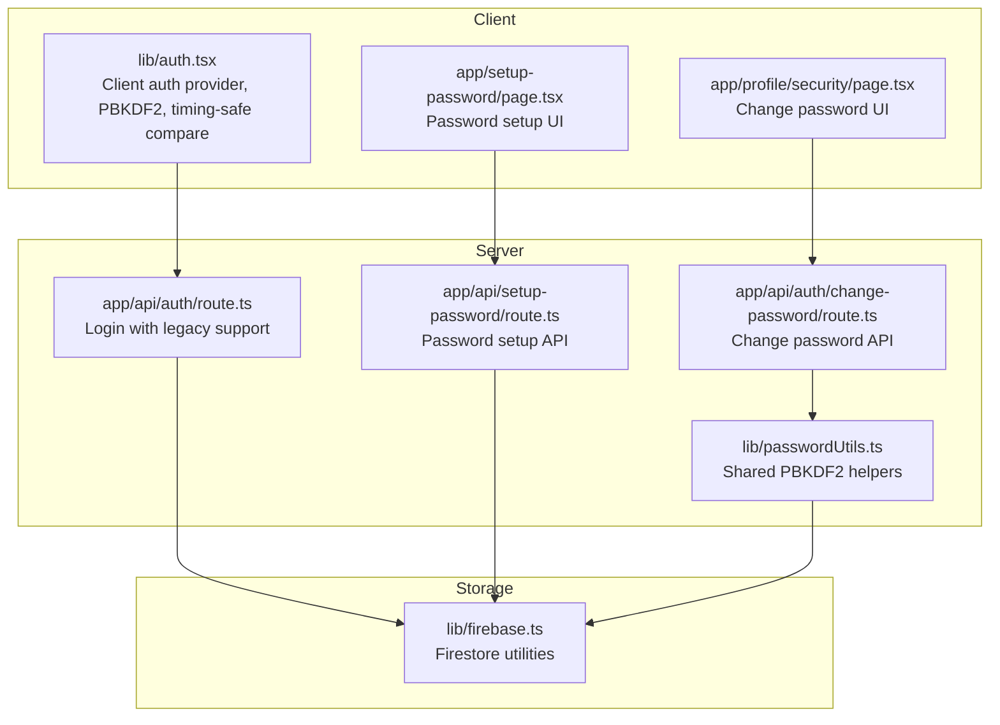
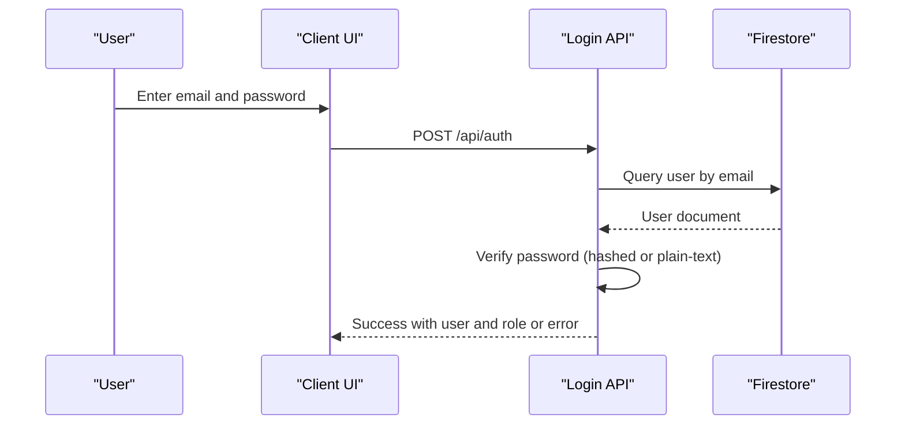
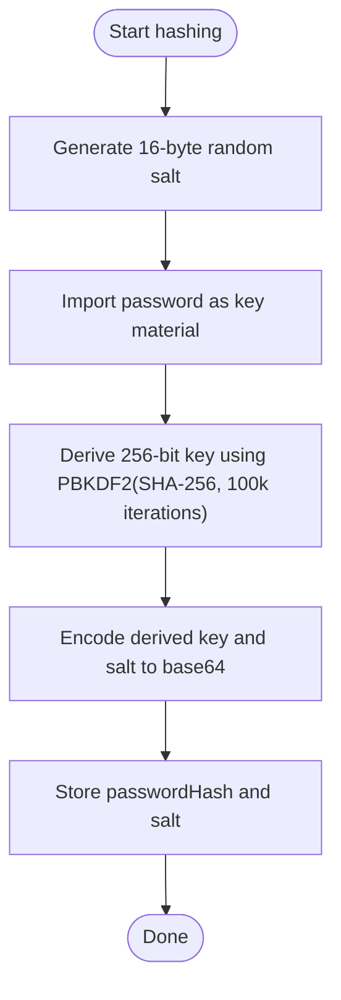
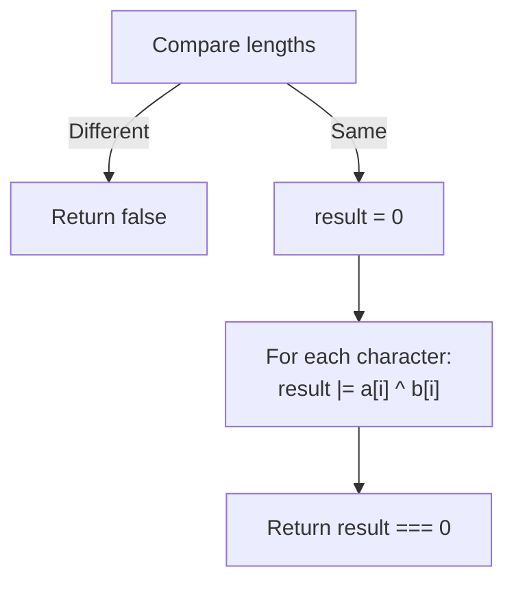
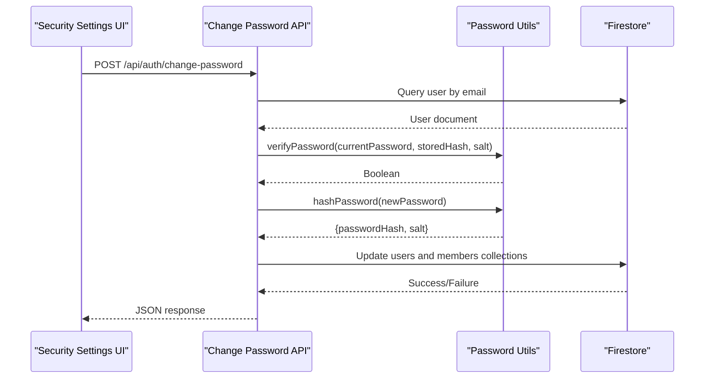
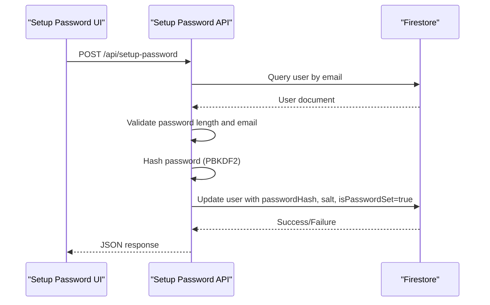
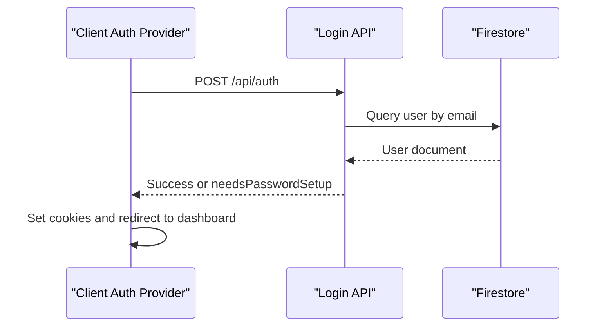
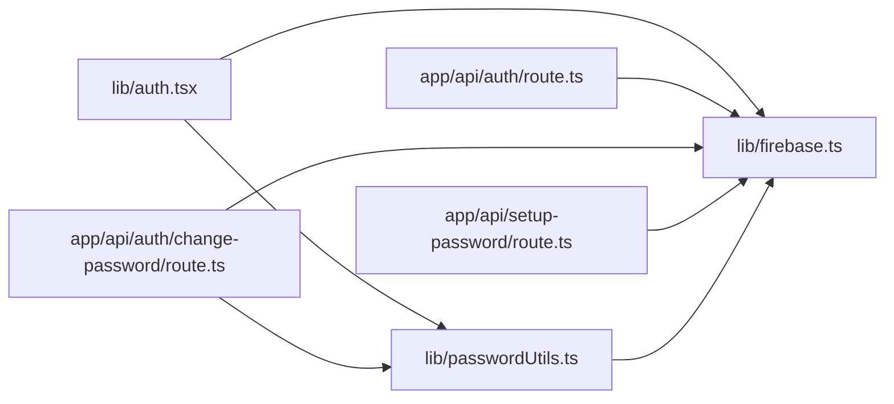

# Password Security & Management

<cite>
**Referenced Files in This Document**
- [lib/auth.tsx](file://lib/auth.tsx)
- [lib/passwordUtils.ts](file://lib/passwordUtils.ts)
- [app/api/auth/route.ts](file://app/api/auth/route.ts)
- [app/api/auth/change-password/route.ts](file://app/api/auth/change-password/route.ts)
- [app/api/setup-password/route.ts](file://app/api/setup-password/route.ts)
- [app/profile/security/page.tsx](file://app/profile/security/page.tsx)
- [app/setup-password/page.tsx](file://app/setup-password/page.tsx)
- [lib/firebase.ts](file://lib/firebase.ts)
</cite>

## Table of Contents
1. [Introduction](#introduction)
2. [Project Structure](#project-structure)
3. [Core Components](#core-components)
4. [Architecture Overview](#architecture-overview)
5. [Detailed Component Analysis](#detailed-component-analysis)
6. [Dependency Analysis](#dependency-analysis)
7. [Performance Considerations](#performance-considerations)
8. [Troubleshooting Guide](#troubleshooting-guide)
9. [Conclusion](#conclusion)
10. [Appendices](#appendices)

## Introduction
This document explains the password security implementation and management across the application. It covers PBKDF2-based password hashing using the Web Crypto API, salt generation, key derivation, timing-safe comparison, validation rules, and security best practices. It also documents the password change workflow, legacy password support (plain text and hashed), and the password setup requirement mechanism that forces new users to set a password upon first login. Finally, it provides guidance for extending the system with additional features such as password expiration and history tracking.

## Project Structure
The password security system spans client-side and server-side components:
- Client-side authentication and login flow with PBKDF2 hashing and timing-safe comparisons
- Server-side login route supporting both hashed and legacy plain-text passwords
- Password change API with validation and PBKDF2 re-hashing
- Password setup API for enforcing initial password creation
- Shared password utilities for hashing, verification, and timing-safe comparison

**Diagram sources**
- [lib/auth.tsx](file://lib/auth.tsx#L1-L682)
- [app/api/auth/route.ts](file://app/api/auth/route.ts#L1-L295)
- [app/api/auth/change-password/route.ts](file://app/api/auth/change-password/route.ts#L1-L98)
- [app/api/setup-password/route.ts](file://app/api/setup-password/route.ts#L1-L177)
- [lib/passwordUtils.ts](file://lib/passwordUtils.ts#L1-L146)
- [lib/firebase.ts](file://lib/firebase.ts#L1-L309)

**Section sources**
- [lib/auth.tsx](file://lib/auth.tsx#L1-L682)
- [app/api/auth/route.ts](file://app/api/auth/route.ts#L1-L295)
- [app/api/auth/change-password/route.ts](file://app/api/auth/change-password/route.ts#L1-L98)
- [app/api/setup-password/route.ts](file://app/api/setup-password/route.ts#L1-L177)
- [lib/passwordUtils.ts](file://lib/passwordUtils.ts#L1-L146)
- [lib/firebase.ts](file://lib/firebase.ts#L1-L309)

## Core Components
- PBKDF2-based hashing and verification using Web Crypto API on the client and Node.js crypto on the server
- Timing-safe string comparison to prevent timing attacks
- Legacy password support allowing migration from plain text to hashed passwords
- Password setup requirement forcing new users to set a password after account creation
- Password change workflow validating current password and updating hashed credentials

**Section sources**
- [lib/auth.tsx](file://lib/auth.tsx#L63-L122)
- [lib/passwordUtils.ts](file://lib/passwordUtils.ts#L64-L122)
- [app/api/auth/route.ts](file://app/api/auth/route.ts#L142-L163)
- [app/api/setup-password/route.ts](file://app/api/setup-password/route.ts#L25-L135)
- [app/api/auth/change-password/route.ts](file://app/api/auth/change-password/route.ts#L5-L98)

## Architecture Overview
The system separates concerns between client and server:
- Client-side: PBKDF2 hashing and verification for sign-up and password change flows
- Server-side: Login validation supporting both hashed and plain-text passwords, plus password setup and change APIs
- Shared utilities: PBKDF2 hashing, verification, and timing-safe comparison

**Diagram sources**
- [app/api/auth/route.ts](file://app/api/auth/route.ts#L48-L264)
- [lib/firebase.ts](file://lib/firebase.ts#L184-L240)

**Section sources**
- [app/api/auth/route.ts](file://app/api/auth/route.ts#L48-L264)
- [lib/firebase.ts](file://lib/firebase.ts#L184-L240)

## Detailed Component Analysis

### PBKDF2-Based Password Hashing (Web Crypto API)
The client-side implementation uses PBKDF2 with SHA-256 and 100,000 iterations. It generates a random 16-byte salt, derives a 256-bit key, and stores both the salt and the base64-encoded hash.

Key characteristics:
- Salt generation via secure random values
- PBKDF2 with SHA-256 and 100,000 iterations
- Base64 encoding for storage
- Timing-safe comparison to prevent timing attacks

**Diagram sources**
- [lib/auth.tsx](file://lib/auth.tsx#L70-L91)
- [lib/passwordUtils.ts](file://lib/passwordUtils.ts#L64-L92)

**Section sources**
- [lib/auth.tsx](file://lib/auth.tsx#L70-L91)
- [lib/passwordUtils.ts](file://lib/passwordUtils.ts#L64-L92)

### Timing-Safe String Comparison
Both client and server implement a constant-time comparison to mitigate timing attacks. The comparison XORs character codes and checks that the aggregated result equals zero.

**Diagram sources**
- [lib/auth.tsx](file://lib/auth.tsx#L98-L109)
- [lib/passwordUtils.ts](file://lib/passwordUtils.ts#L125-L136)
- [app/api/auth/route.ts](file://app/api/auth/route.ts#L5-L17)

**Section sources**
- [lib/auth.tsx](file://lib/auth.tsx#L98-L109)
- [lib/passwordUtils.ts](file://lib/passwordUtils.ts#L125-L136)
- [app/api/auth/route.ts](file://app/api/auth/route.ts#L5-L17)

### Password Validation Rules and Strength Requirements
Validation rules vary by endpoint:
- Change password API enforces a minimum length of 6 characters for the new password
- Setup password API enforces a minimum length of 8 characters and validates email format

These rules help ensure stronger passwords while maintaining usability.

**Section sources**
- [app/api/auth/change-password/route.ts](file://app/api/auth/change-password/route.ts#L23-L35)
- [app/api/setup-password/route.ts](file://app/api/setup-password/route.ts#L53-L62)

### Legacy Password Support
The login route supports both hashed and plain-text passwords for backward compatibility:
- If a user has a stored hash and salt, the server verifies using PBKDF2
- If only a plain-text password exists, it compares securely using timing-safe equality
- If the password is not set, the server signals that a password setup is required

This allows gradual migration from plain-text to hashed storage.

**Section sources**
- [app/api/auth/route.ts](file://app/api/auth/route.ts#L142-L163)
- [lib/auth.tsx](file://lib/auth.tsx#L23-L31)

### Password Change Workflow
The change password API performs the following steps:
- Validates input (email, current password, new password)
- Queries the user by email to obtain the user ID
- Calls the shared password utility to verify the current password and update to a new hash
- Updates both users and members collections when applicable

**Diagram sources**
- [app/api/auth/change-password/route.ts](file://app/api/auth/change-password/route.ts#L5-L98)
- [lib/passwordUtils.ts](file://lib/passwordUtils.ts#L4-L62)
- [lib/firebase.ts](file://lib/firebase.ts#L184-L240)

**Section sources**
- [app/api/auth/change-password/route.ts](file://app/api/auth/change-password/route.ts#L5-L98)
- [lib/passwordUtils.ts](file://lib/passwordUtils.ts#L4-L62)
- [lib/firebase.ts](file://lib/firebase.ts#L184-L240)

### Password Setup Requirement Mechanism
New users are directed to set a password after account creation:
- The setup route enforces password length and email format
- It queries the user by email and checks that the password is not already set
- It hashes the new password and updates the user document, marking the password as set

**Diagram sources**
- [app/api/setup-password/route.ts](file://app/api/setup-password/route.ts#L25-L135)
- [app/setup-password/page.tsx](file://app/setup-password/page.tsx#L94-L132)
- [lib/firebase.ts](file://lib/firebase.ts#L184-L240)

**Section sources**
- [app/api/setup-password/route.ts](file://app/api/setup-password/route.ts#L25-L135)
- [app/setup-password/page.tsx](file://app/setup-password/page.tsx#L94-L132)
- [lib/firebase.ts](file://lib/firebase.ts#L184-L240)

### Client-Side Authentication and Login Flow
The client-side auth provider:
- Encodes credentials and posts to the login API
- Handles JSON responses and redirects to password setup when required
- Sets authentication cookies and navigates to the appropriate dashboard based on role

**Diagram sources**
- [lib/auth.tsx](file://lib/auth.tsx#L197-L348)
- [app/api/auth/route.ts](file://app/api/auth/route.ts#L48-L264)

**Section sources**
- [lib/auth.tsx](file://lib/auth.tsx#L197-L348)
- [app/api/auth/route.ts](file://app/api/auth/route.ts#L48-L264)

## Dependency Analysis
The following diagram shows the primary dependencies among password-related modules:

**Diagram sources**
- [lib/auth.tsx](file://lib/auth.tsx#L1-L682)
- [lib/passwordUtils.ts](file://lib/passwordUtils.ts#L1-L146)
- [app/api/auth/route.ts](file://app/api/auth/route.ts#L1-L295)
- [app/api/auth/change-password/route.ts](file://app/api/auth/change-password/route.ts#L1-L98)
- [app/api/setup-password/route.ts](file://app/api/setup-password/route.ts#L1-L177)
- [lib/firebase.ts](file://lib/firebase.ts#L1-L309)

**Section sources**
- [lib/auth.tsx](file://lib/auth.tsx#L1-L682)
- [lib/passwordUtils.ts](file://lib/passwordUtils.ts#L1-L146)
- [app/api/auth/route.ts](file://app/api/auth/route.ts#L1-L295)
- [app/api/auth/change-password/route.ts](file://app/api/auth/change-password/route.ts#L1-L98)
- [app/api/setup-password/route.ts](file://app/api/setup-password/route.ts#L1-L177)
- [lib/firebase.ts](file://lib/firebase.ts#L1-L309)

## Performance Considerations
- PBKDF2 iteration count: 100,000 iterations balance security and performance; adjust based on hardware capabilities and latency requirements
- Timing-safe comparison: O(n) operation; negligible overhead compared to PBKDF2 cost
- Client vs server hashing: Client hashing reduces server load; server hashing centralizes security logic and avoids client-side cryptography exposure
- Storage overhead: Base64 encoding increases storage by approximately 33%; acceptable trade-off for portability and simplicity

[No sources needed since this section provides general guidance]

## Troubleshooting Guide
Common issues and resolutions:
- Invalid response format: The client login flow validates content-type and parses raw text for debugging; ensure the API returns JSON
- Password setup required: When a user account exists but lacks a password, the server returns a specific flag; redirect to the setup page accordingly
- Incorrect password: The server returns a generic error to prevent user enumeration; ensure UI provides clear feedback without leaking account existence
- Database query failures: Firestore utility functions return structured errors; check Firestore rules and connectivity

**Section sources**
- [lib/auth.tsx](file://lib/auth.tsx#L226-L248)
- [app/api/auth/route.ts](file://app/api/auth/route.ts#L128-L163)
- [lib/firebase.ts](file://lib/firebase.ts#L184-L240)

## Conclusion
The system implements robust password security using PBKDF2 with Web Crypto API on the client and Node.js crypto on the server, combined with timing-safe comparisons and legacy password support. The password setup requirement and change workflow ensure strong, compliant password management. Extending the system with features like password expiration and history tracking is straightforward by adding fields to user documents and updating validation logic.

[No sources needed since this section summarizes without analyzing specific files]

## Appendices

### Implementing Additional Password Security Features
- Password expiration: Add a field storing the password creation date and enforce periodic renewal in the login flow
- Password history: Maintain a list of previously used hashes and block reuse during password changes
- Multi-factor authentication: Integrate with an MFA provider and require secondary verification before password changes
- Rate limiting: Apply rate limits to login attempts and password change requests to mitigate brute-force attacks

[No sources needed since this section provides general guidance]