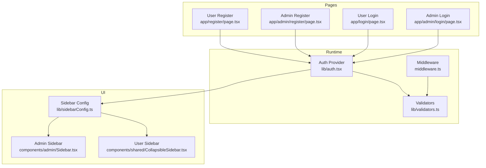
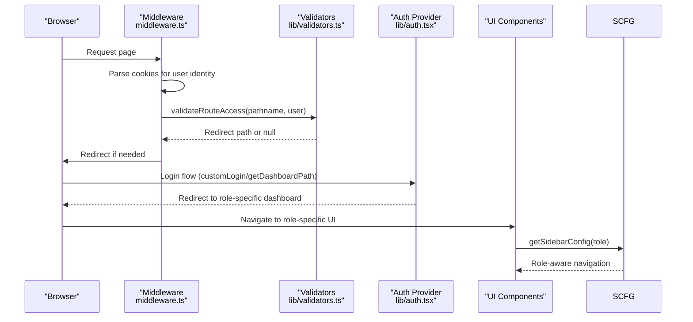
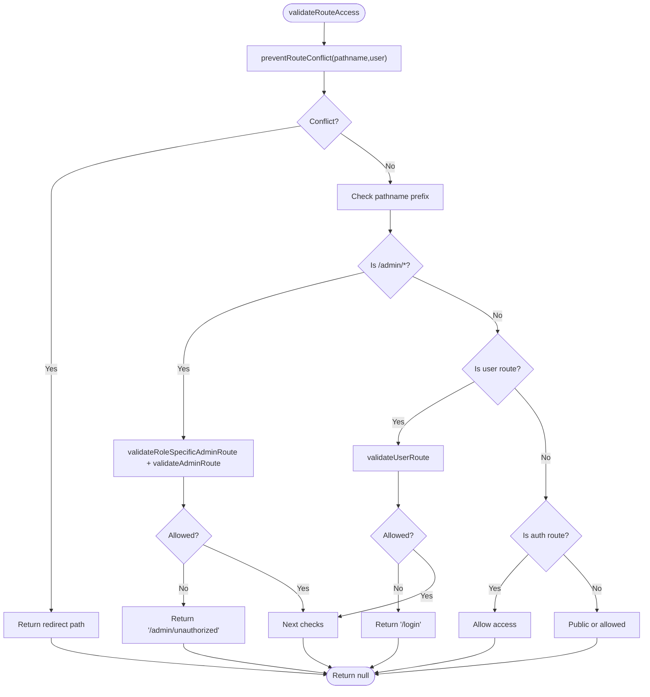
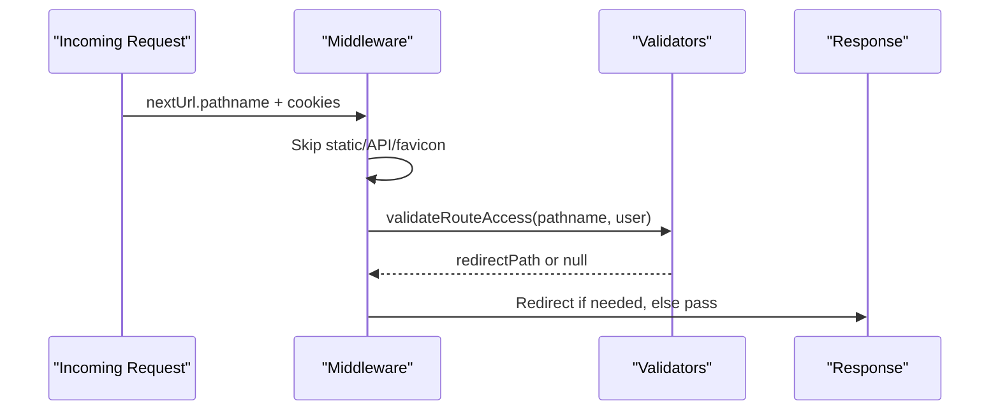
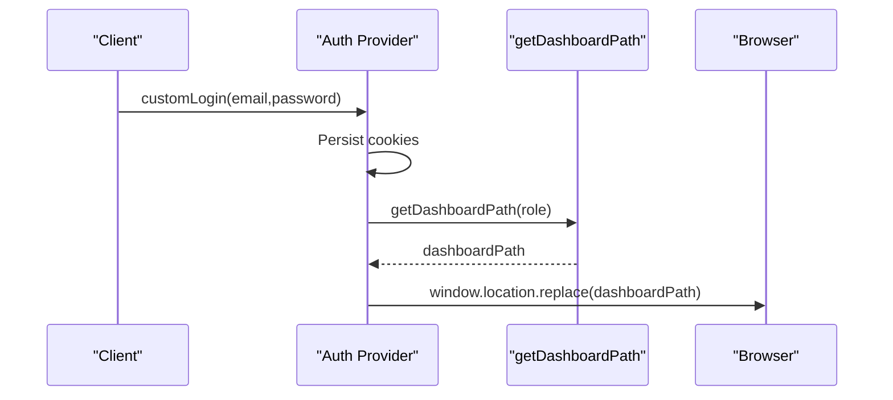
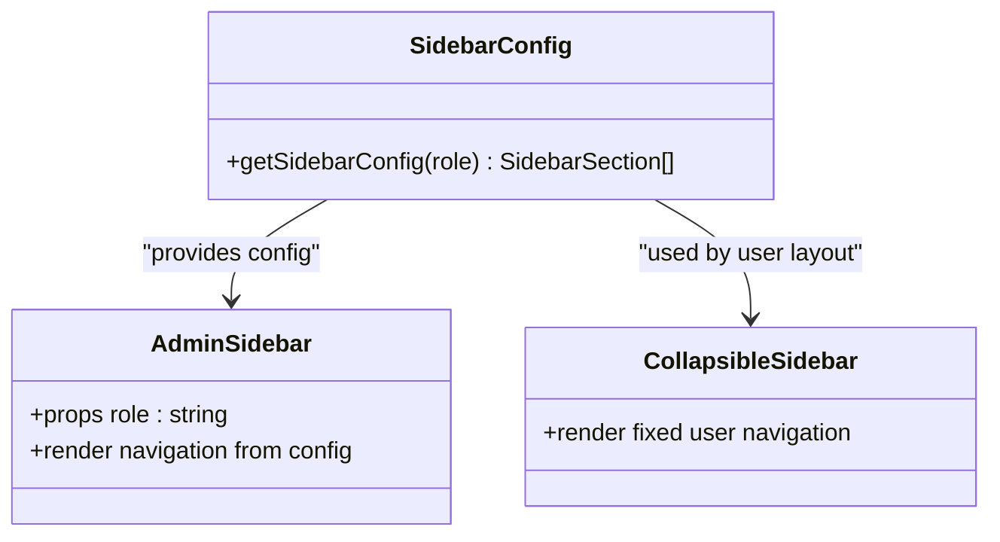
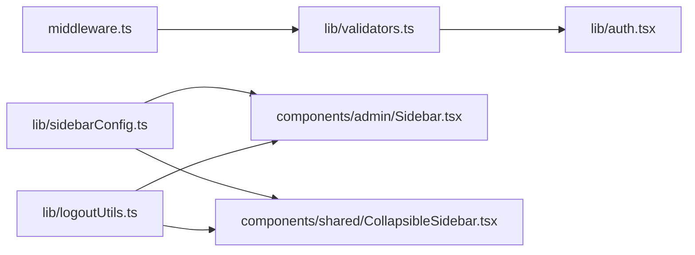

# Role-Based Access Control (RBAC)

<cite>
**Referenced Files in This Document**
- [lib/validators.ts](file://lib/validators.ts)
- [middleware.ts](file://middleware.ts)
- [lib/sidebarConfig.ts](file://lib/sidebarConfig.ts)
- [lib/auth.tsx](file://lib/auth.tsx)
- [ROLE_BASED_ACCESS_CONTROL.md](file://ROLE_BASED_ACCESS_CONTROL.md)
- [app/admin/layout.tsx](file://app/admin/layout.tsx)
- [components/admin/Sidebar.tsx](file://components/admin/Sidebar.tsx)
- [components/shared/CollapsibleSidebar.tsx](file://components/shared/CollapsibleSidebar.tsx)
- [lib/logoutUtils.ts](file://lib/logoutUtils.ts)
- [app/admin/login/page.tsx](file://app/admin/login/page.tsx)
- [app/login/page.tsx](file://app/login/page.tsx)
- [app/admin/register/page.tsx](file://app/admin/register/page.tsx)
- [app/register/page.tsx](file://app/register/page.tsx)
- [scripts/test-role-based-routing.js](file://scripts/test-role-based-routing.js)
</cite>

## Table of Contents
1. [Introduction](#introduction)
2. [Project Structure](#project-structure)
3. [Core Components](#core-components)
4. [Architecture Overview](#architecture-overview)
5. [Detailed Component Analysis](#detailed-component-analysis)
6. [Dependency Analysis](#dependency-analysis)
7. [Performance Considerations](#performance-considerations)
8. [Troubleshooting Guide](#troubleshooting-guide)
9. [Conclusion](#conclusion)
10. [Appendices](#appendices)

## Introduction
This document explains the Role-Based Access Control (RBAC) system that governs how users are authenticated, authorized, and routed within the application. It covers the supported roles, validation logic, middleware enforcement, dynamic sidebar generation, and dashboard redirection. It also provides practical guidance for extending the system with new roles, permissions, and custom access control rules.

## Project Structure
The RBAC system spans several layers:
- Authentication and routing orchestration in the auth provider and middleware
- Route validation and redirection logic in dedicated validators
- Role-aware UI via dynamic sidebar configuration
- Role-specific dashboards and enforced access in admin/user layouts
- Centralized logout utilities for consistent behavior

**Diagram sources**
- [middleware.ts](file://middleware.ts#L1-L62)
- [lib/validators.ts](file://lib/validators.ts#L1-L236)
- [lib/auth.tsx](file://lib/auth.tsx#L1-L682)
- [lib/sidebarConfig.ts](file://lib/sidebarConfig.ts#L1-L262)
- [components/admin/Sidebar.tsx](file://components/admin/Sidebar.tsx#L1-L279)
- [components/shared/CollapsibleSidebar.tsx](file://components/shared/CollapsibleSidebar.tsx#L1-L156)
- [app/admin/login/page.tsx](file://app/admin/login/page.tsx#L1-L227)
- [app/login/page.tsx](file://app/login/page.tsx#L1-L223)
- [app/admin/register/page.tsx](file://app/admin/register/page.tsx#L1-L309)
- [app/register/page.tsx](file://app/register/page.tsx#L1-L323)

**Section sources**
- [lib/validators.ts](file://lib/validators.ts#L1-L236)
- [middleware.ts](file://middleware.ts#L1-L62)
- [lib/sidebarConfig.ts](file://lib/sidebarConfig.ts#L1-L262)
- [lib/auth.tsx](file://lib/auth.tsx#L1-L682)

## Core Components
- Role definitions and validation:
  - Admin roles: admin, secretary, chairman, vice chairman, manager, treasurer, board of directors
  - User roles: member, driver, operator
- Route validation functions:
  - Admin route validation, role-specific admin route validation, user route validation, auth route allowance
  - Dashboard route resolution and conflict prevention
  - Unified route access validator that integrates conflict checks and role-based allowances
- Middleware:
  - Reads cookies to reconstruct user identity, excludes API and static assets, and enforces redirects
- Dynamic sidebar:
  - Role-aware navigation sections and items
- Auth provider:
  - Dashboard path resolution helper, login flow, and role-based redirection
- Logout utilities:
  - Centralized, immediate logout with role-appropriate redirects

**Section sources**
- [lib/validators.ts](file://lib/validators.ts#L9-L236)
- [middleware.ts](file://middleware.ts#L5-L56)
- [lib/sidebarConfig.ts](file://lib/sidebarConfig.ts#L258-L262)
- [lib/auth.tsx](file://lib/auth.tsx#L111-L156)
- [lib/logoutUtils.ts](file://lib/logoutUtils.ts#L16-L93)

## Architecture Overview
The RBAC architecture combines runtime middleware enforcement with client-side auth orchestration and UI adaptation:

**Diagram sources**
- [middleware.ts](file://middleware.ts#L5-L56)
- [lib/validators.ts](file://lib/validators.ts#L199-L235)
- [lib/auth.tsx](file://lib/auth.tsx#L111-L156)
- [lib/sidebarConfig.ts](file://lib/sidebarConfig.ts#L258-L262)

## Detailed Component Analysis

### Role Definitions and Permissions
- Admin roles:
  - Can access admin dashboards and role-specific admin sections
  - Role-specific admin route validation restricts access to the correct subsection
- User roles:
  - Can access user dashboards (/dashboard, /driver/dashboard, /operator/dashboard)
  - Cannot access admin routes except login/register
- Auth routes:
  - Open to everyone (including authenticated users) to allow re-authentication and logout flows

**Section sources**
- [lib/validators.ts](file://lib/validators.ts#L9-L80)
- [lib/validators.ts](file://lib/validators.ts#L206-L235)

### Route Validation Mechanisms
The validation pipeline:
- Conflict prevention: Ensures users land on the correct dashboard for their role and prevents cross-access between admin and user dashboards
- Role-specific admin route checks: Enforces that role-specific admin paths are only accessible by the designated role
- General route access checks: Applies admin/user route rules and allows auth routes

**Diagram sources**
- [lib/validators.ts](file://lib/validators.ts#L112-L235)

**Section sources**
- [lib/validators.ts](file://lib/validators.ts#L112-L235)

### Middleware-Based Route Protection
- Excludes static assets, API routes, and favicon from middleware processing
- Parses cookies to reconstruct user identity for validation
- Redirects unauthorized users to appropriate login pages
- Forces root path to user login for clarity

**Diagram sources**
- [middleware.ts](file://middleware.ts#L5-L56)
- [lib/validators.ts](file://lib/validators.ts#L199-L235)

**Section sources**
- [middleware.ts](file://middleware.ts#L58-L62)

### Dashboard Redirection Logic
- On successful login, the auth provider sets cookies and redirects users to their role-specific dashboard
- The helper function resolves the correct path for each role, including role-specific admin home pages and individual dashboards for drivers/operators
- Invalid or missing roles redirect to login with warnings

**Diagram sources**
- [lib/auth.tsx](file://lib/auth.tsx#L314-L340)
- [lib/auth.tsx](file://lib/auth.tsx#L111-L156)

**Section sources**
- [lib/auth.tsx](file://lib/auth.tsx#L111-L156)
- [lib/auth.tsx](file://lib/auth.tsx#L314-L340)

### Sidebar Configuration System
- Role-aware navigation sections and items are defined centrally
- Admin and user sidebars consume the configuration and render role-appropriate menus
- The sidebar adapts dynamically to the user’s role and highlights the active route

**Diagram sources**
- [lib/sidebarConfig.ts](file://lib/sidebarConfig.ts#L258-L262)
- [components/admin/Sidebar.tsx](file://components/admin/Sidebar.tsx#L92-L102)
- [components/shared/CollapsibleSidebar.tsx](file://components/shared/CollapsibleSidebar.tsx#L74-L80)

**Section sources**
- [lib/sidebarConfig.ts](file://lib/sidebarConfig.ts#L29-L262)
- [components/admin/Sidebar.tsx](file://components/admin/Sidebar.tsx#L92-L102)
- [components/shared/CollapsibleSidebar.tsx](file://components/shared/CollapsibleSidebar.tsx#L74-L80)

### Admin Layout and Role Enforcement
- Admin layout enforces admin-only access using a dedicated validator
- Non-admin users are redirected to admin login
- Sidebar is rendered conditionally based on the current page and user role

**Section sources**
- [app/admin/layout.tsx](file://app/admin/layout.tsx#L19-L42)
- [lib/validators.ts](file://lib/validators.ts#L9-L19)

### Login and Registration Pages
- Admin and user login pages integrate with the auth provider and display role-specific feedback
- Admin and user registration pages create user documents with assigned roles and hashed passwords

**Section sources**
- [app/admin/login/page.tsx](file://app/admin/login/page.tsx#L27-L84)
- [app/login/page.tsx](file://app/login/page.tsx#L26-L79)
- [app/admin/register/page.tsx](file://app/admin/register/page.tsx#L142-L199)
- [app/register/page.tsx](file://app/register/page.tsx#L152-L210)

### Logout Utilities
- Centralized logout clears cookies and storage, then redirects to the appropriate login page based on context

**Section sources**
- [lib/logoutUtils.ts](file://lib/logoutUtils.ts#L16-L93)

## Dependency Analysis
The RBAC system exhibits clear separation of concerns:
- Validators depend on the auth model and dashboard path helper
- Middleware depends on validators and cookies
- UI components depend on sidebar configuration and auth context
- Auth provider coordinates login, redirection, and cookie management

**Diagram sources**
- [lib/validators.ts](file://lib/validators.ts#L1-L236)
- [middleware.ts](file://middleware.ts#L1-L62)
- [lib/sidebarConfig.ts](file://lib/sidebarConfig.ts#L1-L262)
- [components/admin/Sidebar.tsx](file://components/admin/Sidebar.tsx#L1-L279)
- [components/shared/CollapsibleSidebar.tsx](file://components/shared/CollapsibleSidebar.tsx#L1-L156)
- [lib/logoutUtils.ts](file://lib/logoutUtils.ts#L1-L93)
- [lib/auth.tsx](file://lib/auth.tsx#L1-L682)

**Section sources**
- [lib/validators.ts](file://lib/validators.ts#L1-L236)
- [middleware.ts](file://middleware.ts#L1-L62)
- [lib/sidebarConfig.ts](file://lib/sidebarConfig.ts#L1-L262)
- [lib/auth.tsx](file://lib/auth.tsx#L1-L682)
- [lib/logoutUtils.ts](file://lib/logoutUtils.ts#L1-L93)

## Performance Considerations
- Cookie parsing in middleware is lightweight and avoids heavy computations
- Validators use simple string comparisons and early exits to minimize overhead
- Dashboard path resolution is a constant-time lookup
- Sidebar configuration is loaded once per role and reused across renders

## Troubleshooting Guide
Common issues and resolutions:
- Unexpected redirects to login:
  - Verify role assignment in the user record and cookie presence
  - Check conflict prevention logic for incorrect role-to-dashboard mapping
- Admin users accessing user dashboards:
  - Ensure middleware is not bypassed and validators are invoked
  - Confirm role-specific admin route validation matches the intended role
- Invalid or missing roles:
  - The system logs warnings and redirects to login; confirm backend writes a valid role
- Sidebar shows incorrect items:
  - Ensure the role string normalization matches keys in the sidebar configuration
- Logout not working:
  - Use centralized logout utilities to clear cookies and storage, then redirect

**Section sources**
- [lib/validators.ts](file://lib/validators.ts#L112-L191)
- [lib/logoutUtils.ts](file://lib/logoutUtils.ts#L16-L93)

## Conclusion
The RBAC system provides a robust, maintainable foundation for enforcing role-based access across the application. It leverages middleware for global protection, centralized validators for route decisions, dynamic UI configuration for role-aware navigation, and a cohesive auth provider for seamless redirection. The modular design supports future enhancements such as permission-based controls and audit logging.

## Appendices

### Supported Roles and Dashboards
- Admin roles: admin, secretary, chairman, vice chairman, manager, treasurer, board of directors
- User roles: member, driver, operator

**Section sources**
- [ROLE_BASED_ACCESS_CONTROL.md](file://ROLE_BASED_ACCESS_CONTROL.md#L9-L24)

### Adding a New Role
Steps:
- Extend the role lists in validators and auth helpers
- Add a new dashboard path mapping in the dashboard path resolver
- Update the sidebar configuration with appropriate sections and items
- Ensure registration pages allow selecting the new role
- Add tests to verify routing and access behavior

Example references:
- Dashboard path mapping: [lib/auth.tsx](file://lib/auth.tsx#L111-L156)
- Sidebar configuration: [lib/sidebarConfig.ts](file://lib/sidebarConfig.ts#L29-L262)
- Admin registration roles: [app/admin/register/page.tsx](file://app/admin/register/page.tsx#L37-L48)
- User registration roles: [app/register/page.tsx](file://app/register/page.tsx#L39-L49)

### Modifying Permissions
- Adjust the allowed roles in validators for admin/user routes
- Update role-specific admin route validation to reflect new access boundaries
- Re-run tests to ensure no regressions

References:
- Admin route validation: [lib/validators.ts](file://lib/validators.ts#L9-L19)
- Role-specific admin route validation: [lib/validators.ts](file://lib/validators.ts#L27-L60)
- User route validation: [lib/validators.ts](file://lib/validators.ts#L67-L80)

### Implementing Custom Access Control Rules
- Add new validation functions in validators for domain-specific checks
- Integrate custom checks into the route access validator chain
- Ensure middleware still applies global protections around custom rules

References:
- Route access validator: [lib/validators.ts](file://lib/validators.ts#L199-L235)
- Middleware integration: [middleware.ts](file://middleware.ts#L47-L53)

### Testing the RBAC System
- Use the provided test script to validate role-based routing and edge cases
- Run the test suite to verify case insensitivity, whitespace handling, and invalid role handling

References:
- Test script: [scripts/test-role-based-routing.js](file://scripts/test-role-based-routing.js#L1-L126)