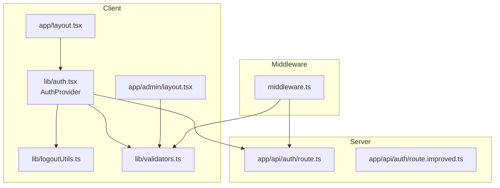
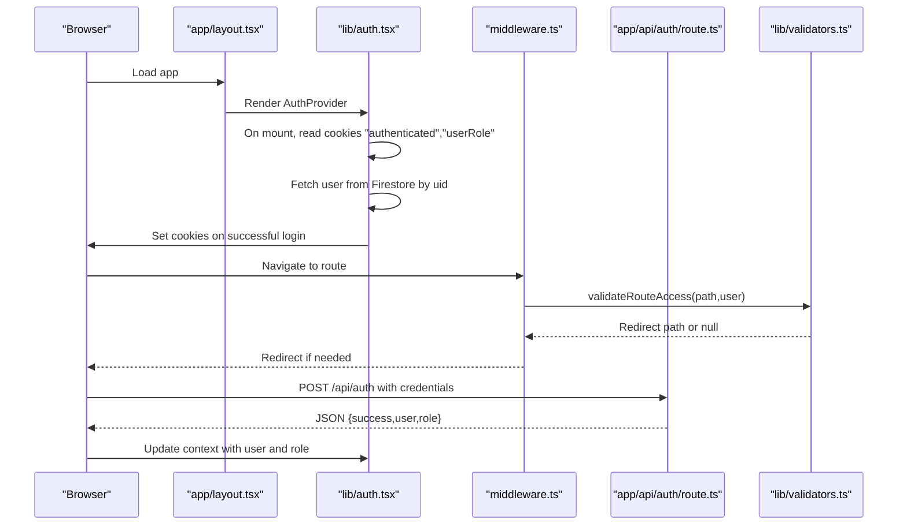
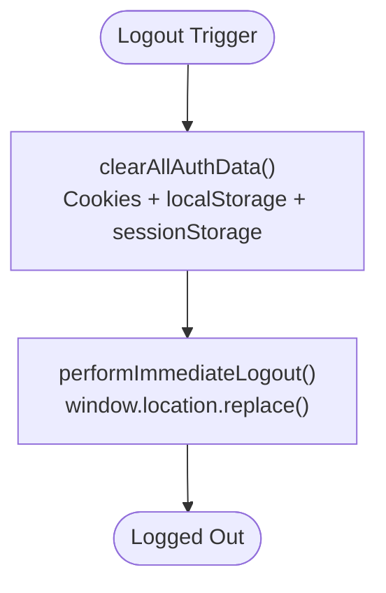
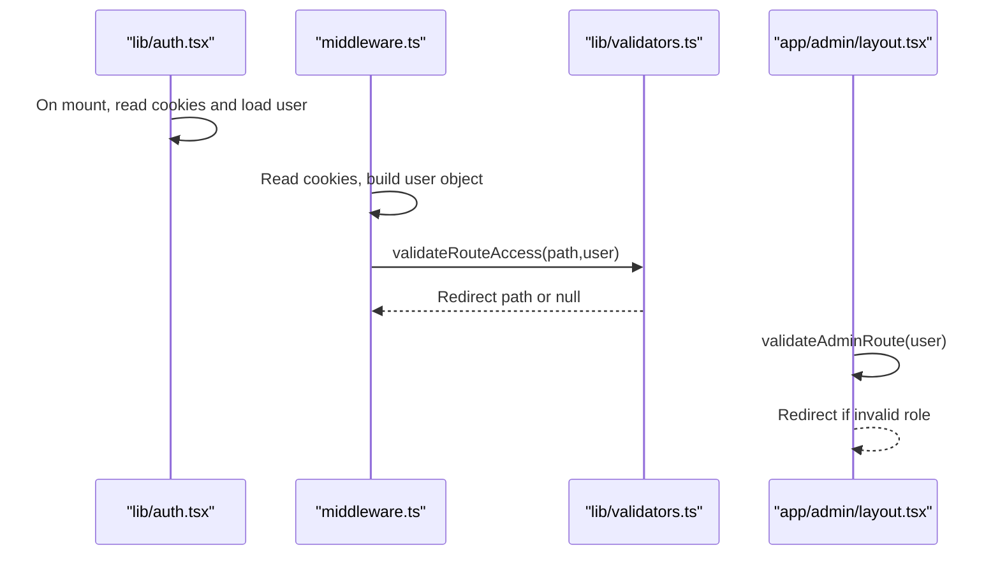
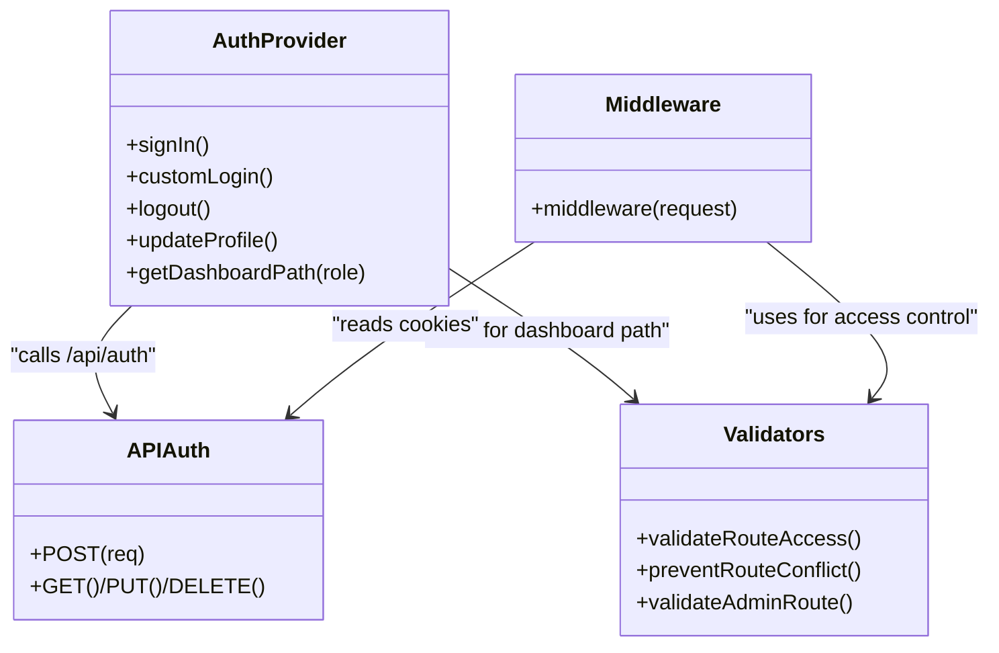
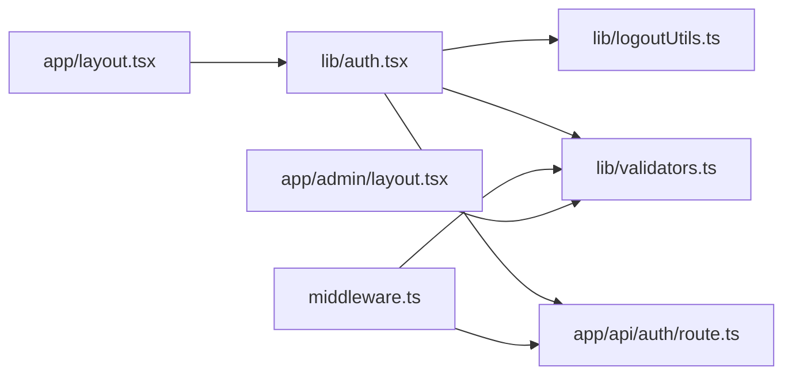

# Session Management & Security

<cite>
**Referenced Files in This Document**
- [lib/logoutUtils.ts](file://lib/logoutUtils.ts)
- [lib/auth.tsx](file://lib/auth.tsx)
- [middleware.ts](file://middleware.ts)
- [lib/validators.ts](file://lib/validators.ts)
- [app/layout.tsx](file://app/layout.tsx)
- [app/api/auth/route.ts](file://app/api/auth/route.ts)
- [app/api/auth/route.improved.ts](file://app/api/auth/route.improved.ts)
- [app/admin/layout.tsx](file://app/admin/layout.tsx)
- [lib/userActionTracker.ts](file://lib/userActionTracker.ts)
- [package.json](file://package.json)
</cite>

## Table of Contents
1. [Introduction](#introduction)
2. [Project Structure](#project-structure)
3. [Core Components](#core-components)
4. [Architecture Overview](#architecture-overview)
5. [Detailed Component Analysis](#detailed-component-analysis)
6. [Dependency Analysis](#dependency-analysis)
7. [Performance Considerations](#performance-considerations)
8. [Troubleshooting Guide](#troubleshooting-guide)
9. [Conclusion](#conclusion)
10. [Appendices](#appendices)

## Introduction
This document explains the session management and security mechanisms implemented in the application. It focuses on the cookie-based session system, including the authenticated and userRole cookies, their expiration handling, and security attributes. It documents automatic logout mechanisms, session timeout handling, and cleanup procedures; the session validation process on application startup and during navigation; and the integration between client-side authentication state and server-side session validation through middleware. It also covers security considerations such as cookie security flags, path restrictions, and CSRF prevention, along with practical examples for extending the system.

## Project Structure
The session and security logic spans several layers:
- Client-side authentication provider and utilities
- Middleware for route-level access control
- API authentication routes
- Validation helpers for role-based routing
- Logout utilities and action tracking

**Diagram sources**
- [app/layout.tsx](file://app/layout.tsx#L22-L37)
- [lib/auth.tsx](file://lib/auth.tsx#L158-L195)
- [lib/logoutUtils.ts](file://lib/logoutUtils.ts#L16-L32)
- [lib/validators.ts](file://lib/validators.ts#L199-L235)
- [app/admin/layout.tsx](file://app/admin/layout.tsx#L9-L33)
- [middleware.ts](file://middleware.ts#L5-L56)
- [app/api/auth/route.ts](file://app/api/auth/route.ts#L48-L264)
- [app/api/auth/route.improved.ts](file://app/api/auth/route.improved.ts#L22-L197)

**Section sources**
- [app/layout.tsx](file://app/layout.tsx#L22-L37)
- [lib/auth.tsx](file://lib/auth.tsx#L158-L195)
- [lib/logoutUtils.ts](file://lib/logoutUtils.ts#L16-L32)
- [lib/validators.ts](file://lib/validators.ts#L199-L235)
- [app/admin/layout.tsx](file://app/admin/layout.tsx#L9-L33)
- [middleware.ts](file://middleware.ts#L5-L56)
- [app/api/auth/route.ts](file://app/api/auth/route.ts#L48-L264)
- [app/api/auth/route.improved.ts](file://app/api/auth/route.improved.ts#L22-L197)

## Core Components
- Cookie-based session:
  - authenticated: stores the user identifier
  - userRole: stores the user’s role
  - Both are non-HTTP-only, readable by client-side code, and scoped to the root path with a seven-day expiration
- Client-side authentication provider:
  - Loads user from cookies on mount, validates and normalizes roles, and redirects to appropriate dashboards
  - Sets cookies upon successful login and clears them on logout
- Middleware:
  - Reads cookies to determine user identity and role
  - Applies route access validation and redirects accordingly
- Logout utilities:
  - Clear cookies, localStorage, and sessionStorage; force immediate redirect
- Validation helpers:
  - Role-specific access checks and conflict prevention across admin/user dashboards
- API authentication routes:
  - Validate credentials, roles, and linkage; return JSON responses; update last login timestamps

**Section sources**
- [lib/auth.tsx](file://lib/auth.tsx#L163-L195)
- [lib/auth.tsx](file://lib/auth.tsx#L314-L322)
- [lib/auth.tsx](file://lib/auth.tsx#L472-L480)
- [lib/logoutUtils.ts](file://lib/logoutUtils.ts#L16-L32)
- [middleware.ts](file://middleware.ts#L18-L39)
- [lib/validators.ts](file://lib/validators.ts#L199-L235)
- [app/api/auth/route.ts](file://app/api/auth/route.ts#L114-L175)
- [app/api/auth/route.improved.ts](file://app/api/auth/route.improved.ts#L100-L127)

## Architecture Overview
The system uses a cookie-based session persisted in the browser. On application startup, the client reads cookies to reconstruct the user state. Navigation triggers middleware-based access checks using the same cookies. Authentication requests are handled by dedicated API routes that validate credentials server-side and return structured JSON responses. Logout clears all authentication artifacts and redirects immediately.

**Diagram sources**
- [app/layout.tsx](file://app/layout.tsx#L22-L37)
- [lib/auth.tsx](file://lib/auth.tsx#L163-L195)
- [lib/auth.tsx](file://lib/auth.tsx#L314-L322)
- [middleware.ts](file://middleware.ts#L5-L56)
- [lib/validators.ts](file://lib/validators.ts#L199-L235)
- [app/api/auth/route.ts](file://app/api/auth/route.ts#L48-L264)

## Detailed Component Analysis

### Cookie-Based Session System
- Cookies:
  - Name: authenticated (stores uid)
  - Name: userRole (stores role)
  - Attributes: path=/, max-age=seven days, SameSite=Lax
  - Not HTTP-only, allowing client-side access for role-aware routing and UI decisions
- Expiration handling:
  - Cookies expire after seven days; re-authentication is required afterward
- Cleanup:
  - Logout utilities clear both cookies and client storage to prevent stale state

Security attributes:
- SameSite=Lax mitigates CSRF risks for same-site requests
- path=/ ensures cookies are sent on all routes
- Non-HTTP-only enables client-side role checks but requires careful input sanitization and output encoding

**Section sources**
- [lib/auth.tsx](file://lib/auth.tsx#L163-L195)
- [lib/auth.tsx](file://lib/auth.tsx#L314-L322)
- [lib/auth.tsx](file://lib/auth.tsx#L472-L480)
- [lib/logoutUtils.ts](file://lib/logoutUtils.ts#L16-L32)

### Automatic Logout Mechanisms and Cleanup
- Immediate logout:
  - Clears cookies, localStorage keys, and sessionStorage
  - Forces redirect using replace to avoid back navigation to protected areas
- Role-aware handlers:
  - Admin and user contexts redirect to appropriate login pages
  - Universal handler selects redirect based on current path prefix

**Diagram sources**
- [lib/logoutUtils.ts](file://lib/logoutUtils.ts#L16-L50)

**Section sources**
- [lib/logoutUtils.ts](file://lib/logoutUtils.ts#L16-L50)

### Session Validation on Startup and During Navigation
- Application startup:
  - On mount, the AuthProvider reads cookies, decodes uid and role, loads user data from Firestore, and sets state
- During navigation:
  - Middleware extracts cookies to build a user object for validation
  - Route access validation enforces role-specific permissions and prevents dashboard conflicts
  - Admin layout additionally checks role validity and redirects if needed

**Diagram sources**
- [lib/auth.tsx](file://lib/auth.tsx#L163-L195)
- [middleware.ts](file://middleware.ts#L18-L39)
- [lib/validators.ts](file://lib/validators.ts#L199-L235)
- [app/admin/layout.tsx](file://app/admin/layout.tsx#L19-L33)

**Section sources**
- [lib/auth.tsx](file://lib/auth.tsx#L163-L195)
- [middleware.ts](file://middleware.ts#L18-L39)
- [lib/validators.ts](file://lib/validators.ts#L199-L235)
- [app/admin/layout.tsx](file://app/admin/layout.tsx#L19-L33)

### Integration Between Client-Side State and Server-Side Validation
- Client-side:
  - AuthProvider sets cookies on successful login and clears them on logout
  - Uses role to compute dashboard paths and enforce basic client-side routing
- Server-side:
  - API routes validate credentials, roles, and linkage; respond with JSON
  - Middleware reads cookies to enforce access control across routes
- Action tracking:
  - Logs login/logout/profile updates for auditability

**Diagram sources**
- [lib/auth.tsx](file://lib/auth.tsx#L197-L348)
- [middleware.ts](file://middleware.ts#L5-L56)
- [app/api/auth/route.ts](file://app/api/auth/route.ts#L48-L264)
- [lib/validators.ts](file://lib/validators.ts#L199-L235)

**Section sources**
- [lib/auth.tsx](file://lib/auth.tsx#L197-L348)
- [middleware.ts](file://middleware.ts#L5-L56)
- [app/api/auth/route.ts](file://app/api/auth/route.ts#L48-L264)
- [lib/validators.ts](file://lib/validators.ts#L199-L235)

### Security Considerations
- Cookie security flags:
  - SameSite=Lax reduces CSRF risk for same-site requests
  - path=/ ensures cookie scope across the application
  - Not HTTP-only allows client-side role checks but increases XSS surface; mitigate via input sanitization and output encoding
- Cross-site request forgery (CSRF):
  - SameSite=Lax helps; consider adding CSRF tokens for state-changing requests if expanded beyond current scope
- Session timeout handling:
  - Seven-day cookie expiration; no server-side session store; re-authentication required after expiry
- Path restrictions:
  - Cookies apply to path=/; restrict further by deploying behind HTTPS and considering host-only policies if applicable
- Error handling and logging:
  - API routes return JSON for all outcomes; generic messages prevent user enumeration
  - Action tracking captures login/logout/profile updates for audit trails

**Section sources**
- [lib/auth.tsx](file://lib/auth.tsx#L314-L322)
- [lib/auth.tsx](file://lib/auth.tsx#L472-L480)
- [app/api/auth/route.ts](file://app/api/auth/route.ts#L100-L127)
- [app/api/auth/route.improved.ts](file://app/api/auth/route.improved.ts#L100-L127)
- [lib/userActionTracker.ts](file://lib/userActionTracker.ts#L84-L94)

### Practical Examples and Extensibility

- Implementing custom session management features:
  - Extend cookie attributes (e.g., adding Secure and HostOnly) by updating cookie assignment logic in the authentication provider and logout utilities
  - Add refresh token handling by introducing a separate server-side session store and a refresh endpoint
- Modifying security policies:
  - Tighten SameSite to Strict for internal apps with single-domain usage
  - Enforce HTTPS-only deployment to enable Secure flag on cookies
  - Introduce CSRF tokens for forms and state-changing requests
- Handling session-related errors gracefully:
  - On cookie parsing failures, middleware treats the user as unauthenticated and redirects appropriately
  - On API errors, clients receive structured JSON; display user-friendly messages without exposing internals
  - Use action tracking to log failed attempts and anomalies

**Section sources**
- [lib/auth.tsx](file://lib/auth.tsx#L314-L322)
- [lib/auth.tsx](file://lib/auth.tsx#L472-L480)
- [middleware.ts](file://middleware.ts#L34-L38)
- [app/api/auth/route.ts](file://app/api/auth/route.ts#L250-L263)
- [lib/userActionTracker.ts](file://lib/userActionTracker.ts#L84-L94)

### Relationship Between Authentication State, User Actions, and Session Persistence
- Authentication state persists across browser refreshes and tab switches because:
  - Cookies are read on mount and user data is fetched from Firestore
  - Role-based redirection ensures users land on the correct dashboard after reload
- User actions:
  - Login: sets cookies, updates state, tracks login
  - Logout: clears cookies and storage, forces redirect
  - Profile updates: update Firestore and local state, track changes
- Session persistence:
  - Seven-day cookie lifetime; no server-side session store
  - On expiry, users must re-authenticate; middleware and validators enforce access control accordingly

**Section sources**
- [lib/auth.tsx](file://lib/auth.tsx#L163-L195)
- [lib/auth.tsx](file://lib/auth.tsx#L621-L635)
- [lib/userActionTracker.ts](file://lib/userActionTracker.ts#L84-L94)

## Dependency Analysis
The following diagram highlights key dependencies among modules involved in session and security:

**Diagram sources**
- [lib/auth.tsx](file://lib/auth.tsx#L158-L195)
- [lib/logoutUtils.ts](file://lib/logoutUtils.ts#L16-L32)
- [lib/validators.ts](file://lib/validators.ts#L199-L235)
- [middleware.ts](file://middleware.ts#L5-L56)
- [app/admin/layout.tsx](file://app/admin/layout.tsx#L9-L33)
- [app/layout.tsx](file://app/layout.tsx#L22-L37)
- [app/api/auth/route.ts](file://app/api/auth/route.ts#L48-L264)

**Section sources**
- [lib/auth.tsx](file://lib/auth.tsx#L158-L195)
- [lib/logoutUtils.ts](file://lib/logoutUtils.ts#L16-L32)
- [lib/validators.ts](file://lib/validators.ts#L199-L235)
- [middleware.ts](file://middleware.ts#L5-L56)
- [app/admin/layout.tsx](file://app/admin/layout.tsx#L9-L33)
- [app/layout.tsx](file://app/layout.tsx#L22-L37)
- [app/api/auth/route.ts](file://app/api/auth/route.ts#L48-L264)

## Performance Considerations
- Client-side cookie reads are O(1); Firestore fetch on mount is minimal and cached by Next.js runtime
- Middleware performs lightweight cookie parsing and route validation; avoid heavy computations
- API routes return JSON immediately; consider rate limiting and input validation to reduce server load
- Avoid storing sensitive data in cookies; keep only identifiers and roles

[No sources needed since this section provides general guidance]

## Troubleshooting Guide
- Symptoms: Users stuck on login after refresh
  - Cause: Missing or expired cookies; client cannot reconstruct user state
  - Resolution: Verify cookie attributes and path; ensure login sets cookies successfully
- Symptoms: Unauthorized access to admin routes
  - Cause: Invalid or missing userRole cookie; middleware misinterprets user
  - Resolution: Confirm cookie parsing and role validation; check middleware matcher exclusions
- Symptoms: Logout does not redirect or leaves state
  - Cause: Storage clearing or redirect failure
  - Resolution: Use centralized logout utilities; confirm redirect path and replace behavior
- Symptoms: API returns HTML instead of JSON
  - Cause: Server misconfiguration or error page served
  - Resolution: Inspect server logs; ensure API routes return JSON for all responses

**Section sources**
- [lib/auth.tsx](file://lib/auth.tsx#L163-L195)
- [middleware.ts](file://middleware.ts#L34-L38)
- [lib/logoutUtils.ts](file://lib/logoutUtils.ts#L41-L50)
- [app/api/auth/route.ts](file://app/api/auth/route.ts#L226-L248)

## Conclusion
The application implements a straightforward, cookie-based session model with explicit client and server responsibilities. Cookies carry the user identifier and role, enabling client-side routing and middleware-based access control. Logout utilities provide immediate cleanup and redirection. While the current design relies on cookie expiration rather than server-side sessions, it remains robust with careful attention to cookie attributes, error handling, and validation. For enhanced security, consider adopting HTTPS-only cookies, CSRF tokens, and server-side session stores as the system evolves.

[No sources needed since this section summarizes without analyzing specific files]

## Appendices

### Appendix A: Cookie Attribute Reference
- authenticated cookie
  - Name: authenticated
  - Value: encoded uid
  - Attributes: path=/, max-age=seven days, SameSite=Lax
- userRole cookie
  - Name: userRole
  - Value: encoded role
  - Attributes: path=/, max-age=seven days, SameSite=Lax

**Section sources**
- [lib/auth.tsx](file://lib/auth.tsx#L314-L322)
- [lib/auth.tsx](file://lib/auth.tsx#L472-L480)
- [lib/logoutUtils.ts](file://lib/logoutUtils.ts#L16-L20)

### Appendix B: Role-to-Dashboard Mapping
- Roles and their expected dashboards are computed client-side and validated server-side to prevent conflicts.

**Section sources**
- [lib/auth.tsx](file://lib/auth.tsx#L111-L156)
- [lib/validators.ts](file://lib/validators.ts#L98-L104)
- [lib/validators.ts](file://lib/validators.ts#L138-L149)

### Appendix C: Dependencies Overview
- Core libraries and frameworks used across session and security modules

**Section sources**
- [package.json](file://package.json#L16-L40)