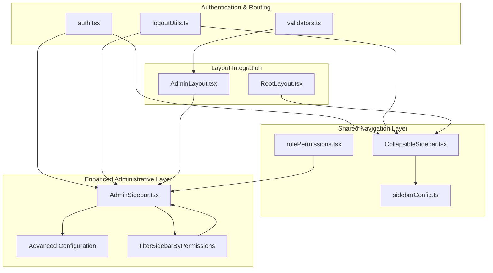
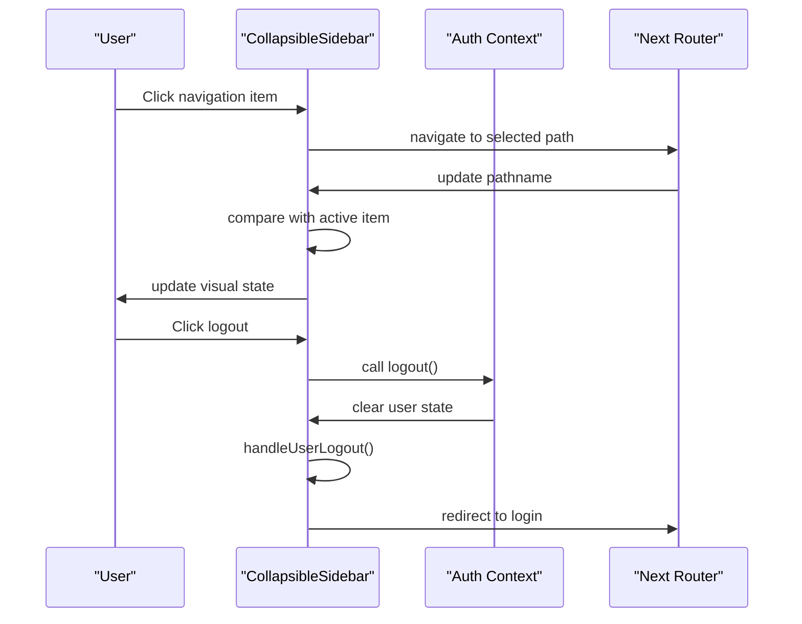
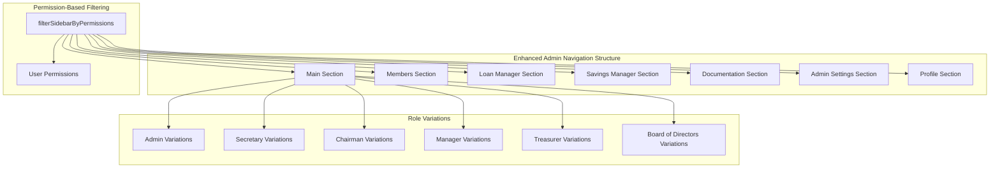
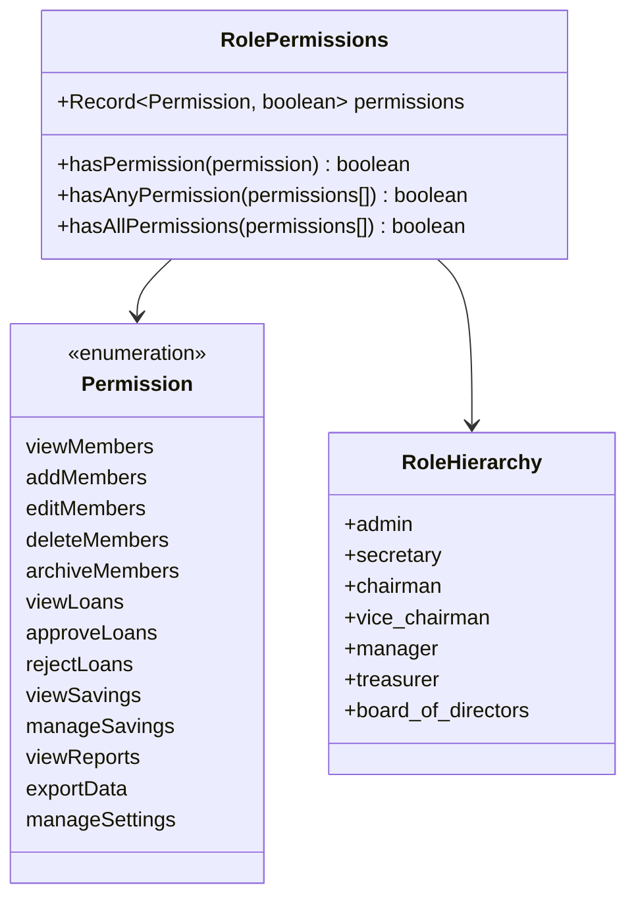
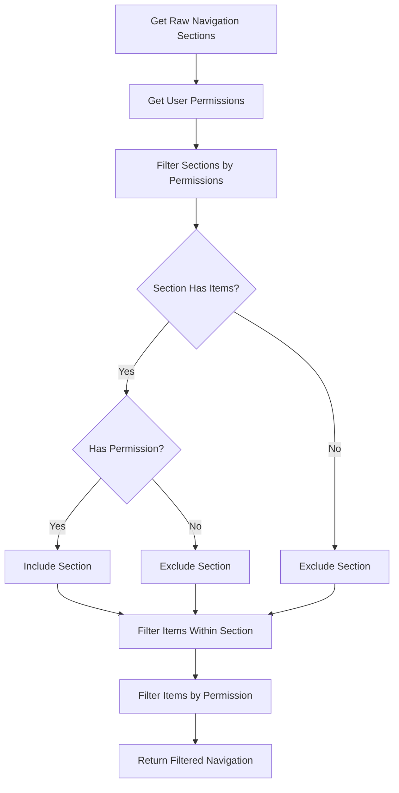
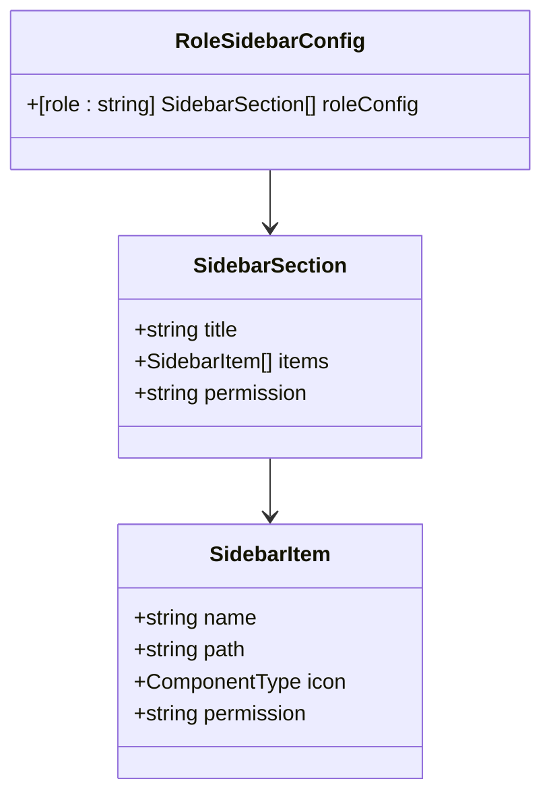
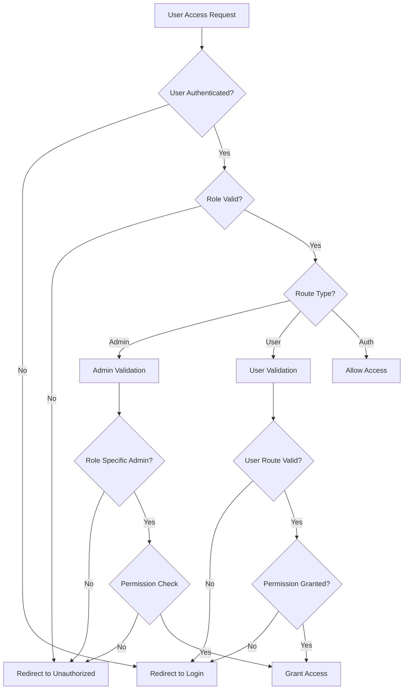

# Collapsible Navigation System

<cite>
**Referenced Files in This Document**
- [CollapsibleSidebar.tsx](file://components/shared/CollapsibleSidebar.tsx)
- [Sidebar.tsx](file://components/admin/Sidebar.tsx)
- [sidebarConfig.ts](file://lib/sidebarConfig.ts)
- [rolePermissions.tsx](file://lib/rolePermissions.tsx)
- [auth.tsx](file://lib/auth.tsx)
- [logoutUtils.ts](file://lib/logoutUtils.ts)
- [validators.ts](file://lib/validators.ts)
- [layout.tsx](file://app/layout.tsx)
- [admin/layout.tsx](file://app/admin/layout.tsx)
</cite>

## Update Summary
**Changes Made**
- Enhanced documentation to reflect the new permission-based filtering system for sidebar navigation
- Added comprehensive coverage of hierarchical role-based access control implementation
- Updated documentation of dynamic sidebar filtering based on user capabilities
- Added detailed explanation of permission requirements for menu items
- Enhanced documentation of the new permission system integration with sidebar components
- Updated role-based navigation flow with improved permission validation

## Table of Contents
1. [Introduction](#introduction)
2. [Dual Sidebar Architecture](#dual-sidebar-architecture)
3. [Shared CollapsibleSidebar Component](#shared-collapsiblesidebar-component)
4. [Enhanced Admin Sidebar Implementation](#enhanced-admin-sidebar-implementation)
5. [Hierarchical Role-Based Access Control](#hierarchical-role-based-access-control)
6. [Permission-Based Sidebar Filtering](#permission-based-sidebar-filtering)
7. [Sidebar Configuration System](#sidebar-configuration-system)
8. [Responsive Design and User Experience](#responsive-design-and-user-experience)
9. [Integration with Next.js Routing](#integration-with-nextjs-routing)
10. [Protected Route Handling](#protected-route-handling)
11. [Navigation State Management](#navigation-state-management)
12. [Accessibility and Keyboard Navigation](#accessibility-and-keyboard-navigation)
13. [Practical Implementation Examples](#practical-implementation-examples)
14. [Troubleshooting and Common Issues](#troubleshooting-and-common-issues)
15. [Conclusion](#conclusion)

## Introduction
This document explains the enhanced dual Collapsible Navigation System used across the SAMPA Cooperative Management Platform. The system features two distinct sidebar implementations: a streamlined shared CollapsibleSidebar for general navigation and an enhanced role-based Admin Sidebar with sophisticated permission filtering and hierarchical access control. Both components provide responsive, role-aware navigation with smooth expand/collapse animations, active link highlighting, comprehensive integration with Next.js routing, and robust permission-based menu visibility control.

## Dual Sidebar Architecture
The navigation system implements a dual architecture with enhanced permission-based filtering to serve different user types and interaction patterns:



**Diagram sources**
- [CollapsibleSidebar.tsx:1-179](file://components/shared/CollapsibleSidebar.tsx#L1-L179)
- [Sidebar.tsx:1-310](file://components/admin/Sidebar.tsx#L1-L310)
- [sidebarConfig.ts:1-397](file://lib/sidebarConfig.ts#L1-L397)
- [rolePermissions.tsx:1-226](file://lib/rolePermissions.tsx#L1-L226)
- [auth.tsx:1-706](file://lib/auth.tsx#L1-L706)
- [validators.ts:1-236](file://lib/validators.ts#L1-L236)
- [logoutUtils.ts:1-93](file://lib/logoutUtils.ts#L1-L93)
- [layout.tsx:22-37](file://app/layout.tsx#L22-L37)
- [admin/layout.tsx:1-74](file://app/admin/layout.tsx#L1-L74)

## Shared CollapsibleSidebar Component
The shared CollapsibleSidebar provides a streamlined navigation solution for general users and basic administrative functions:

### Key Features
- **Universal Navigation**: Simplified navigation for all user roles
- **Driver/Operator Support**: Specialized paths for transportation staff
- **Responsive Design**: Smooth width transitions with Tailwind CSS
- **Active Link Highlighting**: Automatic current page detection
- **Centralized Logout**: Unified logout handling across roles

### Component Architecture


**Diagram sources**
- [CollapsibleSidebar.tsx:90-118](file://components/shared/CollapsibleSidebar.tsx#L90-L118)
- [auth.tsx:621-635](file://lib/auth.tsx#L621-L635)
- [logoutUtils.ts:65-85](file://lib/logoutUtils.ts#L65-L85)

### Driver/Operator Navigation Flow
The component intelligently adapts navigation paths based on user roles:

| Role | Dashboard Path | Special Handling |
|------|----------------|------------------|
| Driver | `/driver/dashboard` | Uses driver-specific dashboard |
| Operator | `/operator/dashboard` | Uses operator-specific dashboard |
| Other Roles | `/dashboard` | Standard user dashboard |

**Section sources**
- [CollapsibleSidebar.tsx:94-105](file://components/shared/CollapsibleSidebar.tsx#L94-L105)
- [auth.tsx:140-146](file://lib/auth.tsx#L140-L146)

## Enhanced Admin Sidebar Implementation
The Admin Sidebar provides comprehensive role-based navigation with advanced organizational features and sophisticated permission filtering:

### Advanced Features
- **Hierarchical Organization**: Section-based navigation with dropdown menus
- **Role-Specific Content**: Different sections for different administrative roles
- **Dynamic Expansion**: Individual section expansion/collapse states
- **Visual Hierarchy**: Clear distinction between sections and items
- **Enhanced Styling**: Comprehensive active state management
- **Permission-Based Filtering**: Dynamic menu visibility based on user capabilities
- **Real-time Updates**: Live permission checking and sidebar updates

### Section-Based Navigation


**Diagram sources**
- [Sidebar.tsx:151-263](file://components/admin/Sidebar.tsx#L151-L263)
- [sidebarConfig.ts:30-256](file://lib/sidebarConfig.ts#L30-L256)
- [rolePermissions.tsx:155-206](file://lib/rolePermissions.tsx#L155-L206)

**Section sources**
- [Sidebar.tsx:77-91](file://components/admin/Sidebar.tsx#L77-L91)
- [sidebarConfig.ts:258-262](file://lib/sidebarConfig.ts#L258-L262)

## Hierarchical Role-Based Access Control
The system implements sophisticated hierarchical role-based access control with granular permission management:

### Permission Types and Scope
The permission system defines specific capabilities that control menu visibility:

| Permission Category | Permissions | Scope |
|-------------------|-------------|-------|
| Member Management | `viewMembers`, `addMembers`, `editMembers`, `deleteMembers`, `archiveMembers` | Member records and CRUD operations |
| Loan Processing | `viewLoans`, `approveLoans`, `rejectLoans` | Loan applications and approvals |
| Savings Operations | `viewSavings`, `manageSavings` | Savings accounts and transactions |
| Reporting | `viewReports`, `exportData` | Financial reports and data export |
| System Administration | `manageSettings` | System configuration and officer management |

### Role-Based Permission Matrix


**Diagram sources**
- [rolePermissions.tsx:8-21](file://lib/rolePermissions.tsx#L8-L21)
- [rolePermissions.tsx:24-130](file://lib/rolePermissions.tsx#L24-L130)

### Permission Inheritance and Hierarchy
- **Admin**: Full permissions across all categories
- **Secretary**: High-level permissions with limited administrative control
- **Chairman/Vice Chairman**: Executive oversight with approval capabilities
- **Manager/Treasurer**: Department-specific management permissions
- **Board of Directors**: Strategic oversight with reporting access

**Section sources**
- [rolePermissions.tsx:24-130](file://lib/rolePermissions.tsx#L24-L130)
- [sidebarConfig.ts:364-367](file://lib/sidebarConfig.ts#L364-L367)

## Permission-Based Sidebar Filtering
The enhanced sidebar filtering system dynamically adjusts menu visibility based on user permissions:

### Filtering Algorithm


**Diagram sources**
- [sidebarConfig.ts:369-397](file://lib/sidebarConfig.ts#L369-L397)

### Dynamic Menu Visibility
The filtering process evaluates both section-level and item-level permissions:

1. **Section-Level Filtering**: Removes entire sections when user lacks required permissions
2. **Item-Level Filtering**: Filters individual menu items within sections
3. **Permission Validation**: Ensures user has specific capability before displaying items
4. **Fallback Handling**: Maintains minimum navigation when permissions are insufficient

### Permission Requirement Syntax
```typescript
interface SidebarItem {
  name: string;
  path: string;
  icon: ComponentType;
  permission?: string; // Optional permission requirement
}

interface SidebarSection {
  title: string;
  items: SidebarItem[];
  permission?: string; // Optional section-level permission requirement
}
```

**Section sources**
- [sidebarConfig.ts:2-17](file://lib/sidebarConfig.ts#L2-L17)
- [sidebarConfig.ts:369-397](file://lib/sidebarConfig.ts#L369-L397)

## Sidebar Configuration System
The configuration system provides centralized management of navigation structures with enhanced permission integration:

### Configuration Structure


**Diagram sources**
- [sidebarConfig.ts:2-17](file://lib/sidebarConfig.ts#L2-L17)

### Enhanced Configuration Management
- **Typed Interfaces**: Strongly typed configuration structures with permission fields
- **Icon Mapping**: Centralized icon component management with Lucide React
- **Role Normalization**: Automatic role name normalization for consistent access
- **Fallback Mechanisms**: Default configuration for unknown roles with admin as fallback
- **Permission Integration**: Built-in permission requirements for all navigation items

**Section sources**
- [sidebarConfig.ts:1-397](file://lib/sidebarConfig.ts#L1-L397)

## Responsive Design and User Experience
Both sidebar implementations provide responsive behavior optimized for different screen sizes and user contexts:

### Responsive Behavior Patterns
- **Width Transitions**: Smooth 300ms width animations using Tailwind CSS
- **Icon-Only Mode**: Collapsed state displays only navigation icons
- **Label Visibility**: Full labels appear when sidebar is expanded
- **Scroll Management**: Auto-scrolling for long navigation lists

### User Experience Enhancements
- **Visual Feedback**: Hover states and active highlighting with red accent color scheme
- **Consistent Styling**: Red accent color scheme for active states and highlights
- **Accessibility**: Proper focus management and keyboard navigation support
- **Performance**: Optimized rendering with minimal re-renders and real-time permission updates

**Section sources**
- [CollapsibleSidebar.tsx:121-123](file://components/shared/CollapsibleSidebar.tsx#L121-L123)
- [Sidebar.tsx:126-129](file://components/admin/Sidebar.tsx#L126-L129)

## Integration with Next.js Routing
Both sidebar implementations integrate seamlessly with Next.js App Router:

### Path Management
- **Client-Side Navigation**: Uses Next.js navigation hooks for seamless transitions
- **Active State Detection**: Pathname comparison for active link highlighting
- **Programmatic Routing**: Direct navigation to configured paths with permission validation
- **Route Validation**: Integration with route protection systems and permission checks

### Authentication Integration
- **User State Access**: Real-time access to user role and permissions for dynamic filtering
- **Dynamic Content**: Navigation adapts to user authentication status and capability changes
- **Protected Routes**: Integration with authentication guards and permission validation
- **Session Management**: Seamless logout and login flows with permission state cleanup

**Section sources**
- [CollapsibleSidebar.tsx:90-91](file://components/shared/CollapsibleSidebar.tsx#L90-L91)
- [Sidebar.tsx:97-98](file://components/admin/Sidebar.tsx#L97-L98)

## Protected Route Handling
The system implements comprehensive route protection and validation with enhanced permission checking:

### Enhanced Route Protection Architecture


**Diagram sources**
- [validators.ts:199-235](file://lib/validators.ts#L199-L235)

### Enhanced Validation Logic
- **Role-Based Access Control**: Specific role validation for different route types
- **Permission Validation**: Additional permission checks beyond role membership
- **Dashboard Path Validation**: Ensures users access appropriate dashboards
- **Cross-Role Protection**: Prevents unauthorized access between role categories
- **Conflict Resolution**: Automatic redirection for conflicting route access
- **Real-time Permission Checking**: Live permission validation for dynamic sidebar updates

**Section sources**
- [validators.ts:9-19](file://lib/validators.ts#L9-L19)
- [validators.ts:27-60](file://lib/validators.ts#L27-L60)
- [validators.ts:112-191](file://lib/validators.ts#L112-L191)

## Navigation State Management
Both sidebar implementations manage navigation state efficiently with enhanced permission integration:

### State Management Patterns
- **Local State**: Component-level state for expanded/collapsed states
- **URL State**: No persistent URL state for sidebar visibility
- **User Context**: Real-time user state integration with permission updates
- **Performance Optimization**: Minimal state updates and re-renders with efficient filtering
- **Permission State**: Real-time permission state management for dynamic filtering

### Enhanced State Synchronization
- **Active Link Tracking**: Automatic highlighting based on current path
- **Section Expansion**: Individual section state persistence
- **User Role Changes**: Dynamic navigation adaptation with permission updates
- **Route Changes**: Real-time state updates with permission validation
- **Permission Changes**: Live sidebar updates when user permissions change

**Section sources**
- [Sidebar.tsx:99-123](file://components/admin/Sidebar.tsx#L99-L123)
- [CollapsibleSidebar.tsx:90-91](file://components/shared/CollapsibleSidebar.tsx#L90-L91)

## Accessibility and Keyboard Navigation
The sidebar implementations prioritize accessibility and inclusive design with enhanced permission-based navigation:

### Accessibility Features
- **Keyboard Navigation**: Tab navigation and keyboard activation for all interactive elements
- **Screen Reader Support**: Proper ARIA labels and semantic markup for navigation items
- **Focus Management**: Logical tab order and focus indicators for expanded/collapsed states
- **Color Contrast**: High contrast ratios for text and backgrounds with permission-based highlighting
- **Permission Announcements**: Screen reader-friendly announcements for permission changes

### Enhanced Navigation Support
- **Hover States**: Visual feedback for interactive elements with permission-based styling
- **Touch Targets**: Adequate size for mobile touch interaction with expanded/collapsed states
- **Motion Considerations**: Reduced motion options for sensitive users with smooth transitions
- **Alternative Input**: Support for voice control and assistive technologies with keyboard navigation
- **Permission Guidance**: Clear visual indicators for permission-based menu visibility

**Section sources**
- [CollapsibleSidebar.tsx:145-151](file://components/shared/CollapsibleSidebar.tsx#L145-L151)
- [Sidebar.tsx:156-162](file://components/admin/Sidebar.tsx#L156-L162)

## Practical Implementation Examples

### Adding New Menu Items with Permission Requirements
```typescript
// Extend sidebar configuration with permission requirements
export const roleSidebarConfig: RoleSidebarConfig = {
  'admin': [
    {
      title: 'Main',
      items: [
        { name: 'Dashboard', path: '/admin/dashboard', icon: Home },
      ],
    },
    {
      title: 'New Feature Section',
      permission: 'manageNewFeature', // Section-level permission
      items: [
        { name: 'New Feature', path: '/admin/new-feature', icon: NewIcon, permission: 'manageNewFeature' },
        { name: 'Feature Settings', path: '/admin/new-feature/settings', icon: SettingsIcon, permission: 'manageNewFeature' },
      ],
    },
  ],
};
```

### Implementing Custom Permission Checks
```typescript
// Add new permission type
export type Permission =
  | 'viewMembers'
  | 'addMembers'
  | 'editMembers'
  | 'deleteMembers'
  | 'archiveMembers'
  | 'viewLoans'
  | 'approveLoans'
  | 'rejectLoans'
  | 'viewSavings'
  | 'manageSavings'
  | 'viewReports'
  | 'exportData'
  | 'manageSettings'
  | 'manageNewFeature'; // New permission type

// Update default permissions
export const defaultPermissions: Record<string, Record<Permission, boolean>> = {
  admin: {
    viewMembers: true,
    addMembers: true,
    editMembers: true,
    deleteMembers: true,
    archiveMembers: true,
    viewLoans: true,
    approveLoans: true,
    rejectLoans: true,
    viewSavings: true,
    manageSavings: true,
    viewReports: true,
    exportData: true,
    manageSettings: true,
    manageNewFeature: true, // New permission enabled for admin
  },
  // ... other roles with appropriate permissions
};
```

### Creating Permission-Guarded Components
```typescript
// Conditional rendering based on permissions
function PermissionGuard({ permission, children, fallback = null }) {
  const { hasPermission } = usePermissions();
  
  if (hasPermission(permission)) {
    return <>{children}</>;
  }
  
  return <>{fallback}</>;
}

// Usage in components
function MyComponent() {
  return (
    <div>
      <PermissionGuard permission="manageSettings">
        <AdminSettingsPanel />
      </PermissionGuard>
      
      <PermissionGuard permission="manageNewFeature">
        <NewFeaturePanel />
      </PermissionGuard>
    </div>
  );
}
```

### Extending Role-Based Access Control
```typescript
// Add new role with custom permissions
export const defaultPermissions: Record<string, Record<Permission, boolean>> = {
  // ... existing roles
  'new_role': {
    viewMembers: true,
    addMembers: false,
    editMembers: false,
    deleteMembers: false,
    archiveMembers: false,
    viewLoans: true,
    approveLoans: false,
    rejectLoans: false,
    viewSavings: false,
    manageSavings: false,
    viewReports: true,
    exportData: false,
    manageSettings: false,
    manageNewFeature: true,
  },
};

// Update sidebar configuration for new role
export const roleSidebarConfig: RoleSidebarConfig = {
  // ... existing roles
  'new_role': [
    {
      title: 'Main',
      items: [
        { name: 'Dashboard', path: '/admin/new-role/dashboard', icon: Home },
      ],
    },
    {
      title: 'New Feature Section',
      permission: 'manageNewFeature',
      items: [
        { name: 'New Feature', path: '/admin/new-feature', icon: NewIcon, permission: 'manageNewFeature' },
      ],
    },
  ],
};
```

**Section sources**
- [sidebarConfig.ts:36-90](file://lib/sidebarConfig.ts#L36-L90)
- [rolePermissions.tsx:8-21](file://lib/rolePermissions.tsx#L8-L21)
- [rolePermissions.tsx:24-130](file://lib/rolePermissions.tsx#L24-L130)

## Troubleshooting and Common Issues

### Sidebar Not Rendering Correctly
- **Verify Authentication**: Ensure user is properly authenticated
- **Check Role Configuration**: Confirm role exists in sidebar configuration
- **Validate Paths**: Ensure navigation paths match actual routes
- **Inspect CSS Classes**: Verify Tailwind classes are loading correctly
- **Permission Validation**: Check that user has required permissions for menu items

### Navigation Items Not Appearing
- **Role Validation**: Check that user role is properly set
- **Configuration Loading**: Verify sidebarConfig is imported correctly
- **Path Matching**: Ensure item paths match current pathname exactly
- **Icon Components**: Confirm icon components are properly exported
- **Permission Requirements**: Verify user has required permissions for items

### Permission-Based Issues
- **Permission Loading**: Check that usePermissions hook is properly initialized
- **Firestore Integration**: Verify permission data is loading from Firestore
- **Default Permissions**: Ensure fallback permissions are working correctly
- **Permission Updates**: Check that permission changes are reflected in real-time
- **Cache Issues**: Clear browser cache if permissions aren't updating

### Responsive Behavior Issues
- **CSS Conflicts**: Check for conflicting Tailwind utility classes
- **Transition Duration**: Verify transition durations are appropriate
- **Mobile Breakpoints**: Test responsive behavior across device sizes
- **Touch Interaction**: Ensure touch targets are adequately sized

### Logout and Session Issues
- **State Cleanup**: Verify user state is properly cleared
- **Cookie Management**: Check authentication cookie handling
- **Redirect Logic**: Ensure proper redirect after logout
- **Session Persistence**: Confirm no residual session data
- **Permission State**: Verify permission state is cleared on logout

**Section sources**
- [CollapsibleSidebar.tsx:108-118](file://components/shared/CollapsibleSidebar.tsx#L108-L118)
- [Sidebar.tsx:105-115](file://components/admin/Sidebar.tsx#L105-L115)
- [logoutUtils.ts:16-50](file://lib/logoutUtils.ts#L16-L50)

## Conclusion
The enhanced dual Collapsible Navigation System provides a comprehensive, role-aware navigation solution for the SAMPA Cooperative Management Platform. The streamlined shared CollapsibleSidebar offers efficient navigation for general users, while the enhanced Admin Sidebar delivers sophisticated role-based organization with advanced permission filtering and hierarchical access control. 

The new permission-based filtering system ensures that users only see navigation items they have the capability to access, providing a clean and focused interface while maintaining security. The real-time permission checking and dynamic sidebar updates create a responsive and intuitive user experience that adapts to changing user capabilities.

Both implementations feature responsive design, comprehensive accessibility support, and seamless integration with Next.js routing and authentication systems. The modular architecture enables easy extension and customization while maintaining consistent user experience across all administrative roles and user types. The enhanced permission system provides granular control over menu visibility, supporting the cooperative's diverse operational needs while maintaining security and clarity.