# Dashboard System Architecture

<cite>
**Referenced Files in This Document**
- [app/dashboard/page.tsx](file://app/dashboard/page.tsx)
- [components/user/DynamicDashboard.tsx](file://components/user/DynamicDashboard.tsx)
- [components/user/ActiveSavings.tsx](file://components/user/ActiveSavings.tsx)
- [components/user/ActiveLoans.tsx](file://components/user/ActiveLoans.tsx)
- [components/user/LoanRecords.tsx](file://components/user/LoanRecords.tsx)
- [components/admin/OfficerDashboard.tsx](file://components/admin/OfficerDashboard.tsx)
- [components/admin/ExecutiveDashboard.tsx](file://components/admin/ExecutiveDashboard.tsx)
- [components/admin/Sidebar.tsx](file://components/admin/Sidebar.tsx)
- [components/shared/CollapsibleSidebar.tsx](file://components/shared/CollapsibleSidebar.tsx)
- [lib/sidebarConfig.ts](file://lib/sidebarConfig.ts)
- [lib/auth.tsx](file://lib/auth.tsx)
- [lib/savingsService.ts](file://lib/savingsService.ts)
- [hooks/useFirestoreData.ts](file://hooks/useFirestoreData.ts)
- [app/layout.tsx](file://app/layout.tsx)
- [app/driver/dashboard/page.tsx](file://app/driver/dashboard/page.tsx)
- [app/operator/dashboard/page.tsx](file://app/operator/dashboard/page.tsx)
</cite>

## Update Summary
**Changes Made**
- Added comprehensive Executive Dashboard component with real-time financial monitoring and interactive stat cards
- Enhanced Collapsible Sidebar component with role-based navigation and driver/operator-specific routing
- Improved Active Savings component with comprehensive notification system integration
- Updated driver and operator dashboard implementations with enhanced notification systems
- Expanded role-based routing system to support executive-level dashboards

## Table of Contents
1. [Introduction](#introduction)
2. [Project Structure](#project-structure)
3. [Core Components](#core-components)
4. [Architecture Overview](#architecture-overview)
5. [Detailed Component Analysis](#detailed-component-analysis)
6. [Dependency Analysis](#dependency-analysis)
7. [Performance Considerations](#performance-considerations)
8. [Troubleshooting Guide](#troubleshooting-guide)
9. [Conclusion](#conclusion)
10. [Appendices](#appendices)

## Introduction
This document explains the Dashboard System Architecture for the SAMPA Cooperative Management Platform. It covers the dynamic dashboard generation system that creates role-specific interfaces based on sidebar configuration, the officer dashboard implementation with administrative widgets and monitoring features, the member dashboard displaying personal financial information and recent activity, the executive dashboard with comprehensive financial oversight, the collapsible sidebar system with enhanced role-based navigation, the dashboard component composition pattern, reusable widget architecture, real-time data integration, the sidebar configuration system, responsive design, customization examples, and performance optimization strategies.

## Project Structure
The dashboard system spans multiple layers with expanded executive-level capabilities:
- Application pages define entry points per role including executive dashboards (member, officer, driver, operator panels).
- Shared components provide reusable UI elements (collapsible sidebar, cards, notifications).
- Admin components encapsulate officer dashboards, executive dashboards, and role-based navigation.
- User components implement member dashboards, personal financial widgets, and notification systems.
- Libraries define configuration, authentication, and services with enhanced role-based routing.
- Hooks enable real-time Firestore data binding.

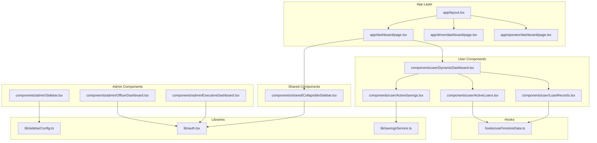

**Diagram sources**
- [app/dashboard/page.tsx](file://app/dashboard/page.tsx#L1-L203)
- [app/driver/dashboard/page.tsx](file://app/driver/dashboard/page.tsx#L1-L576)
- [app/operator/dashboard/page.tsx](file://app/operator/dashboard/page.tsx#L1-L580)
- [components/user/DynamicDashboard.tsx](file://components/user/DynamicDashboard.tsx#L1-L149)
- [components/user/ActiveSavings.tsx](file://components/user/ActiveSavings.tsx#L1-L363)
- [components/user/ActiveLoans.tsx](file://components/user/ActiveLoans.tsx#L1-L177)
- [components/user/LoanRecords.tsx](file://components/user/LoanRecords.tsx#L1-L350)
- [components/admin/Sidebar.tsx](file://components/admin/Sidebar.tsx#L1-L279)
- [components/admin/OfficerDashboard.tsx](file://components/admin/OfficerDashboard.tsx#L1-L198)
- [components/admin/ExecutiveDashboard.tsx](file://components/admin/ExecutiveDashboard.tsx#L1-L260)
- [components/shared/CollapsibleSidebar.tsx](file://components/shared/CollapsibleSidebar.tsx#L1-L179)
- [lib/sidebarConfig.ts](file://lib/sidebarConfig.ts#L1-L262)
- [lib/auth.tsx](file://lib/auth.tsx#L1-L682)
- [lib/savingsService.ts](file://lib/savingsService.ts#L1-L455)
- [hooks/useFirestoreData.ts](file://hooks/useFirestoreData.ts#L1-L182)
- [app/layout.tsx](file://app/layout.tsx#L1-L37)

**Section sources**
- [app/dashboard/page.tsx](file://app/dashboard/page.tsx#L1-L203)
- [app/layout.tsx](file://app/layout.tsx#L1-L37)
- [app/driver/dashboard/page.tsx](file://app/driver/dashboard/page.tsx#L1-L576)
- [app/operator/dashboard/page.tsx](file://app/operator/dashboard/page.tsx#L1-L580)

## Core Components
- DynamicDashboard: Central provider for reminders and events, exposing data to child widgets.
- ActiveSavings: Personal savings summary with comprehensive notification system integration and transaction detail viewing.
- ActiveLoans: Displays user's active loans with payment schedules and formatting.
- LoanRecords: Lists user's loan history and generates amortization schedules with PDF export.
- OfficerDashboard: Administrative overview for officers with stats and quick actions.
- ExecutiveDashboard: Comprehensive financial oversight with real-time metrics and interactive stat cards.
- Admin Sidebar: Role-based navigation with collapsible sections and logout.
- CollapsibleSidebar (shared): Enhanced generic collapsible sidebar with role-based navigation and driver/operator routing.
- Sidebar configuration: Role-to-menu mapping with sections and items.
- Authentication: Enhanced role-aware routing including executive dashboards and driver/operator paths.
- Savings service: Member-to-user linkage and atomic savings operations.
- Firestore hook: Real-time listeners with client-side sorting and fallbacks.

**Section sources**
- [components/user/DynamicDashboard.tsx](file://components/user/DynamicDashboard.tsx#L1-L149)
- [components/user/ActiveSavings.tsx](file://components/user/ActiveSavings.tsx#L1-L363)
- [components/user/ActiveLoans.tsx](file://components/user/ActiveLoans.tsx#L1-L177)
- [components/user/LoanRecords.tsx](file://components/user/LoanRecords.tsx#L1-L350)
- [components/admin/OfficerDashboard.tsx](file://components/admin/OfficerDashboard.tsx#L1-L198)
- [components/admin/ExecutiveDashboard.tsx](file://components/admin/ExecutiveDashboard.tsx#L1-L260)
- [components/admin/Sidebar.tsx](file://components/admin/Sidebar.tsx#L1-L279)
- [components/shared/CollapsibleSidebar.tsx](file://components/shared/CollapsibleSidebar.tsx#L1-L179)
- [lib/sidebarConfig.ts](file://lib/sidebarConfig.ts#L1-L262)
- [lib/auth.tsx](file://lib/auth.tsx#L1-L682)
- [lib/savingsService.ts](file://lib/savingsService.ts#L1-L455)
- [hooks/useFirestoreData.ts](file://hooks/useFirestoreData.ts#L1-L182)

## Architecture Overview
The system separates concerns across role contexts with executive-level oversight:
- Member dashboard: Personal financial widgets rendered inside a dynamic dashboard wrapper.
- Officer dashboards: Role-specific pages with administrative widgets and navigation.
- Executive dashboard: Comprehensive financial monitoring with real-time metrics and interactive cards.
- Driver/Operator dashboards: Specialized interfaces with enhanced notification systems and role-based routing.
- Real-time data: Firestore hooks and service abstractions provide reactive updates.
- Navigation: Enhanced role-based sidebar configuration drives both admin and shared navigations.

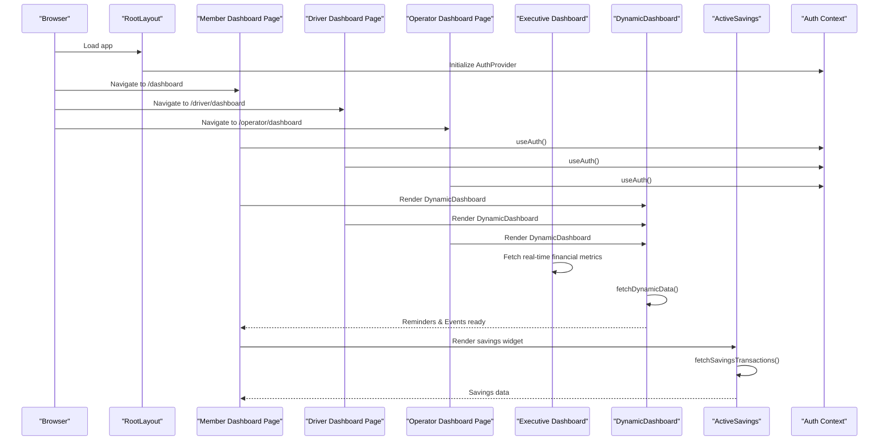

**Diagram sources**
- [app/layout.tsx](file://app/layout.tsx#L1-L37)
- [app/dashboard/page.tsx](file://app/dashboard/page.tsx#L1-L203)
- [app/driver/dashboard/page.tsx](file://app/driver/dashboard/page.tsx#L1-L576)
- [app/operator/dashboard/page.tsx](file://app/operator/dashboard/page.tsx#L1-L580)
- [components/admin/ExecutiveDashboard.tsx](file://components/admin/ExecutiveDashboard.tsx#L30-L99)
- [components/user/DynamicDashboard.tsx](file://components/user/DynamicDashboard.tsx#L1-L149)
- [components/user/ActiveSavings.tsx](file://components/user/ActiveSavings.tsx#L25-L62)
- [lib/auth.tsx](file://lib/auth.tsx#L111-L156)

## Detailed Component Analysis

### Executive Dashboard Implementation
The Executive Dashboard provides comprehensive financial oversight with 259 lines of real-time monitoring functionality. It integrates with Firebase Firestore to display interactive stat cards with enhanced error handling capabilities.

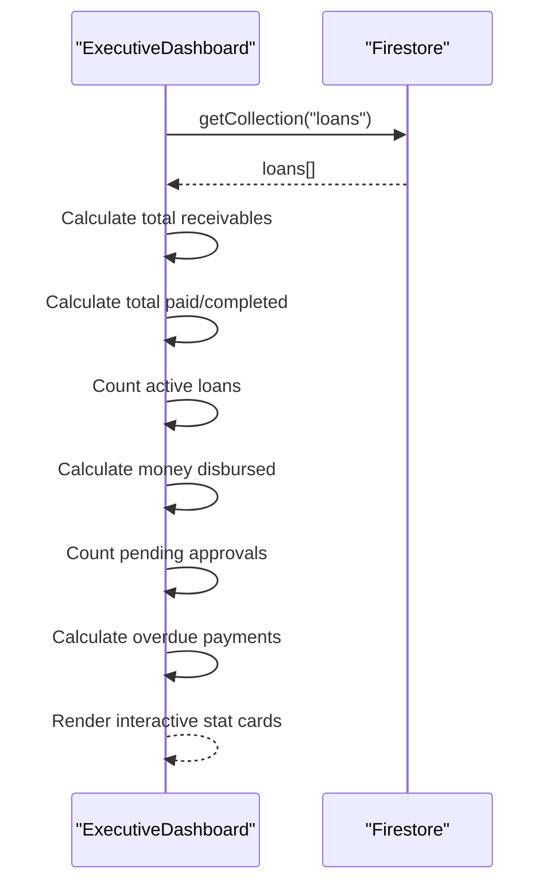

**Diagram sources**
- [components/admin/ExecutiveDashboard.tsx](file://components/admin/ExecutiveDashboard.tsx#L30-L99)

**Section sources**
- [components/admin/ExecutiveDashboard.tsx](file://components/admin/ExecutiveDashboard.tsx#L1-L260)

### Enhanced Collapsible Sidebar System
The CollapsibleSidebar component now includes comprehensive role-based navigation with driver/operator-specific routing and improved visual styling.

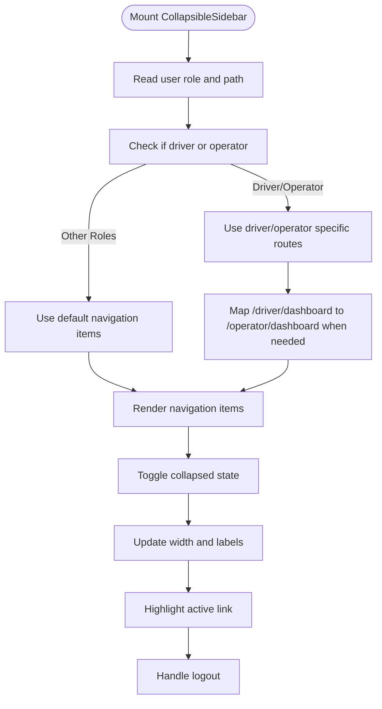

**Diagram sources**
- [components/shared/CollapsibleSidebar.tsx](file://components/shared/CollapsibleSidebar.tsx#L93-L105)
- [components/shared/CollapsibleSidebar.tsx](file://components/shared/CollapsibleSidebar.tsx#L120-L179)

**Section sources**
- [components/shared/CollapsibleSidebar.tsx](file://components/shared/CollapsibleSidebar.tsx#L1-L179)

### Driver and Operator Dashboard Enhancements
Driver and Operator dashboards now feature comprehensive notification systems with modal-based detail viewing and enhanced savings data integration.

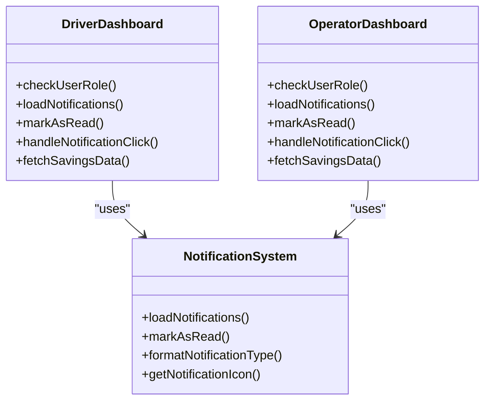

**Diagram sources**
- [app/driver/dashboard/page.tsx](file://app/driver/dashboard/page.tsx#L172-L273)
- [app/operator/dashboard/page.tsx](file://app/operator/dashboard/page.tsx#L175-L273)

**Section sources**
- [app/driver/dashboard/page.tsx](file://app/driver/dashboard/page.tsx#L1-L576)
- [app/operator/dashboard/page.tsx](file://app/operator/dashboard/page.tsx#L1-L580)

### Enhanced Active Savings Component
The ActiveSavings component now includes comprehensive notification system integration with automatic transaction detection and notification creation.

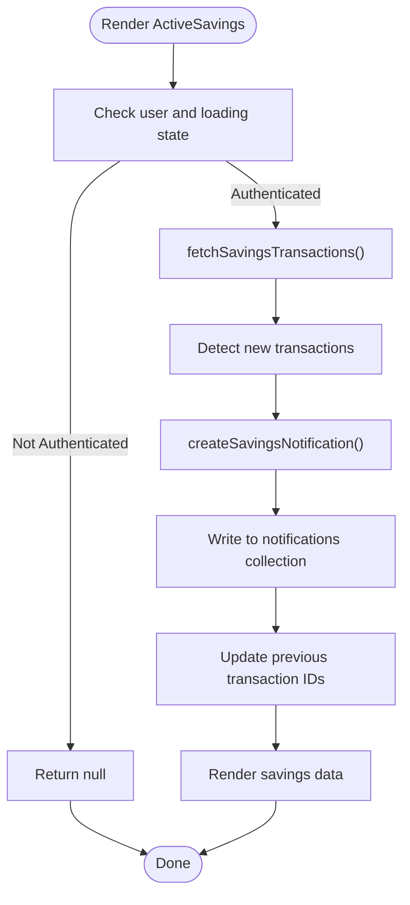

**Diagram sources**
- [components/user/ActiveSavings.tsx](file://components/user/ActiveSavings.tsx#L99-L115)
- [components/user/ActiveSavings.tsx](file://components/user/ActiveSavings.tsx#L131-L153)

**Section sources**
- [components/user/ActiveSavings.tsx](file://components/user/ActiveSavings.tsx#L1-L363)

### Dynamic Dashboard Composition Pattern
DynamicDashboard wraps member-centric pages and preloads reminders and events filtered by role and status. Child components receive data via props and can trigger refreshes or rely on shared services.

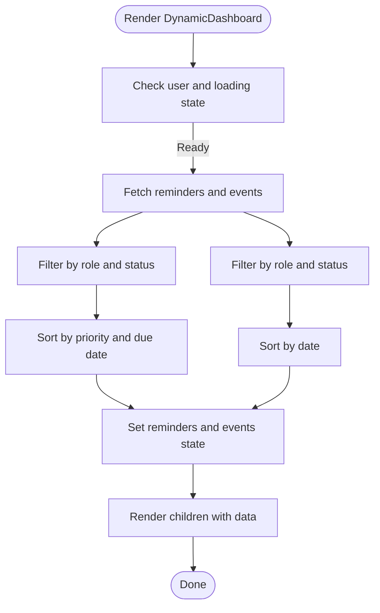

**Diagram sources**
- [components/user/DynamicDashboard.tsx](file://components/user/DynamicDashboard.tsx#L48-L137)

**Section sources**
- [components/user/DynamicDashboard.tsx](file://components/user/DynamicDashboard.tsx#L1-L149)
- [app/dashboard/page.tsx](file://app/dashboard/page.tsx#L108-L200)

### Member Dashboard Widgets
- ActiveSavings: Enhanced with comprehensive notification system integration, transaction detail viewing, and driver/operator savings credit display.
- ActiveLoans: Displays active loans with formatted amounts/dates and payment schedule details.
- LoanRecords: Lists historical loans and computes/exports amortization schedules to PDF.

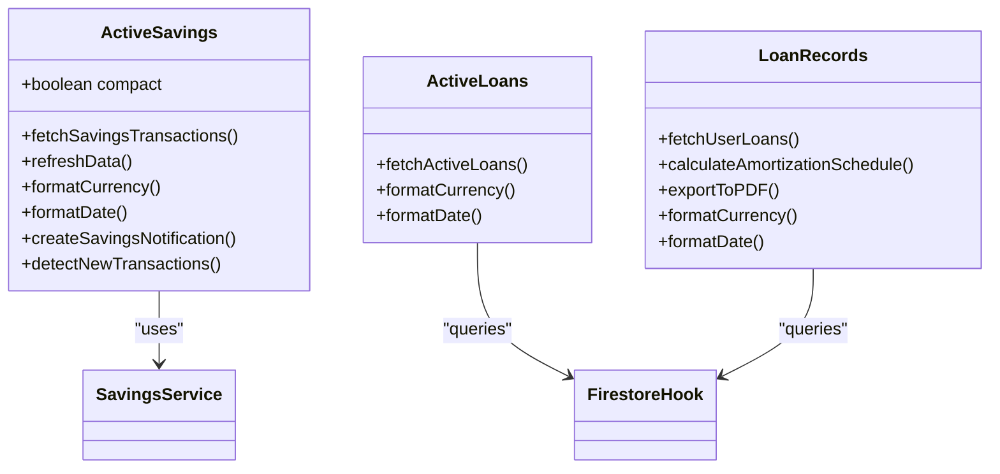

**Diagram sources**
- [components/user/ActiveSavings.tsx](file://components/user/ActiveSavings.tsx#L1-L363)
- [components/user/ActiveLoans.tsx](file://components/user/ActiveLoans.tsx#L1-L177)
- [components/user/LoanRecords.tsx](file://components/user/LoanRecords.tsx#L1-L350)
- [lib/savingsService.ts](file://lib/savingsService.ts#L1-L455)
- [hooks/useFirestoreData.ts](file://hooks/useFirestoreData.ts#L1-L182)

**Section sources**
- [components/user/ActiveSavings.tsx](file://components/user/ActiveSavings.tsx#L1-L363)
- [components/user/ActiveLoans.tsx](file://components/user/ActiveLoans.tsx#L1-L177)
- [components/user/LoanRecords.tsx](file://components/user/LoanRecords.tsx#L1-L350)

### Officer Dashboard Implementation
OfficerDashboard aggregates system metrics (total members, active loans, pending loan requests) and presents them in cards with quick actions and recent activities. It queries Firestore collections and combines counts across related documents.

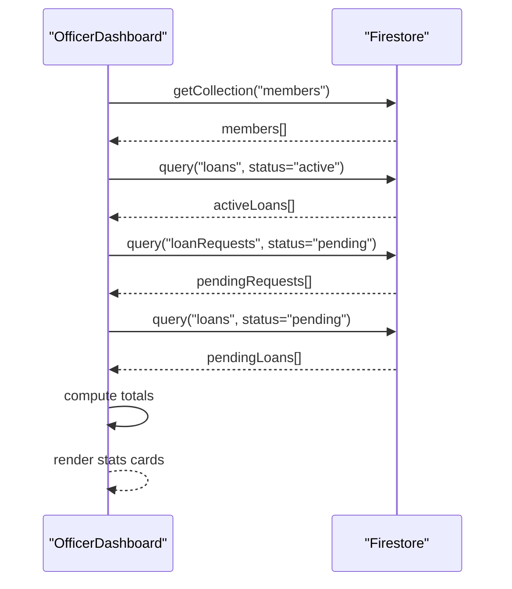

**Diagram sources**
- [components/admin/OfficerDashboard.tsx](file://components/admin/OfficerDashboard.tsx#L22-L72)

**Section sources**
- [components/admin/OfficerDashboard.tsx](file://components/admin/OfficerDashboard.tsx#L1-L198)

### Dashboard Component Composition Pattern
Member dashboards compose multiple widgets under a single layout. DynamicDashboard centralizes reminder/event loading; widgets focus on their domain logic and data refresh strategies.

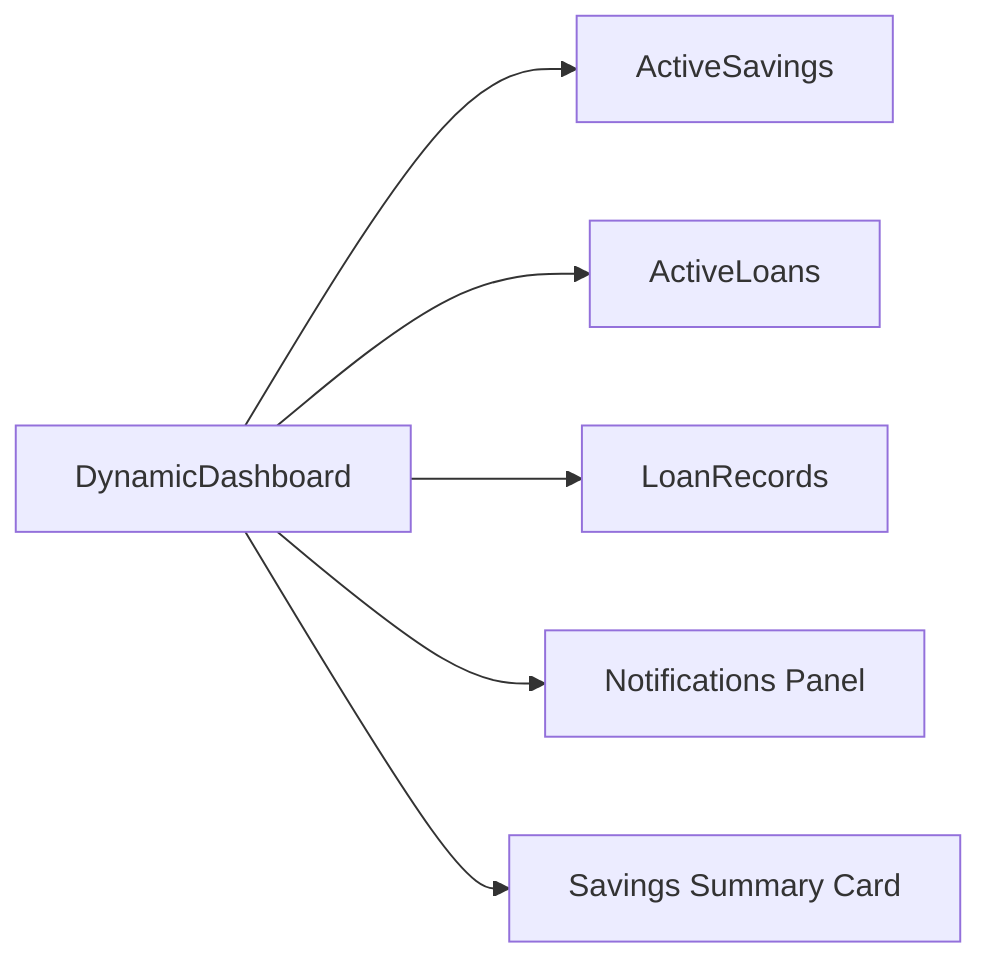

**Diagram sources**
- [app/dashboard/page.tsx](file://app/dashboard/page.tsx#L108-L200)
- [components/user/DynamicDashboard.tsx](file://components/user/DynamicDashboard.tsx#L1-L149)

**Section sources**
- [app/dashboard/page.tsx](file://app/dashboard/page.tsx#L1-L203)

### Reusable Widget Architecture
Widgets encapsulate:
- Data fetching and caching strategies.
- Formatting helpers for currency and dates.
- Refresh mechanisms and visibility-driven updates.
- Integration with services (e.g., savingsService) and Firestore hooks.
- Enhanced notification system integration for real-time alerts.

**Section sources**
- [components/user/ActiveSavings.tsx](file://components/user/ActiveSavings.tsx#L1-L363)
- [components/user/ActiveLoans.tsx](file://components/user/ActiveLoans.tsx#L1-L177)
- [components/user/LoanRecords.tsx](file://components/user/LoanRecords.tsx#L1-L350)
- [lib/savingsService.ts](file://lib/savingsService.ts#L1-L455)
- [hooks/useFirestoreData.ts](file://hooks/useFirestoreData.ts#L1-L182)

### Real-Time Data Integration
Real-time updates are achieved via:
- Firestore onSnapshot listeners with client-side sorting.
- Hook-based data fetching for specific collections and filters.
- Visibility change events to refresh savings data when tabs regain focus.
- Executive dashboard with comprehensive financial metrics and error handling.

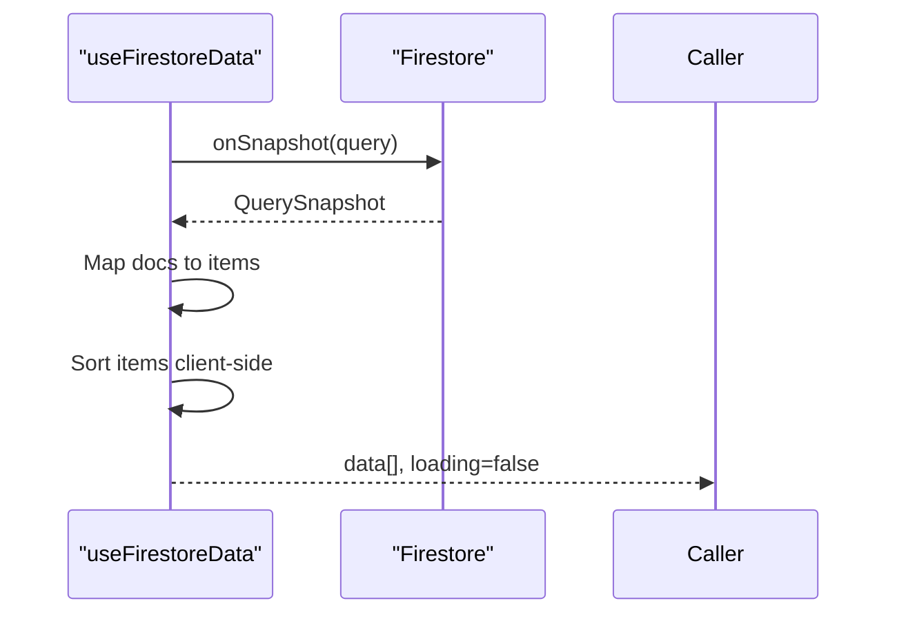

**Diagram sources**
- [hooks/useFirestoreData.ts](file://hooks/useFirestoreData.ts#L82-L117)

**Section sources**
- [hooks/useFirestoreData.ts](file://hooks/useFirestoreData.ts#L1-L182)
- [components/user/ActiveSavings.tsx](file://components/user/ActiveSavings.tsx#L59-L82)

### Sidebar Configuration System
Role-to-navigation mapping defines sections and items. Admin Sidebar reads this configuration to render role-appropriate menus with collapsible dropdowns. Enhanced with executive-level dashboards and driver/operator routing.

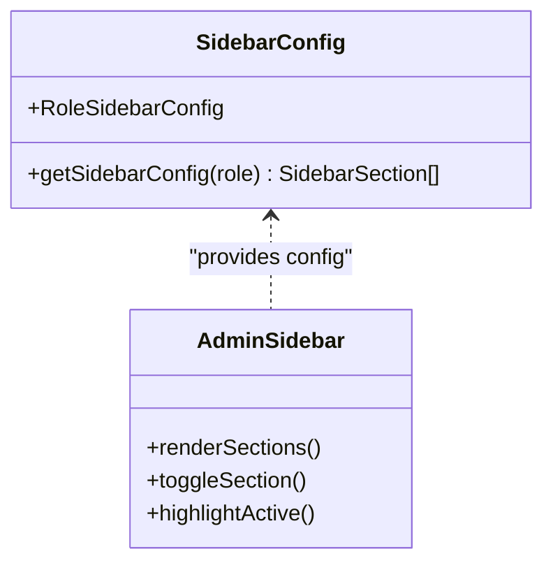

**Diagram sources**
- [lib/sidebarConfig.ts](file://lib/sidebarConfig.ts#L13-L262)
- [components/admin/Sidebar.tsx](file://components/admin/Sidebar.tsx#L92-L123)

**Section sources**
- [lib/sidebarConfig.ts](file://lib/sidebarConfig.ts#L1-L262)
- [components/admin/Sidebar.tsx](file://components/admin/Sidebar.tsx#L1-L279)

### Responsive Design Implementation
- CollapsibleSidebar adjusts width and label visibility based on collapsed state with enhanced role-based styling.
- Grid layouts (e.g., savings summary cards) adapt to small/medium/large screens.
- Notifications panel overlays align with responsive breakpoints.
- Executive dashboard stat cards adapt to different screen sizes with interactive hover effects.

**Section sources**
- [components/shared/CollapsibleSidebar.tsx](file://components/shared/CollapsibleSidebar.tsx#L74-L179)
- [components/admin/ExecutiveDashboard.tsx](file://components/admin/ExecutiveDashboard.tsx#L147-L258)
- [app/dashboard/page.tsx](file://app/dashboard/page.tsx#L179-L196)

### Practical Customization Examples
- Adding a new widget:
  - Create a new component under components/user with data fetching and formatting.
  - Wrap it in DynamicDashboard on the member dashboard page.
  - Optionally integrate with savingsService or useFirestoreData.
- Extending the officer dashboard:
  - Add new stats queries in OfficerDashboard and render in a new card.
  - Update sidebar configuration to expose new routes if needed.
- Customizing sidebar:
  - Extend roleSidebarConfig with new sections/items.
  - AdminSidebar will automatically render based on the provided configuration.
- Creating executive dashboards:
  - Implement new ExecutiveDashboard component with real-time metrics.
  - Integrate with Firebase Firestore for comprehensive financial monitoring.
  - Add interactive stat cards with click-to-navigate functionality.

**Section sources**
- [components/user/DynamicDashboard.tsx](file://components/user/DynamicDashboard.tsx#L1-L149)
- [lib/sidebarConfig.ts](file://lib/sidebarConfig.ts#L258-L262)
- [components/admin/OfficerDashboard.tsx](file://components/admin/OfficerDashboard.tsx#L1-L198)
- [components/admin/ExecutiveDashboard.tsx](file://components/admin/ExecutiveDashboard.tsx#L1-L260)

## Dependency Analysis
The system exhibits layered dependencies with executive-level enhancements:
- Pages depend on shared components and user/admin components.
- Components depend on libraries (auth, savingsService) and hooks.
- Admin components depend on sidebar configuration and enhanced role-based routing.
- Real-time data depends on Firestore hooks and services.
- Executive dashboards depend on comprehensive financial data aggregation.

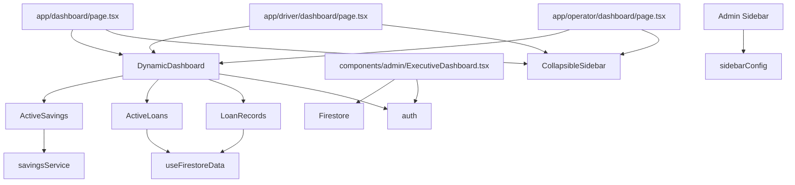

**Diagram sources**
- [app/dashboard/page.tsx](file://app/dashboard/page.tsx#L1-L203)
- [app/driver/dashboard/page.tsx](file://app/driver/dashboard/page.tsx#L1-L576)
- [app/operator/dashboard/page.tsx](file://app/operator/dashboard/page.tsx#L1-L580)
- [components/admin/ExecutiveDashboard.tsx](file://components/admin/ExecutiveDashboard.tsx#L1-L260)
- [components/user/DynamicDashboard.tsx](file://components/user/DynamicDashboard.tsx#L1-L149)
- [components/user/ActiveSavings.tsx](file://components/user/ActiveSavings.tsx#L1-L363)
- [components/user/ActiveLoans.tsx](file://components/user/ActiveLoans.tsx#L1-L177)
- [components/user/LoanRecords.tsx](file://components/user/LoanRecords.tsx#L1-L350)
- [components/shared/CollapsibleSidebar.tsx](file://components/shared/CollapsibleSidebar.tsx#L1-L179)
- [components/admin/Sidebar.tsx](file://components/admin/Sidebar.tsx#L1-L279)
- [lib/sidebarConfig.ts](file://lib/sidebarConfig.ts#L1-L262)
- [lib/savingsService.ts](file://lib/savingsService.ts#L1-L455)
- [hooks/useFirestoreData.ts](file://hooks/useFirestoreData.ts#L1-L182)
- [lib/auth.tsx](file://lib/auth.tsx#L1-L682)

**Section sources**
- [lib/auth.tsx](file://lib/auth.tsx#L111-L156)
- [lib/sidebarConfig.ts](file://lib/sidebarConfig.ts#L258-L262)

## Performance Considerations
- Real-time listeners: Use onSnapshot with minimal re-renders; leverage client-side sorting to avoid composite indexes.
- Visibility-driven refresh: Savings widget refreshes only when the page becomes visible to reduce unnecessary network calls.
- Role-based filtering: Pre-filter reminders and events by role/status to minimize payload sizes.
- Currency/date formatting: Memoize formatters and localize only when needed.
- PDF export: Defer heavy computations until requested to avoid blocking UI.
- Executive dashboard optimization: Batch financial calculations and implement debounced updates for real-time metrics.
- Notification system: Implement efficient transaction detection and notification creation to minimize Firestore writes.

[No sources needed since this section provides general guidance]

## Troubleshooting Guide
- Authentication and redirects:
  - Role-aware dashboard routing ensures users land on the correct dashboard path including executive dashboards.
  - Enhanced driver/operator routing handles special cases for /driver/dashboard vs /operator/dashboard.
  - Cookie-based role storage supports client-side checks.
- Data loading errors:
  - useFirestoreData emits toast notifications for snapshot and initialization errors.
  - DynamicDashboard surfaces generic errors and shows loading states.
  - ExecutiveDashboard includes comprehensive error handling with retry functionality.
- Savings operations:
  - savingsService validates member linkage and prevents negative balances.
  - Errors are surfaced with descriptive messages.
  - Enhanced notification system provides real-time feedback for savings transactions.
- Notification system issues:
  - Automatic transaction detection requires proper Firestore indexing.
  - Notification modal rendering handles edge cases for different notification types.
  - Driver/operator dashboards include comprehensive notification filtering and display.

**Section sources**
- [lib/auth.tsx](file://lib/auth.tsx#L111-L156)
- [hooks/useFirestoreData.ts](file://hooks/useFirestoreData.ts#L106-L116)
- [components/user/DynamicDashboard.tsx](file://components/user/DynamicDashboard.tsx#L131-L136)
- [lib/savingsService.ts](file://lib/savingsService.ts#L291-L294)
- [components/admin/ExecutiveDashboard.tsx](file://components/admin/ExecutiveDashboard.tsx#L130-L145)
- [components/user/ActiveSavings.tsx](file://components/user/ActiveSavings.tsx#L131-L153)

## Conclusion
The SAMPA Cooperative Management Platform implements a robust, role-aware dashboard system with comprehensive executive-level oversight. Member dashboards are composed of reusable widgets powered by real-time data integration, while officer dashboards present administrative insights with role-based navigation. The Executive Dashboard provides comprehensive financial monitoring with real-time metrics and interactive stat cards. Enhanced Collapsible Sidebar components offer role-based navigation with driver/operator-specific routing and improved visual styling. Driver and Operator dashboards feature comprehensive notification systems with modal-based detail viewing. The system's responsive design ensures optimal experiences across devices, while performance optimizations through selective refreshes, client-side sorting, and efficient data fetching strategies maintain system responsiveness.

## Appendices
- Role-aware routing examples:
  - Member: /dashboard
  - Officer panels: /admin/{role}/home or /admin/{role}/dashboard
  - Executive dashboards: /admin/executive (new)
  - Driver: /driver/dashboard
  - Operator: /operator/dashboard
- Sidebar customization:
  - Extend roleSidebarConfig with new sections and items.
  - AdminSidebar renders based on the provided configuration.
  - Enhanced CollapsibleSidebar supports driver/operator routing with conditional path mapping.
- Executive dashboard integration:
  - Real-time financial metrics from Firestore collections.
  - Interactive stat cards with click-to-navigate functionality.
  - Comprehensive error handling and loading states.

**Section sources**
- [lib/auth.tsx](file://lib/auth.tsx#L111-L156)
- [lib/sidebarConfig.ts](file://lib/sidebarConfig.ts#L258-L262)
- [components/admin/ExecutiveDashboard.tsx](file://components/admin/ExecutiveDashboard.tsx#L1-L260)
- [components/shared/CollapsibleSidebar.tsx](file://components/shared/CollapsibleSidebar.tsx#L93-L105)