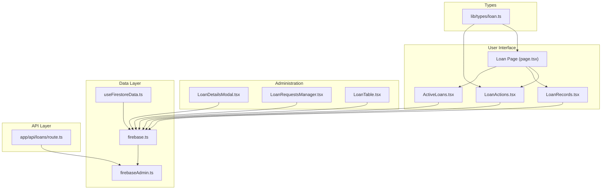
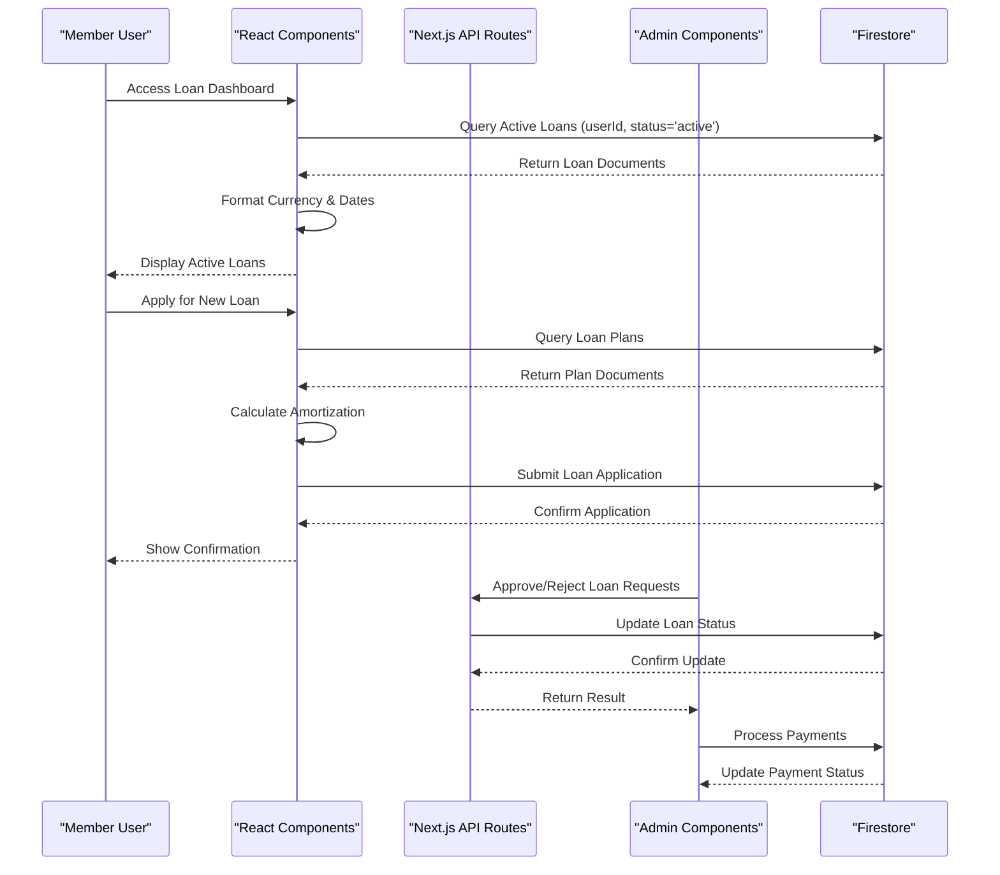
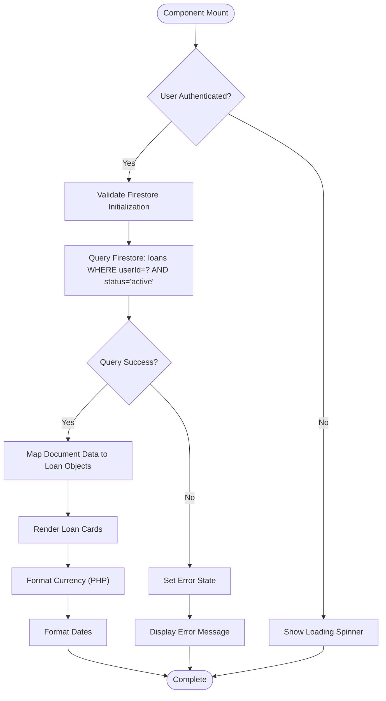
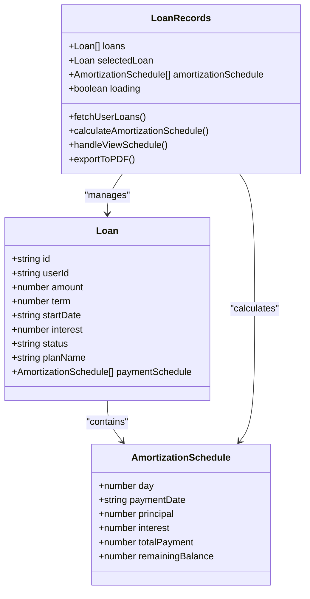
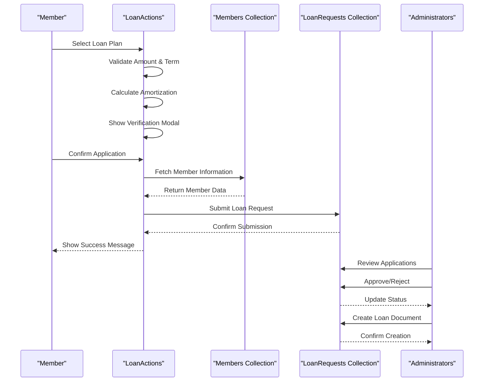
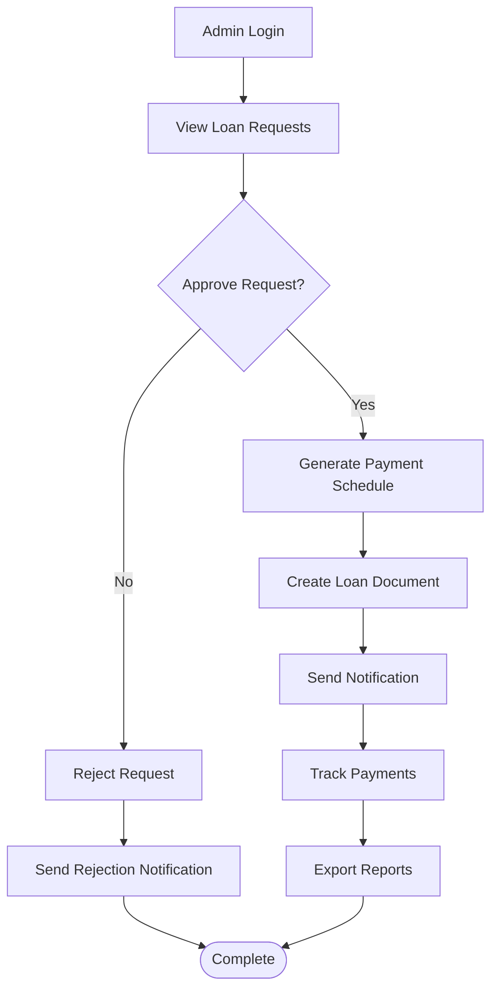
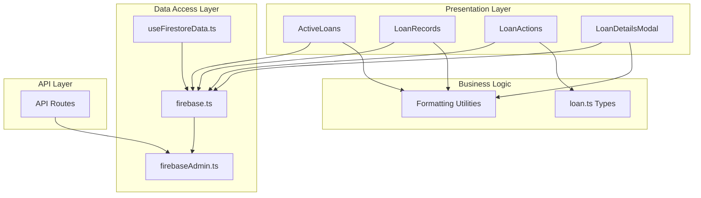

# Active Loans Display System

<cite>
**Referenced Files in This Document**
- [ActiveLoans.tsx](file://components/user/ActiveLoans.tsx)
- [LoanRecords.tsx](file://components/user/LoanRecords.tsx)
- [LoanActions.tsx](file://components/user/actions/LoanActions.tsx)
- [LoanDetailsModal.tsx](file://components/admin/LoanDetailsModal.tsx)
- [LoanRequestsManager.tsx](file://components/admin/LoanRequestsManager.tsx)
- [LoanTable.tsx](file://components/admin/LoanTable.tsx)
- [page.tsx](file://app/loan/page.tsx)
- [route.ts](file://app/api/loans/route.ts)
- [firebase.ts](file://lib/firebase.ts)
- [firebaseAdmin.ts](file://lib/firebaseAdmin.ts)
- [useFirestoreData.ts](file://hooks/useFirestoreData.ts)
- [loan.ts](file://lib/types/loan.ts)
</cite>

## Table of Contents
1. [Introduction](#introduction)
2. [Project Structure](#project-structure)
3. [Core Components](#core-components)
4. [Architecture Overview](#architecture-overview)
5. [Detailed Component Analysis](#detailed-component-analysis)
6. [Dependency Analysis](#dependency-analysis)
7. [Performance Considerations](#performance-considerations)
8. [Troubleshooting Guide](#troubleshooting-guide)
9. [Conclusion](#conclusion)
10. [Appendices](#appendices)

## Introduction
The Active Loans Display System provides members with a comprehensive view of their current loan status and payment information. It retrieves loan data from Firestore collections, formats it for easy understanding, and presents payment schedules and due date tracking. The system integrates with loan management APIs for real-time updates and supports administrative workflows for loan approvals and payment processing. The user interface components are designed to be intuitive, secure, and responsive, ensuring that sensitive financial information is handled appropriately.

## Project Structure
The Active Loans Display System is organized around several key areas:
- User-facing components for viewing active loans, loan records, and applying for new loans
- Administrative components for managing loan requests and processing payments
- Firebase integration for client-side and server-side data operations
- API routes for backend loan management
- Shared types and utilities for consistent data modeling

**Diagram sources**
- [ActiveLoans.tsx](file://components/user/ActiveLoans.tsx#L1-L177)
- [LoanRecords.tsx](file://components/user/LoanRecords.tsx#L1-L350)
- [LoanActions.tsx](file://components/user/actions/LoanActions.tsx#L1-L619)
- [LoanDetailsModal.tsx](file://components/admin/LoanDetailsModal.tsx#L1-L870)
- [LoanRequestsManager.tsx](file://components/admin/LoanRequestsManager.tsx#L1-L600)
- [LoanTable.tsx](file://components/admin/LoanTable.tsx#L1-L200)
- [page.tsx](file://app/loan/page.tsx#L1-L141)
- [firebase.ts](file://lib/firebase.ts#L1-L309)
- [firebaseAdmin.ts](file://lib/firebaseAdmin.ts#L1-L277)
- [useFirestoreData.ts](file://hooks/useFirestoreData.ts#L1-L182)
- [route.ts](file://app/api/loans/route.ts#L1-L133)
- [loan.ts](file://lib/types/loan.ts#L1-L19)

**Section sources**
- [ActiveLoans.tsx](file://components/user/ActiveLoans.tsx#L1-L177)
- [LoanRecords.tsx](file://components/user/LoanRecords.tsx#L1-L350)
- [LoanActions.tsx](file://components/user/actions/LoanActions.tsx#L1-L619)
- [LoanDetailsModal.tsx](file://components/admin/LoanDetailsModal.tsx#L1-L870)
- [LoanRequestsManager.tsx](file://components/admin/LoanRequestsManager.tsx#L1-L600)
- [LoanTable.tsx](file://components/admin/LoanTable.tsx#L1-L200)
- [page.tsx](file://app/loan/page.tsx#L1-L141)
- [firebase.ts](file://lib/firebase.ts#L1-L309)
- [firebaseAdmin.ts](file://lib/firebaseAdmin.ts#L1-L277)
- [useFirestoreData.ts](file://hooks/useFirestoreData.ts#L1-L182)
- [route.ts](file://app/api/loans/route.ts#L1-L133)
- [loan.ts](file://lib/types/loan.ts#L1-L19)

## Core Components
The Active Loans Display System consists of several core components that work together to provide a seamless user experience:

### Active Loans Display
The ActiveLoans component fetches and displays a member's currently active loans. It queries the Firestore 'loans' collection for documents where the userId matches the authenticated user and the status is 'active'. The component formats currency amounts and dates according to Philippine standards and presents loan details alongside payment schedule information.

### Loan Records Management
The LoanRecords component provides historical loan information and detailed amortization schedules. It allows users to view past and current loans, calculate dynamic payment schedules, and export schedules to PDF format. The component includes pagination for long schedules and maintains state for selected loan details.

### Loan Application Workflow
The LoanActions component manages the loan application process, including plan selection, amount and term validation, amortization calculation, and application submission. It integrates with member data to provide comprehensive application information and handles the entire approval workflow.

### Administrative Loan Management
Administrative components support loan management workflows including loan request approvals, payment processing, and detailed loan tracking. These components provide advanced features like payment receipts, notification systems, and comprehensive reporting capabilities.

**Section sources**
- [ActiveLoans.tsx](file://components/user/ActiveLoans.tsx#L19-L177)
- [LoanRecords.tsx](file://components/user/LoanRecords.tsx#L31-L350)
- [LoanActions.tsx](file://components/user/actions/LoanActions.tsx#L14-L619)
- [LoanDetailsModal.tsx](file://components/admin/LoanDetailsModal.tsx#L41-L870)
- [LoanRequestsManager.tsx](file://components/admin/LoanRequestsManager.tsx#L300-L400)
- [LoanTable.tsx](file://components/admin/LoanTable.tsx#L100-L160)

## Architecture Overview
The system follows a layered architecture with clear separation between presentation, data access, and business logic:

**Diagram sources**
- [ActiveLoans.tsx](file://components/user/ActiveLoans.tsx#L31-L72)
- [LoanActions.tsx](file://components/user/actions/LoanActions.tsx#L75-L222)
- [LoanDetailsModal.tsx](file://components/admin/LoanDetailsModal.tsx#L386-L417)
- [route.ts](file://app/api/loans/route.ts#L4-L39)
- [firebase.ts](file://lib/firebase.ts#L184-L240)

The architecture ensures real-time updates through Firestore listeners, secure data transmission via HTTPS, and proper authentication enforcement. Administrative functions utilize server-side Firebase Admin SDK for privileged operations while user-facing components use client-side SDK for performance and offline capabilities.

**Section sources**
- [ActiveLoans.tsx](file://components/user/ActiveLoans.tsx#L25-L72)
- [LoanActions.tsx](file://components/user/actions/LoanActions.tsx#L75-L222)
- [LoanDetailsModal.tsx](file://components/admin/LoanDetailsModal.tsx#L386-L417)
- [route.ts](file://app/api/loans/route.ts#L1-L133)
- [firebase.ts](file://lib/firebase.ts#L1-L309)
- [firebaseAdmin.ts](file://lib/firebaseAdmin.ts#L1-L277)

## Detailed Component Analysis

### Active Loans Display Component
The ActiveLoans component serves as the primary interface for members to view their current loan status. It implements a robust data fetching mechanism with comprehensive error handling and loading states.

**Diagram sources**
- [ActiveLoans.tsx](file://components/user/ActiveLoans.tsx#L25-L72)

The component implements several key features:
- Real-time loan status monitoring through Firestore queries
- Comprehensive error handling with user-friendly error messages
- Currency formatting for Philippine Peso (PHP) with two decimal places
- Date formatting for Philippine locale with full month names
- Responsive grid layout for loan cards with hover effects
- Empty state handling for users without active loans

**Section sources**
- [ActiveLoans.tsx](file://components/user/ActiveLoans.tsx#L19-L177)

### Loan Records and Amortization System
The LoanRecords component provides detailed historical information and payment schedule visualization. It implements sophisticated amortization calculations and PDF export functionality.

**Diagram sources**
- [LoanRecords.tsx](file://components/user/LoanRecords.tsx#L10-L30)

The amortization system implements a daily payment calculation model:
- Converts loan terms from months to days (30-day approximation)
- Calculates daily interest rate from annual percentage rate
- Distributes daily payments between principal and interest components
- Maintains running balances with precision controls
- Supports both pre-computed schedules and dynamic calculations

**Section sources**
- [LoanRecords.tsx](file://components/user/LoanRecords.tsx#L84-L148)

### Loan Application and Approval Workflow
The LoanActions component orchestrates the complete loan application process from selection to approval, integrating with member data and providing comprehensive verification.

**Diagram sources**
- [LoanActions.tsx](file://components/user/actions/LoanActions.tsx#L75-L222)
- [LoanRequestsManager.tsx](file://components/admin/LoanRequestsManager.tsx#L315-L352)

The workflow includes:
- Plan-based loan amount limits and term validation
- Real-time amortization preview with pagination
- Member data enrichment for administrative visibility
- Comprehensive error handling and user feedback
- Integration with administrative approval processes

**Section sources**
- [LoanActions.tsx](file://components/user/actions/LoanActions.tsx#L32-L222)
- [LoanRequestsManager.tsx](file://components/admin/LoanRequestsManager.tsx#L315-L352)

### Administrative Loan Management
Administrative components provide comprehensive loan management capabilities including payment processing, notification systems, and detailed reporting.

**Diagram sources**
- [LoanDetailsModal.tsx](file://components/admin/LoanDetailsModal.tsx#L386-L417)
- [LoanTable.tsx](file://components/admin/LoanTable.tsx#L114-L152)

Administrative features include:
- Payment receipt generation and tracking
- Multi-page amortization schedule visualization
- Automated notification system for payment confirmations
- Comprehensive PDF export capabilities
- Status tracking and overdue payment alerts

**Section sources**
- [LoanDetailsModal.tsx](file://components/admin/LoanDetailsModal.tsx#L41-L200)
- [LoanTable.tsx](file://components/admin/LoanTable.tsx#L114-L152)

## Dependency Analysis
The system exhibits well-structured dependencies with clear separation of concerns:

**Diagram sources**
- [ActiveLoans.tsx](file://components/user/ActiveLoans.tsx#L1-L10)
- [LoanRecords.tsx](file://components/user/LoanRecords.tsx#L1-L10)
- [LoanActions.tsx](file://components/user/actions/LoanActions.tsx#L1-L12)
- [LoanDetailsModal.tsx](file://components/admin/LoanDetailsModal.tsx#L1-L8)
- [firebase.ts](file://lib/firebase.ts#L1-L309)
- [firebaseAdmin.ts](file://lib/firebaseAdmin.ts#L1-L277)
- [useFirestoreData.ts](file://hooks/useFirestoreData.ts#L1-L182)
- [loan.ts](file://lib/types/loan.ts#L1-L19)
- [route.ts](file://app/api/loans/route.ts#L1-L133)

Key dependency characteristics:
- **Low coupling**: Components depend primarily on shared utilities and Firebase services
- **High cohesion**: Each component has a focused responsibility within the loan domain
- **Clear data flow**: Information moves predictably from data access to presentation
- **Type safety**: Strong typing through TypeScript interfaces ensures data consistency

**Section sources**
- [ActiveLoans.tsx](file://components/user/ActiveLoans.tsx#L1-L10)
- [LoanRecords.tsx](file://components/user/LoanRecords.tsx#L1-L10)
- [LoanActions.tsx](file://components/user/actions/LoanActions.tsx#L1-L12)
- [firebase.ts](file://lib/firebase.ts#L1-L309)
- [firebaseAdmin.ts](file://lib/firebaseAdmin.ts#L1-L277)
- [loan.ts](file://lib/types/loan.ts#L1-L19)

## Performance Considerations
The system implements several performance optimization strategies:

### Client-Side Caching and Real-Time Updates
- Firestore client SDK provides automatic caching and real-time synchronization
- Custom hook pattern enables efficient data fetching with minimal re-renders
- Pagination reduces memory usage for large datasets
- Debounced search and filtering prevent excessive API calls

### Data Formatting Optimizations
- Currency and date formatting cached via Intl.DateTimeFormat and Intl.NumberFormat
- Memoized calculations prevent redundant amortization computations
- Efficient DOM rendering with grid layouts and virtual scrolling for large lists

### Network Efficiency
- Batched Firestore operations reduce network overhead
- Conditional queries minimize data transfer volume
- Proper indexing strategies prevent expensive collection scans

### Memory Management
- Automatic cleanup of event listeners and subscriptions
- Lazy loading of heavy components like PDF exports
- Efficient state management prevents memory leaks

## Troubleshooting Guide
Common issues and their solutions:

### Authentication and Authorization Problems
- **Issue**: Users cannot access loan information
- **Cause**: Missing or invalid authentication tokens
- **Solution**: Verify Firebase Auth configuration and ensure proper middleware setup

### Firestore Connection Issues
- **Issue**: "Firestore not initialized" errors
- **Cause**: Missing or incorrect Firebase configuration
- **Solution**: Check environment variables and verify Firebase SDK initialization

### Data Loading Failures
- **Issue**: Empty loan lists despite existing data
- **Cause**: Incorrect query filters or missing indexes
- **Solution**: Verify query conditions and implement required Firestore indexes

### Payment Calculation Discrepancies
- **Issue**: Amortization schedule differs from expected values
- **Cause**: Different interest calculation methods or rounding differences
- **Solution**: Standardize calculation formulas and implement consistent rounding rules

### PDF Export Problems
- **Issue**: PDF generation fails or produces corrupted files
- **Cause**: Missing dependencies or insufficient memory
- **Solution**: Ensure jsPDF and jspdf-autotable are properly installed and configured

**Section sources**
- [ActiveLoans.tsx](file://components/user/ActiveLoans.tsx#L65-L72)
- [LoanRecords.tsx](file://components/user/LoanRecords.tsx#L76-L82)
- [LoanActions.tsx](file://components/user/actions/LoanActions.tsx#L103-L222)
- [firebase.ts](file://lib/firebase.ts#L62-L87)

## Conclusion
The Active Loans Display System provides a comprehensive, secure, and user-friendly solution for managing cooperative loan information. Its modular architecture, real-time data synchronization, and robust error handling create a reliable foundation for both member self-service and administrative oversight. The system's emphasis on data privacy, secure transmission, and comprehensive formatting ensures that sensitive financial information is presented clearly while maintaining appropriate security measures.

The implementation demonstrates best practices in modern web development, including TypeScript type safety, React component patterns, and Firebase integration. The system's extensibility allows for future enhancements such as additional loan metrics, advanced notification systems, and expanded administrative capabilities.

## Appendices

### Data Privacy and Security Measures
- All financial data is transmitted over HTTPS connections
- Client-side components never handle sensitive administrative operations
- User authentication is enforced at the routing level
- Sensitive data is formatted for display without exposing raw database values
- Administrative privileges are separated from user-facing components

### Customization Guidelines
- **Adding New Loan Metrics**: Extend the Loan interface in lib/types/loan.ts and update display components accordingly
- **Customizing Display Widgets**: Modify component styling classes and add new UI elements in the respective component files
- **Implementing Notifications**: Use the notification system established in LoanDetailsModal.tsx as a template for new notification types

### Integration Patterns
- **Loan Eligibility Calculations**: Implement business logic in LoanActions component and pass results to display components
- **Real-Time Updates**: Leverage Firestore listeners for automatic UI updates
- **API Integration**: Use Next.js API routes for server-side operations requiring elevated permissions