# Active Savings Display System

<cite>
**Referenced Files in This Document**
- [app/savings/page.tsx](file://app/savings/page.tsx)
- [components/user/ActiveSavings.tsx](file://components/user/ActiveSavings.tsx)
- [lib/savingsService.ts](file://lib/savingsService.ts)
- [lib/firebase.ts](file://lib/firebase.ts)
- [lib/types/savings.ts](file://lib/types/savings.ts)
- [components/user/AddSavingsTransactionModal.tsx](file://components/user/AddSavingsTransactionModal.tsx)
- [hooks/useFirestoreData.ts](file://hooks/useFirestoreData.ts)
- [app/admin/savings/page.tsx](file://app/admin/savings/page.tsx)
- [app/api/dashboard/initialize/route.ts](file://app/api/dashboard/initialize/route.ts)
- [scripts/initialize-dashboard-data.js](file://scripts/initialize-dashboard-data.js)
- [lib/userMemberService.ts](file://lib/userMemberService.ts)
- [app/driver/dashboard/page.tsx](file://app/driver/dashboard/page.tsx)
- [app/operator/dashboard/page.tsx](file://app/operator/dashboard/page.tsx)
- [app/profile/notifications/page.tsx](file://app/profile/notifications/page.tsx)
</cite>

## Update Summary
**Changes Made**
- Added real-time transaction notification system with automatic creation and delivery
- Implemented savings credit tracking specifically for drivers and operators
- Enhanced transaction detail views with click-to-view functionality
- Improved notification management across all user roles
- Added comprehensive notification metadata for transaction details

## Table of Contents
1. [Introduction](#introduction)
2. [Project Structure](#project-structure)
3. [Core Components](#core-components)
4. [Architecture Overview](#architecture-overview)
5. [Detailed Component Analysis](#detailed-component-analysis)
6. [Real-Time Transaction Notifications](#real-time-transaction-notifications)
7. [Savings Credit Tracking](#savings-credit-tracking)
8. [Enhanced Transaction Detail Views](#enhanced-transaction-detail-views)
9. [Dependency Analysis](#dependency-analysis)
10. [Performance Considerations](#performance-considerations)
11. [Troubleshooting Guide](#troubleshooting-guide)
12. [Conclusion](#conclusion)

## Introduction
The Active Savings Display System provides members with a comprehensive view of their savings accounts, including current balances, transaction history, and summary metrics. The system has been enhanced with real-time transaction notifications, savings credit tracking for drivers and operators, and improved transaction detail views with click-to-view functionality. It aggregates data from Firestore collections, validates user membership, and ensures real-time updates through client-side listeners. The system supports both individual member views and administrative oversight, with filtering capabilities and responsive pagination for large datasets.

## Project Structure
The system spans several key areas:
- Frontend pages for member and admin views
- Reusable UI components for savings display and transaction entry
- A centralized savings service for Firestore interactions and business logic
- Firebase utilities for safe Firestore operations
- Types for savings data modeling
- Hooks for real-time data management
- Notification system for real-time alerts
- User-member service for savings credit tracking

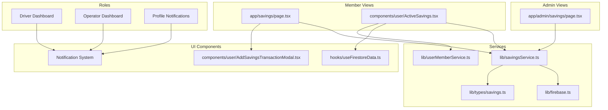

**Diagram sources**
- [app/savings/page.tsx](file://app/savings/page.tsx#L1-L382)
- [components/user/ActiveSavings.tsx](file://components/user/ActiveSavings.tsx#L1-L363)
- [app/admin/savings/page.tsx](file://app/admin/savings/page.tsx#L1-L652)
- [lib/savingsService.ts](file://lib/savingsService.ts#L1-L489)
- [lib/firebase.ts](file://lib/firebase.ts#L1-L309)
- [lib/types/savings.ts](file://lib/types/savings.ts#L1-L21)
- [components/user/AddSavingsTransactionModal.tsx](file://components/user/AddSavingsTransactionModal.tsx#L1-L367)
- [hooks/useFirestoreData.ts](file://hooks/useFirestoreData.ts#L1-L182)
- [lib/userMemberService.ts](file://lib/userMemberService.ts#L1-L287)

**Section sources**
- [app/savings/page.tsx](file://app/savings/page.tsx#L1-L382)
- [components/user/ActiveSavings.tsx](file://components/user/ActiveSavings.tsx#L1-L363)
- [app/admin/savings/page.tsx](file://app/admin/savings/page.tsx#L1-L652)
- [lib/savingsService.ts](file://lib/savingsService.ts#L1-L489)
- [lib/firebase.ts](file://lib/firebase.ts#L1-L309)
- [lib/types/savings.ts](file://lib/types/savings.ts#L1-L21)
- [components/user/AddSavingsTransactionModal.tsx](file://components/user/AddSavingsTransactionModal.tsx#L1-L367)
- [hooks/useFirestoreData.ts](file://hooks/useFirestoreData.ts#L1-L182)
- [lib/userMemberService.ts](file://lib/userMemberService.ts#L1-L287)

## Core Components
- **Savings page for members**: Fetches transactions, calculates totals, and renders summaries and paginated history with enhanced transaction detail views.
- **Active savings card**: Displays current balance and recent transactions in a compact dashboard card with real-time notifications and savings credit for drivers/operators.
- **Savings service**: Centralizes Firestore operations, member resolution, atomic transaction updates, and real-time notification creation.
- **Firebase utilities**: Provides safe wrappers for Firestore operations with validation and error handling.
- **Transaction modal**: Handles deposit/withdrawal entry with validation against current balance and confirmation dialogs.
- **Real-time hook**: Manages Firestore subscriptions with client-side sorting and error feedback.
- **Notification system**: Automatically creates and manages real-time notifications for all transaction types.
- **User-member service**: Links user accounts to member profiles and tracks savings credit for drivers and operators.

Key responsibilities:
- Data aggregation from Firestore collections (`members/{memberId}/savings`)
- Balance calculation from transaction history
- Member-to-user mapping for secure access
- Real-time updates and pagination
- Form validation and user feedback
- Automatic transaction notifications
- Savings credit tracking for operational roles

**Section sources**
- [app/savings/page.tsx](file://app/savings/page.tsx#L30-L101)
- [components/user/ActiveSavings.tsx](file://components/user/ActiveSavings.tsx#L16-L82)
- [lib/savingsService.ts](file://lib/savingsService.ts#L237-L342)
- [lib/firebase.ts](file://lib/firebase.ts#L90-L307)
- [components/user/AddSavingsTransactionModal.tsx](file://components/user/AddSavingsTransactionModal.tsx#L15-L98)
- [hooks/useFirestoreData.ts](file://hooks/useFirestoreData.ts#L19-L151)
- [lib/userMemberService.ts](file://lib/userMemberService.ts#L205-L221)

## Architecture Overview
The system follows a layered architecture with enhanced real-time capabilities:
- Presentation layer: Next.js pages and React components with click-to-view functionality
- Service layer: Savings service encapsulates business logic and notification creation
- Data access layer: Firebase utilities with Firestore operations
- Data models: TypeScript interfaces for savings transactions and member savings
- Notification layer: Real-time notification system for all transaction types

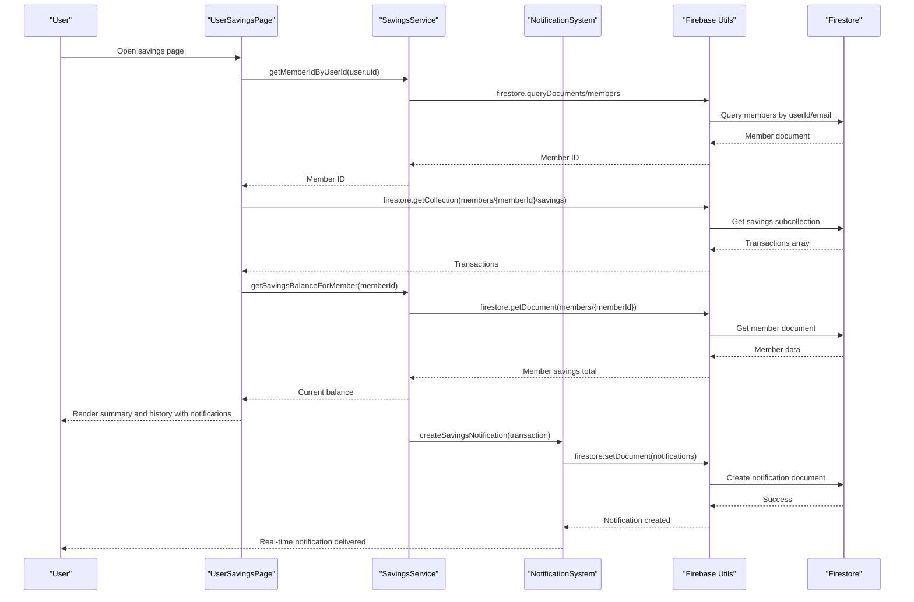

**Diagram sources**
- [app/savings/page.tsx](file://app/savings/page.tsx#L39-L101)
- [lib/savingsService.ts](file://lib/savingsService.ts#L21-L135)
- [lib/firebase.ts](file://lib/firebase.ts#L184-L240)

## Detailed Component Analysis

### Member Savings Page
The member savings page orchestrates data fetching, state management, and rendering with enhanced transaction detail views:
- Resolves member ID from user ID via the savings service
- Loads transactions from the member's subcollection
- Calculates derived metrics (total deposits, withdrawals, last updated)
- Implements pagination and page size selection
- Formats currency and dates for display
- **Enhanced**: Click-to-view functionality for transaction details

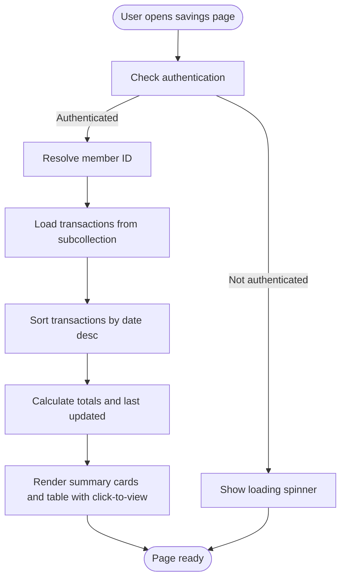

**Diagram sources**
- [app/savings/page.tsx](file://app/savings/page.tsx#L30-L110)

**Section sources**
- [app/savings/page.tsx](file://app/savings/page.tsx#L30-L210)

### Active Savings Card
The ActiveSavings component provides a compact dashboard card with real-time notifications and savings credit tracking:
- Fetches user savings transactions and balance
- Supports refresh via visibility change events
- Renders current balance and recent transactions
- Offers navigation to full savings page
- **Enhanced**: Real-time transaction notifications with automatic creation
- **Enhanced**: Savings credit display for drivers and operators
- **Enhanced**: Click-to-view functionality for transaction details

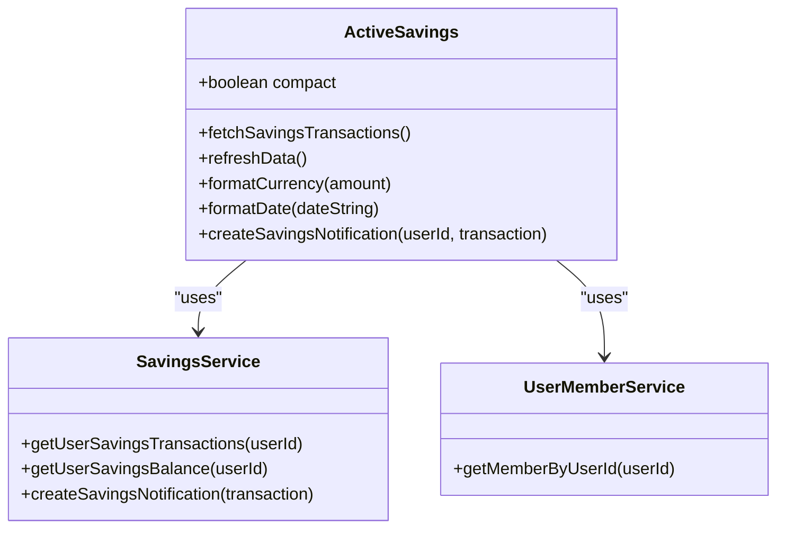

**Diagram sources**
- [components/user/ActiveSavings.tsx](file://components/user/ActiveSavings.tsx#L16-L95)
- [lib/savingsService.ts](file://lib/savingsService.ts#L347-L422)
- [lib/userMemberService.ts](file://lib/userMemberService.ts#L205-L221)

**Section sources**
- [components/user/ActiveSavings.tsx](file://components/user/ActiveSavings.tsx#L16-L363)

### Savings Service and Firestore Operations
The savings service centralizes business logic with enhanced notification capabilities:
- Member resolution: Finds member by user ID, email, or name
- Atomic transaction updates: Validates withdrawals, computes running balance, and updates member totals
- Balance retrieval: Prefers cached totals, falls back to transaction-based calculation
- Transaction queries: Retrieves member-specific savings subcollections
- **Enhanced**: Automatic notification creation for all transactions
- **Enhanced**: Comprehensive notification metadata with transaction details

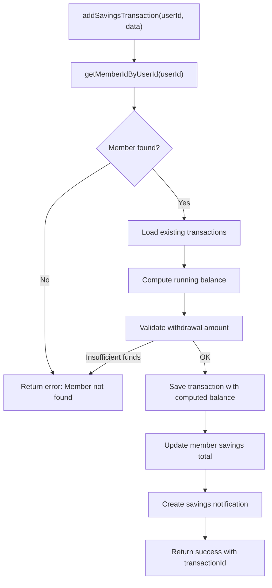

**Diagram sources**
- [lib/savingsService.ts](file://lib/savingsService.ts#L237-L342)

**Section sources**
- [lib/savingsService.ts](file://lib/savingsService.ts#L21-L489)

### Transaction Modal and Validation
The AddSavingsTransactionModal provides a controlled interface with enhanced confirmation:
- Validates amount positivity and withdrawal limits against current balance
- Formats currency and dates for user-friendly input
- Integrates with the savings service for submission
- **Enhanced**: Confirmation dialog with deposit control number generation
- **Enhanced**: Transaction preview before confirmation

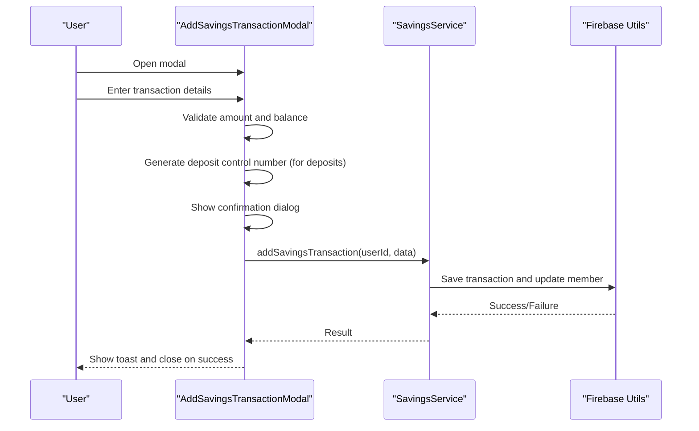

**Diagram sources**
- [components/user/AddSavingsTransactionModal.tsx](file://components/user/AddSavingsTransactionModal.tsx#L68-L96)
- [lib/savingsService.ts](file://lib/savingsService.ts#L237-L342)

**Section sources**
- [components/user/AddSavingsTransactionModal.tsx](file://components/user/AddSavingsTransactionModal.tsx#L15-L367)

### Administrative Savings Overview
The admin savings page aggregates member savings with enhanced filtering:
- Loads members from Firestore with flexible fallbacks
- Computes total savings per member using the savings service
- Provides filtering by name, role, status, and savings range
- Includes pagination and print report functionality
- **Enhanced**: Savings credit information for drivers and operators

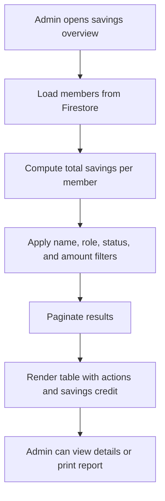

**Diagram sources**
- [app/admin/savings/page.tsx](file://app/admin/savings/page.tsx#L37-L240)

**Section sources**
- [app/admin/savings/page.tsx](file://app/admin/savings/page.tsx#L10-L652)

### Real-Time Data Hook
The useFirestoreData hook manages real-time subscriptions with enhanced functionality:
- Builds queries with optional filters
- Applies client-side sorting for performance
- Provides loading, error, and refresh states
- Returns sorted data for components
- **Enhanced**: Real-time updates with notification integration

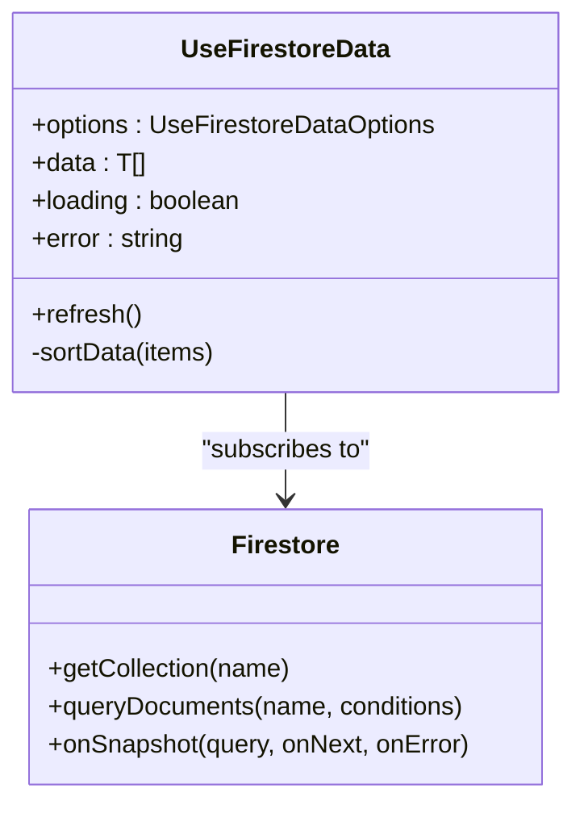

**Diagram sources**
- [hooks/useFirestoreData.ts](file://hooks/useFirestoreData.ts#L19-L151)
- [lib/firebase.ts](file://lib/firebase.ts#L148-L240)

**Section sources**
- [hooks/useFirestoreData.ts](file://hooks/useFirestoreData.ts#L1-L182)

## Real-Time Transaction Notifications
The system now includes a comprehensive real-time notification system that automatically creates notifications for all savings transactions:

### Notification Creation Process
- **Automatic Creation**: Notifications are automatically created when savings transactions are processed
- **Multi-Role Support**: Notifications are delivered to all relevant user roles (member, driver, operator)
- **Comprehensive Metadata**: Each notification includes detailed transaction information
- **Real-Time Delivery**: Notifications are immediately available in the user's notification dashboard

### Notification Features
- **Transaction Details**: Amount, type, date, and balance information
- **User Context**: Role-based notification targeting
- **Status Tracking**: Read/unread status management
- **Metadata Enrichment**: Additional transaction-specific information

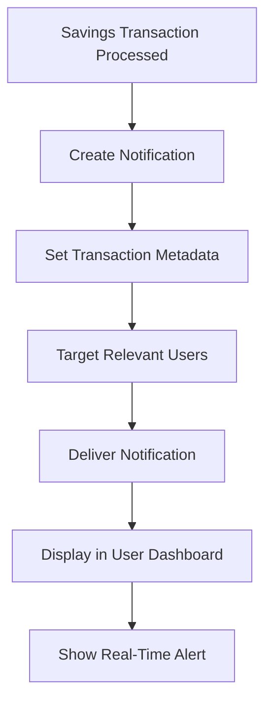

**Section sources**
- [components/user/ActiveSavings.tsx](file://components/user/ActiveSavings.tsx#L131-L153)
- [lib/savingsService.ts](file://lib/savingsService.ts#L338-L364)

## Savings Credit Tracking
The system now tracks and displays savings credit specifically for drivers and operators:

### Savings Credit Implementation
- **Role-Based Access**: Savings credit is displayed only for drivers and operators
- **Member Profile Integration**: Credit information is stored in member paymentInfo
- **Real-Time Updates**: Credit balances update automatically with transactions
- **Visual Distinction**: Savings credit is displayed in blue for easy identification

### Credit Display Features
- **Compact Dashboard**: Savings credit shown in dashboard cards for quick access
- **Full Details**: Complete savings credit information in detailed views
- **Role Detection**: Automatic detection of driver/operator roles
- **Conditional Rendering**: Credit display only for eligible roles

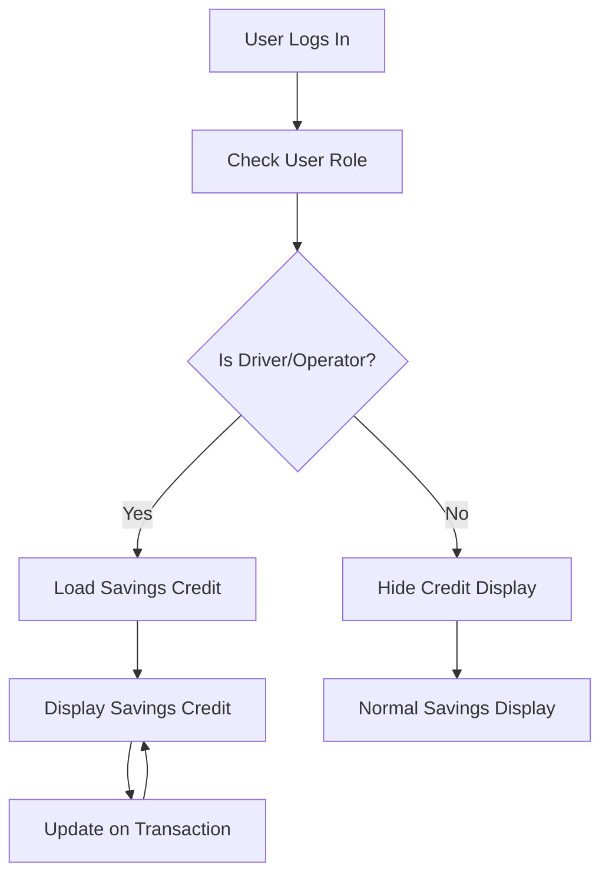

**Section sources**
- [components/user/ActiveSavings.tsx](file://components/user/ActiveSavings.tsx#L222-L229)
- [components/user/ActiveSavings.tsx](file://components/user/ActiveSavings.tsx#L263-L268)
- [lib/userMemberService.ts](file://lib/userMemberService.ts#L205-L221)

## Enhanced Transaction Detail Views
The system now provides improved transaction detail views with click-to-view functionality:

### Click-to-View Implementation
- **Interactive Rows**: Transaction rows are clickable for detailed information
- **Transaction Preview**: Displays comprehensive transaction details in an alert
- **Enhanced Information**: Shows date, type, amount, and balance for each transaction
- **User-Friendly Interface**: Simple alert-based detail view for quick information access

### Detail View Features
- **Complete Transaction Info**: All relevant transaction details in one place
- **Formatted Display**: Proper currency formatting and date presentation
- **Immediate Access**: Quick access to transaction details without navigation
- **Non-Intrusive**: Uses browser alerts to avoid disrupting the main interface

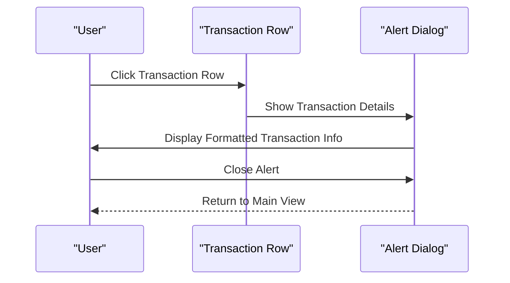

**Section sources**
- [components/user/ActiveSavings.tsx](file://components/user/ActiveSavings.tsx#L319-L330)

## Dependency Analysis
The system exhibits clear separation of concerns with enhanced notification and credit tracking:
- Pages depend on the savings service for data operations and notifications
- Components depend on the savings service, hooks, and user-member service for state
- The savings service depends on Firebase utilities for Firestore interactions and notification creation
- Types define contracts between services and components
- User-member service provides savings credit tracking for operational roles

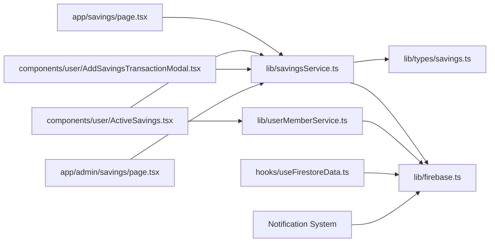

**Diagram sources**
- [app/savings/page.tsx](file://app/savings/page.tsx#L1-L14)
- [components/user/ActiveSavings.tsx](file://components/user/ActiveSavings.tsx#L1-L10)
- [components/user/AddSavingsTransactionModal.tsx](file://components/user/AddSavingsTransactionModal.tsx#L1-L6)
- [lib/savingsService.ts](file://lib/savingsService.ts#L1-L2)
- [lib/firebase.ts](file://lib/firebase.ts#L1-L17)
- [lib/types/savings.ts](file://lib/types/savings.ts#L1-L21)
- [hooks/useFirestoreData.ts](file://hooks/useFirestoreData.ts#L1-L9)
- [app/admin/savings/page.tsx](file://app/admin/savings/page.tsx#L1-L8)
- [lib/userMemberService.ts](file://lib/userMemberService.ts#L1-L287)

**Section sources**
- [app/savings/page.tsx](file://app/savings/page.tsx#L1-L14)
- [components/user/ActiveSavings.tsx](file://components/user/ActiveSavings.tsx#L1-L10)
- [components/user/AddSavingsTransactionModal.tsx](file://components/user/AddSavingsTransactionModal.tsx#L1-L6)
- [lib/savingsService.ts](file://lib/savingsService.ts#L1-L2)
- [lib/firebase.ts](file://lib/firebase.ts#L1-L17)
- [lib/types/savings.ts](file://lib/types/savings.ts#L1-L21)
- [hooks/useFirestoreData.ts](file://hooks/useFirestoreData.ts#L1-L9)
- [app/admin/savings/page.tsx](file://app/admin/savings/page.tsx#L1-L8)
- [lib/userMemberService.ts](file://lib/userMemberService.ts#L1-L287)

## Performance Considerations
- Client-side sorting: The real-time hook sorts data locally to avoid composite indexes, improving responsiveness for large datasets.
- Lazy loading: Member resolution and transaction loading occur only when the user is authenticated.
- Efficient pagination: The member page uses server-like pagination to limit rendered rows.
- Balance caching: The savings service prioritizes member document totals for quick balance retrieval.
- Minimal re-renders: Memoization is used for derived metrics and paginated data.
- **Enhanced**: Real-time notifications are batched and optimized for performance.
- **Enhanced**: Savings credit loading is conditional and only performed for eligible roles.

## Troubleshooting Guide
Common issues and resolutions:
- Member not found: The savings service logs detailed errors when a user lacks a corresponding member document. Verify user-to-member linking in Firestore.
- Insufficient funds: Withdrawal validation prevents negative balances; ensure the entered amount does not exceed the current balance.
- Firestore permission denied: Firebase utilities surface permission errors; review Firestore rules and user roles.
- Real-time listener failures: The hook displays user-friendly error messages and suggests contacting administrators.
- Data inconsistencies: The savings service recalculates totals from transactions as a fallback when member totals are unavailable.
- **Enhanced**: Notification creation failures: The system continues operation even if notification creation fails.
- **Enhanced**: Savings credit not displaying: Verify that the user has the correct role (driver/operator) and that paymentInfo.savingsCredit exists in the member document.

Practical checks:
- Confirm Firebase configuration variables are set.
- Verify Firestore indexes exist for any server-side queries.
- Ensure member documents contain the expected fields (userId, email, savings.total, paymentInfo.savingsCredit).
- Test transaction submissions with small amounts to validate the pipeline.
- **Enhanced**: Verify notification collection exists and has proper Firestore rules.
- **Enhanced**: Check user-member linkage for drivers/operators to ensure savings credit is accessible.

**Section sources**
- [lib/savingsService.ts](file://lib/savingsService.ts#L130-L133)
- [lib/savingsService.ts](file://lib/savingsService.ts#L292-L294)
- [lib/firebase.ts](file://lib/firebase.ts#L174-L180)
- [hooks/useFirestoreData.ts](file://hooks/useFirestoreData.ts#L111-L116)

## Conclusion
The Active Savings Display System delivers a robust, real-time savings experience for members and administrators with enhanced capabilities. The recent additions of real-time transaction notifications, savings credit tracking for drivers and operators, and improved transaction detail views significantly enhance the user experience. By centralizing Firestore operations in the savings service, enforcing validation at the transaction level, and leveraging client-side sorting, the system achieves both reliability and performance. The modular architecture allows for easy extension, such as adding savings goals, advanced filtering, or notifications, while maintaining strong data integrity and user experience. The system now provides comprehensive real-time communication and specialized features for operational roles, making it a complete solution for cooperative financial management.