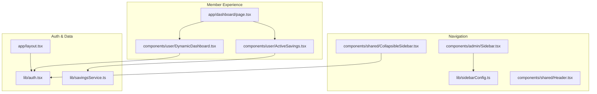
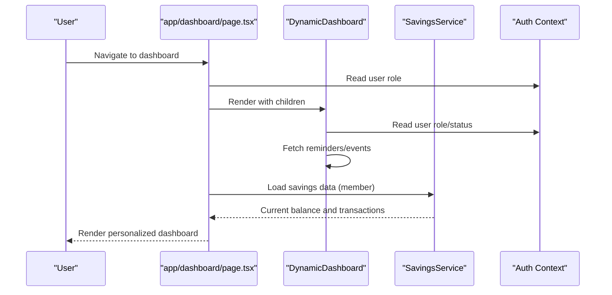
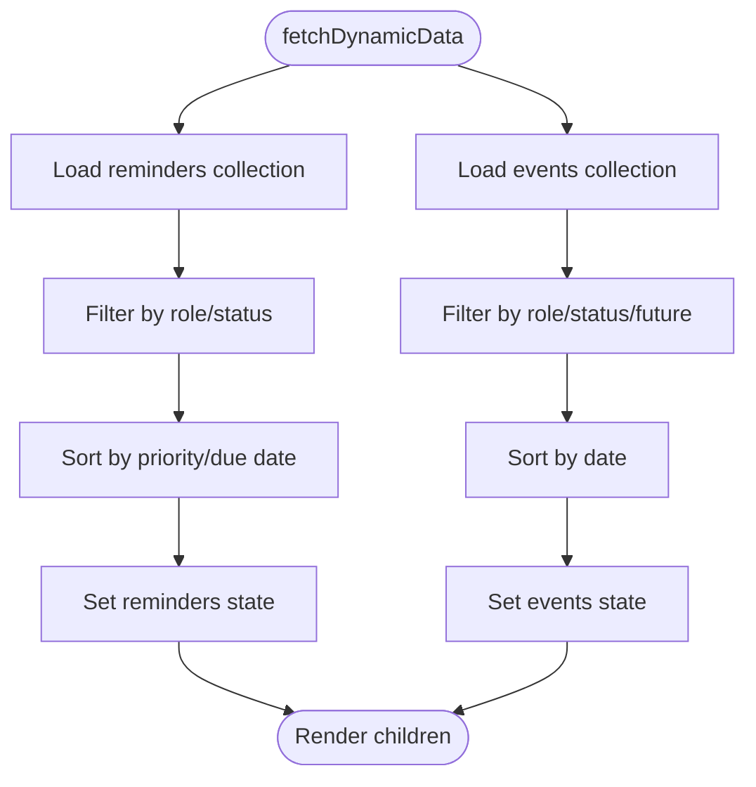
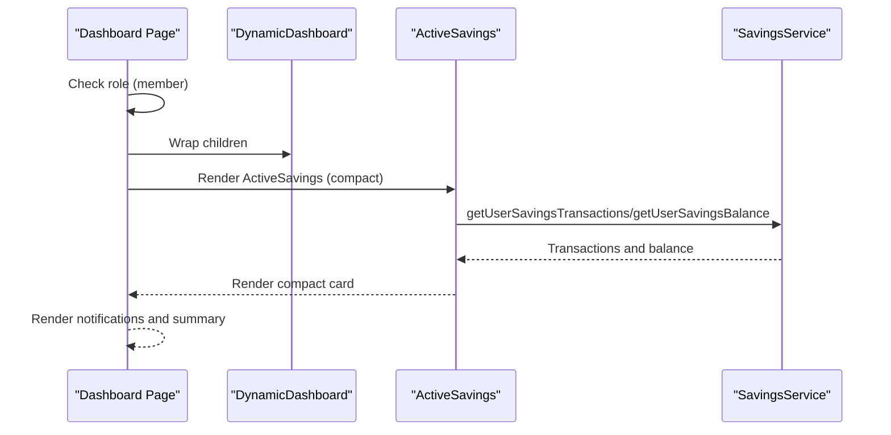
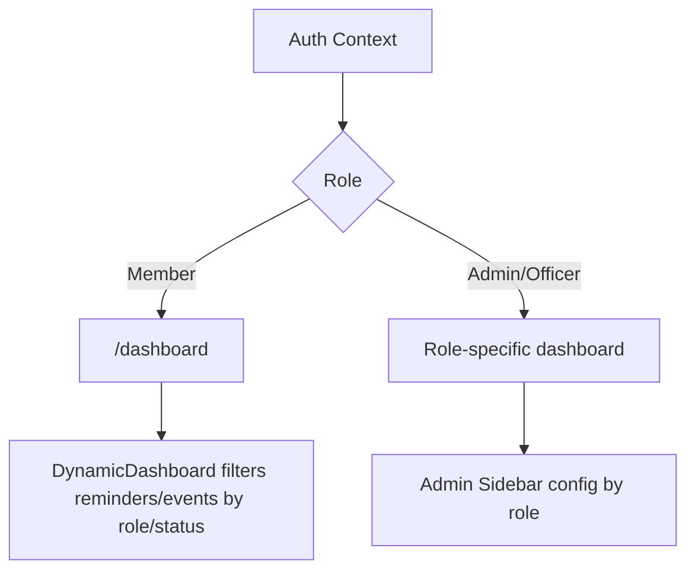
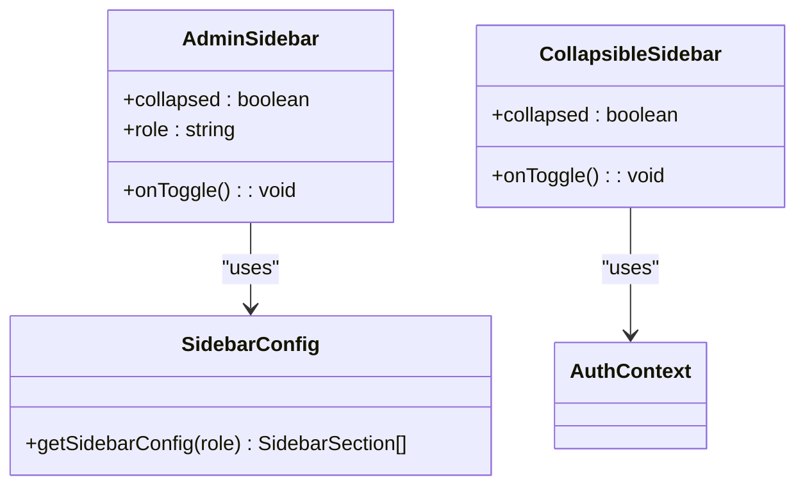
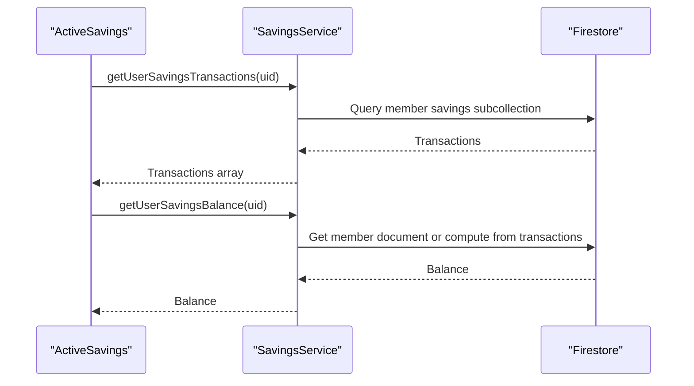
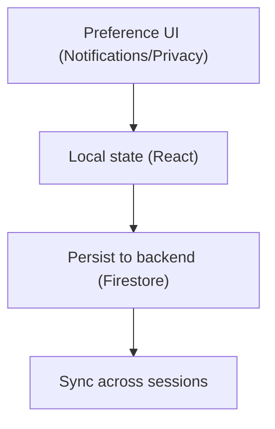
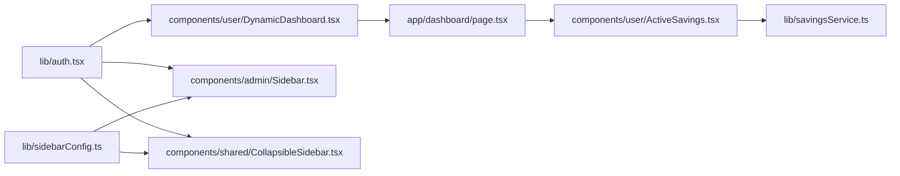

# Dashboard Customization & Personalization

<cite>
**Referenced Files in This Document**
- [app/dashboard/page.tsx](file://app/dashboard/page.tsx)
- [components/user/DynamicDashboard.tsx](file://components/user/DynamicDashboard.tsx)
- [components/user/ActiveSavings.tsx](file://components/user/ActiveSavings.tsx)
- [lib/sidebarConfig.ts](file://lib/sidebarConfig.ts)
- [components/admin/Sidebar.tsx](file://components/admin/Sidebar.tsx)
- [components/shared/CollapsibleSidebar.tsx](file://components/shared/CollapsibleSidebar.tsx)
- [lib/auth.tsx](file://lib/auth.tsx)
- [lib/savingsService.ts](file://lib/savingsService.ts)
- [app/layout.tsx](file://app/layout.tsx)
- [components/shared/Header.tsx](file://components/shared/Header.tsx)
- [app/profile/notifications/page.tsx](file://app/profile/notifications/page.tsx)
- [app/profile/privacy/page.tsx](file://app/profile/privacy/page.tsx)
</cite>

## Table of Contents
1. [Introduction](#introduction)
2. [Project Structure](#project-structure)
3. [Core Components](#core-components)
4. [Architecture Overview](#architecture-overview)
5. [Detailed Component Analysis](#detailed-component-analysis)
6. [Dependency Analysis](#dependency-analysis)
7. [Performance Considerations](#performance-considerations)
8. [Troubleshooting Guide](#troubleshooting-guide)
9. [Conclusion](#conclusion)
10. [Appendices](#appendices)

## Introduction
This document explains the Dashboard Customization and Personalization features that enable members and officers to tailor their dashboard experience. It covers:
- The dynamic dashboard container that aggregates reminders and events
- Widget arrangement and presentation of financial information
- Role-based content adaptation for different member and officer roles
- Sidebar configuration and navigation customization
- Responsive design patterns for optimal display across devices
- Practical examples for extending the dashboard with new widgets and preferences
- Accessibility and inclusive design considerations

## Project Structure
The dashboard experience spans several pages and components:
- Member dashboard page renders financial summaries and integrates a dynamic dashboard container
- Dynamic dashboard container fetches and exposes reminders and events to child components
- Role-based sidebar configuration drives navigation visibility and structure
- Savings service provides financial data for member dashboards
- Authentication context determines role and redirects to appropriate dashboards
- Shared components provide responsive navigation and header elements

**Diagram sources**
- [app/dashboard/page.tsx](file://app/dashboard/page.tsx#L11-L310)
- [components/user/DynamicDashboard.tsx](file://components/user/DynamicDashboard.tsx#L36-L146)
- [components/user/ActiveSavings.tsx](file://components/user/ActiveSavings.tsx#L16-L270)
- [lib/sidebarConfig.ts](file://lib/sidebarConfig.ts#L30-L262)
- [components/admin/Sidebar.tsx](file://components/admin/Sidebar.tsx#L92-L279)
- [components/shared/CollapsibleSidebar.tsx](file://components/shared/CollapsibleSidebar.tsx#L74-L156)
- [lib/auth.tsx](file://lib/auth.tsx#L158-L682)
- [lib/savingsService.ts](file://lib/savingsService.ts#L347-L422)
- [app/layout.tsx](file://app/layout.tsx#L22-L37)

**Section sources**
- [app/dashboard/page.tsx](file://app/dashboard/page.tsx#L11-L310)
- [components/user/DynamicDashboard.tsx](file://components/user/DynamicDashboard.tsx#L36-L146)
- [lib/sidebarConfig.ts](file://lib/sidebarConfig.ts#L30-L262)
- [components/admin/Sidebar.tsx](file://components/admin/Sidebar.tsx#L92-L279)
- [components/shared/CollapsibleSidebar.tsx](file://components/shared/CollapsibleSidebar.tsx#L74-L156)
- [lib/auth.tsx](file://lib/auth.tsx#L158-L682)
- [lib/savingsService.ts](file://lib/savingsService.ts#L347-L422)
- [app/layout.tsx](file://app/layout.tsx#L22-L37)

## Core Components
- DynamicDashboard: A container that loads reminders and events based on user role and status, exposing them to child components. It centralizes data fetching and provides a clean boundary for dashboard personalization.
- Member dashboard page: Renders financial summaries, notifications, and role-specific content. It composes DynamicDashboard and child widgets.
- ActiveSavings: Displays recent savings transactions and current balance for members, supporting both compact and full layouts.
- Role-based sidebar configuration: Defines navigation sections per role and supports collapsible behavior.
- Savings service: Provides functions to fetch transactions and balances for users, enabling accurate financial displays.

**Section sources**
- [components/user/DynamicDashboard.tsx](file://components/user/DynamicDashboard.tsx#L36-L146)
- [app/dashboard/page.tsx](file://app/dashboard/page.tsx#L11-L310)
- [components/user/ActiveSavings.tsx](file://components/user/ActiveSavings.tsx#L16-L270)
- [lib/sidebarConfig.ts](file://lib/sidebarConfig.ts#L30-L262)
- [lib/savingsService.ts](file://lib/savingsService.ts#L347-L422)

## Architecture Overview
The dashboard architecture separates concerns:
- Authentication context determines user role and enables role-based routing and content adaptation
- DynamicDashboard encapsulates data loading for reminders and events
- Page-level components assemble widgets and apply role checks
- Sidebar configuration is decoupled and driven by roleSidebarConfig

**Diagram sources**
- [app/dashboard/page.tsx](file://app/dashboard/page.tsx#L11-L310)
- [components/user/DynamicDashboard.tsx](file://components/user/DynamicDashboard.tsx#L42-L137)
- [lib/savingsService.ts](file://lib/savingsService.ts#L347-L422)
- [lib/auth.tsx](file://lib/auth.tsx#L158-L682)

## Detailed Component Analysis

### DynamicDashboard Container
DynamicDashboard centralizes dynamic content loading:
- Loads reminders filtered by user role and status, sorts by priority and due date
- Loads events filtered by role, status, and future dates, sorted by upcoming date
- Exposes data to child components via composition (children receive props/data)

**Diagram sources**
- [components/user/DynamicDashboard.tsx](file://components/user/DynamicDashboard.tsx#L48-L137)

**Section sources**
- [components/user/DynamicDashboard.tsx](file://components/user/DynamicDashboard.tsx#L36-L146)

### Member Dashboard Page
The member dashboard page:
- Determines member role and conditionally renders member-specific content
- Integrates savings summary and recent transactions
- Uses DynamicDashboard to wrap child components and pass dynamic data

**Diagram sources**
- [app/dashboard/page.tsx](file://app/dashboard/page.tsx#L11-L310)
- [components/user/ActiveSavings.tsx](file://components/user/ActiveSavings.tsx#L23-L82)
- [lib/savingsService.ts](file://lib/savingsService.ts#L347-L422)

**Section sources**
- [app/dashboard/page.tsx](file://app/dashboard/page.tsx#L11-L310)
- [components/user/ActiveSavings.tsx](file://components/user/ActiveSavings.tsx#L16-L270)

### Role-Based Content Adaptation
Role-based adaptation occurs at two levels:
- Routing and dashboard selection via authentication context
- Dynamic content filtering within DynamicDashboard by user role and status
- Sidebar configuration tailored per role

**Diagram sources**
- [lib/auth.tsx](file://lib/auth.tsx#L111-L156)
- [components/user/DynamicDashboard.tsx](file://components/user/DynamicDashboard.tsx#L52-L127)
- [lib/sidebarConfig.ts](file://lib/sidebarConfig.ts#L258-L262)

**Section sources**
- [lib/auth.tsx](file://lib/auth.tsx#L111-L156)
- [components/user/DynamicDashboard.tsx](file://components/user/DynamicDashboard.tsx#L52-L127)
- [lib/sidebarConfig.ts](file://lib/sidebarConfig.ts#L258-L262)

### Sidebar Configuration and Navigation Customization
Two sidebar implementations support customization:
- Admin sidebar: Collapsible, role-aware, with dropdown sections and logout
- Collapsible sidebar: General-purpose navigation with toggle and logout

Both rely on roleSidebarConfig for menu items and icons.

**Diagram sources**
- [lib/sidebarConfig.ts](file://lib/sidebarConfig.ts#L258-L262)
- [components/admin/Sidebar.tsx](file://components/admin/Sidebar.tsx#L92-L279)
- [components/shared/CollapsibleSidebar.tsx](file://components/shared/CollapsibleSidebar.tsx#L74-L156)

**Section sources**
- [lib/sidebarConfig.ts](file://lib/sidebarConfig.ts#L30-L262)
- [components/admin/Sidebar.tsx](file://components/admin/Sidebar.tsx#L92-L279)
- [components/shared/CollapsibleSidebar.tsx](file://components/shared/CollapsibleSidebar.tsx#L74-L156)

### Financial Data Integration
ActiveSavings and savings service integrate to present accurate financial information:
- Fetches transactions and computes current balance
- Supports compact and full layouts
- Handles visibility changes to refresh data

**Diagram sources**
- [components/user/ActiveSavings.tsx](file://components/user/ActiveSavings.tsx#L23-L82)
- [lib/savingsService.ts](file://lib/savingsService.ts#L347-L422)

**Section sources**
- [components/user/ActiveSavings.tsx](file://components/user/ActiveSavings.tsx#L16-L270)
- [lib/savingsService.ts](file://lib/savingsService.ts#L347-L422)

### Preference Management Interfaces
While the codebase does not include explicit dashboard preference persistence, it provides:
- Notification settings page with toggles for communication preferences
- Privacy settings page with radio buttons and toggles

These demonstrate the pattern for building preference interfaces that can be extended to dashboard customization.

**Diagram sources**
- [app/profile/notifications/page.tsx](file://app/profile/notifications/page.tsx#L8-L150)
- [app/profile/privacy/page.tsx](file://app/profile/privacy/page.tsx#L8-L100)

**Section sources**
- [app/profile/notifications/page.tsx](file://app/profile/notifications/page.tsx#L8-L150)
- [app/profile/privacy/page.tsx](file://app/profile/privacy/page.tsx#L8-L100)

## Dependency Analysis
Key dependencies and relationships:
- DynamicDashboard depends on authentication context and Firestore to filter and sort content
- Member dashboard page composes DynamicDashboard and ActiveSavings
- SavingsService depends on Firestore collections for member savings
- Sidebar components depend on roleSidebarConfig and authentication context
- Auth context provides role-based routing and user state

**Diagram sources**
- [lib/auth.tsx](file://lib/auth.tsx#L158-L682)
- [components/user/DynamicDashboard.tsx](file://components/user/DynamicDashboard.tsx#L36-L146)
- [components/admin/Sidebar.tsx](file://components/admin/Sidebar.tsx#L92-L279)
- [components/shared/CollapsibleSidebar.tsx](file://components/shared/CollapsibleSidebar.tsx#L74-L156)
- [app/dashboard/page.tsx](file://app/dashboard/page.tsx#L11-L310)
- [components/user/ActiveSavings.tsx](file://components/user/ActiveSavings.tsx#L16-L270)
- [lib/savingsService.ts](file://lib/savingsService.ts#L347-L422)
- [lib/sidebarConfig.ts](file://lib/sidebarConfig.ts#L30-L262)

**Section sources**
- [lib/auth.tsx](file://lib/auth.tsx#L158-L682)
- [components/user/DynamicDashboard.tsx](file://components/user/DynamicDashboard.tsx#L36-L146)
- [components/admin/Sidebar.tsx](file://components/admin/Sidebar.tsx#L92-L279)
- [components/shared/CollapsibleSidebar.tsx](file://components/shared/CollapsibleSidebar.tsx#L74-L156)
- [app/dashboard/page.tsx](file://app/dashboard/page.tsx#L11-L310)
- [components/user/ActiveSavings.tsx](file://components/user/ActiveSavings.tsx#L16-L270)
- [lib/savingsService.ts](file://lib/savingsService.ts#L347-L422)
- [lib/sidebarConfig.ts](file://lib/sidebarConfig.ts#L30-L262)

## Performance Considerations
- Centralized data fetching in DynamicDashboard reduces redundant queries and ensures consistent filtering by role and status.
- Savings data is refreshed on visibility change to keep the display current without manual intervention.
- Sidebar components use minimal state and rely on roleSidebarConfig to avoid heavy computations.
- Consider caching frequently accessed data (e.g., reminders/events) to reduce Firestore reads and improve responsiveness.

## Troubleshooting Guide
Common issues and resolutions:
- Dynamic content not appearing: Verify user role and status filters in DynamicDashboard; ensure Firestore collections exist and are populated.
- Savings data errors: Confirm member document linkage and savings subcollection presence; check error handling paths in ActiveSavings and savingsService.
- Sidebar items missing: Validate roleSidebarConfig entries and ensure the role matches expected casing.
- Authentication redirects incorrect: Review getDashboardPath logic and cookie-based role detection in AuthProvider.

**Section sources**
- [components/user/DynamicDashboard.tsx](file://components/user/DynamicDashboard.tsx#L48-L137)
- [components/user/ActiveSavings.tsx](file://components/user/ActiveSavings.tsx#L42-L49)
- [lib/savingsService.ts](file://lib/savingsService.ts#L21-L135)
- [lib/sidebarConfig.ts](file://lib/sidebarConfig.ts#L258-L262)
- [lib/auth.tsx](file://lib/auth.tsx#L111-L156)

## Conclusion
The dashboard customization and personalization system leverages a dynamic container for role-aware content, modular widget components for financial displays, and role-based navigation. While explicit dashboard preference persistence is not implemented, the existing preference interfaces illustrate a clear pattern for building customizable experiences. The architecture supports scalability, maintainability, and responsive design across devices.

## Appendices

### Practical Examples

- Adding a new dashboard widget
  - Create a new component under components/user (e.g., RecentLoans.tsx) that fetches and renders relevant data
  - Wrap the page with DynamicDashboard and include your widget as a child
  - Reference: [app/dashboard/page.tsx](file://app/dashboard/page.tsx#L207-L309), [components/user/DynamicDashboard.tsx](file://components/user/DynamicDashboard.tsx#L36-L146)

- Implementing a custom layout system
  - Use CSS Grid or Flexbox within the page to arrange widgets
  - Conditionally render widgets based on role and data availability
  - Reference: [app/dashboard/page.tsx](file://app/dashboard/page.tsx#L207-L309)

- Creating user preference management interfaces
  - Follow the pattern in NotificationSettingsPage and PrivacySettingsPage to manage toggles and selections
  - Persist preferences to Firestore and load them on page initialization
  - Reference: [app/profile/notifications/page.tsx](file://app/profile/notifications/page.tsx#L8-L150), [app/profile/privacy/page.tsx](file://app/profile/privacy/page.tsx#L8-L100)

### Accessibility and Inclusive Design
- Ensure keyboard navigation and focus management in collapsible and dropdown components
- Provide ARIA labels and roles for interactive elements (buttons, links, menus)
- Maintain sufficient color contrast and offer high-contrast modes if needed
- Support screen readers with descriptive labels and semantic markup
- Test responsive breakpoints to ensure readability and usability on small screens
- Reference: [components/shared/CollapsibleSidebar.tsx](file://components/shared/CollapsibleSidebar.tsx#L74-L156), [components/admin/Sidebar.tsx](file://components/admin/Sidebar.tsx#L92-L279), [components/shared/Header.tsx](file://components/shared/Header.tsx#L4-L26)