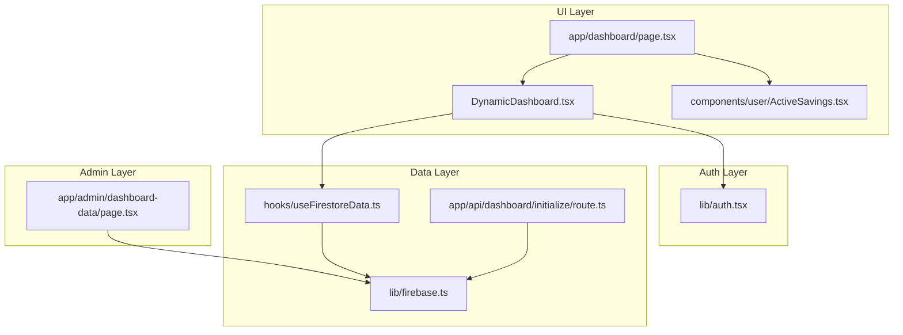
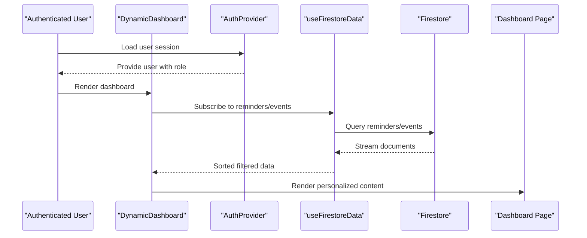
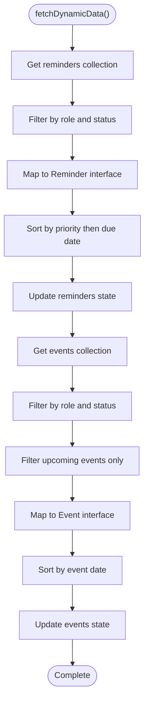
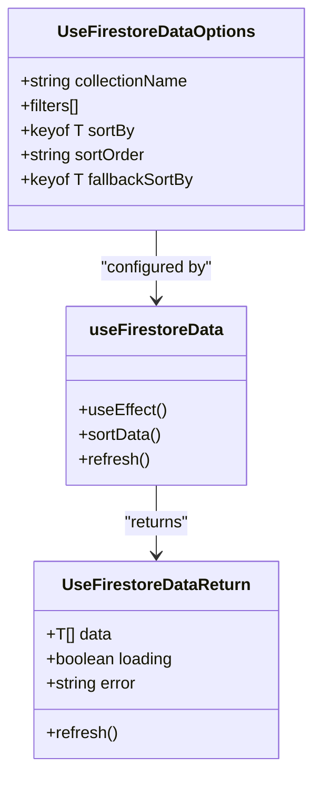
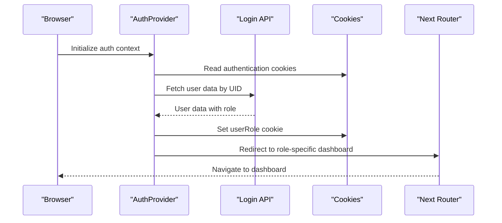
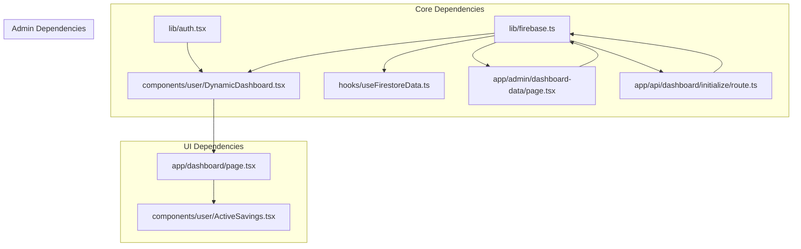

# Dynamic Dashboard Core System

<cite>
**Referenced Files in This Document**
- [DynamicDashboard.tsx](file://components/user/DynamicDashboard.tsx)
- [route.ts](file://app/api/dashboard/initialize/route.ts)
- [useFirestoreData.ts](file://hooks/useFirestoreData.ts)
- [auth.tsx](file://lib/auth.tsx)
- [page.tsx](file://app/dashboard/page.tsx)
- [firebase.ts](file://lib/firebase.ts)
- [page.tsx](file://app/admin/dashboard-data/page.tsx)
- [ActiveSavings.tsx](file://components/user/ActiveSavings.tsx)
</cite>

## Table of Contents
1. [Introduction](#introduction)
2. [Project Structure](#project-structure)
3. [Core Components](#core-components)
4. [Architecture Overview](#architecture-overview)
5. [Detailed Component Analysis](#detailed-component-analysis)
6. [Dependency Analysis](#dependency-analysis)
7. [Performance Considerations](#performance-considerations)
8. [Troubleshooting Guide](#troubleshooting-guide)
9. [Conclusion](#conclusion)
10. [Appendices](#appendices)

## Introduction
The Dynamic Dashboard Core System is the central hub for member dashboard data management in the cooperative platform. It orchestrates role-based data filtering, real-time data fetching from Firestore, priority-based sorting, and personalized content delivery through authentication integration. The system exposes a flexible foundation for extending with new data sources, modifying filtering criteria, and implementing custom data transformations while maintaining robust loading state management and error handling patterns.

## Project Structure
The dashboard system spans multiple layers:
- UI shell and orchestration: DynamicDashboard component and dashboard page
- Real-time data hooks: useFirestoreData for reactive Firestore queries
- Authentication integration: AuthProvider and useAuth for role-aware personalization
- Data initialization: API route for seeding reminders and events
- Admin management: Admin dashboard for managing reminders and events
- Supporting services: Firebase utilities and savings integration

**Diagram sources**
- [DynamicDashboard.tsx](file://components/user/DynamicDashboard.tsx#L36-L146)
- [page.tsx](file://app/dashboard/page.tsx#L11-L312)
- [useFirestoreData.ts](file://hooks/useFirestoreData.ts#L19-L151)
- [firebase.ts](file://lib/firebase.ts#L89-L309)
- [route.ts](file://app/api/dashboard/initialize/route.ts#L4-L186)
- [auth.tsx](file://lib/auth.tsx#L158-L682)
- [page.tsx](file://app/admin/dashboard-data/page.tsx#L30-L468)

**Section sources**
- [DynamicDashboard.tsx](file://components/user/DynamicDashboard.tsx#L1-L149)
- [page.tsx](file://app/dashboard/page.tsx#L1-L312)
- [useFirestoreData.ts](file://hooks/useFirestoreData.ts#L1-L182)
- [firebase.ts](file://lib/firebase.ts#L1-L309)
- [route.ts](file://app/api/dashboard/initialize/route.ts#L1-L186)
- [auth.tsx](file://lib/auth.tsx#L1-L682)
- [page.tsx](file://app/admin/dashboard-data/page.tsx#L1-L468)

## Core Components
- DynamicDashboard: Central orchestrator that fetches and filters reminders and events based on user role and status, sorts by priority/due date, and manages loading states.
- useFirestoreData: Reusable hook for real-time Firestore queries with client-side sorting and error handling.
- AuthProvider/useAuth: Authentication context providing user role and loading state for personalization.
- Dashboard Page: Renders notifications, savings summary, and integrates ActiveSavings for member-specific data.
- Admin Dashboard Data: Manages reminders and events creation, filtering, and display for administrative oversight.
- Firebase Utilities: Consistent Firestore operations with validation and error reporting.

**Section sources**
- [DynamicDashboard.tsx](file://components/user/DynamicDashboard.tsx#L36-L146)
- [useFirestoreData.ts](file://hooks/useFirestoreData.ts#L19-L151)
- [auth.tsx](file://lib/auth.tsx#L158-L682)
- [page.tsx](file://app/dashboard/page.tsx#L11-L312)
- [page.tsx](file://app/admin/dashboard-data/page.tsx#L30-L468)
- [firebase.ts](file://lib/firebase.ts#L89-L309)

## Architecture Overview
The system follows a layered architecture:
- Presentation Layer: Dashboard pages and components
- Orchestration Layer: DynamicDashboard coordinates data fetching and filtering
- Data Access Layer: useFirestoreData and Firebase utilities
- Authentication Layer: Role-aware personalization and navigation
- Administrative Layer: Admin dashboard for data management

**Diagram sources**
- [DynamicDashboard.tsx](file://components/user/DynamicDashboard.tsx#L42-L137)
- [useFirestoreData.ts](file://hooks/useFirestoreData.ts#L65-L125)
- [auth.tsx](file://lib/auth.tsx#L158-L195)
- [page.tsx](file://app/dashboard/page.tsx#L11-L312)

## Detailed Component Analysis

### DynamicDashboard Component
The DynamicDashboard component serves as the central orchestrator for dashboard data management. It integrates with authentication to personalize content and implements role-based filtering and priority-based sorting.

Key responsibilities:
- Role-based filtering: Filters reminders and events by user role ('all', specific role, or none)
- Status filtering: Ensures only active/published content is displayed
- Priority-based sorting: Sorts reminders by priority (high → medium → low) then by due date
- Upcoming event filtering: Filters events to show only future dates
- Loading state management: Coordinates loading indicators during data fetch
- Error handling: Provides user feedback via toast notifications

**Diagram sources**
- [DynamicDashboard.tsx](file://components/user/DynamicDashboard.tsx#L48-L137)

**Section sources**
- [DynamicDashboard.tsx](file://components/user/DynamicDashboard.tsx#L36-L146)

### Real-Time Data Fetching with useFirestoreData Hook
The useFirestoreData hook provides a reusable pattern for real-time Firestore queries with client-side sorting capabilities.

Implementation highlights:
- Real-time subscriptions using onSnapshot for automatic updates
- Client-side sorting to avoid composite index requirements
- Flexible filter configuration supporting multiple where clauses
- Comprehensive error handling with user-friendly messages
- Automatic loading state management

**Diagram sources**
- [useFirestoreData.ts](file://hooks/useFirestoreData.ts#L11-L151)

**Section sources**
- [useFirestoreData.ts](file://hooks/useFirestoreData.ts#L19-L151)

### Authentication Integration and Personalization
The authentication system provides role-aware personalization through the AuthProvider and useAuth hook.

Key features:
- Role-based dashboard routing via getDashboardPath
- Cookie-based session persistence for client-side access
- Automatic role-aware redirects after login
- User context with loading states for conditional rendering

**Diagram sources**
- [auth.tsx](file://lib/auth.tsx#L158-L195)
- [auth.tsx](file://lib/auth.tsx#L331-L340)

**Section sources**
- [auth.tsx](file://lib/auth.tsx#L111-L156)
- [auth.tsx](file://lib/auth.tsx#L158-L682)

### Data Initialization and Administration
The dashboard initialization API route seeds the system with sample reminders and events, while the admin dashboard provides management capabilities.

Initialization process:
- Creates sample reminders with role-specific priorities
- Generates sample events with role targeting
- Prevents duplicate entries using query checks
- Returns structured success/error responses

Admin management features:
- Real-time preview of reminders and events
- Form-based creation with validation
- Role and priority selection controls
- Loading states and error handling

**Section sources**
- [route.ts](file://app/api/dashboard/initialize/route.ts#L4-L186)
- [page.tsx](file://app/admin/dashboard-data/page.tsx#L30-L468)

### Notifications and Savings Integration
The dashboard page integrates notifications and savings data to provide a comprehensive member experience.

Notification system:
- Role-aware notification filtering
- Unread/new status detection
- Real-time updates via Firestore collection
- Visual indicators for new notifications

Savings integration:
- Member-specific savings calculation
- Transaction history display
- Real-time balance updates
- Responsive card layouts for different contexts

**Section sources**
- [page.tsx](file://app/dashboard/page.tsx#L11-L312)
- [ActiveSavings.tsx](file://components/user/ActiveSavings.tsx#L16-L95)

## Dependency Analysis
The system exhibits clean separation of concerns with minimal coupling between components.

**Diagram sources**
- [DynamicDashboard.tsx](file://components/user/DynamicDashboard.tsx#L3-L6)
- [useFirestoreData.ts](file://hooks/useFirestoreData.ts#L6-L9)
- [firebase.ts](file://lib/firebase.ts#L1-L309)
- [page.tsx](file://app/dashboard/page.tsx#L3-L9)
- [page.tsx](file://app/admin/dashboard-data/page.tsx#L6)

**Section sources**
- [DynamicDashboard.tsx](file://components/user/DynamicDashboard.tsx#L1-L149)
- [useFirestoreData.ts](file://hooks/useFirestoreData.ts#L1-L182)
- [firebase.ts](file://lib/firebase.ts#L1-L309)
- [page.tsx](file://app/dashboard/page.tsx#L1-L312)
- [page.tsx](file://app/admin/dashboard-data/page.tsx#L1-L468)

## Performance Considerations
The system implements several performance optimization techniques:

- Client-side sorting: useFirestoreData avoids composite index requirements by applying sorting client-side after fetching filtered results
- Real-time updates: onSnapshot listeners provide automatic UI updates without polling
- Lazy loading: Dashboard components only fetch data when user context is available
- Minimal re-renders: State updates are scoped to relevant components
- Error boundaries: Comprehensive error handling prevents cascading failures

Recommendations for further optimization:
- Implement pagination for large datasets
- Add debounced search for filtering
- Introduce selective re-fetching based on user interactions
- Consider caching strategies for frequently accessed data

[No sources needed since this section provides general guidance]

## Troubleshooting Guide
Common issues and resolution patterns:

**Authentication Issues:**
- Verify cookie presence and expiration
- Check role assignment in user documents
- Confirm Firebase configuration values

**Data Fetching Problems:**
- Validate Firestore rules allow read access
- Check collection existence and naming
- Review network connectivity and quotas

**Sorting and Filtering Errors:**
- Ensure consistent data types in Firestore
- Verify enum values match expected casing
- Check for null/undefined field values

**Performance Issues:**
- Monitor real-time listener memory usage
- Implement proper cleanup in useEffect
- Consider reducing initial fetch scope

**Section sources**
- [auth.tsx](file://lib/auth.tsx#L164-L195)
- [firebase.ts](file://lib/firebase.ts#L148-L182)
- [useFirestoreData.ts](file://hooks/useFirestoreData.ts#L105-L117)

## Conclusion
The Dynamic Dashboard Core System provides a robust, extensible foundation for cooperative member dashboards. Its role-based filtering, real-time data synchronization, and priority-based sorting deliver personalized experiences while maintaining performance and reliability. The modular architecture supports easy extension with new data sources, custom filtering criteria, and advanced data transformations through the established patterns and utilities.

## Appendices

### Extending with New Data Sources
To add new data sources to the dashboard:

1. **Create a new Firestore collection** with appropriate security rules
2. **Add filtering logic** similar to reminders/events filtering
3. **Implement sorting** using the priority/date pattern
4. **Integrate with the dashboard page** for display
5. **Add admin management** if needed

### Modifying Filtering Criteria
Customize filtering by:
- Adding new filter fields to the filter pipeline
- Implementing case-insensitive comparisons
- Supporting multiple status values
- Adding date range filters

### Custom Data Transformations
Implement custom transformations through:
- Map functions that convert Firestore documents
- Computed properties for derived data
- Aggregation functions for summary statistics
- Caching mechanisms for expensive computations

[No sources needed since this section provides general guidance]