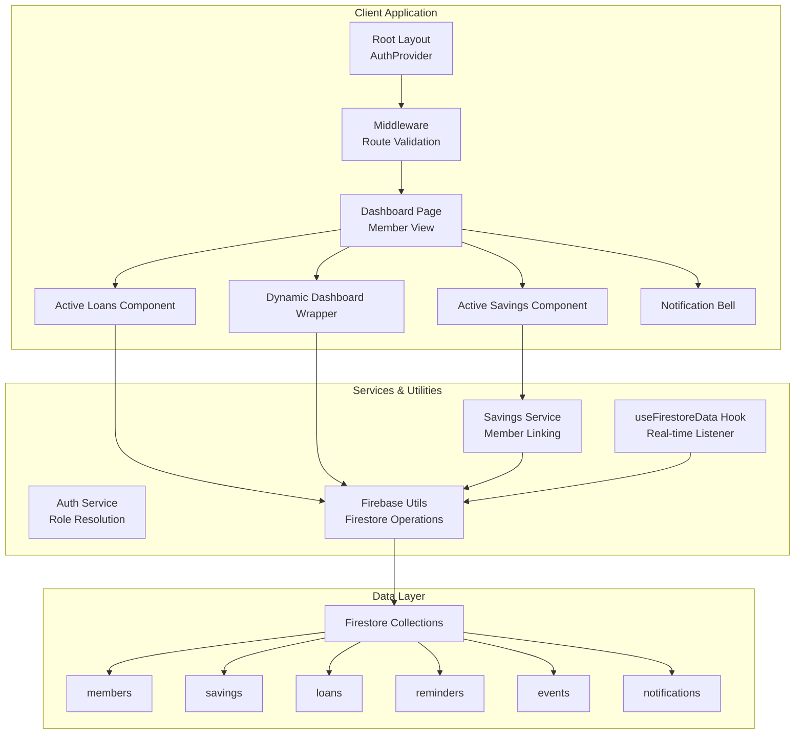
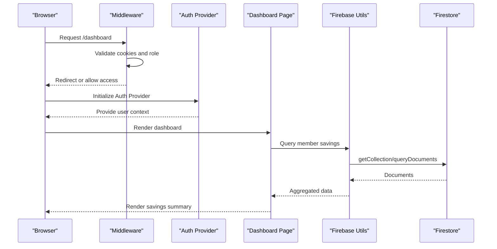
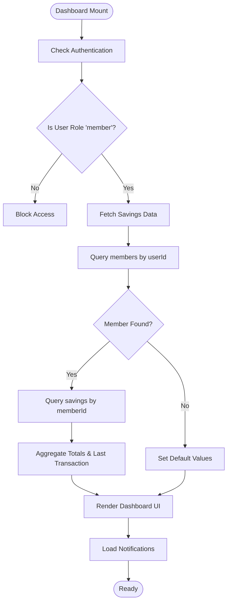
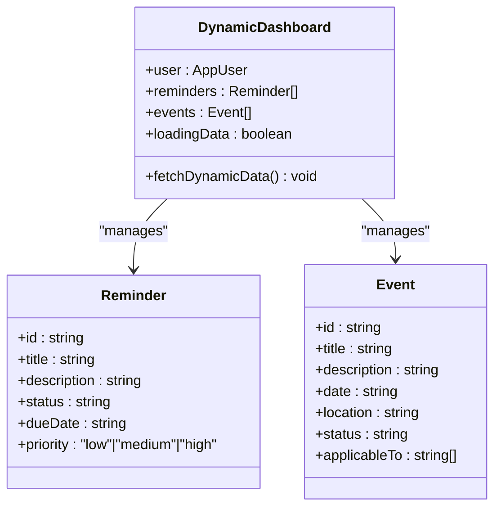
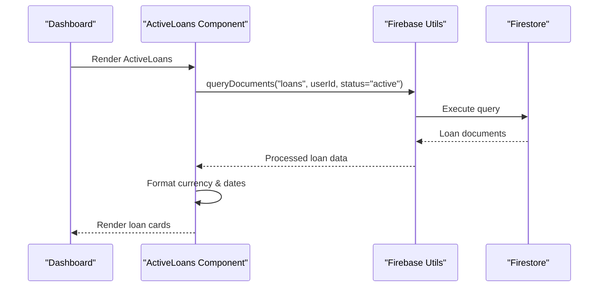
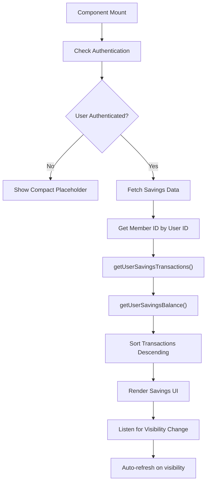
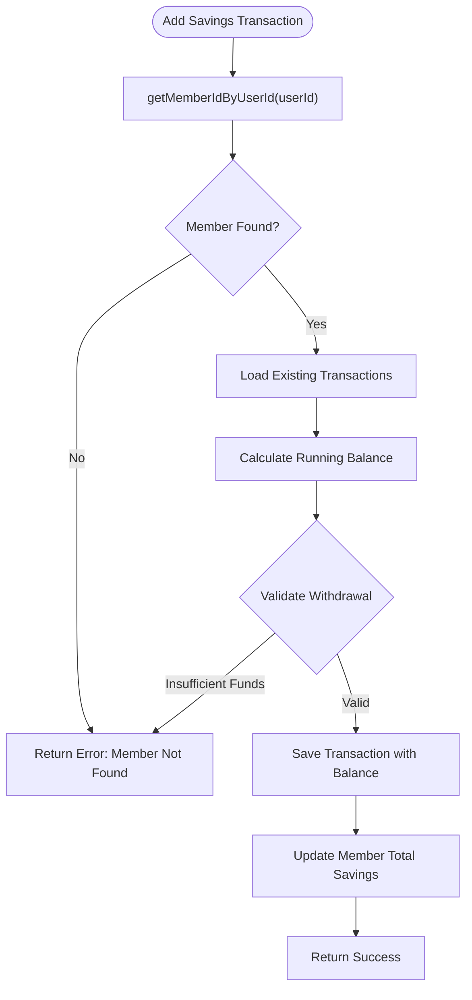
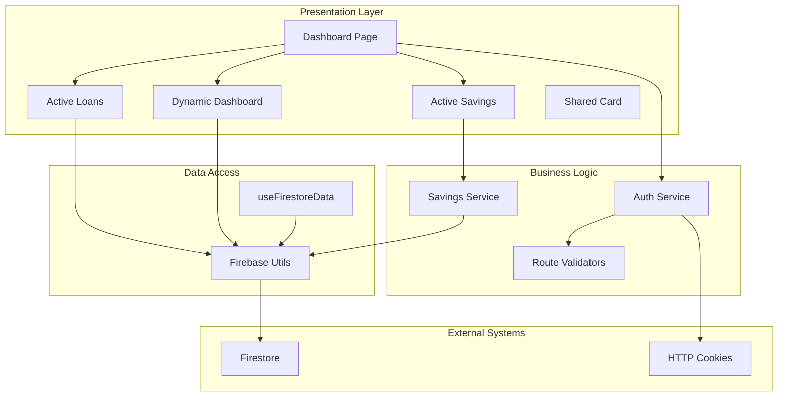

# Member Dashboard Interface

<cite>
**Referenced Files in This Document**
- [app/dashboard/page.tsx](file://app/dashboard/page.tsx)
- [components/user/DynamicDashboard.tsx](file://components/user/DynamicDashboard.tsx)
- [components/user/ActiveLoans.tsx](file://components/user/ActiveLoans.tsx)
- [components/user/ActiveSavings.tsx](file://components/user/ActiveSavings.tsx)
- [components/shared/Card.tsx](file://components/shared/Card.tsx)
- [lib/savingsService.ts](file://lib/savingsService.ts)
- [lib/firebase.ts](file://lib/firebase.ts)
- [lib/auth.tsx](file://lib/auth.tsx)
- [hooks/useFirestoreData.ts](file://hooks/useFirestoreData.ts)
- [lib/types/savings.ts](file://lib/types/savings.ts)
- [middleware.ts](file://middleware.ts)
- [app/layout.tsx](file://app/layout.tsx)
</cite>

## Table of Contents
1. [Introduction](#introduction)
2. [Project Structure](#project-structure)
3. [Core Components](#core-components)
4. [Architecture Overview](#architecture-overview)
5. [Detailed Component Analysis](#detailed-component-analysis)
6. [Dependency Analysis](#dependency-analysis)
7. [Performance Considerations](#performance-considerations)
8. [Troubleshooting Guide](#troubleshooting-guide)
9. [Conclusion](#conclusion)

## Introduction
This document provides comprehensive documentation for the Member Dashboard interface that delivers personalized financial information to cooperative members. The dashboard dynamically adapts content based on member account status and loan eligibility, displaying active loans with payment schedules and due dates, and showcasing active savings accounts with balances, transaction history, and contribution summaries. It integrates real-time data synchronization from Firestore collections, supports member-specific navigation and quick-access features, and implements responsive design patterns for mobile-friendly access. The documentation also covers customization examples, data privacy considerations, and secure information display patterns.

## Project Structure
The Member Dashboard is built as a Next.js application with a modular component architecture. Key areas include:
- Dashboard page orchestrating member-specific content
- Dynamic dashboard wrapper for role-aware content
- Financial components for loans and savings
- Shared UI components and services for data access
- Authentication and middleware for role-based routing
- Real-time Firestore integration utilities

**Diagram sources**
- [app/layout.tsx](file://app/layout.tsx#L22-L37)
- [middleware.ts](file://middleware.ts#L5-L62)
- [app/dashboard/page.tsx](file://app/dashboard/page.tsx#L11-L312)
- [components/user/DynamicDashboard.tsx](file://components/user/DynamicDashboard.tsx#L36-L149)
- [components/user/ActiveLoans.tsx](file://components/user/ActiveLoans.tsx#L19-L177)
- [components/user/ActiveSavings.tsx](file://components/user/ActiveSavings.tsx#L16-L270)
- [lib/firebase.ts](file://lib/firebase.ts#L89-L309)
- [lib/savingsService.ts](file://lib/savingsService.ts#L21-L135)

**Section sources**
- [app/dashboard/page.tsx](file://app/dashboard/page.tsx#L1-L312)
- [components/user/DynamicDashboard.tsx](file://components/user/DynamicDashboard.tsx#L1-L149)
- [components/user/ActiveLoans.tsx](file://components/user/ActiveLoans.tsx#L1-L177)
- [components/user/ActiveSavings.tsx](file://components/user/ActiveSavings.tsx#L1-L270)
- [lib/firebase.ts](file://lib/firebase.ts#L1-L309)
- [lib/savingsService.ts](file://lib/savingsService.ts#L1-L455)
- [middleware.ts](file://middleware.ts#L1-L62)
- [app/layout.tsx](file://app/layout.tsx#L1-L37)

## Core Components
This section outlines the primary building blocks of the Member Dashboard and their responsibilities.

- Dashboard Page
  - Orchestrates member-specific content, including savings summary, notifications, and role-aware sections
  - Integrates with authentication to ensure only members access the dashboard
  - Implements real-time savings aggregation and notification checks

- Dynamic Dashboard Wrapper
  - Provides role-aware reminders and events for all users
  - Filters content by user role and status
  - Sorts and renders upcoming reminders and events

- Active Loans Component
  - Displays current active loans with principal, term, interest rate, and start date
  - Shows payment schedule details including monthly payment and next payment date
  - Handles loading states, errors, and retry mechanisms

- Active Savings Component
  - Renders recent savings transactions with type, amount, and running balance
  - Supports both compact and detailed views for dashboard integration
  - Implements automatic refresh on visibility change and manual refresh controls

- Savings Service
  - Links user IDs to member records across multiple lookup strategies
  - Manages atomic savings transactions with balance calculations
  - Provides cached and calculated balance retrieval

**Section sources**
- [app/dashboard/page.tsx](file://app/dashboard/page.tsx#L11-L312)
- [components/user/DynamicDashboard.tsx](file://components/user/DynamicDashboard.tsx#L36-L149)
- [components/user/ActiveLoans.tsx](file://components/user/ActiveLoans.tsx#L19-L177)
- [components/user/ActiveSavings.tsx](file://components/user/ActiveSavings.tsx#L16-L270)
- [lib/savingsService.ts](file://lib/savingsService.ts#L21-L135)

## Architecture Overview
The Member Dashboard follows a client-side rendered Next.js architecture with real-time Firestore integration. The system enforces role-based access control through middleware and authentication providers, ensuring members only access their designated dashboard. Data flows from Firestore collections through service utilities and hooks to UI components, with caching and fallback strategies for reliability.

**Diagram sources**
- [middleware.ts](file://middleware.ts#L5-L62)
- [lib/auth.tsx](file://lib/auth.tsx#L158-L682)
- [app/dashboard/page.tsx](file://app/dashboard/page.tsx#L37-L125)
- [lib/firebase.ts](file://lib/firebase.ts#L149-L240)

## Detailed Component Analysis

### Dashboard Page: Member-Specific Content Orchestration
The dashboard page serves as the central hub for member financial information. It performs role validation, fetches savings data, manages notifications, and renders role-aware sections.

Key capabilities:
- Role validation ensuring only members access the dashboard
- Savings data aggregation from member subcollections and main collections
- Notification bell with unread status indicators
- Conditional rendering of member-specific components

**Diagram sources**
- [app/dashboard/page.tsx](file://app/dashboard/page.tsx#L11-L125)

**Section sources**
- [app/dashboard/page.tsx](file://app/dashboard/page.tsx#L11-L312)

### Dynamic Dashboard Wrapper: Role-Aware Content Delivery
The dynamic dashboard wrapper provides a flexible container for role-specific content, handling reminders and events with filtering and sorting logic.

Implementation highlights:
- Real-time fetching of reminders and events from Firestore
- Role-based filtering supporting 'all' and specific roles
- Status filtering for active/published content
- Priority and due date sorting for reminders
- Upcoming event filtering based on current date

**Diagram sources**
- [components/user/DynamicDashboard.tsx](file://components/user/DynamicDashboard.tsx#L36-L149)

**Section sources**
- [components/user/DynamicDashboard.tsx](file://components/user/DynamicDashboard.tsx#L36-L149)

### Active Loans Component: Current Loan Balances and Schedules
The active loans component displays member's current loan portfolio with detailed payment information and schedule summaries.

Core functionality:
- Real-time query of active loans filtered by user ID
- Currency and date formatting for Philippine Peso and local formats
- Payment schedule calculation and display
- Comprehensive error handling and retry mechanisms

**Diagram sources**
- [components/user/ActiveLoans.tsx](file://components/user/ActiveLoans.tsx#L31-L72)
- [lib/firebase.ts](file://lib/firebase.ts#L184-L240)

**Section sources**
- [components/user/ActiveLoans.tsx](file://components/user/ActiveLoans.tsx#L19-L177)

### Active Savings Component: Transaction History and Balances
The active savings component provides comprehensive savings account information with real-time updates and refresh capabilities.

Features:
- Integration with savings service for member linking and balance calculation
- Automatic refresh on tab visibility change
- Compact and detailed view modes for different contexts
- Recent transaction table with type badges and amount formatting

**Diagram sources**
- [components/user/ActiveSavings.tsx](file://components/user/ActiveSavings.tsx#L22-L82)
- [lib/savingsService.ts](file://lib/savingsService.ts#L347-L377)

**Section sources**
- [components/user/ActiveSavings.tsx](file://components/user/ActiveSavings.tsx#L16-L270)
- [lib/savingsService.ts](file://lib/savingsService.ts#L347-L422)

### Savings Service: Member Linking and Atomic Transactions
The savings service implements robust member-to-user linking and atomic transaction processing with balance validation.

Key processes:
- Multi-strategy member ID resolution from user ID
- Atomic transaction creation with running balance calculation
- Member document aggregation updates with fallback calculations
- Comprehensive error handling and logging

**Diagram sources**
- [lib/savingsService.ts](file://lib/savingsService.ts#L237-L342)

**Section sources**
- [lib/savingsService.ts](file://lib/savingsService.ts#L21-L455)
- [lib/types/savings.ts](file://lib/types/savings.ts#L1-L20)

### Real-Time Data Synchronization: Firestore Integration
The application leverages Firestore for real-time data synchronization through custom hooks and utility functions.

Integration patterns:
- Real-time listeners with client-side sorting for performance
- Query-based data fetching with comprehensive error handling
- Utility functions for document CRUD operations with validation
- Index-free queries using client-side sorting where possible

**Section sources**
- [hooks/useFirestoreData.ts](file://hooks/useFirestoreData.ts#L19-L151)
- [lib/firebase.ts](file://lib/firebase.ts#L89-L309)

## Dependency Analysis
The Member Dashboard exhibits strong separation of concerns with clear dependency relationships:

**Diagram sources**
- [app/dashboard/page.tsx](file://app/dashboard/page.tsx#L3-L10)
- [components/user/DynamicDashboard.tsx](file://components/user/DynamicDashboard.tsx#L3-L6)
- [components/user/ActiveLoans.tsx](file://components/user/ActiveLoans.tsx#L3-L6)
- [components/user/ActiveSavings.tsx](file://components/user/ActiveSavings.tsx#L3-L10)
- [lib/auth.tsx](file://lib/auth.tsx#L158-L682)
- [lib/savingsService.ts](file://lib/savingsService.ts#L1-L455)
- [hooks/useFirestoreData.ts](file://hooks/useFirestoreData.ts#L1-L182)
- [lib/firebase.ts](file://lib/firebase.ts#L1-L309)

**Section sources**
- [lib/auth.tsx](file://lib/auth.tsx#L111-L156)
- [middleware.ts](file://middleware.ts#L47-L55)
- [app/dashboard/page.tsx](file://app/dashboard/page.tsx#L11-L312)

## Performance Considerations
The dashboard implements several performance optimizations:

- Real-time listeners with client-side sorting to avoid composite index requirements
- Automatic refresh on tab visibility change to keep data fresh without constant polling
- Caching strategies through member document aggregations for savings totals
- Efficient query patterns with role-based filtering to minimize data transfer
- Responsive design patterns ensuring optimal mobile performance

## Troubleshooting Guide
Common issues and resolutions:

### Authentication and Authorization
- Verify user role cookies are properly set after login
- Check middleware route validation for unauthorized access attempts
- Ensure role-based redirection occurs correctly after authentication

### Data Loading Issues
- Monitor Firestore query results for permission-denied errors
- Verify member-user linking resolves correctly for savings data
- Check real-time listener initialization and error handling

### Component Rendering Problems
- Confirm authentication context availability in components
- Validate Firestore connection status and configuration
- Review error boundaries and fallback UI states

**Section sources**
- [lib/auth.tsx](file://lib/auth.tsx#L197-L348)
- [lib/firebase.ts](file://lib/firebase.ts#L62-L87)
- [components/user/ActiveSavings.tsx](file://components/user/ActiveSavings.tsx#L42-L50)

## Conclusion
The Member Dashboard provides a robust, real-time financial interface tailored to cooperative members. Through role-based access control, dynamic content adaptation, and seamless Firestore integration, it delivers personalized financial insights with responsive design and comprehensive error handling. The modular architecture supports easy customization and extension for additional financial summaries and member services while maintaining strong data privacy and security practices.