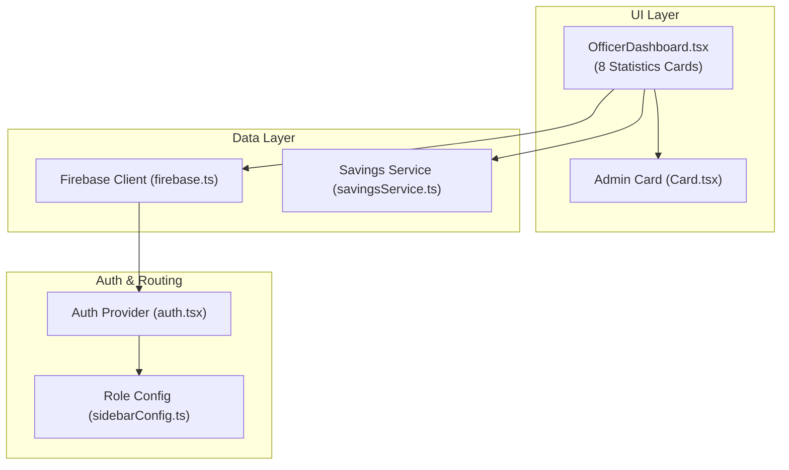
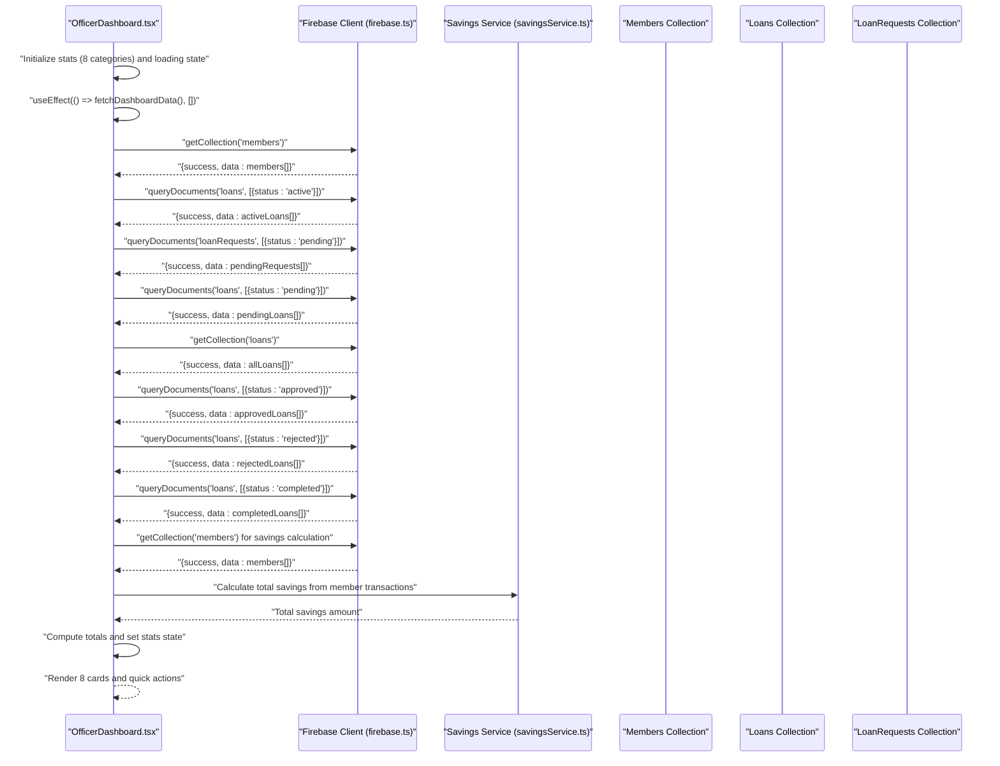
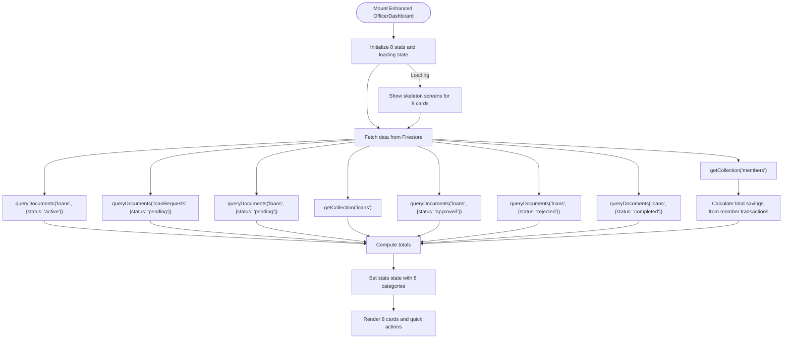
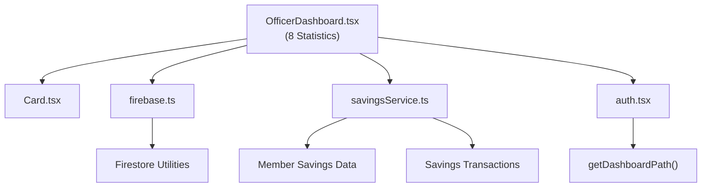

# Officer Dashboard Implementation

<cite>
**Referenced Files in This Document**
- [OfficerDashboard.tsx](file://components/admin/OfficerDashboard.tsx)
- [Card.tsx](file://components/admin/Card.tsx)
- [firebase.ts](file://lib/firebase.ts)
- [savingsService.ts](file://lib/savingsService.ts)
- [auth.tsx](file://lib/auth.tsx)
- [sidebarConfig.ts](file://lib/sidebarConfig.ts)
- [DynamicDashboard.tsx](file://components/user/DynamicDashboard.tsx)
- [layout.tsx](file://app/layout.tsx)
- [dashboard/layout.tsx](file://app/dashboard/layout.tsx)
</cite>

## Update Summary
**Changes Made**
- Enhanced dashboard with comprehensive financial statistics including total savings, total loans, and loan status breakdowns
- Added four new statistics cards: Total Loans, Approved Loans, Rejected Loans, and Completed Loans
- Implemented sophisticated savings monitoring with total savings calculation across all members
- Expanded grid layout from 3 to 8 cards for detailed operational insights
- Improved error handling and data validation for all new statistical categories

## Table of Contents
1. [Introduction](#introduction)
2. [Project Structure](#project-structure)
3. [Core Components](#core-components)
4. [Architecture Overview](#architecture-overview)
5. [Detailed Component Analysis](#detailed-component-analysis)
6. [Enhanced Statistics System](#enhanced-statistics-system)
7. [Comprehensive Savings Monitoring](#comprehensive-savings-monitoring)
8. [Dependency Analysis](#dependency-analysis)
9. [Performance Considerations](#performance-considerations)
10. [Troubleshooting Guide](#troubleshooting-guide)
11. [Conclusion](#conclusion)

## Introduction
This document explains the enhanced Officer Dashboard implementation within the SAMPA Cooperative Management Platform. The dashboard has been significantly expanded to provide comprehensive role-based statistics with eight distinct data cards covering total members, active loans, pending requests, total loans, approved/rejected/completed loan distributions, and total savings across the cooperative. The implementation leverages real-time Firestore data fetching, sophisticated error handling, and a responsive grid layout optimized for different screen sizes.

## Project Structure
The Officer Dashboard resides in the admin components and integrates with Firebase for data access, the authentication provider for role-aware routing, and shared UI components for consistent presentation. The enhanced implementation now includes comprehensive financial monitoring capabilities.

**Diagram sources**
- [OfficerDashboard.tsx](file://components/admin/OfficerDashboard.tsx#L1-L377)
- [Card.tsx](file://components/admin/Card.tsx#L1-L35)
- [firebase.ts](file://lib/firebase.ts#L89-L309)
- [savingsService.ts](file://lib/savingsService.ts#L1-L489)
- [auth.tsx](file://lib/auth.tsx#L111-L156)
- [sidebarConfig.ts](file://lib/sidebarConfig.ts#L258-L262)

**Section sources**
- [OfficerDashboard.tsx](file://components/admin/OfficerDashboard.tsx#L1-L377)
- [Card.tsx](file://components/admin/Card.tsx#L1-L35)
- [firebase.ts](file://lib/firebase.ts#L89-L309)
- [savingsService.ts](file://lib/savingsService.ts#L1-L489)
- [auth.tsx](file://lib/auth.tsx#L111-L156)
- [sidebarConfig.ts](file://lib/sidebarConfig.ts#L258-L262)

## Core Components
- **OfficerDashboard**: Central dashboard component that loads and displays eight comprehensive statistics cards, recent activities, and quick actions
- **Admin Card (Card.tsx)**: Reusable card container for consistent styling and layout with enhanced grid system
- **Firebase Utilities**: Encapsulated Firestore operations for collections, queries, and document management
- **Savings Service**: Advanced savings transaction processing and balance calculation capabilities
- **Authentication Provider**: Role-aware user context and dashboard routing helpers
- **Role-based Sidebar Configuration**: Defines navigation and dashboard paths per role

Key responsibilities:
- Real-time statistics aggregation from Firestore collections including comprehensive loan status tracking
- Sophisticated savings monitoring with total savings calculation across all cooperative members
- Enhanced error handling and graceful degradation for all statistical categories
- Eight-card statistics display pattern with user count, active loan tracking, pending requests, loan distributions, and total savings
- Quick action buttons for member records, loan requests, savings records, and membership management
- Responsive grid layout using Tailwind CSS for desktop and mobile optimization

**Section sources**
- [OfficerDashboard.tsx](file://components/admin/OfficerDashboard.tsx#L8-L377)
- [Card.tsx](file://components/admin/Card.tsx#L14-L34)
- [firebase.ts](file://lib/firebase.ts#L148-L309)
- [savingsService.ts](file://lib/savingsService.ts#L237-L371)
- [auth.tsx](file://lib/auth.tsx#L111-L156)

## Architecture Overview
The enhanced Officer Dashboard follows a comprehensive unidirectional data flow with sophisticated error handling and real-time monitoring capabilities:

- On mount, the component initializes state for eight distinct statistical categories and triggers asynchronous data fetch
- Data is retrieved from Firestore using utility functions that wrap getCollection and queryDocuments for comprehensive coverage
- Statistics are computed including loan status distributions and total savings calculations
- Enhanced error handling ensures graceful degradation with default values for all categories
- Quick action buttons navigate to relevant sections with improved accessibility

**Diagram sources**
- [OfficerDashboard.tsx](file://components/admin/OfficerDashboard.tsx#L33-L155)
- [firebase.ts](file://lib/firebase.ts#L148-L309)
- [savingsService.ts](file://lib/savingsService.ts#L416-L456)

## Detailed Component Analysis

### Enhanced OfficerDashboard Component
**Updated** The component now manages eight distinct statistical categories with comprehensive error handling and responsive design.

Responsibilities:
- Aggregates eight comprehensive dashboard statistics from Firestore collections
- Uses useEffect for initial data loading with enhanced error handling
- Implements skeleton loading screens for all eight card categories
- Renders eight statistic cards with detailed financial insights
- Provides quick action buttons for member records, loan requests, savings records, and membership management
- Applies responsive grid layout using Tailwind CSS for optimal desktop and mobile experience

Implementation highlights:
- State initialization for eight statistical categories: totalMembers, activeLoans, loanRequests, totalSavings, totalLoans, approvedLoans, rejectedLoans, completedLoans
- Asynchronous data fetching combining multiple Firestore queries for comprehensive coverage
- Enhanced computation of total loan requests by summing pending requests and pending loans
- Sophisticated total savings calculation by aggregating member savings across all cooperative members
- Comprehensive loan status distribution tracking (approved, rejected, completed)
- Enhanced skeleton rendering during loading phase with eight card layout
- Card-based layout with icons, descriptive labels, and currency formatting for savings
- Quick action buttons styled as cards with hover effects and responsive grid

**Diagram sources**
- [OfficerDashboard.tsx](file://components/admin/OfficerDashboard.tsx#L33-L155)

**Section sources**
- [OfficerDashboard.tsx](file://components/admin/OfficerDashboard.tsx#L19-L377)

### Enhanced Admin Card Component
**Updated** The card component continues to provide consistent styling for the expanded eight-card layout.

Responsibilities:
- Provides a consistent card layout with optional title and flexible content area
- Ensures uniform spacing, shadows, and rounded corners across all eight dashboard widgets
- Supports responsive grid layout for optimal display across screen sizes

Usage:
- Wrapped around each of the eight statistic cards and content areas within the enhanced dashboard

**Section sources**
- [Card.tsx](file://components/admin/Card.tsx#L14-L34)

### Enhanced Firebase Firestore Utilities
**Updated** The Firestore utilities continue to support the enhanced dashboard with comprehensive data access capabilities.

Responsibilities:
- Encapsulates Firestore operations for document retrieval, querying, and collection management
- Provides typed wrappers for getCollection and queryDocuments with enhanced error handling
- Centralizes error handling and logging for database operations across all statistical categories

Key functions used by the enhanced dashboard:
- getCollection: Retrieves all documents from specified collections including members, loans, and loanRequests
- queryDocuments: Executes filtered queries against collections with status-based filtering for comprehensive loan tracking

**Section sources**
- [firebase.ts](file://lib/firebase.ts#L148-L309)

### Savings Service Integration
**New** The enhanced dashboard now integrates with the savings service for comprehensive financial monitoring.

Responsibilities:
- Calculates total savings by aggregating member savings across all cooperative members
- Processes member savings data from Firestore collections
- Provides sophisticated balance calculation and transaction tracking
- Supports enhanced error handling for savings data retrieval

Integration:
- The dashboard uses savings calculation logic to compute total savings across all members
- Integrates with member document structure to access savings aggregates
- Provides fallback mechanisms for savings data calculation

**Section sources**
- [savingsService.ts](file://lib/savingsService.ts#L416-L456)

### Authentication and Role-Based Routing
**Updated** The authentication system continues to support the enhanced dashboard with comprehensive role awareness.

Responsibilities:
- Provides user context and role-aware navigation for all dashboard variants
- Offers a helper to determine the correct dashboard path based on role
- Supports enhanced role-based routing for executive and administrative dashboards

Integration:
- The dashboard receives the user's role and capitalizes it for display
- Role-based routing ensures users land on appropriate dashboards with enhanced functionality

**Section sources**
- [auth.tsx](file://lib/auth.tsx#L111-L156)

### Role-Based Sidebar Configuration
**Updated** The sidebar configuration continues to support the enhanced dashboard with comprehensive navigation.

Responsibilities:
- Defines navigation items and dashboard paths for each role with enhanced coverage
- Supports dynamic sidebar generation based on user role for all administrative positions
- Provides comprehensive navigation for executive, administrative, and operational dashboards

Integration:
- While the Officer Dashboard itself is role-specific, the configuration informs navigation and redirects for all roles
- Supports enhanced navigation for roles with expanded dashboard capabilities

**Section sources**
- [sidebarConfig.ts](file://lib/sidebarConfig.ts#L258-L262)

### DynamicDashboard Component (Context)
**Updated** The DynamicDashboard component continues to provide contextual data for other dashboard implementations.

Responsibilities:
- Provides a dynamic data layer for reminders and events with enhanced error handling
- Demonstrates how dashboard data can be extended with additional contextual information
- Supports comprehensive data fetching with role-based filtering

Note:
- The Officer Dashboard does not currently consume this component's data, but it illustrates patterns for extending dashboard functionality with contextual information.

**Section sources**
- [DynamicDashboard.tsx](file://components/user/DynamicDashboard.tsx#L36-L149)

## Enhanced Statistics System
**New** The enhanced dashboard now provides comprehensive statistical insights across eight distinct categories.

### Statistical Categories
The dashboard displays eight critical statistical categories:

1. **Total Members**: Registered members in the system
2. **Active Loans**: Currently active loan agreements
3. **Pending Requests**: Pending loan applications awaiting approval
4. **Total Loans**: Complete loan application history
5. **Approved Loans**: Approved loan applications
6. **Rejected Loans**: Rejected loan applications
7. **Completed Loans**: Completed loan agreements
8. **Total Savings**: Aggregate savings across all cooperative members

### Data Sources and Calculation Methods
Each statistical category utilizes specific Firestore collections and calculation methods:

- **Total Members**: Direct count from members collection
- **Active Loans**: Query filtering by status 'active'
- **Pending Requests**: Sum of pending loan requests and pending loans
- **Total Loans**: Complete count from loans collection
- **Approved/Rejected/Completed Loans**: Status-based filtering queries
- **Total Savings**: Aggregation across member savings with fallback calculations

### Error Handling and Data Validation
The enhanced system includes comprehensive error handling:
- Individual error handling for each statistical category
- Graceful degradation with default values when data retrieval fails
- Enhanced logging for debugging and monitoring
- Robust validation for all data sources and calculations

**Section sources**
- [OfficerDashboard.tsx](file://components/admin/OfficerDashboard.tsx#L8-L155)

## Comprehensive Savings Monitoring
**New** The enhanced dashboard provides sophisticated savings monitoring capabilities.

### Savings Calculation Methodology
The total savings calculation employs a two-tier approach:

1. **Primary Method**: Direct access to member savings aggregates stored in member documents
2. **Fallback Method**: Transaction-based calculation from member savings subcollections

### Savings Data Structure
The savings monitoring system processes:
- Member document savings aggregates (preferred method)
- Individual savings transactions per member
- Running balance calculations for accuracy
- Currency formatting for display consistency

### Integration with Member Management
The savings monitoring integrates seamlessly with:
- Member registration and profile management
- Savings transaction processing
- Financial reporting and analytics
- Compliance and audit trail maintenance

### Performance Optimization
The savings calculation includes:
- Efficient member data aggregation
- Minimal Firestore queries for savings data
- Cached savings values when available
- Optimized fallback calculation methods

**Section sources**
- [OfficerDashboard.tsx](file://components/admin/OfficerDashboard.tsx#L113-L124)
- [savingsService.ts](file://lib/savingsService.ts#L416-L456)

## Dependency Analysis
**Updated** The enhanced dashboard maintains its modular architecture while adding comprehensive financial monitoring capabilities.

The Officer Dashboard depends on:
- Firebase client utilities for comprehensive data access across eight statistical categories
- Admin Card component for consistent UI across eight dashboard widgets
- Savings Service for sophisticated financial calculations
- Authentication provider for role-aware behavior
- Tailwind CSS for responsive layout optimization

**Diagram sources**
- [OfficerDashboard.tsx](file://components/admin/OfficerDashboard.tsx#L1-L10)
- [Card.tsx](file://components/admin/Card.tsx#L1-L35)
- [firebase.ts](file://lib/firebase.ts#L89-L309)
- [savingsService.ts](file://lib/savingsService.ts#L1-L489)
- [auth.tsx](file://lib/auth.tsx#L111-L156)

**Section sources**
- [OfficerDashboard.tsx](file://components/admin/OfficerDashboard.tsx#L1-L10)
- [Card.tsx](file://components/admin/Card.tsx#L1-L35)
- [firebase.ts](file://lib/firebase.ts#L89-L309)
- [savingsService.ts](file://lib/savingsService.ts#L1-L489)
- [auth.tsx](file://lib/auth.tsx#L111-L156)

## Performance Considerations
**Updated** The enhanced dashboard implements several performance optimizations for the expanded statistical system.

- **Minimized Database Round-Trips**: The dashboard consolidates multiple queries into a single effect and computes totals locally across eight statistical categories
- **Client-Side Filtering**: For scenarios requiring filtered lists, leverage the useFirestoreData hook to apply client-side sorting and filtering efficiently
- **Enhanced Skeleton Rendering**: Use skeleton screens to maintain perceived performance while data loads across eight cards
- **Comprehensive Error Boundaries**: Provide default values and graceful degradation when queries fail for all eight statistical categories
- **Responsive Layout Optimization**: Tailwind CSS grid ensures optimal rendering across screen sizes without heavy JavaScript logic
- **Efficient Savings Calculations**: Optimized member data aggregation and fallback calculation methods minimize computational overhead
- **Graceful Degradation**: Enhanced error handling ensures dashboard functionality even when some data sources are unavailable

## Troubleshooting Guide
**Updated** Common issues and resolutions for the enhanced dashboard with eight statistical categories.

Common issues and resolutions:
- **Firestore Permission Denied**: Verify Firestore rules and user permissions for all eight collections (members, loans, loanRequests, savings). The utilities return specific error messages for PERMISSION_DENIED.
- **Invalid Query Parameters**: Ensure field names and operators are valid when using queryDocuments for loan status filtering.
- **Network Connectivity**: Implement retry logic and user feedback for transient failures affecting any of the eight data sources.
- **Role-Based Routing**: Confirm that getDashboardPath returns the correct path for the user's role with enhanced dashboard support.
- **Savings Calculation Errors**: Verify member document structure and savings data availability for accurate total savings calculation.
- **Performance Issues**: Monitor Firestore query performance and consider indexing strategies for frequently queried loan status fields.
- **Data Consistency**: Implement proper synchronization between member savings aggregates and transaction-based calculations.

**Section sources**
- [firebase.ts](file://lib/firebase.ts#L174-L179)
- [firebase.ts](file://lib/firebase.ts#L232-L238)
- [OfficerDashboard.tsx](file://components/admin/OfficerDashboard.tsx#L135-L151)

## Conclusion
The enhanced Officer Dashboard leverages comprehensive Firestore integration for real-time data aggregation across eight distinct statistical categories, presenting clean and responsive UI using Tailwind CSS with sophisticated financial monitoring capabilities. The modular design allows easy extension with additional statistics, charts, and quick actions tailored to officer responsibilities while maintaining robust error handling and performance optimization across all eight dashboard categories.