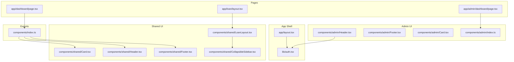
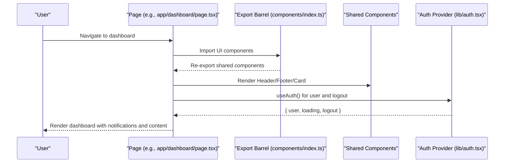
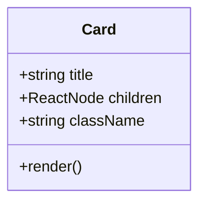
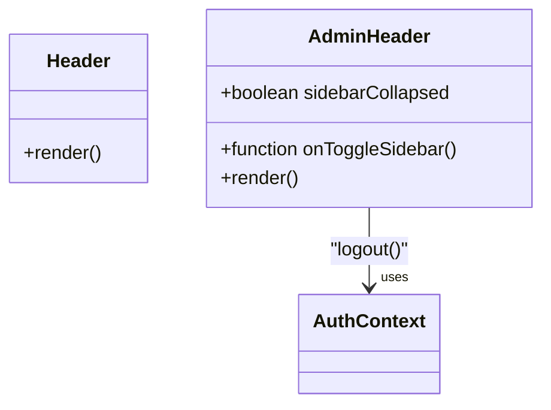
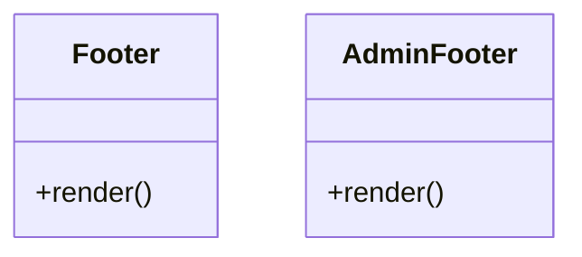
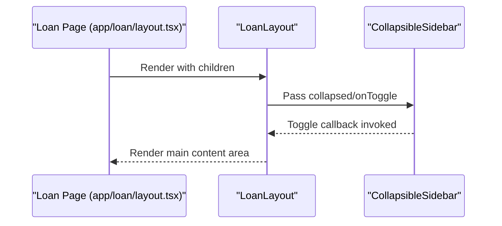
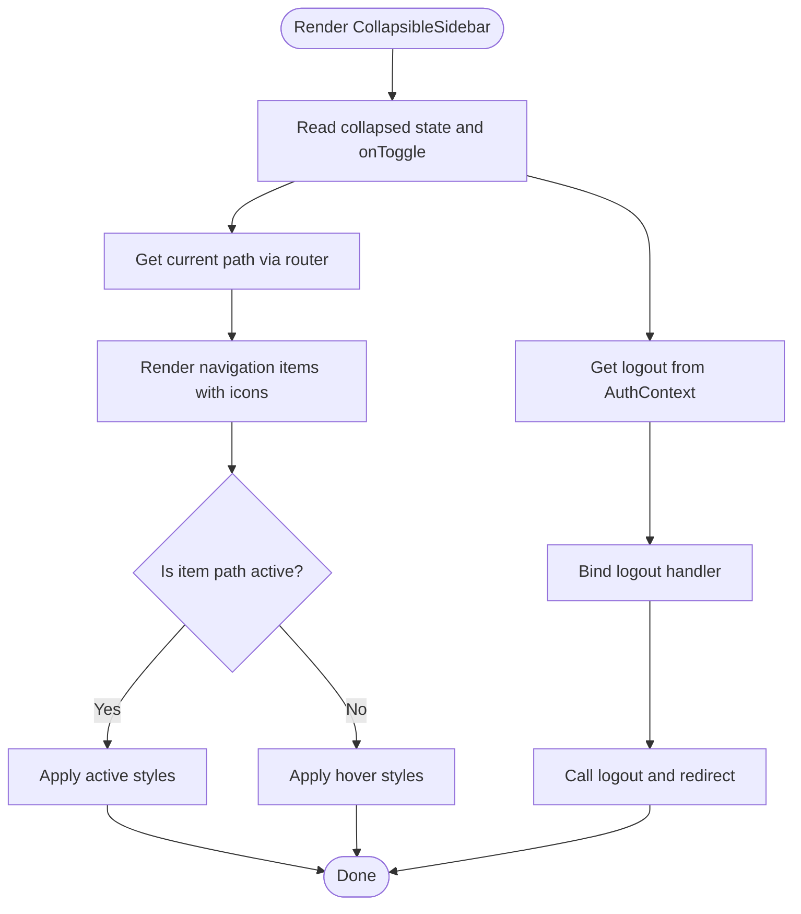
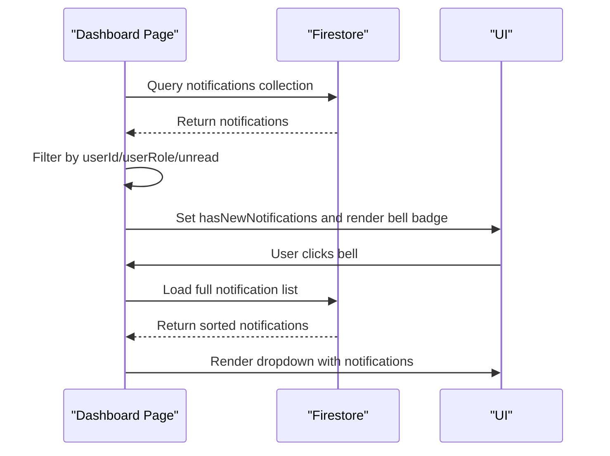
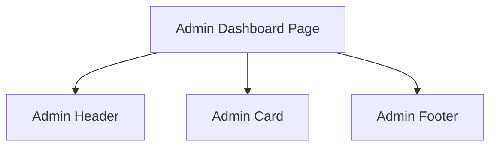
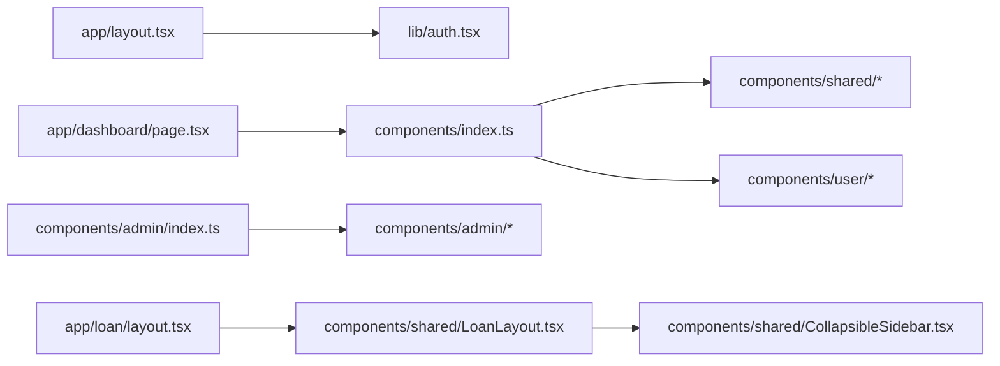

# Reusable Dashboard Components

<cite>
**Referenced Files in This Document**
- [Card.tsx](file://components/shared/Card.tsx)
- [Header.tsx](file://components/shared/Header.tsx)
- [Footer.tsx](file://components/shared/Footer.tsx)
- [LoanLayout.tsx](file://components/shared/LoanLayout.tsx)
- [CollapsibleSidebar.tsx](file://components/shared/CollapsibleSidebar.tsx)
- [Header.tsx (Admin)](file://components/admin/Header.tsx)
- [Footer.tsx (Admin)](file://components/admin/Footer.tsx)
- [Card.tsx (Admin)](file://components/admin/Card.tsx)
- [components/index.ts](file://components/index.ts)
- [components/admin/index.ts](file://components/admin/index.ts)
- [app/layout.tsx](file://app/layout.tsx)
- [lib/auth.tsx](file://lib/auth.tsx)
- [app/loan/layout.tsx](file://app/loan/layout.tsx)
- [app/dashboard/page.tsx](file://app/dashboard/page.tsx)
- [app/admin/dashboard/page.tsx](file://app/admin/dashboard/page.tsx)
</cite>

## Table of Contents
1. [Introduction](#introduction)
2. [Project Structure](#project-structure)
3. [Core Components](#core-components)
4. [Architecture Overview](#architecture-overview)
5. [Detailed Component Analysis](#detailed-component-analysis)
6. [Dependency Analysis](#dependency-analysis)
7. [Performance Considerations](#performance-considerations)
8. [Troubleshooting Guide](#troubleshooting-guide)
9. [Conclusion](#conclusion)
10. [Appendices](#appendices)

## Introduction
This document describes the reusable dashboard components that underpin the SAMPA Cooperative Management Platform’s user interface. It focuses on:
- Card component architecture for consistent data presentation
- Header component implementation with authentication display, notifications, and branding
- Footer component providing consistent site information and legal notices
- LoanLayout component that standardizes loan-related page layouts and navigation
- Composition patterns enabling consistent styling, responsiveness, and accessibility
- Prop interfaces and customization options
- Practical examples for extending components and maintaining design system consistency
- Performance optimization through memoization and efficient rendering strategies

## Project Structure
The dashboard system is organized around shared components and role-specific variants:
- Shared components live under components/shared and are used across roles
- Admin-specific components live under components/admin and are exported via components/admin/index.ts
- A central export barrel under components/index.ts aggregates commonly used UI elements
- Authentication and global providers are wired in app/layout.tsx
- Loan-related pages wrap content with LoanLayout via app/loan/layout.tsx

**Diagram sources**
- [app/layout.tsx](file://app/layout.tsx#L1-L37)
- [lib/auth.tsx](file://lib/auth.tsx#L158-L680)
- [components/index.ts](file://components/index.ts#L1-L14)
- [components/admin/index.ts](file://components/admin/index.ts#L1-L11)
- [components/shared/Card.tsx](file://components/shared/Card.tsx#L1-L16)
- [components/shared/Header.tsx](file://components/shared/Header.tsx#L1-L26)
- [components/shared/Footer.tsx](file://components/shared/Footer.tsx#L1-L9)
- [components/shared/LoanLayout.tsx](file://components/shared/LoanLayout.tsx#L1-L41)
- [components/shared/CollapsibleSidebar.tsx](file://components/shared/CollapsibleSidebar.tsx#L1-L156)
- [components/admin/Header.tsx](file://components/admin/Header.tsx#L1-L105)
- [components/admin/Footer.tsx](file://components/admin/Footer.tsx#L1-L23)
- [components/admin/Card.tsx](file://components/admin/Card.tsx#L1-L35)
- [app/dashboard/page.tsx](file://app/dashboard/page.tsx#L1-L312)
- [app/loan/layout.tsx](file://app/loan/layout.tsx#L1-L9)
- [app/admin/dashboard/page.tsx](file://app/admin/dashboard/page.tsx#L1-L799)

**Section sources**
- [components/index.ts](file://components/index.ts#L1-L14)
- [components/admin/index.ts](file://components/admin/index.ts#L1-L11)
- [app/layout.tsx](file://app/layout.tsx#L1-L37)

## Core Components
This section documents the primary reusable components and their props, styling, and composition patterns.

- Card (shared)
  - Purpose: Present grouped content with a consistent header and padding
  - Props:
    - title: string
    - children: React.ReactNode
    - className?: string
  - Behavior: Renders a white card with rounded corners, shadow, and hover elevation; title is displayed as a bold heading
  - Customization: Accepts additional CSS classes for tailwind-based overrides

- Header (shared)
  - Purpose: Top navigation bar with branding and desktop navigation
  - Props: None (static)
  - Behavior: Fixed red header with logo link, desktop nav links, and a mobile menu icon
  - Notes: Intended for general dashboards; admin panels use a variant with authentication and dropdown

- Footer (shared)
  - Purpose: Fixed bottom bar with copyright
  - Props: None (static)
  - Behavior: Blue footer with centered copyright text and current year

- LoanLayout
  - Purpose: Loan-focused page container with collapsible sidebar and main content area
  - Props:
    - children: React.ReactNode
  - Behavior: Flex layout with a collapsible sidebar and scrollable main content; manages collapse state internally
  - Integration: Used by wrapping loan-related pages via app/loan/layout.tsx

- CollapsibleSidebar
  - Purpose: Navigation sidebar with icons, active highlighting, and logout
  - Props:
    - collapsed: boolean
    - onToggle: () => void
  - Behavior: Toggles width between compact and expanded; highlights active page based on path; provides logout action

- Admin Header
  - Purpose: Admin panel top bar with sidebar toggle and user dropdown
  - Props:
    - sidebarCollapsed: boolean
    - onToggleSidebar: () => void
  - Behavior: Uses AuthContext to access user and logout; shows user initials avatar and dropdown with logout

- Admin Footer
  - Purpose: Admin panel footer with copyright and version
  - Props: None (static)
  - Behavior: Blue footer with centered text

- Admin Card
  - Purpose: Admin-specific card with optional title bar
  - Props:
    - title?: string
    - children: React.ReactNode
    - className?: string
  - Behavior: Optional title bar with border; content area with padding; lighter shadow than shared variant

**Section sources**
- [components/shared/Card.tsx](file://components/shared/Card.tsx#L1-L16)
- [components/shared/Header.tsx](file://components/shared/Header.tsx#L1-L26)
- [components/shared/Footer.tsx](file://components/shared/Footer.tsx#L1-L9)
- [components/shared/LoanLayout.tsx](file://components/shared/LoanLayout.tsx#L1-L41)
- [components/shared/CollapsibleSidebar.tsx](file://components/shared/CollapsibleSidebar.tsx#L1-L156)
- [components/admin/Header.tsx](file://components/admin/Header.tsx#L1-L105)
- [components/admin/Footer.tsx](file://components/admin/Footer.tsx#L1-L23)
- [components/admin/Card.tsx](file://components/admin/Card.tsx#L1-L35)

## Architecture Overview
The dashboard architecture combines shared components with role-specific variants and a global authentication provider. Pages import shared layouts and pass children to standardize content areas. Admin pages use admin-specific headers and footers.

**Diagram sources**
- [app/dashboard/page.tsx](file://app/dashboard/page.tsx#L1-L312)
- [components/index.ts](file://components/index.ts#L1-L14)
- [lib/auth.tsx](file://lib/auth.tsx#L158-L680)

**Section sources**
- [app/dashboard/page.tsx](file://app/dashboard/page.tsx#L1-L312)
- [components/index.ts](file://components/index.ts#L1-L14)
- [lib/auth.tsx](file://lib/auth.tsx#L158-L680)

## Detailed Component Analysis

### Card Component Architecture
The Card component provides a consistent presentation pattern across the platform. It supports:
- A title bar for semantic grouping
- A flexible children slot for arbitrary content
- Tailwind-based styling with hover effects and transitions
- Extensibility via className

**Diagram sources**
- [components/shared/Card.tsx](file://components/shared/Card.tsx#L3-L16)

**Section sources**
- [components/shared/Card.tsx](file://components/shared/Card.tsx#L1-L16)

### Header Component Implementation
The shared Header offers a fixed top navigation bar with branding and desktop navigation. It is intended for general dashboards. Admin panels use a separate Admin Header that integrates with authentication and provides a user dropdown.

**Diagram sources**
- [components/shared/Header.tsx](file://components/shared/Header.tsx#L1-L26)
- [components/admin/Header.tsx](file://components/admin/Header.tsx#L1-L105)
- [lib/auth.tsx](file://lib/auth.tsx#L675-L680)

**Section sources**
- [components/shared/Header.tsx](file://components/shared/Header.tsx#L1-L26)
- [components/admin/Header.tsx](file://components/admin/Header.tsx#L1-L105)
- [lib/auth.tsx](file://lib/auth.tsx#L675-L680)

### Footer Component
The Footer component ensures consistent branding and legal notices at the bottom of pages. Two variants exist:
- Shared Footer for general dashboards
- Admin Footer for admin panels

**Diagram sources**
- [components/shared/Footer.tsx](file://components/shared/Footer.tsx#L1-L9)
- [components/admin/Footer.tsx](file://components/admin/Footer.tsx#L1-L23)

**Section sources**
- [components/shared/Footer.tsx](file://components/shared/Footer.tsx#L1-L9)
- [components/admin/Footer.tsx](file://components/admin/Footer.tsx#L1-L23)

### LoanLayout Component
LoanLayout standardizes loan-related page layouts with a collapsible sidebar and a scrollable main content area. It manages its own internal state for sidebar collapse and delegates navigation to CollapsibleSidebar.

**Diagram sources**
- [app/loan/layout.tsx](file://app/loan/layout.tsx#L1-L9)
- [components/shared/LoanLayout.tsx](file://components/shared/LoanLayout.tsx#L1-L41)
- [components/shared/CollapsibleSidebar.tsx](file://components/shared/CollapsibleSidebar.tsx#L1-L156)

**Section sources**
- [app/loan/layout.tsx](file://app/loan/layout.tsx#L1-L9)
- [components/shared/LoanLayout.tsx](file://components/shared/LoanLayout.tsx#L1-L41)
- [components/shared/CollapsibleSidebar.tsx](file://components/shared/CollapsibleSidebar.tsx#L1-L156)

### CollapsibleSidebar Component
CollapsibleSidebar provides navigation with icons, active highlighting, and a logout button. It integrates with authentication and routing to manage user sessions and highlight the active page.

**Diagram sources**
- [components/shared/CollapsibleSidebar.tsx](file://components/shared/CollapsibleSidebar.tsx#L74-L156)
- [lib/auth.tsx](file://lib/auth.tsx#L621-L635)

**Section sources**
- [components/shared/CollapsibleSidebar.tsx](file://components/shared/CollapsibleSidebar.tsx#L1-L156)
- [lib/auth.tsx](file://lib/auth.tsx#L621-L635)

### Notification System Integration
The dashboard page demonstrates a notification system integrated with Firestore. It checks for unread notifications, displays a bell icon with a badge, and renders a dropdown list of notifications.

**Diagram sources**
- [app/dashboard/page.tsx](file://app/dashboard/page.tsx#L134-L190)

**Section sources**
- [app/dashboard/page.tsx](file://app/dashboard/page.tsx#L1-L312)

### Admin Dashboard Composition Pattern
The admin dashboard composes multiple shared and admin-specific components to present metrics, charts, and leaderboards. It leverages the admin header/footer and admin card for consistent styling.

**Diagram sources**
- [app/admin/dashboard/page.tsx](file://app/admin/dashboard/page.tsx#L1-L799)
- [components/admin/Header.tsx](file://components/admin/Header.tsx#L1-L105)
- [components/admin/Card.tsx](file://components/admin/Card.tsx#L1-L35)
- [components/admin/Footer.tsx](file://components/admin/Footer.tsx#L1-L23)

**Section sources**
- [app/admin/dashboard/page.tsx](file://app/admin/dashboard/page.tsx#L1-L799)
- [components/admin/Header.tsx](file://components/admin/Header.tsx#L1-L105)
- [components/admin/Card.tsx](file://components/admin/Card.tsx#L1-L35)
- [components/admin/Footer.tsx](file://components/admin/Footer.tsx#L1-L23)

## Dependency Analysis
The dashboard relies on a global authentication provider and a centralized export barrel to maintain consistency across components.

**Diagram sources**
- [app/layout.tsx](file://app/layout.tsx#L1-L37)
- [lib/auth.tsx](file://lib/auth.tsx#L158-L680)
- [components/index.ts](file://components/index.ts#L1-L14)
- [components/admin/index.ts](file://components/admin/index.ts#L1-L11)
- [app/dashboard/page.tsx](file://app/dashboard/page.tsx#L1-L312)
- [app/loan/layout.tsx](file://app/loan/layout.tsx#L1-L9)
- [components/shared/LoanLayout.tsx](file://components/shared/LoanLayout.tsx#L1-L41)
- [components/shared/CollapsibleSidebar.tsx](file://components/shared/CollapsibleSidebar.tsx#L1-L156)

**Section sources**
- [app/layout.tsx](file://app/layout.tsx#L1-L37)
- [components/index.ts](file://components/index.ts#L1-L14)
- [components/admin/index.ts](file://components/admin/index.ts#L1-L11)
- [app/dashboard/page.tsx](file://app/dashboard/page.tsx#L1-L312)
- [app/loan/layout.tsx](file://app/loan/layout.tsx#L1-L9)

## Performance Considerations
- Prefer memoization for expensive computations in pages (e.g., sorting and filtering notifications)
- Use shallow comparisons for props to avoid unnecessary re-renders
- Lazy-load heavy visualizations (charts) only when their containers are visible
- Defer non-critical data fetching until after hydration
- Keep component state minimal; lift state to parent components when multiple siblings depend on it
- Use CSS transitions judiciously; disable animations for low-power devices if needed

[No sources needed since this section provides general guidance]

## Troubleshooting Guide
- Authentication state not persisting
  - Verify cookies are being set and readable client-side
  - Confirm AuthProvider wraps the application shell
- Sidebar not toggling
  - Ensure LoanLayout passes collapsed and onToggle to CollapsibleSidebar
  - Check that pathname matches navigation item paths for active highlighting
- Notifications not appearing
  - Confirm Firestore collections exist and are queryable
  - Validate filtering logic against userId/userRole/status fields

**Section sources**
- [lib/auth.tsx](file://lib/auth.tsx#L158-L680)
- [components/shared/LoanLayout.tsx](file://components/shared/LoanLayout.tsx#L18-L41)
- [components/shared/CollapsibleSidebar.tsx](file://components/shared/CollapsibleSidebar.tsx#L81-L156)
- [app/dashboard/page.tsx](file://app/dashboard/page.tsx#L134-L190)

## Conclusion
The reusable dashboard components establish a consistent, accessible, and responsive foundation for the SAMPA Cooperative Management Platform. By leveraging shared components, role-specific variants, and a centralized authentication provider, the system achieves design system consistency while enabling efficient development and maintenance.

[No sources needed since this section summarizes without analyzing specific files]

## Appendices

### Prop Interfaces Summary
- Card (shared)
  - title: string
  - children: React.ReactNode
  - className?: string
- LoanLayout
  - children: React.ReactNode
- CollapsibleSidebar
  - collapsed: boolean
  - onToggle: () => void
- Admin Header
  - sidebarCollapsed: boolean
  - onToggleSidebar: () => void

**Section sources**
- [components/shared/Card.tsx](file://components/shared/Card.tsx#L3-L7)
- [components/shared/LoanLayout.tsx](file://components/shared/LoanLayout.tsx#L18-L22)
- [components/shared/CollapsibleSidebar.tsx](file://components/shared/CollapsibleSidebar.tsx#L74-L80)
- [components/admin/Header.tsx](file://components/admin/Header.tsx#L37-L43)

### Practical Extension Examples
- Extend Card for specialized sections:
  - Add optional actions or metadata slots via additional props
  - Provide theme variants (e.g., elevated vs. flat) via className
- Create a new reusable component:
  - Define a clear contract for props and children
  - Export from components/index.ts for centralized access
  - Test with Storybook or isolated unit tests
- Maintain design system consistency:
  - Use a single palette and spacing scale
  - Enforce naming conventions for className tokens
  - Document component APIs and usage guidelines

[No sources needed since this section provides general guidance]