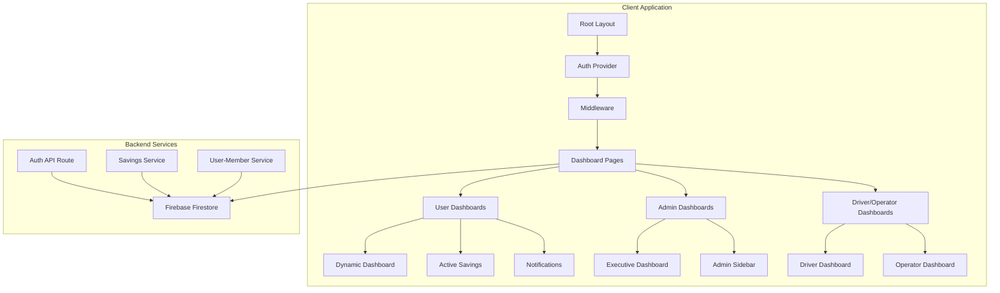
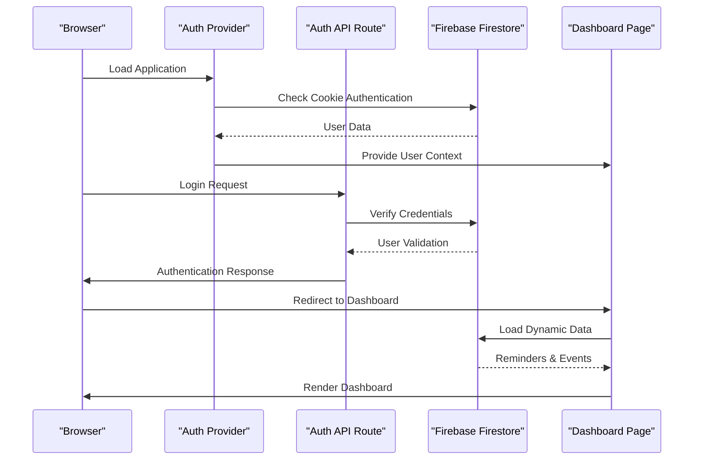
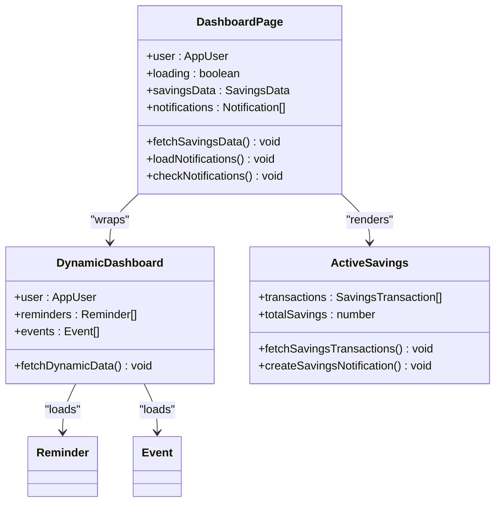
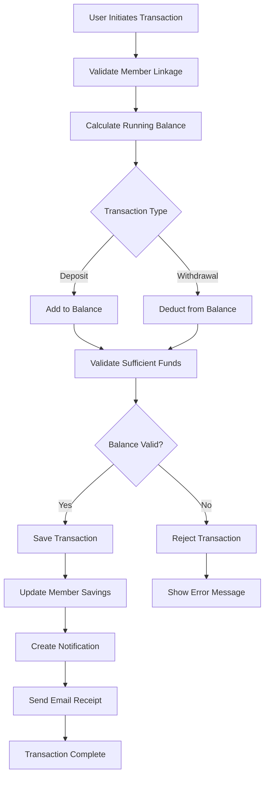
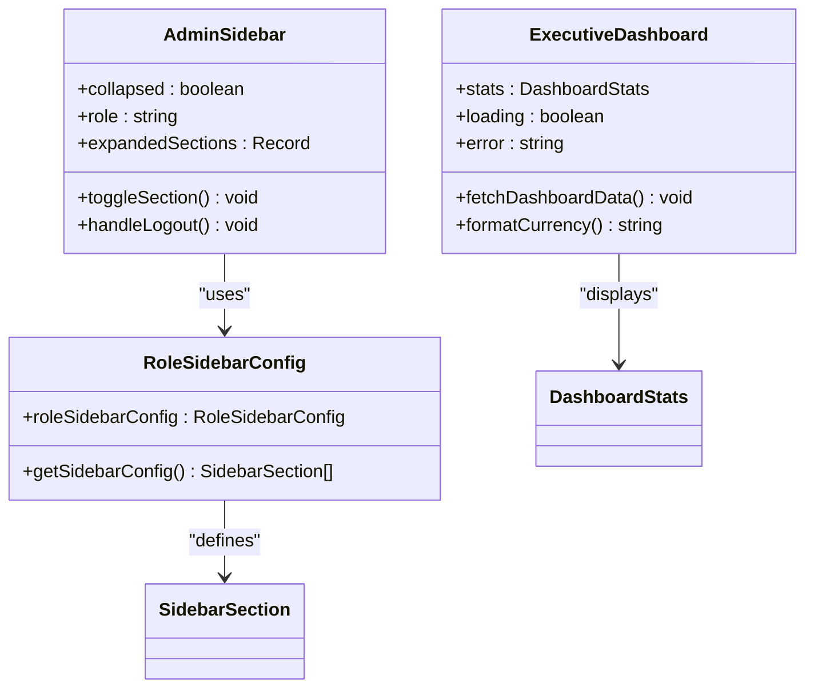
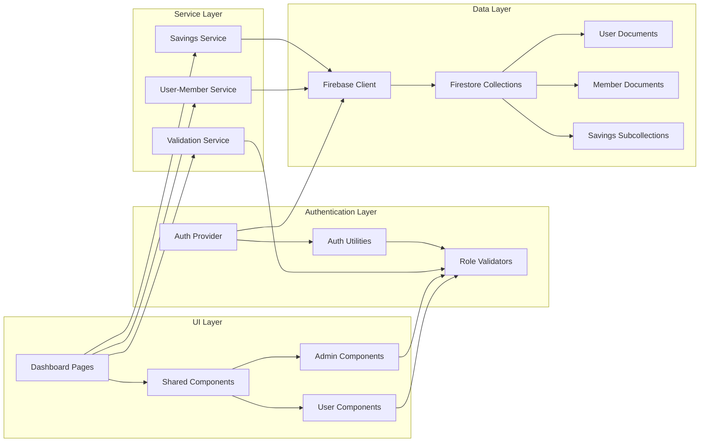

# Dashboard System

<cite>
**Referenced Files in This Document**
- [app/dashboard/page.tsx](file://app/dashboard/page.tsx)
- [components/user/DynamicDashboard.tsx](file://components/user/DynamicDashboard.tsx)
- [lib/auth.tsx](file://lib/auth.tsx)
- [middleware.ts](file://middleware.ts)
- [lib/firebase.ts](file://lib/firebase.ts)
- [app/api/auth/route.ts](file://app/api/auth/route.ts)
- [components/user/ActiveSavings.tsx](file://components/user/ActiveSavings.tsx)
- [components/admin/ExecutiveDashboard.tsx](file://components/admin/ExecutiveDashboard.tsx)
- [lib/sidebarConfig.ts](file://lib/sidebarConfig.ts)
- [lib/savingsService.ts](file://lib/savingsService.ts)
- [lib/userMemberService.ts](file://lib/userMemberService.ts)
- [components/admin/Sidebar.tsx](file://components/admin/Sidebar.tsx)
- [lib/validators.ts](file://lib/validators.ts)
- [app/layout.tsx](file://app/layout.tsx)
</cite>

## Table of Contents
1. [Introduction](#introduction)
2. [Project Structure](#project-structure)
3. [Core Components](#core-components)
4. [Architecture Overview](#architecture-overview)
5. [Detailed Component Analysis](#detailed-component-analysis)
6. [Dependency Analysis](#dependency-analysis)
7. [Performance Considerations](#performance-considerations)
8. [Troubleshooting Guide](#troubleshooting-guide)
9. [Conclusion](#conclusion)

## Introduction
This document provides comprehensive documentation for the SAMPA Cooperative Dashboard System. The system consists of multiple role-based dashboards integrated with Firebase for data persistence, authentication, and real-time updates. It supports member, driver, operator, and administrative roles, each with tailored views and capabilities. The dashboard system emphasizes responsive design, real-time notifications, savings tracking, and loan management functionalities.

## Project Structure
The dashboard system follows a modular structure with role-specific pages, shared components, and utility libraries:

**Diagram sources**
- [app/layout.tsx](file://app/layout.tsx#L22-L36)
- [middleware.ts](file://middleware.ts#L5-L55)
- [lib/firebase.ts](file://lib/firebase.ts#L90-L307)

**Section sources**
- [app/layout.tsx](file://app/layout.tsx#L1-L37)
- [middleware.ts](file://middleware.ts#L1-L62)

## Core Components
The dashboard system comprises several key components that work together to provide a cohesive user experience:

### Authentication System
The authentication system manages user sessions, role-based access control, and automatic redirection based on user roles. It uses a custom authentication provider with cookie-based session management and integrates with Firebase for user data storage.

### Dynamic Dashboard Framework
The Dynamic Dashboard component serves as a wrapper that provides role-appropriate content and handles dynamic data loading for reminders, events, and other dashboard elements.

### Savings Management
The savings system tracks member deposits, withdrawals, and balances with real-time updates and notification generation for transaction activities.

### Administrative Dashboards
Multiple administrative dashboards provide executive summaries, member management, loan oversight, and system administration capabilities.

**Section sources**
- [lib/auth.tsx](file://lib/auth.tsx#L158-L680)
- [components/user/DynamicDashboard.tsx](file://components/user/DynamicDashboard.tsx#L36-L146)
- [components/user/ActiveSavings.tsx](file://components/user/ActiveSavings.tsx#L18-L363)

## Architecture Overview
The dashboard system employs a client-server architecture with Firebase as the primary backend service:

**Diagram sources**
- [lib/auth.tsx](file://lib/auth.tsx#L158-L348)
- [app/api/auth/route.ts](file://app/api/auth/route.ts#L48-L248)
- [app/dashboard/page.tsx](file://app/dashboard/page.tsx#L11-L361)

The architecture implements role-based routing through middleware that validates user access to specific dashboard areas. The system uses a unified authentication approach where user roles determine dashboard access and navigation paths.

**Section sources**
- [middleware.ts](file://middleware.ts#L5-L55)
- [lib/validators.ts](file://lib/validators.ts#L199-L235)

## Detailed Component Analysis

### User Dashboard Implementation
The user dashboard serves as the primary interface for members, drivers, and operators, providing personalized content based on user roles:

**Diagram sources**
- [app/dashboard/page.tsx](file://app/dashboard/page.tsx#L11-L361)
- [components/user/DynamicDashboard.tsx](file://components/user/DynamicDashboard.tsx#L36-L146)
- [components/user/ActiveSavings.tsx](file://components/user/ActiveSavings.tsx#L18-L363)

The dashboard implements real-time notifications with automatic badge indicators and click-to-expand functionality. Savings data is calculated from transaction history with automatic updates when new transactions occur.

**Section sources**
- [app/dashboard/page.tsx](file://app/dashboard/page.tsx#L11-L361)
- [components/user/DynamicDashboard.tsx](file://components/user/DynamicDashboard.tsx#L36-L146)

### Savings Transaction Management
The savings system provides atomic transaction processing with comprehensive validation and notification capabilities:

**Diagram sources**
- [lib/savingsService.ts](file://lib/savingsService.ts#L238-L416)
- [lib/userMemberService.ts](file://lib/userMemberService.ts#L99-L197)

The system maintains data integrity through careful validation and provides comprehensive audit trails through transaction records and notifications.

**Section sources**
- [lib/savingsService.ts](file://lib/savingsService.ts#L1-L534)
- [lib/userMemberService.ts](file://lib/userMemberService.ts#L1-L287)

### Administrative Dashboard System
Administrative dashboards provide comprehensive oversight capabilities with executive summaries and management tools:

**Diagram sources**
- [components/admin/ExecutiveDashboard.tsx](file://components/admin/ExecutiveDashboard.tsx#L17-L259)
- [components/admin/Sidebar.tsx](file://components/admin/Sidebar.tsx#L92-L278)
- [lib/sidebarConfig.ts](file://lib/sidebarConfig.ts#L30-L269)

**Section sources**
- [components/admin/ExecutiveDashboard.tsx](file://components/admin/ExecutiveDashboard.tsx#L1-L260)
- [components/admin/Sidebar.tsx](file://components/admin/Sidebar.tsx#L1-L279)
- [lib/sidebarConfig.ts](file://lib/sidebarConfig.ts#L1-L275)

## Dependency Analysis
The dashboard system exhibits well-structured dependencies with clear separation of concerns:

**Diagram sources**
- [lib/auth.tsx](file://lib/auth.tsx#L158-L680)
- [lib/firebase.ts](file://lib/firebase.ts#L90-L307)
- [lib/savingsService.ts](file://lib/savingsService.ts#L1-L534)

The dependency graph reveals a clean architecture where UI components depend on service layers, which in turn depend on the Firebase client. Authentication and validation services provide cross-cutting concerns that are reused throughout the application.

**Section sources**
- [lib/validators.ts](file://lib/validators.ts#L1-L236)
- [lib/firebase.ts](file://lib/firebase.ts#L1-L309)

## Performance Considerations
The dashboard system implements several performance optimization strategies:

### Data Loading Strategies
- **Lazy Loading**: Dashboard components load data asynchronously to improve initial page load times
- **Conditional Rendering**: Components only fetch data when user context is available
- **Efficient Queries**: Firebase queries are optimized with specific field filters and sorting

### Caching and State Management
- **Local State Caching**: Recent data is cached locally to reduce redundant API calls
- **Background Updates**: Data refresh occurs when tabs become visible to maintain freshness
- **Error Boundaries**: Graceful degradation when API calls fail

### Memory Management
- **Cleanup Functions**: Event listeners and subscriptions are properly cleaned up
- **Conditional Effects**: React effects only run when dependencies change
- **Component Unmounting**: Resources are released when components unmount

## Troubleshooting Guide

### Authentication Issues
Common authentication problems and solutions:

**Login Failures**
- Verify Firebase configuration is properly set in environment variables
- Check network connectivity to Firebase services
- Ensure user accounts exist in the Firestore users collection

**Role-Based Access Problems**
- Confirm user roles are properly assigned in Firestore
- Verify middleware validation logic for the specific role
- Check route protection configuration in validators

**Session Management Issues**
- Clear browser cookies and cache
- Verify authentication cookies are being set correctly
- Check for mixed content issues with HTTPS

### Data Loading Problems
**Empty Dashboard Content**
- Verify Firestore security rules allow read access
- Check collection names and document structure
- Ensure data exists in the expected collections

**Slow Performance**
- Monitor Firebase query performance
- Implement pagination for large datasets
- Optimize component rendering with proper keys

### Component-Specific Issues
**Savings Transactions Not Updating**
- Verify user-member linkage exists
- Check transaction subcollection structure
- Ensure proper error handling in transaction service

**Notifications Not Appearing**
- Verify notification collection access
- Check user role targeting logic
- Ensure notification creation permissions

**Section sources**
- [lib/auth.tsx](file://lib/auth.tsx#L197-L348)
- [lib/firebase.ts](file://lib/firebase.ts#L148-L240)
- [lib/savingsService.ts](file://lib/savingsService.ts#L238-L416)

## Conclusion
The SAMPA Cooperative Dashboard System provides a robust, scalable foundation for cooperative financial services. The system successfully implements role-based access control, real-time data synchronization, and comprehensive transaction management. Its modular architecture supports easy maintenance and future enhancements while maintaining strong security practices through Firebase integration and proper validation layers.

The dashboard system demonstrates effective separation of concerns with clear boundaries between authentication, data services, and presentation layers. The implementation of real-time notifications, automated transaction processing, and executive dashboards creates a comprehensive solution for cooperative management and member engagement.

Future enhancements could include advanced analytics capabilities, mobile-responsive design improvements, and expanded reporting features to further enhance the cooperative's operational efficiency and member satisfaction.