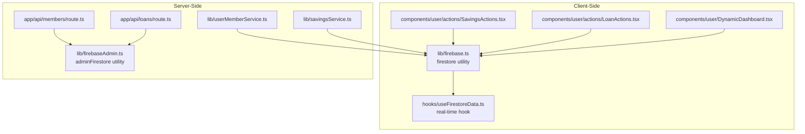
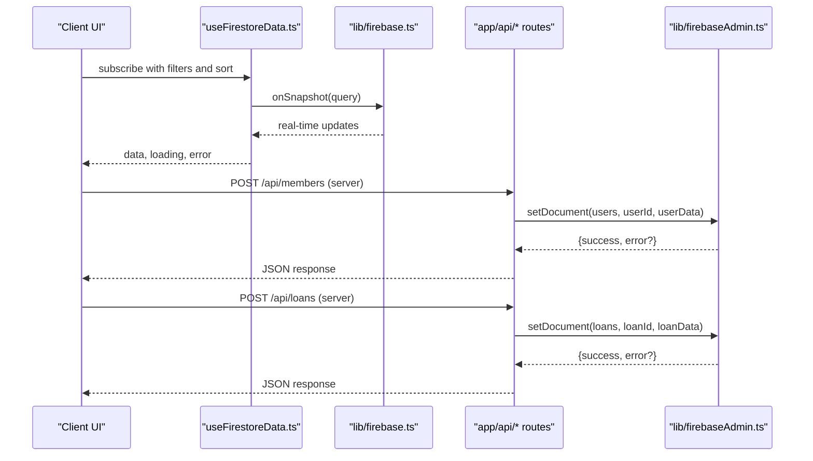
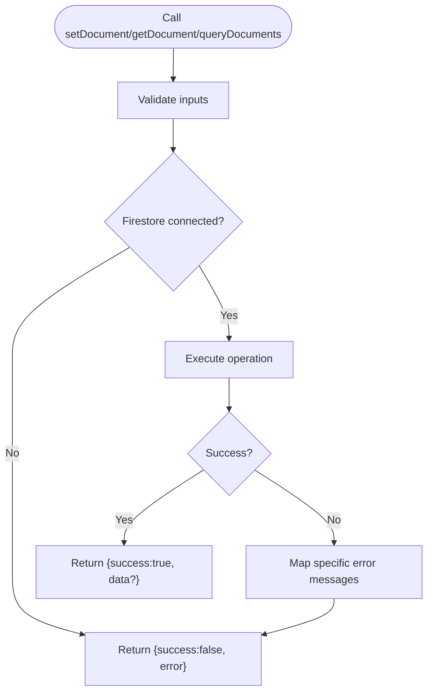
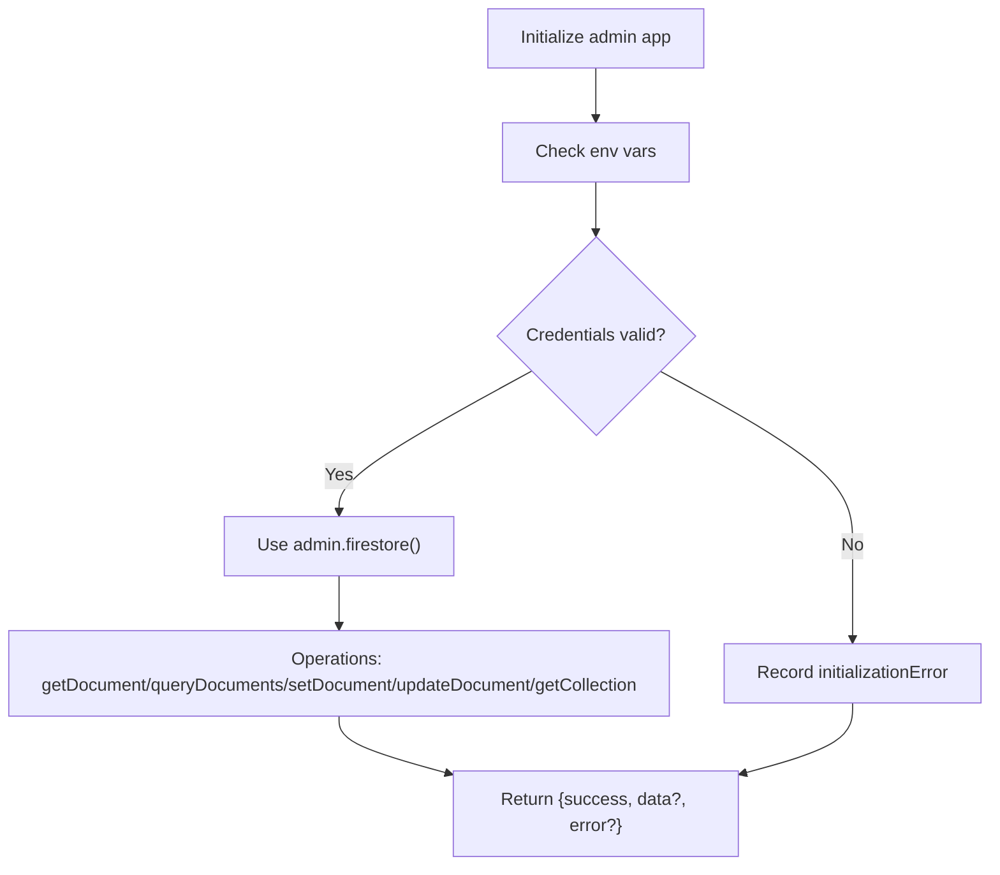
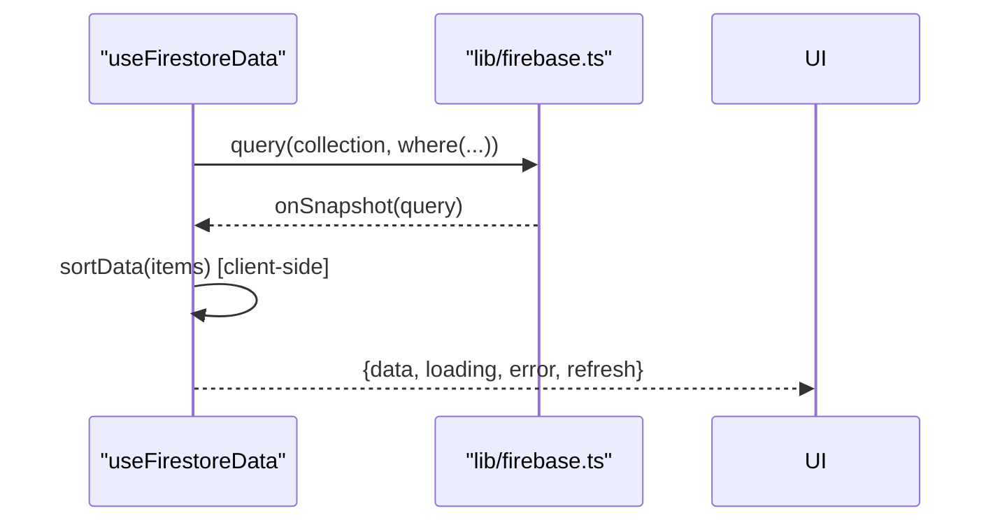
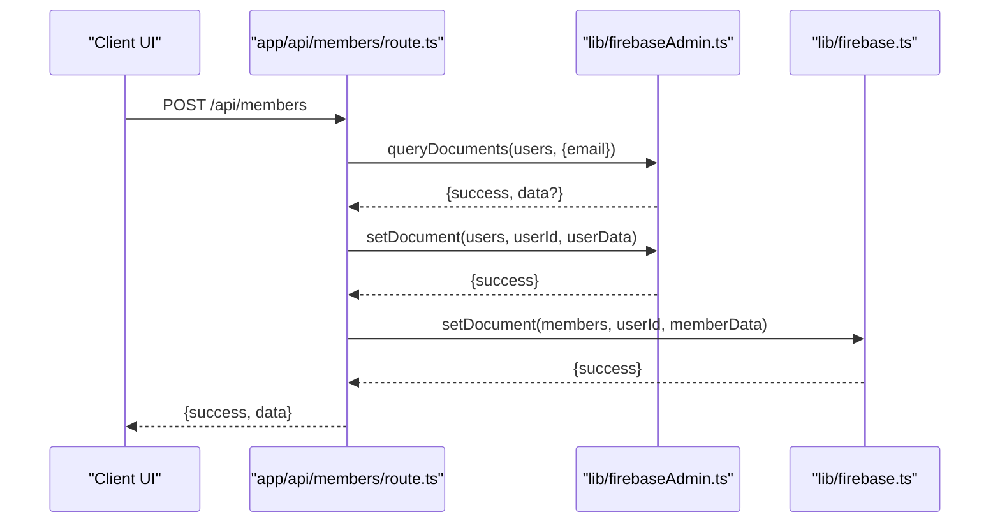
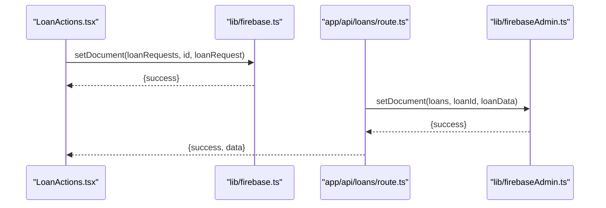
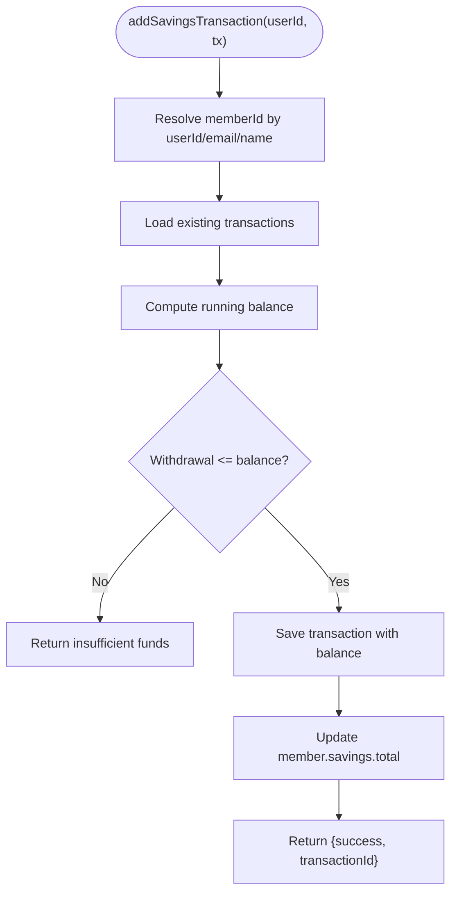
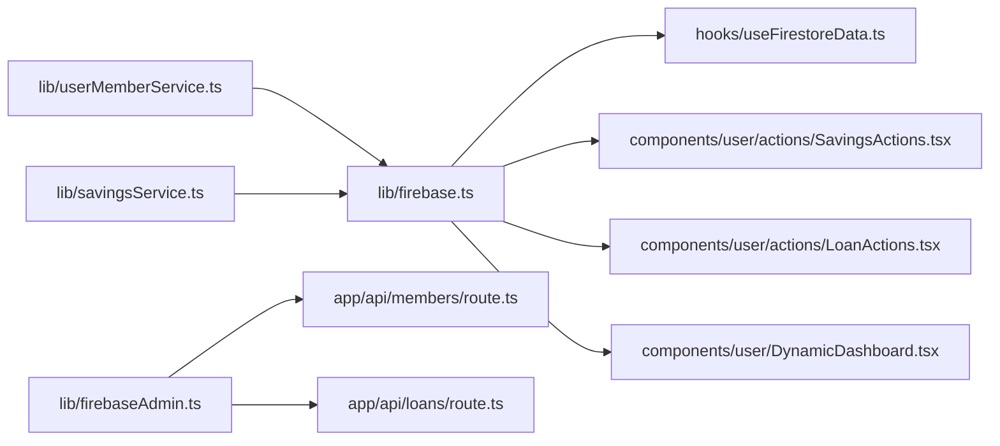

# Data Access Patterns & Utility Functions

<cite>
**Referenced Files in This Document**
- [firebase.ts](file://lib/firebase.ts)
- [firebaseAdmin.ts](file://lib/firebaseAdmin.ts)
- [useFirestoreData.ts](file://hooks/useFirestoreData.ts)
- [members/route.ts](file://app/api/members/route.ts)
- [loans/route.ts](file://app/api/loans/route.ts)
- [savingsService.ts](file://lib/savingsService.ts)
- [userMemberService.ts](file://lib/userMemberService.ts)
- [SavingsActions.tsx](file://components/user/actions/SavingsActions.tsx)
- [LoanActions.tsx](file://components/user/actions/LoanActions.tsx)
- [DynamicDashboard.tsx](file://components/user/DynamicDashboard.tsx)
- [savings.ts](file://lib/types/savings.ts)
</cite>

## Table of Contents
1. [Introduction](#introduction)
2. [Project Structure](#project-structure)
3. [Core Components](#core-components)
4. [Architecture Overview](#architecture-overview)
5. [Detailed Component Analysis](#detailed-component-analysis)
6. [Dependency Analysis](#dependency-analysis)
7. [Performance Considerations](#performance-considerations)
8. [Troubleshooting Guide](#troubleshooting-guide)
9. [Conclusion](#conclusion)

## Introduction
This document explains the centralized data access patterns and utility functions used across the SAMPA Cooperative Management System. It focuses on:
- Centralized Firestore utility functions for CRUD and querying
- Client-side vs admin SDK usage and integration
- React hooks for real-time data fetching and state management
- Functional area patterns for member management, loan processing, and savings tracking
- Complex queries, batch operations, and transaction handling
- Caching, offline behavior, and real-time synchronization
- Best practices for consistency, error handling, and performance

## Project Structure
The system separates client-side and server-side data access:
- Client-side utilities: thin wrappers around the Web SDK for real-time listeners and optimistic updates
- Admin-side utilities: robust server-only helpers for secure operations and complex queries
- API routes: server endpoints that orchestrate admin operations and return standardized responses
- React hooks: client-side hooks for real-time subscriptions and client-side sorting
- Domain services: higher-level services for user-member linking and savings accounting

**Diagram sources**
- [firebase.ts](file://lib/firebase.ts#L89-L307)
- [firebaseAdmin.ts](file://lib/firebaseAdmin.ts#L110-L266)
- [useFirestoreData.ts](file://hooks/useFirestoreData.ts#L19-L151)
- [members/route.ts](file://app/api/members/route.ts#L25-L65)
- [loans/route.ts](file://app/api/loans/route.ts#L4-L39)
- [userMemberService.ts](file://lib/userMemberService.ts#L23-L92)
- [savingsService.ts](file://lib/savingsService.ts#L237-L342)
- [SavingsActions.tsx](file://components/user/actions/SavingsActions.tsx#L44-L66)
- [LoanActions.tsx](file://components/user/actions/LoanActions.tsx#L188-L222)
- [DynamicDashboard.tsx](file://components/user/DynamicDashboard.tsx#L52-L137)

**Section sources**
- [firebase.ts](file://lib/firebase.ts#L1-L309)
- [firebaseAdmin.ts](file://lib/firebaseAdmin.ts#L1-L277)
- [useFirestoreData.ts](file://hooks/useFirestoreData.ts#L1-L182)
- [members/route.ts](file://app/api/members/route.ts#L1-L179)
- [loans/route.ts](file://app/api/loans/route.ts#L1-L133)
- [savingsService.ts](file://lib/savingsService.ts#L1-L455)
- [userMemberService.ts](file://lib/userMemberService.ts#L1-L287)
- [SavingsActions.tsx](file://components/user/actions/SavingsActions.tsx#L1-L237)
- [LoanActions.tsx](file://components/user/actions/LoanActions.tsx#L1-L619)
- [DynamicDashboard.tsx](file://components/user/DynamicDashboard.tsx#L1-L149)

## Core Components
Centralized Firestore utilities provide a unified interface for CRUD and querying:
- setDocument(collection, docId, data): creates or merges a document with merge semantics
- getDocument(collection, docId): retrieves a single document with existence checks
- getCollection(collection): fetches all documents from a collection
- queryDocuments(collection, conditions, orderBy?): executes typed queries with optional ordering
- updateDocument(collection, docId, data): updates fields in a document
- deleteDocument(collection, docId): deletes a document

Error handling is standardized: each function returns a shape with success, data, and error fields. Validation ensures required parameters are present and logs meaningful errors.

**Section sources**
- [firebase.ts](file://lib/firebase.ts#L89-L307)

## Architecture Overview
The system uses a hybrid architecture:
- Client-side: real-time subscriptions via onSnapshot, client-side sorting, and optimistic UI updates
- Admin-side: server-only operations for sensitive writes, complex queries, and cross-collection updates
- API routes: thin orchestrators that delegate to adminFirestore and return structured JSON responses
- Domain services: encapsulate business logic for user-member linkage and savings accounting

**Diagram sources**
- [useFirestoreData.ts](file://hooks/useFirestoreData.ts#L65-L125)
- [firebase.ts](file://lib/firebase.ts#L90-L113)
- [members/route.ts](file://app/api/members/route.ts#L67-L158)
- [loans/route.ts](file://app/api/loans/route.ts#L42-L112)
- [firebaseAdmin.ts](file://lib/firebaseAdmin.ts#L217-L236)

## Detailed Component Analysis

### Centralized Firestore Utilities (Client-Side)
- Purpose: Provide a consistent, validated, and error-handled interface to Firestore using the Web SDK
- Key capabilities:
  - Input validation and logging
  - Standardized return shapes
  - Permission-aware error messages
  - Optional ordering in queries
- Typical usage:
  - Real-time lists via onSnapshot
  - One-off reads/writes for user actions
  - Client-side sorting for performance without composite indexes

**Diagram sources**
- [firebase.ts](file://lib/firebase.ts#L90-L113)
- [firebase.ts](file://lib/firebase.ts#L115-L146)
- [firebase.ts](file://lib/firebase.ts#L184-L240)

**Section sources**
- [firebase.ts](file://lib/firebase.ts#L89-L307)

### Admin Firestore Utilities (Server-Side)
- Purpose: Secure, robust operations for server-only contexts
- Key capabilities:
  - Initialization guardrails and environment validation
  - Strict input validation and error propagation
  - Cross-collection operations and complex queries
- Typical usage:
  - API route handlers
  - Batch-like operations via Promise.all
  - Atomic-like workflows using domain services

**Diagram sources**
- [firebaseAdmin.ts](file://lib/firebaseAdmin.ts#L13-L108)
- [firebaseAdmin.ts](file://lib/firebaseAdmin.ts#L110-L266)

**Section sources**
- [firebaseAdmin.ts](file://lib/firebaseAdmin.ts#L1-L277)

### React Hooks for Real-Time Data
- useFirestoreData<T>: sets up onSnapshot listeners, applies client-side sorting, and exposes loading/error states
- Specific hooks:
  - useLoanRequests(status): filters by status and sorts by appropriate timestamps
  - useMembers(): sorts members by creation time
  - useUsersWithRole(role): filters by role and sorts by creation time

**Diagram sources**
- [useFirestoreData.ts](file://hooks/useFirestoreData.ts#L65-L125)
- [useFirestoreData.ts](file://hooks/useFirestoreData.ts#L154-L182)

**Section sources**
- [useFirestoreData.ts](file://hooks/useFirestoreData.ts#L1-L182)

### Member Management Data Access
- Client-side:
  - DynamicDashboard fetches reminders and events, filters by role/status, and sorts client-side
- Server-side:
  - API members route:
    - GET: returns filtered users (members/drivers/operators) from adminFirestore
    - POST: validates inputs, checks uniqueness, hashes passwords, and creates user/member records via adminFirestore
  - Domain service:
    - createLinkedUserMember: ensures consistent IDs across users and members collections
    - validateAndHealUserMemberLink: heals linkage inconsistencies on login
    - updateUserMember: updates both collections in parallel

**Diagram sources**
- [members/route.ts](file://app/api/members/route.ts#L67-L158)
- [firebaseAdmin.ts](file://lib/firebaseAdmin.ts#L150-L194)
- [firebase.ts](file://lib/firebase.ts#L90-L113)
- [userMemberService.ts](file://lib/userMemberService.ts#L23-L92)

**Section sources**
- [members/route.ts](file://app/api/members/route.ts#L1-L179)
- [userMemberService.ts](file://lib/userMemberService.ts#L23-L92)
- [DynamicDashboard.tsx](file://components/user/DynamicDashboard.tsx#L52-L137)

### Loan Processing Data Access
- Server-side:
  - API loans route:
    - GET: fetches all loans from adminFirestore
    - POST: validates numeric inputs, constructs loan data, generates unique ID, and persists via adminFirestore
- Client-side:
  - LoanActions submits loan applications to loanRequests collection using client-side firestore utility

**Diagram sources**
- [LoanActions.tsx](file://components/user/actions/LoanActions.tsx#L188-L222)
- [loans/route.ts](file://app/api/loans/route.ts#L42-L112)
- [firebaseAdmin.ts](file://lib/firebaseAdmin.ts#L217-L236)

**Section sources**
- [loans/route.ts](file://app/api/loans/route.ts#L1-L133)
- [LoanActions.tsx](file://components/user/actions/LoanActions.tsx#L1-L619)

### Savings Tracking Data Access
- Domain service:
  - getMemberIdByUserId/getMemberInfoByUserId: resolves member identity from user ID/email/name
  - addSavingsTransaction: calculates running balance, saves transaction, and updates member aggregate savings
  - getUserSavingsTransactions/getUserSavingsBalance/getSavingsBalanceForMember: read APIs with fallback calculation
- Client-side:
  - SavingsActions: posts deposits/withdrawals to members/{userId}/savings subcollection

**Diagram sources**
- [savingsService.ts](file://lib/savingsService.ts#L237-L342)
- [SavingsActions.tsx](file://components/user/actions/SavingsActions.tsx#L44-L120)

**Section sources**
- [savingsService.ts](file://lib/savingsService.ts#L1-L455)
- [SavingsActions.tsx](file://components/user/actions/SavingsActions.tsx#L1-L237)
- [savings.ts](file://lib/types/savings.ts#L1-L20)

### Complex Queries, Batch Operations, and Transactions
- Complex queries:
  - queryDocuments supports multiple where clauses and optional orderBy
  - Client-side sorting avoids composite index requirements for common use cases
- Batch operations:
  - Domain services coordinate multiple writes (e.g., createLinkedUserMember)
  - API routes combine multiple adminFirestore operations
- Transactions:
  - No explicit server-side transactions are used in the referenced code
  - Savings aggregation uses a best-effort update pattern; consider Firestore transactions for strict consistency

**Section sources**
- [firebase.ts](file://lib/firebase.ts#L184-L240)
- [useFirestoreData.ts](file://hooks/useFirestoreData.ts#L32-L63)
- [userMemberService.ts](file://lib/userMemberService.ts#L23-L92)
- [members/route.ts](file://app/api/members/route.ts#L110-L138)

### Caching, Offline Behavior, and Real-Time Synchronization
- Real-time synchronization:
  - onSnapshot provides live updates and error callbacks
  - Client-side sorting keeps UI responsive without server-side ordering
- Offline behavior:
  - Firestore SDK caches locally; client hooks surface loading/error states
- Caching strategies:
  - Aggregate values (e.g., member.savings.total) are maintained alongside transaction history
  - Client-side computed balances can be used as fallbacks

**Section sources**
- [useFirestoreData.ts](file://hooks/useFirestoreData.ts#L65-L125)
- [savingsService.ts](file://lib/savingsService.ts#L382-L422)

## Dependency Analysis
- Client-side depends on lib/firebase.ts for Firestore operations and hooks for real-time data
- API routes depend on lib/firebaseAdmin.ts for secure operations and on domain services for business logic
- Domain services depend on lib/firebase.ts for user-member linkage and on lib/types for typing

**Diagram sources**
- [firebase.ts](file://lib/firebase.ts#L1-L309)
- [firebaseAdmin.ts](file://lib/firebaseAdmin.ts#L1-L277)
- [useFirestoreData.ts](file://hooks/useFirestoreData.ts#L1-L182)
- [members/route.ts](file://app/api/members/route.ts#L1-L179)
- [loans/route.ts](file://app/api/loans/route.ts#L1-L133)
- [userMemberService.ts](file://lib/userMemberService.ts#L1-L287)
- [savingsService.ts](file://lib/savingsService.ts#L1-L455)
- [SavingsActions.tsx](file://components/user/actions/SavingsActions.tsx#L1-L237)
- [LoanActions.tsx](file://components/user/actions/LoanActions.tsx#L1-L619)
- [DynamicDashboard.tsx](file://components/user/DynamicDashboard.tsx#L1-L149)

**Section sources**
- [firebase.ts](file://lib/firebase.ts#L1-L309)
- [firebaseAdmin.ts](file://lib/firebaseAdmin.ts#L1-L277)
- [useFirestoreData.ts](file://hooks/useFirestoreData.ts#L1-L182)
- [members/route.ts](file://app/api/members/route.ts#L1-L179)
- [loans/route.ts](file://app/api/loans/route.ts#L1-L133)
- [userMemberService.ts](file://lib/userMemberService.ts#L1-L287)
- [savingsService.ts](file://lib/savingsService.ts#L1-L455)
- [SavingsActions.tsx](file://components/user/actions/SavingsActions.tsx#L1-L237)
- [LoanActions.tsx](file://components/user/actions/LoanActions.tsx#L1-L619)
- [DynamicDashboard.tsx](file://components/user/DynamicDashboard.tsx#L1-L149)

## Performance Considerations
- Prefer client-side sorting for frequently accessed lists to avoid composite index costs
- Use targeted queries with filters to reduce document loads
- Batch related writes when possible (e.g., createLinkedUserMember)
- Keep aggregates (e.g., member.savings.total) updated after transactions
- Use pagination for long lists (as seen in LoanActions amortization schedule)
- Minimize re-renders by structuring hook return values efficiently

## Troubleshooting Guide
- Firestore connection errors:
  - Check initialization logs and environment variables
  - Validate Firestore rules and user permissions
- Common error scenarios:
  - Missing required fields in API routes
  - Duplicate entries (e.g., email already exists)
  - Insufficient funds for withdrawals
- Client-side:
  - useFirestoreData exposes error codes and user-friendly toasts
  - onSnapshot error handler differentiates configuration vs transient errors

**Section sources**
- [firebase.ts](file://lib/firebase.ts#L62-L87)
- [firebase.ts](file://lib/firebase.ts#L174-L180)
- [firebase.ts](file://lib/firebase.ts#L232-L238)
- [useFirestoreData.ts](file://hooks/useFirestoreData.ts#L106-L116)
- [members/route.ts](file://app/api/members/route.ts#L72-L93)
- [savingsService.ts](file://lib/savingsService.ts#L292-L294)

## Conclusion
The SAMPA Cooperative Management System employs a clean separation of concerns:
- Client-side utilities and hooks enable responsive, real-time UIs
- Admin utilities and API routes enforce security and consistency for critical operations
- Domain services encapsulate business logic for user-member linkage and savings accounting
Adhering to the documented patterns ensures predictable data access, strong error handling, and scalable performance across member management, loan processing, and savings tracking.