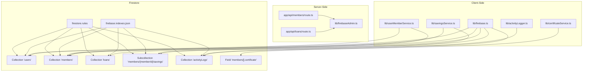
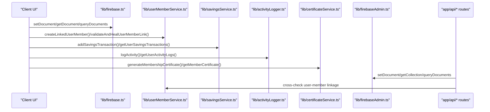
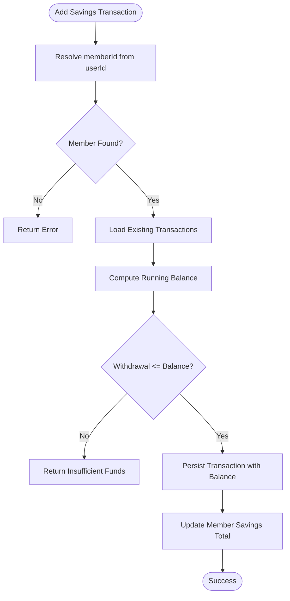
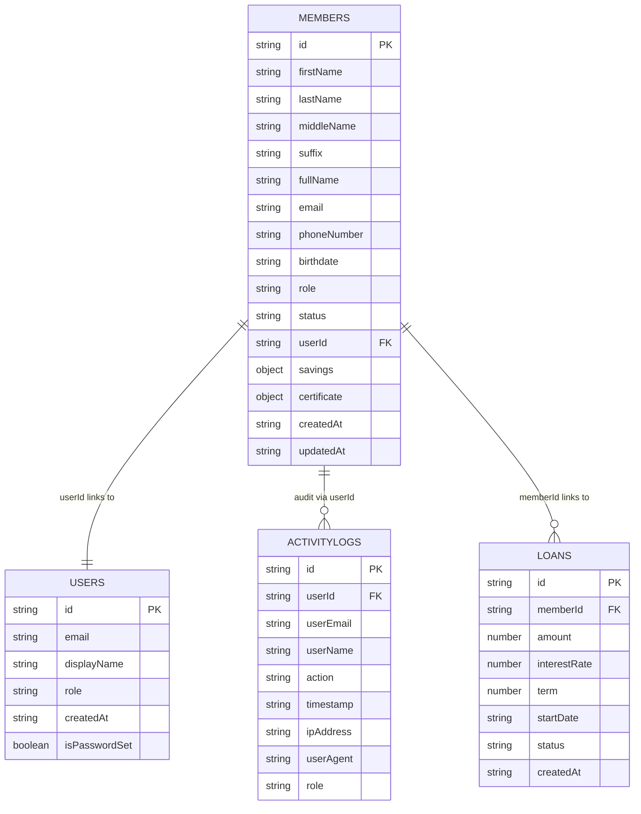

# Database Design & Data Models

<cite>
**Referenced Files in This Document**
- [firebase.indexes.json](file://firebase.indexes.json)
- [firestore.rules](file://firestore.rules)
- [lib/firebase.ts](file://lib/firebase.ts)
- [lib/firebaseAdmin.ts](file://lib/firebaseAdmin.ts)
- [lib/userMemberService.ts](file://lib/userMemberService.ts)
- [lib/savingsService.ts](file://lib/savingsService.ts)
- [lib/activityLogger.ts](file://lib/activityLogger.ts)
- [lib/certificateService.ts](file://lib/certificateService.ts)
- [app/api/members/route.ts](file://app/api/members/route.ts)
- [app/api/loans/route.ts](file://app/api/loans/route.ts)
</cite>

## Table of Contents
1. [Introduction](#introduction)
2. [Project Structure](#project-structure)
3. [Core Components](#core-components)
4. [Architecture Overview](#architecture-overview)
5. [Detailed Component Analysis](#detailed-component-analysis)
6. [Dependency Analysis](#dependency-analysis)
7. [Performance Considerations](#performance-considerations)
8. [Troubleshooting Guide](#troubleshooting-guide)
9. [Conclusion](#conclusion)
10. [Appendices](#appendices)

## Introduction
This document describes the Firestore database design for the SAMPA Cooperative Management System. It covers the collections Users, Members, Loans, Savings, ActivityLogs, and Certificates, detailing entity relationships, field definitions, data types, indexes, and security rules. It also explains data access patterns, query optimization strategies, referential integrity enforcement, and operational considerations such as data lifecycle, security, and migration.

## Project Structure
The database design is implemented via client and server-side Firestore utilities and API routes:
- Client utilities: centralized Firestore helpers for CRUD operations and queries
- Server utilities: Firebase Admin SDK wrapper for secure server-side operations
- Services: domain services for user-member linking, savings transactions, activity logging, and certificates
- API routes: HTTP endpoints for managing members and loans
- Indexes and rules: Firestore indexes and security rules configuration

**Diagram sources**
- [lib/firebase.ts](file://lib/firebase.ts#L90-L307)
- [lib/firebaseAdmin.ts](file://lib/firebaseAdmin.ts#L111-L266)
- [lib/userMemberService.ts](file://lib/userMemberService.ts#L23-L92)
- [lib/savingsService.ts](file://lib/savingsService.ts#L237-L342)
- [lib/activityLogger.ts](file://lib/activityLogger.ts#L20-L86)
- [lib/certificateService.ts](file://lib/certificateService.ts#L10-L175)
- [app/api/members/route.ts](file://app/api/members/route.ts#L26-L65)
- [app/api/loans/route.ts](file://app/api/loans/route.ts#L5-L39)
- [firebase.indexes.json](file://firebase.indexes.json#L1-L83)
- [firestore.rules](file://firestore.rules#L1-L19)

**Section sources**
- [lib/firebase.ts](file://lib/firebase.ts#L1-L309)
- [lib/firebaseAdmin.ts](file://lib/firebaseAdmin.ts#L1-L277)
- [lib/userMemberService.ts](file://lib/userMemberService.ts#L1-L287)
- [lib/savingsService.ts](file://lib/savingsService.ts#L1-L455)
- [lib/activityLogger.ts](file://lib/activityLogger.ts#L1-L165)
- [lib/certificateService.ts](file://lib/certificateService.ts#L1-L207)
- [app/api/members/route.ts](file://app/api/members/route.ts#L1-L179)
- [app/api/loans/route.ts](file://app/api/loans/route.ts#L1-L133)
- [firebase.indexes.json](file://firebase.indexes.json#L1-L83)
- [firestore.rules](file://firestore.rules#L1-L19)

## Core Components
- Users collection: stores user accounts with authentication-related fields and roles.
- Members collection: stores member profiles with personal details, status, and a link to the user account.
- Loans collection: stores loan applications/records with metadata and status.
- Savings subcollections: per-member transactional ledger under members/{memberId}/savings.
- ActivityLogs collection: audit trail of user actions with timestamps.
- Certificates: embedded certificate data stored in each member’s document.

**Section sources**
- [lib/userMemberService.ts](file://lib/userMemberService.ts#L23-L92)
- [lib/savingsService.ts](file://lib/savingsService.ts#L237-L342)
- [lib/activityLogger.ts](file://lib/activityLogger.ts#L20-L86)
- [lib/certificateService.ts](file://lib/certificateService.ts#L10-L175)
- [app/api/members/route.ts](file://app/api/members/route.ts#L67-L158)
- [app/api/loans/route.ts](file://app/api/loans/route.ts#L42-L112)

## Architecture Overview
The system uses a hybrid approach:
- Client utilities for UI-driven operations (CRUD and queries)
- Server utilities for privileged operations (Admin SDK)
- Domain services enforce referential integrity and business rules
- API routes expose controlled endpoints for administrative tasks

**Diagram sources**
- [lib/firebase.ts](file://lib/firebase.ts#L90-L307)
- [lib/userMemberService.ts](file://lib/userMemberService.ts#L23-L92)
- [lib/savingsService.ts](file://lib/savingsService.ts#L237-L342)
- [lib/activityLogger.ts](file://lib/activityLogger.ts#L20-L86)
- [lib/certificateService.ts](file://lib/certificateService.ts#L10-L175)
- [lib/firebaseAdmin.ts](file://lib/firebaseAdmin.ts#L111-L266)
- [app/api/members/route.ts](file://app/api/members/route.ts#L26-L65)
- [app/api/loans/route.ts](file://app/api/loans/route.ts#L5-L39)

## Detailed Component Analysis

### Users Collection
- Purpose: Authentication and identity for all users.
- Primary key: Document ID equals the normalized email (URL-encoded lowercase).
- Typical fields:
  - email: string
  - displayName: string
  - role: string (lowercased)
  - createdAt: string (ISO timestamp)
  - isPasswordSet: boolean
  - passwordHash: string (when applicable)
  - salt: string (when applicable)
- Access pattern: Created during registration; linked to member via userId.
- Security: Current rules allow read/write for all; recommended to restrict by auth rules.

**Section sources**
- [lib/userMemberService.ts](file://lib/userMemberService.ts#L14-L47)
- [lib/userMemberService.ts](file://lib/userMemberService.ts#L23-L92)
- [app/api/members/route.ts](file://app/api/members/route.ts#L67-L158)
- [firestore.rules](file://firestore.rules#L15-L17)

### Members Collection
- Purpose: Member profile and aggregate data (e.g., savings total).
- Primary key: Same as user ID (URL-encoded email).
- Typical fields:
  - firstName, lastName, middleName, suffix: string
  - fullName: string
  - email: string
  - phoneNumber: string
  - birthdate: string
  - role: string
  - driverInfo/operatorInfo/paymentInfo: object|null
  - status: string
  - userId: string (links to Users)
  - savings: object with total and lastUpdated
  - certificate: object|null (certificate metadata)
  - createdAt, updatedAt: string (ISO timestamps)
- Referential integrity: Enforced by generating identical IDs for users and members and maintaining userId consistency.

**Section sources**
- [lib/userMemberService.ts](file://lib/userMemberService.ts#L55-L73)
- [lib/userMemberService.ts](file://lib/userMemberService.ts#L105-L198)
- [lib/savingsService.ts](file://lib/savingsService.ts#L313-L335)
- [lib/certificateService.ts](file://lib/certificateService.ts#L142-L161)

### Loans Collection
- Purpose: Loan records with lifecycle metadata.
- Primary key: Generated unique ID (loan_{timestamp}_{random}).
- Typical fields:
  - memberId: string (foreign key to Members)
  - amount: number
  - interestRate: number
  - term: integer
  - startDate: string (ISO timestamp)
  - status: string
  - createdAt: string (ISO timestamp)
- Access pattern: Admin endpoints create/update; clients read aggregated lists.

**Section sources**
- [app/api/loans/route.ts](file://app/api/loans/route.ts#L42-L112)

### Savings Subcollections
- Location: members/{memberId}/savings
- Purpose: Per-member transactional ledger.
- Typical fields per transaction:
  - id: string (composed type-timestamp-suffix)
  - type: string ("deposit"|"withdrawal")
  - amount: number
  - date: string (ISO timestamp)
  - balance: number (running balance)
  - createdAt: string (ISO timestamp)
- Aggregate: members.{savings.total,lastUpdated} maintained by service.

**Diagram sources**
- [lib/savingsService.ts](file://lib/savingsService.ts#L237-L342)

**Section sources**
- [lib/savingsService.ts](file://lib/savingsService.ts#L237-L342)
- [lib/savingsService.ts](file://lib/savingsService.ts#L347-L422)

### ActivityLogs Collection
- Purpose: Audit trail of user actions.
- Typical fields:
  - userId: string
  - userEmail, userName: string
  - action: string
  - timestamp: string (ISO timestamp)
  - ipAddress, userAgent, role: string
- Queries: By userId with descending timestamp; global listing by timestamp ascending.

**Section sources**
- [lib/activityLogger.ts](file://lib/activityLogger.ts#L20-L86)
- [lib/activityLogger.ts](file://lib/activityLogger.ts#L88-L165)

### Certificates
- Storage: Embedded in the member document under certificate.
- Fields:
  - memberId: string
  - fullName: string
  - role: string
  - registrationDate: string
  - certificateUrl: string (data URI)
  - createdAt: string (ISO timestamp)
- Generation: Service creates PDF and updates member document.

**Section sources**
- [lib/certificateService.ts](file://lib/certificateService.ts#L10-L175)

## Dependency Analysis
- Referential integrity:
  - Users and Members share the same ID to guarantee a single source of truth.
  - Savings subcollections are scoped under members/{memberId}, enforcing hierarchical containment.
- Cross-collection dependencies:
  - Savings service resolves memberId from userId to maintain referential integrity.
  - Activity logger writes userId to activityLogs; indexes enable efficient queries.
- API routes depend on Admin SDK for privileged operations.

**Diagram sources**
- [lib/userMemberService.ts](file://lib/userMemberService.ts#L55-L73)
- [lib/savingsService.ts](file://lib/savingsService.ts#L237-L342)
- [lib/activityLogger.ts](file://lib/activityLogger.ts#L20-L86)
- [app/api/loans/route.ts](file://app/api/loans/route.ts#L42-L112)

**Section sources**
- [lib/userMemberService.ts](file://lib/userMemberService.ts#L1-L287)
- [lib/savingsService.ts](file://lib/savingsService.ts#L1-L455)
- [lib/activityLogger.ts](file://lib/activityLogger.ts#L1-L165)
- [app/api/loans/route.ts](file://app/api/loans/route.ts#L1-L133)

## Performance Considerations
- Indexes:
  - loanRequests: composite indexes on status+createdAt/__name__ and status+approvedAt/__name__ and status+rejectedAt/__name__.
  - activityLogs: composite index on userId+timestamp and single-field index on timestamp.
- Query optimization:
  - Use userId+timestamp for per-user audit queries.
  - Use timestamp-only for global audit listings.
  - Prefer filtering by equality on indexed fields to leverage composite indexes.
- Data modeling:
  - Embedding certificate data in members reduces joins.
  - Savings transactions stored as subcollection enable scalable pagination and aggregation.

**Section sources**
- [firebase.indexes.json](file://firebase.indexes.json#L1-L83)
- [lib/activityLogger.ts](file://lib/activityLogger.ts#L50-L120)

## Troubleshooting Guide
- Permission denied errors:
  - Current rules allow read/write for all; if access is denied, verify client initialization and network connectivity.
- Document not found:
  - Ensure IDs are URL-encoded emails for Users/Members.
  - Confirm user-member linkage exists and is consistent.
- Savings validation failures:
  - Withdrawals exceeding balance are rejected; confirm deposit/withdrawal amounts and order of transactions.
- Certificate generation:
  - Ensure member document has required fields; verify update succeeded.

**Section sources**
- [lib/firebase.ts](file://lib/firebase.ts#L174-L180)
- [lib/savingsService.ts](file://lib/savingsService.ts#L292-L294)
- [lib/certificateService.ts](file://lib/certificateService.ts#L158-L161)
- [firestore.rules](file://firestore.rules#L15-L17)

## Conclusion
The database design centers on a consistent identity model (Users and Members sharing IDs), hierarchical savings subcollections, and embedded certificate data. Indexes and service-layer validations support efficient queries and business rule enforcement. Security rules currently permit broad access and should be hardened to enforce role-based access and data isolation.

## Appendices

### Data Access Patterns and Examples
- Create linked user-member:
  - Generate ID from email; create user; create member with userId; rollback on failure.
- Add savings transaction:
  - Resolve memberId from userId; compute running balance; persist transaction; update member savings total.
- Log activity:
  - Insert activity log with timestamp; query by userId or globally by timestamp.
- Generate certificate:
  - Create PDF; embed base64 data; update member certificate field.

**Section sources**
- [lib/userMemberService.ts](file://lib/userMemberService.ts#L23-L92)
- [lib/savingsService.ts](file://lib/savingsService.ts#L237-L342)
- [lib/activityLogger.ts](file://lib/activityLogger.ts#L20-L86)
- [lib/certificateService.ts](file://lib/certificateService.ts#L10-L175)

### Security and Privacy
- Current rules: Allow read/write for all documents.
- Recommended improvements:
  - Restrict reads/writes by authenticated user and role.
  - Separate sensitive fields (e.g., passwordHash) behind role gates.
  - Enforce field-level visibility for member data.

**Section sources**
- [firestore.rules](file://firestore.rules#L15-L17)

### Data Lifecycle, Retention, and Archival
- No explicit retention policies are defined in the repository.
- Suggested practices:
  - Archive old activity logs periodically to reduce cost and improve query performance.
  - Implement member deactivation workflows and data anonymization for inactive users.
  - Back up critical collections regularly and test restore procedures.

[No sources needed since this section provides general guidance]

### Migration and Versioning
- Schema changes:
  - Introduce version fields in documents to support gradual rollout.
  - Use server-side migrations to backfill defaults and transform data.
- Index changes:
  - Add new composite indexes via firebase.indexes.json and deploy using CLI.
- Validation:
  - Add pre/post hooks to validate data shape and enforce constraints.

[No sources needed since this section provides general guidance]