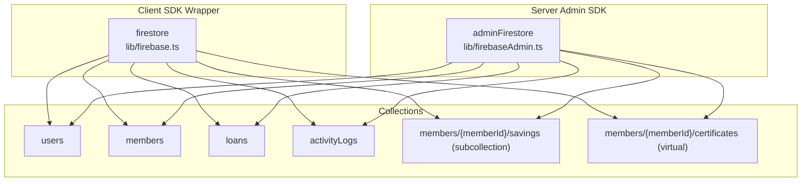
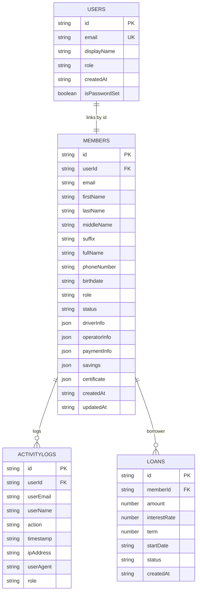
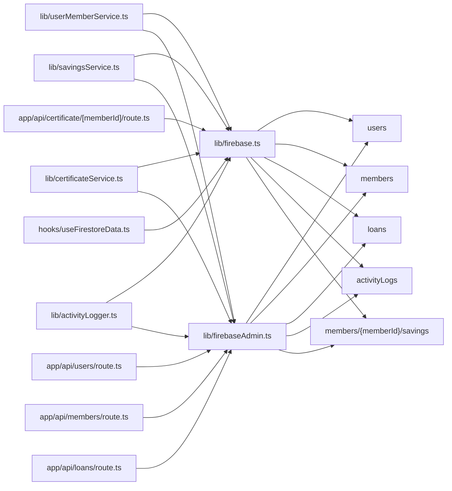

# Firestore Collections & Schema

<cite>
**Referenced Files in This Document**
- [firebase.ts](file://lib/firebase.ts)
- [firebaseAdmin.ts](file://lib/firebaseAdmin.ts)
- [userMemberService.ts](file://lib/userMemberService.ts)
- [savingsService.ts](file://lib/savingsService.ts)
- [certificateService.ts](file://lib/certificateService.ts)
- [activityLogger.ts](file://lib/activityLogger.ts)
- [savings.ts](file://lib/types/savings.ts)
- [members/route.ts](file://app/api/members/route.ts)
- [users/route.ts](file://app/api/users/route.ts)
- [loans/route.ts](file://app/api/loans/route.ts)
- [certificate/[memberId]/route.ts](file://app/api/certificate/[memberId]/route.ts)
- [useFirestoreData.ts](file://hooks/useFirestoreData.ts)
</cite>

## Table of Contents
1. [Introduction](#introduction)
2. [Project Structure](#project-structure)
3. [Core Components](#core-components)
4. [Architecture Overview](#architecture-overview)
5. [Detailed Component Analysis](#detailed-component-analysis)
6. [Dependency Analysis](#dependency-analysis)
7. [Performance Considerations](#performance-considerations)
8. [Troubleshooting Guide](#troubleshooting-guide)
9. [Conclusion](#conclusion)
10. [Appendices](#appendices)

## Introduction
This document describes the Firestore collection structure and data schema used by the SAMPA Cooperative Management System. It covers the Users, Members, Loans, Savings, ActivityLogs, and Certificates collections, detailing field definitions, data types, validation rules, primary keys, document ID generation patterns, and naming conventions. It also explains hierarchical relationships, query patterns, and normalization/denormalization strategies for optimal performance. TypeScript interfaces and type definitions are documented alongside practical CRUD operation examples and common queries.

## Project Structure
The application uses two client-side and server-side SDKs:
- Client-side SDK via a lightweight wrapper around the Web SDK for UI interactions and optimistic reads.
- Server-side Admin SDK for secure, privileged operations and batch-like logic.

Collections are accessed directly by name, with special handling for subcollections (e.g., member savings under members/{memberId}/savings).

**Diagram sources**
- [firebase.ts](file://lib/firebase.ts#L90-L307)
- [firebaseAdmin.ts](file://lib/firebaseAdmin.ts#L111-L266)

**Section sources**
- [firebase.ts](file://lib/firebase.ts#L1-L309)
- [firebaseAdmin.ts](file://lib/firebaseAdmin.ts#L1-L277)

## Core Components
- Firestore client wrapper: Provides unified CRUD and query helpers for client-side components.
- Admin SDK wrapper: Provides server-side CRUD and query helpers for API routes and services.
- Services:
  - User-member linkage and synchronization.
  - Savings transactions and balances with subcollections.
  - Membership certificates stored in member documents.
  - Activity logging with query patterns.

**Section sources**
- [firebase.ts](file://lib/firebase.ts#L90-L307)
- [firebaseAdmin.ts](file://lib/firebaseAdmin.ts#L111-L266)
- [userMemberService.ts](file://lib/userMemberService.ts#L1-L287)
- [savingsService.ts](file://lib/savingsService.ts#L1-L455)
- [certificateService.ts](file://lib/certificateService.ts#L1-L207)
- [activityLogger.ts](file://lib/activityLogger.ts#L1-L165)

## Architecture Overview
The system maintains a normalized schema with deliberate denormalization for performance:
- Users and Members share the same ID derived from the user’s email to enforce a single source of truth for identity.
- Savings are stored as a subcollection per member to enable efficient aggregation and pagination.
- Certificates are stored as part of the member document for quick retrieval.
- Activity logs are indexed by timestamp for fast chronological queries.

**Diagram sources**
- [userMemberService.ts](file://lib/userMemberService.ts#L14-L92)
- [savingsService.ts](file://lib/savingsService.ts#L237-L342)
- [certificateService.ts](file://lib/certificateService.ts#L10-L175)
- [activityLogger.ts](file://lib/activityLogger.ts#L20-L86)
- [loans/route.ts](file://app/api/loans/route.ts#L42-L112)
- [users/route.ts](file://app/api/users/route.ts#L48-L117)
- [members/route.ts](file://app/api/members/route.ts#L67-L158)

## Detailed Component Analysis

### Users Collection
- Purpose: Stores user accounts with authentication metadata and roles.
- Primary key: Document ID equals the encoded lowercase email.
- Fields:
  - id: string (same as encoded email)
  - email: string (unique)
  - displayName: string
  - role: string (lowercased)
  - createdAt: string (ISO timestamp)
  - isPasswordSet: boolean
- Validation rules:
  - Email uniqueness enforced at API level.
  - Role must be one of member, driver, operator, or admin.
- Typical CRUD:
  - Create: POST to users API generates encoded email ID and sets user data.
  - Read: GET users API returns all users; client can fetch by ID.
  - Update: PATCH member profile updates both users and members in parallel.
  - Delete: Not exposed via standard routes; use Admin SDK for privileged deletion.
- Naming convention: Lowercase, hyphenated collection name; IDs derived from email.

Sample payload (paths):
- [POST /api/users](file://app/api/users/route.ts#L48-L117)
- [GET /api/users](file://app/api/users/route.ts#L18-L46)

**Section sources**
- [users/route.ts](file://app/api/users/route.ts#L48-L117)
- [firebase.ts](file://lib/firebase.ts#L90-L182)
- [firebaseAdmin.ts](file://lib/firebaseAdmin.ts#L111-L194)

### Members Collection
- Purpose: Member profiles linked to users by ID; includes personal info, roles, status, and financial aggregates.
- Primary key: Same as Users (encoded email).
- Subcollections:
  - members/{memberId}/savings: Transactional ledger for savings.
  - members/{memberId}/certificates: Virtual; certificate stored in member document.
- Fields:
  - id: string (same as userId)
  - userId: string (foreign key to users)
  - email: string
  - firstName, lastName, middleName, suffix: string
  - fullName: string
  - phoneNumber: string
  - birthdate: string
  - role: string
  - status: string
  - driverInfo/operatorInfo/paymentInfo: json
  - savings: json (aggregated total, lastUpdated)
  - certificate: json (certificate metadata)
  - createdAt, updatedAt: string (ISO timestamps)
- Validation rules:
  - Linked userId must match the member document ID.
  - Email must match the linked user’s email.
- Typical CRUD:
  - Create: Linked creation via userMemberService ensures both users and members are created atomically.
  - Read: getByUserId validates and heals linkage automatically.
  - Update: updateUserMember synchronizes changes across both collections.
  - Delete: Not exposed via standard routes; use Admin SDK for privileged deletion.

Sample payload (paths):
- [createLinkedUserMember](file://lib/userMemberService.ts#L23-L92)
- [validateAndHealUserMemberLink](file://lib/userMemberService.ts#L99-L198)

**Section sources**
- [userMemberService.ts](file://lib/userMemberService.ts#L1-L287)
- [firebase.ts](file://lib/firebase.ts#L90-L182)
- [firebaseAdmin.ts](file://lib/firebaseAdmin.ts#L111-L194)

### Loans Collection
- Purpose: Loan applications and records with lifecycle tracking.
- Primary key: Auto-generated unique ID.
- Fields:
  - id: string (loan_{timestamp}_{random})
  - memberId: string (FK to members)
  - amount: number
  - interestRate: number
  - term: number
  - startDate: string (ISO date)
  - status: string (pending, approved, disbursed, completed, defaulted)
  - createdAt: string (ISO timestamp)
- Validation rules:
  - Required fields: memberId, amount, interestRate, term, startDate.
  - Numeric fields validated.
- Typical CRUD:
  - Create: POST to loans API generates unique loan ID and persists loan data.
  - Read: GET loans API returns all loans; filter by memberId or status as needed.
  - Update: Use Admin SDK to update status or schedule disbursement.
  - Delete: Not exposed via standard routes; use Admin SDK for privileged deletion.

Sample payload (paths):
- [POST /api/loans](file://app/api/loans/route.ts#L42-L112)
- [GET /api/loans](file://app/api/loans/route.ts#L4-L39)

**Section sources**
- [loans/route.ts](file://app/api/loans/route.ts#L42-L112)
- [firebase.ts](file://lib/firebase.ts#L90-L182)
- [firebaseAdmin.ts](file://lib/firebaseAdmin.ts#L111-L194)

### Savings Subcollection (members/{memberId}/savings)
- Purpose: Per-member transactional ledger for deposits and withdrawals.
- Primary key: Composite ID generated from type, timestamp, and random suffix.
- Fields:
  - id: string (type-timestamp-random)
  - memberId: string
  - memberName: string
  - date: string (ISO date)
  - type: 'deposit' | 'withdrawal'
  - amount: number
  - balance: number (running balance)
  - remarks: string
  - createdAt: string (ISO timestamp)
- Aggregation:
  - Member document caches savings.total and lastUpdated for fast reads.
- Validation rules:
  - Balance cannot go negative on withdrawal.
  - Running balance calculated from ordered transactions.
- Typical CRUD:
  - Add transaction: addSavingsTransaction creates a unique ID, computes balance, saves to subcollection, and updates member aggregate.
  - List transactions: getUserSavingsTransactions retrieves all subcollection entries.
  - Get balance: getUserSavingsBalance prefers cached value, falls back to recalculating from transactions.

Sample payload (paths):
- [addSavingsTransaction](file://lib/savingsService.ts#L237-L342)
- [getUserSavingsTransactions](file://lib/savingsService.ts#L347-L377)
- [getUserSavingsBalance](file://lib/savingsService.ts#L382-L422)

**Section sources**
- [savingsService.ts](file://lib/savingsService.ts#L1-L455)
- [savings.ts](file://lib/types/savings.ts#L1-L20)
- [firebase.ts](file://lib/firebase.ts#L90-L182)
- [firebaseAdmin.ts](file://lib/firebaseAdmin.ts#L111-L194)

### ActivityLogs Collection
- Purpose: Audit trail of user actions with IP, agent, and role metadata.
- Primary key: Auto-generated unique ID.
- Fields:
  - id: string (activity_{timestamp}_{random})
  - userId: string
  - userEmail, userName: string
  - action: string
  - timestamp: string (ISO timestamp)
  - ipAddress, userAgent: string
  - role: string
- Indexing:
  - Query by userId and timestamp; supports date-range filtering.
- Typical CRUD:
  - Log activity: logActivity writes a new log with auto-generated ID and timestamp.
  - Fetch user logs: getUserActivityLogs filters by userId and sorts by timestamp desc.
  - Fetch all logs: getAllActivityLogs retrieves recent logs.
  - Fetch by date range: getActivityLogsByDateRange applies composite filters.

Sample payload (paths):
- [logActivity](file://lib/activityLogger.ts#L20-L43)
- [getUserActivityLogs](file://lib/activityLogger.ts#L50-L86)
- [getAllActivityLogs](file://lib/activityLogger.ts#L92-L120)
- [getActivityLogsByDateRange](file://lib/activityLogger.ts#L128-L165)

**Section sources**
- [activityLogger.ts](file://lib/activityLogger.ts#L1-L165)
- [firebase.ts](file://lib/firebase.ts#L90-L182)
- [firebaseAdmin.ts](file://lib/firebaseAdmin.ts#L111-L194)

### Certificates (Stored in Members)
- Purpose: Membership certificates embedded in the member document for quick retrieval.
- Storage pattern:
  - Certificate data is stored in members/{memberId}.certificate as a JSON object.
  - A boolean flag indicates whether a certificate has been generated.
- Fields:
  - members/{memberId}.certificate: json
    - memberId: string
    - fullName: string
    - role: string
    - registrationDate: string
    - certificateUrl: string (data URL)
    - createdAt: string
  - members/{memberId}.certificateGenerated: boolean
  - members/{memberId}.certificateGeneratedAt: string
- Retrieval:
  - API route serves the PDF bytes for a given member ID.

Sample payload (paths):
- [generateMembershipCertificate](file://lib/certificateService.ts#L10-L175)
- [getMemberCertificate](file://lib/certificateService.ts#L182-L207)
- [GET /api/certificate/[memberId]](file://app/api/certificate/[memberId]/route.ts#L4-L68)

**Section sources**
- [certificateService.ts](file://lib/certificateService.ts#L1-L207)
- [certificate/[memberId]/route.ts](file://app/api/certificate/[memberId]/route.ts#L4-L68)
- [firebase.ts](file://lib/firebase.ts#L90-L182)
- [firebaseAdmin.ts](file://lib/firebaseAdmin.ts#L111-L194)

## Dependency Analysis
- Client SDK wrapper depends on the Web SDK; server SDK depends on Admin SDK.
- Services depend on wrappers for Firestore operations.
- APIs depend on Admin SDK wrappers for privileged operations.
- UI hooks depend on client SDK wrapper for reactive data.

**Diagram sources**
- [firebase.ts](file://lib/firebase.ts#L90-L307)
- [firebaseAdmin.ts](file://lib/firebaseAdmin.ts#L111-L266)
- [userMemberService.ts](file://lib/userMemberService.ts#L1-L287)
- [savingsService.ts](file://lib/savingsService.ts#L1-L455)
- [certificateService.ts](file://lib/certificateService.ts#L1-L207)
- [activityLogger.ts](file://lib/activityLogger.ts#L1-L165)
- [users/route.ts](file://app/api/users/route.ts#L1-L126)
- [members/route.ts](file://app/api/members/route.ts#L1-L179)
- [loans/route.ts](file://app/api/loans/route.ts#L1-L133)
- [certificate/[memberId]/route.ts](file://app/api/certificate/[memberId]/route.ts#L1-L68)
- [useFirestoreData.ts](file://hooks/useFirestoreData.ts#L161-L182)

**Section sources**
- [firebase.ts](file://lib/firebase.ts#L90-L307)
- [firebaseAdmin.ts](file://lib/firebaseAdmin.ts#L111-L266)
- [userMemberService.ts](file://lib/userMemberService.ts#L1-L287)
- [savingsService.ts](file://lib/savingsService.ts#L1-L455)
- [certificateService.ts](file://lib/certificateService.ts#L1-L207)
- [activityLogger.ts](file://lib/activityLogger.ts#L1-L165)
- [users/route.ts](file://app/api/users/route.ts#L1-L126)
- [members/route.ts](file://app/api/members/route.ts#L1-L179)
- [loans/route.ts](file://app/api/loans/route.ts#L1-L133)
- [certificate/[memberId]/route.ts](file://app/api/certificate/[memberId]/route.ts#L1-L68)
- [useFirestoreData.ts](file://hooks/useFirestoreData.ts#L161-L182)

## Performance Considerations
- Denormalization:
  - Member savings total is cached in members/{memberId}.savings.total for fast reads; recomputed from transactions when absent.
- Subcollections:
  - Savings are stored as a subcollection to enable efficient pagination and reduce document size.
- Indexing:
  - Activity logs are queried by userId and timestamp; ensure Firestore indexes exist for these fields.
- ID generation:
  - Unique IDs use timestamp plus random suffix to minimize collisions and improve locality.
- Parallel updates:
  - User-member updates are executed concurrently to reduce latency.

[No sources needed since this section provides general guidance]

## Troubleshooting Guide
- Connection errors:
  - Client wrapper validates Firestore connectivity and returns structured errors.
  - Admin SDK wrapper checks initialization and returns initialization errors.
- Permission errors:
  - Queries and operations may fail with permission-denied; verify Firestore rules and user roles.
- Missing documents:
  - Helpers return “Document not found” or similar; handle gracefully in UI.
- Initialization failures:
  - Admin SDK warns about missing or placeholder credentials; check environment variables.

**Section sources**
- [firebase.ts](file://lib/firebase.ts#L62-L87)
- [firebaseAdmin.ts](file://lib/firebaseAdmin.ts#L13-L108)

## Conclusion
The SAMPA Cooperative Management System employs a normalized schema with strategic denormalization for performance. Users and Members share a single identity via encoded email IDs, savings are efficiently managed in subcollections, and certificates are embedded for quick retrieval. Robust services and APIs ensure data integrity, while TypeScript interfaces provide strong typing across the stack.

[No sources needed since this section summarizes without analyzing specific files]

## Appendices

### CRUD Examples by Collection

- Users
  - Create: [POST /api/users](file://app/api/users/route.ts#L48-L117)
  - Read: [GET /api/users](file://app/api/users/route.ts#L18-L46)
  - Update: [updateUserMember](file://lib/userMemberService.ts#L246-L287)

- Members
  - Create: [createLinkedUserMember](file://lib/userMemberService.ts#L23-L92)
  - Read: [getMemberByUserId](file://lib/userMemberService.ts#L205-L221)
  - Update: [updateUserMember](file://lib/userMemberService.ts#L246-L287)

- Loans
  - Create: [POST /api/loans](file://app/api/loans/route.ts#L42-L112)
  - Read: [GET /api/loans](file://app/api/loans/route.ts#L4-L39)

- Savings
  - Add transaction: [addSavingsTransaction](file://lib/savingsService.ts#L237-L342)
  - List transactions: [getUserSavingsTransactions](file://lib/savingsService.ts#L347-L377)
  - Get balance: [getUserSavingsBalance](file://lib/savingsService.ts#L382-L422)

- ActivityLogs
  - Log activity: [logActivity](file://lib/activityLogger.ts#L20-L43)
  - Fetch user logs: [getUserActivityLogs](file://lib/activityLogger.ts#L50-L86)
  - Fetch all logs: [getAllActivityLogs](file://lib/activityLogger.ts#L92-L120)
  - Fetch by date range: [getActivityLogsByDateRange](file://lib/activityLogger.ts#L128-L165)

- Certificates
  - Generate: [generateMembershipCertificate](file://lib/certificateService.ts#L10-L175)
  - Retrieve: [getMemberCertificate](file://lib/certificateService.ts#L182-L207)
  - Serve PDF: [GET /api/certificate/[memberId]](file://app/api/certificate/[memberId]/route.ts#L4-L68)

### Common Query Patterns
- Get members by role:
  - [useFirestoreData](file://hooks/useFirestoreData.ts#L175-L182) for role-filtered members.
- Get user activity logs:
  - [getUserActivityLogs](file://lib/activityLogger.ts#L50-L86) with timestamp sort.
- Get member’s savings transactions:
  - [getUserSavingsTransactions](file://lib/savingsService.ts#L347-L377) from subcollection.

**Section sources**
- [useFirestoreData.ts](file://hooks/useFirestoreData.ts#L161-L182)
- [activityLogger.ts](file://lib/activityLogger.ts#L50-L86)
- [savingsService.ts](file://lib/savingsService.ts#L347-L377)