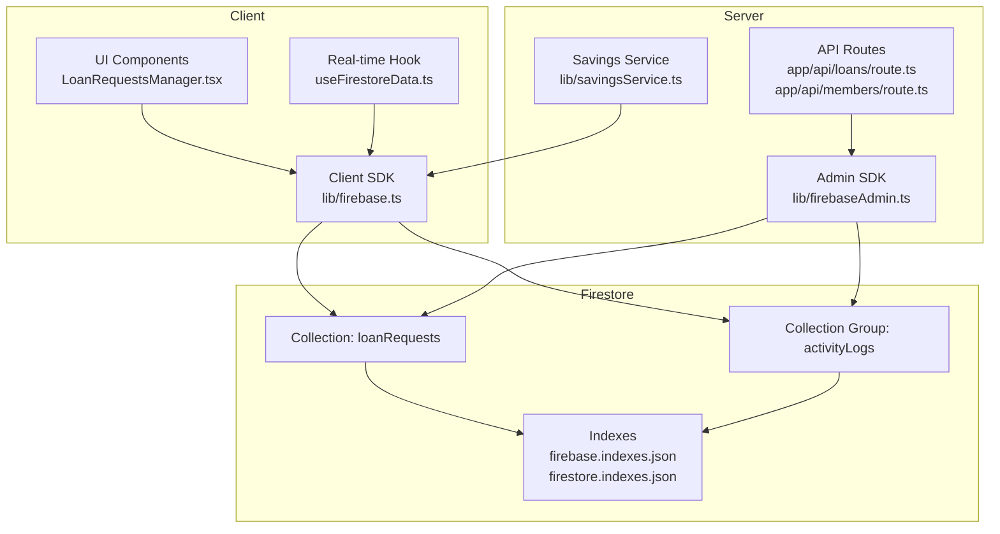
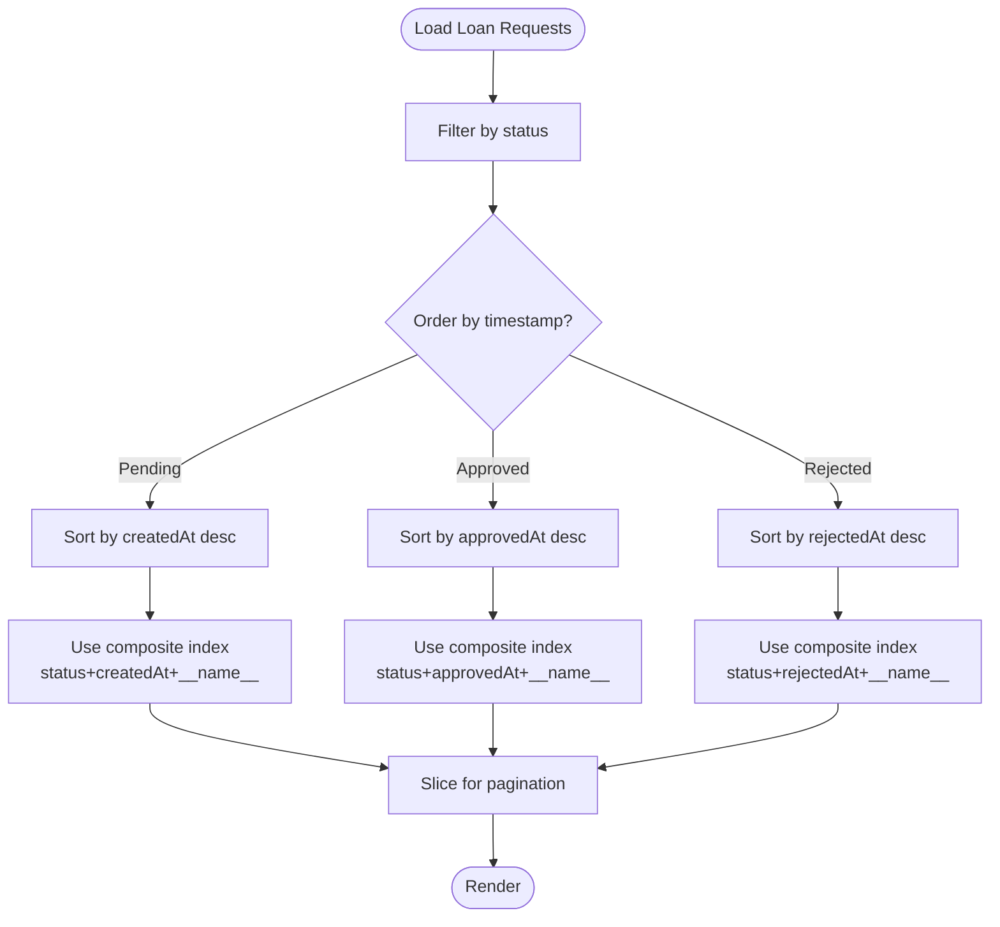
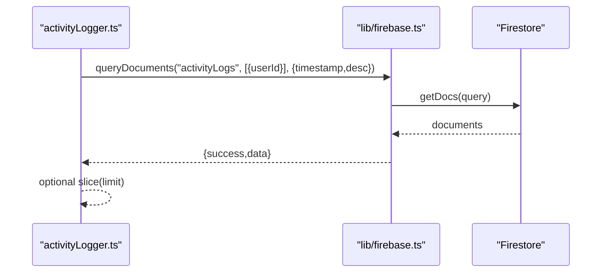
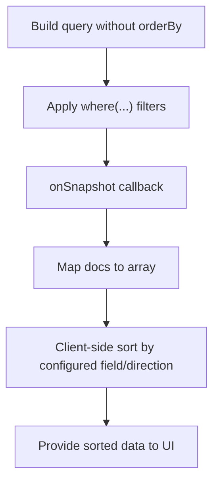
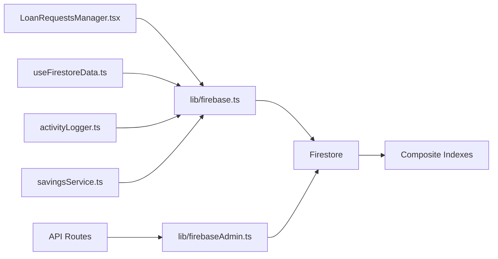

# Indexing Strategy & Query Optimization

<cite>
**Referenced Files in This Document**
- [firebase.indexes.json](file://firebase.indexes.json)
- [firestore.indexes.json](file://firestore.indexes.json)
- [FIRESTORE_INDEXES.md](file://docs/FIRESTORE_INDEXES.md)
- [firebase.ts](file://lib/firebase.ts)
- [firebaseAdmin.ts](file://lib/firebaseAdmin.ts)
- [useFirestoreData.ts](file://hooks/useFirestoreData.ts)
- [LoanRequestsManager.tsx](file://components/admin/LoanRequestsManager.tsx)
- [activityLogger.ts](file://lib/activityLogger.ts)
- [deploy-loan-indexes.js](file://scripts/deploy-loan-indexes.js)
- [deploy-activity-logs-indexes.js](file://scripts/deploy-activity-logs-indexes.js)
- [route.ts](file://app/api/members/route.ts)
- [route.ts](file://app/api/loans/route.ts)
- [savingsService.ts](file://lib/savingsService.ts)
</cite>

## Table of Contents
1. [Introduction](#introduction)
2. [Project Structure](#project-structure)
3. [Core Components](#core-components)
4. [Architecture Overview](#architecture-overview)
5. [Detailed Component Analysis](#detailed-component-analysis)
6. [Dependency Analysis](#dependency-analysis)
7. [Performance Considerations](#performance-considerations)
8. [Troubleshooting Guide](#troubleshooting-guide)
9. [Conclusion](#conclusion)
10. [Appendices](#appendices)

## Introduction
This document explains the Firestore indexing strategy and query optimization approach used in the SAMPA Cooperative Management System. It details the composite indexes defined for efficient querying of loan requests and activity logs, describes the query patterns implemented across the application, and provides guidance on cost implications, pagination, deployment, monitoring, and future index planning. Practical examples reference the actual code paths used in the project.

## Project Structure
The indexing strategy spans configuration files, client and server utilities, UI components, and automation scripts:
- Index definitions: firebase.indexes.json and firestore.indexes.json
- Client SDK utilities: lib/firebase.ts
- Server SDK utilities: lib/firebaseAdmin.ts
- Real-time hooks: hooks/useFirestoreData.ts
- UI components using queries and pagination: components/admin/LoanRequestsManager.tsx
- Activity logging utilities: lib/activityLogger.ts
- Deployment scripts: scripts/deploy-loan-indexes.js and scripts/deploy-activity-logs-indexes.js
- API routes demonstrating server-side reads/writes: app/api/loans/route.ts and app/api/members/route.ts
- Savings service demonstrating cross-collection lookups: lib/savingsService.ts



**Diagram sources**
- [firebase.indexes.json](file://firebase.indexes.json#L1-L83)
- [firestore.indexes.json](file://firestore.indexes.json#L1-L83)
- [firebase.ts](file://lib/firebase.ts#L1-L309)
- [firebaseAdmin.ts](file://lib/firebaseAdmin.ts#L1-L277)
- [LoanRequestsManager.tsx](file://components/admin/LoanRequestsManager.tsx#L1-L716)
- [activityLogger.ts](file://lib/activityLogger.ts#L45-L165)
- [route.ts](file://app/api/loans/route.ts#L1-L133)
- [route.ts](file://app/api/members/route.ts#L1-L179)
- [savingsService.ts](file://lib/savingsService.ts#L1-L455)

**Section sources**
- [firebase.indexes.json](file://firebase.indexes.json#L1-L83)
- [firestore.indexes.json](file://firestore.indexes.json#L1-L83)
- [FIRESTORE_INDEXES.md](file://docs/FIRESTORE_INDEXES.md#L1-L110)
- [firebase.ts](file://lib/firebase.ts#L1-L309)
- [firebaseAdmin.ts](file://lib/firebaseAdmin.ts#L1-L277)
- [useFirestoreData.ts](file://hooks/useFirestoreData.ts#L1-L182)
- [LoanRequestsManager.tsx](file://components/admin/LoanRequestsManager.tsx#L1-L716)
- [activityLogger.ts](file://lib/activityLogger.ts#L45-L165)
- [deploy-loan-indexes.js](file://scripts/deploy-loan-indexes.js#L1-L100)
- [deploy-activity-logs-indexes.js](file://scripts/deploy-activity-logs-indexes.js#L1-L117)
- [route.ts](file://app/api/loans/route.ts#L1-L133)
- [route.ts](file://app/api/members/route.ts#L1-L179)
- [savingsService.ts](file://lib/savingsService.ts#L1-L455)

## Core Components
- Composite indexes for loan requests:
  - status (ASC) + createdAt (DESC) + __name__ (ASC)
  - status (ASC) + approvedAt (DESC) + __name__ (ASC)
  - status (ASC) + rejectedAt (DESC) + __name__ (ASC)
- Composite indexes for activity logs:
  - userId (ASC) + timestamp (DESC)
  - timestamp (ASC)

These indexes enable efficient filtering by status with deterministic ordering and pagination, and efficient user-scoped or global time-based queries for activity logs.

**Section sources**
- [firebase.indexes.json](file://firebase.indexes.json#L1-L83)
- [firestore.indexes.json](file://firestore.indexes.json#L1-L83)
- [FIRESTORE_INDEXES.md](file://docs/FIRESTORE_INDEXES.md#L1-L110)

## Architecture Overview
The system balances real-time updates with index-backed queries. For loan requests, the UI sets up real-time listeners without ordering constraints to avoid index requirements, then sorts client-side. For activity logs, server-side and client-side utilities leverage indexes to efficiently query by user or globally by timestamp.

```mermaid
sequenceDiagram
participant UI as "LoanRequestsManager.tsx"
participant Hook as "useFirestoreData.ts"
participant Client as "lib/firebase.ts"
participant FS as "Firestore"
UI->>Hook : subscribe with filters
Hook->>Client : queryDocuments(collection, where(...))
Client->>FS : getDocs(query)
FS-->>Client : snapshot
Client-->>Hook : documents
Hook-->>UI : sorted data (client-side)
Note over UI,FS : No orderBy in listener; client sorts by createdAt/approvedAt/rejectedAt
```

**Diagram sources**
- [LoanRequestsManager.tsx](file://components/admin/LoanRequestsManager.tsx#L152-L244)
- [useFirestoreData.ts](file://hooks/useFirestoreData.ts#L65-L125)
- [firebase.ts](file://lib/firebase.ts#L184-L240)

**Section sources**
- [LoanRequestsManager.tsx](file://components/admin/LoanRequestsManager.tsx#L1-L716)
- [useFirestoreData.ts](file://hooks/useFirestoreData.ts#L1-L182)
- [firebase.ts](file://lib/firebase.ts#L1-L309)

## Detailed Component Analysis

### Loan Requests Indexes and Query Patterns
- Indexes:
  - status (ASC) + createdAt (DESC) + __name__ (ASC) for pending requests
  - status (ASC) + approvedAt (DESC) + __name__ (ASC) for approved requests
  - status (ASC) + rejectedAt (DESC) + __name__ (ASC) for rejected requests
- Rationale:
  - Filter by status and sort by a timestamp field to support chronological lists
  - Include __name__ as the third field to enable efficient pagination
- Query patterns:
  - Filtering by status with client-side sorting by createdAt for pending
  - Sorting by approvedAt or rejectedAt for approved/rejected, with fallback to createdAt
  - Pagination handled via client-side slicing after applying filters



**Diagram sources**
- [LoanRequestsManager.tsx](file://components/admin/LoanRequestsManager.tsx#L152-L244)
- [firebase.indexes.json](file://firebase.indexes.json#L3-L56)
- [firestore.indexes.json](file://firestore.indexes.json#L3-L56)

**Section sources**
- [firebase.indexes.json](file://firebase.indexes.json#L1-L83)
- [firestore.indexes.json](file://firestore.indexes.json#L1-L83)
- [FIRESTORE_INDEXES.md](file://docs/FIRESTORE_INDEXES.md#L1-L110)
- [LoanRequestsManager.tsx](file://components/admin/LoanRequestsManager.tsx#L1-L716)

### Activity Logs Indexes and Query Patterns
- Indexes:
  - userId (ASC) + timestamp (DESC)
  - timestamp (ASC)
- Query patterns:
  - User-scoped queries by userId with descending timestamp
  - Global queries by timestamp ascending or descending
  - Optional client-side limit applied after retrieval



**Diagram sources**
- [activityLogger.ts](file://lib/activityLogger.ts#L50-L120)
- [firebase.ts](file://lib/firebase.ts#L184-L240)
- [firebase.indexes.json](file://firebase.indexes.json#L58-L80)
- [firestore.indexes.json](file://firestore.indexes.json#L58-L80)

**Section sources**
- [firebase.indexes.json](file://firebase.indexes.json#L1-L83)
- [firestore.indexes.json](file://firestore.indexes.json#L1-L83)
- [activityLogger.ts](file://lib/activityLogger.ts#L45-L165)

### Client-Side Sorting Hook
- The hook builds a query without orderBy to avoid index requirements, then sorts client-side by a chosen field with configurable direction and fallbacks.
- This pattern reduces the need for additional composite indexes at the cost of client memory and CPU for large datasets.



**Diagram sources**
- [useFirestoreData.ts](file://hooks/useFirestoreData.ts#L65-L125)

**Section sources**
- [useFirestoreData.ts](file://hooks/useFirestoreData.ts#L1-L182)

### API Routes and Server-Side Reads/Writes
- API routes demonstrate server-side reads/writes using the Admin SDK:
  - GET all loans
  - GET all members (with role filtering)
  - POST create members and loans
- These operations bypass client-side indexes and rely on Admin SDK privileges.

**Section sources**
- [route.ts](file://app/api/loans/route.ts#L1-L133)
- [route.ts](file://app/api/members/route.ts#L1-L179)
- [firebaseAdmin.ts](file://lib/firebaseAdmin.ts#L1-L277)

### Savings Service Cross-Collection Lookups
- The savings service resolves a user ID to a member ID by querying collections and falling back through multiple strategies (userId field, email, name).
- These lookups use simple equality filters and are not constrained by composite indexes.

**Section sources**
- [savingsService.ts](file://lib/savingsService.ts#L21-L135)

## Dependency Analysis
- Client SDK depends on Firebase JS SDK for queries and real-time listeners.
- Admin SDK depends on Firebase Admin credentials and is used in API routes for server-side operations.
- UI components depend on client SDK for queries and on hooks for real-time updates.
- Indexes are consumed by both client and server queries to optimize performance.



**Diagram sources**
- [firebase.ts](file://lib/firebase.ts#L1-L309)
- [firebaseAdmin.ts](file://lib/firebaseAdmin.ts#L1-L277)
- [LoanRequestsManager.tsx](file://components/admin/LoanRequestsManager.tsx#L1-L716)
- [useFirestoreData.ts](file://hooks/useFirestoreData.ts#L1-L182)
- [activityLogger.ts](file://lib/activityLogger.ts#L45-L165)
- [savingsService.ts](file://lib/savingsService.ts#L1-L455)
- [firebase.indexes.json](file://firebase.indexes.json#L1-L83)

**Section sources**
- [firebase.ts](file://lib/firebase.ts#L1-L309)
- [firebaseAdmin.ts](file://lib/firebaseAdmin.ts#L1-L277)
- [LoanRequestsManager.tsx](file://components/admin/LoanRequestsManager.tsx#L1-L716)
- [useFirestoreData.ts](file://hooks/useFirestoreData.ts#L1-L182)
- [activityLogger.ts](file://lib/activityLogger.ts#L45-L165)
- [savingsService.ts](file://lib/savingsService.ts#L1-L455)
- [firebase.indexes.json](file://firebase.indexes.json#L1-L83)

## Performance Considerations
- Cost implications:
  - Queries that use composite indexes are more efficient than full collection scans.
  - Client-side sorting increases client CPU and memory usage; consider limiting dataset size or switching to server-side ordering with appropriate indexes for very large lists.
  - Real-time listeners incur bandwidth and snapshot costs; monitor usage in production.
- Optimization strategies:
  - Prefer server-side ordering with indexes for large lists (e.g., approved/rejected loan requests).
  - Use pagination with __name__ as the third index field to minimize result set sizes.
  - Minimize client-side transformations by aligning query orders with UI needs.
- Query limits and pagination:
  - Current UI pagination slices client-side arrays; for larger datasets, introduce server-side pagination using cursors or limit/startAfter patterns.
  - For activity logs, leverage the timestamp index to fetch recent entries efficiently and apply client-side limits.

[No sources needed since this section provides general guidance]

## Troubleshooting Guide
- Index deployment:
  - Use the provided scripts to deploy indexes via Firebase CLI or Admin SDK.
  - Verify index status in the Firebase Console; wait until indexes are enabled.
- Common errors:
  - failed-precondition indicates a missing composite index; ensure the required indexes are deployed.
  - Permission_denied suggests Firestore rules or Admin SDK credentials misconfiguration.
- Monitoring:
  - Observe the browser console for snapshot listener errors.
  - Track query latency and counts in the Firebase Console.
  - Use the activity logger to verify timestamp-based queries are efficient.

**Section sources**
- [deploy-loan-indexes.js](file://scripts/deploy-loan-indexes.js#L1-L100)
- [deploy-activity-logs-indexes.js](file://scripts/deploy-activity-logs-indexes.js#L1-L117)
- [FIRESTORE_INDEXES.md](file://docs/FIRESTORE_INDEXES.md#L71-L109)
- [LoanRequestsManager.tsx](file://components/admin/LoanRequestsManager.tsx#L184-L244)
- [useFirestoreData.ts](file://hooks/useFirestoreData.ts#L106-L117)

## Conclusion
The SAMPA Cooperative Management System employs targeted composite indexes to support efficient filtering and ordering of loan requests and activity logs. The UI leverages real-time listeners and client-side sorting to reduce index overhead, while server-side Admin SDK routes handle bulk operations. By following the documented deployment procedures, monitoring index status, and adopting pagination strategies, the system maintains responsiveness and scalability.

[No sources needed since this section summarizes without analyzing specific files]

## Appendices

### Index Deployment Process
- Loan requests indexes:
  - Deploy via Firebase CLI using the provided script or manually in the Firebase Console.
- Activity logs indexes:
  - Deploy via Admin SDK script or Firebase Console.

**Section sources**
- [deploy-loan-indexes.js](file://scripts/deploy-loan-indexes.js#L54-L93)
- [deploy-activity-logs-indexes.js](file://scripts/deploy-activity-logs-indexes.js#L39-L102)
- [FIRESTORE_INDEXES.md](file://docs/FIRESTORE_INDEXES.md#L56-L70)

### Query Construction Examples (by reference)
- Client query builder:
  - See [lib/firebase.ts](file://lib/firebase.ts#L184-L240) for the generic queryDocuments function used by components and services.
- Loan requests UI:
  - See [components/admin/LoanRequestsManager.tsx](file://components/admin/LoanRequestsManager.tsx#L87-L135) for filtering by status and client-side sorting.
- Activity logs:
  - See [lib/activityLogger.ts](file://lib/activityLogger.ts#L50-L120) for user-scoped and global timestamp queries.

**Section sources**
- [firebase.ts](file://lib/firebase.ts#L184-L240)
- [LoanRequestsManager.tsx](file://components/admin/LoanRequestsManager.tsx#L87-L135)
- [activityLogger.ts](file://lib/activityLogger.ts#L50-L120)