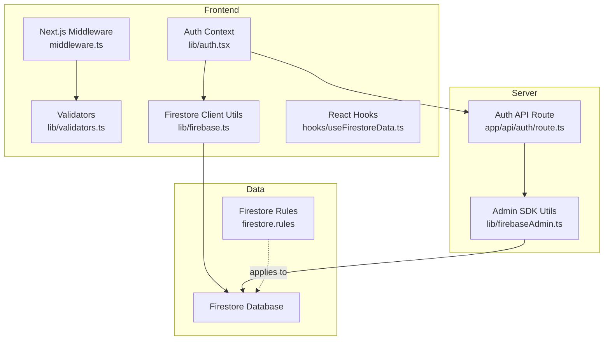
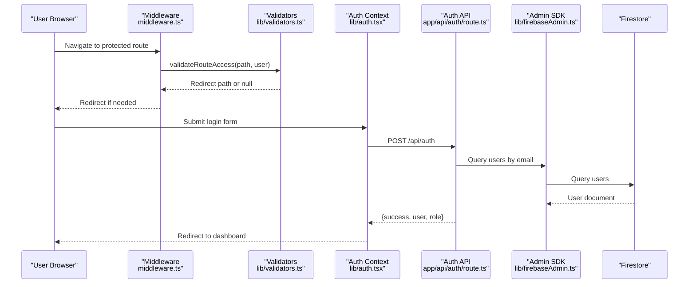
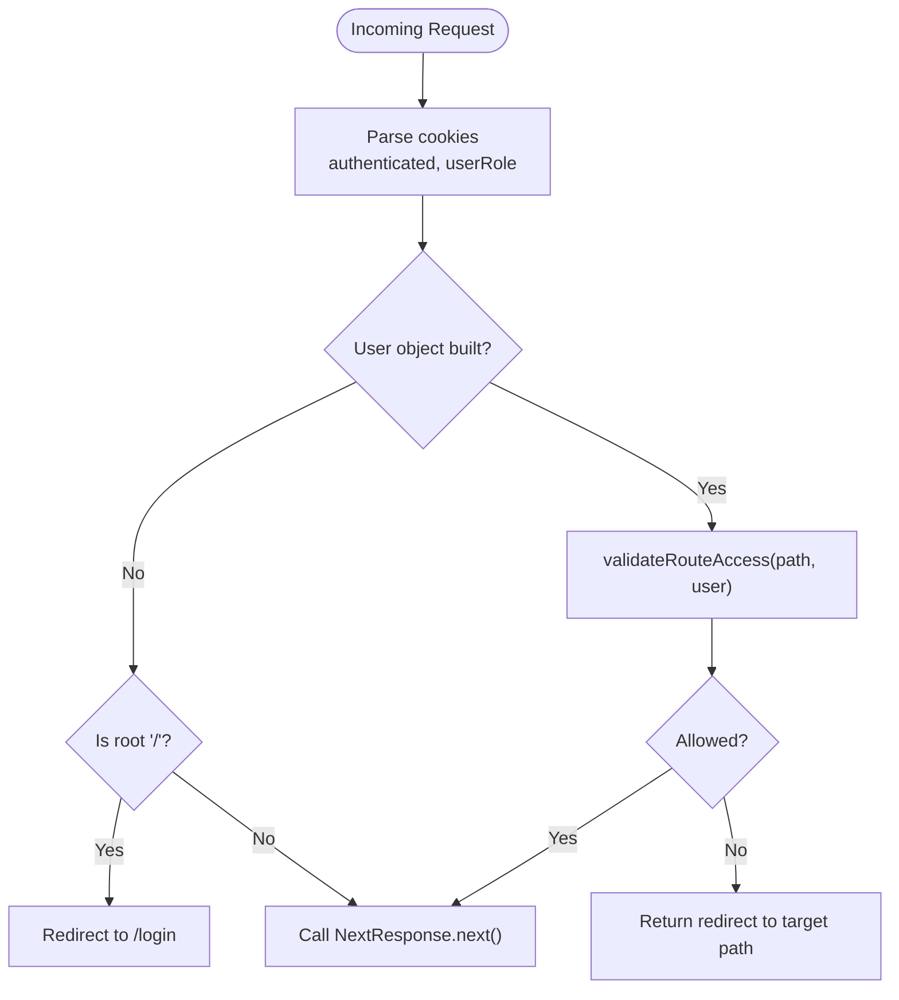
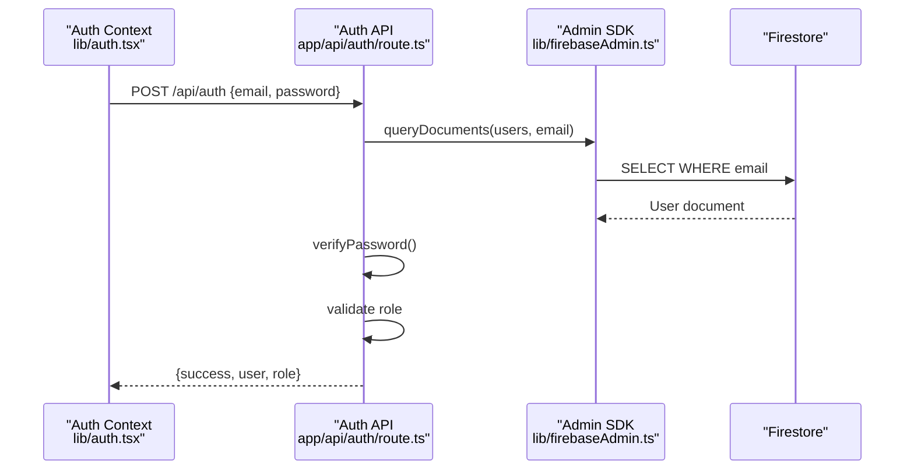
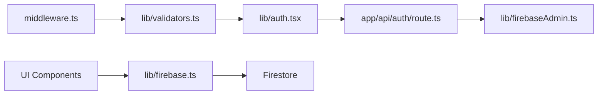

# Security Rules & Access Control

<cite>
**Referenced Files in This Document**
- [firestore.rules](file://firestore.rules)
- [middleware.ts](file://middleware.ts)
- [ROLE_BASED_ACCESS_CONTROL.md](file://ROLE_BASED_ACCESS_CONTROL.md)
- [lib/validators.ts](file://lib/validators.ts)
- [lib/auth.tsx](file://lib/auth.tsx)
- [app/api/auth/route.ts](file://app/api/auth/route.ts)
- [lib/firebase.ts](file://lib/firebase.ts)
- [lib/firebaseAdmin.ts](file://lib/firebaseAdmin.ts)
- [hooks/useFirestoreData.ts](file://hooks/useFirestoreData.ts)
- [scripts/frontend-firestore-test.js](file://scripts/frontend-firestore-test.js)
</cite>

## Table of Contents
1. [Introduction](#introduction)
2. [Project Structure](#project-structure)
3. [Core Components](#core-components)
4. [Architecture Overview](#architecture-overview)
5. [Detailed Component Analysis](#detailed-component-analysis)
6. [Dependency Analysis](#dependency-analysis)
7. [Performance Considerations](#performance-considerations)
8. [Troubleshooting Guide](#troubleshooting-guide)
9. [Conclusion](#conclusion)
10. [Appendices](#appendices)

## Introduction
This document explains the security model and access control implementation for the SAMPA Cooperative Management System. It focuses on:
- Current Firestore security rules and their limitations
- Role-based access control enforced by Next.js middleware and validators
- How authentication integrates with Firestore reads/writes
- Recommended patterns for implementing fine-grained Firestore security rules
- Best practices, pitfalls, and testing strategies

Important note: As of the current repository state, the Firestore security rules are permissive and must be hardened before deploying to production.

## Project Structure
The security system spans three layers:
- Frontend middleware and validators (Next.js)
- Authentication API (serverless)
- Firestore client utilities and Admin SDK

**Diagram sources**
- [middleware.ts](file://middleware.ts#L1-L62)
- [lib/validators.ts](file://lib/validators.ts#L1-L236)
- [lib/auth.tsx](file://lib/auth.tsx#L1-L682)
- [app/api/auth/route.ts](file://app/api/auth/route.ts#L1-L295)
- [lib/firebase.ts](file://lib/firebase.ts#L1-L309)
- [lib/firebaseAdmin.ts](file://lib/firebaseAdmin.ts#L1-L277)
- [firestore.rules](file://firestore.rules#L1-L19)

**Section sources**
- [middleware.ts](file://middleware.ts#L1-L62)
- [lib/validators.ts](file://lib/validators.ts#L1-L236)
- [lib/auth.tsx](file://lib/auth.tsx#L1-L682)
- [app/api/auth/route.ts](file://app/api/auth/route.ts#L1-L295)
- [lib/firebase.ts](file://lib/firebase.ts#L1-L309)
- [lib/firebaseAdmin.ts](file://lib/firebaseAdmin.ts#L1-L277)
- [firestore.rules](file://firestore.rules#L1-L19)

## Core Components
- Next.js Middleware enforces route-level access control using cookies and validators.
- Validators define allowed roles and route-specific access patterns.
- Authentication API validates credentials server-side and returns user role.
- Firestore client utilities encapsulate CRUD operations with error handling.
- Firestore rules currently permit all reads/writes; they must be hardened.

**Section sources**
- [middleware.ts](file://middleware.ts#L1-L62)
- [lib/validators.ts](file://lib/validators.ts#L1-L236)
- [app/api/auth/route.ts](file://app/api/auth/route.ts#L1-L295)
- [lib/firebase.ts](file://lib/firebase.ts#L1-L309)
- [firestore.rules](file://firestore.rules#L1-L19)

## Architecture Overview
The system uses a hybrid approach:
- Client-side middleware and validators restrict navigation to role-appropriate dashboards.
- Authentication occurs via a serverless route that queries Firestore using Admin SDK.
- Firestore client utilities are used for UI data access; they surface permission errors back to the UI.

**Diagram sources**
- [middleware.ts](file://middleware.ts#L1-L62)
- [lib/validators.ts](file://lib/validators.ts#L193-L236)
- [lib/auth.tsx](file://lib/auth.tsx#L197-L348)
- [app/api/auth/route.ts](file://app/api/auth/route.ts#L48-L264)
- [lib/firebaseAdmin.ts](file://lib/firebaseAdmin.ts#L150-L194)
- [lib/firebase.ts](file://lib/firebase.ts#L184-L240)

## Detailed Component Analysis

### Next.js Middleware and Route Validation
- Middleware extracts cookies to build a user object and delegates route validation to validators.
- Root path is redirected to login; API routes are excluded from middleware.
- Validators enforce:
  - Admin roles only access admin routes
  - User roles only access user routes
  - Role-specific dashboard restrictions
  - Conflict prevention between admin and user dashboards

**Diagram sources**
- [middleware.ts](file://middleware.ts#L5-L56)
- [lib/validators.ts](file://lib/validators.ts#L193-L236)

**Section sources**
- [middleware.ts](file://middleware.ts#L1-L62)
- [lib/validators.ts](file://lib/validators.ts#L1-L236)
- [ROLE_BASED_ACCESS_CONTROL.md](file://ROLE_BASED_ACCESS_CONTROL.md#L1-L89)

### Authentication API and Role Resolution
- Validates email format and checks Firestore for user existence.
- Verifies password using PBKDF2-derived hash or legacy plaintext comparison.
- Ensures role exists and is valid; returns user object and role to client.
- Updates last login timestamp.

**Diagram sources**
- [app/api/auth/route.ts](file://app/api/auth/route.ts#L48-L264)
- [lib/firebaseAdmin.ts](file://lib/firebaseAdmin.ts#L150-L194)

**Section sources**
- [app/api/auth/route.ts](file://app/api/auth/route.ts#L1-L295)
- [lib/firebaseAdmin.ts](file://lib/firebaseAdmin.ts#L1-L277)

### Firestore Client Utilities and Error Handling
- Provides typed helpers for CRUD operations with robust error handling.
- Distinguishes permission-denied errors and returns actionable messages.
- Used by UI components to access collections like members and users.

**Section sources**
- [lib/firebase.ts](file://lib/firebase.ts#L89-L309)
- [hooks/useFirestoreData.ts](file://hooks/useFirestoreData.ts#L167-L182)

### Current Firestore Rules and Their Implications
- The current rules grant broad read/write access to all documents.
- This is suitable for development but unsafe for production.
- Hardening requires introducing collection-level and field-level rules aligned with roles.

**Section sources**
- [firestore.rules](file://firestore.rules#L1-L19)

## Dependency Analysis
- Middleware depends on validators for access decisions.
- Auth Context depends on the Auth API for login and on cookies for session state.
- UI components depend on Firestore client utilities; Admin SDK is used server-side.
- Validators rely on a predefined role list and path mappings.

**Diagram sources**
- [middleware.ts](file://middleware.ts#L1-L62)
- [lib/validators.ts](file://lib/validators.ts#L1-L236)
- [lib/auth.tsx](file://lib/auth.tsx#L1-L682)
- [app/api/auth/route.ts](file://app/api/auth/route.ts#L1-L295)
- [lib/firebase.ts](file://lib/firebase.ts#L1-L309)
- [lib/firebaseAdmin.ts](file://lib/firebaseAdmin.ts#L1-L277)

**Section sources**
- [middleware.ts](file://middleware.ts#L1-L62)
- [lib/validators.ts](file://lib/validators.ts#L1-L236)
- [lib/auth.tsx](file://lib/auth.tsx#L1-L682)
- [app/api/auth/route.ts](file://app/api/auth/route.ts#L1-L295)
- [lib/firebase.ts](file://lib/firebase.ts#L1-L309)
- [lib/firebaseAdmin.ts](file://lib/firebaseAdmin.ts#L1-L277)

## Performance Considerations
- Middleware runs on every request; keep validations minimal and deterministic.
- Firestore queries should leverage indexes; consider adding composite indexes for frequent filters.
- Avoid unnecessary re-renders by caching resolved dashboard paths and role checks in memory.
- Batch updates and limit result sets to reduce latency and cost.

[No sources needed since this section provides general guidance]

## Troubleshooting Guide
Common permission-related issues and resolutions:
- Permission denied on collection access:
  - Confirm Firestore rules allow read access for the authenticated user’s role.
  - Use the frontend test script to validate access and receive contextual hints.
- Incorrect or missing role:
  - Ensure the user document contains a valid role; invalid roles are rejected.
- Middleware redirect loops:
  - Verify cookies are set correctly and not expired.
  - Check that validators return the expected redirect paths for the user’s role.
- Login failures:
  - Validate email format and ensure the user exists with a password set.
  - Confirm PBKDF2 parameters and timing-safe comparison logic.

**Section sources**
- [scripts/frontend-firestore-test.js](file://scripts/frontend-firestore-test.js#L37-L106)
- [app/api/auth/route.ts](file://app/api/auth/route.ts#L165-L192)
- [lib/validators.ts](file://lib/validators.ts#L112-L191)
- [lib/firebase.ts](file://lib/firebase.ts#L174-L180)

## Conclusion
The current system provides strong client-side route protection and a secure authentication flow. However, Firestore security rules must be hardened to enforce read/write boundaries per role and field. Implementing collection-level and field-level rules, combined with index-backed queries and strict validation, will deliver a robust, production-ready access control system.

[No sources needed since this section summarizes without analyzing specific files]

## Appendices

### Recommended Firestore Security Rule Patterns
- Collection-level rules: Enforce read/write based on user role and document ownership.
- Field-level rules: Restrict sensitive fields (e.g., financial data) to specific roles.
- Conditional access: Allow self-service updates only for own documents; require elevated roles for administrative actions.
- Timestamps and metadata: Use server timestamps and disallow client writes for audit fields.

Note: These are conceptual recommendations. Implement them carefully and test thoroughly before deploying.

[No sources needed since this section provides general guidance]

### Role-to-Dashboard Mapping
- Admin roles: Redirected to role-specific dashboards.
- Member, Driver, Operator: Redirected to user dashboards.
- Middleware prevents cross-access between admin and user dashboards.

**Section sources**
- [ROLE_BASED_ACCESS_CONTROL.md](file://ROLE_BASED_ACCESS_CONTROL.md#L1-L89)
- [lib/validators.ts](file://lib/validators.ts#L137-L191)

### Testing Strategies for Security Rules
- Use the provided frontend test script to validate read access to collections.
- Simulate various roles and access patterns to uncover rule gaps.
- Gradually tighten rules and monitor UI error messages for permission-denied cases.
- Verify that only authorized fields are readable/writable per role.

**Section sources**
- [scripts/frontend-firestore-test.js](file://scripts/frontend-firestore-test.js#L37-L106)
- [lib/firebase.ts](file://lib/firebase.ts#L174-L180)