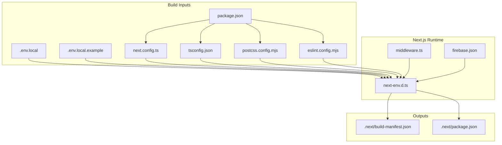
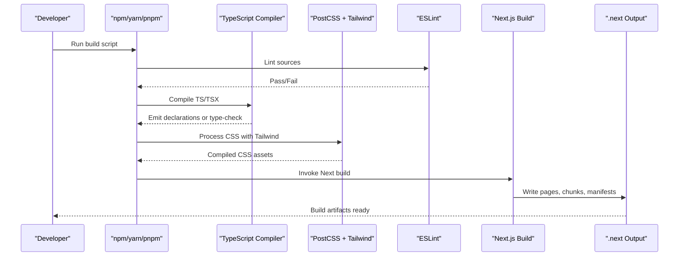
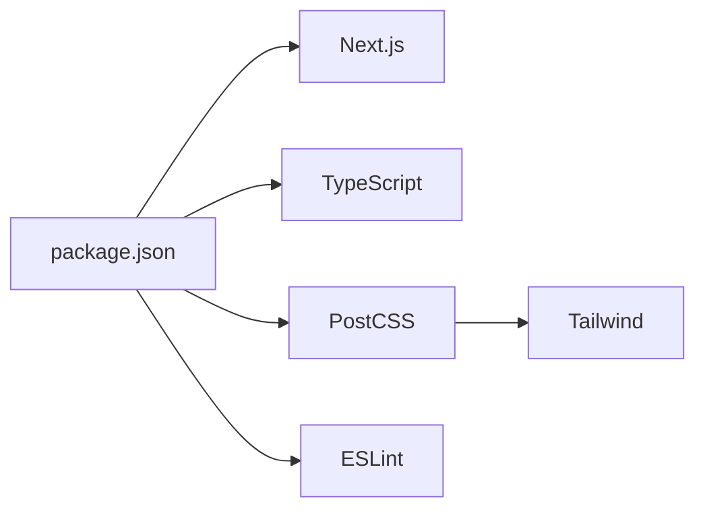

# Build Configuration

<cite>
**Referenced Files in This Document**
- [next.config.ts](file://next.config.ts)
- [tsconfig.json](file://tsconfig.json)
- [package.json](file://package.json)
- [postcss.config.mjs](file://postcss.config.mjs)
- [eslint.config.mjs](file://eslint.config.mjs)
- [.env.local](file://.env.local)
- [.env.local.example](file://.env.local.example)
- [next-env.d.ts](file://next-env.d.ts)
- [middleware.ts](file://middleware.ts)
- [firebase.json](file://firebase.json)
- [build-manifest.json](file://.next/build-manifest.json)
- [.next/package.json](file://.next/package.json)
</cite>

## Table of Contents
1. [Introduction](#introduction)
2. [Project Structure](#project-structure)
3. [Core Components](#core-components)
4. [Architecture Overview](#architecture-overview)
5. [Detailed Component Analysis](#detailed-component-analysis)
6. [Dependency Analysis](#dependency-analysis)
7. [Performance Considerations](#performance-considerations)
8. [Troubleshooting Guide](#troubleshooting-guide)
9. [Conclusion](#conclusion)
10. [Appendices](#appendices)

## Introduction
This document explains the build configuration for the SAMPA Cooperative Management System. It covers Next.js configuration, TypeScript compiler options, package scripts and dependencies, PostCSS and Tailwind integration, ESLint configuration, and environment variables that influence builds. Practical guidance is included for optimizing production builds, customizing configurations per environment, and resolving common build issues.

## Project Structure
The build system centers around Next.js App Router with modern tooling:
- Next.js configuration is minimal and ready for future enhancements.
- TypeScript is configured for strictness, incremental builds, and bundler module resolution.
- Tailwind CSS is integrated via PostCSS with Tailwind’s official PostCSS plugin.
- ESLint enforces Next.js app conventions and TypeScript best practices.
- Environment variables are used for service keys and runtime configuration.

**Diagram sources**
- [package.json](file://package.json#L1-L53)
- [next.config.ts](file://next.config.ts#L1-L8)
- [tsconfig.json](file://tsconfig.json#L1-L35)
- [postcss.config.mjs](file://postcss.config.mjs#L1-L8)
- [eslint.config.mjs](file://eslint.config.mjs#L1-L19)
- [.env.local](file://.env.local#L1-L9)
- [.env.local.example](file://.env.local.example#L1-L10)
- [next-env.d.ts](file://next-env.d.ts#L1-L7)
- [middleware.ts](file://middleware.ts#L1-L62)
- [firebase.json](file://firebase.json#L1-L9)
- [build-manifest.json](file://.next/build-manifest.json#L1-L21)
- [.next/package.json](file://.next/package.json#L1-L1)

**Section sources**
- [package.json](file://package.json#L1-L53)
- [next.config.ts](file://next.config.ts#L1-L8)
- [tsconfig.json](file://tsconfig.json#L1-L35)
- [postcss.config.mjs](file://postcss.config.mjs#L1-L8)
- [eslint.config.mjs](file://eslint.config.mjs#L1-L19)
- [.env.local](file://.env.local#L1-L9)
- [.env.local.example](file://.env.local.example#L1-L10)
- [next-env.d.ts](file://next-env.d.ts#L1-L7)
- [middleware.ts](file://middleware.ts#L1-L62)
- [firebase.json](file://firebase.json#L1-L9)
- [build-manifest.json](file://.next/build-manifest.json#L1-L21)
- [.next/package.json](file://.next/package.json#L1-L1)

## Core Components
- Next.js configuration: Minimal configuration file; ready for future experimental features and optimization toggles.
- TypeScript configuration: Strict mode, incremental builds, bundler module resolution, path aliases, and isolated modules for fast builds.
- Scripts and dependencies: Standard Next.js scripts plus domain-specific deployment and diagnostic scripts.
- PostCSS and Tailwind: Official Tailwind PostCSS plugin enabled; Tailwind v4 recommended.
- ESLint: Next.js core-web-vitals and TypeScript configs applied with overrides for ignored paths.
- Environment variables: Public keys for EmailJS and Firebase Admin credentials for backend tasks.

**Section sources**
- [next.config.ts](file://next.config.ts#L1-L8)
- [tsconfig.json](file://tsconfig.json#L1-L35)
- [package.json](file://package.json#L1-L53)
- [postcss.config.mjs](file://postcss.config.mjs#L1-L8)
- [eslint.config.mjs](file://eslint.config.mjs#L1-L19)
- [.env.local](file://.env.local#L1-L9)
- [.env.local.example](file://.env.local.example#L1-L10)

## Architecture Overview
The build pipeline integrates TypeScript compilation, PostCSS/Tailwind processing, ESLint checks, and Next.js compilation. Environment variables feed into the build and runtime.

**Diagram sources**
- [package.json](file://package.json#L5-L14)
- [tsconfig.json](file://tsconfig.json#L16-L20)
- [postcss.config.mjs](file://postcss.config.mjs#L1-L8)
- [eslint.config.mjs](file://eslint.config.mjs#L1-L19)
- [build-manifest.json](file://.next/build-manifest.json#L1-L21)

## Detailed Component Analysis

### Next.js Configuration (next.config.ts)
- Purpose: Centralized Next.js configuration file for the project.
- Current state: Empty configuration object; ready for future additions such as experimental features, output tracing, or custom webpack.
- Recommendations:
  - Enable output tracing for smaller serverless bundles in Vercel or similar platforms.
  - Consider enabling React Server Components optimizations and Turbopack-related flags if experimenting.
  - Add assetPrefix and basePath for CDN or subpath deployments.
  - Configure experimental features cautiously and test thoroughly.

Practical usage:
- Extend the configuration object to add optimization flags or experimental toggles.
- Keep environment-specific overrides external (e.g., via environment variables) to avoid committing secrets.

**Section sources**
- [next.config.ts](file://next.config.ts#L1-L8)

### TypeScript Configuration (tsconfig.json)
Compiler options:
- Target and libraries: ES2017 with DOM and ESNext libs for modern browser support.
- Strictness: Enabled for safer code and better DX.
- Module system: ESNext with bundler resolution for optimal tree-shaking.
- JSX: React JSX transform for efficient React builds.
- Incremental and isolated modules: Faster rebuilds during development.
- Plugins: Next.js TypeScript plugin enabled.
- Path aliases: @/* mapped to project root for clean imports.

Type inclusion and exclusion:
- Includes Next.js generated types and development types.
- Excludes node_modules globally.

Recommendations:
- Keep target aligned with deployed runtime environments.
- Prefer bundler module resolution for modern bundlers.
- Use path aliases consistently to improve readability.

**Section sources**
- [tsconfig.json](file://tsconfig.json#L1-L35)
- [next-env.d.ts](file://next-env.d.ts#L1-L7)

### Package Scripts and Dependencies
Scripts:
- Development: Starts Next.js dev server.
- Build: Produces optimized production output.
- Start: Runs production server.
- Lint: Executes ESLint against project files.
- Domain scripts: Deployment and diagnostic helpers for Firestore and Firebase.

Dependencies:
- Next.js, React, and React DOM: Core framework and UI library.
- Firebase and Firebase Admin: Backend and client integrations.
- EmailJS and related packages: Email delivery.
- Tailwind CSS v4 and PostCSS plugin: Styling pipeline.
- Recharts, react-hook-form, lucide-react: UI and UX components.
- Express and body-parser: Optional backend services.

Dev dependencies:
- TypeScript, ESLint, and Next.js ESLint configs for type-aware linting.

Environment variables:
- Public keys for EmailJS and Firebase Admin credentials for backend tasks.

**Section sources**
- [package.json](file://package.json#L1-L53)
- [.env.local](file://.env.local#L1-L9)
- [.env.local.example](file://.env.local.example#L1-L10)

### PostCSS and Tailwind Integration
- PostCSS configuration enables the official Tailwind PostCSS plugin.
- Tailwind v4 is indicated via the dev dependency; ensure Tailwind is configured to scan app files and purge unused styles appropriately.

Integration flow:
- PostCSS processes CSS files and applies Tailwind directives.
- Next.js compiles and bundles CSS with the processed output.

Recommendations:
- Configure Tailwind’s content paths to include app directory and components.
- Use purge or content settings to remove unused CSS in production.

**Section sources**
- [postcss.config.mjs](file://postcss.config.mjs#L1-L8)
- [package.json](file://package.json#L42-L49)

### ESLint Configuration
- Uses Next.js ESLint configs for core web vitals and TypeScript support.
- Overrides default ignores to exclude Next.js build artifacts and environment typings from linting.
- Ensures consistent code quality and type safety across the codebase.

Recommendations:
- Add project-specific rules as needed while keeping Next.js defaults.
- Run lint-staged in pre-commit hooks to prevent problematic commits.

**Section sources**
- [eslint.config.mjs](file://eslint.config.mjs#L1-L19)
- [package.json](file://package.json#L47-L48)

### Environment Variables and Middleware Impact
- Public environment variables for EmailJS and Firebase are loaded at runtime.
- Middleware performs route validation and redirects; it does not alter build-time behavior but affects runtime routing.

Recommendations:
- Store sensitive keys in secure secret managers for production.
- Keep .env.local.example updated with required keys for team onboarding.

**Section sources**
- [.env.local](file://.env.local#L1-L9)
- [.env.local.example](file://.env.local.example#L1-L10)
- [middleware.ts](file://middleware.ts#L1-L62)

## Dependency Analysis
The build configuration relies on a tight coupling between Next.js, TypeScript, PostCSS/Tailwind, and ESLint. Dependencies are declared in package.json and consumed by the build pipeline.

**Diagram sources**
- [package.json](file://package.json#L16-L51)
- [postcss.config.mjs](file://postcss.config.mjs#L1-L8)
- [eslint.config.mjs](file://eslint.config.mjs#L1-L19)

**Section sources**
- [package.json](file://package.json#L1-L53)

## Performance Considerations
- Next.js build output manifest indicates chunk and polyfill files; ensure only necessary chunks are included.
- Use incremental TypeScript builds to speed up local iteration.
- Tailwind purging reduces CSS bundle size; configure content globs to match all Tailwind usage.
- Keep module resolution set to bundler for optimal tree-shaking.
- Avoid unnecessary dynamic imports and large third-party dependencies in initial pages.

[No sources needed since this section provides general guidance]

## Troubleshooting Guide
Common build issues and resolutions:
- Missing generated types during type checks:
  - Ensure Next.js dev types are present and tsconfig includes Next.js type paths.
  - Verify next-env.d.ts exists and references Next.js types.
- Tailwind classes not applied:
  - Confirm PostCSS plugin is enabled and Tailwind content paths include all relevant files.
  - Re-run build after updating Tailwind configuration.
- ESLint errors on build:
  - Review overrides in ESLint config and ensure ignored paths align with project structure.
- Environment variable failures:
  - Validate .env.local and .env.local.example entries; ensure secrets are properly escaped for multi-line keys.
- Middleware redirect loops:
  - Inspect middleware matcher and redirect logic to avoid cycles.

**Section sources**
- [next-env.d.ts](file://next-env.d.ts#L1-L7)
- [tsconfig.json](file://tsconfig.json#L25-L31)
- [postcss.config.mjs](file://postcss.config.mjs#L1-L8)
- [eslint.config.mjs](file://eslint.config.mjs#L5-L16)
- [.env.local](file://.env.local#L1-L9)
- [.env.local.example](file://.env.local.example#L1-L10)
- [middleware.ts](file://middleware.ts#L58-L62)

## Conclusion
The build configuration for SAMPA Cooperative Management System is modern and extensible. Next.js, TypeScript, PostCSS/Tailwind, and ESLint are configured to support rapid development and reliable production builds. By leveraging incremental compilation, Tailwind purging, and environment-driven configuration, teams can optimize both developer experience and runtime performance.

[No sources needed since this section summarizes without analyzing specific files]

## Appendices

### Practical Build Commands
- Development: Start the Next.js dev server.
- Production build: Produce optimized output for deployment.
- Production start: Run the compiled server.
- Lint: Execute ESLint across the project.

These commands correspond to the scripts defined in the project’s package configuration.

**Section sources**
- [package.json](file://package.json#L5-L14)

### Customizing for Different Environments
- Local development: Use .env.local for local secrets and overrides.
- Staging/production: Provide environment variables via platform secrets or CI/CD variables.
- Next.js configuration: Add environment-specific overrides outside the repository (e.g., via platform settings) to keep secrets out of version control.

**Section sources**
- [.env.local](file://.env.local#L1-L9)
- [.env.local.example](file://.env.local.example#L1-L10)
- [next.config.ts](file://next.config.ts#L1-L8)

### Production Optimization Strategies
- Enable output tracing in Next.js configuration for reduced serverless bundle sizes.
- Configure Tailwind content scanning and purging to minimize CSS payload.
- Keep TypeScript strict and incremental for faster CI builds.
- Use path aliases consistently to simplify imports and improve maintainability.

**Section sources**
- [next.config.ts](file://next.config.ts#L1-L8)
- [tsconfig.json](file://tsconfig.json#L1-L35)
- [postcss.config.mjs](file://postcss.config.mjs#L1-L8)