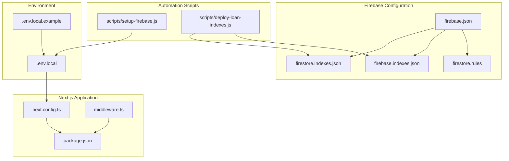
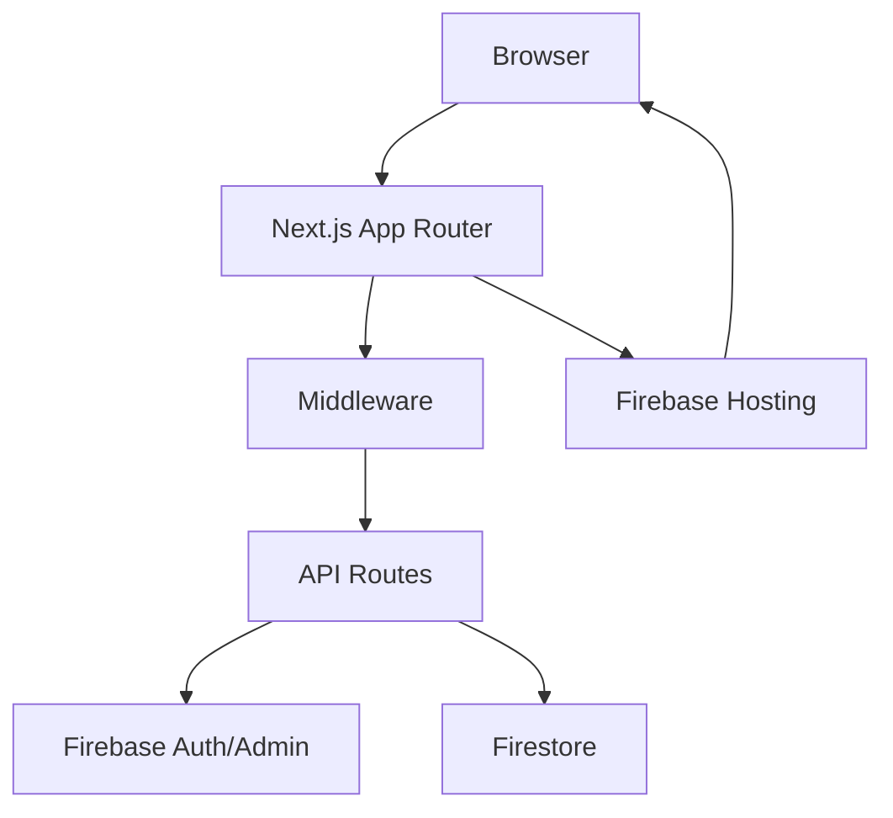
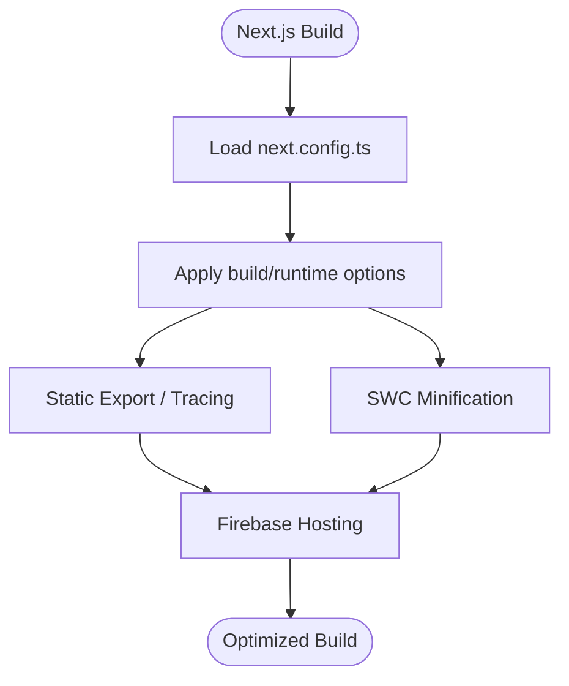
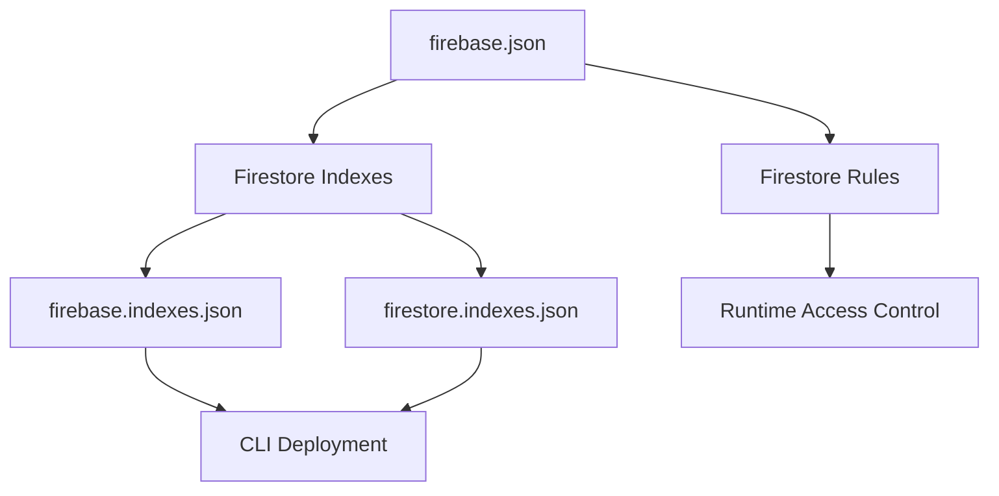
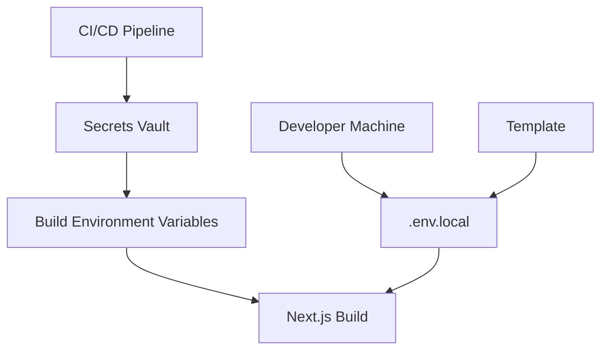
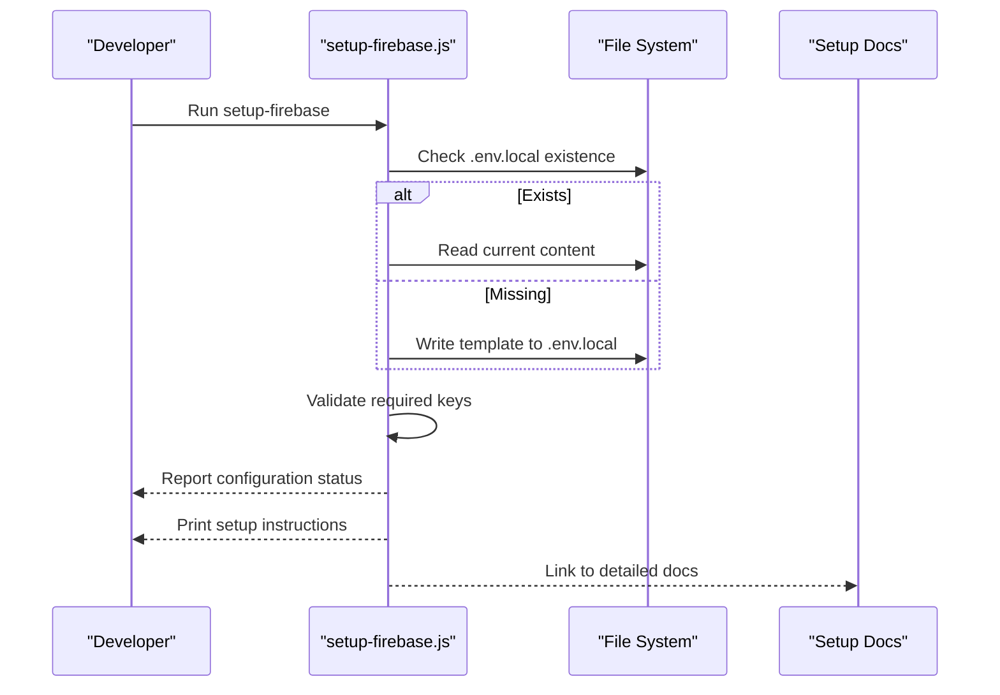
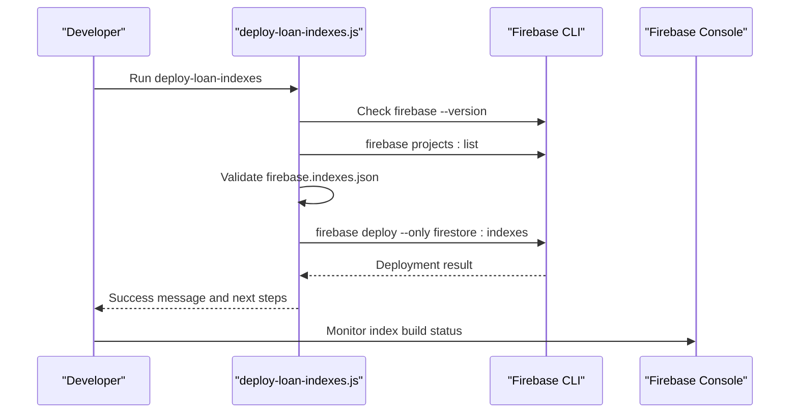
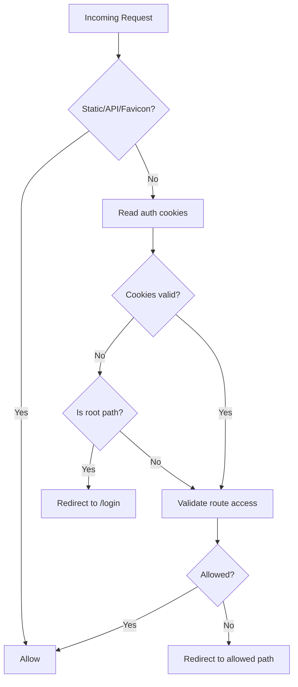
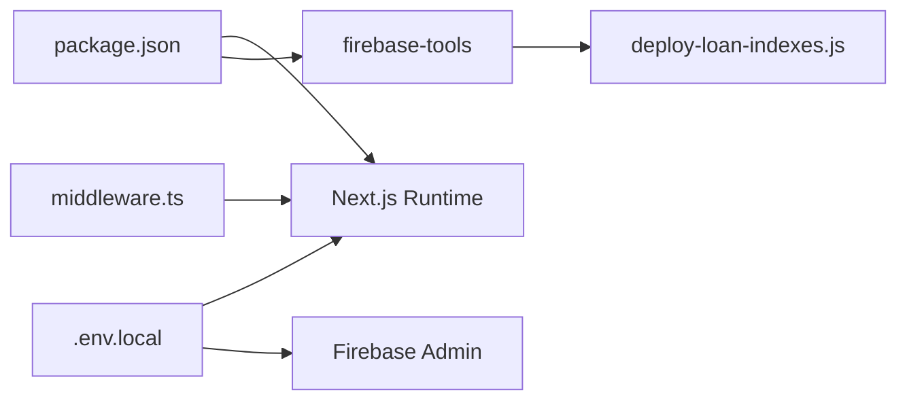

# Deployment & DevOps

<cite>
**Referenced Files in This Document**
- [next.config.ts](file://next.config.ts)
- [package.json](file://package.json)
- [firebase.json](file://firebase.json)
- [firebase.indexes.json](file://firebase.indexes.json)
- [firestore.indexes.json](file://firestore.indexes.json)
- [firestore.rules](file://firestore.rules)
- [.env.local](file://.env.local)
- [.env.local.example](file://.env.local.example)
- [scripts/setup-firebase.js](file://scripts/setup-firebase.js)
- [scripts/deploy-loan-indexes.js](file://scripts/deploy-loan-indexes.js)
- [FIREBASE_SETUP_INSTRUCTIONS.md](file://FIREBASE_SETUP_INSTRUCTIONS.md)
- [FIX_FIREBASE_ERROR.md](file://FIX_FIREBASE_ERROR.md)
- [docs/FIRESTORE_INDEXES.md](file://docs/FIRESTORE_INDEXES.md)
- [middleware.ts](file://middleware.ts)
</cite>

## Table of Contents
1. [Introduction](#introduction)
2. [Project Structure](#project-structure)
3. [Core Components](#core-components)
4. [Architecture Overview](#architecture-overview)
5. [Detailed Component Analysis](#detailed-component-analysis)
6. [Dependency Analysis](#dependency-analysis)
7. [Performance Considerations](#performance-considerations)
8. [Troubleshooting Guide](#troubleshooting-guide)
9. [Conclusion](#conclusion)
10. [Appendices](#appendices)

## Introduction
This document provides comprehensive deployment and DevOps guidance for the SAMPA Cooperative Management System. It covers Next.js build configuration, Firebase setup and deployment, Firestore security rules and index management, CI/CD and automation strategies, environment separation across development, staging, and production, monitoring and logging, performance optimizations, rollback procedures, and practical deployment examples.

## Project Structure
The repository follows a standard Next.js 13+ App Router project layout with TypeScript, alongside Firebase configuration and deployment scripts. Key areas relevant to deployment and DevOps include:
- Next.js configuration and build pipeline
- Firebase project configuration and Firestore settings
- Environment variables for local and CI contexts
- Automation scripts for Firebase setup and index deployment
- Middleware for routing and access control

**Diagram sources**
- [next.config.ts](file://next.config.ts#L1-L8)
- [package.json](file://package.json#L1-L53)
- [middleware.ts](file://middleware.ts#L1-L62)
- [firebase.json](file://firebase.json#L1-L9)
- [firestore.rules](file://firestore.rules#L1-L19)
- [firebase.indexes.json](file://firebase.indexes.json#L1-L83)
- [firestore.indexes.json](file://firestore.indexes.json#L1-L83)
- [scripts/setup-firebase.js](file://scripts/setup-firebase.js#L1-L93)
- [scripts/deploy-loan-indexes.js](file://scripts/deploy-loan-indexes.js#L1-L100)
- [.env.local](file://.env.local#L1-L9)
- [.env.local.example](file://.env.local.example#L1-L10)

**Section sources**
- [next.config.ts](file://next.config.ts#L1-L8)
- [package.json](file://package.json#L1-L53)
- [firebase.json](file://firebase.json#L1-L9)
- [firestore.rules](file://firestore.rules#L1-L19)
- [firebase.indexes.json](file://firebase.indexes.json#L1-L83)
- [firestore.indexes.json](file://firestore.indexes.json#L1-L83)
- [scripts/setup-firebase.js](file://scripts/setup-firebase.js#L1-L93)
- [scripts/deploy-loan-indexes.js](file://scripts/deploy-loan-indexes.js#L1-L100)
- [.env.local](file://.env.local#L1-L9)
- [.env.local.example](file://.env.local.example#L1-L10)

## Core Components
- Next.js build and runtime configuration
- Firebase project configuration and Firestore settings
- Environment variable management
- Firestore security rules and composite index definitions
- Deployment automation scripts

**Section sources**
- [next.config.ts](file://next.config.ts#L1-L8)
- [package.json](file://package.json#L5-L14)
- [firebase.json](file://firebase.json#L1-L9)
- [firestore.rules](file://firestore.rules#L1-L19)
- [firebase.indexes.json](file://firebase.indexes.json#L1-L83)
- [firestore.indexes.json](file://firestore.indexes.json#L1-L83)
- [.env.local](file://.env.local#L1-L9)
- [.env.local.example](file://.env.local.example#L1-L10)

## Architecture Overview
The deployment architecture integrates Next.js frontend with Firebase backend services. The middleware enforces route-level access control, while Firebase manages authentication, Firestore, and hosting. Composite indexes are defined centrally to optimize query performance.

**Diagram sources**
- [middleware.ts](file://middleware.ts#L1-L62)
- [package.json](file://package.json#L5-L14)
- [firebase.json](file://firebase.json#L1-L9)

## Detailed Component Analysis

### Next.js Build Configuration
- Purpose: Centralizes Next.js configuration options for the application.
- Current state: Minimal configuration placeholder present.
- Recommendations:
  - Enable output tracing and static export if hosting via Firebase Hosting.
  - Configure image optimization domains and remotePatterns for asset delivery.
  - Set experimental React 19 features if compatibility is validated.
  - Define runtime configuration for environment variables used at build time.
  - Enable SWC minification and Turbopack for faster builds in CI.

**Diagram sources**
- [next.config.ts](file://next.config.ts#L1-L8)
- [package.json](file://package.json#L5-L14)

**Section sources**
- [next.config.ts](file://next.config.ts#L1-L8)
- [package.json](file://package.json#L5-L14)

### Firebase Project Configuration
- firebase.json
  - Defines Firestore database location, rules, and indexes.
  - Sets database identifier and region for deployment consistency.
- Security rules
  - Current rules allow read/write for all documents; intended for development.
  - Replace with role-based rules before production deployment.
- Indexes
  - Composite indexes for loanRequests collection group are defined in both firebase.indexes.json and firestore.indexes.json.
  - Indexes enable efficient queries by status with date ordering and pagination support.

**Diagram sources**
- [firebase.json](file://firebase.json#L1-L9)
- [firestore.rules](file://firestore.rules#L1-L19)
- [firebase.indexes.json](file://firebase.indexes.json#L1-L83)
- [firestore.indexes.json](file://firestore.indexes.json#L1-L83)

**Section sources**
- [firebase.json](file://firebase.json#L1-L9)
- [firestore.rules](file://firestore.rules#L1-L19)
- [firebase.indexes.json](file://firebase.indexes.json#L1-L83)
- [firestore.indexes.json](file://firestore.indexes.json#L1-L83)

### Environment Variable Handling
- Local development
  - .env.local holds client-side and server-side keys for Firebase Admin and Client SDKs.
  - .env.local.example provides a template with placeholder values and formatting notes.
- CI/CD
  - Store secrets in CI provider’s secret vaults.
  - Map secrets to environment variables during build and deploy jobs.
  - Use separate variables for development, staging, and production.

**Diagram sources**
- [.env.local](file://.env.local#L1-L9)
- [.env.local.example](file://.env.local.example#L1-L10)
- [package.json](file://package.json#L5-L14)

**Section sources**
- [.env.local](file://.env.local#L1-L9)
- [.env.local.example](file://.env.local.example#L1-L10)
- [package.json](file://package.json#L5-L14)

### Firebase Setup Script
- Purpose: Automates Firebase Admin and Client SDK credential population in .env.local.
- Features:
  - Detects existing .env.local and creates a template if missing.
  - Validates presence of required keys and prompts for updates.
  - Provides step-by-step instructions for obtaining credentials from Firebase Console.
  - Emphasizes correct formatting for the private key (escape sequences and single-line format).

**Diagram sources**
- [scripts/setup-firebase.js](file://scripts/setup-firebase.js#L1-L93)
- [.env.local](file://.env.local#L1-L9)
- [.env.local.example](file://.env.local.example#L1-L10)
- [FIREBASE_SETUP_INSTRUCTIONS.md](file://FIREBASE_SETUP_INSTRUCTIONS.md#L1-L63)
- [FIX_FIREBASE_ERROR.md](file://FIX_FIREBASE_ERROR.md#L1-L88)

**Section sources**
- [scripts/setup-firebase.js](file://scripts/setup-firebase.js#L1-L93)
- [.env.local](file://.env.local#L1-L9)
- [.env.local.example](file://.env.local.example#L1-L10)
- [FIREBASE_SETUP_INSTRUCTIONS.md](file://FIREBASE_SETUP_INSTRUCTIONS.md#L1-L63)
- [FIX_FIREBASE_ERROR.md](file://FIX_FIREBASE_ERROR.md#L1-L88)

### Firestore Index Deployment Script
- Purpose: Automates deployment of composite indexes required for loan requests queries.
- Prerequisites:
  - firebase-tools installed globally.
  - Logged into Firebase CLI.
  - firebase.indexes.json present in project root.
- Workflow:
  - Verifies CLI and authentication.
  - Reads required index definitions.
  - Executes firebase deploy for Firestore indexes.
  - Guides post-deployment verification and troubleshooting.

**Diagram sources**
- [scripts/deploy-loan-indexes.js](file://scripts/deploy-loan-indexes.js#L1-L100)
- [firebase.indexes.json](file://firebase.indexes.json#L1-L83)
- [firestore.indexes.json](file://firestore.indexes.json#L1-L83)

**Section sources**
- [scripts/deploy-loan-indexes.js](file://scripts/deploy-loan-indexes.js#L1-L100)
- [firebase.indexes.json](file://firebase.indexes.json#L1-L83)
- [firestore.indexes.json](file://firestore.indexes.json#L1-L83)
- [docs/FIRESTORE_INDEXES.md](file://docs/FIRESTORE_INDEXES.md#L1-L110)

### Middleware and Route Access Control
- Purpose: Enforces authentication and role-based access control for pages.
- Behavior:
  - Skips middleware for static assets, images, API routes, and favicon.
  - Parses authentication cookies to derive user identity and role.
  - Redirects root path to login.
  - Validates route access and redirects accordingly.

**Diagram sources**
- [middleware.ts](file://middleware.ts#L1-L62)

**Section sources**
- [middleware.ts](file://middleware.ts#L1-L62)

## Dependency Analysis
- Next.js depends on Node.js runtime and build tools defined in package.json.
- Firebase CLI is required for index deployment automation.
- Environment variables drive client and server configurations.
- Middleware depends on validators and cookie parsing.

**Diagram sources**
- [package.json](file://package.json#L5-L14)
- [scripts/deploy-loan-indexes.js](file://scripts/deploy-loan-indexes.js#L1-L100)
- [.env.local](file://.env.local#L1-L9)
- [middleware.ts](file://middleware.ts#L1-L62)

**Section sources**
- [package.json](file://package.json#L5-L14)
- [scripts/deploy-loan-indexes.js](file://scripts/deploy-loan-indexes.js#L1-L100)
- [.env.local](file://.env.local#L1-L9)
- [middleware.ts](file://middleware.ts#L1-L62)

## Performance Considerations
- Next.js
  - Enable static export and output tracing for smaller bundles.
  - Use SWC minification and Turbopack for faster builds.
  - Configure image optimization and CDN for assets.
- Firebase
  - Maintain composite indexes to avoid query errors and latency spikes.
  - Use collection group queries judiciously; ensure appropriate index coverage.
  - Monitor index build status and remove unused indexes.
- Monitoring
  - Integrate Firebase Performance Monitoring and Crashlytics.
  - Log meaningful telemetry from API routes and middleware.
- Caching
  - Leverage Next.js caching and CDN for static content.
  - Use Firestore query cursors for efficient pagination.

[No sources needed since this section provides general guidance]

## Troubleshooting Guide
- Firebase Admin SDK initialization fails
  - Ensure .env.local contains real values for project ID, client email, and private key.
  - Confirm private key formatting with proper escape sequences and single-line format.
  - Refer to detailed setup and fix guides for step-by-step resolution.
- Missing composite indexes for loan requests
  - Deploy indexes using the automation script or Firebase Console.
  - Verify index status shows “Enabled” before testing queries.
- Middleware redirect loops
  - Check cookie parsing and route validation logic.
  - Ensure root path redirection is handled correctly.

**Section sources**
- [FIX_FIREBASE_ERROR.md](file://FIX_FIREBASE_ERROR.md#L1-L88)
- [FIREBASE_SETUP_INSTRUCTIONS.md](file://FIREBASE_SETUP_INSTRUCTIONS.md#L1-L63)
- [scripts/deploy-loan-indexes.js](file://scripts/deploy-loan-indexes.js#L1-L100)
- [docs/FIRESTORE_INDEXES.md](file://docs/FIRESTORE_INDEXES.md#L71-L109)
- [middleware.ts](file://middleware.ts#L1-L62)

## Conclusion
This guide consolidates deployment and DevOps practices for the SAMPA Cooperative Management System. By leveraging Next.js configuration, Firebase project settings, environment separation, and automation scripts, teams can achieve reliable, scalable deployments. Adopt role-based security rules, maintain composite indexes, and integrate monitoring for robust production operations.

[No sources needed since this section summarizes without analyzing specific files]

## Appendices

### A. Environment Management Across Environments
- Development
  - Use .env.local for local overrides.
  - Keep sensitive values out of version control.
- Staging
  - Mirror production structure with dedicated Firebase project and indexes.
  - Validate middleware and API routes against staging credentials.
- Production
  - Store secrets in CI provider’s secret vaults.
  - Enforce strict security rules and monitor index build progress.

[No sources needed since this section provides general guidance]

### B. CI/CD Pipeline and Automated Testing
- Build and test
  - Use Next.js build and lint scripts in CI.
  - Run Firebase CLI commands for index deployment.
- Deploy
  - Deploy frontend to Firebase Hosting.
  - Deploy Firestore indexes and rules via CLI.
- Rollback
  - Tag releases and pin versions for safe rollbacks.
  - Revert Firestore rules and indexes to previous working versions.

[No sources needed since this section provides general guidance]

### C. Practical Deployment Commands
- Initialize Firebase credentials locally
  - Run the setup script to generate/update .env.local.
- Deploy Firestore indexes
  - Use the automation script to deploy composite indexes.
- Build and start the Next.js app
  - Use standard Next.js scripts for development and production.

**Section sources**
- [scripts/setup-firebase.js](file://scripts/setup-firebase.js#L1-L93)
- [scripts/deploy-loan-indexes.js](file://scripts/deploy-loan-indexes.js#L1-L100)
- [package.json](file://package.json#L5-L14)