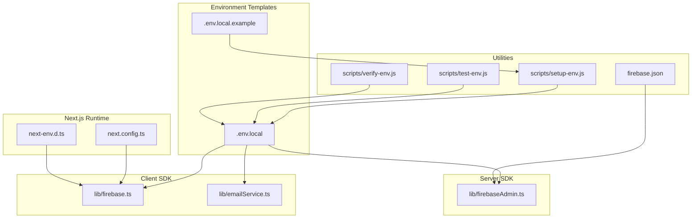
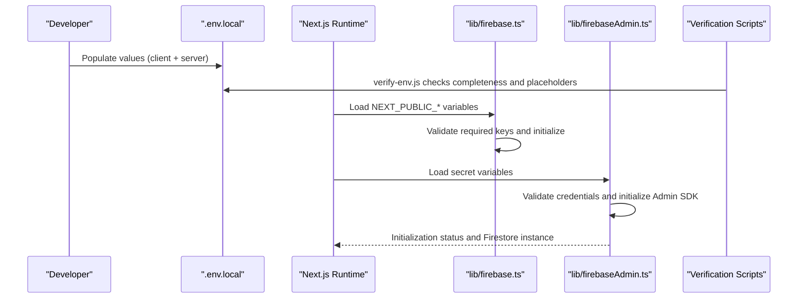
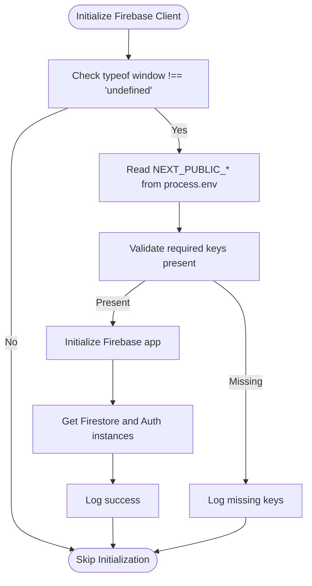
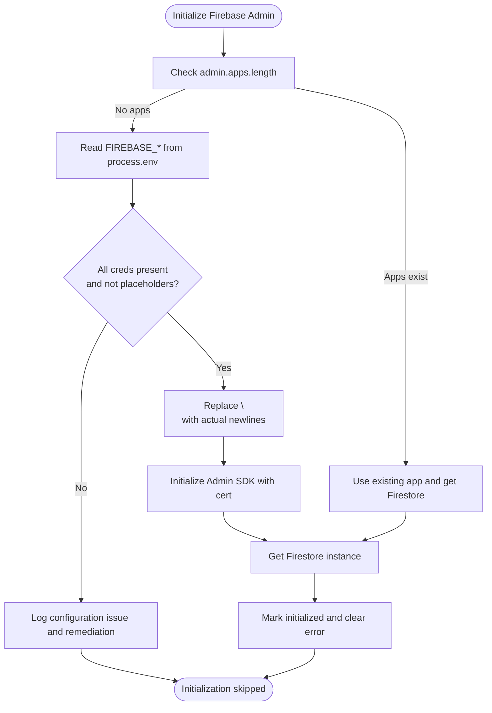
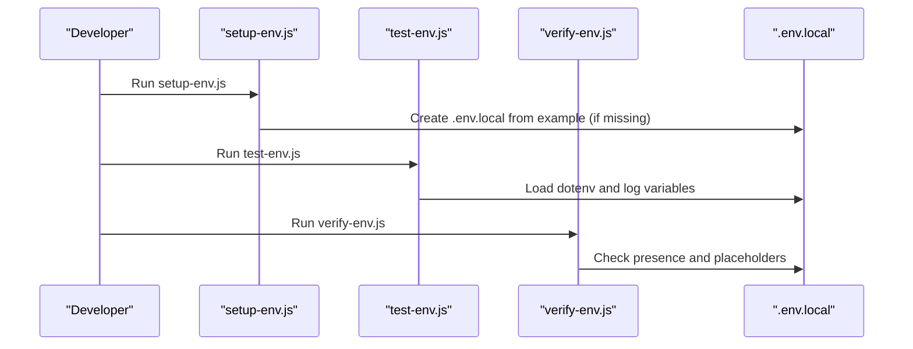
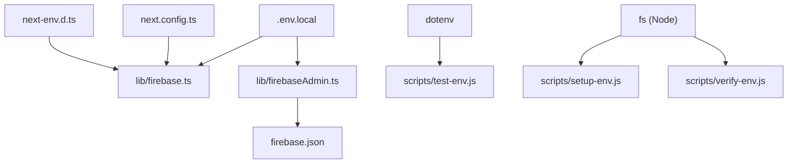

# Environment Management

<cite>
**Referenced Files in This Document**
- [.env.local](file://.env.local)
- [.env.local.example](file://.env.local.example)
- [next.config.ts](file://next.config.ts)
- [lib/firebase.ts](file://lib/firebase.ts)
- [lib/firebaseAdmin.ts](file://lib/firebaseAdmin.ts)
- [lib/emailService.ts](file://lib/emailService.ts)
- [scripts/setup-env.js](file://scripts/setup-env.js)
- [scripts/test-env.js](file://scripts/test-env.js)
- [scripts/verify-env.js](file://scripts/verify-env.js)
- [FIREBASE_SETUP_INSTRUCTIONS.md](file://FIREBASE_SETUP_INSTRUCTIONS.md)
- [package.json](file://package.json)
- [firebase.json](file://firebase.json)
- [middleware.ts](file://middleware.ts)
- [next-env.d.ts](file://next-env.d.ts)
</cite>

## Table of Contents
1. [Introduction](#introduction)
2. [Project Structure](#project-structure)
3. [Core Components](#core-components)
4. [Architecture Overview](#architecture-overview)
5. [Detailed Component Analysis](#detailed-component-analysis)
6. [Dependency Analysis](#dependency-analysis)
7. [Performance Considerations](#performance-considerations)
8. [Troubleshooting Guide](#troubleshooting-guide)
9. [Conclusion](#conclusion)
10. [Appendices](#appendices)

## Introduction
This document provides comprehensive environment management guidance for the SAMPA Cooperative Management System. It covers how environment variables are configured and consumed across development, staging, and production environments using .env.local and .env.local.example templates, Next.js runtime configuration, Firebase SDK initialization for both client and server, secrets management, secure credential handling, and operational procedures for adding new variables, migrating between environments, and maintaining configuration consistency. Practical examples, validation steps, and CI/CD integration guidance are included to streamline setup and reduce risk.

## Project Structure
The environment management system centers on:
- Local environment templates (.env.local and .env.local.example)
- Next.js configuration (next.config.ts)
- Firebase client and admin SDK integrations (lib/firebase.ts, lib/firebaseAdmin.ts)
- EmailJS configuration via environment variables (lib/emailService.ts)
- Scripts to assist setup, verification, and testing of environment variables
- Firebase project configuration (firebase.json)
- Middleware and TypeScript environment typings

**Diagram sources**
- [.env.local](file://.env.local#L1-L9)
- [.env.local.example](file://.env.local.example#L1-L10)
- [next.config.ts](file://next.config.ts#L1-L8)
- [next-env.d.ts](file://next-env.d.ts#L1-L7)
- [lib/firebase.ts](file://lib/firebase.ts#L1-L309)
- [lib/firebaseAdmin.ts](file://lib/firebaseAdmin.ts#L1-L277)
- [lib/emailService.ts](file://lib/emailService.ts#L1-L20)
- [scripts/setup-env.js](file://scripts/setup-env.js#L1-L55)
- [scripts/test-env.js](file://scripts/test-env.js#L1-L11)
- [scripts/verify-env.js](file://scripts/verify-env.js#L1-L48)
- [firebase.json](file://firebase.json#L1-L9)

**Section sources**
- [.env.local](file://.env.local#L1-L9)
- [.env.local.example](file://.env.local.example#L1-L10)
- [next.config.ts](file://next.config.ts#L1-L8)
- [next-env.d.ts](file://next-env.d.ts#L1-L7)
- [lib/firebase.ts](file://lib/firebase.ts#L1-L309)
- [lib/firebaseAdmin.ts](file://lib/firebaseAdmin.ts#L1-L277)
- [lib/emailService.ts](file://lib/emailService.ts#L1-L20)
- [scripts/setup-env.js](file://scripts/setup-env.js#L1-L55)
- [scripts/test-env.js](file://scripts/test-env.js#L1-L11)
- [scripts/verify-env.js](file://scripts/verify-env.js#L1-L48)
- [firebase.json](file://firebase.json#L1-L9)

## Core Components
- Environment templates:
  - .env.local.example defines placeholders and formatting guidance for Firebase Admin credentials and notes about newline escaping.
  - .env.local holds actual environment values for local development and runtime consumption by client and server SDKs.
- Next.js configuration:
  - next.config.ts currently provides a base configuration container; environment variables are primarily consumed at runtime rather than built-time.
  - next-env.d.ts ensures TypeScript recognizes Next.js environment types.
- Firebase client SDK (lib/firebase.ts):
  - Reads client-side Firebase configuration from environment variables with safe fallbacks.
  - Validates presence of required keys and initializes Firestore and Auth only in the browser.
- Firebase Admin SDK (lib/firebaseAdmin.ts):
  - Initializes server-side Admin SDK using environment variables with robust validation and placeholder detection.
  - Provides utility functions to check initialization status and perform Firestore operations safely.
- EmailJS configuration (lib/emailService.ts):
  - Uses NEXT_PUBLIC_* prefixed environment variables for client-side EmailJS configuration.
- Utilities:
  - scripts/setup-env.js scaffolds .env.local from .env.local.example and prints setup instructions.
  - scripts/test-env.js demonstrates manual dotenv loading and environment variable inspection.
  - scripts/verify-env.js checks for completeness and placeholder values in Firebase credentials.
- Firebase project configuration (firebase.json):
  - Declares Firestore database location, rules, and indexes.

**Section sources**
- [.env.local.example](file://.env.local.example#L1-L10)
- [.env.local](file://.env.local#L1-L9)
- [next.config.ts](file://next.config.ts#L1-L8)
- [next-env.d.ts](file://next-env.d.ts#L1-L7)
- [lib/firebase.ts](file://lib/firebase.ts#L20-L60)
- [lib/firebaseAdmin.ts](file://lib/firebaseAdmin.ts#L13-L108)
- [lib/emailService.ts](file://lib/emailService.ts#L1-L10)
- [scripts/setup-env.js](file://scripts/setup-env.js#L1-L55)
- [scripts/test-env.js](file://scripts/test-env.js#L1-L11)
- [scripts/verify-env.js](file://scripts/verify-env.js#L1-L48)
- [firebase.json](file://firebase.json#L1-L9)

## Architecture Overview
The environment management architecture separates concerns between client and server:
- Client runtime reads NEXT_PUBLIC_* variables and initializes Firebase client SDK.
- Server runtime reads secret variables and initializes Firebase Admin SDK.
- Utilities and scripts assist in generating, validating, and testing environment configurations.
- Middleware and Next.js typing support ensure consistent environment handling across the app.

**Diagram sources**
- [.env.local](file://.env.local#L1-L9)
- [lib/firebase.ts](file://lib/firebase.ts#L20-L60)
- [lib/firebaseAdmin.ts](file://lib/firebaseAdmin.ts#L13-L108)
- [scripts/verify-env.js](file://scripts/verify-env.js#L1-L48)

**Section sources**
- [lib/firebase.ts](file://lib/firebase.ts#L20-L60)
- [lib/firebaseAdmin.ts](file://lib/firebaseAdmin.ts#L13-L108)
- [scripts/verify-env.js](file://scripts/verify-env.js#L1-L48)

## Detailed Component Analysis

### Environment Template Management
- Purpose:
  - .env.local.example provides a template with comments and formatting guidance for Firebase Admin credentials, emphasizing newline escaping for private keys.
  - .env.local is the active environment file consumed by the application and scripts.
- Best practices:
  - Never commit .env.local to version control.
  - Use .env.local.example as the authoritative template for team members.
  - Ensure private keys are on a single line with \n escapes and quoted as instructed.

**Section sources**
- [.env.local.example](file://.env.local.example#L1-L10)
- [.env.local](file://.env.local#L1-L9)

### Next.js Environment Variable Handling
- Runtime behavior:
  - Environment variables are consumed at runtime rather than built-time. The project relies on process.env in client and server code.
  - next.config.ts is a minimal configuration container; environment variables are not configured here.
  - next-env.d.ts ensures TypeScript recognizes Next.js environment types.
- Recommendations:
  - Keep sensitive variables server-only (not NEXT_PUBLIC_*).
  - Use NEXT_PUBLIC_* only for client-visible values (e.g., EmailJS public key).
  - Validate environment variables early in the app lifecycle (as shown by Firebase initialization).

**Section sources**
- [next.config.ts](file://next.config.ts#L1-L8)
- [next-env.d.ts](file://next-env.d.ts#L1-L7)

### Firebase Client SDK Configuration (lib/firebase.ts)
- Configuration source:
  - Reads NEXT_PUBLIC_* Firebase client configuration from environment variables with safe fallbacks.
- Initialization logic:
  - Validates required keys before initializing.
  - Initializes only in the browser to prevent SSR issues.
  - Exposes Firestore helpers with connection validation and error handling.
- Security considerations:
  - Client configuration uses public keys; do not place secrets here.
  - Fallbacks are provided to aid development but should not be used in production.

**Diagram sources**
- [lib/firebase.ts](file://lib/firebase.ts#L20-L60)

**Section sources**
- [lib/firebase.ts](file://lib/firebase.ts#L20-L60)

### Firebase Admin SDK Configuration (lib/firebaseAdmin.ts)
- Configuration source:
  - Reads server-only environment variables (FIREBASE_PROJECT_ID, FIREBASE_CLIENT_EMAIL, FIREBASE_PRIVATE_KEY).
- Initialization logic:
  - Checks for presence and non-placeholder values.
  - Converts escaped newlines in private key to actual newlines.
  - Initializes Admin SDK only if credentials are valid; otherwise logs actionable warnings.
  - Exposes utility functions to check initialization status and perform Firestore operations.
- Security considerations:
  - Private key must be kept secret and never committed.
  - The script warns against placeholder values and provides remediation steps.

**Diagram sources**
- [lib/firebaseAdmin.ts](file://lib/firebaseAdmin.ts#L13-L108)

**Section sources**
- [lib/firebaseAdmin.ts](file://lib/firebaseAdmin.ts#L13-L108)

### EmailJS Configuration (lib/emailService.ts)
- Configuration source:
  - Uses NEXT_PUBLIC_* variables for EmailJS public key, service ID, and template ID.
- Consumption:
  - These values are used by the EmailJS SDK in client components.

**Section sources**
- [lib/emailService.ts](file://lib/emailService.ts#L1-L10)

### Environment Setup and Validation Utilities
- scripts/setup-env.js:
  - Creates .env.local from .env.local.example if missing and prints setup instructions.
- scripts/test-env.js:
  - Manually loads .env.local and logs environment variable presence.
- scripts/verify-env.js:
  - Verifies completeness and detects placeholder values for Firebase credentials.

**Diagram sources**
- [scripts/setup-env.js](file://scripts/setup-env.js#L1-L55)
- [scripts/test-env.js](file://scripts/test-env.js#L1-L11)
- [scripts/verify-env.js](file://scripts/verify-env.js#L1-L48)

**Section sources**
- [scripts/setup-env.js](file://scripts/setup-env.js#L1-L55)
- [scripts/test-env.js](file://scripts/test-env.js#L1-L11)
- [scripts/verify-env.js](file://scripts/verify-env.js#L1-L48)

### Firebase Project Configuration (firebase.json)
- Declares Firestore database location, rules file, and indexes file.
- Ensures local and CI deployments align with project settings.

**Section sources**
- [firebase.json](file://firebase.json#L1-L9)

## Dependency Analysis
- Client SDK depends on:
  - NEXT_PUBLIC_* variables from .env.local for client configuration.
  - Next.js runtime for environment propagation.
- Server SDK depends on:
  - Secret variables from .env.local for Admin SDK initialization.
  - Firebase Admin SDK library.
- Utilities depend on:
  - dotenv for loading .env.local during script execution.
  - Node.js filesystem APIs for scaffolding and verification.

**Diagram sources**
- [.env.local](file://.env.local#L1-L9)
- [lib/firebase.ts](file://lib/firebase.ts#L1-L309)
- [lib/firebaseAdmin.ts](file://lib/firebaseAdmin.ts#L1-L277)
- [next.config.ts](file://next.config.ts#L1-L8)
- [next-env.d.ts](file://next-env.d.ts#L1-L7)
- [scripts/test-env.js](file://scripts/test-env.js#L1-L11)
- [scripts/setup-env.js](file://scripts/setup-env.js#L1-L55)
- [scripts/verify-env.js](file://scripts/verify-env.js#L1-L48)
- [firebase.json](file://firebase.json#L1-L9)

**Section sources**
- [.env.local](file://.env.local#L1-L9)
- [lib/firebase.ts](file://lib/firebase.ts#L1-L309)
- [lib/firebaseAdmin.ts](file://lib/firebaseAdmin.ts#L1-L277)
- [next.config.ts](file://next.config.ts#L1-L8)
- [next-env.d.ts](file://next-env.d.ts#L1-L7)
- [scripts/test-env.js](file://scripts/test-env.js#L1-L11)
- [scripts/setup-env.js](file://scripts/setup-env.js#L1-L55)
- [scripts/verify-env.js](file://scripts/verify-env.js#L1-L48)
- [firebase.json](file://firebase.json#L1-L9)

## Performance Considerations
- Minimize environment variable reads by caching values after first load in modules that consume them.
- Avoid heavy synchronous filesystem operations in hot paths; rely on pre-deployed .env.local files.
- Keep NEXT_PUBLIC_* variables minimal to reduce client bundle overhead.
- Use placeholder fallbacks only for development; ensure production builds fail fast if required variables are missing.

## Troubleshooting Guide
Common issues and resolutions:
- Missing or placeholder Firebase Admin credentials:
  - Use scripts/verify-env.js to confirm presence and detect placeholders.
  - Follow FIREBASE_SETUP_INSTRUCTIONS.md to regenerate and paste correct values into .env.local.
  - Ensure private key is a single-line string with \n escapes and quotes.
- Client SDK initialization failures:
  - Confirm NEXT_PUBLIC_* variables are present and correct.
  - Check browser console for missing configuration warnings.
- Middleware redirects unexpectedly:
  - Review middleware.ts logic for root path redirection and cookie-based user detection.
- CI/CD environment drift:
  - Define environment variables per environment in CI secrets management.
  - Use separate .env files per environment (e.g., .env.production) and load them during build or startup.

Operational scripts:
- scripts/setup-env.js: Scaffold .env.local and print setup steps.
- scripts/test-env.js: Manually load .env.local and inspect variables.
- scripts/verify-env.js: Comprehensive check for completeness and placeholders.

**Section sources**
- [scripts/verify-env.js](file://scripts/verify-env.js#L1-L48)
- [FIREBASE_SETUP_INSTRUCTIONS.md](file://FIREBASE_SETUP_INSTRUCTIONS.md#L1-L63)
- [middleware.ts](file://middleware.ts#L1-L62)
- [scripts/setup-env.js](file://scripts/setup-env.js#L1-L55)
- [scripts/test-env.js](file://scripts/test-env.js#L1-L11)

## Conclusion
The SAMPA Cooperative Management System employs a clear separation of client and server environment handling, robust validation, and developer-friendly utilities. By adhering to the template-driven approach, securing secrets appropriately, and leveraging the provided scripts, teams can reliably manage environments across development, staging, and production while minimizing configuration drift and operational risk.

## Appendices

### Adding New Environment Variables
- Choose prefix:
  - NEXT_PUBLIC_* for client-visible values.
  - Server-only variables without NEXT_PUBLIC_.
- Update template:
  - Add the new variable to .env.local.example with a descriptive comment.
- Implement usage:
  - Access via process.env in the appropriate module (client or server).
  - Add validation and fallbacks similar to existing variables.
- Test:
  - Use scripts/test-env.js and scripts/verify-env.js to validate.
- Commit:
  - Do not commit .env.local; keep it in .gitignore.

**Section sources**
- [.env.local.example](file://.env.local.example#L1-L10)
- [lib/firebase.ts](file://lib/firebase.ts#L20-L30)
- [lib/firebaseAdmin.ts](file://lib/firebaseAdmin.ts#L17-L25)
- [scripts/test-env.js](file://scripts/test-env.js#L1-L11)
- [scripts/verify-env.js](file://scripts/verify-env.js#L1-L48)

### Migrating Between Environments
- Prepare environment files:
  - Maintain separate .env files per environment (e.g., .env.development, .env.staging, .env.production).
  - Ensure .env.local remains for local development.
- CI/CD integration:
  - Store secrets in CI provider’s secret management.
  - During build or startup, export environment variables or load .env files.
  - Validate with scripts/verify-env.js before starting the application.
- Middleware and routing:
  - Confirm middleware.ts behavior remains consistent across environments.

**Section sources**
- [scripts/verify-env.js](file://scripts/verify-env.js#L1-L48)
- [middleware.ts](file://middleware.ts#L1-L62)

### CI/CD Integration Guidance
- Secrets management:
  - Store FIREBASE_PROJECT_ID, FIREBASE_CLIENT_EMAIL, FIREBASE_PRIVATE_KEY, and NEXT_PUBLIC_* as CI secrets.
- Build pipeline:
  - Load .env files or set environment variables in the CI job.
  - Run scripts/verify-env.js as a pre-start step to validate configuration.
- Deployment:
  - Use environment-specific .env files or CI-provided variables.
  - Validate Firebase Admin initialization status before deploying server code.

**Section sources**
- [scripts/verify-env.js](file://scripts/verify-env.js#L1-L48)
- [lib/firebaseAdmin.ts](file://lib/firebaseAdmin.ts#L13-L108)
- [package.json](file://package.json#L5-L15)