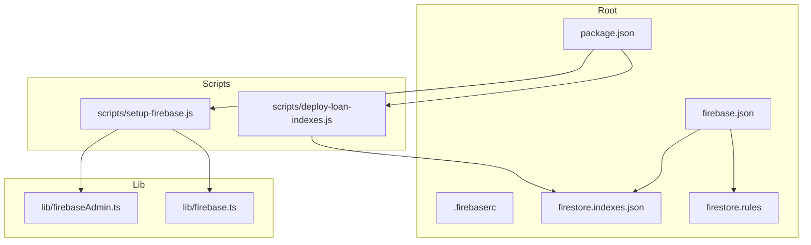
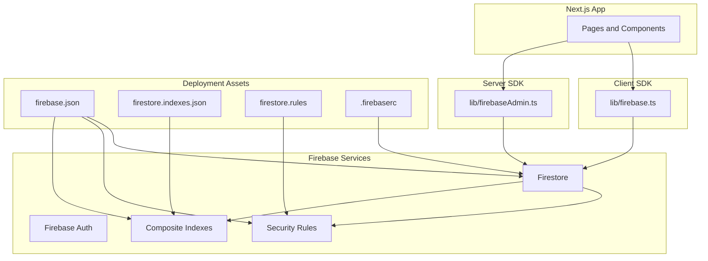
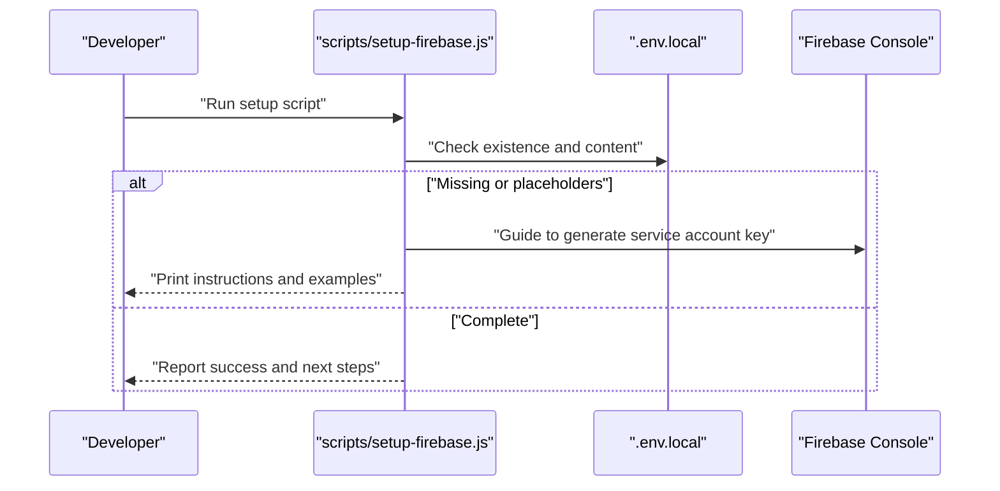
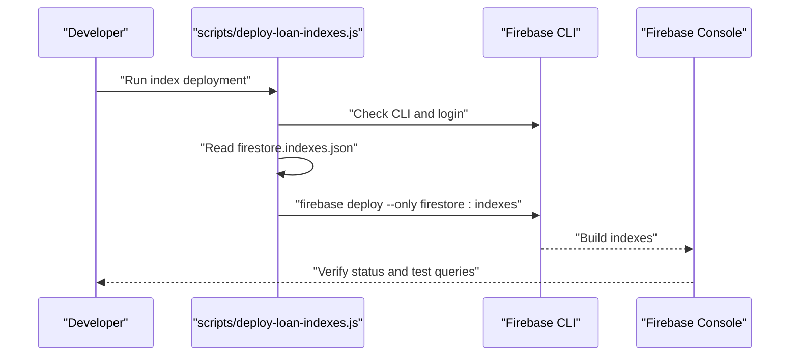
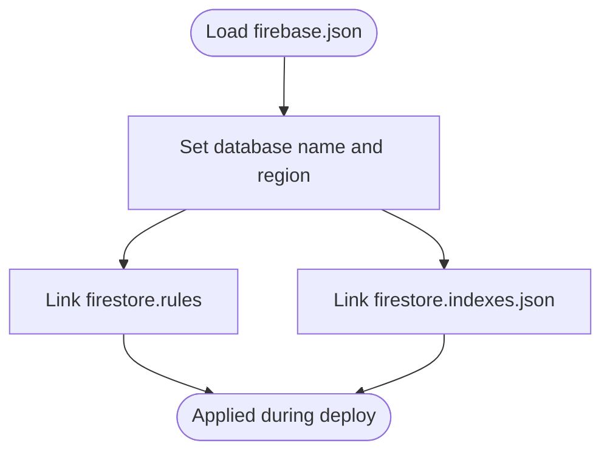
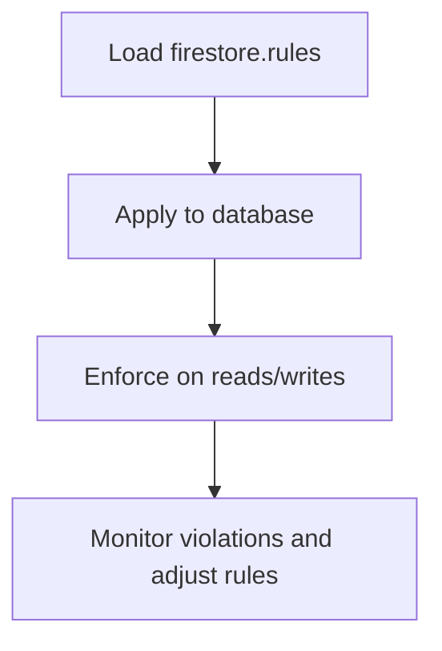
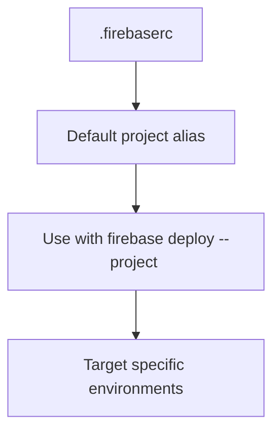
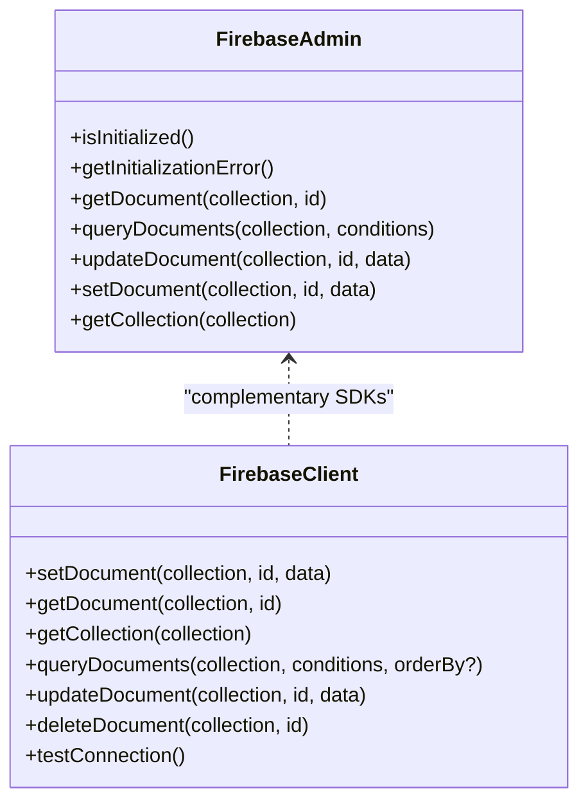
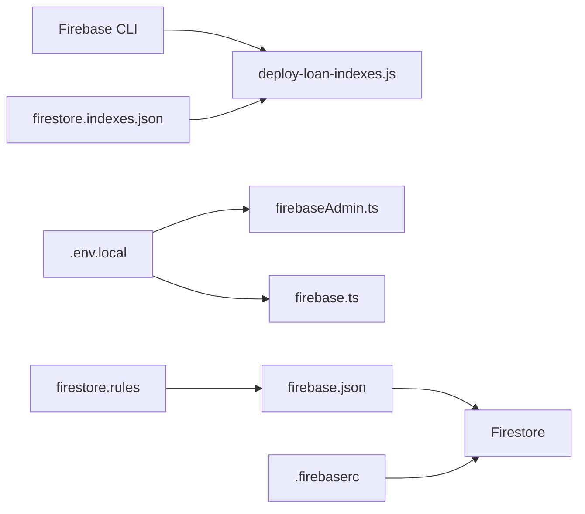
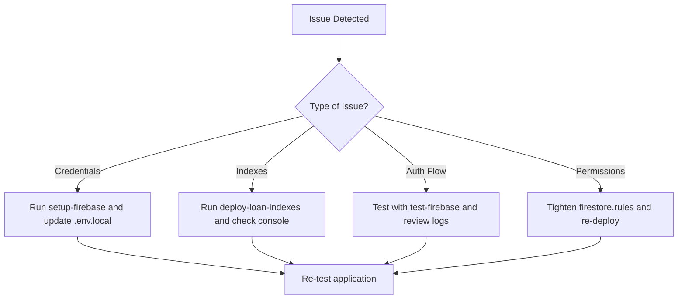

# Firebase Deployment

<cite>
**Referenced Files in This Document**
- [scripts/setup-firebase.js](file://scripts/setup-firebase.js)
- [scripts/deploy-loan-indexes.js](file://scripts/deploy-loan-indexes.js)
- [firebase.json](file://firebase.json)
- [.firebaserc](file://.firebaserc)
- [firestore.indexes.json](file://firestore.indexes.json)
- [firestore.rules](file://firestore.rules)
- [lib/firebaseAdmin.ts](file://lib/firebaseAdmin.ts)
- [lib/firebase.ts](file://lib/firebase.ts)
- [package.json](file://package.json)
- [FIREBASE_SETUP_INSTRUCTIONS.md](file://FIREBASE_SETUP_INSTRUCTIONS.md)
- [docs/FIREBASE_TROUBLESHOOTING.md](file://docs/FIREBASE_TROUBLESHOOTING.md)
- [docs/FIRESTORE_INDEXES.md](file://docs/FIRESTORE_INDEXES.md)
</cite>

## Table of Contents
1. [Introduction](#introduction)
2. [Project Structure](#project-structure)
3. [Core Components](#core-components)
4. [Architecture Overview](#architecture-overview)
5. [Detailed Component Analysis](#detailed-component-analysis)
6. [Dependency Analysis](#dependency-analysis)
7. [Performance Considerations](#performance-considerations)
8. [Troubleshooting Guide](#troubleshooting-guide)
9. [Conclusion](#conclusion)
10. [Appendices](#appendices)

## Introduction
This document provides comprehensive Firebase deployment guidance for the SAMPA Cooperative Management System. It covers project setup, environment configuration, Firestore indexes deployment, security rules, environment-specific targets via .firebaserc, and operational practices for monitoring and cost optimization. Practical deployment commands, rollback considerations, and troubleshooting steps are included to support reliable operations across development, staging, and production environments.

## Project Structure
The Firebase-related assets and automation scripts are organized as follows:
- Scripts for setup and index deployment under scripts/
- Firebase configuration files at the repository root: firebase.json, .firebaserc, firestore.indexes.json, firestore.rules
- Client and server SDK initialization under lib/ for Next.js integration
- Package scripts for automation in package.json

**Diagram sources**
- [package.json](file://package.json#L5-L14)
- [firebase.json](file://firebase.json#L1-L9)
- [.firebaserc](file://.firebaserc#L1-L6)
- [firestore.indexes.json](file://firestore.indexes.json#L1-L83)
- [firestore.rules](file://firestore.rules#L1-L19)
- [scripts/setup-firebase.js](file://scripts/setup-firebase.js#L1-L93)
- [scripts/deploy-loan-indexes.js](file://scripts/deploy-loan-indexes.js#L1-L100)
- [lib/firebaseAdmin.ts](file://lib/firebaseAdmin.ts#L1-L277)
- [lib/firebase.ts](file://lib/firebase.ts#L1-L309)

**Section sources**
- [package.json](file://package.json#L5-L14)
- [firebase.json](file://firebase.json#L1-L9)
- [.firebaserc](file://.firebaserc#L1-L6)
- [firestore.indexes.json](file://firestore.indexes.json#L1-L83)
- [firestore.rules](file://firestore.rules#L1-L19)
- [scripts/setup-firebase.js](file://scripts/setup-firebase.js#L1-L93)
- [scripts/deploy-loan-indexes.js](file://scripts/deploy-loan-indexes.js#L1-L100)
- [lib/firebaseAdmin.ts](file://lib/firebaseAdmin.ts#L1-L277)
- [lib/firebase.ts](file://lib/firebase.ts#L1-L309)

## Core Components
- Firebase Admin SDK initialization and utilities for server-side Firestore operations
- Firebase Client SDK initialization for browser-side Firestore and Auth
- Setup script to configure environment variables and guide service account creation
- Index deployment script to automate Firestore composite index provisioning
- Root configuration files for Firestore database, rules, and indexes
- Environment targeting via .firebaserc

Key responsibilities:
- lib/firebaseAdmin.ts: Validates environment variables, initializes Firebase Admin SDK, and exposes safe Firestore helpers
- lib/firebase.ts: Initializes Firebase Client SDK and provides typed Firestore helpers
- scripts/setup-firebase.js: Guides service account key generation and .env.local population
- scripts/deploy-loan-indexes.js: Validates prerequisites and deploys composite indexes using Firebase CLI
- firebase.json: Declares Firestore database location, rules, and indexes file
- firestore.indexes.json: Defines required composite indexes for loan requests and activity logs
- firestore.rules: Current security rules baseline
- .firebaserc: Project target selection for default environment

**Section sources**
- [lib/firebaseAdmin.ts](file://lib/firebaseAdmin.ts#L1-L277)
- [lib/firebase.ts](file://lib/firebase.ts#L1-L309)
- [scripts/setup-firebase.js](file://scripts/setup-firebase.js#L1-L93)
- [scripts/deploy-loan-indexes.js](file://scripts/deploy-loan-indexes.js#L1-L100)
- [firebase.json](file://firebase.json#L1-L9)
- [firestore.indexes.json](file://firestore.indexes.json#L1-L83)
- [firestore.rules](file://firestore.rules#L1-L19)
- [.firebaserc](file://.firebaserc#L1-L6)

## Architecture Overview
The deployment architecture integrates Next.js with Firebase services:
- Client-side operations use the Firebase Client SDK (lib/firebase.ts)
- Server-side operations use the Firebase Admin SDK (lib/firebaseAdmin.ts)
- Setup and index deployment are automated via Node.js scripts
- Root configuration files define Firestore behavior and resource locations

**Diagram sources**
- [lib/firebase.ts](file://lib/firebase.ts#L1-L309)
- [lib/firebaseAdmin.ts](file://lib/firebaseAdmin.ts#L1-L277)
- [firebase.json](file://firebase.json#L1-L9)
- [firestore.indexes.json](file://firestore.indexes.json#L1-L83)
- [firestore.rules](file://firestore.rules#L1-L19)
- [.firebaserc](file://.firebaserc#L1-L6)

## Detailed Component Analysis

### Firebase Project Setup and Authentication
The setup script automates environment variable configuration and guides service account key generation. It checks for .env.local, validates required variables, and prints step-by-step instructions for generating and pasting credentials.

**Diagram sources**
- [scripts/setup-firebase.js](file://scripts/setup-firebase.js#L14-L88)
- [FIREBASE_SETUP_INSTRUCTIONS.md](file://FIREBASE_SETUP_INSTRUCTIONS.md#L1-L63)

Operational notes:
- Ensure FIREBASE_PROJECT_ID, FIREBASE_CLIENT_EMAIL, and FIREBASE_PRIVATE_KEY are populated
- Keep the private key as a single-line string with \n escapes
- Restart the development server after updating .env.local

**Section sources**
- [scripts/setup-firebase.js](file://scripts/setup-firebase.js#L1-L93)
- [FIREBASE_SETUP_INSTRUCTIONS.md](file://FIREBASE_SETUP_INSTRUCTIONS.md#L1-L63)

### Firestore Indexes Deployment Workflow
The index deployment script validates prerequisites, reads the index definition file, and triggers Firebase CLI to deploy composite indexes. It also provides guidance for verifying index status and testing functionality.

**Diagram sources**
- [scripts/deploy-loan-indexes.js](file://scripts/deploy-loan-indexes.js#L16-L93)
- [firestore.indexes.json](file://firestore.indexes.json#L1-L83)
- [docs/FIRESTORE_INDEXES.md](file://docs/FIRESTORE_INDEXES.md#L56-L70)

Index requirements:
- Composite indexes for loanRequests supporting pending, approved, and rejected statuses with appropriate sort orders
- Additional indexes for activityLogs to support efficient queries by userId and timestamp

**Section sources**
- [scripts/deploy-loan-indexes.js](file://scripts/deploy-loan-indexes.js#L1-L100)
- [firestore.indexes.json](file://firestore.indexes.json#L1-L83)
- [docs/FIRESTORE_INDEXES.md](file://docs/FIRESTORE_INDEXES.md#L1-L110)

### firebase.json Configuration
Root configuration declares Firestore database location, rules, and indexes file. This ensures consistent deployment behavior across environments.

**Diagram sources**
- [firebase.json](file://firebase.json#L1-L9)

**Section sources**
- [firebase.json](file://firebase.json#L1-L9)

### Firestore Security Rules Management
Security rules are defined centrally and applied during deployment. The current rules allow read/write for all users and include a note about expiration. For production, replace with stricter rules aligned with cooperative data protection needs.

**Diagram sources**
- [firestore.rules](file://firestore.rules#L1-L19)

**Section sources**
- [firestore.rules](file://firestore.rules#L1-L19)

### Environment-Specific Deployment Targets (.firebaserc)
The .firebaserc file defines the default project target. Extend this file to add development, staging, and production targets and use Firebase CLI project aliases for environment switching.

**Diagram sources**
- [.firebaserc](file://.firebaserc#L1-L6)

**Section sources**
- [.firebaserc](file://.firebaserc#L1-L6)

### Client and Server SDK Initialization
Client SDK initialization occurs in the browser context with environment variable fallbacks. Server SDK initialization occurs server-side with strict validation of environment variables and error reporting.

**Diagram sources**
- [lib/firebaseAdmin.ts](file://lib/firebaseAdmin.ts#L111-L277)
- [lib/firebase.ts](file://lib/firebase.ts#L90-L309)

**Section sources**
- [lib/firebaseAdmin.ts](file://lib/firebaseAdmin.ts#L1-L277)
- [lib/firebase.ts](file://lib/firebase.ts#L1-L309)

## Dependency Analysis
The deployment pipeline depends on:
- Firebase CLI availability and authentication
- Correct environment variables in .env.local
- Valid index definitions in firestore.indexes.json
- Proper configuration in firebase.json and .firebaserc

**Diagram sources**
- [scripts/deploy-loan-indexes.js](file://scripts/deploy-loan-indexes.js#L16-L93)
- [lib/firebaseAdmin.ts](file://lib/firebaseAdmin.ts#L13-L108)
- [lib/firebase.ts](file://lib/firebase.ts#L32-L60)
- [firestore.indexes.json](file://firestore.indexes.json#L1-L83)
- [firestore.rules](file://firestore.rules#L1-L19)
- [firebase.json](file://firebase.json#L1-L9)
- [.firebaserc](file://.firebaserc#L1-L6)

**Section sources**
- [scripts/deploy-loan-indexes.js](file://scripts/deploy-loan-indexes.js#L1-L100)
- [lib/firebaseAdmin.ts](file://lib/firebaseAdmin.ts#L1-L277)
- [lib/firebase.ts](file://lib/firebase.ts#L1-L309)
- [firestore.indexes.json](file://firestore.indexes.json#L1-L83)
- [firestore.rules](file://firestore.rules#L1-L19)
- [firebase.json](file://firebase.json#L1-L9)
- [.firebaserc](file://.firebaserc#L1-L6)

## Performance Considerations
- Composite indexes are essential for efficient filtering and sorting of loan requests by status and timestamps
- Include __name__ as the final field in composite indexes to support stable pagination
- Monitor index build status in the Firebase Console and wait for “Enabled” before relying on queries
- Keep Firestore rules permissive only during development; tighten them for production to reduce unnecessary overhead

[No sources needed since this section provides general guidance]

## Troubleshooting Guide
Common issues and remedies:
- Missing or placeholder credentials: Use the setup script and FIREBASE_SETUP_INSTRUCTIONS to populate .env.local
- Index-related query errors: Deploy required composite indexes using the index deployment script and verify status in the console
- Authentication flow problems: Validate environment variables, restart the development server, and test connectivity with provided scripts
- Permission-denied errors: Adjust Firestore rules and verify user roles and document paths

**Diagram sources**
- [scripts/setup-firebase.js](file://scripts/setup-firebase.js#L63-L88)
- [scripts/deploy-loan-indexes.js](file://scripts/deploy-loan-indexes.js#L54-L93)
- [docs/FIREBASE_TROUBLESHOOTING.md](file://docs/FIREBASE_TROUBLESHOOTING.md#L1-L177)

**Section sources**
- [scripts/setup-firebase.js](file://scripts/setup-firebase.js#L1-L93)
- [scripts/deploy-loan-indexes.js](file://scripts/deploy-loan-indexes.js#L1-L100)
- [docs/FIREBASE_TROUBLESHOOTING.md](file://docs/FIREBASE_TROUBLESHOOTING.md#L1-L177)

## Conclusion
The SAMPA Cooperative Management System’s Firebase deployment leverages automated scripts, centralized configuration, and clear separation between client and server SDK usage. By following the documented setup, index deployment, and troubleshooting procedures, teams can maintain reliable, secure, and performant operations across environments while preparing for future scaling and compliance needs.

[No sources needed since this section summarizes without analyzing specific files]

## Appendices

### Practical Deployment Commands
- Initialize and validate Firebase configuration:
  - Run the setup script to configure environment variables and service account credentials
  - Use the test script to verify connectivity
- Deploy composite indexes:
  - Ensure Firebase CLI is installed and authenticated
  - Execute the index deployment script to apply firestore.indexes.json
- Environment targeting:
  - Extend .firebaserc with project aliases for development, staging, and production
  - Use firebase deploy --project <alias> to target environments

**Section sources**
- [package.json](file://package.json#L10-L14)
- [scripts/setup-firebase.js](file://scripts/setup-firebase.js#L1-L93)
- [scripts/deploy-loan-indexes.js](file://scripts/deploy-loan-indexes.js#L1-L100)
- [.firebaserc](file://.firebaserc#L1-L6)

### Rollback Procedures
- Indexes:
  - Remove or modify the offending composite index definition in firestore.indexes.json
  - Redeploy indexes and monitor build status
- Rules:
  - Revert to a previous version of firestore.rules
  - Redeploy rules and confirm access patterns
- Environment targeting:
  - Switch .firebaserc project alias to a known-good environment
  - Validate application behavior and redeploy as needed

**Section sources**
- [firestore.indexes.json](file://firestore.indexes.json#L1-L83)
- [firestore.rules](file://firestore.rules#L1-L19)
- [.firebaserc](file://.firebaserc#L1-L6)

### Monitoring and Cost Optimization
- Monitoring:
  - Use Firebase Console dashboards for Firestore usage, authentication metrics, and index build progress
  - Enable logging in server-side functions and review logs for errors
- Billing alerts:
  - Configure budget alerts and spend thresholds in the Google Cloud Console
  - Monitor usage spikes and optimize queries to reduce index maintenance costs
- Cost optimization:
  - Limit composite indexes to required query patterns
  - Use efficient queries and avoid wildcard reads
  - Regularly review and remove unused indexes

[No sources needed since this section provides general guidance]