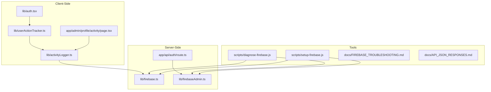
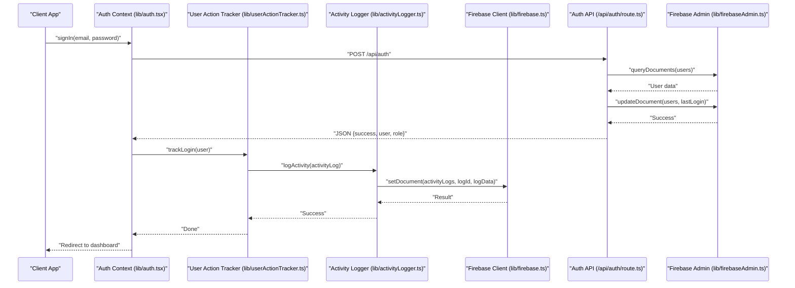
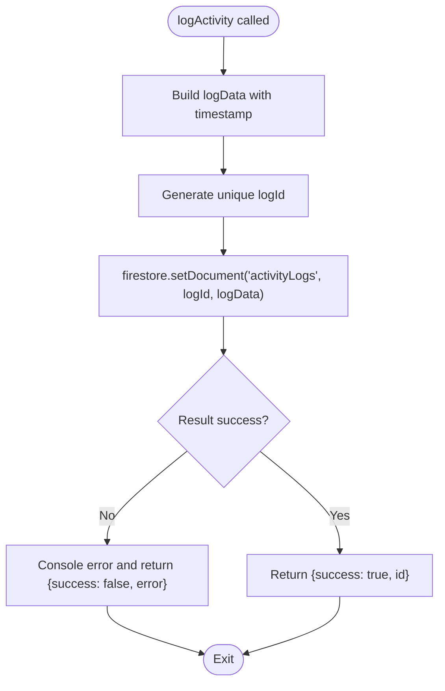
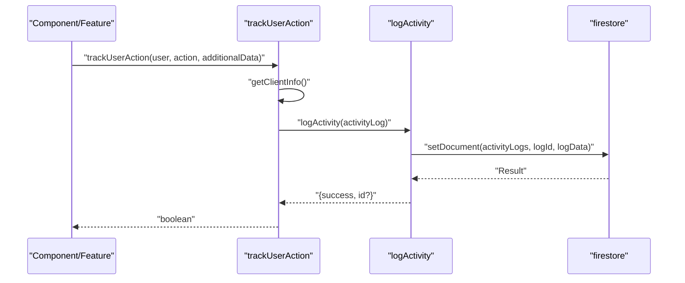
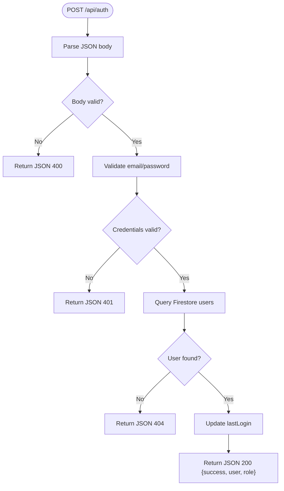
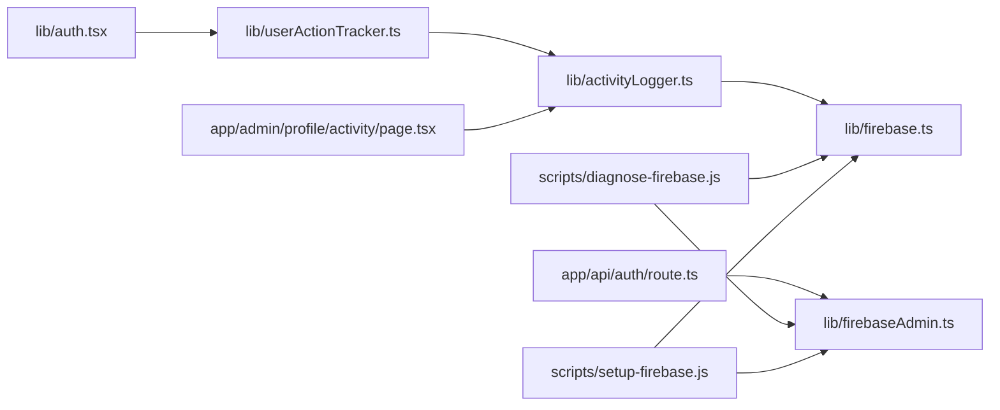
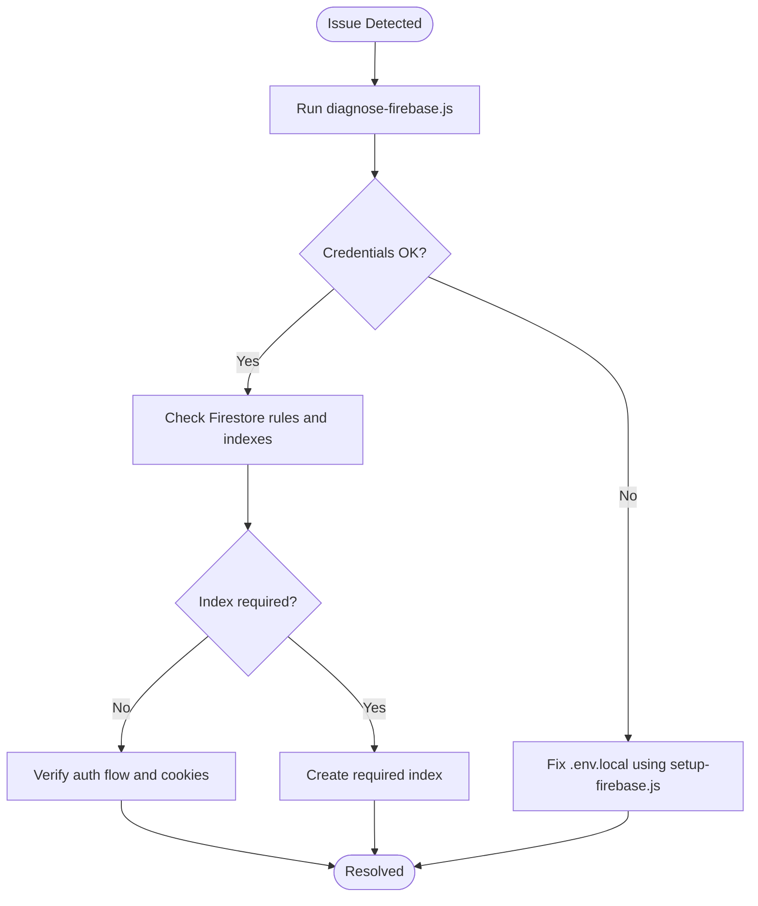

# Monitoring & Logging

<cite>
**Referenced Files in This Document**
- [lib/activityLogger.ts](file://lib/activityLogger.ts)
- [lib/userActionTracker.ts](file://lib/userActionTracker.ts)
- [lib/firebase.ts](file://lib/firebase.ts)
- [lib/firebaseAdmin.ts](file://lib/firebaseAdmin.ts)
- [app/api/auth/route.ts](file://app/api/auth/route.ts)
- [lib/auth.tsx](file://lib/auth.tsx)
- [scripts/diagnose-firebase.js](file://scripts/diagnose-firebase.js)
- [scripts/setup-firebase.js](file://scripts/setup-firebase.js)
- [.env.local.example](file://.env.local.example)
- [docs/FIREBASE_TROUBLESHOOTING.md](file://docs/FIREBASE_TROUBLESHOOTING.md)
- [docs/API_JSON_RESPONSES.md](file://docs/API_JSON_RESPONSES.md)
- [app/admin/profile/activity/page.tsx](file://app/admin/profile/activity/page.tsx)
</cite>

## Table of Contents
1. [Introduction](#introduction)
2. [Project Structure](#project-structure)
3. [Core Components](#core-components)
4. [Architecture Overview](#architecture-overview)
5. [Detailed Component Analysis](#detailed-component-analysis)
6. [Dependency Analysis](#dependency-analysis)
7. [Performance Considerations](#performance-considerations)
8. [Troubleshooting Guide](#troubleshooting-guide)
9. [Conclusion](#conclusion)
10. [Appendices](#appendices)

## Introduction
This document provides comprehensive monitoring and logging guidance for the SAMPA Cooperative Management System. It focuses on:
- User activity logging via lib/activityLogger.ts and lib/userActionTracker.ts
- Firebase diagnostic and monitoring setup using scripts/diagnose-firebase.js and supporting Firebase libraries
- Logging strategies for user activity, system errors, and operational insights
- Alerting mechanisms, log aggregation, and real-time monitoring dashboards
- Troubleshooting procedures using docs/FIREBASE_TROUBLESHOOTING.md
- Practical examples for proactive monitoring, log retention, compliance, and external platform integration

## Project Structure
The monitoring and logging implementation spans client-side and server-side modules:
- Client-side activity logging and user action tracking
- Server-side Firebase Admin SDK initialization and Firestore utilities
- API routes with standardized JSON responses and robust error logging
- Diagnostic scripts and troubleshooting documentation

**Diagram sources**
- [lib/activityLogger.ts](file://lib/activityLogger.ts#L1-L165)
- [lib/userActionTracker.ts](file://lib/userActionTracker.ts#L1-L118)
- [lib/firebase.ts](file://lib/firebase.ts#L1-L309)
- [lib/firebaseAdmin.ts](file://lib/firebaseAdmin.ts#L1-L277)
- [app/api/auth/route.ts](file://app/api/auth/route.ts#L1-L295)
- [scripts/diagnose-firebase.js](file://scripts/diagnose-firebase.js#L1-L61)
- [scripts/setup-firebase.js](file://scripts/setup-firebase.js#L1-L93)
- [docs/FIREBASE_TROUBLESHOOTING.md](file://docs/FIREBASE_TROUBLESHOOTING.md#L1-L177)
- [docs/API_JSON_RESPONSES.md](file://docs/API_JSON_RESPONSES.md#L1-L139)
- [app/admin/profile/activity/page.tsx](file://app/admin/profile/activity/page.tsx#L74-L184)

**Section sources**
- [lib/activityLogger.ts](file://lib/activityLogger.ts#L1-L165)
- [lib/userActionTracker.ts](file://lib/userActionTracker.ts#L1-L118)
- [lib/firebase.ts](file://lib/firebase.ts#L1-L309)
- [lib/firebaseAdmin.ts](file://lib/firebaseAdmin.ts#L1-L277)
- [app/api/auth/route.ts](file://app/api/auth/route.ts#L1-L295)
- [scripts/diagnose-firebase.js](file://scripts/diagnose-firebase.js#L1-L61)
- [scripts/setup-firebase.js](file://scripts/setup-firebase.js#L1-L93)
- [docs/FIREBASE_TROUBLESHOOTING.md](file://docs/FIREBASE_TROUBLESHOOTING.md#L1-L177)
- [docs/API_JSON_RESPONSES.md](file://docs/API_JSON_RESPONSES.md#L1-L139)
- [app/admin/profile/activity/page.tsx](file://app/admin/profile/activity/page.tsx#L74-L184)

## Core Components
- Activity Logger: Provides typed activity logging to Firestore with helpers to fetch logs by user, globally, and by date range.
- User Action Tracker: Centralizes user action logging with automatic client info capture and higher-order action tracking.
- Firebase Client Utilities: Encapsulates Firestore operations with validation, error handling, and standardized logging.
- Firebase Admin SDK: Initializes Admin SDK with strict environment checks and provides server-side Firestore utilities.
- Authentication API Route: Implements robust JSON responses, structured logging, and user lifecycle updates with activity tracking hooks.
- Diagnostic Scripts: Automates environment variable checks and provides setup guidance for Firebase credentials.
- Troubleshooting Documentation: Guides for diagnosing and resolving common Firebase issues.

**Section sources**
- [lib/activityLogger.ts](file://lib/activityLogger.ts#L1-L165)
- [lib/userActionTracker.ts](file://lib/userActionTracker.ts#L1-L118)
- [lib/firebase.ts](file://lib/firebase.ts#L1-L309)
- [lib/firebaseAdmin.ts](file://lib/firebaseAdmin.ts#L1-L277)
- [app/api/auth/route.ts](file://app/api/auth/route.ts#L1-L295)
- [scripts/diagnose-firebase.js](file://scripts/diagnose-firebase.js#L1-L61)
- [docs/FIREBASE_TROUBLESHOOTING.md](file://docs/FIREBASE_TROUBLESHOOTING.md#L1-L177)

## Architecture Overview
The monitoring architecture integrates client-side user action tracking with server-side Firebase Admin SDK and Firestore utilities. API routes log structured events and maintain consistent JSON responses, while diagnostic scripts and documentation support ongoing operational health.

**Diagram sources**
- [lib/auth.tsx](file://lib/auth.tsx#L197-L348)
- [lib/userActionTracker.ts](file://lib/userActionTracker.ts#L10-L47)
- [lib/activityLogger.ts](file://lib/activityLogger.ts#L20-L43)
- [lib/firebase.ts](file://lib/firebase.ts#L90-L113)
- [app/api/auth/route.ts](file://app/api/auth/route.ts#L48-L264)
- [lib/firebaseAdmin.ts](file://lib/firebaseAdmin.ts#L150-L194)

## Detailed Component Analysis

### Activity Logging Implementation
The activity logging system defines a typed log model and exposes functions to:
- Log a single activity event with automatic timestamp and unique ID generation
- Retrieve user-specific logs with optional limits and client-side slicing
- Retrieve global logs sorted by timestamp
- Filter logs by date range with optional user scope

Key behaviors:
- Unique log IDs are generated client-side to avoid collisions
- Timestamps are stored in ISO format for reliable sorting
- Query helpers leverage Firestore indexes and sort by timestamp descending
- Client-side fallback returns empty arrays on errors to prevent hard failures

**Diagram sources**
- [lib/activityLogger.ts](file://lib/activityLogger.ts#L20-L43)

**Section sources**
- [lib/activityLogger.ts](file://lib/activityLogger.ts#L1-L165)

### User Action Tracking
The user action tracker centralizes logging of user-initiated actions:
- Captures client info (user agent) and augments with user identity and role
- Provides a higher-order wrapper to automatically track actions before executing them
- Includes convenience functions for common actions (login, logout, profile update, member creation, loan approvals/rejections, savings updates, report generation, settings update)

Operational notes:
- Client-side IP is approximated; backend typically captures real IP
- Errors are logged to console and propagated as false returns to callers

**Diagram sources**
- [lib/userActionTracker.ts](file://lib/userActionTracker.ts#L10-L47)
- [lib/activityLogger.ts](file://lib/activityLogger.ts#L20-L43)
- [lib/firebase.ts](file://lib/firebase.ts#L90-L113)

**Section sources**
- [lib/userActionTracker.ts](file://lib/userActionTracker.ts#L1-L118)

### Firebase Client Utilities
The client-side Firebase utilities encapsulate Firestore operations with:
- Validation of Firestore connection state
- Standardized error handling and logging
- CRUD helpers (set, get, query, update, delete) with consistent return shapes
- Connection test utility

Operational impact:
- Prevents unhandled exceptions from propagating to UI
- Provides actionable error messages for permission and argument issues

**Section sources**
- [lib/firebase.ts](file://lib/firebase.ts#L1-L309)

### Firebase Admin SDK
The Admin SDK initializes securely with:
- Strict environment variable checks and placeholder detection
- Proper private key formatting and newline handling
- Centralized Firestore utilities for server-side operations
- Initialization status reporting and error propagation

Diagnostic and setup:
- Scripts validate credentials and guide proper formatting
- Troubleshooting documentation covers common pitfalls and fixes

**Section sources**
- [lib/firebaseAdmin.ts](file://lib/firebaseAdmin.ts#L1-L277)
- [scripts/diagnose-firebase.js](file://scripts/diagnose-firebase.js#L1-L61)
- [scripts/setup-firebase.js](file://scripts/setup-firebase.js#L1-L93)
- [docs/FIREBASE_TROUBLESHOOTING.md](file://docs/FIREBASE_TROUBLESHOOTING.md#L1-L177)
- [.env.local.example](file://.env.local.example#L1-L10)

### Authentication API Route
The authentication route implements:
- Structured JSON responses for all outcomes
- Comprehensive input validation and error logging
- User-member linkage validation and healing
- Last login timestamp updates with error resilience
- Consistent logging for success and failure paths

**Diagram sources**
- [app/api/auth/route.ts](file://app/api/auth/route.ts#L48-L264)

**Section sources**
- [app/api/auth/route.ts](file://app/api/auth/route.ts#L1-L295)
- [docs/API_JSON_RESPONSES.md](file://docs/API_JSON_RESPONSES.md#L1-L139)

### Activity Log Viewer (Admin UI)
The admin activity log page demonstrates:
- Filtering logs by daily/monthly windows
- Rendering user identity, action, timestamp, role, IP, and user agent
- Client-side pagination and sorting

**Section sources**
- [app/admin/profile/activity/page.tsx](file://app/admin/profile/activity/page.tsx#L74-L184)

## Dependency Analysis
The monitoring and logging stack exhibits clear separation of concerns:
- Client-side modules depend on Firebase client utilities for Firestore operations
- Server-side modules depend on Firebase Admin SDK for robust server-side operations
- API routes depend on Admin SDK utilities and integrate with client-side trackers
- Diagnostic scripts and documentation support operational health

**Diagram sources**
- [lib/userActionTracker.ts](file://lib/userActionTracker.ts#L1-L118)
- [lib/activityLogger.ts](file://lib/activityLogger.ts#L1-L165)
- [lib/firebase.ts](file://lib/firebase.ts#L1-L309)
- [lib/firebaseAdmin.ts](file://lib/firebaseAdmin.ts#L1-L277)
- [app/api/auth/route.ts](file://app/api/auth/route.ts#L1-L295)
- [lib/auth.tsx](file://lib/auth.tsx#L1-L682)
- [scripts/diagnose-firebase.js](file://scripts/diagnose-firebase.js#L1-L61)
- [scripts/setup-firebase.js](file://scripts/setup-firebase.js#L1-L93)
- [app/admin/profile/activity/page.tsx](file://app/admin/profile/activity/page.tsx#L74-L184)

**Section sources**
- [lib/userActionTracker.ts](file://lib/userActionTracker.ts#L1-L118)
- [lib/activityLogger.ts](file://lib/activityLogger.ts#L1-L165)
- [lib/firebase.ts](file://lib/firebase.ts#L1-L309)
- [lib/firebaseAdmin.ts](file://lib/firebaseAdmin.ts#L1-L277)
- [app/api/auth/route.ts](file://app/api/auth/route.ts#L1-L295)
- [lib/auth.tsx](file://lib/auth.tsx#L1-L682)
- [scripts/diagnose-firebase.js](file://scripts/diagnose-firebase.js#L1-L61)
- [scripts/setup-firebase.js](file://scripts/setup-firebase.js#L1-L93)
- [app/admin/profile/activity/page.tsx](file://app/admin/profile/activity/page.tsx#L74-L184)

## Performance Considerations
- Query efficiency: Activity logs are sorted by timestamp descending and leverage Firestore indexes; client-side slicing is used when limits are applied.
- Client-server separation: Admin SDK operations are reserved for server-side routes to minimize client-side overhead and protect credentials.
- Error logging: Structured logging in API routes and client utilities enables quick identification of bottlenecks and failures.
- Connection validation: Client utilities validate Firestore connectivity to surface configuration issues early.

[No sources needed since this section provides general guidance]

## Troubleshooting Guide
Common operational issues and resolutions:
- Missing or placeholder Firebase credentials: Use diagnostic scripts and setup scripts to validate and configure environment variables.
- Invalid credentials or private key formatting: Ensure private key is quoted and contains escaped newlines.
- Firestore query index requirements: Follow the guidance in troubleshooting documentation to create required composite indexes.
- No member found for user ID: Use provided scripts to validate and heal user-member linkages.
- Authentication flow issues: Verify API route health, role assignments, and cookie handling.

**Diagram sources**
- [scripts/diagnose-firebase.js](file://scripts/diagnose-firebase.js#L1-L61)
- [scripts/setup-firebase.js](file://scripts/setup-firebase.js#L1-L93)
- [docs/FIREBASE_TROUBLESHOOTING.md](file://docs/FIREBASE_TROUBLESHOOTING.md#L1-L177)

**Section sources**
- [scripts/diagnose-firebase.js](file://scripts/diagnose-firebase.js#L1-L61)
- [scripts/setup-firebase.js](file://scripts/setup-firebase.js#L1-L93)
- [docs/FIREBASE_TROUBLESHOOTING.md](file://docs/FIREBASE_TROUBLESHOOTING.md#L1-L177)

## Conclusion
The SAMPA Cooperative Management System implements a robust monitoring and logging framework centered on user action tracking and Firebase-backed activity logs. Client-side and server-side modules provide structured logging, standardized error handling, and diagnostic tooling. By following the troubleshooting procedures and operational guidance, teams can maintain reliable observability, enforce compliance, and integrate with external monitoring platforms as needed.

[No sources needed since this section summarizes without analyzing specific files]

## Appendices

### Practical Examples

- Setting up monitoring alerts
  - Use the admin activity log page to review recent actions and identify anomalies.
  - Configure external alerting to monitor API route latency and error rates by scraping server logs and correlating with activity logs.

- Analyzing log data
  - Filter activity logs by date range and user to investigate suspicious behavior.
  - Correlate authentication API route logs with activity logs to trace user sessions.

- Proactive monitoring strategies
  - Schedule periodic checks of Firestore connectivity and Admin SDK initialization status.
  - Monitor for recurring index creation warnings and pre-deploy required indexes.

- Log retention and compliance
  - Define retention policies for activity logs and authentication events.
  - Ensure logs do not persist sensitive data beyond policy; anonymize where appropriate.

- Integrating with external monitoring platforms
  - Stream server logs to external providers for centralized dashboards.
  - Export activity logs periodically for audit and analytics.

[No sources needed since this section provides general guidance]