# API Design & Response Patterns

<cite>
**Referenced Files in This Document**
- [API_JSON_RESPONSES.md](file://docs/API_JSON_RESPONSES.md)
- [API_BEST_PRACTICES.md](file://docs/API_BEST_PRACTICES.md)
- [apiUtils.ts](file://lib/apiUtils.ts)
- [firebaseAdmin.ts](file://lib/firebaseAdmin.ts)
- [validators.ts](file://lib/validators.ts)
- [middleware.ts](file://middleware.ts)
- [auth/route.ts](file://app/api/auth/route.ts)
- [auth/change-password/route.ts](file://app/api/auth/change-password/route.ts)
- [setup-password/route.ts](file://app/api/setup-password/route.ts)
- [members/route.ts](file://app/api/members/route.ts)
- [loans/route.ts](file://app/api/loans/route.ts)
- [users/route.ts](file://app/api/users/route.ts)
- [email/route.ts](file://app/api/email/route.ts)
- [dashboard/initialize/route.ts](file://app/api/dashboard/initialize/route.ts)
- [test-json/route.ts](file://app/api/test-json/route.ts)
- [auth.tsx](file://lib/auth.tsx)
</cite>

## Table of Contents
1. [Introduction](#introduction)
2. [Project Structure](#project-structure)
3. [Core Components](#core-components)
4. [Architecture Overview](#architecture-overview)
5. [Detailed Component Analysis](#detailed-component-analysis)
6. [Dependency Analysis](#dependency-analysis)
7. [Performance Considerations](#performance-considerations)
8. [Troubleshooting Guide](#troubleshooting-guide)
9. [Conclusion](#conclusion)
10. [Appendices](#appendices)

## Introduction
This document defines the standardized API design and response patterns for the SAMPA Cooperative Management System. It consolidates the established conventions for JSON response schemas, HTTP method usage, URL routing patterns, error handling, authentication integration, request/response transformation, middleware usage, and operational guidelines. The goal is to ensure consistent, predictable, and maintainable APIs across the system.

## Project Structure
The API surface is organized under Next.js App Router conventions with a dedicated app/api folder. Each route group encapsulates related endpoints (e.g., auth, members, loans, users). Shared utilities for Firebase Admin SDK, validation, and standardized responses live under lib/.

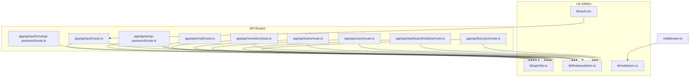

**Diagram sources**
- [auth/route.ts](file://app/api/auth/route.ts#L1-L295)
- [setup-password/route.ts](file://app/api/setup-password/route.ts#L1-L177)
- [auth/change-password/route.ts](file://app/api/auth/change-password/route.ts#L1-L98)
- [members/route.ts](file://app/api/members/route.ts#L1-L179)
- [loans/route.ts](file://app/api/loans/route.ts#L1-L133)
- [users/route.ts](file://app/api/users/route.ts#L1-L126)
- [email/route.ts](file://app/api/email/route.ts#L1-L87)
- [dashboard/initialize/route.ts](file://app/api/dashboard/initialize/route.ts#L1-L186)
- [test-json/route.ts](file://app/api/test-json/route.ts#L1-L137)
- [apiUtils.ts](file://lib/apiUtils.ts#L1-L109)
- [firebaseAdmin.ts](file://lib/firebaseAdmin.ts#L1-L277)
- [validators.ts](file://lib/validators.ts#L1-L236)
- [middleware.ts](file://middleware.ts#L1-L62)
- [auth.tsx](file://lib/auth.tsx#L197-L348)

**Section sources**
- [API_JSON_RESPONSES.md](file://docs/API_JSON_RESPONSES.md#L31-L60)
- [API_BEST_PRACTICES.md](file://docs/API_BEST_PRACTICES.md#L13-L26)

## Core Components
- Standardized JSON response schema:
  - Success: { success: true, data: any, ...metadata }
  - Error: { success: false, error: string }
- Utility functions for consistent responses and validations:
  - apiSuccess, apiError, apiValidationError, apiNotFoundError, apiUnauthorizedError, apiForbiddenError, apiMethodNotAllowed
  - ensureFirebaseInitialized, parseJsonBody, validateRequiredFields, validateEmailFormat
- Firebase Admin SDK wrapper with initialization checks and safe Firestore operations
- Middleware for route access validation and redirects
- Client-side authentication integration that consumes the standardized API responses

**Section sources**
- [API_JSON_RESPONSES.md](file://docs/API_JSON_RESPONSES.md#L20-L30)
- [API_BEST_PRACTICES.md](file://docs/API_BEST_PRACTICES.md#L112-L138)
- [apiUtils.ts](file://lib/apiUtils.ts#L8-L109)
- [firebaseAdmin.ts](file://lib/firebaseAdmin.ts#L110-L266)
- [validators.ts](file://lib/validators.ts#L199-L235)
- [auth.tsx](file://lib/auth.tsx#L197-L348)

## Architecture Overview
The API follows a consistent pattern:
- All routes wrap logic in try/catch
- All code paths return JSON using NextResponse.json or utility functions
- Firebase Admin SDK is checked for initialization before Firestore operations
- Validation is performed early with standardized error responses
- Unsupported HTTP methods return JSON error responses with appropriate status codes

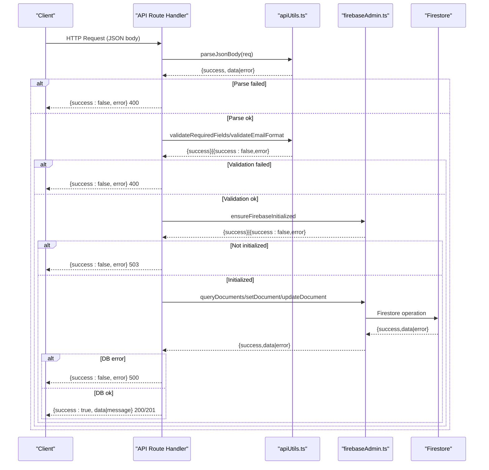

**Diagram sources**
- [test-json/route.ts](file://app/api/test-json/route.ts#L42-L124)
- [apiUtils.ts](file://lib/apiUtils.ts#L77-L109)
- [firebaseAdmin.ts](file://lib/firebaseAdmin.ts#L110-L266)

**Section sources**
- [API_JSON_RESPONSES.md](file://docs/API_JSON_RESPONSES.md#L20-L30)
- [API_BEST_PRACTICES.md](file://docs/API_BEST_PRACTICES.md#L28-L56)

## Detailed Component Analysis

### Authentication Flow (Login)
The login endpoint demonstrates comprehensive error handling, input validation, password verification, and user-member linkage validation. It returns standardized JSON responses and handles method-not-allowed for non-POST methods.

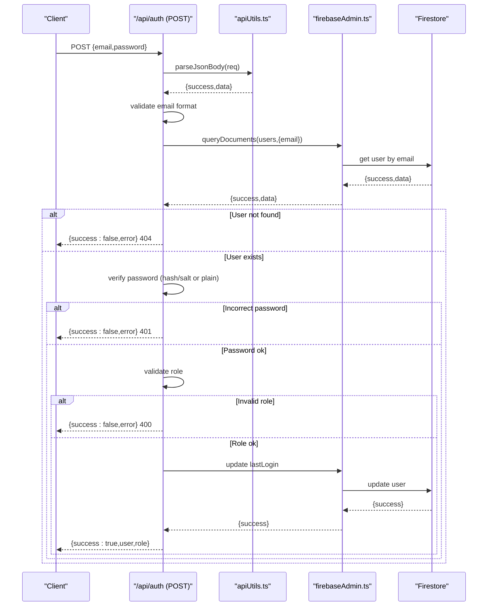

**Diagram sources**
- [auth/route.ts](file://app/api/auth/route.ts#L48-L264)

**Section sources**
- [auth/route.ts](file://app/api/auth/route.ts#L48-L264)

### Password Setup Endpoint
This endpoint validates inputs, checks for existing accounts, and securely stores hashed passwords with salt.

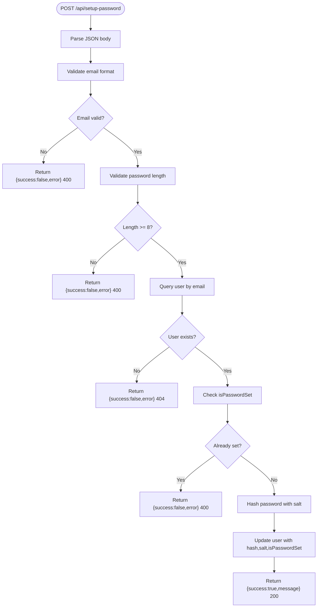

**Diagram sources**
- [setup-password/route.ts](file://app/api/setup-password/route.ts#L25-L145)

**Section sources**
- [setup-password/route.ts](file://app/api/setup-password/route.ts#L25-L145)

### Members CRUD Endpoints
Members endpoints demonstrate consistent GET/POST patterns with validation and conflict handling.

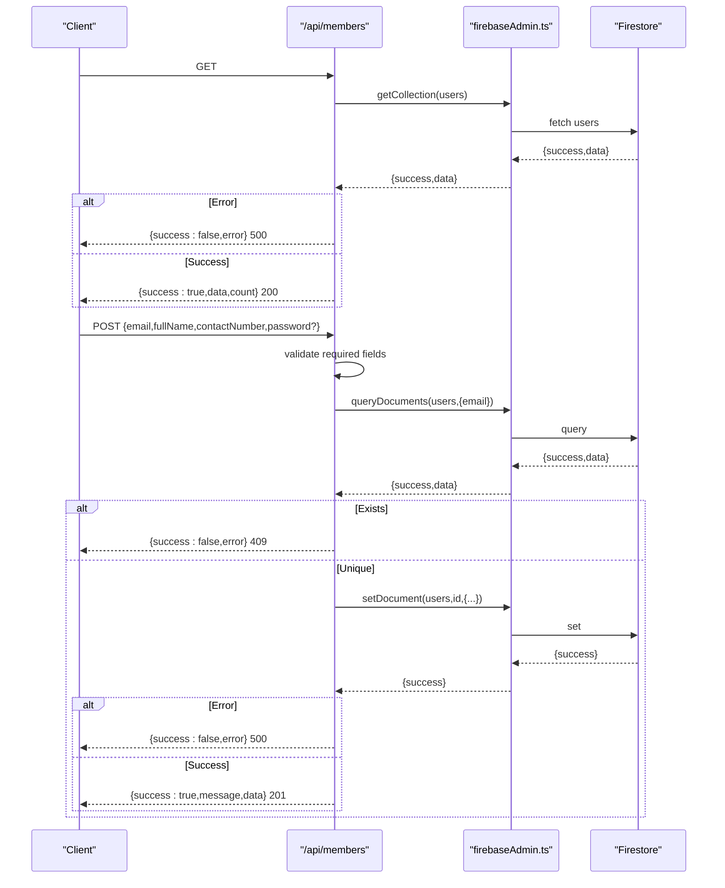

**Diagram sources**
- [members/route.ts](file://app/api/members/route.ts#L25-L158)

**Section sources**
- [members/route.ts](file://app/api/members/route.ts#L25-L158)

### Loans Endpoints
Loan endpoints follow a similar pattern for listing and creating loan records.

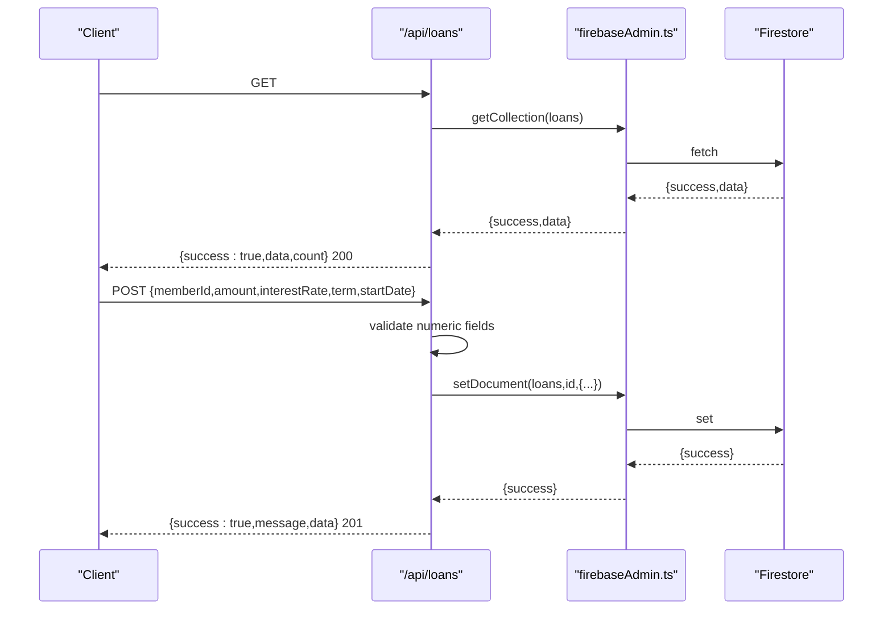

**Diagram sources**
- [loans/route.ts](file://app/api/loans/route.ts#L4-L112)

**Section sources**
- [loans/route.ts](file://app/api/loans/route.ts#L4-L112)

### Users Endpoints
The users endpoint showcases the use of utility functions for consistent validation and response handling.

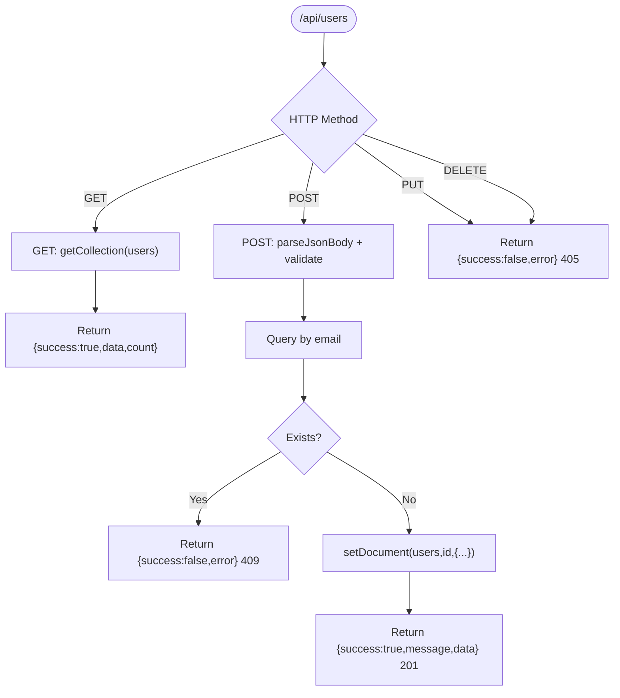

**Diagram sources**
- [users/route.ts](file://app/api/users/route.ts#L18-L126)

**Section sources**
- [users/route.ts](file://app/api/users/route.ts#L18-L126)

### Email Endpoint
A simple endpoint demonstrating minimal validation and JSON responses.

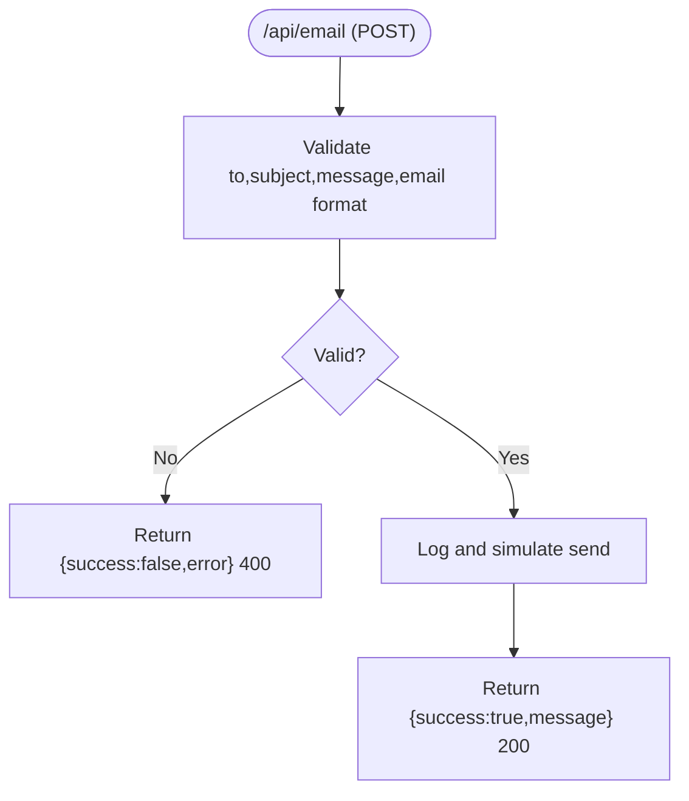

**Diagram sources**
- [email/route.ts](file://app/api/email/route.ts#L4-L56)

**Section sources**
- [email/route.ts](file://app/api/email/route.ts#L4-L56)

### Dashboard Initialization Endpoint
This endpoint initializes sample data and returns a JSON response with a custom Response builder.

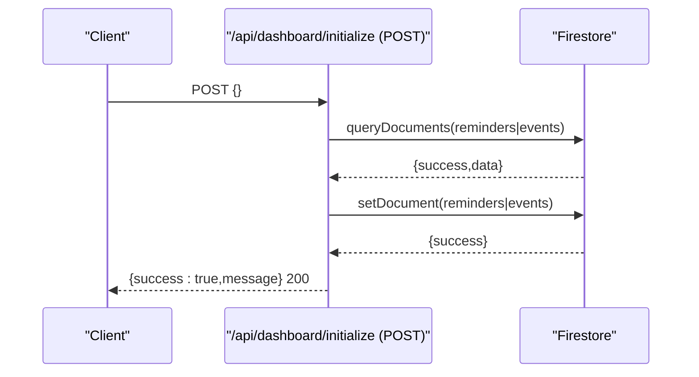

**Diagram sources**
- [dashboard/initialize/route.ts](file://app/api/dashboard/initialize/route.ts#L4-L186)

**Section sources**
- [dashboard/initialize/route.ts](file://app/api/dashboard/initialize/route.ts#L4-L186)

### Test JSON Endpoint
A comprehensive test route demonstrating all error scenarios while ensuring JSON responses.

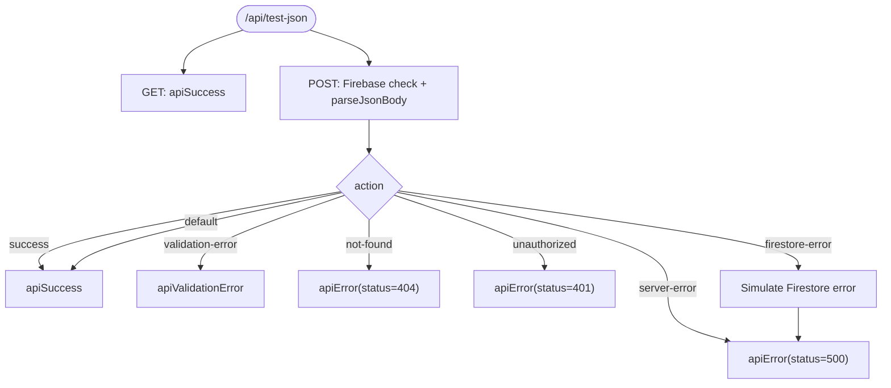

**Diagram sources**
- [test-json/route.ts](file://app/api/test-json/route.ts#L19-L137)

**Section sources**
- [test-json/route.ts](file://app/api/test-json/route.ts#L19-L137)

## Dependency Analysis
- Route handlers depend on:
  - apiUtils.ts for standardized responses and validations
  - firebaseAdmin.ts for safe Firestore operations and initialization checks
  - validators.ts for route access validation in middleware
- Client-side auth integration depends on standardized API responses for login and redirects

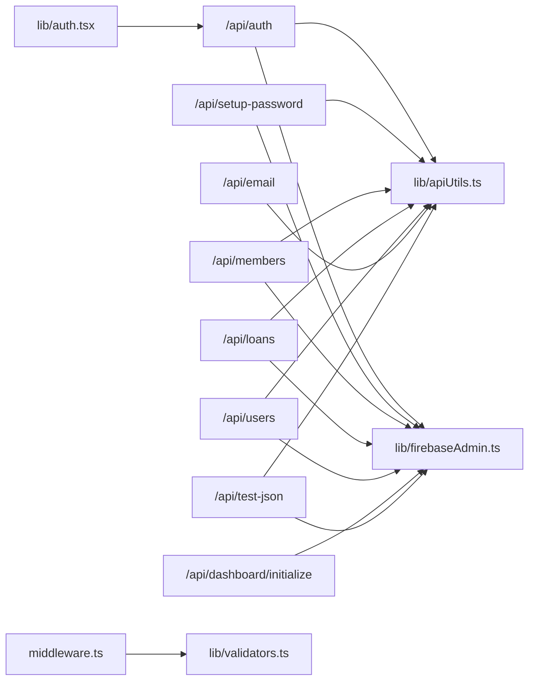

**Diagram sources**
- [auth/route.ts](file://app/api/auth/route.ts#L1-L5)
- [setup-password/route.ts](file://app/api/setup-password/route.ts#L1-L3)
- [members/route.ts](file://app/api/members/route.ts#L1-L3)
- [loans/route.ts](file://app/api/loans/route.ts#L1-L2)
- [users/route.ts](file://app/api/users/route.ts#L1-L11)
- [email/route.ts](file://app/api/email/route.ts#L1)
- [dashboard/initialize/route.ts](file://app/api/dashboard/initialize/route.ts#L1-L3)
- [test-json/route.ts](file://app/api/test-json/route.ts#L1-L11)
- [apiUtils.ts](file://lib/apiUtils.ts#L1-L109)
- [firebaseAdmin.ts](file://lib/firebaseAdmin.ts#L1-L277)
- [validators.ts](file://lib/validators.ts#L1-L236)
- [middleware.ts](file://middleware.ts#L1-L62)
- [auth.tsx](file://lib/auth.tsx#L197-L348)

**Section sources**
- [API_JSON_RESPONSES.md](file://docs/API_JSON_RESPONSES.md#L62-L70)
- [API_BEST_PRACTICES.md](file://docs/API_BEST_PRACTICES.md#L139-L167)

## Performance Considerations
- Prefer batched Firestore queries where applicable to reduce round-trips
- Use pagination for large collections (count and limit) to avoid large payloads
- Cache non-sensitive metadata at the edge when feasible
- Minimize synchronous work in API routes; offload heavy tasks to background jobs
- Keep request bodies small and validated early to fail fast

[No sources needed since this section provides general guidance]

## Troubleshooting Guide
Common issues and resolutions:
- HTML error pages instead of JSON:
  - Ensure all routes return JSON using NextResponse.json or utility functions
  - Verify try/catch wrapping and error logging
- Firebase initialization failures:
  - Check environment variables and initialization status
  - Use ensureFirebaseInitialized before Firestore operations
- Validation errors:
  - Use validateRequiredFields and validateEmailFormat
  - Return 400 for validation failures
- Method not allowed:
  - Explicitly handle unsupported methods and return JSON error with 405

**Section sources**
- [API_JSON_RESPONSES.md](file://docs/API_JSON_RESPONSES.md#L130-L139)
- [API_BEST_PRACTICES.md](file://docs/API_BEST_PRACTICES.md#L210-L230)
- [firebaseAdmin.ts](file://lib/firebaseAdmin.ts#L13-L108)
- [apiUtils.ts](file://lib/apiUtils.ts#L61-L109)

## Conclusion
The SAMPA Cooperative Management System enforces a strict, standardized API design that prioritizes reliability, consistency, and security. By adhering to the documented patterns—standardized JSON responses, comprehensive validation, robust error handling, and secure authentication—the system ensures predictable client integration and maintainable server-side code.

[No sources needed since this section summarizes without analyzing specific files]

## Appendices

### HTTP Methods and URL Routing Patterns
- Use plural nouns for resource collections (e.g., /api/members, /api/loans, /api/users)
- Prefer RESTful patterns: GET for retrieval, POST for creation, PUT/DELETE for updates/deletion where applicable
- Return appropriate status codes per error categories

**Section sources**
- [members/route.ts](file://app/api/members/route.ts#L25-L158)
- [loans/route.ts](file://app/api/loans/route.ts#L4-L112)
- [users/route.ts](file://app/api/users/route.ts#L18-L126)
- [email/route.ts](file://app/api/email/route.ts#L4-L56)

### Error Handling Patterns and Status Codes
- 200: Success
- 201: Created
- 400: Bad Request (validation errors)
- 401: Unauthorized
- 403: Forbidden
- 404: Not Found
- 405: Method Not Allowed
- 409: Conflict
- 500: Internal Server Error
- 503: Service Unavailable

**Section sources**
- [API_BEST_PRACTICES.md](file://docs/API_BEST_PRACTICES.md#L114-L126)

### Authentication Integration Patterns
- Client-side login calls /api/auth and expects { success, user, role }
- On success, client sets cookies and redirects to role-specific dashboard
- Password setup required is signaled with needsPasswordSetup flag

**Section sources**
- [auth.tsx](file://lib/auth.tsx#L197-L348)
- [auth/route.ts](file://app/api/auth/route.ts#L132-L139)

### Request/Response Transformation Guidelines
- Always parse JSON bodies safely; return 400 on parse errors
- Validate required fields and formats early
- Transform client-provided data minimally; keep payloads lean
- Return consistent metadata (e.g., count) for list endpoints

**Section sources**
- [API_BEST_PRACTICES.md](file://docs/API_BEST_PRACTICES.md#L78-L92)
- [apiUtils.ts](file://lib/apiUtils.ts#L77-L109)

### Middleware Usage
- Middleware excludes API routes and static assets
- Validates route access based on user role and path prefixes
- Redirects unauthorized or conflicting access attempts

**Section sources**
- [middleware.ts](file://middleware.ts#L5-L56)
- [validators.ts](file://lib/validators.ts#L199-L235)

### API Versioning, Compatibility, and Deprecation
- Current implementation does not define explicit API versioning
- Maintain backward compatibility by preserving response shapes and adding optional fields
- Introduce deprecation notices via headers or response metadata before removing endpoints

[No sources needed since this section provides general guidance]

### Rate Limiting, Security Headers, and CORS
- Rate limiting: Implement at the edge or reverse proxy; configure per-route as needed
- Security headers: Enforce Content Security Policy, Strict-Transport-Security, X-Frame-Options, X-Content-Type-Options
- CORS: Configure origin whitelisting and preflight handling for browser clients

[No sources needed since this section provides general guidance]

### Guidelines for New Endpoint Development
- Follow the route template pattern with try/catch and JSON responses
- Use apiUtils for validation and standardized errors
- Check Firebase initialization before Firestore operations
- Add method guards for unsupported HTTP methods
- Include tests for success, validation, and error scenarios

**Section sources**
- [API_BEST_PRACTICES.md](file://docs/API_BEST_PRACTICES.md#L30-L56)
- [API_JSON_RESPONSES.md](file://docs/API_JSON_RESPONSES.md#L87-L108)
- [test-json/route.ts](file://app/api/test-json/route.ts#L19-L137)