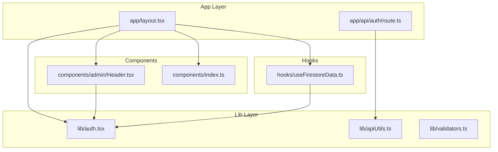
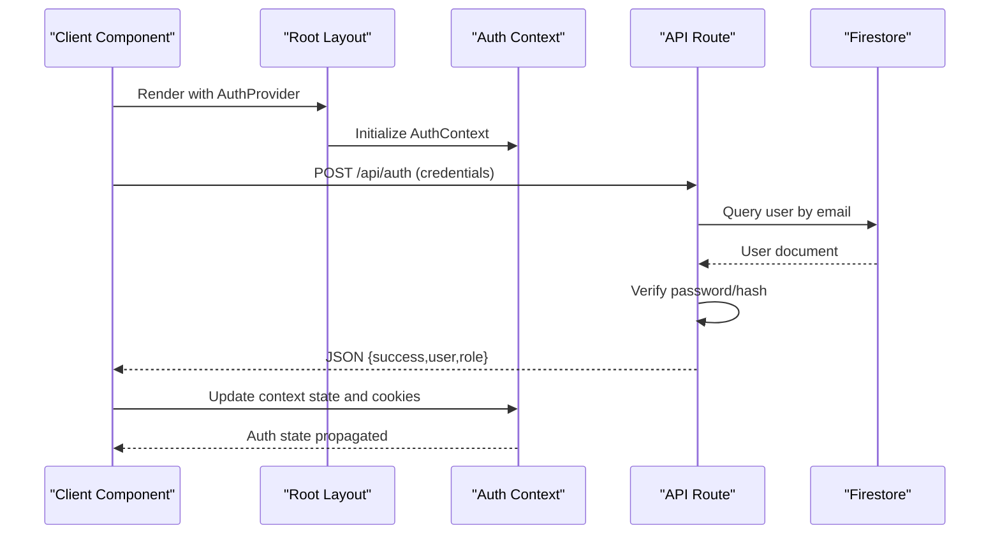
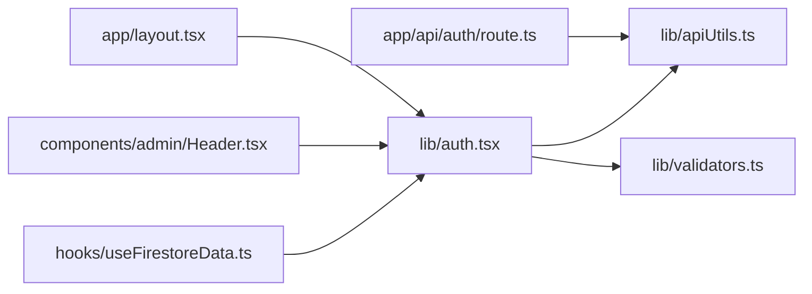

# Code Standards & Formatting

<cite>
**Referenced Files in This Document**
- [eslint.config.mjs](file://eslint.config.mjs)
- [package.json](file://package.json)
- [tsconfig.json](file://tsconfig.json)
- [next.config.ts](file://next.config.ts)
- [postcss.config.mjs](file://postcss.config.mjs)
- [lib/auth.tsx](file://lib/auth.tsx)
- [lib/apiUtils.ts](file://lib/apiUtils.ts)
- [lib/validators.ts](file://lib/validators.ts)
- [hooks/useFirestoreData.ts](file://hooks/useFirestoreData.ts)
- [app/layout.tsx](file://app/layout.tsx)
- [app/api/auth/route.ts](file://app/api/auth/route.ts)
- [components/admin/Header.tsx](file://components/admin/Header.tsx)
- [components/index.ts](file://components/index.ts)
</cite>

## Table of Contents
1. [Introduction](#introduction)
2. [Project Structure](#project-structure)
3. [Core Components](#core-components)
4. [Architecture Overview](#architecture-overview)
5. [Detailed Component Analysis](#detailed-component-analysis)
6. [Dependency Analysis](#dependency-analysis)
7. [Performance Considerations](#performance-considerations)
8. [Troubleshooting Guide](#troubleshooting-guide)
9. [Conclusion](#conclusion)
10. [Appendices](#appendices)

## Introduction
This document defines the code standards and formatting guidelines for the SAMPA Cooperative Management System. It consolidates ESLint configuration, TypeScript implementation standards, formatting conventions, component organization principles, and coding patterns observed across the codebase. It also outlines code review standards, linting requirements, automated quality checks, and cross-environment consistency practices.

## Project Structure
The project follows a Next.js app directory structure with a clear separation of client components, server APIs, shared libraries, hooks, and reusable components. Key conventions:
- Client components under app and components folders use the “use client” directive when state or effects are involved.
- Server API routes live under app/api with route handlers per endpoint.
- Shared logic resides in lib (authentication, validators, utilities, services).
- Reusable UI components are exported via barrel files (e.g., components/index.ts).

**Diagram sources**
- [app/layout.tsx](file://app/layout.tsx#L1-L37)
- [app/api/auth/route.ts](file://app/api/auth/route.ts#L1-L295)
- [lib/auth.tsx](file://lib/auth.tsx#L1-L682)
- [lib/apiUtils.ts](file://lib/apiUtils.ts#L1-L109)
- [lib/validators.ts](file://lib/validators.ts#L1-L236)
- [hooks/useFirestoreData.ts](file://hooks/useFirestoreData.ts#L1-L182)
- [components/admin/Header.tsx](file://components/admin/Header.tsx#L1-L105)
- [components/index.ts](file://components/index.ts#L1-L14)

**Section sources**
- [app/layout.tsx](file://app/layout.tsx#L1-L37)
- [components/index.ts](file://components/index.ts#L1-L14)

## Core Components
- ESLint configuration is centralized in a modern flat config that extends Next.js core web vitals and TypeScript presets, with explicit overrides for ignored paths.
- TypeScript strictness is enabled with bundler module resolution and JSX transform configured for Next.js.
- PostCSS/Tailwind is configured via a minimal PostCSS config.
- Next.js configuration is present with a typed config placeholder.

**Section sources**
- [eslint.config.mjs](file://eslint.config.mjs#L1-L19)
- [package.json](file://package.json#L1-L53)
- [tsconfig.json](file://tsconfig.json#L1-L35)
- [postcss.config.mjs](file://postcss.config.mjs#L1-L8)
- [next.config.ts](file://next.config.ts#L1-L8)

## Architecture Overview
The system enforces a layered architecture:
- UI layer: Next.js app directory pages and components.
- Domain layer: Authentication, validation, and API utilities.
- Data layer: Firestore service abstractions used by hooks and domain logic.

**Diagram sources**
- [app/layout.tsx](file://app/layout.tsx#L1-L37)
- [lib/auth.tsx](file://lib/auth.tsx#L158-L348)
- [app/api/auth/route.ts](file://app/api/auth/route.ts#L48-L264)

## Detailed Component Analysis

### ESLint Configuration and Enforcement
- Presets: Next.js core web vitals and TypeScript configurations are extended.
- Overrides: Explicitly override default ignores to include development artifacts and ensure linting coverage where needed.
- Scripts: The lint script is defined to run ESLint across the project.

Recommended additions for stricter enforcement:
- Disable transpiling to native ESM in linting environments.
- Enforce import order and consistent file extensions.
- Configure plugin rules for React hooks and Next.js app directory conventions.

**Section sources**
- [eslint.config.mjs](file://eslint.config.mjs#L1-L19)
- [package.json](file://package.json#L5-L14)

### TypeScript Implementation Standards
- Strict mode: Enabled for robust type checking.
- Module resolution: Bundler for Next.js compatibility.
- JSX transform: React JSX for modern React.
- Path aliases: Workspace alias @/* mapped to repository root.
- Type safety patterns:
  - Interfaces for domain entities (e.g., AppUser, CreateUserParams).
  - Discriminated unions for roles and enums.
  - Narrowed types for API responses and route guards.
  - Consistent use of generics in hooks (e.g., useFirestoreData<T>).

Best practices:
- Prefer readonly and partial utility types for props and updates.
- Use branded types or literal types for constrained values.
- Centralize shared types in lib/types when applicable.

**Section sources**
- [tsconfig.json](file://tsconfig.json#L1-L35)
- [lib/auth.tsx](file://lib/auth.tsx#L11-L61)
- [hooks/useFirestoreData.ts](file://hooks/useFirestoreData.ts#L11-L17)

### Code Formatting Conventions
- Prettier: Not explicitly configured in the repository; formatting is not enforced by default.
- Import organization: Use path aliases (@/*) consistently.
- File naming:
  - React components: PascalCase for filenames (e.g., Header.tsx).
  - API routes: route.ts for endpoints.
  - Utilities: camelCase for filenames (e.g., apiUtils.ts).
- Export patterns:
  - Barrel exports for component groups (components/index.ts).
  - Named and default exports aligned with usage.

Recommendations:
- Introduce a formatter preset (e.g., Prettier) and integrate with editor configs.
- Enforce trailing commas, single quotes, and semicolon-less style.
- Align import order: external libs, then @/* aliases, then relative paths.

**Section sources**
- [components/index.ts](file://components/index.ts#L1-L14)
- [components/admin/Header.tsx](file://components/admin/Header.tsx#L1-L105)

### Component Organization Principles
- Folder structure:
  - app: Page routes and nested layouts.
  - components: Reusable UI components grouped by domain (admin, shared, user).
  - hooks: Custom hooks for data fetching and state.
  - lib: Business logic, utilities, and services.
- Naming:
  - Components: PascalCase.
  - Hooks: useXxx pattern.
  - Utilities: descriptive camelCase.
- Exports:
  - Barrel files consolidate imports.
  - Prefer default exports for pages/components; named exports for utilities.

**Section sources**
- [components/index.ts](file://components/index.ts#L1-L14)
- [hooks/useFirestoreData.ts](file://hooks/useFirestoreData.ts#L1-L182)

### Coding Patterns for React Components, Interfaces, and Utilities
- React components:
  - Use “use client” for components with state or effects.
  - Accept props via strongly-typed interfaces.
  - Keep render logic pure; delegate side effects to hooks.
- TypeScript interfaces:
  - Define domain shapes (e.g., AppUser, FirestoreUser).
  - Use discriminated unions for role-based routing.
- Utility functions:
  - Centralize API response helpers (apiUtils.ts).
  - Encapsulate validation logic (validators.ts).
  - Provide typed hooks for data access (useFirestoreData.ts).

**Section sources**
- [components/admin/Header.tsx](file://components/admin/Header.tsx#L1-L105)
- [lib/auth.tsx](file://lib/auth.tsx#L11-L61)
- [lib/apiUtils.ts](file://lib/apiUtils.ts#L1-L109)
- [lib/validators.ts](file://lib/validators.ts#L1-L236)
- [hooks/useFirestoreData.ts](file://hooks/useFirestoreData.ts#L1-L182)

### Examples of Properly Formatted Code and Common Violations
- Properly formatted component:
  - Uses “use client”, PascalCase filename, default export, and typed props.
  - Example path: [components/admin/Header.tsx](file://components/admin/Header.tsx#L1-L105)
- Common violations and corrections:
  - Missing “use client” in stateful components: add directive at the top.
  - Mixed naming: rename to PascalCase for components and camelCase for utilities.
  - Inconsistent imports: align to @/* aliases and enforce alphabetical order.
  - Untyped props: define interfaces and pass props explicitly.

**Section sources**
- [components/admin/Header.tsx](file://components/admin/Header.tsx#L1-L105)

### API Route Standards and Type Safety
- Always return JSON responses; never HTML.
- Validate inputs early and return standardized error responses.
- Use typed request bodies and validated roles.
- Centralize response helpers for consistency.

**Section sources**
- [app/api/auth/route.ts](file://app/api/auth/route.ts#L48-L264)
- [lib/apiUtils.ts](file://lib/apiUtils.ts#L8-L34)

### Authentication Context and Validation
- Strongly typed context with explicit interfaces for user and actions.
- Role-based routing and validation helpers ensure correct access control.
- Consistent cookie handling and automatic redirects based on roles.

**Section sources**
- [lib/auth.tsx](file://lib/auth.tsx#L11-L61)
- [lib/auth.tsx](file://lib/auth.tsx#L158-L348)
- [lib/validators.ts](file://lib/validators.ts#L1-L236)

## Dependency Analysis

**Diagram sources**
- [lib/auth.tsx](file://lib/auth.tsx#L1-L682)
- [lib/apiUtils.ts](file://lib/apiUtils.ts#L1-L109)
- [lib/validators.ts](file://lib/validators.ts#L1-L236)
- [hooks/useFirestoreData.ts](file://hooks/useFirestoreData.ts#L1-L182)
- [components/admin/Header.tsx](file://components/admin/Header.tsx#L1-L105)
- [app/layout.tsx](file://app/layout.tsx#L1-L37)
- [app/api/auth/route.ts](file://app/api/auth/route.ts#L1-L295)

**Section sources**
- [lib/auth.tsx](file://lib/auth.tsx#L1-L682)
- [lib/validators.ts](file://lib/validators.ts#L1-L236)
- [hooks/useFirestoreData.ts](file://hooks/useFirestoreData.ts#L1-L182)
- [components/admin/Header.tsx](file://components/admin/Header.tsx#L1-L105)
- [app/layout.tsx](file://app/layout.tsx#L1-L37)
- [app/api/auth/route.ts](file://app/api/auth/route.ts#L1-L295)

## Performance Considerations
- Client-side sorting in hooks trades CPU for fewer Firestore indexes; acceptable for moderate datasets.
- Real-time listeners provide immediate updates; ensure cleanup to avoid leaks.
- Avoid unnecessary re-renders by memoizing callbacks and using stable references.

[No sources needed since this section provides general guidance]

## Troubleshooting Guide
- Lint failures:
  - Run the lint script and address rule violations.
  - Extend ESLint with custom rules for import ordering and React hooks usage.
- API errors:
  - Ensure all endpoints return JSON via standardized helpers.
  - Validate required fields and email format before processing.
- Authentication issues:
  - Confirm cookies are set and user role is present.
  - Use validation helpers to prevent route conflicts.

**Section sources**
- [package.json](file://package.json#L5-L14)
- [lib/apiUtils.ts](file://lib/apiUtils.ts#L1-L109)
- [lib/validators.ts](file://lib/validators.ts#L112-L191)
- [lib/auth.tsx](file://lib/auth.tsx#L314-L340)

## Conclusion
The SAMPA Cooperative Management System follows a clean, layered architecture with strong TypeScript typing and Next.js conventions. By adopting the standards and recommendations in this document—ESLint configuration, TypeScript strictness, consistent formatting, component organization, and API response patterns—the team can maintain a high-quality, consistent codebase across environments and contributors.

[No sources needed since this section summarizes without analyzing specific files]

## Appendices

### A. ESLint Configuration Summary
- Extends Next.js core web vitals and TypeScript presets.
- Overrides default ignores to include development artifacts.
- Lint script defined for automated checks.

**Section sources**
- [eslint.config.mjs](file://eslint.config.mjs#L1-L19)
- [package.json](file://package.json#L5-L14)

### B. TypeScript Configuration Summary
- Strict mode enabled.
- Bundler module resolution.
- JSX transform set to react-jsx.
- Path alias @/* configured.

**Section sources**
- [tsconfig.json](file://tsconfig.json#L1-L35)

### C. Formatting Checklist
- Use Prettier (recommended) with trailing commas and single quotes.
- Enforce import order: external, @/*, relative.
- Maintain PascalCase for components and camelCase for utilities.
- Prefer barrel exports for component groups.

**Section sources**
- [components/index.ts](file://components/index.ts#L1-L14)