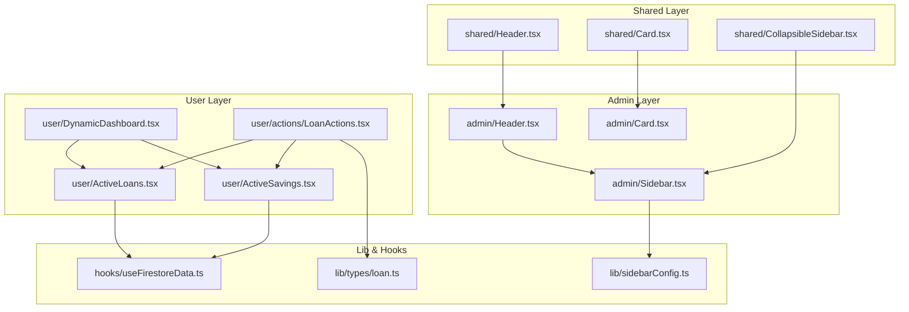
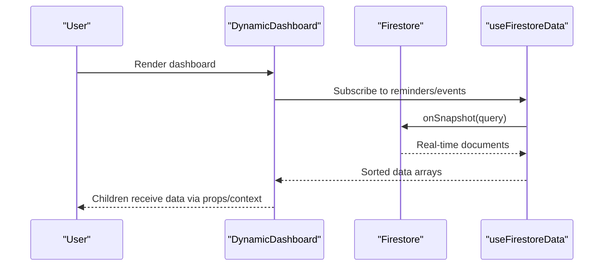
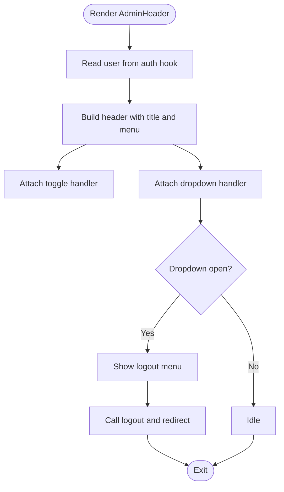
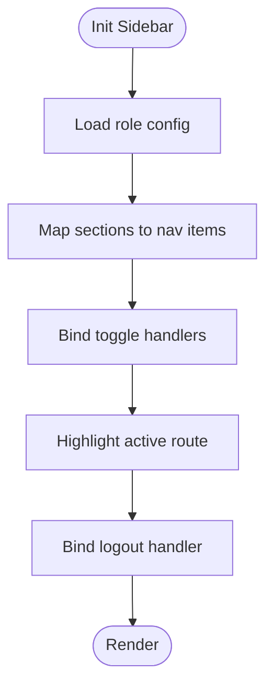
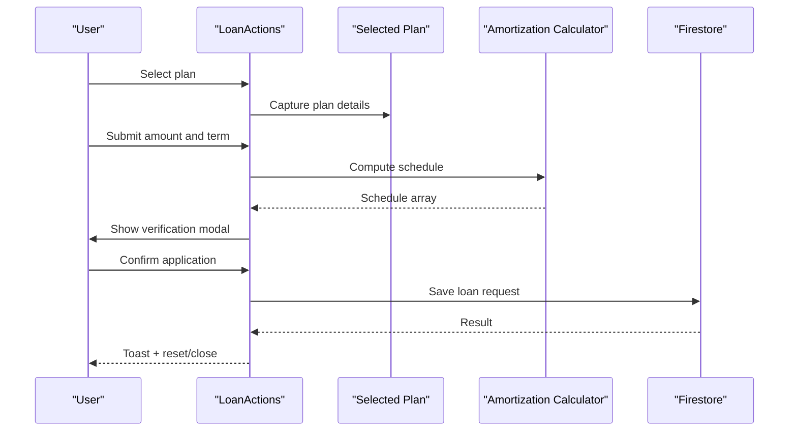
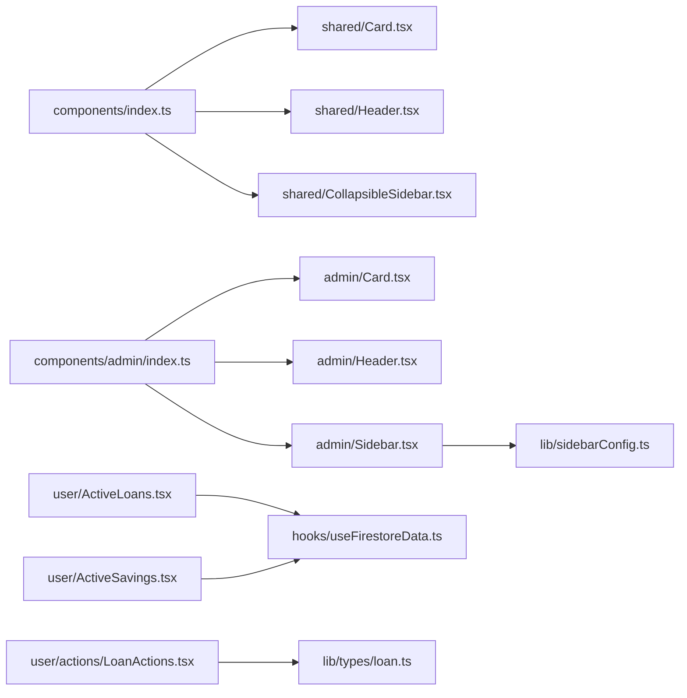

# Component Development Guidelines

<cite>
**Referenced Files in This Document**
- [Header.tsx](file://components/admin/Header.tsx)
- [Sidebar.tsx](file://components/admin/Sidebar.tsx)
- [Card.tsx](file://components/admin/Card.tsx)
- [Header.tsx](file://components/shared/Header.tsx)
- [Card.tsx](file://components/shared/Card.tsx)
- [Button.tsx](file://components/auth/Button.tsx)
- [Input.tsx](file://components/auth/Input.tsx)
- [CollapsibleSidebar.tsx](file://components/shared/CollapsibleSidebar.tsx)
- [DynamicDashboard.tsx](file://components/user/DynamicDashboard.tsx)
- [LoanActions.tsx](file://components/user/actions/LoanActions.tsx)
- [ActiveLoans.tsx](file://components/user/ActiveLoans.tsx)
- [ActiveSavings.tsx](file://components/user/ActiveSavings.tsx)
- [globals.css](file://app/globals.css)
- [sidebarConfig.ts](file://lib/sidebarConfig.ts)
- [loan.ts](file://lib/types/loan.ts)
- [useFirestoreData.ts](file://hooks/useFirestoreData.ts)
- [index.ts](file://components/index.ts)
- [index.ts](file://components/admin/index.ts)
</cite>

## Table of Contents
1. [Introduction](#introduction)
2. [Project Structure](#project-structure)
3. [Core Components](#core-components)
4. [Architecture Overview](#architecture-overview)
5. [Detailed Component Analysis](#detailed-component-analysis)
6. [Dependency Analysis](#dependency-analysis)
7. [Performance Considerations](#performance-considerations)
8. [Testing and Accessibility](#testing-and-accessibility)
9. [Troubleshooting Guide](#troubleshooting-guide)
10. [Conclusion](#conclusion)

## Introduction
This document defines reusable component development guidelines for the SAMPA Cooperative Management System. It consolidates patterns observed in the codebase for React functional components with TypeScript props, state management, composition, styling with Tailwind CSS, and responsive design. It also outlines best practices for component organization, testing, accessibility, and performance optimization, with concrete examples drawn from the repository.

## Project Structure
The component system is organized by domain and reuse scope:
- Shared components: generic UI elements used across roles (e.g., shared Card, Header, CollapsibleSidebar)
- Role-specific components: admin, user, and other officer panels (e.g., admin Header, admin Sidebar)
- Feature-specific components: user actions and dashboards (e.g., ActiveLoans, ActiveSavings, DynamicDashboard)
- Utility and configuration: sidebar configuration, custom hooks, and global styles

**Diagram sources**
- [Header.tsx](file://components/shared/Header.tsx#L1-L26)
- [Card.tsx](file://components/shared/Card.tsx#L1-L16)
- [CollapsibleSidebar.tsx](file://components/shared/CollapsibleSidebar.tsx#L1-L156)
- [Header.tsx](file://components/admin/Header.tsx#L1-L105)
- [Sidebar.tsx](file://components/admin/Sidebar.tsx#L1-L279)
- [Card.tsx](file://components/admin/Card.tsx#L1-L35)
- [DynamicDashboard.tsx](file://components/user/DynamicDashboard.tsx#L1-L149)
- [ActiveLoans.tsx](file://components/user/ActiveLoans.tsx#L1-L177)
- [ActiveSavings.tsx](file://components/user/ActiveSavings.tsx#L1-L270)
- [LoanActions.tsx](file://components/user/actions/LoanActions.tsx#L1-L619)
- [sidebarConfig.ts](file://lib/sidebarConfig.ts#L1-L262)
- [loan.ts](file://lib/types/loan.ts#L1-L19)
- [useFirestoreData.ts](file://hooks/useFirestoreData.ts#L1-L182)

**Section sources**
- [index.ts](file://components/index.ts#L1-L14)
- [index.ts](file://components/admin/index.ts#L1-L11)

## Core Components
- Functional components with TypeScript props: components consistently define explicit props interfaces and use default values where appropriate.
- State management: local component state for UI toggles and forms; centralized auth and Firestore state via hooks and services.
- Composition: wrapper components (e.g., DynamicDashboard) provide context-like data to children; shared components are reused across roles.
- Styling: Tailwind utility classes dominate; consistent spacing, colors, and responsive breakpoints are applied.

Examples:
- Admin Card with optional title and className
- Auth Button with variant and loading states
- CollapsibleSidebar with navigation and logout
- ActiveSavings with compact/full modes and refresh capability

**Section sources**
- [Card.tsx](file://components/admin/Card.tsx#L1-L35)
- [Button.tsx](file://components/auth/Button.tsx#L1-L51)
- [CollapsibleSidebar.tsx](file://components/shared/CollapsibleSidebar.tsx#L1-L156)
- [ActiveSavings.tsx](file://components/user/ActiveSavings.tsx#L1-L270)

## Architecture Overview
The system follows a layered pattern:
- Presentation layer: functional components with clear props and minimal internal state
- Domain layer: role-specific components (admin, user) compose shared components
- Data layer: custom hooks and services manage Firestore queries and state
- Configuration layer: role-based navigation and type definitions

**Diagram sources**
- [DynamicDashboard.tsx](file://components/user/DynamicDashboard.tsx#L1-L149)
- [useFirestoreData.ts](file://hooks/useFirestoreData.ts#L1-L182)

## Detailed Component Analysis

### Admin Header
- Purpose: Top navigation for admin panel with sidebar toggle and user dropdown
- Props: sidebarCollapsed, onToggleSidebar
- Patterns: inline SVG icons, controlled dropdown state, logout flow with auth hook

**Diagram sources**
- [Header.tsx](file://components/admin/Header.tsx#L1-L105)

**Section sources**
- [Header.tsx](file://components/admin/Header.tsx#L1-L105)

### Admin Sidebar
- Purpose: Collapsible navigation with role-based sections and active highlighting
- Props: collapsed, onToggle, role
- Patterns: roleSidebarConfig mapping, icon components, dropdown sections, logout with immediate redirect

**Diagram sources**
- [Sidebar.tsx](file://components/admin/Sidebar.tsx#L1-L279)
- [sidebarConfig.ts](file://lib/sidebarConfig.ts#L1-L262)

**Section sources**
- [Sidebar.tsx](file://components/admin/Sidebar.tsx#L1-L279)
- [sidebarConfig.ts](file://lib/sidebarConfig.ts#L1-L262)

### Collapsible Sidebar (Shared)
- Purpose: Reusable collapsible navigation for user roles
- Props: collapsed, onToggle
- Patterns: simple navigation items, active highlighting, logout with user-specific redirect

**Section sources**
- [CollapsibleSidebar.tsx](file://components/shared/CollapsibleSidebar.tsx#L1-L156)

### Auth Components (Button, Input)
- Button: Extends button HTML attributes, supports isLoading and variant selection; composes base and variant classes
- Input: Extends input HTML attributes, supports label and error messaging; conditionally applies error styles

**Section sources**
- [Button.tsx](file://components/auth/Button.tsx#L1-L51)
- [Input.tsx](file://components/auth/Input.tsx#L1-L27)

### DynamicDashboard
- Purpose: Wrapper component that fetches and sorts reminders and events for downstream components
- Props: children
- Patterns: useEffect-driven data fetch, filtering and sorting logic, loading/error states, exports types for consumers

**Section sources**
- [DynamicDashboard.tsx](file://components/user/DynamicDashboard.tsx#L1-L149)

### LoanActions
- Purpose: Loan application flow with plan selection, form validation, amortization calculation, and submission
- Props: loanPlans (default empty array), onLoanApplied (callback)
- Patterns: modal-based UX, pagination for amortization preview, toast feedback, member info fallback

**Diagram sources**
- [LoanActions.tsx](file://components/user/actions/LoanActions.tsx#L1-L619)

**Section sources**
- [LoanActions.tsx](file://components/user/actions/LoanActions.tsx#L1-L619)
- [loan.ts](file://lib/types/loan.ts#L1-L19)

### ActiveLoans
- Purpose: Display user’s active loans with formatted amounts/dates and retry logic
- Patterns: useEffect for data fetch, error handling, currency/date formatting helpers

**Section sources**
- [ActiveLoans.tsx](file://components/user/ActiveLoans.tsx#L1-L177)

### ActiveSavings
- Purpose: Display recent savings transactions and total balance; supports compact mode and refresh
- Patterns: useEffect with visibility change listener, compact vs full rendering, currency formatting

**Section sources**
- [ActiveSavings.tsx](file://components/user/ActiveSavings.tsx#L1-L270)

### Shared Components
- shared/Card: Title-aware card with optional className
- shared/Header: Fixed header with navigation links and mobile menu hint

**Section sources**
- [Card.tsx](file://components/shared/Card.tsx#L1-L16)
- [Header.tsx](file://components/shared/Header.tsx#L1-L26)

## Dependency Analysis
- Component exports: components/index.ts and components/admin/index.ts consolidate exports for easy imports across the app
- Role-based navigation: admin components depend on lib/sidebarConfig.ts for role-aware menus
- Data fetching: user components rely on hooks/useFirestoreData.ts for real-time, client-side sorted lists
- Types: lib/types/loan.ts defines shared loan-related interfaces used by LoanActions

**Diagram sources**
- [index.ts](file://components/index.ts#L1-L14)
- [index.ts](file://components/admin/index.ts#L1-L11)
- [sidebarConfig.ts](file://lib/sidebarConfig.ts#L1-L262)
- [useFirestoreData.ts](file://hooks/useFirestoreData.ts#L1-L182)
- [loan.ts](file://lib/types/loan.ts#L1-L19)

**Section sources**
- [index.ts](file://components/index.ts#L1-L14)
- [index.ts](file://components/admin/index.ts#L1-L11)

## Performance Considerations
- Prefer client-side sorting in hooks to avoid composite Firestore indexes; ensure sort keys are used judiciously
- Memoize derived computations (e.g., useMemo for paginated amortization previews)
- Lazy-load heavy modals and tables; keep render trees shallow for frequent updates
- Use responsive utilities sparingly; avoid excessive nested wrappers to reduce reflow
- Debounce or throttle frequent UI interactions (e.g., search/filter inputs)

## Testing and Accessibility
- Unit tests: Focus on pure functions (formatting helpers), prop validation, and error branches
- Integration tests: Verify component interactions (e.g., LoanActions modal flow) and data fetch hooks
- Accessibility: Ensure buttons and links have meaningful labels, use focus-visible styles, and provide ARIA roles where appropriate
- Keyboard navigation: Test tab order and focus traps for modal dialogs

## Troubleshooting Guide
- Authentication errors: Check auth hook usage and logout redirects in admin and shared sidebars
- Firestore initialization: Confirm db availability before subscribing; handle failed-precondition gracefully
- Data loading: Use loading flags and error messages; provide retry actions
- Styling regressions: Validate Tailwind utilities and ensure globals.css imports Tailwind directives

**Section sources**
- [Header.tsx](file://components/admin/Header.tsx#L1-L105)
- [CollapsibleSidebar.tsx](file://components/shared/CollapsibleSidebar.tsx#L1-L156)
- [useFirestoreData.ts](file://hooks/useFirestoreData.ts#L1-L182)

## Conclusion
The SAMPA Cooperative Management System demonstrates a clean, scalable component architecture:
- Clear separation of concerns across shared, role-specific, and feature components
- Strong TypeScript props and default values for predictable APIs
- Composable patterns with wrapper components and role-based navigation
- Tailwind-driven styling with consistent conventions and responsive design
- Real-time data flows with custom hooks and robust error handling

Adhering to these guidelines ensures components remain reusable, maintainable, and accessible across the application.