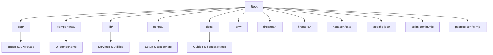
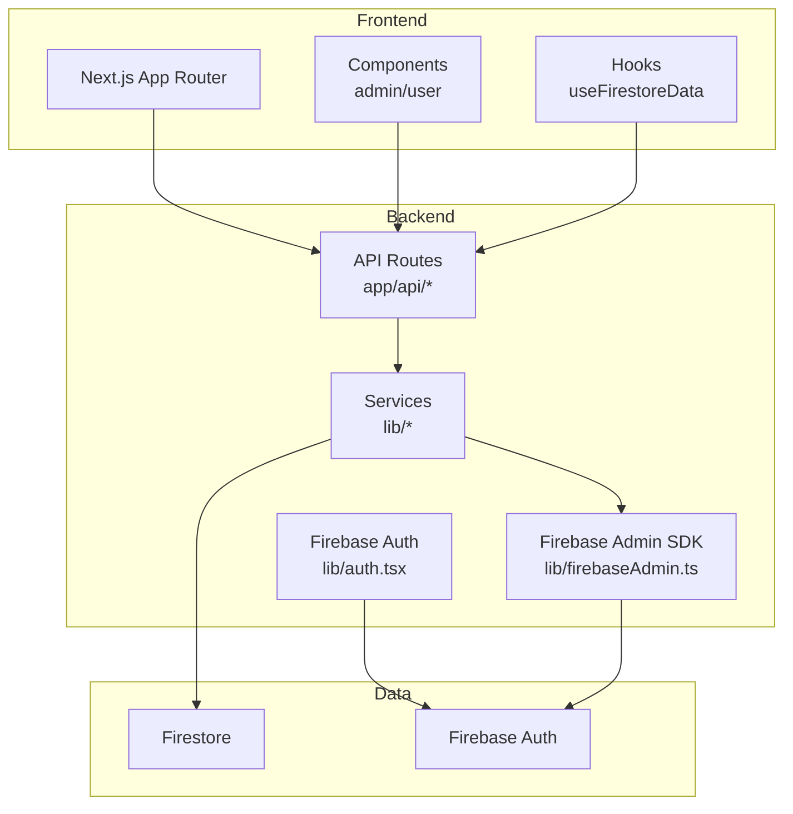
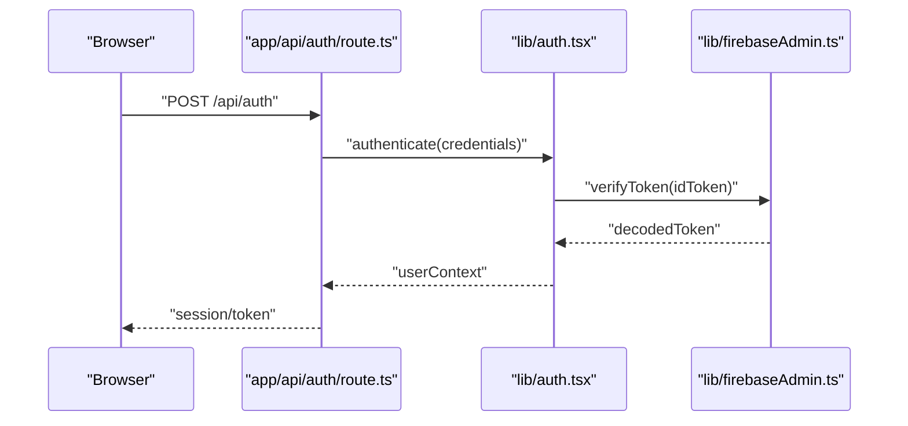
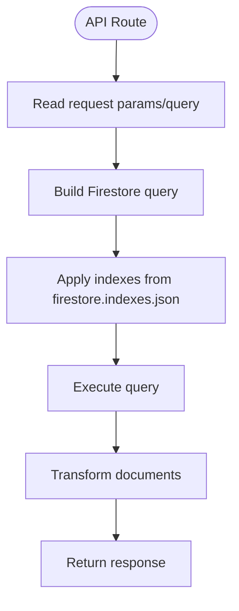
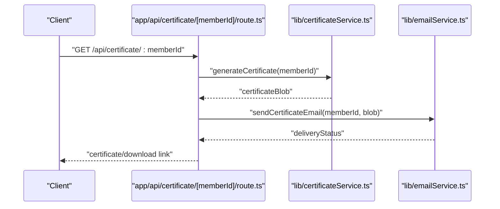
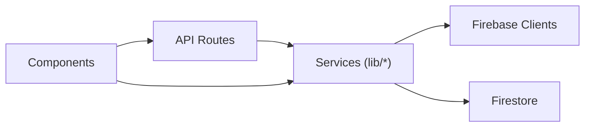

# Contribution Workflow & Processes

<cite>
**Referenced Files in This Document**
- [README.md](file://README.md)
- [package.json](file://package.json)
- [tsconfig.json](file://tsconfig.json)
- [eslint.config.mjs](file://eslint.config.mjs)
- [postcss.config.mjs](file://postcss.config.mjs)
- [.env.local.example](file://.env.local.example)
- [.env.local](file://.env.local)
- [firebase.json](file://firebase.json)
- [firestore.indexes.json](file://firestore.indexes.json)
- [firestore.rules](file://firestore.rules)
- [.gitignore](file://.gitignore)
- [next.config.ts](file://next.config.ts)
- [docs/API_BEST_PRACTICES.md](file://docs/API_BEST_PRACTICES.md)
- [docs/API_JSON_RESPONSES.md](file://docs/API_JSON_RESPONSES.md)
- [docs/FIREBASE_TROUBLESHOOTING.md](file://docs/FIREBASE_TROUBLESHOOTING.md)
- [docs/FIRESTORE_INDEXES.md](file://docs/FIRESTORE_INDEXES.md)
- [docs/JSON_RESPONSE_IMPLEMENTATION_SUMMARY.md](file://docs/JSON_RESPONSE_IMPLEMENTATION_SUMMARY.md)
- [docs/USER_MEMBER_LINKING.md](file://docs/USER_MEMBER_LINKING.md)
- [scripts/setup-env.js](file://scripts/setup-env.js)
- [scripts/setup-firebase.js](file://scripts/setup-firebase.js)
- [scripts/test-firebase.js](file://scripts/test-firebase.js)
- [scripts/test-api-routes.js](file://scripts/test-api-routes.js)
- [scripts/test-firestore.js](file://scripts/test-firestore.js)
- [scripts/test-auth-flow.js](file://scripts/test-auth-flow.js)
- [scripts/test-user-member-service.js](file://scripts/test-user-member-service.js)
- [scripts/verify-auth-flow.js](file://scripts/verify-auth-flow.js)
- [scripts/verify-env.js](file://scripts/verify-env.js)
- [scripts/initialize-dashboard-data.js](file://scripts/initialize-dashboard-data.js)
- [scripts/deploy-loan-indexes.js](file://scripts/deploy-loan-indexes.js)
- [scripts/validate-loan-manager.js](file://scripts/validate-loan-manager.js)
- [scripts/fix-user-member-links.js](file://scripts/fix-user-member-links.js)
- [lib/firebase.ts](file://lib/firebase.ts)
- [lib/firebaseAdmin.ts](file://lib/firebaseAdmin.ts)
- [lib/auth.tsx](file://lib/auth.tsx)
- [lib/userMemberService.ts](file://lib/userMemberService.ts)
- [lib/savingsService.ts](file://lib/savingsService.ts)
- [lib/certificateService.ts](file://lib/certificateService.ts)
- [lib/emailService.ts](file://lib/emailService.ts)
- [hooks/useFirestoreData.ts](file://hooks/useFirestoreData.ts)
- [components/admin/index.ts](file://components/admin/index.ts)
- [components/user/actions/index.ts](file://components/user/actions/index.ts)
- [app/api/auth/route.ts](file://app/api/auth/route.ts)
- [app/api/members/route.ts](file://app/api/members/route.ts)
- [app/api/loans/route.ts](file://app/api/loans/route.ts)
- [app/api/dashboard/initialize/route.ts](file://app/api/dashboard/initialize/route.ts)
- [app/api/test/route.ts](file://app/api/test/route.ts)
- [app/api/test-json/route.ts](file://app/api/test-json/route.ts)
- [app/api/users/route.ts](file://app/api/users/route.ts)
- [app/api/email/route.ts](file://app/api/email/route.ts)
- [app/api/certificate/[memberId]/route.ts](file://app/api/certificate/[memberId]/route.ts)
- [app/api/reminders/route.ts](file://app/api/reminders/route.ts)
- [middleware.ts](file://middleware.ts)
</cite>

## Table of Contents
1. [Introduction](#introduction)
2. [Project Structure](#project-structure)
3. [Core Components](#core-components)
4. [Architecture Overview](#architecture-overview)
5. [Development Environment Setup](#development-environment-setup)
6. [Git Workflow](#git-workflow)
7. [Code Review Process](#code-review-process)
8. [Testing Requirements](#testing-requirements)
9. [Deployment Process](#deployment-process)
10. [Documentation Updates & Versioning](#documentation-updates--versioning)
11. [Issue Reporting & Community Guidelines](#issue-reporting--community-guidelines)
12. [Common Contribution Templates](#common-contribution-templates)
13. [Troubleshooting Guide](#troubleshooting-guide)
14. [Conclusion](#conclusion)

## Introduction
This document defines the contribution workflow and processes for the SAMPA Cooperative Management System. It covers development environment setup, Git workflow, code review, testing, deployment, documentation, and troubleshooting. The project is a Next.js application integrating Firebase for authentication and Firestore for data storage, with TypeScript and ESLint/Tailwind configurations.

## Project Structure
The repository follows a standard Next.js App Router layout with feature-based organization under app/, reusable components under components/, shared libraries under lib/, and developer utilities under scripts/.

**Diagram sources**
- [package.json](file://package.json#L1-L53)
- [tsconfig.json](file://tsconfig.json#L1-L35)
- [eslint.config.mjs](file://eslint.config.mjs#L1-L19)
- [postcss.config.mjs](file://postcss.config.mjs#L1-L8)
- [firebase.json](file://firebase.json#L1-L9)
- [firestore.indexes.json](file://firestore.indexes.json#L1-L83)
- [firestore.rules](file://firestore.rules#L1-L19)

**Section sources**
- [README.md](file://README.md#L1-L37)
- [package.json](file://package.json#L1-L53)
- [tsconfig.json](file://tsconfig.json#L1-L35)
- [eslint.config.mjs](file://eslint.config.mjs#L1-L19)
- [postcss.config.mjs](file://postcss.config.mjs#L1-L8)
- [firebase.json](file://firebase.json#L1-L9)
- [firestore.indexes.json](file://firestore.indexes.json#L1-L83)
- [firestore.rules](file://firestore.rules#L1-L19)

## Core Components
- Application runtime and routing: Next.js App Router under app/.
- Authentication and authorization: Firebase Auth and Admin SDK integrations in lib/ and API routes.
- Data persistence: Firestore with typed queries via lib/hooks and services.
- UI components: Feature-specific components under components/ grouped by role (admin, user).
- Developer tooling: Scripts under scripts/ for setup, testing, and maintenance.
- Documentation: Best practices and troubleshooting guides under docs/.

Key areas for contributors:
- API routes under app/api/ for backend logic and data access.
- Services under lib/ for reusable business logic (authentication, user-member linking, savings, certificates, emails).
- UI components under components/ for role-based dashboards and forms.
- Testing and setup scripts under scripts/ for environment verification and data initialization.

**Section sources**
- [lib/firebase.ts](file://lib/firebase.ts)
- [lib/firebaseAdmin.ts](file://lib/firebaseAdmin.ts)
- [lib/auth.tsx](file://lib/auth.tsx)
- [lib/userMemberService.ts](file://lib/userMemberService.ts)
- [lib/savingsService.ts](file://lib/savingsService.ts)
- [lib/certificateService.ts](file://lib/certificateService.ts)
- [lib/emailService.ts](file://lib/emailService.ts)
- [hooks/useFirestoreData.ts](file://hooks/useFirestoreData.ts)
- [components/admin/index.ts](file://components/admin/index.ts)
- [components/user/actions/index.ts](file://components/user/actions/index.ts)
- [app/api/auth/route.ts](file://app/api/auth/route.ts)
- [app/api/members/route.ts](file://app/api/members/route.ts)
- [app/api/loans/route.ts](file://app/api/loans/route.ts)
- [app/api/dashboard/initialize/route.ts](file://app/api/dashboard/initialize/route.ts)
- [app/api/test/route.ts](file://app/api/test/route.ts)
- [app/api/test-json/route.ts](file://app/api/test-json/route.ts)
- [app/api/users/route.ts](file://app/api/users/route.ts)
- [app/api/email/route.ts](file://app/api/email/route.ts)
- [app/api/certificate/[memberId]/route.ts](file://app/api/certificate/[memberId]/route.ts)
- [app/api/reminders/route.ts](file://app/api/reminders/route.ts)

## Architecture Overview
High-level architecture ties the frontend (Next.js pages/components) to backend API routes, which interact with Firebase Auth and Firestore. Services encapsulate business logic and data access.

**Diagram sources**
- [lib/firebase.ts](file://lib/firebase.ts)
- [lib/firebaseAdmin.ts](file://lib/firebaseAdmin.ts)
- [lib/auth.tsx](file://lib/auth.tsx)
- [lib/userMemberService.ts](file://lib/userMemberService.ts)
- [lib/savingsService.ts](file://lib/savingsService.ts)
- [lib/certificateService.ts](file://lib/certificateService.ts)
- [lib/emailService.ts](file://lib/emailService.ts)
- [hooks/useFirestoreData.ts](file://hooks/useFirestoreData.ts)
- [app/api/auth/route.ts](file://app/api/auth/route.ts)
- [app/api/members/route.ts](file://app/api/members/route.ts)
- [app/api/loans/route.ts](file://app/api/loans/route.ts)
- [app/api/dashboard/initialize/route.ts](file://app/api/dashboard/initialize/route.ts)
- [app/api/test/route.ts](file://app/api/test/route.ts)
- [app/api/test-json/route.ts](file://app/api/test-json/route.ts)
- [app/api/users/route.ts](file://app/api/users/route.ts)
- [app/api/email/route.ts](file://app/api/email/route.ts)
- [app/api/certificate/[memberId]/route.ts](file://app/api/certificate/[memberId]/route.ts)
- [app/api/reminders/route.ts](file://app/api/reminders/route.ts)

## Development Environment Setup
Prerequisites:
- Node.js LTS and npm/yarn/pnpm/bun as per project scripts.
- Git for version control.
- Firebase CLI for local emulation and deployment (optional).

Local development configuration:
- Install dependencies using the package manager defined in your environment.
- Start the Next.js development server using the dev script.
- Open http://localhost:3000 to view the application.

Environment variables:
- Copy .env.local.example to .env.local and populate Firebase Admin credentials and EmailJS configuration.
- Ensure private keys and sensitive values are kept secure and never committed to version control.

TypeScript and linting:
- TypeScript strict mode is enabled with modern module resolution.
- ESLint is configured with Next.js recommended rules and excludes generated folders.

PostCSS and Tailwind:
- Tailwind plugin is configured via PostCSS.

Firebase configuration:
- Firestore rules and indexes are defined in firestore.rules and firestore.indexes.json.
- Firebase project settings are defined in firebase.json.

**Section sources**
- [README.md](file://README.md#L3-L17)
- [package.json](file://package.json#L5-L14)
- [.env.local.example](file://.env.local.example#L1-L10)
- [.env.local](file://.env.local#L1-L9)
- [tsconfig.json](file://tsconfig.json#L1-L35)
- [eslint.config.mjs](file://eslint.config.mjs#L1-L19)
- [postcss.config.mjs](file://postcss.config.mjs#L1-L8)
- [firebase.json](file://firebase.json#L1-L9)
- [firestore.indexes.json](file://firestore.indexes.json#L1-L83)
- [firestore.rules](file://firestore.rules#L1-L19)

## Git Workflow
Branching model:
- Use feature branches prefixed with feature/, fix/, chore/, or docs/ followed by a short description (e.g., feature/add-login-api).
- Keep branches focused and small to facilitate reviews.

Commit messages:
- Use imperative mood and concise summaries.
- Reference related issues or PRs when applicable.

Pull requests:
- Target develop or main depending on project branching strategy.
- Include a clear description, links to related issues, and testing steps.
- Ensure CI checks pass and address all reviewer comments before merging.

Merge requirements:
- Minimum approvals as defined by maintainers.
- No direct commits to protected branches; all changes must go through PRs.

Note: The repository does not define explicit branch protection rules or CI configuration files. Contributors should coordinate with maintainers for enforcement.

**Section sources**
- [.gitignore](file://.gitignore#L1-L42)

## Code Review Process
Reviewer assignment:
- Assign maintainers or team members who own the affected modules.
- For cross-cutting concerns (security, auth, data), involve senior contributors.

Feedback incorporation:
- Address comments promptly and update the PR accordingly.
- Use follow-up commits for reviewer feedback and avoid force-pushing unless necessary.

Merge approval:
- Obtain required approvals before merging.
- Squash or rebase commits to keep history clean.

Security and compliance:
- Review authentication flows, data access patterns, and environment handling.
- Ensure secrets are not exposed in diffs or comments.

**Section sources**
- [lib/auth.tsx](file://lib/auth.tsx)
- [lib/firebaseAdmin.ts](file://lib/firebaseAdmin.ts)
- [firestore.rules](file://firestore.rules#L1-L19)

## Testing Requirements
Unit and integration tests:
- Use the provided scripts under scripts/ to validate environment, Firebase connectivity, API routes, and Firestore queries.
- Example scripts include test-firebase.js, test-api-routes.js, test-firestore.js, test-auth-flow.js, test-user-member-service.js, verify-auth-flow.js, verify-env.js, and initialize-dashboard-data.js.

Manual testing procedures:
- Verify role-based dashboards and navigation.
- Test authentication flows and session handling.
- Validate data operations (members, loans, savings) and API responses.
- Confirm email and certificate generation endpoints.

Test coverage expectations:
- Aim to cover critical business logic in services and API routes.
- Maintain parity with evolving features and security rules.

**Section sources**
- [scripts/test-firebase.js](file://scripts/test-firebase.js)
- [scripts/test-api-routes.js](file://scripts/test-api-routes.js)
- [scripts/test-firestore.js](file://scripts/test-firestore.js)
- [scripts/test-auth-flow.js](file://scripts/test-auth-flow.js)
- [scripts/test-user-member-service.js](file://scripts/test-user-member-service.js)
- [scripts/verify-auth-flow.js](file://scripts/verify-auth-flow.js)
- [scripts/verify-env.js](file://scripts/verify-env.js)
- [scripts/initialize-dashboard-data.js](file://scripts/initialize-dashboard-data.js)

## Deployment Process
Staging and production:
- The project targets Next.js deployment platforms. Use the build and start scripts for local builds and production-like runs.
- Configure environment variables per environment (staging vs production) using the .env pattern.

Rollback procedures:
- Maintain versioned deployments and tag releases.
- Revert to the previous stable commit or image if issues arise.
- Validate environment variables and service connectivity post-rollback.

Release checklist:
- Run environment verification scripts.
- Confirm API route tests and Firestore connectivity.
- Review security rules and indexes.

**Section sources**
- [README.md](file://README.md#L32-L37)
- [package.json](file://package.json#L5-L14)
- [scripts/verify-env.js](file://scripts/verify-env.js)
- [scripts/test-api-routes.js](file://scripts/test-api-routes.js)
- [scripts/test-firestore.js](file://scripts/test-firestore.js)

## Documentation Updates & Versioning
Changelog maintenance:
- Track notable changes in a dedicated changelog file or release notes.
- Include bug fixes, features, breaking changes, and deprecations.

Version management:
- Increment version in package.json according to semantic versioning.
- Tag releases in Git for traceability.

Documentation guidelines:
- Keep docs/API_BEST_PRACTICES.md, docs/API_JSON_RESPONSES.md, docs/FIREBASE_TROUBLESHOOTING.md, docs/FIRESTORE_INDEXES.md, docs/JSON_RESPONSE_IMPLEMENTATION_SUMMARY.md, and docs/USER_MEMBER_LINKING.md up to date with code changes.
- Reference relevant documentation files in PR descriptions.

**Section sources**
- [package.json](file://package.json#L2-L4)
- [docs/API_BEST_PRACTICES.md](file://docs/API_BEST_PRACTICES.md)
- [docs/API_JSON_RESPONSES.md](file://docs/API_JSON_RESPONSES.md)
- [docs/FIREBASE_TROUBLESHOOTING.md](file://docs/FIREBASE_TROUBLESHOOTING.md)
- [docs/FIRESTORE_INDEXES.md](file://docs/FIRESTORE_INDEXES.md)
- [docs/JSON_RESPONSE_IMPLEMENTATION_SUMMARY.md](file://docs/JSON_RESPONSE_IMPLEMENTATION_SUMMARY.md)
- [docs/USER_MEMBER_LINKING.md](file://docs/USER_MEMBER_LINKING.md)

## Issue Reporting & Community Guidelines
Issue reporting:
- Use GitHub Issues to report bugs with reproducible steps, expected vs actual behavior, and environment details.
- Include relevant logs, screenshots, and API responses when applicable.

Feature requests:
- Describe the problem being solved and proposed solution.
- Provide acceptance criteria and potential impact.

Community guidelines:
- Be respectful and constructive.
- Follow the project’s code style and review process.

**Section sources**
- [README.md](file://README.md#L30-L31)

## Common Contribution Templates
- Bug Report Template:
  - Steps to reproduce
  - Expected behavior
  - Actual behavior
  - Environment details
  - Screenshots/logs
- Feature Request Template:
  - Problem statement
  - Proposed solution
  - Acceptance criteria
  - Impact assessment
- Pull Request Template:
  - Description of changes
  - Related issues
  - Testing steps
  - Screenshots/demos

[No sources needed since this section provides general templates]

## Troubleshooting Guide
Firebase and environment:
- Verify environment variables with scripts/verify-env.js and scripts/setup-env.js.
- Confirm Firebase Admin credentials and private key formatting.
- Use scripts/test-firebase.js and scripts/setup-firebase.js for diagnostics.

API and data:
- Validate API routes with scripts/test-api-routes.js and scripts/test-firestore.js.
- Check Firestore indexes defined in firestore.indexes.json and rules in firestore.rules.

Authentication:
- Review authentication flows with scripts/test-auth-flow.js and scripts/verify-auth-flow.js.
- Ensure user-member linking is consistent using scripts/fix-user-member-links.js and scripts/validate-loan-manager.js.

Certificates and emails:
- Test certificate generation via app/api/certificate/[memberId]/route.ts.
- Validate email service endpoints under app/api/email/route.ts.

**Section sources**
- [scripts/verify-env.js](file://scripts/verify-env.js)
- [scripts/setup-env.js](file://scripts/setup-env.js)
- [scripts/test-firebase.js](file://scripts/test-firebase.js)
- [scripts/setup-firebase.js](file://scripts/setup-firebase.js)
- [scripts/test-api-routes.js](file://scripts/test-api-routes.js)
- [scripts/test-firestore.js](file://scripts/test-firestore.js)
- [scripts/test-auth-flow.js](file://scripts/test-auth-flow.js)
- [scripts/verify-auth-flow.js](file://scripts/verify-auth-flow.js)
- [scripts/fix-user-member-links.js](file://scripts/fix-user-member-links.js)
- [scripts/validate-loan-manager.js](file://scripts/validate-loan-manager.js)
- [firestore.indexes.json](file://firestore.indexes.json#L1-L83)
- [firestore.rules](file://firestore.rules#L1-L19)
- [app/api/certificate/[memberId]/route.ts](file://app/api/certificate/[memberId]/route.ts)
- [app/api/email/route.ts](file://app/api/email/route.ts)

## Detailed Component Analysis

### Authentication and Authorization Flow

**Diagram sources**
- [app/api/auth/route.ts](file://app/api/auth/route.ts)
- [lib/auth.tsx](file://lib/auth.tsx)
- [lib/firebaseAdmin.ts](file://lib/firebaseAdmin.ts)

**Section sources**
- [lib/auth.tsx](file://lib/auth.tsx)
- [lib/firebaseAdmin.ts](file://lib/firebaseAdmin.ts)
- [app/api/auth/route.ts](file://app/api/auth/route.ts)

### Data Access and Indexes

**Diagram sources**
- [firestore.indexes.json](file://firestore.indexes.json#L1-L83)
- [app/api/members/route.ts](file://app/api/members/route.ts)
- [app/api/loans/route.ts](file://app/api/loans/route.ts)
- [hooks/useFirestoreData.ts](file://hooks/useFirestoreData.ts)

**Section sources**
- [firestore.indexes.json](file://firestore.indexes.json#L1-L83)
- [hooks/useFirestoreData.ts](file://hooks/useFirestoreData.ts)
- [app/api/members/route.ts](file://app/api/members/route.ts)
- [app/api/loans/route.ts](file://app/api/loans/route.ts)

### Certificate Generation Endpoint

**Diagram sources**
- [app/api/certificate/[memberId]/route.ts](file://app/api/certificate/[memberId]/route.ts)
- [lib/certificateService.ts](file://lib/certificateService.ts)
- [lib/emailService.ts](file://lib/emailService.ts)

**Section sources**
- [app/api/certificate/[memberId]/route.ts](file://app/api/certificate/[memberId]/route.ts)
- [lib/certificateService.ts](file://lib/certificateService.ts)
- [lib/emailService.ts](file://lib/emailService.ts)

## Dependency Analysis
Internal dependencies:
- API routes depend on services in lib/.
- Services depend on Firebase clients and Firestore.
- Components depend on hooks and services for data fetching and actions.

External dependencies:
- Next.js, React, TypeScript, ESLint, Tailwind CSS, Firebase, Nodemailer, jsPDF.

**Diagram sources**
- [lib/firebase.ts](file://lib/firebase.ts)
- [lib/firebaseAdmin.ts](file://lib/firebaseAdmin.ts)
- [lib/auth.tsx](file://lib/auth.tsx)
- [lib/userMemberService.ts](file://lib/userMemberService.ts)
- [lib/savingsService.ts](file://lib/savingsService.ts)
- [lib/certificateService.ts](file://lib/certificateService.ts)
- [lib/emailService.ts](file://lib/emailService.ts)
- [hooks/useFirestoreData.ts](file://hooks/useFirestoreData.ts)
- [app/api/auth/route.ts](file://app/api/auth/route.ts)
- [app/api/members/route.ts](file://app/api/members/route.ts)
- [app/api/loans/route.ts](file://app/api/loans/route.ts)
- [app/api/dashboard/initialize/route.ts](file://app/api/dashboard/initialize/route.ts)
- [app/api/test/route.ts](file://app/api/test/route.ts)
- [app/api/test-json/route.ts](file://app/api/test-json/route.ts)
- [app/api/users/route.ts](file://app/api/users/route.ts)
- [app/api/email/route.ts](file://app/api/email/route.ts)
- [app/api/certificate/[memberId]/route.ts](file://app/api/certificate/[memberId]/route.ts)
- [app/api/reminders/route.ts](file://app/api/reminders/route.ts)

**Section sources**
- [package.json](file://package.json#L16-L51)

## Performance Considerations
- Optimize Firestore queries with appropriate indexes defined in firestore.indexes.json.
- Minimize payload sizes in API responses and leverage pagination for large datasets.
- Use client-side caching and efficient component rendering patterns.

[No sources needed since this section provides general guidance]

## Conclusion
This guide consolidates the contribution workflow for the SAMPA Cooperative Management System. By following the environment setup, Git workflow, code review, testing, deployment, documentation, and troubleshooting practices outlined above, contributors can collaborate effectively and maintain a high-quality codebase aligned with the project’s architecture and security posture.