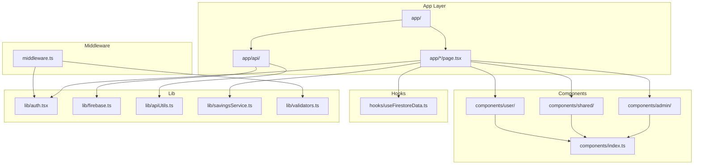
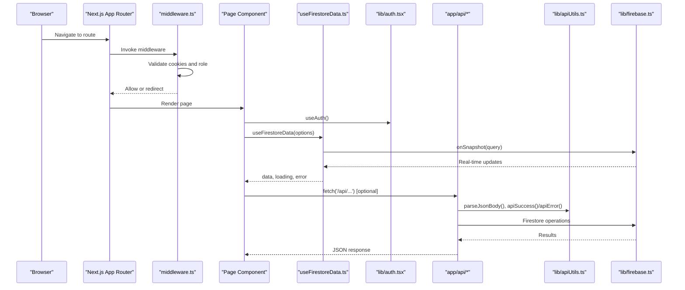
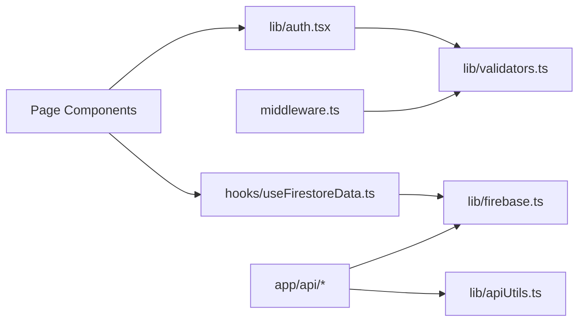

# Developer Guidelines & Best Practices

<cite>
**Referenced Files in This Document**
- [package.json](file://package.json)
- [eslint.config.mjs](file://eslint.config.mjs)
- [tsconfig.json](file://tsconfig.json)
- [README.md](file://README.md)
- [lib/firebase.ts](file://lib/firebase.ts)
- [lib/apiUtils.ts](file://lib/apiUtils.ts)
- [components/admin/Header.tsx](file://components/admin/Header.tsx)
- [components/admin/index.ts](file://components/admin/index.ts)
- [components/index.ts](file://components/index.ts)
- [hooks/useFirestoreData.ts](file://hooks/useFirestoreData.ts)
- [lib/savingsService.ts](file://lib/savingsService.ts)
- [lib/auth.tsx](file://lib/auth.tsx)
- [middleware.ts](file://middleware.ts)
- [lib/validators.ts](file://lib/validators.ts)
- [docs/API_BEST_PRACTICES.md](file://docs/API_BEST_PRACTICES.md)
- [docs/API_JSON_RESPONSES.md](file://docs/API_JSON_RESPONSES.md)
</cite>

## Table of Contents
1. [Introduction](#introduction)
2. [Project Structure](#project-structure)
3. [Core Components](#core-components)
4. [Architecture Overview](#architecture-overview)
5. [Detailed Component Analysis](#detailed-component-analysis)
6. [Dependency Analysis](#dependency-analysis)
7. [Performance Considerations](#performance-considerations)
8. [Troubleshooting Guide](#troubleshooting-guide)
9. [Conclusion](#conclusion)
10. [Appendices](#appendices)

## Introduction
This document provides comprehensive developer guidelines and best practices for contributing to the SAMPA Cooperative Management System. It consolidates code organization standards, TypeScript and React patterns, API design, linting and formatting, Firebase integration, security, performance, and contribution processes. The goal is to ensure consistent, maintainable, and secure development across the codebase.

## Project Structure
The project follows a Next.js App Router structure with a clear separation of concerns:
- app/: Application pages and API routes organized by feature and domain
- components/: Reusable UI components grouped by domain (admin, shared, user)
- hooks/: Custom React hooks for cross-cutting concerns
- lib/: Shared libraries for Firebase, authentication, utilities, and services
- docs/: Architectural and operational documentation
- scripts/: Operational and diagnostic scripts

**Diagram sources**
- [package.json](file://package.json#L1-L53)
- [components/admin/index.ts](file://components/admin/index.ts#L1-L11)
- [components/index.ts](file://components/index.ts#L1-L14)
- [hooks/useFirestoreData.ts](file://hooks/useFirestoreData.ts#L1-L182)
- [lib/auth.tsx](file://lib/auth.tsx#L1-L682)
- [lib/firebase.ts](file://lib/firebase.ts#L1-L309)
- [lib/apiUtils.ts](file://lib/apiUtils.ts#L1-L109)
- [lib/savingsService.ts](file://lib/savingsService.ts#L1-L455)
- [lib/validators.ts](file://lib/validators.ts#L1-L236)
- [middleware.ts](file://middleware.ts#L1-L62)

**Section sources**
- [package.json](file://package.json#L1-L53)
- [README.md](file://README.md#L1-L37)

## Core Components
- TypeScript configuration enforces strict type checking and bundler resolution for a modern React/Next.js stack.
- ESLint configuration extends Next.js recommended rules for TypeScript and Core Web Vitals, with explicit overrides for ignored paths.
- Firebase client library is initialized once and guarded against missing configuration, with helper functions for CRUD operations and connection validation.
- Authentication context manages user state, role-based routing, and secure profile updates.
- Custom hook useFirestoreData provides real-time data with client-side sorting and error handling.
- Savings service encapsulates atomic operations for member savings with robust member-user linkage resolution.
- Middleware and validators enforce role-based access control and prevent route conflicts.

**Section sources**
- [tsconfig.json](file://tsconfig.json#L1-L35)
- [eslint.config.mjs](file://eslint.config.mjs#L1-L19)
- [lib/firebase.ts](file://lib/firebase.ts#L1-L309)
- [lib/auth.tsx](file://lib/auth.tsx#L1-L682)
- [hooks/useFirestoreData.ts](file://hooks/useFirestoreData.ts#L1-L182)
- [lib/savingsService.ts](file://lib/savingsService.ts#L1-L455)
- [middleware.ts](file://middleware.ts#L1-L62)
- [lib/validators.ts](file://lib/validators.ts#L1-L236)

## Architecture Overview
The system integrates client-side React components with Next.js App Router, serverless API routes, and Firebase for authentication and data persistence. Access control is enforced via middleware and route validators, while standardized API responses ensure robust client interactions.

**Diagram sources**
- [middleware.ts](file://middleware.ts#L1-L62)
- [lib/validators.ts](file://lib/validators.ts#L1-L236)
- [lib/auth.tsx](file://lib/auth.tsx#L1-L682)
- [hooks/useFirestoreData.ts](file://hooks/useFirestoreData.ts#L1-L182)
- [lib/firebase.ts](file://lib/firebase.ts#L1-L309)
- [lib/apiUtils.ts](file://lib/apiUtils.ts#L1-L109)

## Detailed Component Analysis

### TypeScript and Type Safety
- Strict compiler options enable early detection of type-related issues.
- Bundler module resolution and path aliases simplify imports and improve IDE support.
- Interfaces define user and service contracts to maintain consistency across modules.

Best practices:
- Keep interfaces cohesive and colocated with their consumers.
- Prefer readonly and strict null checks to reduce runtime errors.
- Use generic constraints for hooks and services to preserve type fidelity.

**Section sources**
- [tsconfig.json](file://tsconfig.json#L1-L35)
- [lib/auth.tsx](file://lib/auth.tsx#L10-L61)

### React Component Development Guidelines
- Client components are marked with "use client" and rely on context and hooks for state and data.
- Props should be explicitly typed and validated at the boundaries (e.g., modal components).
- Composition favors small, focused components with clear responsibilities.

Patterns:
- Use props interfaces for component contracts (see AdminHeader props).
- Centralize UI exports via index.ts files for clean module interfaces.
- Prefer controlled components and pass callbacks for state changes.

**Section sources**
- [components/admin/Header.tsx](file://components/admin/Header.tsx#L1-L105)
- [components/admin/index.ts](file://components/admin/index.ts#L1-L11)
- [components/index.ts](file://components/index.ts#L1-L14)

### State Management Patterns
- Authentication state is managed via a dedicated context provider with cookie-backed hydration.
- Real-time data is handled through a custom hook leveraging Firestore onSnapshot listeners.
- Atomic operations for savings leverage service functions to maintain consistency.

Guidelines:
- Keep authentication logic in a single provider to avoid duplication.
- Use memoization and stable callbacks to minimize re-renders.
- Separate business logic into service modules for testability and reuse.

**Section sources**
- [lib/auth.tsx](file://lib/auth.tsx#L158-L682)
- [hooks/useFirestoreData.ts](file://hooks/useFirestoreData.ts#L19-L151)
- [lib/savingsService.ts](file://lib/savingsService.ts#L237-L342)

### API Design Patterns
- All API routes return JSON responses using standardized helpers to avoid HTML fallbacks.
- Consistent response schema: { success: boolean, data?, error? } with appropriate HTTP status codes.
- Request body parsing and validation are performed before business logic.
- Firebase initialization is verified prior to operations.

Standards:
- Use apiSuccess, apiError, apiValidationError, apiNotFoundError, apiUnauthorizedError, apiForbiddenError, apiMethodNotAllowed for uniformity.
- Log internal errors without exposing sensitive details to clients.
- Enforce HTTP semantics: 200/201 for success, 400/401/403/404/405/409 for specific failure modes, 500/503 for server issues.

**Section sources**
- [lib/apiUtils.ts](file://lib/apiUtils.ts#L1-L109)
- [docs/API_BEST_PRACTICES.md](file://docs/API_BEST_PRACTICES.md#L1-L230)
- [docs/API_JSON_RESPONSES.md](file://docs/API_JSON_RESPONSES.md#L1-L139)

### Firebase Integration Patterns and Security
- Client-side initialization guards against missing configuration and validates connectivity.
- Firestore operations are wrapped with validation and error handling; permission-denied and not-found scenarios are surfaced gracefully.
- Authentication relies on custom login flows with hashed credentials stored in Firestore; middleware validates roles and redirects accordingly.

Security practices:
- Never expose secrets in client-side code; environment variables are prefixed for public consumption.
- Use role-based access control in middleware and validators to prevent unauthorized access.
- Implement least privilege in Firestore rules and indexes.

**Section sources**
- [lib/firebase.ts](file://lib/firebase.ts#L1-L309)
- [lib/auth.tsx](file://lib/auth.tsx#L197-L348)
- [middleware.ts](file://middleware.ts#L1-L62)
- [lib/validators.ts](file://lib/validators.ts#L1-L236)

### Component Export Patterns and Index Files
- Centralized exports via index.ts files provide a clean surface for importing components.
- Group exports by domain (admin, shared, user) to encourage discoverability and reduce import churn.

Guidelines:
- Export default components and named utilities from index.ts.
- Maintain alphabetical ordering for readability.
- Avoid deep imports; always import from index.ts.

**Section sources**
- [components/admin/index.ts](file://components/admin/index.ts#L1-L11)
- [components/index.ts](file://components/index.ts#L1-L14)

## Dependency Analysis
The codebase exhibits low coupling and high cohesion:
- Components depend on hooks and lib modules rather than duplicating logic.
- API routes depend on utility modules for consistent responses and on Firebase for persistence.
- Middleware depends on validators and auth utilities to enforce access control.

**Diagram sources**
- [lib/auth.tsx](file://lib/auth.tsx#L1-L682)
- [lib/validators.ts](file://lib/validators.ts#L1-L236)
- [middleware.ts](file://middleware.ts#L1-L62)
- [hooks/useFirestoreData.ts](file://hooks/useFirestoreData.ts#L1-L182)
- [lib/firebase.ts](file://lib/firebase.ts#L1-L309)
- [lib/apiUtils.ts](file://lib/apiUtils.ts#L1-L109)

**Section sources**
- [package.json](file://package.json#L16-L51)

## Performance Considerations
- Client-side sorting in useFirestoreData avoids composite indexes but may increase memory usage for large datasets; consider pagination or server-side filtering for heavy workloads.
- Real-time listeners provide immediate updates; ensure cleanup to prevent leaks.
- Firebase initialization is guarded to avoid repeated initializations and to surface configuration issues early.
- Middleware short-circuits static assets and API routes to minimize overhead.

Recommendations:
- Monitor bundle sizes and split large components.
- Debounce or throttle frequent writes to Firestore.
- Use optimistic UI with rollback mechanisms for better perceived performance.

[No sources needed since this section provides general guidance]

## Troubleshooting Guide
Common issues and resolutions:
- API returns HTML instead of JSON: Ensure all routes use standardized response helpers and wrap logic in try/catch blocks.
- Firebase initialization failures: Verify environment variables and check client-side initialization logs.
- Permission denied errors: Review Firestore rules and ensure user roles align with resource access.
- Route conflicts: Confirm middleware and validators are correctly configured and user cookies are intact.

**Section sources**
- [docs/API_BEST_PRACTICES.md](file://docs/API_BEST_PRACTICES.md#L210-L230)
- [docs/API_JSON_RESPONSES.md](file://docs/API_JSON_RESPONSES.md#L130-L139)
- [lib/firebase.ts](file://lib/firebase.ts#L62-L87)
- [lib/apiUtils.ts](file://lib/apiUtils.ts#L61-L75)

## Conclusion
These guidelines establish a consistent foundation for building, integrating, and maintaining features across the SAMPA Cooperative Management System. By adhering to the outlined patterns—code organization, TypeScript discipline, React composition, API consistency, Firebase integration, security, and performance—you contribute to a robust, scalable, and secure platform.

[No sources needed since this section summarizes without analyzing specific files]

## Appendices

### Code Quality: ESLint and Formatting
- ESLint extends Next.js recommended rules for TypeScript and Core Web Vitals.
- Global ignores are overridden to include Next.js build artifacts and TypeScript declaration files.
- Run linting via npm/yarn/pnpm scripts to enforce style and correctness.

**Section sources**
- [eslint.config.mjs](file://eslint.config.mjs#L1-L19)
- [package.json](file://package.json#L5-L14)

### Practical Examples and Extension Patterns
- Adding a new API route: Follow the standardized template with try/catch, JSON responses, and validation helpers.
- Creating a new React component: Place under the appropriate domain folder, export via index.ts, and consume through hooks/services.
- Extending authentication: Add role checks in validators and middleware; update dashboard routing logic as needed.
- Implementing savings operations: Use the savings service functions to ensure atomic updates and consistent balances.

**Section sources**
- [docs/API_BEST_PRACTICES.md](file://docs/API_BEST_PRACTICES.md#L30-L56)
- [lib/savingsService.ts](file://lib/savingsService.ts#L237-L342)
- [lib/validators.ts](file://lib/validators.ts#L199-L235)