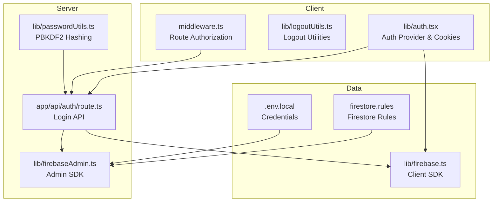
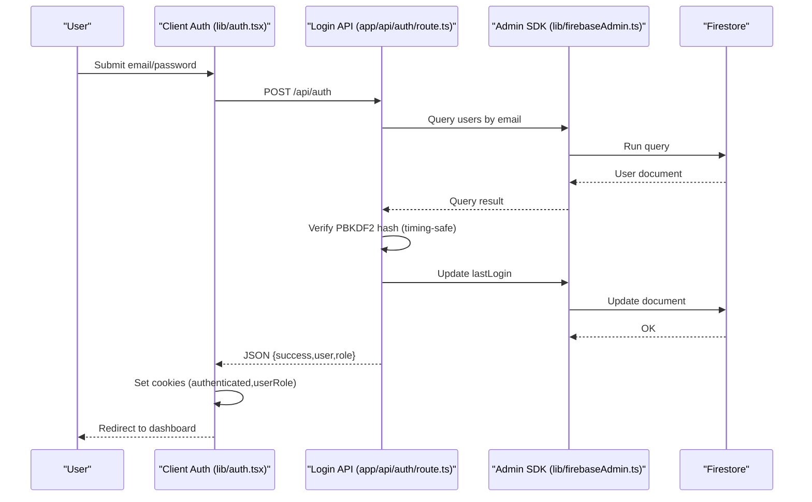
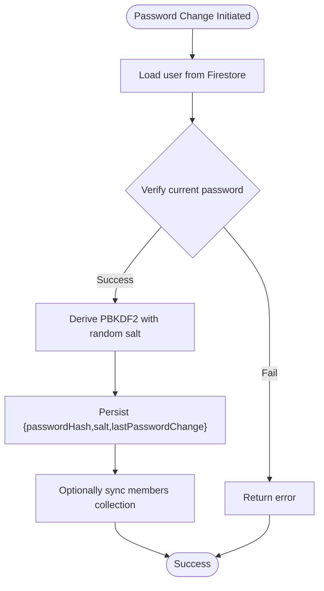
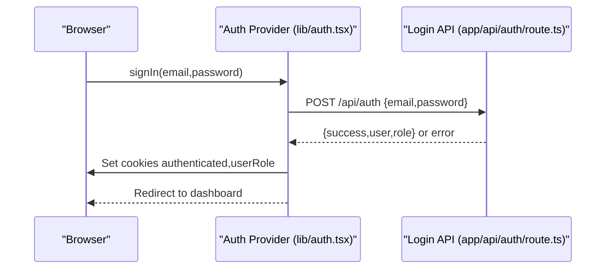
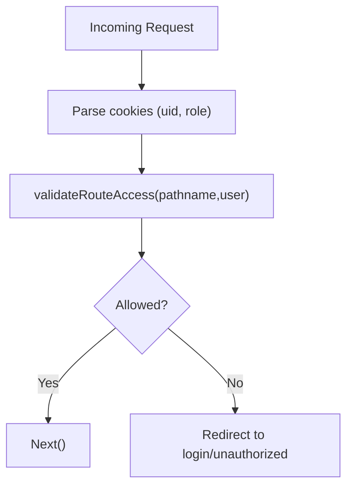
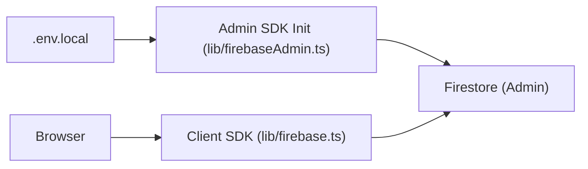
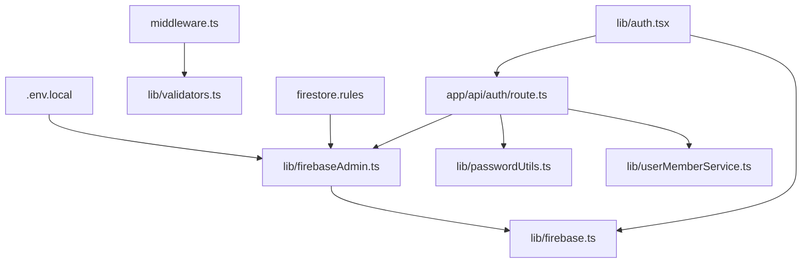

# Security Best Practices

<cite>
**Referenced Files in This Document**
- [lib/firebase.ts](file://lib/firebase.ts)
- [lib/firebaseAdmin.ts](file://lib/firebaseAdmin.ts)
- [lib/passwordUtils.ts](file://lib/passwordUtils.ts)
- [lib/auth.tsx](file://lib/auth.tsx)
- [middleware.ts](file://middleware.ts)
- [app/api/auth/route.ts](file://app/api/auth/route.ts)
- [lib/validators.ts](file://lib/validators.ts)
- [lib/logoutUtils.ts](file://lib/logoutUtils.ts)
- [firestore.rules](file://firestore.rules)
- [ROLE_BASED_ACCESS_CONTROL.md](file://ROLE_BASED_ACCESS_CONTROL.md)
- [lib/userActionTracker.ts](file://lib/userActionTracker.ts)
- [lib/userMemberService.ts](file://lib/userMemberService.ts)
- [.env.local.example](file://.env.local.example)
- [scripts/setup-env.js](file://scripts/setup-env.js)
</cite>

## Table of Contents
1. [Introduction](#introduction)
2. [Project Structure](#project-structure)
3. [Core Components](#core-components)
4. [Architecture Overview](#architecture-overview)
5. [Detailed Component Analysis](#detailed-component-analysis)
6. [Dependency Analysis](#dependency-analysis)
7. [Performance Considerations](#performance-considerations)
8. [Troubleshooting Guide](#troubleshooting-guide)
9. [Conclusion](#conclusion)
10. [Appendices](#appendices)

## Introduction
This document consolidates security best practices for the SAMPA Cooperative Management System. It focuses on password security, authentication and session management, authorization and role-based access control, input validation, secure data transmission, encryption, sensitive data handling, and secure Firebase integration. It also provides testing guidelines, vulnerability assessments, and incident response recommendations grounded in the codebase.

## Project Structure
Security-relevant modules are organized by responsibility:
- Client-side authentication and session cookies
- Server-side authentication API and Firebase Admin integration
- Password hashing and verification utilities
- Middleware-based route authorization
- Firestore security rules and environment configuration
- Activity logging and user-member linkage validation

**Diagram sources**
- [lib/auth.tsx](file://lib/auth.tsx#L158-L680)
- [lib/logoutUtils.ts](file://lib/logoutUtils.ts#L16-L93)
- [middleware.ts](file://middleware.ts#L5-L56)
- [app/api/auth/route.ts](file://app/api/auth/route.ts#L48-L264)
- [lib/firebaseAdmin.ts](file://lib/firebaseAdmin.ts#L13-L108)
- [lib/firebase.ts](file://lib/firebase.ts#L90-L307)
- [firestore.rules](file://firestore.rules#L1-L19)
- [.env.local.example](file://.env.local.example#L1-L10)

**Section sources**
- [lib/auth.tsx](file://lib/auth.tsx#L158-L680)
- [middleware.ts](file://middleware.ts#L5-L56)
- [app/api/auth/route.ts](file://app/api/auth/route.ts#L48-L264)
- [lib/firebaseAdmin.ts](file://lib/firebaseAdmin.ts#L13-L108)
- [lib/firebase.ts](file://lib/firebase.ts#L90-L307)
- [firestore.rules](file://firestore.rules#L1-L19)
- [.env.local.example](file://.env.local.example#L1-L10)

## Core Components
- Password hashing and verification using PBKDF2 with a 16-byte random salt and 100k iterations, performed on both client and server for consistency.
- Authentication using a custom login flow with server-side verification and client-side cookie-based session state.
- Authorization enforced by middleware and route validators that restrict access based on user roles.
- Secure storage practices for credentials and tokens, including environment variable management and cookie handling.
- Firestore integration with Admin SDK for server-side operations and client SDK for UI interactions, with explicit separation of concerns.

**Section sources**
- [lib/passwordUtils.ts](file://lib/passwordUtils.ts#L64-L146)
- [app/api/auth/route.ts](file://app/api/auth/route.ts#L19-L45)
- [lib/auth.tsx](file://lib/auth.tsx#L197-L348)
- [lib/validators.ts](file://lib/validators.ts#L199-L235)
- [middleware.ts](file://middleware.ts#L5-L56)
- [lib/firebaseAdmin.ts](file://lib/firebaseAdmin.ts#L13-L108)
- [lib/firebase.ts](file://lib/firebase.ts#L90-L307)

## Architecture Overview
The system separates authentication logic between client and server:
- Client: Authenticates via a login API, stores lightweight role cookies, and redirects to role-specific dashboards.
- Server: Verifies credentials against Firestore using PBKDF2, validates roles, updates last login timestamps, and returns JSON responses.
- Middleware: Enforces route-level access control based on cookies and validators.
- Data plane: Client SDK for UI reads/writes; Admin SDK for server-side authoritative operations.

**Diagram sources**
- [lib/auth.tsx](file://lib/auth.tsx#L197-L348)
- [app/api/auth/route.ts](file://app/api/auth/route.ts#L48-L248)
- [lib/firebaseAdmin.ts](file://lib/firebaseAdmin.ts#L110-L266)
- [lib/firebase.ts](file://lib/firebase.ts#L90-L307)

## Detailed Component Analysis

### Password Security
- Hashing algorithm: PBKDF2 with SHA-256, 100k iterations, 16-byte salt.
- Salt generation: Cryptographically secure random values.
- Storage: Both password hash and salt are persisted alongside user data.
- Verification: Timing-safe comparison to mitigate timing attacks.
- Cross-environment consistency: Client-side hashing helpers mirror server-side PBKDF2 logic.

**Diagram sources**
- [lib/passwordUtils.ts](file://lib/passwordUtils.ts#L4-L62)

**Section sources**
- [lib/passwordUtils.ts](file://lib/passwordUtils.ts#L64-L146)
- [app/api/auth/route.ts](file://app/api/auth/route.ts#L19-L45)

### Authentication Security Patterns
- Session management: Lightweight cookies (authenticated, userRole) store minimal identity; not HTTP-only to enable client-side checks.
- Token handling: No JWT or refresh tokens in the current implementation; authentication relies on cookies and server-side validation.
- Credential storage: Client-side password hashing helpers; server-side PBKDF2 verification; no plaintext password retention.
- Login flow: Client posts credentials to a dedicated API endpoint; server validates and responds with JSON; client sets cookies and redirects.

**Diagram sources**
- [lib/auth.tsx](file://lib/auth.tsx#L197-L348)
- [app/api/auth/route.ts](file://app/api/auth/route.ts#L48-L248)

**Section sources**
- [lib/auth.tsx](file://lib/auth.tsx#L197-L348)
- [app/api/auth/route.ts](file://app/api/auth/route.ts#L48-L248)
- [lib/logoutUtils.ts](file://lib/logoutUtils.ts#L16-L93)

### Authorization Mechanisms
- Role-based access control: Roles are validated against a predefined list; middleware and validators enforce route access.
- Route protection: Middleware extracts cookies, normalizes roles, and redirects unauthorized users appropriately.
- Conflict prevention: Validators detect and resolve conflicts between admin and user dashboards based on role.

**Diagram sources**
- [middleware.ts](file://middleware.ts#L5-L56)
- [lib/validators.ts](file://lib/validators.ts#L199-L235)

**Section sources**
- [middleware.ts](file://middleware.ts#L5-L56)
- [lib/validators.ts](file://lib/validators.ts#L1-L236)
- [ROLE_BASED_ACCESS_CONTROL.md](file://ROLE_BASED_ACCESS_CONTROL.md#L1-L89)

### Input Validation Strategies and Injection Prevention
- Input sanitization and validation: Email format validation, required fields checks, and structured error responses.
- SQL injection prevention: Not applicable; Firestore queries are constructed server-side with parameterized conditions.
- XSS protection: Client-side rendering appears straightforward; ensure output encoding and Content-Security-Policy headers are configured at the framework level.

**Section sources**
- [app/api/auth/route.ts](file://app/api/auth/route.ts#L82-L93)
- [lib/auth.tsx](file://lib/auth.tsx#L206-L210)

### Secure Data Transmission and Encryption
- Transport security: Enforce HTTPS/TLS at the deployment/proxy layer; the code does not implement additional TLS termination.
- Encryption: PBKDF2 with 100k iterations provides strong password hashing; no additional symmetric encryption for stored data is implemented in the codebase.
- Sensitive data handling: Credentials are handled minimally; server-side PBKDF2 verification avoids storing plaintext passwords.

**Section sources**
- [lib/passwordUtils.ts](file://lib/passwordUtils.ts#L64-L92)
- [app/api/auth/route.ts](file://app/api/auth/route.ts#L28-L44)

### Secure Firebase Integration
- Client SDK: Initialized only in the browser; connection validated with helper functions.
- Admin SDK: Server-side initialization guarded by environment variables; credentials are loaded from environment and validated for placeholders.
- Firestore rules: Current rules allow read/write for all; this is insecure and must be hardened before production.
- Environment management: Example environment template and setup script guide secure credential configuration.

**Diagram sources**
- [lib/firebaseAdmin.ts](file://lib/firebaseAdmin.ts#L13-L108)
- [lib/firebase.ts](file://lib/firebase.ts#L37-L60)
- [.env.local.example](file://.env.local.example#L1-L10)
- [scripts/setup-env.js](file://scripts/setup-env.js#L1-L55)

**Section sources**
- [lib/firebase.ts](file://lib/firebase.ts#L37-L60)
- [lib/firebaseAdmin.ts](file://lib/firebaseAdmin.ts#L13-L108)
- [firestore.rules](file://firestore.rules#L15-L17)
- [.env.local.example](file://.env.local.example#L1-L10)
- [scripts/setup-env.js](file://scripts/setup-env.js#L1-L55)

### Activity Logging and Auditing
- Action tracking: Logs user actions with user metadata and client info; supports audit trails for login, logout, profile updates, and functional operations.
- Integration: Activity logs are written via a logging utility; ensure backend persistence and access controls for logs.

**Section sources**
- [lib/userActionTracker.ts](file://lib/userActionTracker.ts#L10-L118)

### User-Member Linkage and Data Integrity
- Single source of truth: Enforces consistent IDs between users and members collections.
- Validation and healing: On login, validates and repairs linkage; creates missing member profiles if needed.
- Parallel updates: Ensures atomicity-like behavior across collections for user/member records.

**Section sources**
- [lib/userMemberService.ts](file://lib/userMemberService.ts#L99-L198)
- [app/api/auth/route.ts](file://app/api/auth/route.ts#L205-L221)

## Dependency Analysis

**Diagram sources**
- [lib/auth.tsx](file://lib/auth.tsx#L158-L680)
- [app/api/auth/route.ts](file://app/api/auth/route.ts#L48-L264)
- [lib/firebaseAdmin.ts](file://lib/firebaseAdmin.ts#L13-L108)
- [lib/passwordUtils.ts](file://lib/passwordUtils.ts#L1-L146)
- [lib/userMemberService.ts](file://lib/userMemberService.ts#L1-L287)
- [middleware.ts](file://middleware.ts#L5-L56)
- [lib/validators.ts](file://lib/validators.ts#L1-L236)
- [lib/firebase.ts](file://lib/firebase.ts#L90-L307)
- [firestore.rules](file://firestore.rules#L1-L19)
- [.env.local.example](file://.env.local.example#L1-L10)

**Section sources**
- [lib/auth.tsx](file://lib/auth.tsx#L158-L680)
- [app/api/auth/route.ts](file://app/api/auth/route.ts#L48-L264)
- [lib/firebaseAdmin.ts](file://lib/firebaseAdmin.ts#L13-L108)
- [lib/firebase.ts](file://lib/firebase.ts#L90-L307)
- [lib/validators.ts](file://lib/validators.ts#L1-L236)
- [middleware.ts](file://middleware.ts#L5-L56)
- [firestore.rules](file://firestore.rules#L1-L19)
- [.env.local.example](file://.env.local.example#L1-L10)

## Performance Considerations
- PBKDF2 cost: 100k iterations balances security and performance; adjust based on hardware benchmarks.
- Cookie-based sessions: Lightweight; ensure cookie domain/path policies minimize overhead.
- Firestore queries: Use targeted queries and indexes; avoid scanning entire collections.
- Middleware checks: Minimal CPU work; keep validators efficient.

## Troubleshooting Guide
- Firebase Admin initialization failures: Check environment variables and private key formatting; ensure line breaks are escaped as per the setup script guidance.
- Firestore rules deny access: Review and harden rules before enabling production traffic.
- Login API returns JSON errors: Inspect server logs for detailed error messages; confirm request payload and content-type.
- Middleware redirect loops: Verify cookie parsing and role normalization; ensure validators return expected redirect paths.
- Logout inconsistencies: Use centralized logout utilities to clear cookies, localStorage, and sessionStorage.

**Section sources**
- [lib/firebaseAdmin.ts](file://lib/firebaseAdmin.ts#L68-L89)
- [scripts/setup-env.js](file://scripts/setup-env.js#L38-L55)
- [firestore.rules](file://firestore.rules#L15-L17)
- [app/api/auth/route.ts](file://app/api/auth/route.ts#L250-L264)
- [middleware.ts](file://middleware.ts#L18-L39)
- [lib/logoutUtils.ts](file://lib/logoutUtils.ts#L16-L93)

## Conclusion
The system implements robust password hashing, a clear separation between client and server authentication logic, and middleware-driven authorization. Critical improvements include hardening Firestore rules, adopting HTTPS/TLS, and adding CSRF protections. The provided utilities and scripts offer a strong foundation for secure operation and maintenance.

## Appendices

### Security Testing Guidelines
- Unit/integration tests for:
  - Password hashing and verification paths
  - Login API response formats and error handling
  - Middleware route access decisions
  - User-member linkage validation and healing
- Penetration testing checklist:
  - Verify firewall and TLS termination
  - Hardened Firestore rules with field-level permissions
  - CSRF protection for state-changing endpoints
  - Rate limiting for login attempts
  - Secret rotation and environment hygiene checks

### Vulnerability Assessment Procedures
- Static analysis: Scan for secrets in code and configuration.
- Dynamic analysis: Automated scans for common misconfigurations.
- Access review: Confirm least privilege for service accounts and rules.
- Incident simulation: Practice logout, session invalidation, and breach response.

### Incident Response Protocols
- Immediate steps:
  - Rotate Firebase Admin private keys
  - Revoke compromised sessions (cookies)
  - Harden Firestore rules and re-validate environment variables
- Post-incident:
  - Audit activity logs
  - Update security documentation
  - Conduct blameless postmortem and remediation