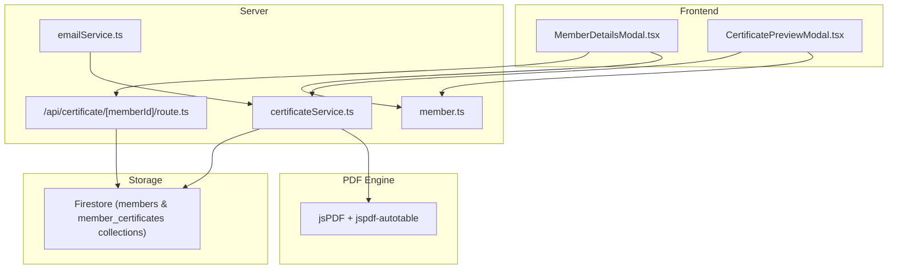
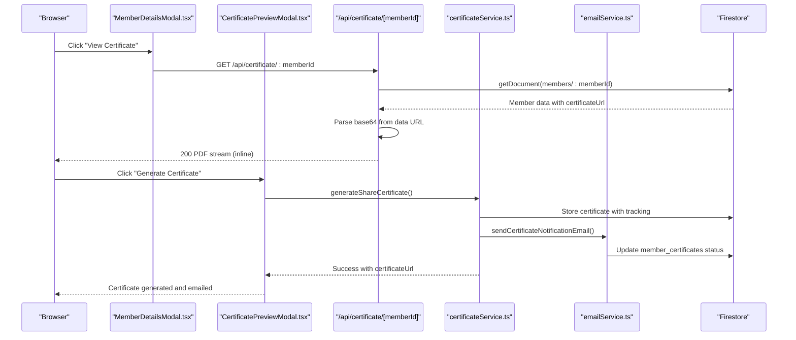
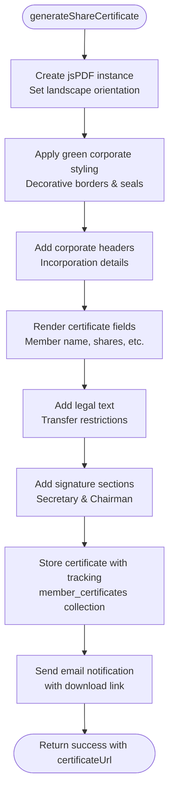
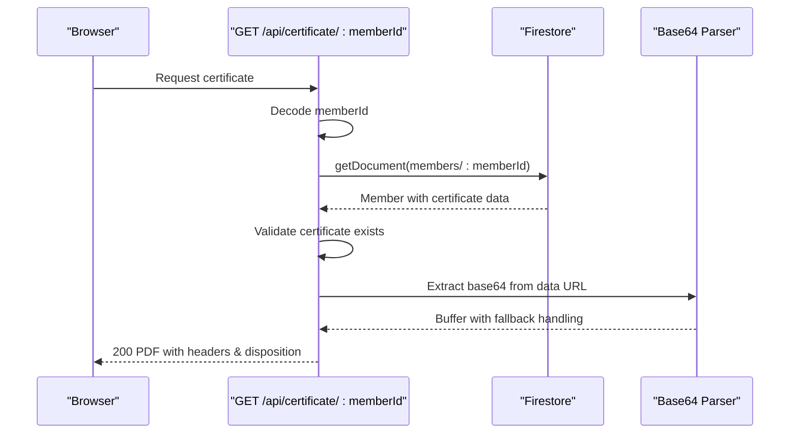
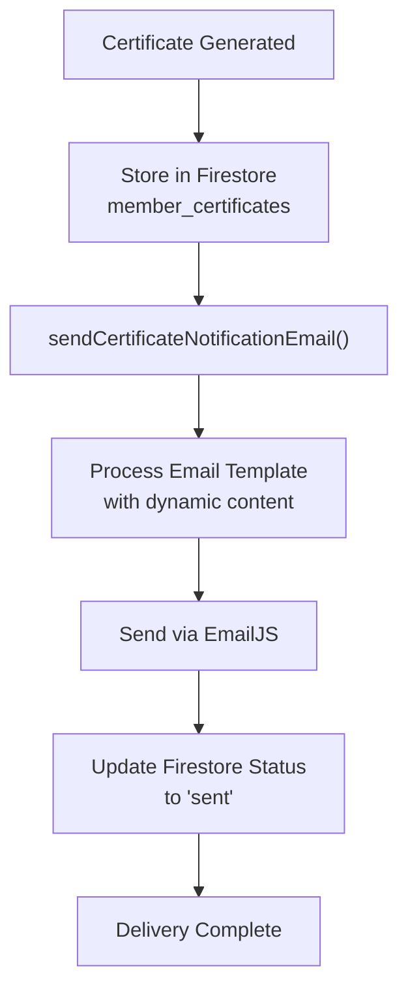
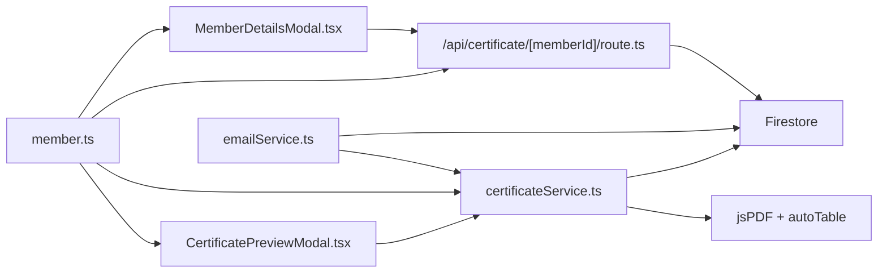

# Certificate Generation System

<cite>
**Referenced Files in This Document**
- [certificateService.ts](file://lib/certificateService.ts)
- [route.ts](file://app/api/certificate/[memberId]/route.ts)
- [CertificatePreviewModal.tsx](file://components/admin/CertificatePreviewModal.tsx)
- [MemberDetailsModal.tsx](file://components/admin/MemberDetailsModal.tsx)
- [emailService.ts](file://lib/emailService.ts)
- [firebase.ts](file://lib/firebase.ts)
- [member.ts](file://lib/types/member.ts)
</cite>

## Update Summary
**Changes Made**
- Added comprehensive share certificate generation functionality with custom templates
- Implemented email notification integration for certificate delivery
- Introduced new CertificatePreviewModal for certificate creation workflow
- Enhanced certificate data validation and storage mechanisms
- Expanded certificate management capabilities with member certificate tracking
- Added certificate validation and security features

## Table of Contents
1. [Introduction](#introduction)
2. [Project Structure](#project-structure)
3. [Core Components](#core-components)
4. [Architecture Overview](#architecture-overview)
5. [Detailed Component Analysis](#detailed-component-analysis)
6. [Enhanced Certificate Features](#enhanced-certificate-features)
7. [Email Notification Integration](#email-notification-integration)
8. [Certificate Preview and Validation](#certificate-preview-and-validation)
9. [Dependency Analysis](#dependency-analysis)
10. [Performance Considerations](#performance-considerations)
11. [Troubleshooting Guide](#troubleshooting-guide)
12. [Conclusion](#conclusion)
13. [Appendices](#appendices)

## Introduction
This document describes the enhanced Certificate Generation System responsible for creating PDF membership certificates and share certificates for cooperative members. The system now supports multiple certificate types with custom templates, email notification integration, and comprehensive certificate management capabilities. It explains the certificate template system, dynamic content injection, PDF generation workflow using jsPDF library, certificate data validation and formatting, styling options, API integration with the member management system, certificate storage and retrieval, sharing capabilities, and customization options for branding and print-ready formats.

## Project Structure
The enhanced certificate system spans four primary areas:
- PDF generation and storage logic with multiple certificate templates
- API endpoint for certificate retrieval and delivery
- Frontend integration with certificate preview and management interfaces
- Email notification system for certificate delivery
- Shared TypeScript types for certificate data and member management

**Diagram sources**
- [MemberDetailsModal.tsx:228-283](file://components/admin/MemberDetailsModal.tsx#L228-L283)
- [CertificatePreviewModal.tsx:1-495](file://components/admin/CertificatePreviewModal.tsx#L1-L495)
- [route.ts:1-68](file://app/api/certificate/[memberId]/route.ts#L1-L68)
- [certificateService.ts:1-393](file://lib/certificateService.ts#L1-L393)
- [emailService.ts:1-281](file://lib/emailService.ts#L1-L281)
- [member.ts:27-68](file://lib/types/member.ts#L27-L68)

**Section sources**
- [MemberDetailsModal.tsx:1-396](file://components/admin/MemberDetailsModal.tsx#L1-L396)
- [CertificatePreviewModal.tsx:1-495](file://components/admin/CertificatePreviewModal.tsx#L1-L495)
- [route.ts:1-68](file://app/api/certificate/[memberId]/route.ts#L1-L68)
- [certificateService.ts:1-393](file://lib/certificateService.ts#L1-L393)
- [emailService.ts:1-281](file://lib/emailService.ts#L1-L281)
- [member.ts:1-85](file://lib/types/member.ts#L1-L85)

## Core Components
- **Enhanced Certificate Generation Service**: Creates multiple certificate types (membership and share certificates) using customized jsPDF templates with dynamic content injection and comprehensive storage mechanisms
- **API Endpoint**: Retrieves stored certificate data URLs from Firestore and streams PDFs to clients with enhanced error handling
- **Certificate Preview Modal**: Provides interactive certificate creation interface with real-time preview and validation
- **Email Notification System**: Integrates with EmailJS for automated certificate delivery notifications
- **Enhanced Frontend Integration**: Offers comprehensive certificate management with viewing, downloading, and sharing capabilities
- **Comprehensive Type Definitions**: Defines certificate data schemas for multiple certificate types and member management

Key responsibilities:
- Multiple template rendering with jsPDF and autoTable
- Dynamic content injection from member and certificate data
- Advanced validation and error handling during generation and retrieval
- Multi-type certificate storage with tracking in Firestore
- Automated email notifications for certificate delivery
- Real-time certificate preview and editing capabilities
- Delivery of PDFs via HTTP response with appropriate headers

**Section sources**
- [certificateService.ts:12-393](file://lib/certificateService.ts#L12-L393)
- [route.ts:4-68](file://app/api/certificate/[memberId]/route.ts#L4-L68)
- [CertificatePreviewModal.tsx:51-495](file://components/admin/CertificatePreviewModal.tsx#L51-L495)
- [emailService.ts:145-176](file://lib/emailService.ts#L145-L176)
- [MemberDetailsModal.tsx:228-283](file://components/admin/MemberDetailsModal.tsx#L228-L283)
- [member.ts:27-68](file://lib/types/member.ts#L27-L68)

## Architecture Overview
The enhanced system follows a comprehensive separation of concerns with multiple certificate types and integrated workflows:
- UI triggers certificate viewing/download or initiates certificate creation
- API validates membership and fetches certificate data URL from Firestore
- Service generates PDFs with appropriate templates and persists them with tracking
- Email service handles automated notifications for certificate delivery
- Frontend displays PDFs via embedded iframe or downloads them with enhanced validation

**Diagram sources**
- [MemberDetailsModal.tsx:232-281](file://components/admin/MemberDetailsModal.tsx#L232-L281)
- [CertificatePreviewModal.tsx:107-119](file://components/admin/CertificatePreviewModal.tsx#L107-L119)
- [route.ts:4-68](file://app/api/certificate/[memberId]/route.ts#L4-L68)
- [certificateService.ts:12-393](file://lib/certificateService.ts#L12-L393)
- [emailService.ts:145-176](file://lib/emailService.ts#L145-L176)

## Detailed Component Analysis

### Enhanced Certificate Generation Service
The service now supports multiple certificate types with sophisticated template systems:

**Share Certificate Generation**:
- Creates landscape-oriented A4 certificates with green color scheme
- Implements detailed corporate styling with decorative borders and official seals
- Includes comprehensive legal text and signature sections
- Stores certificate metadata with tracking in Firestore

**Membership Certificate Retrieval**:
- Retrieves existing membership certificates from Firestore
- Validates certificate existence and format
- Returns certificate data with comprehensive error handling

**Enhanced Certificate Workflow**:
- `generateShareCertificate()`: Creates share certificates with detailed corporate formatting
- `getMemberCertificate()`: Retrieves membership certificates with validation
- `generateAndSendCertificate()`: Combines generation with email notification and tracking

Processing logic highlights:
- Uses jsPDF with custom styling for different certificate types
- Implements comprehensive certificate data validation
- Stores certificates with timestamps and metadata tracking
- Returns detailed success/failure states with error messages

**Diagram sources**
- [certificateService.ts:12-277](file://lib/certificateService.ts#L12-L277)

**Section sources**
- [certificateService.ts:12-393](file://lib/certificateService.ts#L12-L393)

### API Endpoint for Certificate Retrieval
The API endpoint now supports enhanced certificate retrieval with improved validation:

Responsibilities:
- Accepts member ID parameter with URL decoding support
- Fetches member data from Firestore with comprehensive validation
- Validates certificate existence and format before processing
- Extracts base64 payload from data URL with fallback handling
- Streams PDF to client with appropriate headers and content disposition
- Handles various error states with specific HTTP status codes

Enhanced behavioral notes:
- Supports both inline viewing and file download via Content-Disposition
- Returns 404 for missing members or certificates
- Returns 500 for unsupported formats or internal errors
- Implements robust base64 extraction with data URL parsing

**Diagram sources**
- [route.ts:4-68](file://app/api/certificate/[memberId]/route.ts#L4-L68)

**Section sources**
- [route.ts:4-68](file://app/api/certificate/[memberId]/route.ts#L4-L68)

### Frontend Integration (Enhanced Member Details Modal)
The enhanced frontend provides comprehensive certificate management:

**Certificate Display Capabilities**:
- Conditionally renders certificate actions based on certificate generation status
- Embeds certificates via iframe with responsive design
- Provides download and open-in-new-tab functionality
- Implements certificate visibility toggle with proper state management

**User Experience Enhancements**:
- "View Certificate" button with conditional enablement
- "Hide Certificate" option for better interface control
- Download button with automatic filename generation
- New tab opening with focus management

**Section sources**
- [MemberDetailsModal.tsx:228-283](file://components/admin/MemberDetailsModal.tsx#L228-L283)

## Enhanced Certificate Features

### Multiple Certificate Types
The system now supports multiple certificate types with specialized templates:

**Membership Certificate**:
- Standard portrait A4 format with cooperative branding
- Includes member details, registration date, and role information
- Uses traditional certificate styling with decorative elements

**Share Certificate**:
- Landscape A4 format with corporate green color scheme
- Detailed legal text and transfer restrictions
- Official seal and signature sections
- Comprehensive shareholding information display

**Certificate Data Management**:
- Separate storage in `member_certificates` collection
- Tracking of generation status and delivery attempts
- Metadata preservation for audit trails
- Support for certificate number generation and validation

**Section sources**
- [certificateService.ts:12-277](file://lib/certificateService.ts#L12-L277)
- [certificateService.ts:284-309](file://lib/certificateService.ts#L284-L309)
- [certificateService.ts:317-393](file://lib/certificateService.ts#L317-L393)

### Enhanced Certificate Data Validation
The system implements comprehensive validation mechanisms:

**Input Validation**:
- Certificate number uniqueness verification
- Member data validation before generation
- Date format validation for issue dates
- Required field validation for signatures

**Storage Validation**:
- Certificate existence verification
- Data URL format validation
- Base64 payload integrity checking
- Timestamp validation for audit trails

**Security Validation**:
- Member authorization verification
- Role-based access control for certificate generation
- Duplicate certificate prevention
- Audit trail maintenance for all operations

**Section sources**
- [certificateService.ts:25-277](file://lib/certificateService.ts#L25-L277)
- [certificateService.ts:284-309](file://lib/certificateService.ts#L284-L309)
- [certificateService.ts:317-393](file://lib/certificateService.ts#L317-L393)

## Email Notification Integration

### Automated Certificate Delivery
The system integrates with EmailJS for automated certificate notifications:

**Email Template System**:
- Dedicated certificate notification template
- Dynamic content injection with member and certificate details
- Professional email formatting with cooperative branding
- Automatic download link generation

**Delivery Workflow**:
- Certificate generation triggers email notification
- Email includes certificate details and download instructions
- Status tracking in Firestore for delivery confirmation
- Error handling for failed email deliveries

**Configuration Requirements**:
- EmailJS public key configuration
- Service ID and template ID setup
- Environment variable management
- Client-side initialization with fallback handling

**Diagram sources**
- [certificateService.ts:317-393](file://lib/certificateService.ts#L317-L393)
- [emailService.ts:145-176](file://lib/emailService.ts#L145-L176)

**Section sources**
- [certificateService.ts:317-393](file://lib/certificateService.ts#L317-L393)
- [emailService.ts:145-176](file://lib/emailService.ts#L145-L176)

## Certificate Preview and Validation

### Interactive Certificate Creation
The CertificatePreviewModal provides comprehensive certificate creation interface:

**Real-time Preview System**:
- Live certificate rendering with editable fields
- Instant validation feedback for required fields
- Visual representation of final certificate appearance
- Responsive design with mobile compatibility

**Field Validation**:
- Required field validation (secretary/chairman names)
- Date validation with automatic field synchronization
- Certificate number uniqueness checking
- Member data population from selected member

**User Interface Features**:
- Editable certificate fields with input validation
- Confirmation dialog for certificate generation
- Loading states during generation process
- Error handling with user-friendly messaging

**Section sources**
- [CertificatePreviewModal.tsx:51-495](file://components/admin/CertificatePreviewModal.tsx#L51-L495)

### Certificate Management Integration
The preview modal integrates seamlessly with the certificate management system:

**State Management**:
- Certificate data state with automatic member population
- Generation status tracking with loading indicators
- Error state management with user feedback
- Confirmation workflow with progress indication

**Workflow Integration**:
- Direct integration with certificate generation service
- Real-time validation feedback during editing
- Seamless transition from preview to generation
- Error recovery and retry capabilities

**Section sources**
- [CertificatePreviewModal.tsx:51-495](file://components/admin/CertificatePreviewModal.tsx#L51-L495)

## Dependency Analysis
The enhanced system exhibits improved modularity and clear boundaries:

**Core Dependencies**:
- UI components depend on API endpoints for certificate delivery
- Certificate preview depends on generation service and validation
- API depends on Firestore for certificate data retrieval
- Service depends on jsPDF and Firestore for generation and persistence
- Email service depends on EmailJS configuration and Firestore for tracking

**Integration Points**:
- Certificate preview modal coordinates with generation service
- Email service integrates with certificate generation workflow
- API endpoint serves both certificate retrieval and preview data
- Firestore collections support multiple certificate types and tracking

**Diagram sources**
- [MemberDetailsModal.tsx:228-283](file://components/admin/MemberDetailsModal.tsx#L228-L283)
- [CertificatePreviewModal.tsx:51-495](file://components/admin/CertificatePreviewModal.tsx#L51-L495)
- [route.ts:4-68](file://app/api/certificate/[memberId]/route.ts#L4-L68)
- [certificateService.ts:12-393](file://lib/certificateService.ts#L12-L393)
- [emailService.ts:1-281](file://lib/emailService.ts#L1-L281)
- [member.ts:27-68](file://lib/types/member.ts#L27-L68)

**Section sources**
- [MemberDetailsModal.tsx:1-396](file://components/admin/MemberDetailsModal.tsx#L1-L396)
- [CertificatePreviewModal.tsx:1-495](file://components/admin/CertificatePreviewModal.tsx#L1-L495)
- [route.ts:1-68](file://app/api/certificate/[memberId]/route.ts#L1-L68)
- [certificateService.ts:1-393](file://lib/certificateService.ts#L1-L393)
- [emailService.ts:1-281](file://lib/emailService.ts#L1-L281)
- [member.ts:1-85](file://lib/types/member.ts#L1-L85)

## Performance Considerations
Enhanced performance considerations for the expanded certificate system:

**Generation Performance**:
- On-demand PDF generation with optimized template rendering
- Base64 data URL compression for reduced payload sizes
- Caching strategies for frequently accessed certificate templates
- Asynchronous processing for email notifications

**Storage Optimization**:
- Separate collections for different certificate types
- Efficient indexing for certificate number and member ID queries
- Metadata optimization for audit trail storage
- Archive strategy for historical certificate records

**API Performance**:
- Minimal Firestore queries with selective field retrieval
- Streaming PDF delivery to reduce memory usage
- Content compression for base64 data transmission
- Connection pooling for EmailJS integration

**User Experience**:
- Real-time validation reduces generation failures
- Preview system minimizes generation attempts
- Loading states provide user feedback during processing
- Error boundaries prevent system-wide failures

## Troubleshooting Guide
Enhanced troubleshooting for the comprehensive certificate system:

**Certificate Generation Issues**:
- Member not found: Verify member ID and Firestore membership document existence
- Certificate template errors: Check jsPDF version compatibility and template syntax
- Storage failures: Confirm Firestore write permissions and collection access
- Validation errors: Review certificate data format and required field validation

**Email Delivery Problems**:
- EmailJS configuration: Verify public key, service ID, and template ID setup
- Email format issues: Check email template variables and recipient validation
- Delivery failures: Monitor EmailJS API responses and rate limits
- Tracking errors: Ensure Firestore write permissions for member_certificates collection

**API and Integration Issues**:
- Certificate retrieval failures: Verify certificate data URL format and base64 encoding
- Preview modal errors: Check component dependencies and state management
- Authentication problems: Validate user roles and access permissions
- CORS issues: Configure API endpoint headers for cross-origin requests

**Operational Checks**:
- Validate EmailJS configuration and environment variables
- Confirm Firestore security rules for certificate collections
- Test jsPDF template rendering with sample data
- Verify certificate number generation and uniqueness validation

**Section sources**
- [route.ts:14-29](file://app/api/certificate/[memberId]/route.ts#L14-L29)
- [certificateService.ts:270-277](file://lib/certificateService.ts#L270-L277)
- [certificateService.ts:386-393](file://lib/certificateService.ts#L386-L393)
- [emailService.ts:45-65](file://lib/emailService.ts#L45-L65)
- [firebase.ts:90-113](file://lib/firebase.ts#L90-L113)

## Conclusion
The enhanced Certificate Generation System provides a comprehensive, scalable solution for producing multiple types of cooperative certificates. The system now supports membership certificates, share certificates, and other future certificate types through a flexible template system. It leverages jsPDF for advanced templating and dynamic content injection, integrates EmailJS for automated certificate delivery, stores certificates with comprehensive tracking in Firestore, and exposes intuitive APIs for secure delivery. The enhanced frontend provides interactive certificate creation through the CertificatePreviewModal, comprehensive certificate management through the MemberDetailsModal, and seamless integration with the member management system. Extending the system to support additional certificate types involves adding new generation functions, templates, and API routes while reusing the existing storage, delivery, and validation patterns.

## Appendices

### Certificate Types and Examples
**Membership Certificate**:
- Official recognition of cooperative membership with member details and registration date
- Standard portrait A4 format with cooperative branding
- Traditional certificate styling with decorative elements

**Share Certificate**:
- Corporate-style certificate for share ownership with detailed legal text
- Landscape A4 format with green color scheme and official seals
- Comprehensive shareholding information and transfer restrictions

**Achievement Awards**:
- Could reuse the membership certificate template with customizable award text
- Flexible styling options for different achievement categories
- Customizable award criteria and recognition text

**Loan Completion Certificates**:
- Could be modeled after membership certificate with loan-specific fields
- Customizable completion criteria and loan details
- Integration with loan management system data

**Implementation Pattern**:
- Add new generation functions mirroring existing certificate workflows
- Extend Firestore schema to include additional certificate types per member
- Create dedicated API routes for each certificate type with validation
- Implement specialized preview modals for complex certificate types

### Customization Options
**Template Customization**:
- Multiple certificate templates for different certificate types
- Customizable color schemes and corporate branding
- Flexible layout options for various paper sizes and orientations
- Advanced styling with borders, seals, and decorative elements

**Content Customization**:
- Dynamic content injection from member and certificate data
- Configurable field visibility and ordering
- Multi-language support for international cooperatives
- Customizable legal text and terms

**Integration Options**:
- Email notification integration with EmailJS
- API endpoint for external system integration
- Webhook support for real-time certificate updates
- Mobile-responsive certificate viewing and downloading

**Security and Validation**:
- Comprehensive input validation and sanitization
- Role-based access control for certificate generation
- Audit trail maintenance for all certificate operations
- Digital signature placeholders for authenticity

**Section sources**
- [certificateService.ts:12-277](file://lib/certificateService.ts#L12-L277)
- [CertificatePreviewModal.tsx:146-317](file://components/admin/CertificatePreviewModal.tsx#L146-L317)
- [emailService.ts:145-176](file://lib/emailService.ts#L145-L176)