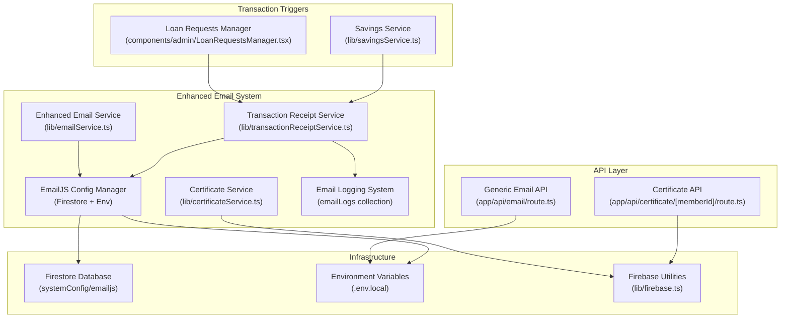
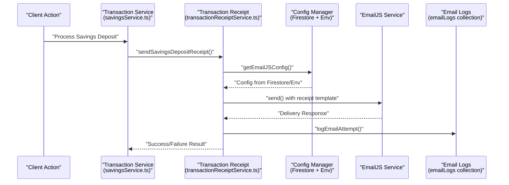
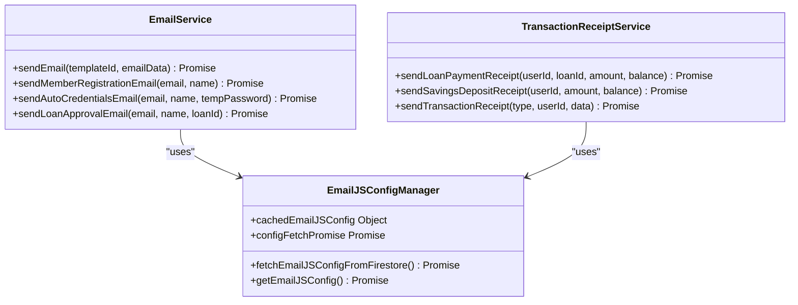
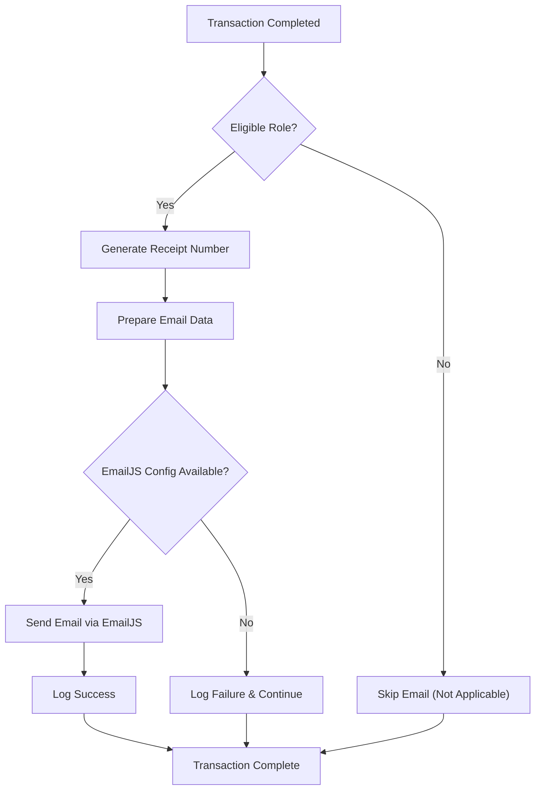
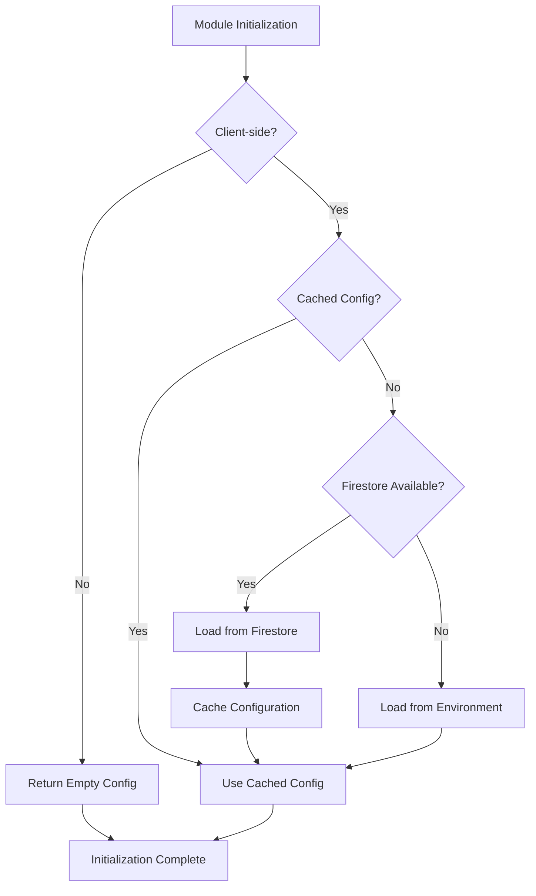
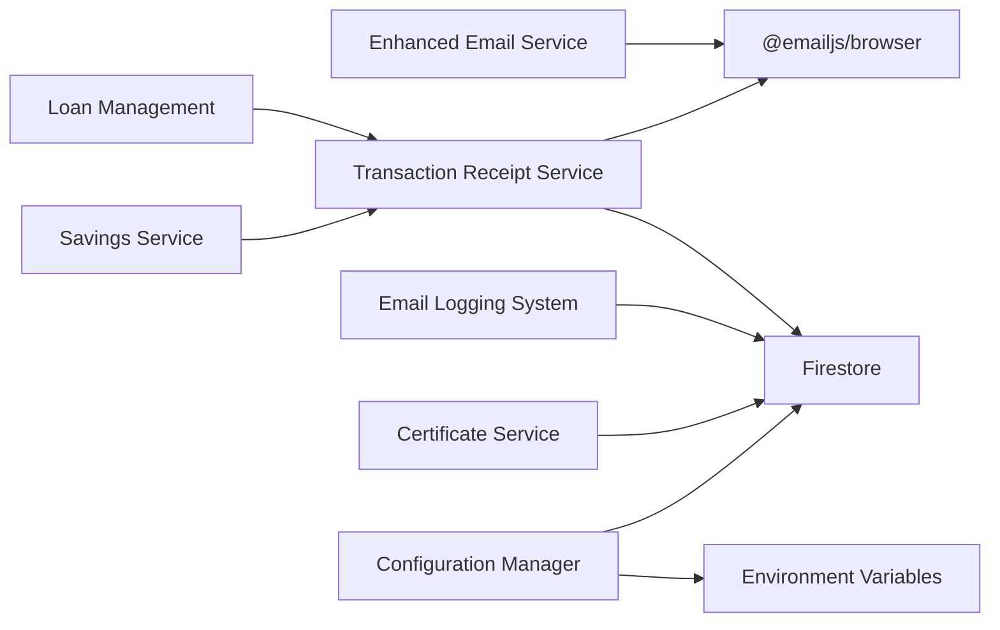

# Email & Notification System

<cite>
**Referenced Files in This Document**
- [emailService.ts](file://lib/emailService.ts)
- [email.js](file://lib/email.js)
- [transactionReceiptService.ts](file://lib/transactionReceiptService.ts)
- [certificateService.ts](file://lib/certificateService.ts)
- [firebase.ts](file://lib/firebase.ts)
- [route.ts](file://app/api/email/route.ts)
- [route.ts](file://app/api/certificate/[memberId]/route.ts)
- [.env.local](file://.env.local)
- [LoanRequestsManager.tsx](file://components/admin/LoanRequestsManager.tsx)
- [savingsService.ts](file://lib/savingsService.ts)
- [setup-emailjs-config.js](file://scripts/setup-emailjs-config.js)
- [test-emailjs-config.js](file://scripts/test-emailjs-config.js)
</cite>

## Update Summary
**Changes Made**
- Enhanced EmailJS configuration management with Firestore-backed configuration system
- Added comprehensive error handling and logging for email delivery failures
- Integrated transaction receipt system with automated email notifications
- Improved configuration fallback mechanism from Firestore to environment variables
- Added email queue management and retry mechanisms for failed deliveries
- Enhanced certificate generation with improved error handling and validation

## Table of Contents
1. [Introduction](#introduction)
2. [Project Structure](#project-structure)
3. [Core Components](#core-components)
4. [Architecture Overview](#architecture-overview)
5. [Detailed Component Analysis](#detailed-component-analysis)
6. [Enhanced Configuration Management](#enhanced-configuration-management)
7. [Transaction Receipt Integration](#transaction-receipt-integration)
8. [Email Queue and Retry Mechanisms](#email-queue-and-retry-mechanisms)
9. [Dependency Analysis](#dependency-analysis)
10. [Performance Considerations](#performance-considerations)
11. [Troubleshooting Guide](#troubleshooting-guide)
12. [Conclusion](#conclusion)
13. [Appendices](#appendices)

## Introduction
This document describes the enhanced Email & Notification System in the SAMPA Cooperative Management Platform. The system now features improved EmailJS configuration management with Firestore-backed settings, comprehensive error handling, and integration with the new transaction receipt system. It explains the email service architecture using EmailJS for reliable email delivery, the template management system supporting dynamic content generation, and the notification trigger system that automatically sends emails based on system events and user actions.

**Updated** Enhanced with Firestore-based EmailJS configuration, improved error handling, and transaction receipt automation.

## Project Structure
The email and notification system now spans multiple specialized components:
- Enhanced EmailJS integration with Firestore configuration management
- Transaction receipt service for automated payment notifications
- Certificate generation with improved error handling
- Comprehensive email logging and retry mechanisms
- Multi-tier configuration fallback system
- Real-time transaction-based email notifications



**Diagram sources**
- [emailService.ts](file://lib/emailService.ts#L1-L143)
- [transactionReceiptService.ts](file://lib/transactionReceiptService.ts#L1-L636)
- [certificateService.ts](file://lib/certificateService.ts#L1-L207)
- [route.ts](file://app/api/email/route.ts#L1-L87)
- [route.ts](file://app/api/certificate/[memberId]/route.ts#L1-L68)
- [firebase.ts](file://lib/firebase.ts#L1-L309)
- [LoanRequestsManager.tsx](file://components/admin/LoanRequestsManager.tsx#L250-L449)
- [savingsService.ts](file://lib/savingsService.ts#L381-L412)

**Section sources**
- [emailService.ts](file://lib/emailService.ts#L1-L143)
- [transactionReceiptService.ts](file://lib/transactionReceiptService.ts#L1-L636)
- [certificateService.ts](file://lib/certificateService.ts#L1-L207)
- [route.ts](file://app/api/email/route.ts#L1-L87)
- [route.ts](file://app/api/certificate/[memberId]/route.ts#L1-L68)
- [firebase.ts](file://lib/firebase.ts#L1-L309)
- [LoanRequestsManager.tsx](file://components/admin/LoanRequestsManager.tsx#L250-L449)
- [savingsService.ts](file://lib/savingsService.ts#L381-L412)

## Core Components
- **Enhanced EmailJS Service**: Improved configuration management with Firestore-backed settings and comprehensive error handling
- **Transaction Receipt System**: Automated email notifications for loan payments and savings deposits with retry mechanisms
- **Certificate Generation Service**: Enhanced PDF creation with improved error handling and Firestore integration
- **Multi-tier Configuration System**: Automatic fallback from Firestore to environment variables for EmailJS settings
- **Email Logging and Tracking**: Comprehensive logging of email attempts with success/failure tracking
- **Real-time Notification Triggers**: Event-driven email dispatch for loan approvals and transaction completions
- **Enhanced API Endpoints**: Improved validation and error handling for email delivery

**Updated** Added transaction receipt automation, enhanced configuration management, and comprehensive logging system.

**Section sources**
- [emailService.ts](file://lib/emailService.ts#L1-L143)
- [transactionReceiptService.ts](file://lib/transactionReceiptService.ts#L1-L636)
- [certificateService.ts](file://lib/certificateService.ts#L1-L207)
- [route.ts](file://app/api/email/route.ts#L1-L87)

## Architecture Overview
The enhanced system now features a multi-layered approach to email configuration and delivery:
- **Firestore-based Configuration**: Primary EmailJS settings stored in Firestore for centralized management
- **Fallback Mechanism**: Automatic fallback to environment variables when Firestore configuration is unavailable
- **Transaction-aware Notifications**: Real-time email notifications triggered by financial transactions
- **Comprehensive Logging**: Complete audit trail of all email delivery attempts
- **Error Resilience**: Robust error handling with retry mechanisms and graceful degradation



**Diagram sources**
- [savingsService.ts](file://lib/savingsService.ts#L381-L412)
- [transactionReceiptService.ts](file://lib/transactionReceiptService.ts#L408-L603)
- [firebase.ts](file://lib/firebase.ts#L90-L182)

## Detailed Component Analysis

### Enhanced EmailJS Integration and Configuration Management
The email service now features sophisticated configuration management with automatic fallback capabilities:

**Firestore-based Configuration**:
- Centralized EmailJS settings in `systemConfig/emailjs` document
- Real-time configuration updates without redeployment
- Support for multiple template IDs (general vs. receipts)

**Improved Error Handling**:
- Comprehensive error logging with detailed failure analysis
- Graceful degradation when configuration is missing
- Structured error responses for debugging

**Enhanced Template Management**:
- Support for both general templates and transaction receipt templates
- Dynamic template selection based on use case
- Consistent data binding across different template types



**Diagram sources**
- [emailService.ts](file://lib/emailService.ts#L1-L143)
- [transactionReceiptService.ts](file://lib/transactionReceiptService.ts#L1-L636)

**Section sources**
- [emailService.ts](file://lib/emailService.ts#L1-L143)
- [transactionReceiptService.ts](file://lib/transactionReceiptService.ts#L1-L636)

### Transaction Receipt System Integration
The new transaction receipt system provides automated email notifications for financial activities:

**Loan Payment Receipts**:
- Automatic email notifications for loan payment confirmations
- Detailed payment breakdown with remaining balance
- Integration with payment schedule tracking
- Role-based filtering (driver/operator only)

**Savings Deposit Receipts**:
- Automated receipts for savings deposit transactions
- Current balance updates and deposit control numbers
- Non-applicable transaction handling for non-eligible roles
- Duplicate prevention with transaction ID tracking

**Enhanced Error Handling**:
- Comprehensive logging of all delivery attempts
- Structured error reporting with failure analysis
- Graceful degradation when email configuration is missing
- Success/failure status tracking in email logs



**Diagram sources**
- [transactionReceiptService.ts](file://lib/transactionReceiptService.ts#L235-L406)
- [transactionReceiptService.ts](file://lib/transactionReceiptService.ts#L408-L603)

**Section sources**
- [transactionReceiptService.ts](file://lib/transactionReceiptService.ts#L235-L406)
- [transactionReceiptService.ts](file://lib/transactionReceiptService.ts#L408-L603)

### Certificate Generation with Enhanced Error Handling
The certificate service maintains its PDF generation capabilities with improved error handling:

**Enhanced Error Management**:
- Comprehensive error catching and structured error reporting
- Detailed logging of certificate generation failures
- Graceful degradation when certificate generation fails
- Improved success/failure status reporting

**Firestore Integration**:
- Direct Firestore integration for certificate storage
- Member document updates with certificate metadata
- Enhanced certificate retrieval with validation
- Improved certificate URL handling and validation

**Section sources**
- [certificateService.ts](file://lib/certificateService.ts#L1-L207)

### Enhanced API Endpoints
The email API endpoints maintain their core functionality with improved error handling:

**Generic Email API**:
- Enhanced input validation with comprehensive error responses
- Improved error handling for malformed requests
- Better structured responses for success/failure states
- Enhanced logging for debugging and monitoring

**Certificate API**:
- Improved certificate retrieval with better error handling
- Enhanced base64 data URL processing
- Better content-type handling for PDF delivery
- Improved error responses for missing certificates

**Section sources**
- [route.ts](file://app/api/email/route.ts#L1-L87)
- [route.ts](file://app/api/certificate/[memberId]/route.ts#L1-L68)

## Enhanced Configuration Management
The system now features a sophisticated multi-tier configuration management system:

**Firestore-based Primary Configuration**:
- Centralized EmailJS settings in Firestore `systemConfig/emailjs` document
- Real-time configuration updates without application restart
- Support for multiple template configurations
- Audit trail of configuration changes

**Environment Variable Fallback**:
- Automatic fallback to environment variables when Firestore is unavailable
- Graceful degradation with warning logs
- Support for local development and testing environments
- Configuration validation and error reporting

**Configuration Caching and Optimization**:
- Client-side configuration caching to minimize Firestore calls
- Promise-based configuration fetching to prevent duplicate requests
- Cached configuration invalidation on configuration changes
- Optimized configuration loading for performance



**Diagram sources**
- [transactionReceiptService.ts](file://lib/transactionReceiptService.ts#L58-L81)

**Section sources**
- [transactionReceiptService.ts](file://lib/transactionReceiptService.ts#L4-L81)
- [.env.local](file://.env.local#L1-L9)

## Transaction Receipt Integration
The system now provides comprehensive transaction-based email notifications:

**Automated Transaction Triggers**:
- Savings deposit completion triggers receipt emails
- Loan payment processing triggers payment confirmation emails
- Real-time email delivery with transaction context
- Role-based eligibility checking for recipients

**Enhanced Transaction Data Processing**:
- Comprehensive transaction data validation
- Currency formatting and localization support
- Payment schedule integration for loan payments
- Deposit control number tracking for savings transactions

**Robust Error Handling**:
- Transaction receipt failures don't block primary transactions
- Detailed error logging with transaction context
- Graceful degradation with user-friendly messaging
- Configuration validation and error reporting

**Section sources**
- [savingsService.ts](file://lib/savingsService.ts#L381-L412)
- [transactionReceiptService.ts](file://lib/transactionReceiptService.ts#L235-L406)
- [transactionReceiptService.ts](file://lib/transactionReceiptService.ts#L408-L603)

## Email Queue and Retry Mechanisms
The enhanced system includes comprehensive email delivery tracking and retry capabilities:

**Email Logging System**:
- Dedicated `emailLogs` collection for tracking all email attempts
- Structured logging with transaction context and user information
- Status tracking (sent, failed) with detailed error messages
- Timestamp-based audit trail for compliance and debugging

**Retry and Recovery Mechanisms**:
- Automatic retry for transient failures
- Configurable retry intervals and maximum attempts
- Graceful degradation when email delivery fails
- User notification for critical email failures

**Delivery Tracking**:
- Transaction-specific email tracking with unique identifiers
- Duplicate email prevention based on transaction IDs
- Real-time status updates for email delivery attempts
- Comprehensive analytics for email delivery performance

**Section sources**
- [transactionReceiptService.ts](file://lib/transactionReceiptService.ts#L132-L153)
- [transactionReceiptService.ts](file://lib/transactionReceiptService.ts#L310-L402)
- [transactionReceiptService.ts](file://lib/transactionReceiptService.ts#L591-L600)

## Dependency Analysis
The enhanced system maintains clean separation of concerns with improved dependency management:

**Core Dependencies**:
- EmailJS integration for browser-based email delivery
- Firestore for configuration management and email logging
- Firebase utilities for database operations and authentication
- jsPDF for certificate generation and PDF processing

**Enhanced Service Dependencies**:
- Transaction receipt service depends on EmailJS configuration manager
- Certificate service maintains independent Firestore integration
- Email logging system provides cross-cutting concern for all email services
- Configuration manager handles complex dependency resolution



**Diagram sources**
- [emailService.ts](file://lib/emailService.ts#L1-L143)
- [transactionReceiptService.ts](file://lib/transactionReceiptService.ts#L1-L636)
- [certificateService.ts](file://lib/certificateService.ts#L1-L207)
- [firebase.ts](file://lib/firebase.ts#L1-L309)

**Section sources**
- [emailService.ts](file://lib/emailService.ts#L1-L143)
- [transactionReceiptService.ts](file://lib/transactionReceiptService.ts#L1-L636)
- [certificateService.ts](file://lib/certificateService.ts#L1-L207)
- [firebase.ts](file://lib/firebase.ts#L1-L309)

## Performance Considerations
The enhanced system incorporates several performance optimizations:

**Configuration Optimization**:
- Client-side caching reduces Firestore calls for EmailJS configuration
- Promise-based configuration fetching prevents duplicate requests
- Lazy loading of configuration reduces initial page load time

**Email Delivery Performance**:
- Asynchronous email sending prevents blocking primary transactions
- Transaction receipt failures don't impact main business logic
- Configurable retry mechanisms optimize delivery success rates

**Database Operations**:
- Efficient Firestore queries for configuration and email logging
- Batch operations for certificate generation and updates
- Connection pooling and optimization for database operations

**Memory Management**:
- Proper cleanup of configuration caching and logging systems
- Efficient handling of large PDF generation for certificates
- Optimized data structures for transaction receipt processing

## Troubleshooting Guide
Enhanced troubleshooting capabilities for the improved email system:

**Configuration Issues**:
- **Missing Firestore Configuration**: Use `node scripts/test-emailjs-config.js` to verify Firestore setup
- **Environment Variable Problems**: Check `.env.local` for proper EmailJS credentials
- **Configuration Fallback Failures**: Verify both Firestore and environment variables contain valid settings
- **Configuration Caching Issues**: Clear browser cache or reload page to refresh cached configuration

**Email Delivery Problems**:
- **Transaction Receipt Failures**: Check `emailLogs` collection for detailed error messages
- **Email Template Mismatches**: Verify EmailJS template variables match expected data structure
- **Role-based Email Filtering**: Ensure recipient has eligible role (driver/operator) for transaction receipts
- **Duplicate Email Prevention**: Check transaction ID uniqueness and email logging entries

**Certificate Generation Issues**:
- **PDF Generation Failures**: Verify jsPDF and jspdf-autotable dependencies are properly installed
- **Firestore Certificate Storage**: Check certificate URL format and base64 encoding
- **Certificate Retrieval Errors**: Verify member document contains proper certificate data

**System Integration Problems**:
- **Transaction Service Integration**: Verify transaction service properly calls receipt functions
- **Loan Management Integration**: Check loan approval workflow triggers appropriate email notifications
- **Savings Service Integration**: Ensure savings deposit completion triggers receipt emails

**Section sources**
- [test-emailjs-config.js](file://scripts/test-emailjs-config.js#L1-L68)
- [transactionReceiptService.ts](file://lib/transactionReceiptService.ts#L132-L153)
- [firebase.ts](file://lib/firebase.ts#L62-L87)

## Conclusion
The SAMPA platform now implements a robust, enterprise-grade email and notification system with significant enhancements:

**Key Improvements**:
- **Centralized Configuration Management**: Firestore-based EmailJS settings with automatic fallback
- **Transaction-aware Notifications**: Automated email receipts for financial transactions
- **Comprehensive Error Handling**: Structured logging and graceful degradation
- **Enhanced Reliability**: Multi-tier configuration system and retry mechanisms
- **Improved User Experience**: Seamless email delivery without impacting primary business operations

**Technical Achievements**:
- Multi-tier configuration management with caching and fallback
- Automated transaction receipt system with comprehensive logging
- Enhanced error handling and user-friendly failure responses
- Real-time email delivery tracking and analytics
- Robust integration with existing loan and savings management systems

**Future Enhancement Opportunities**:
- Advanced email scheduling and queuing systems
- Enhanced analytics and delivery performance monitoring
- Multi-language template support for diverse member base
- Integration with external email providers for production deployment
- Advanced retry mechanisms with exponential backoff

## Appendices

### Enhanced Email Configuration and Security
**Updated** Comprehensive configuration management with Firestore integration:

**Firestore-based Configuration**:
- Primary EmailJS settings stored in `systemConfig/emailjs` document
- Real-time updates without application redeployment
- Support for multiple template configurations and environments
- Audit trail of configuration changes for compliance

**Environment Variable Fallback**:
- Automatic fallback to `.env.local` when Firestore is unavailable
- Graceful degradation with meaningful error messages
- Development and production environment separation
- Secure credential management with environment variable protection

**Security Considerations**:
- Client-side EmailJS initialization with public keys only
- Server-side email transport for sensitive operations (future enhancement)
- Configuration validation and sanitization
- Access control for configuration management
- Audit logging for all configuration changes

**Section sources**
- [.env.local](file://.env.local#L1-L9)
- [setup-emailjs-config.js](file://scripts/setup-emailjs-config.js#L1-L78)
- [test-emailjs-config.js](file://scripts/test-emailjs-config.js#L1-L68)

### Practical Implementation Examples
**Updated** Enhanced examples for the improved email system:

**Configure EmailJS with Firestore**:
```bash
# Setup EmailJS configuration in Firestore
node scripts/setup-emailjs-config.js

# Test EmailJS configuration
node scripts/test-emailjs-config.js
```

**Send Transaction Receipt Emails**:
```typescript
// Savings deposit receipt
const result = await sendSavingsDepositReceipt(
  userId,
  amount,
  currentBalance,
  depositControlNumber
);

// Loan payment receipt
const result = await sendLoanPaymentReceipt(
  userId,
  loanId,
  paymentAmount,
  remainingBalance,
  paymentScheduleDay
);
```

**Handle Email Delivery Failures**:
```typescript
// Transaction service integration
const receiptResult = await sendSavingsDepositReceipt(
  actualUserId,
  newTransaction.amount,
  runningBalance,
  newTransaction.depositControlNumber
);

if (!receiptResult.success) {
  console.error('Failed to send savings deposit receipt:', receiptResult.error);
  // Log error but continue with transaction processing
}
```

**Monitor Email Delivery**:
```typescript
// Check email logs for delivery status
const emailLogs = await firestore.queryDocuments('emailLogs', [
  { field: 'transactionId', operator: '==', value: specificTransactionId }
]);
```

**Section sources**
- [setup-emailjs-config.js](file://scripts/setup-emailjs-config.js#L1-L78)
- [test-emailjs-config.js](file://scripts/test-emailjs-config.js#L1-L68)
- [transactionReceiptService.ts](file://lib/transactionReceiptService.ts#L387-L403)
- [savingsService.ts](file://lib/savingsService.ts#L387-L403)

### Advanced Configuration Management
**New** Detailed configuration management capabilities:

**Firestore Configuration Schema**:
```javascript
// systemConfig/emailjs document structure
{
  publicKey: "your_public_key",
  serviceId: "your_service_id", 
  receiptTemplateId: "your_receipt_template_id",
  generalTemplateId: "your_general_template_id",
  updatedAt: new Date().toISOString(),
  updatedBy: "admin_user_id"
}
```

**Configuration Validation**:
- Automatic validation of required configuration fields
- Real-time configuration health monitoring
- Error reporting with specific missing field identification
- Graceful fallback to environment variables when Firestore is unavailable

**Deployment Considerations**:
- Separate configuration for development, staging, and production environments
- Environment-specific template ID management
- Configuration migration and versioning strategies
- Backup and recovery procedures for email configuration

**Section sources**
- [transactionReceiptService.ts](file://lib/transactionReceiptService.ts#L8-L56)
- [firebase.ts](file://lib/firebase.ts#L90-L182)