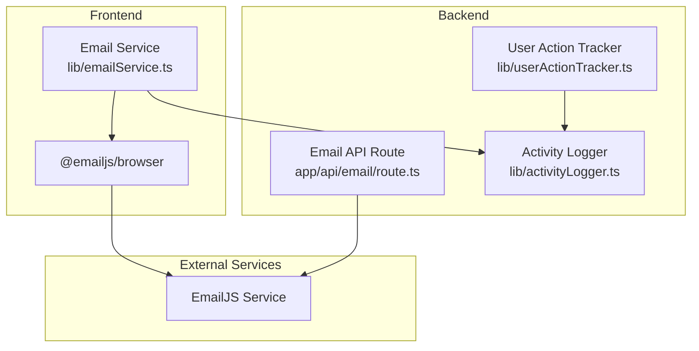
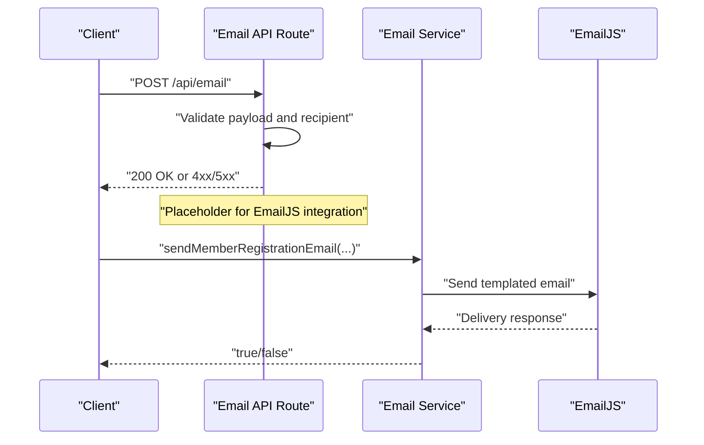
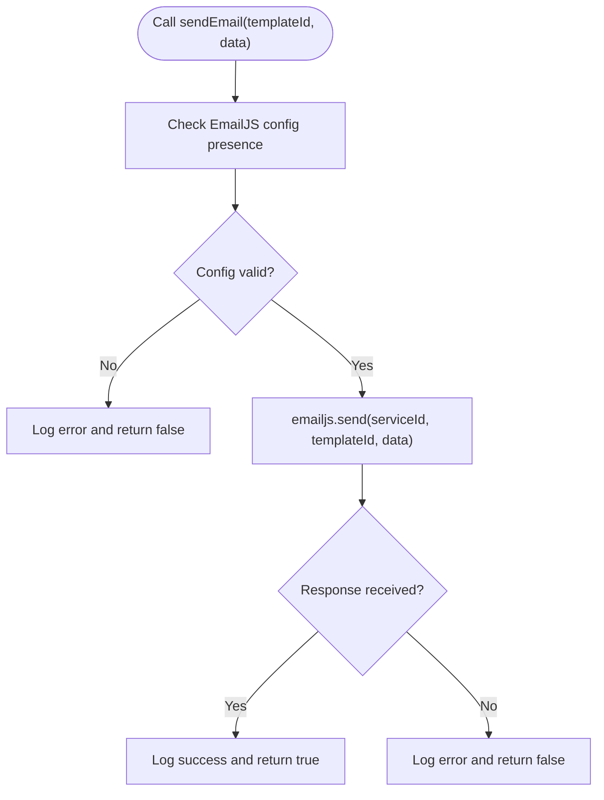
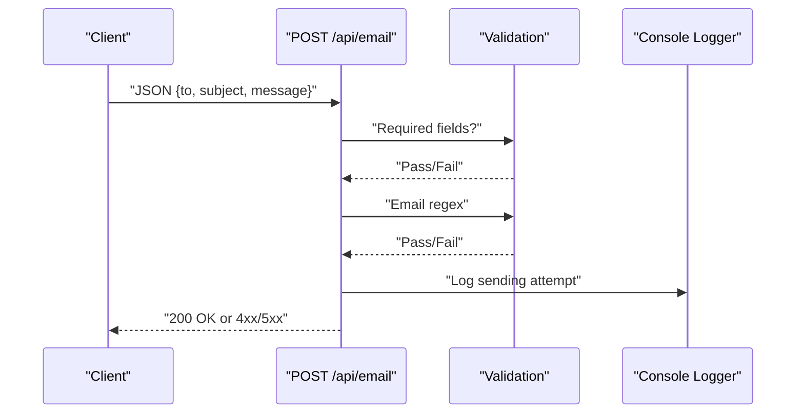
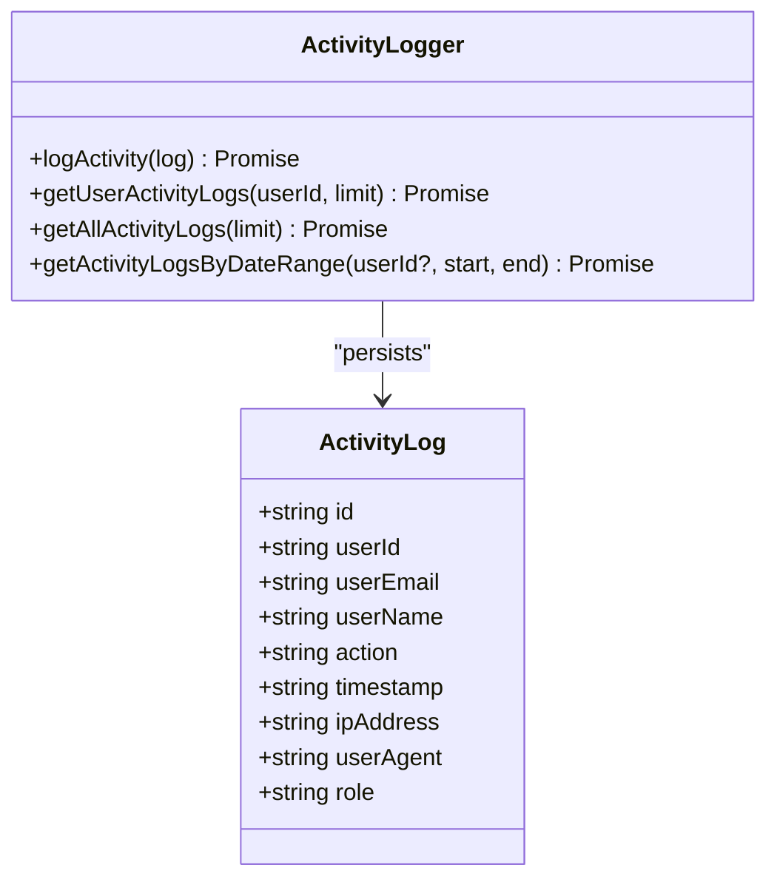
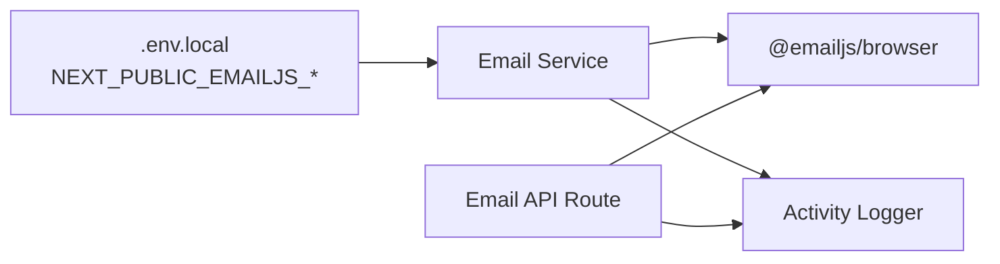

# Email Delivery Tracking

<cite>
**Referenced Files in This Document**
- [emailService.ts](file://lib/emailService.ts)
- [email.js](file://lib/email.js)
- [route.ts](file://app/api/email/route.ts)
- [activityLogger.ts](file://lib/activityLogger.ts)
- [userActionTracker.ts](file://lib/userActionTracker.ts)
- [.env.local.example](file://.env.local.example)
- [FIREBASE_SETUP_INSTRUCTIONS.md](file://FIREBASE_SETUP_INSTRUCTIONS.md)
</cite>

## Table of Contents
1. [Introduction](#introduction)
2. [Project Structure](#project-structure)
3. [Core Components](#core-components)
4. [Architecture Overview](#architecture-overview)
5. [Detailed Component Analysis](#detailed-component-analysis)
6. [Dependency Analysis](#dependency-analysis)
7. [Performance Considerations](#performance-considerations)
8. [Troubleshooting Guide](#troubleshooting-guide)
9. [Conclusion](#conclusion)
10. [Appendices](#appendices)

## Introduction
This document describes the Email Delivery Tracking system for monitoring email status and delivery confirmation. It explains how the system currently sends emails via EmailJS, outlines the planned monitoring and retry mechanisms, and documents integration points for real-time delivery reports, bounce handling, error categorization, and audit/logging for analytics. It also covers deliverability best practices and alerting integration.

## Project Structure
The email delivery tracking capability is primarily implemented in:
- Frontend email service wrapper using EmailJS
- Legacy Nodemailer-based email utility
- API route for sending generic emails (placeholder)
- Activity logging and user action tracking for auditing

**Diagram sources**
- [emailService.ts](file://lib/emailService.ts#L1-L113)
- [route.ts](file://app/api/email/route.ts#L1-L87)
- [activityLogger.ts](file://lib/activityLogger.ts#L1-L165)
- [userActionTracker.ts](file://lib/userActionTracker.ts#L1-L118)

**Section sources**
- [emailService.ts](file://lib/emailService.ts#L1-L113)
- [email.js](file://lib/email.js#L1-L28)
- [route.ts](file://app/api/email/route.ts#L1-L87)
- [activityLogger.ts](file://lib/activityLogger.ts#L1-L165)
- [userActionTracker.ts](file://lib/userActionTracker.ts#L1-L118)

## Core Components
- EmailJS-based email sender with template support and helpers for common notifications
- Legacy Nodemailer utility for direct SMTP transport (not integrated into delivery tracking yet)
- Generic email API route (placeholder) with basic validation and logging
- Activity logger and user action tracker for audit trails

Key responsibilities:
- Sending templated emails (registration, approvals, credentials)
- Validating outbound messages and recipients
- Logging successful and failed attempts for auditing
- Supporting future delivery status monitoring and retries

**Section sources**
- [emailService.ts](file://lib/emailService.ts#L1-L113)
- [email.js](file://lib/email.js#L1-L28)
- [route.ts](file://app/api/email/route.ts#L1-L87)
- [activityLogger.ts](file://lib/activityLogger.ts#L1-L165)
- [userActionTracker.ts](file://lib/userActionTracker.ts#L1-L118)

## Architecture Overview
The current architecture separates concerns between:
- Frontend email service that wraps EmailJS
- Backend API route for generic email dispatch
- Activity logging for auditability

**Diagram sources**
- [route.ts](file://app/api/email/route.ts#L4-L56)
- [emailService.ts](file://lib/emailService.ts#L19-L38)

## Detailed Component Analysis

### Email Service (EmailJS)
The EmailJS-based service initializes the client with public keys and exposes:
- A generic send function with template support
- Helper functions for registration, credentials, and loan approval notifications

**Diagram sources**
- [emailService.ts](file://lib/emailService.ts#L19-L38)

**Section sources**
- [emailService.ts](file://lib/emailService.ts#L1-L113)

### Legacy Nodemailer Utility
A separate utility exists for SMTP-based sending using Nodemailer. While functional, it is not currently wired into the delivery tracking pipeline.

**Section sources**
- [email.js](file://lib/email.js#L1-L28)

### Generic Email API Route
The backend route validates required fields and email format, logs the intent to send, and returns standardized responses. It is marked as a placeholder for integrating with an email provider.

**Diagram sources**
- [route.ts](file://app/api/email/route.ts#L4-L56)

**Section sources**
- [route.ts](file://app/api/email/route.ts#L1-L87)

### Activity Logging and Auditing
Activity logs capture user actions and can be extended to include email delivery outcomes. The activity logger writes to Firestore and supports queries by user and date range.

**Diagram sources**
- [activityLogger.ts](file://lib/activityLogger.ts#L4-L165)

**Section sources**
- [activityLogger.ts](file://lib/activityLogger.ts#L1-L165)
- [userActionTracker.ts](file://lib/userActionTracker.ts#L1-L118)

## Dependency Analysis
- EmailJS integration is configured via environment variables and initialized in the email service module.
- The generic API route depends on EmailJS for actual delivery (placeholder).
- Activity logging is decoupled and can be used to record email outcomes.

**Diagram sources**
- [emailService.ts](file://lib/emailService.ts#L3-L9)
- [route.ts](file://app/api/email/route.ts#L1-L1)
- [activityLogger.ts](file://lib/activityLogger.ts#L1-L1)

**Section sources**
- [emailService.ts](file://lib/emailService.ts#L1-L113)
- [route.ts](file://app/api/email/route.ts#L1-L87)
- [activityLogger.ts](file://lib/activityLogger.ts#L1-L165)

## Performance Considerations
- EmailJS calls are asynchronous; avoid blocking the main thread.
- Batch or defer non-critical notifications to reduce latency.
- Use caching for frequently reused templates and links.
- Monitor external service SLAs and apply timeouts to prevent long-tail delays.

## Troubleshooting Guide
Common issues and resolutions:
- Missing EmailJS configuration: Ensure environment variables are present and loaded. See the environment example and Firebase setup instructions for guidance.
- Validation failures: Confirm required fields and email format before attempting to send.
- Logging and auditing: Verify activity logs are being written to Firestore and accessible via the provided query functions.

Operational checks:
- Environment variables: NEXT_PUBLIC_EMAILJS_PUBLIC_KEY, NEXT_PUBLIC_EMAILJS_SERVICE_ID, NEXT_PUBLIC_EMAILJS_TEMPLATE_ID
- API route: Validate request payload and response codes
- Activity logs: Confirm timestamped entries and query results

**Section sources**
- [.env.local.example](file://.env.local.example)
- [FIREBASE_SETUP_INSTRUCTIONS.md](file://FIREBASE_SETUP_INSTRUCTIONS.md#L1-L55)
- [route.ts](file://app/api/email/route.ts#L9-L30)
- [activityLogger.ts](file://lib/activityLogger.ts#L20-L43)

## Conclusion
The current system provides a robust foundation for sending templated emails via EmailJS and capturing audit trails through activity logging. To implement comprehensive delivery tracking, integrate EmailJS delivery receipts and webhooks, add retry logic with exponential backoff, and extend the audit trail to include delivery outcomes and bounce categories.

## Appendices

### Planned Delivery Tracking Enhancements
- Webhook integration for EmailJS delivery reports
- Retry mechanism with exponential backoff and maximum retry limits
- Dead letter queue for persistent failed deliveries
- Error categorization (invalid address, spam, server error)
- Metrics: delivery rate, open rate, unsubscribe handling
- Monitoring and alerting for sustained delivery failures

### Deliverability Best Practices
- Configure SPF, DKIM, and DMARC records for your domain
- Use dedicated sending domains and subdomains
- Implement double opt-in and clear unsubscribe mechanisms
- Segment lists and monitor engagement to improve inbox placement

### Audit and Analytics
- Extend activity logs to include email delivery outcomes
- Track opens and clicks via tracked links (when supported)
- Generate reports on delivery performance and failure trends