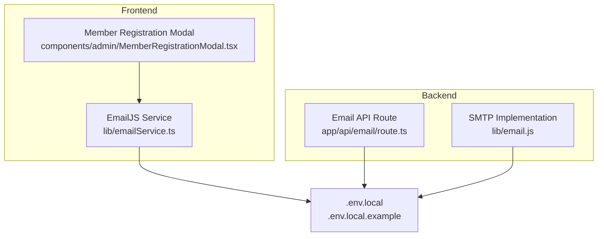
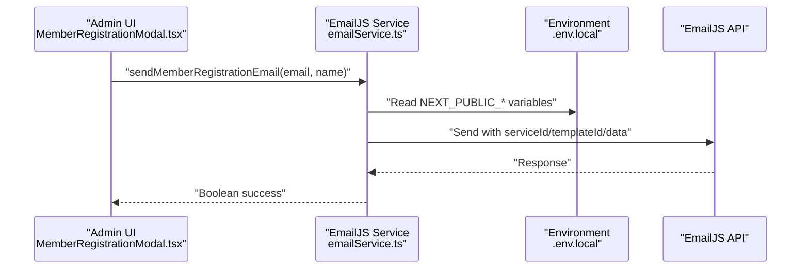
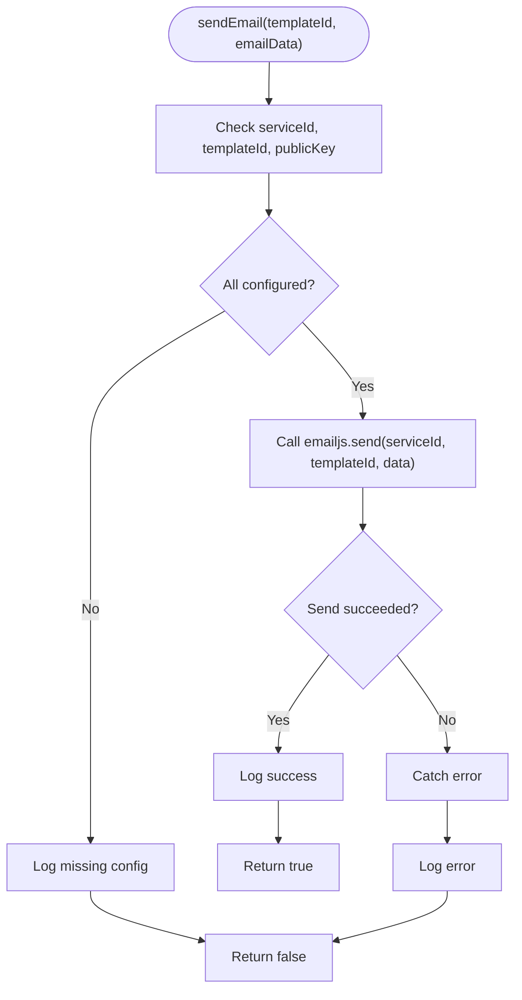
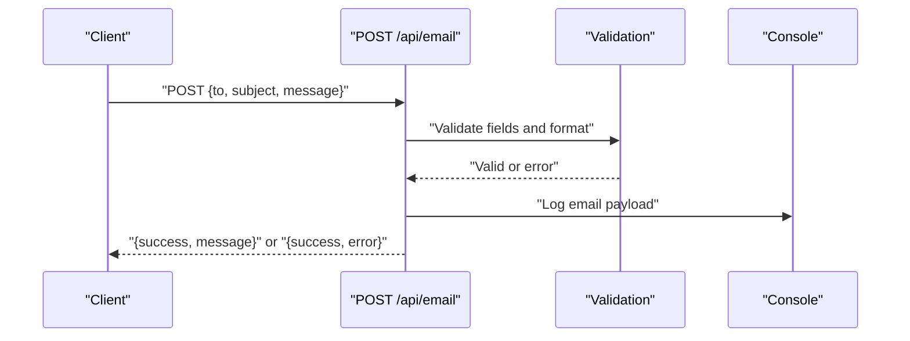
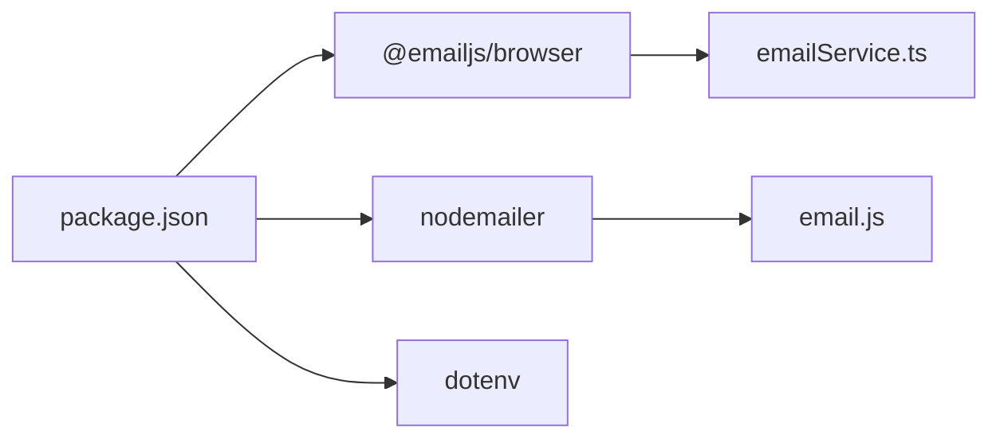

# Email Service Configuration

<cite>
**Referenced Files in This Document**
- [emailService.ts](file://lib/emailService.ts)
- [email.js](file://lib/email.js)
- [route.ts](file://app/api/email/route.ts)
- [.env.local](file://.env.local)
- [.env.local.example](file://.env.local.example)
- [MemberRegistrationModal.tsx](file://components/admin/MemberRegistrationModal.tsx)
- [package.json](file://package.json)
</cite>

## Table of Contents
1. [Introduction](#introduction)
2. [Project Structure](#project-structure)
3. [Core Components](#core-components)
4. [Architecture Overview](#architecture-overview)
5. [Detailed Component Analysis](#detailed-component-analysis)
6. [Dependency Analysis](#dependency-analysis)
7. [Performance Considerations](#performance-considerations)
8. [Troubleshooting Guide](#troubleshooting-guide)
9. [Conclusion](#conclusion)

## Introduction
This document provides comprehensive guidance for configuring and operating the Email Service within the SAMPA Cooperative Management Platform. It focuses on the EmailJS integration, environment variable requirements, initialization and error handling, and outlines alternatives such as SMTP providers. It also includes step-by-step setup instructions for EmailJS dashboard integration, template creation, and variable mapping, along with troubleshooting guidance for common configuration issues and best practices for production deployments.

## Project Structure
The email service spans three primary areas:
- Frontend email service module using EmailJS for browser-side sending
- Alternative SMTP-based implementation using Nodemailer
- API route for email testing and development

**Diagram sources**
- [emailService.ts](file://lib/emailService.ts#L1-L113)
- [MemberRegistrationModal.tsx](file://components/admin/MemberRegistrationModal.tsx#L1-L370)
- [route.ts](file://app/api/email/route.ts#L1-L87)
- [email.js](file://lib/email.js#L1-L28)
- [.env.local](file://.env.local#L1-L9)
- [.env.local.example](file://.env.local.example#L1-L10)

**Section sources**
- [emailService.ts](file://lib/emailService.ts#L1-L113)
- [email.js](file://lib/email.js#L1-L28)
- [route.ts](file://app/api/email/route.ts#L1-L87)
- [.env.local](file://.env.local#L1-L9)
- [.env.local.example](file://.env.local.example#L1-L10)

## Core Components
- EmailJS Service Module: Provides typed email sending via EmailJS with configurable keys and templates.
- SMTP Implementation: Demonstrates Nodemailer-based email sending using environment variables.
- API Route: A development endpoint for validating email payloads and logging messages.
- Environment Configuration: Defines EmailJS and Firebase credentials for local development.

Key responsibilities:
- Initialize EmailJS with a public key
- Validate configuration before sending
- Provide convenience functions for common email templates
- Log and return success/failure outcomes

**Section sources**
- [emailService.ts](file://lib/emailService.ts#L1-L113)
- [email.js](file://lib/email.js#L1-L28)
- [route.ts](file://app/api/email/route.ts#L1-L87)
- [.env.local](file://.env.local#L1-L9)

## Architecture Overview
The email service integrates with the frontend registration flow and supports two delivery modes:
- Browser-side EmailJS sending (recommended for frontend-triggered notifications)
- SMTP-based Nodemailer sending (alternative for backend-driven workflows)

**Diagram sources**
- [MemberRegistrationModal.tsx](file://components/admin/MemberRegistrationModal.tsx#L344-L351)
- [emailService.ts](file://lib/emailService.ts#L41-L67)
- [.env.local](file://.env.local#L1-L9)

## Detailed Component Analysis

### EmailJS Service Module
The EmailJS service encapsulates:
- Environment variable retrieval for public key, service ID, and template ID
- Initialization of the EmailJS SDK
- Generic send function with validation and error handling
- Template-specific functions for member registration, auto-credentials, and loan approval

Implementation highlights:
- Configuration validation prevents sending when required variables are missing
- Error handling logs failures and returns a boolean outcome
- Template-specific functions prepare structured email data and call the generic send function

**Diagram sources**
- [emailService.ts](file://lib/emailService.ts#L19-L38)

**Section sources**
- [emailService.ts](file://lib/emailService.ts#L1-L113)

### SMTP Implementation (Nodemailer)
The SMTP implementation demonstrates:
- Transporter creation using Gmail service and credentials from environment variables
- Sending an HTML email with a templated link
- Environment variable usage for sender, password, and from address

Notes:
- This implementation is intended as an alternative or demonstration and is not currently integrated into the frontend registration flow.

**Section sources**
- [email.js](file://lib/email.js#L1-L28)

### Email API Route (Development)
The API route provides:
- Validation for required fields and email format
- Logging of email payload
- A simulated delay to mimic network latency
- Standardized JSON responses for success and error scenarios

**Diagram sources**
- [route.ts](file://app/api/email/route.ts#L4-L56)

**Section sources**
- [route.ts](file://app/api/email/route.ts#L1-L87)

### Environment Variables and Security
Required EmailJS variables (frontend):
- NEXT_PUBLIC_EMAILJS_PUBLIC_KEY
- NEXT_PUBLIC_EMAILJS_SERVICE_ID
- NEXT_PUBLIC_EMAILJS_TEMPLATE_ID

Security considerations:
- These variables are prefixed with NEXT_PUBLIC_, indicating they are embedded in the browser bundle
- Treat them as non-sensitive for browser-side use, but avoid exposing backend secrets in the frontend
- For production, ensure the EmailJS service is configured to restrict domains and templates appropriately

Environment examples:
- The repository includes a sample environment file with placeholders and guidance for Firebase credentials, which can be adapted for EmailJS variables.

**Section sources**
- [.env.local](file://.env.local#L1-L9)
- [.env.local.example](file://.env.local.example#L1-L10)
- [emailService.ts](file://lib/emailService.ts#L3-L6)

## Dependency Analysis
External dependencies related to email:
- @emailjs/browser: Enables browser-side email sending via EmailJS
- nodemailer: Provides SMTP transport for email delivery
- dotenv: Loads environment variables from .env files

**Diagram sources**
- [package.json](file://package.json#L16-L39)
- [emailService.ts](file://lib/emailService.ts#L1-L1)
- [email.js](file://lib/email.js#L1-L4)

**Section sources**
- [package.json](file://package.json#L16-L39)

## Performance Considerations
- EmailJS browser SDK: Lightweight and suitable for frontend-triggered notifications; ensure minimal payload sizes and avoid unnecessary retries.
- SMTP delivery: Network latency and external provider throughput should be considered; batch operations where appropriate.
- Rate limiting: EmailJS accounts may impose limits; monitor response codes and implement retry/backoff strategies.
- Production readiness: Prefer server-side delivery for high-volume or sensitive emails; use queues and monitoring.

## Troubleshooting Guide
Common configuration issues and resolutions:
- Missing or empty EmailJS variables
  - Symptom: Email sending returns false and logs a missing configuration message.
  - Resolution: Populate NEXT_PUBLIC_EMAILJS_PUBLIC_KEY, NEXT_PUBLIC_EMAILJS_SERVICE_ID, and NEXT_PUBLIC_EMAILJS_TEMPLATE_ID in .env.local.

- Authentication failures
  - Symptom: Errors during send indicate authentication problems.
  - Resolution: Verify the EmailJS public key and service/template IDs. Confirm the EmailJS account settings and domain restrictions.

- Template mismatches
  - Symptom: Emails fail to render or are missing variables.
  - Resolution: Ensure the emailData keys match the EmailJS template variables. Confirm the templateId corresponds to the intended template.

- Development API route errors
  - Symptom: Receiving validation errors or internal server errors.
  - Resolution: Ensure the request includes to, subject, and message fields with a valid email format. Review console logs for detailed error messages.

- SMTP implementation not working
  - Symptom: Nodemailer fails to send emails.
  - Resolution: Verify EMAIL_FORM, EMAIL_PASS, and EMAIL_FROM environment variables. Confirm the service account credentials and app password settings if using Gmail.

**Section sources**
- [emailService.ts](file://lib/emailService.ts#L20-L38)
- [route.ts](file://app/api/email/route.ts#L9-L30)
- [email.js](file://lib/email.js#L6-L28)

## Conclusion
The SAMPA Cooperative platform supports flexible email delivery through EmailJS for browser-side notifications and offers an SMTP alternative via Nodemailer. Proper environment configuration, validation, and error handling are essential for reliable email service operation. For production deployments, consider server-side delivery, robust monitoring, and adherence to provider rate limits and best practices.