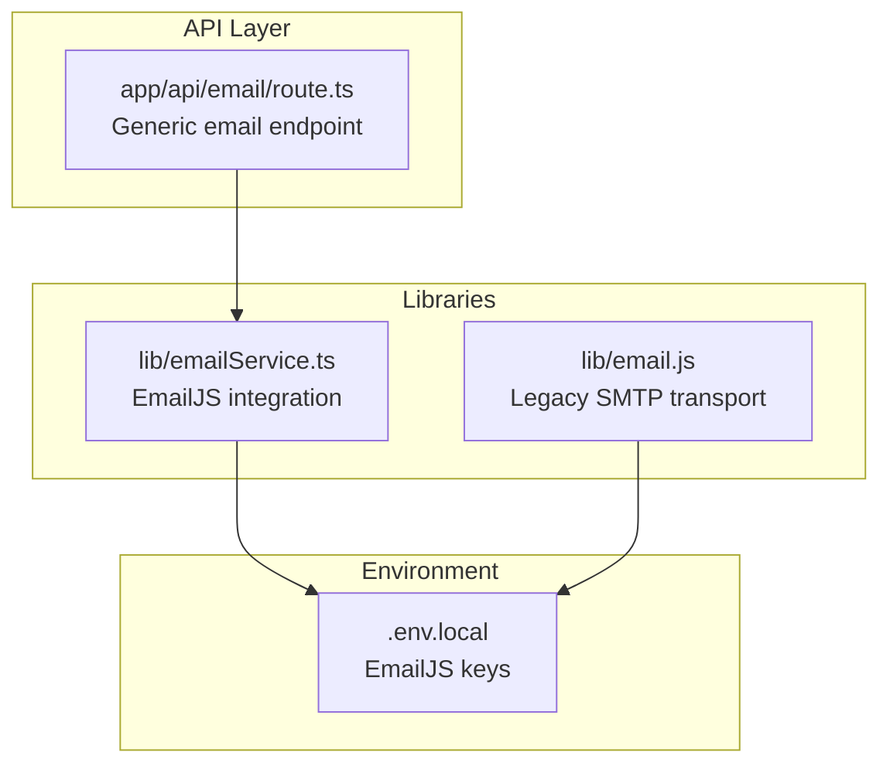
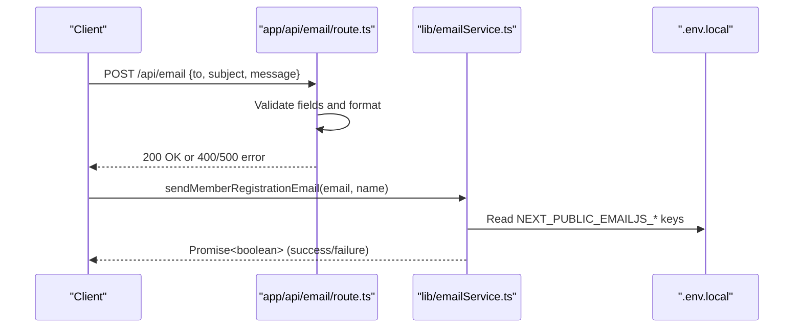
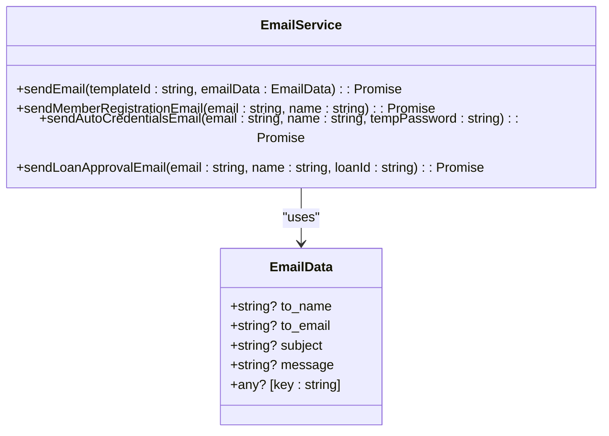
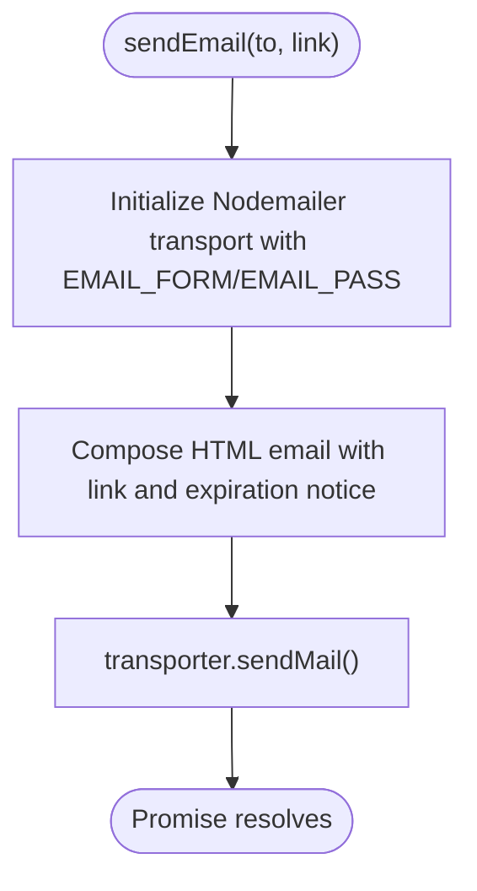
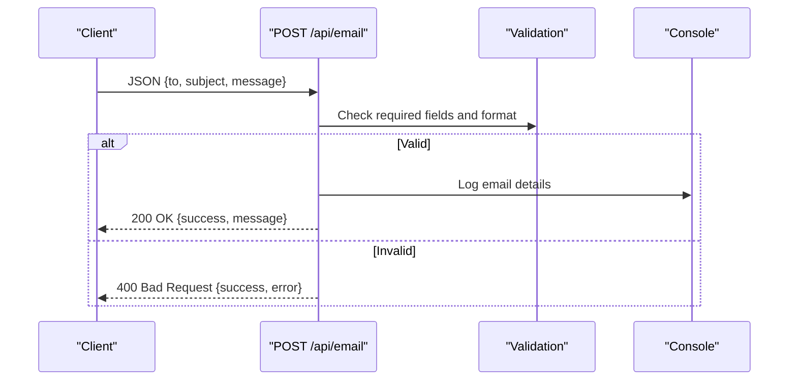
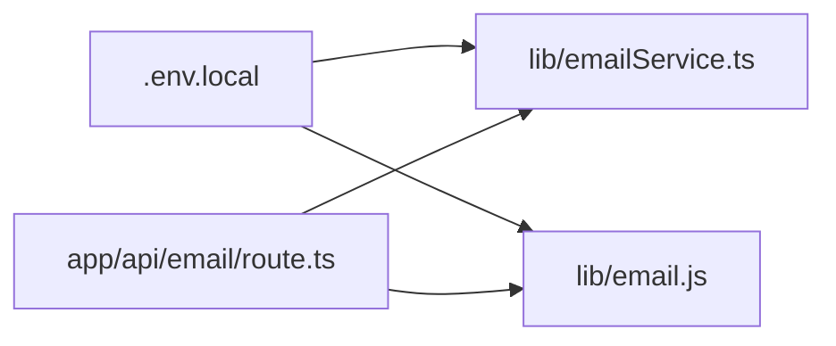

# Email Templates Management

<cite>
**Referenced Files in This Document**
- [email.js](file://lib/email.js)
- [emailService.ts](file://lib/emailService.ts)
- [route.ts](file://app/api/email/route.ts)
</cite>

## Table of Contents
1. [Introduction](#introduction)
2. [Project Structure](#project-structure)
3. [Core Components](#core-components)
4. [Architecture Overview](#architecture-overview)
5. [Detailed Component Analysis](#detailed-component-analysis)
6. [Dependency Analysis](#dependency-analysis)
7. [Performance Considerations](#performance-considerations)
8. [Troubleshooting Guide](#troubleshooting-guide)
9. [Conclusion](#conclusion)

## Introduction
This document describes the Email Templates Management system in the SAMPA Cooperative platform. It explains the template structure, variable system, predefined email templates, integration with EmailJS, customization options, branding guidelines, responsive design considerations, testing and validation procedures, versioning and A/B testing capabilities, and performance optimization strategies for cross-client email rendering.

## Project Structure
The email system is implemented across three primary areas:
- Legacy SMTP transport for password creation emails
- EmailJS integration for modern templated emails
- An API endpoint for sending generic emails

**Diagram sources**
- [email.js](file://lib/email.js#L1-L28)
- [emailService.ts](file://lib/emailService.ts#L1-L113)
- [route.ts](file://app/api/email/route.ts#L1-L87)

**Section sources**
- [email.js](file://lib/email.js#L1-L28)
- [emailService.ts](file://lib/emailService.ts#L1-L113)
- [route.ts](file://app/api/email/route.ts#L1-L87)

## Core Components
- EmailJS integration module: Provides typed interfaces and helper functions for sending templated emails via EmailJS, including predefined templates for member registration, auto-generated credentials, and loan approvals.
- Legacy SMTP transport: Sends a password creation link via Gmail SMTP for initial setup.
- Generic email API: Validates and logs outgoing emails for development and testing.

Key responsibilities:
- Define EmailJS configuration and template variables
- Provide strongly-typed email data interfaces
- Implement predefined email templates with dynamic variables
- Validate incoming requests for generic email endpoint
- Centralize environment variables for EmailJS credentials

**Section sources**
- [emailService.ts](file://lib/emailService.ts#L1-L113)
- [email.js](file://lib/email.js#L1-L28)
- [route.ts](file://app/api/email/route.ts#L1-L87)

## Architecture Overview
The Email Templates Management system integrates with EmailJS for templated emails and supports legacy SMTP for specific flows. The generic email API acts as a controlled entry point for outbound messages.

**Diagram sources**
- [route.ts](file://app/api/email/route.ts#L4-L56)
- [emailService.ts](file://lib/emailService.ts#L19-L38)

## Detailed Component Analysis

### EmailJS Integration Module
The EmailJS integration module initializes EmailJS with public keys and exposes:
- A generic send function with typed email data
- Predefined template functions for member registration, auto-generated credentials, and loan approvals
- Strongly-typed EmailData interface supporting arbitrary variables

Template variables and mapping:
- Generic send: accepts any key-value pairs in EmailData
- Member registration: to_name, email, reset_link, subject, message
- Auto-generated credentials: to_name, email, temp_password, subject, message
- Loan approval: to_name, email, loan_id, subject, message

**Diagram sources**
- [emailService.ts](file://lib/emailService.ts#L11-L17)
- [emailService.ts](file://lib/emailService.ts#L19-L113)

**Section sources**
- [emailService.ts](file://lib/emailService.ts#L1-L113)

### Legacy SMTP Transport
The legacy module configures a Gmail SMTP transport and sends a password creation link email with a fixed HTML body. This is used for initial setup flows.

**Diagram sources**
- [email.js](file://lib/email.js#L6-L28)

**Section sources**
- [email.js](file://lib/email.js#L1-L28)

### Generic Email API Endpoint
The generic email endpoint validates request bodies, checks email format, and simulates sending for development. It logs requests and returns structured responses.

**Diagram sources**
- [route.ts](file://app/api/email/route.ts#L4-L56)

**Section sources**
- [route.ts](file://app/api/email/route.ts#L1-L87)

## Dependency Analysis
- EmailJS integration depends on environment variables for service and template identifiers
- Generic endpoint depends on validation utilities and logging
- Legacy transport depends on environment variables for SMTP credentials

**Diagram sources**
- [emailService.ts](file://lib/emailService.ts#L3-L6)
- [email.js](file://lib/email.js#L7-L13)
- [route.ts](file://app/api/email/route.ts#L1-L87)

**Section sources**
- [emailService.ts](file://lib/emailService.ts#L1-L113)
- [email.js](file://lib/email.js#L1-L28)
- [route.ts](file://app/api/email/route.ts#L1-L87)

## Performance Considerations
- Minimize DOM complexity in templates to improve rendering performance across clients
- Use inline styles for critical layouts and media queries for responsive breakpoints
- Keep images optimized and use data URIs sparingly
- Avoid heavy JavaScript in emails; rely on CSS for styling
- Test across major email clients (Gmail, Outlook, Apple Mail) and adjust accordingly

## Troubleshooting Guide
Common issues and resolutions:
- Missing EmailJS configuration: Ensure NEXT_PUBLIC_EMAILJS_PUBLIC_KEY, NEXT_PUBLIC_EMAILJS_SERVICE_ID, and NEXT_PUBLIC_EMAILJS_TEMPLATE_ID are set in environment variables.
- Validation failures in generic endpoint: Verify that to, subject, and message are present and to is a valid email format.
- SMTP authentication errors: Confirm EMAIL_FORM and EMAIL_PASS are correctly configured.

Operational checks:
- Verify EmailJS initialization and template ID resolution
- Inspect console logs for generic endpoint requests and errors
- Review EmailJS response codes and error messages for template send attempts

**Section sources**
- [emailService.ts](file://lib/emailService.ts#L20-L24)
- [route.ts](file://app/api/email/route.ts#L9-L30)

## Conclusion
The Email Templates Management system combines legacy SMTP and modern EmailJS integration to support templated emails for member onboarding, credential delivery, and loan approvals. The system emphasizes strong typing, environment-driven configuration, and a controlled API endpoint for reliable email delivery. By following the customization, branding, responsive design, testing, and performance recommendations, teams can maintain robust and scalable email communications across the SAMPA Cooperative platform.