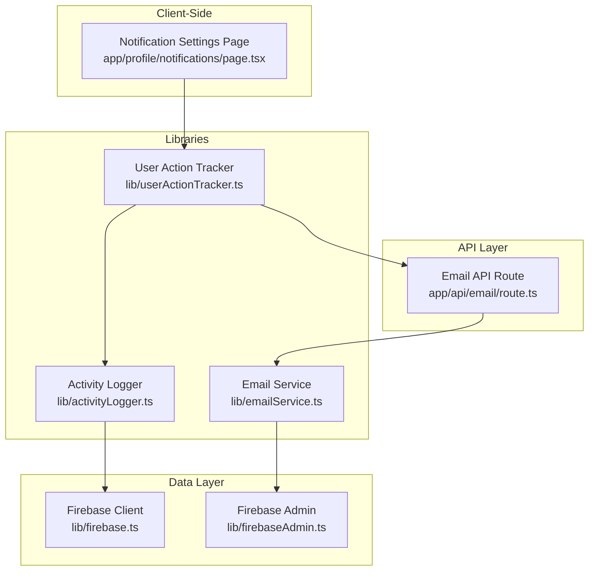
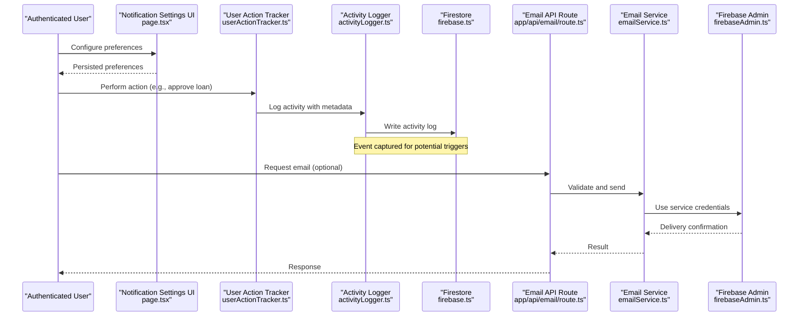
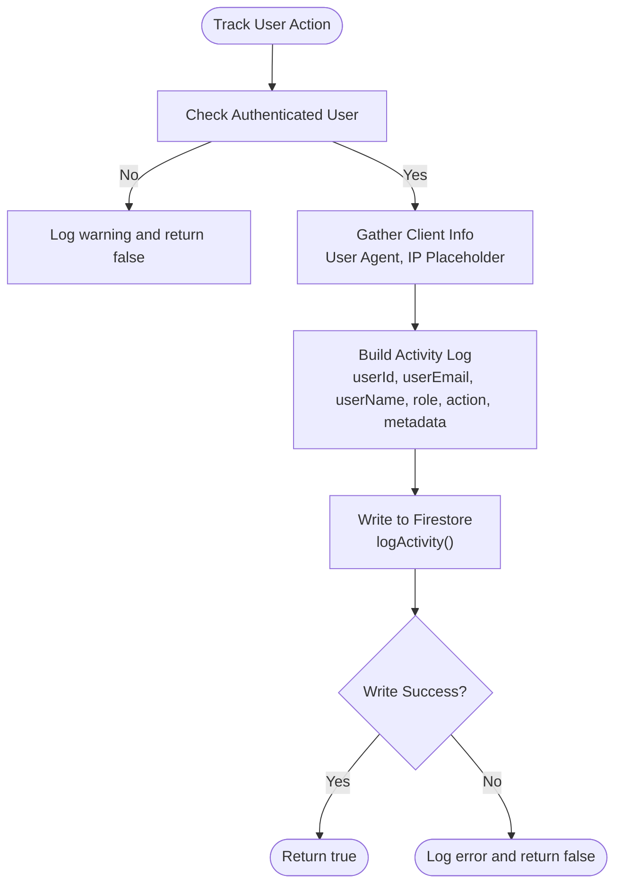
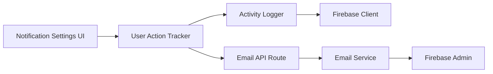

# Notification Triggers System

<cite>
**Referenced Files in This Document**
- [emailService.ts](file://lib/emailService.ts)
- [email route.ts](file://app/api/email/route.ts)
- [activityLogger.ts](file://lib/activityLogger.ts)
- [userActionTracker.ts](file://lib/userActionTracker.ts)
- [firebase.ts](file://lib/firebase.ts)
- [firebaseAdmin.ts](file://lib/firebaseAdmin.ts)
- [notification settings page.tsx](file://app/profile/notifications/page.tsx)
</cite>

## Table of Contents
1. [Introduction](#introduction)
2. [Project Structure](#project-structure)
3. [Core Components](#core-components)
4. [Architecture Overview](#architecture-overview)
5. [Detailed Component Analysis](#detailed-component-analysis)
6. [Dependency Analysis](#dependency-analysis)
7. [Performance Considerations](#performance-considerations)
8. [Troubleshooting Guide](#troubleshooting-guide)
9. [Conclusion](#conclusion)

## Introduction
This document describes the Notification Triggers System that automatically sends emails based on system events and user actions. It explains the event-driven architecture that monitors cooperative activities, integrates with activity logging and user action tracking, and outlines a notification rules engine that determines when and how emails are sent. It also covers configuration of trigger conditions, timing controls, and recipient resolution, and provides examples of common notification scenarios such as loan approvals, payment reminders, membership updates, and system alerts. Finally, it documents retry mechanisms, delivery tracking, failure handling, scheduling, batch processing, and performance considerations for high-volume scenarios.

## Project Structure
The notification system spans several modules:
- Email delivery utilities and templates
- Activity logging and user action tracking
- Firebase client and admin integrations
- API endpoints for email dispatch
- Client-side notification settings UI

**Diagram sources**
- [notification settings page.tsx](file://app/profile/notifications/page.tsx#L1-L150)
- [activityLogger.ts](file://lib/activityLogger.ts#L1-L165)
- [userActionTracker.ts](file://lib/userActionTracker.ts#L1-L118)
- [emailService.ts](file://lib/emailService.ts#L1-L113)
- [email route.ts](file://app/api/email/route.ts#L1-L87)
- [firebase.ts](file://lib/firebase.ts#L1-L309)
- [firebaseAdmin.ts](file://lib/firebaseAdmin.ts#L1-L277)

**Section sources**
- [notification settings page.tsx](file://app/profile/notifications/page.tsx#L1-L150)
- [activityLogger.ts](file://lib/activityLogger.ts#L1-L165)
- [userActionTracker.ts](file://lib/userActionTracker.ts#L1-L118)
- [emailService.ts](file://lib/emailService.ts#L1-L113)
- [email route.ts](file://app/api/email/route.ts#L1-L87)
- [firebase.ts](file://lib/firebase.ts#L1-L309)
- [firebaseAdmin.ts](file://lib/firebaseAdmin.ts#L1-L277)

## Core Components
- Email Service: Provides generic email sending and specific templates for registration, approvals, and credentials.
- Activity Logger: Persists user actions with metadata to Firestore for auditability and future triggering.
- User Action Tracker: Wraps user actions with automatic logging and supports higher-order tracking.
- Email API Route: Validates and forwards email requests to the email service.
- Firebase Integrations: Client-side helpers for Firestore operations and Admin SDK for server-side operations.
- Notification Settings UI: Allows users to configure communication preferences.

**Section sources**
- [emailService.ts](file://lib/emailService.ts#L1-L113)
- [activityLogger.ts](file://lib/activityLogger.ts#L1-L165)
- [userActionTracker.ts](file://lib/userActionTracker.ts#L1-L118)
- [email route.ts](file://app/api/email/route.ts#L1-L87)
- [firebase.ts](file://lib/firebase.ts#L1-L309)
- [firebaseAdmin.ts](file://lib/firebaseAdmin.ts#L1-L277)
- [notification settings page.tsx](file://app/profile/notifications/page.tsx#L1-L150)

## Architecture Overview
The system follows an event-driven pattern:
- User actions are tracked and logged.
- Logging writes structured activity entries to Firestore.
- A rules engine evaluates logged events and determines whether to trigger email notifications.
- Recipients are resolved from user profiles or related entities.
- Emails are sent via the EmailJS integration and stored for delivery tracking.

**Diagram sources**
- [notification settings page.tsx](file://app/profile/notifications/page.tsx#L1-L150)
- [userActionTracker.ts](file://lib/userActionTracker.ts#L1-L118)
- [activityLogger.ts](file://lib/activityLogger.ts#L1-L165)
- [firebase.ts](file://lib/firebase.ts#L1-L309)
- [email route.ts](file://app/api/email/route.ts#L1-L87)
- [emailService.ts](file://lib/emailService.ts#L1-L113)
- [firebaseAdmin.ts](file://lib/firebaseAdmin.ts#L1-L277)

## Detailed Component Analysis

### Email Service and Templates
The email service encapsulates EmailJS configuration and exposes:
- Generic send function with template support.
- Specific templates for member registration, auto-credentials, and loan approvals.

Key capabilities:
- Environment-driven configuration for EmailJS keys and service identifiers.
- Template-driven rendering with dynamic variables.
- Error handling and return status reporting.

Common scenarios supported by templates:
- Member registration welcome and password setup.
- Auto-generated temporary credentials.
- Loan approval notifications.

Operational notes:
- The service currently uses a generic send function and a dedicated template ID for all templates.
- For production, consider per-template IDs and robust error handling.

**Section sources**
- [emailService.ts](file://lib/emailService.ts#L1-L113)

### Activity Logging and User Action Tracking
Activity logging captures:
- User identity, roles, and device metadata.
- Timestamps and action descriptions.
- Optional contextual data for advanced filtering.

User action tracking:
- Wraps functions to automatically log before execution.
- Provides convenience functions for common actions (login, logout, profile updates, loan approvals/rejections, savings updates, report generation, settings updates).

Data persistence:
- Uses Firestore client utilities to write logs with unique IDs and timestamps.
- Provides queries for user-specific, global, and date-range logs.

**Diagram sources**
- [userActionTracker.ts](file://lib/userActionTracker.ts#L1-L118)
- [activityLogger.ts](file://lib/activityLogger.ts#L1-L165)
- [firebase.ts](file://lib/firebase.ts#L1-L309)

**Section sources**
- [userActionTracker.ts](file://lib/userActionTracker.ts#L1-L118)
- [activityLogger.ts](file://lib/activityLogger.ts#L1-L165)
- [firebase.ts](file://lib/firebase.ts#L1-L309)

### Email API Route
The email endpoint:
- Validates presence and format of recipient email.
- Accepts subject and message payload.
- Returns structured success/error responses.
- Currently logs and simulates sending.

Operational notes:
- In a production system, integrate with the EmailJS service wrapper and add retry/backoff logic.
- Consider adding rate limiting and queueing for high volume.

**Section sources**
- [email route.ts](file://app/api/email/route.ts#L1-L87)

### Firebase Integrations
Client-side Firestore helpers:
- Unified functions for set, get, update, delete, and query with validation and error handling.
- Support for ordering and filtering.

Server-side Admin SDK:
- Initializes with service account credentials.
- Provides CRUD operations and initialization status checks.
- Useful for secure, server-side operations and batch jobs.

**Section sources**
- [firebase.ts](file://lib/firebase.ts#L1-L309)
- [firebaseAdmin.ts](file://lib/firebaseAdmin.ts#L1-L277)

### Notification Settings UI
The notification settings page:
- Allows toggling email, SMS, and push preferences.
- Supports granular categories such as loan updates, savings updates, and payment reminders.
- Reflects current user preferences and enables saving.

Integration points:
- Preferences can influence the rules engine’s recipient resolution and suppression logic.
- UI state can be persisted in user profiles or a dedicated preferences collection.

**Section sources**
- [notification settings page.tsx](file://app/profile/notifications/page.tsx#L1-L150)

## Dependency Analysis
The system exhibits clear separation of concerns:
- UI depends on auth and tracks user preferences.
- Action tracking depends on activity logging and auth context.
- Activity logging depends on Firestore client utilities.
- Email API depends on the email service and EmailJS configuration.
- Email service depends on EmailJS and Admin SDK credentials.

**Diagram sources**
- [notification settings page.tsx](file://app/profile/notifications/page.tsx#L1-L150)
- [userActionTracker.ts](file://lib/userActionTracker.ts#L1-L118)
- [activityLogger.ts](file://lib/activityLogger.ts#L1-L165)
- [firebase.ts](file://lib/firebase.ts#L1-L309)
- [email route.ts](file://app/api/email/route.ts#L1-L87)
- [emailService.ts](file://lib/emailService.ts#L1-L113)
- [firebaseAdmin.ts](file://lib/firebaseAdmin.ts#L1-L277)

**Section sources**
- [notification settings page.tsx](file://app/profile/notifications/page.tsx#L1-L150)
- [userActionTracker.ts](file://lib/userActionTracker.ts#L1-L118)
- [activityLogger.ts](file://lib/activityLogger.ts#L1-L165)
- [firebase.ts](file://lib/firebase.ts#L1-L309)
- [email route.ts](file://app/api/email/route.ts#L1-L87)
- [emailService.ts](file://lib/emailService.ts#L1-L113)
- [firebaseAdmin.ts](file://lib/firebaseAdmin.ts#L1-L277)

## Performance Considerations
- Asynchronous logging: Activity logs are written asynchronously to Firestore, minimizing UI latency.
- Batch operations: Use Firestore batch writes for bulk updates when implementing rules-driven batch notifications.
- Indexing: Ensure Firestore indexes exist for fields frequently queried in rules (e.g., userId, timestamp).
- Rate limiting: Implement rate limits on the email API to prevent abuse and protect external providers.
- Retry/backoff: Add exponential backoff for transient failures during email delivery.
- Queueing: Offload heavy workloads to a queue (e.g., scheduled functions or pub/sub) for high-volume scenarios.
- Caching: Cache frequently accessed user preferences to reduce repeated reads.
- Monitoring: Track delivery metrics and error rates to tune thresholds and alert on anomalies.

[No sources needed since this section provides general guidance]

## Troubleshooting Guide
Common issues and resolutions:
- Missing EmailJS configuration: Ensure environment variables are set; the email service validates keys before sending.
- Invalid email format: The API route validates email format and rejects malformed inputs.
- Firestore initialization errors: Verify Firebase client and Admin SDK credentials; check for placeholder values and correct project settings.
- Permission denied: Review Firestore rules and service account permissions for Admin SDK operations.
- Activity logging failures: Inspect return statuses from logging functions and confirm Firestore connectivity.
- Delivery failures: Implement retry logic and maintain delivery logs for auditing.

**Section sources**
- [emailService.ts](file://lib/emailService.ts#L1-L113)
- [email route.ts](file://app/api/email/route.ts#L1-L87)
- [firebase.ts](file://lib/firebase.ts#L1-L309)
- [firebaseAdmin.ts](file://lib/firebaseAdmin.ts#L1-L277)
- [activityLogger.ts](file://lib/activityLogger.ts#L1-L165)

## Conclusion
The Notification Triggers System leverages a clean event-driven architecture: user actions are tracked and logged, and a rules engine can evaluate these events to trigger targeted email notifications. The current implementation provides strong foundations for activity logging, user action tracking, and email delivery via EmailJS. To evolve into a production-grade system, integrate a robust rules engine, add retry/backoff, implement queueing and batching, and enhance delivery tracking and monitoring.