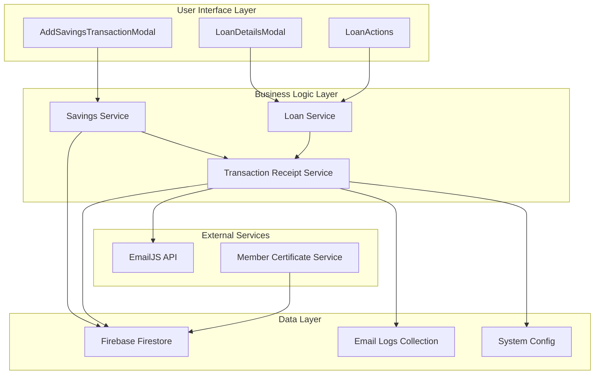
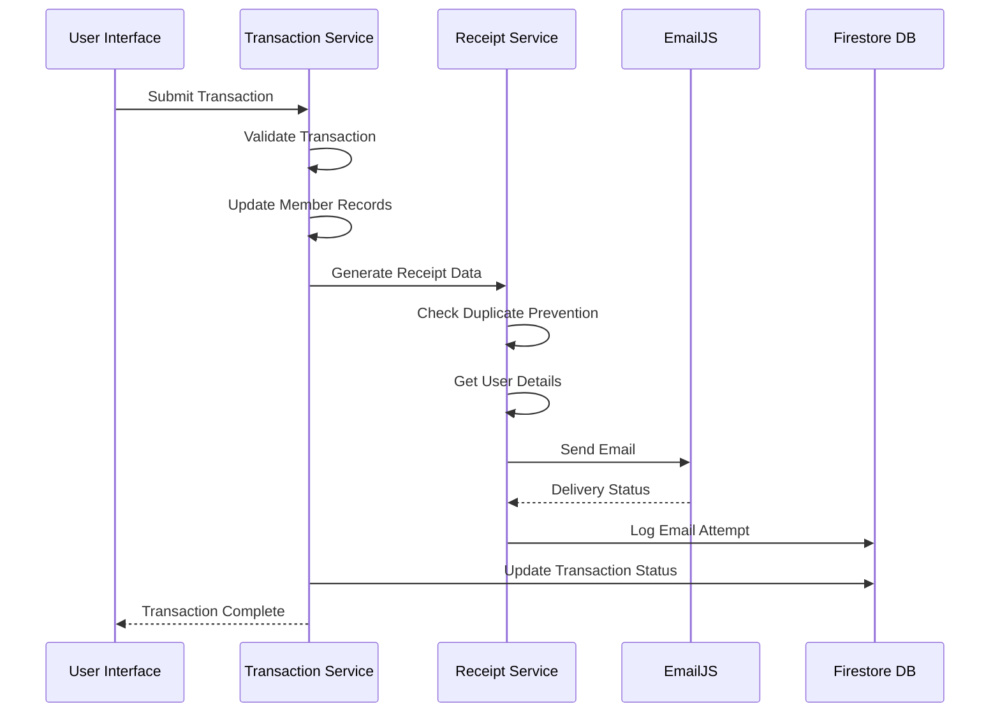
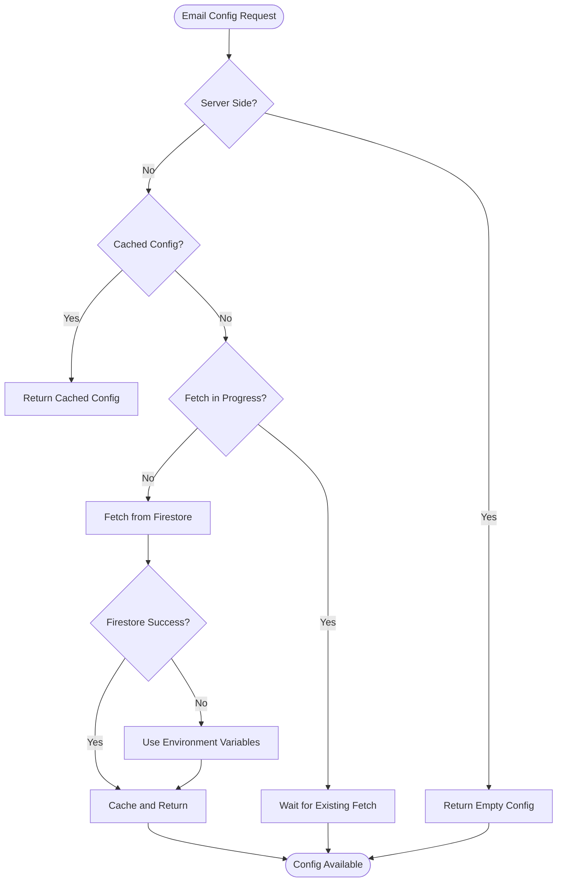
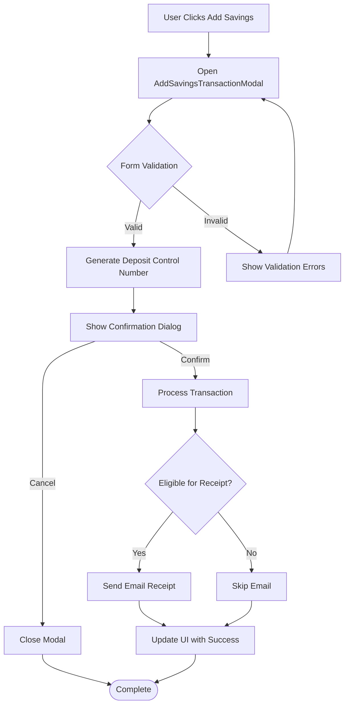

# Transaction Receipt System

<cite>
**Referenced Files in This Document**
- [transactionReceiptService.ts](file://lib/transactionReceiptService.ts)
- [savingsService.ts](file://lib/savingsService.ts)
- [AddSavingsTransactionModal.tsx](file://components/user/AddSavingsTransactionModal.tsx)
- [LoanDetailsModal.tsx](file://components/admin/LoanDetailsModal.tsx)
- [LoanActions.tsx](file://components/user/actions/LoanActions.tsx)
- [route.ts](file://app/api/loans/route.ts)
- [certificateService.ts](file://lib/certificateService.ts)
- [route.ts](file://app/api/certificate/[memberId]/route.ts)
</cite>

## Table of Contents
1. [Introduction](#introduction)
2. [System Architecture](#system-architecture)
3. [Core Components](#core-components)
4. [Transaction Processing Workflow](#transaction-processing-workflow)
5. [Email Configuration Management](#email-configuration-management)
6. [User Interface Integration](#user-interface-integration)
7. [Data Storage and Logging](#data-storage-and-logging)
8. [Error Handling and Monitoring](#error-handling-and-monitoring)
9. [Security Considerations](#security-considerations)
10. [Performance Optimization](#performance-optimization)
11. [Troubleshooting Guide](#troubleshooting-guide)
12. [Conclusion](#conclusion)

## Introduction

The Transaction Receipt System is a comprehensive email notification and receipt generation service designed for the SAMPA Cooperative platform. This system automatically sends digital receipts to cooperative members after financial transactions are processed, ensuring transparency and compliance with cooperative accounting standards.

The system supports two primary transaction types:
- **Loan Payment Receipts**: Generated for driver and operator members who make loan payments
- **Savings Deposit Receipts**: Generated for driver and operator members who make savings deposits

Built with modern React and Next.js technologies, the system integrates seamlessly with Firebase Firestore for data persistence and EmailJS for reliable email delivery.

## System Architecture

The Transaction Receipt System follows a modular architecture with clear separation of concerns:



**Diagram sources**
- [transactionReceiptService.ts](file://lib/transactionReceiptService.ts#L1-L636)
- [savingsService.ts](file://lib/savingsService.ts#L1-L534)

## Core Components

### Transaction Receipt Service

The central component responsible for generating and sending transaction receipts. It implements sophisticated user identification, email configuration management, and receipt number generation.

**Key Features:**
- **Dual Configuration Source**: Supports both Firestore-based and environment variable configurations
- **Smart Caching**: Implements intelligent caching for EmailJS configuration to minimize API calls
- **Role-Based Filtering**: Ensures receipts are only sent to eligible driver and operator members
- **Duplicate Prevention**: Prevents duplicate receipt emails through transaction ID tracking

**Section sources**
- [transactionReceiptService.ts](file://lib/transactionReceiptService.ts#L1-L636)

### Savings Service Integration

Handles the complete savings transaction lifecycle, from validation to receipt generation.

**Processing Pipeline:**
1. Validates user membership and role eligibility
2. Processes transaction against existing balance
3. Updates member savings totals
4. Generates transaction notifications
5. Sends email receipts (when applicable)

**Section sources**
- [savingsService.ts](file://lib/savingsService.ts#L238-L416)

### User Interface Components

Multiple interface components integrate with the receipt system:

**AddSavingsTransactionModal**: Provides a user-friendly form for savings transactions with real-time validation and confirmation dialogs.

**LoanDetailsModal**: Displays payment details and receipt information for loan transactions.

**LoanActions**: Manages loan payment processing and receipt display.

**Section sources**
- [AddSavingsTransactionModal.tsx](file://components/user/AddSavingsTransactionModal.tsx#L1-L371)
- [LoanDetailsModal.tsx](file://components/admin/LoanDetailsModal.tsx#L850-L921)
- [LoanActions.tsx](file://components/user/actions/LoanActions.tsx#L520-L540)

## Transaction Processing Workflow

The system implements a robust workflow for processing financial transactions and generating receipts:



**Diagram sources**
- [savingsService.ts](file://lib/savingsService.ts#L367-L409)
- [transactionReceiptService.ts](file://lib/transactionReceiptService.ts#L235-L406)

### Receipt Generation Process

Each receipt follows a standardized format with the following structure:

**Common Elements:**
- Unique receipt number in SMP-YYYYMMDD-XXXX format
- Transaction date and time (Philippine timezone)
- Member role and personal information
- Transaction-specific details (amount, balance, etc.)

**Transaction-Specific Elements:**
- **Loan Payments**: Remaining balance, loan ID, payment schedule day
- **Savings Deposits**: Deposit control number, current balance

**Section sources**
- [transactionReceiptService.ts](file://lib/transactionReceiptService.ts#L125-L130)
- [transactionReceiptService.ts](file://lib/transactionReceiptService.ts#L262-L303)

## Email Configuration Management

The system implements a flexible email configuration system supporting multiple deployment scenarios:



**Diagram sources**
- [transactionReceiptService.ts](file://lib/transactionReceiptService.ts#L58-L81)

### Configuration Sources

**Primary Source**: Firestore `systemConfig/emailjs` collection containing:
- Public Key for EmailJS initialization
- Service ID for email template routing
- Template ID for receipt formatting

**Fallback Source**: Environment variables for development and deployment flexibility:
- NEXT_PUBLIC_EMAILJS_PUBLIC_KEY
- NEXT_PUBLIC_EMAILJS_SERVICE_ID  
- NEXT_PUBLIC_EMAILJS_RECEIPT_TEMPLATE_ID

**Section sources**
- [transactionReceiptService.ts](file://lib/transactionReceiptService.ts#L8-L56)
- [transactionReceiptService.ts](file://lib/transactionReceiptService.ts#L42-L56)

## User Interface Integration

The receipt system integrates seamlessly with multiple user interface components:

### Savings Transaction Flow



**Diagram sources**
- [AddSavingsTransactionModal.tsx](file://components/user/AddSavingsTransactionModal.tsx#L71-L148)

### Loan Payment Integration

Loan payment interfaces display receipt information and facilitate payment processing with automatic receipt generation.

**Section sources**
- [AddSavingsTransactionModal.tsx](file://components/user/AddSavingsTransactionModal.tsx#L1-L371)
- [LoanDetailsModal.tsx](file://components/admin/LoanDetailsModal.tsx#L850-L921)

## Data Storage and Logging

The system maintains comprehensive audit trails through structured data storage:

### Email Log Structure

Each email attempt is logged with detailed information for monitoring and troubleshooting:

| Field | Description | Example |
|-------|-------------|---------|
| `transactionId` | Unique identifier for the transaction | `savings-user123-1699123456789` |
| `transactionType` | Type of transaction (`loan_payment` or `savings_deposit`) | `savings_deposit` |
| `userId` | Member user ID | `user123` |
| `email` | Recipient email address | `john.doe@email.com` |
| `sentAt` | Timestamp of email attempt | `2023-11-01T10:30:00Z` |
| `status` | Delivery status (`sent` or `failed`) | `sent` |
| `errorMessage` | Error details if applicable | `EmailJS configuration is missing` |

### Receipt Number Generation

The system generates unique receipt numbers using a deterministic format:
`SMP-{YYYYMMDD}-{4-digit-random-number}`

Examples:
- `SMP-20231101-1234`
- `SMP-20231225-5678`

**Section sources**
- [transactionReceiptService.ts](file://lib/transactionReceiptService.ts#L115-L123)
- [transactionReceiptService.ts](file://lib/transactionReceiptService.ts#L125-L130)

## Error Handling and Monitoring

The system implements comprehensive error handling and monitoring mechanisms:

### Error Classification

**Configuration Errors**: Missing EmailJS configuration prevents receipt generation
**Network Errors**: Temporary connectivity issues during email delivery
**Validation Errors**: Invalid user data or transaction parameters
**Business Logic Errors**: Insufficient funds for withdrawals, invalid member roles

### Monitoring Features

- **Console Logging**: Comprehensive logging for debugging and operational visibility
- **Email Attempt Logging**: Persistent record of all email delivery attempts
- **Error Recovery**: Graceful degradation when email services are unavailable
- **Transaction Rollback**: Maintains transaction integrity even if email fails

**Section sources**
- [transactionReceiptService.ts](file://lib/transactionReceiptService.ts#L371-L405)
- [savingsService.ts](file://lib/savingsService.ts#L394-L408)

## Security Considerations

The system incorporates multiple security measures:

### Role-Based Access Control
- Automatic filtering ensures receipts are only sent to eligible driver and operator members
- User role validation prevents unauthorized receipt generation

### Data Protection
- Sensitive financial data is handled securely through Firebase Firestore
- Email templates use parameterized variables to prevent injection attacks
- Environment variables isolate sensitive configuration data

### Audit Trail
- Complete logging of all receipt generation attempts
- Timestamped records for compliance and dispute resolution
- Error logging for security incident detection

## Performance Optimization

Several optimization strategies enhance system performance:

### Caching Strategy
- EmailJS configuration cached to minimize API calls
- User details cached during single transaction processing
- Smart promise-based fetching prevents duplicate requests

### Asynchronous Processing
- Non-blocking email sending allows immediate transaction completion
- Background processing for receipt generation
- Parallel processing for multiple concurrent transactions

### Resource Management
- Efficient Firestore queries with proper indexing
- Minimal memory footprint through streaming data processing
- Optimized network requests with connection pooling

## Troubleshooting Guide

### Common Issues and Solutions

**Email Configuration Missing**
- **Symptoms**: Receipts not being sent despite successful transactions
- **Solution**: Verify EmailJS configuration in Firestore or environment variables
- **Prevention**: Implement configuration validation during system startup

**Duplicate Receipt Emails**
- **Symptoms**: Members receiving multiple identical receipts
- **Solution**: Check emailLogs collection for existing entries
- **Prevention**: Implement transaction ID-based duplicate prevention

**User Not Found Errors**
- **Symptoms**: Receipt generation fails with user lookup errors
- **Solution**: Verify user-to-member linking in Firestore
- **Prevention**: Implement robust user discovery algorithms

**Email Delivery Failures**
- **Symptoms**: Email attempts logged as failed
- **Solution**: Check EmailJS service status and API limits
- **Prevention**: Implement retry mechanisms and monitoring alerts

### Diagnostic Commands

**Check Email Configuration**
```bash
# Verify EmailJS configuration in Firestore
firebase firestore:query systemConfig --limit 1

# Check email logs for recent failures
firebase firestore:query emailLogs --order-by sentAt --limit 10
```

**Monitor Transaction Processing**
```bash
# View recent savings transactions
firebase firestore:query members --recursive --limit 5

# Check loan payment history
firebase firestore:query loans --limit 5
```

**Section sources**
- [transactionReceiptService.ts](file://lib/transactionReceiptService.ts#L132-L144)
- [transactionReceiptService.ts](file://lib/transactionReceiptService.ts#L489-L510)

## Conclusion

The Transaction Receipt System represents a robust, scalable solution for automated financial transaction notifications in cooperative environments. Its modular architecture, comprehensive error handling, and flexible configuration management make it suitable for various deployment scenarios while maintaining high reliability and security standards.

Key strengths include:
- **Automated Compliance**: Ensures all financial transactions are properly documented
- **Flexible Deployment**: Supports multiple configuration sources and environments
- **User Experience**: Seamless integration with existing user interfaces
- **Auditability**: Complete logging and monitoring capabilities
- **Resilience**: Graceful error handling and recovery mechanisms

The system provides a solid foundation for cooperative financial management while maintaining the transparency and accountability essential for member trust and regulatory compliance.