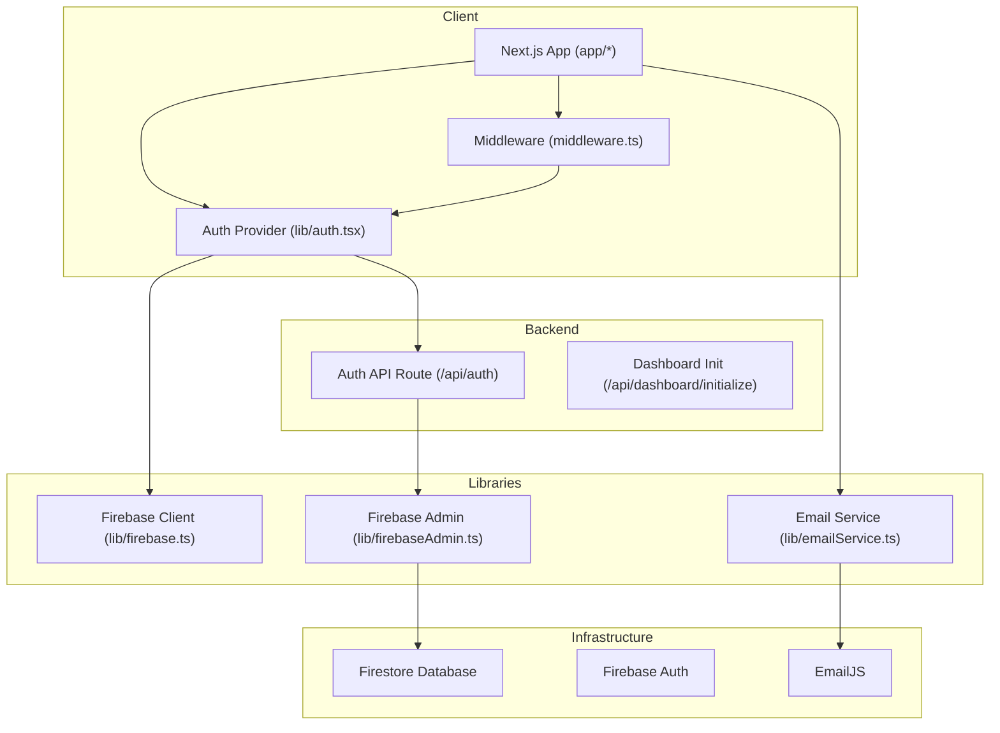
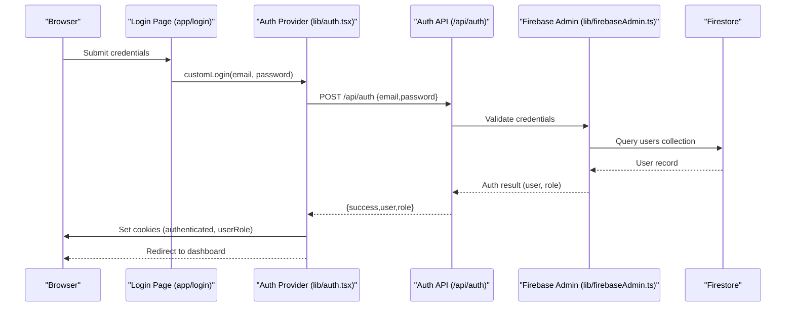
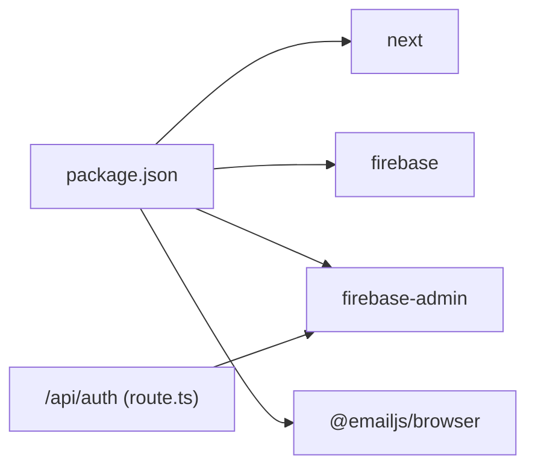
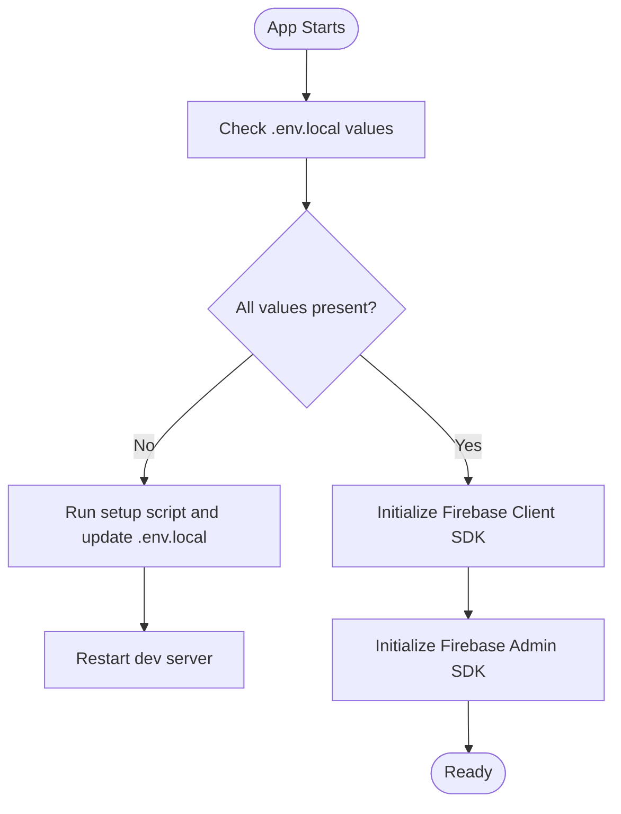

# Getting Started

<cite>
**Referenced Files in This Document**
- [README.md](file://README.md)
- [FIREBASE_SETUP_INSTRUCTIONS.md](file://FIREBASE_SETUP_INSTRUCTIONS.md)
- [.env.local.example](file://.env.local.example)
- [package.json](file://package.json)
- [firebase.json](file://firebase.json)
- [lib/firebase.ts](file://lib/firebase.ts)
- [lib/firebaseAdmin.ts](file://lib/firebaseAdmin.ts)
- [lib/emailService.ts](file://lib/emailService.ts)
- [middleware.ts](file://middleware.ts)
- [lib/auth.tsx](file://lib/auth.tsx)
- [lib/validators.ts](file://lib/validators.ts)
- [app/login/page.tsx](file://app/login/page.tsx)
- [app/admin/dashboard/page.tsx](file://app/admin/dashboard/page.tsx)
- [docs/FIREBASE_TROUBLESHOOTING.md](file://docs/FIREBASE_TROUBLESHOOTING.md)
- [scripts/setup-firebase.js](file://scripts/setup-firebase.js)
</cite>

## Table of Contents
1. [Introduction](#introduction)
2. [Project Structure](#project-structure)
3. [Core Components](#core-components)
4. [Architecture Overview](#architecture-overview)
5. [Detailed Component Analysis](#detailed-component-analysis)
6. [Dependency Analysis](#dependency-analysis)
7. [Performance Considerations](#performance-considerations)
8. [Troubleshooting Guide](#troubleshooting-guide)
9. [Conclusion](#conclusion)
10. [Appendices](#appendices)

## Introduction
This guide helps you install and run the SAMPA Cooperative Management System locally. It covers prerequisites, environment setup, Firebase configuration, development server startup, and initial testing. It also explains how to access dashboards for different roles and provides troubleshooting guidance.

## Project Structure
The project is a Next.js 16 application using TypeScript. It integrates Firebase for client and server-side operations, with role-based dashboards and middleware-driven access control.

**Diagram sources**
- [lib/firebase.ts](file://lib/firebase.ts#L1-L309)
- [lib/firebaseAdmin.ts](file://lib/firebaseAdmin.ts#L1-L277)
- [lib/emailService.ts](file://lib/emailService.ts#L1-L113)
- [middleware.ts](file://middleware.ts#L1-L62)
- [lib/auth.tsx](file://lib/auth.tsx#L1-L682)
- [app/login/page.tsx](file://app/login/page.tsx#L1-L223)

**Section sources**
- [README.md](file://README.md#L1-L37)
- [package.json](file://package.json#L1-L53)

## Core Components
- Firebase Client SDK: Initializes and exposes Firestore and Auth for the browser.
- Firebase Admin SDK: Initializes server-side Firestore access using service account credentials.
- Authentication Provider: Manages login, cookies, role-based routing, and profile updates.
- Middleware: Enforces role-based access control and redirects users to appropriate dashboards.
- Email Service: Sends templated emails via EmailJS.
- Firebase Configuration: Client and server credentials, Firestore rules and indexes.

**Section sources**
- [lib/firebase.ts](file://lib/firebase.ts#L1-L309)
- [lib/firebaseAdmin.ts](file://lib/firebaseAdmin.ts#L1-L277)
- [lib/auth.tsx](file://lib/auth.tsx#L1-L682)
- [middleware.ts](file://middleware.ts#L1-L62)
- [lib/emailService.ts](file://lib/emailService.ts#L1-L113)
- [firebase.json](file://firebase.json#L1-L9)

## Architecture Overview
The system uses a hybrid client/server model:
- Client-side: Next.js app with React components, Firebase Client SDK, and Auth Provider.
- Server-side: Firebase Admin SDK for backend operations, EmailJS for notifications, and API routes.
- Access control: Middleware validates user roles and redirects to role-specific dashboards.

**Diagram sources**
- [app/login/page.tsx](file://app/login/page.tsx#L1-L223)
- [lib/auth.tsx](file://lib/auth.tsx#L197-L514)
- [lib/firebaseAdmin.ts](file://lib/firebaseAdmin.ts#L13-L108)

## Detailed Component Analysis

### Prerequisites
- Node.js LTS recommended.
- Choose one package manager: npm, yarn, pnpm, or bun.
- A Firebase project with Firestore enabled and EmailJS configured (for email notifications).

**Section sources**
- [README.md](file://README.md#L5-L15)
- [package.json](file://package.json#L1-L53)

### Step-by-Step Installation
1. Clone the repository and navigate to the project directory.
2. Install dependencies using your preferred package manager.
3. Copy the example environment file and fill in credentials:
   - Copy [.env.local.example](file://.env.local.example#L1-L10) to .env.local.
   - Fill in Firebase Admin SDK credentials and Firebase Client SDK values.
4. Configure Firebase:
   - Use the setup script to generate placeholders and guidance.
   - Follow the Firebase setup instructions to populate .env.local.
5. Start the development server and open http://localhost:3000.

Verification:
- Confirm the login page loads and you can submit credentials.
- Check browser console for Firebase initialization logs.

**Section sources**
- [README.md](file://README.md#L5-L15)
- [.env.local.example](file://.env.local.example#L1-L10)
- [scripts/setup-firebase.js](file://scripts/setup-firebase.js#L1-L93)
- [FIREBASE_SETUP_INSTRUCTIONS.md](file://FIREBASE_SETUP_INSTRUCTIONS.md#L1-L63)

### Environment Variables (.env.local)
Required keys include:
- Firebase Admin SDK: FIREBASE_PROJECT_ID, FIREBASE_CLIENT_EMAIL, FIREBASE_PRIVATE_KEY
- Firebase Client SDK: NEXT_PUBLIC_FIREBASE_API_KEY, NEXT_PUBLIC_FIREBASE_AUTH_DOMAIN, NEXT_PUBLIC_FIREBASE_PROJECT_ID, NEXT_PUBLIC_FIREBASE_STORAGE_BUCKET, NEXT_PUBLIC_FIREBASE_MESSAGING_SENDER_ID, NEXT_PUBLIC_FIREBASE_APP_ID
- EmailJS: NEXT_PUBLIC_EMAILJS_PUBLIC_KEY, NEXT_PUBLIC_EMAILJS_SERVICE_ID, NEXT_PUBLIC_EMAILJS_TEMPLATE_ID

Notes:
- Keep the private key as a single-line string with \n escape sequences.
- Restart the development server after changing .env.local.

**Section sources**
- [.env.local.example](file://.env.local.example#L1-L10)
- [lib/firebaseAdmin.ts](file://lib/firebaseAdmin.ts#L17-L48)
- [lib/firebase.ts](file://lib/firebase.ts#L22-L30)
- [lib/emailService.ts](file://lib/emailService.ts#L4-L6)

### Firebase Project Setup
Follow the official Firebase setup instructions:
- Generate a service account key and extract projectId, clientEmail, and privateKey.
- Paste these values into .env.local.
- Restart the development server.

Additional guidance:
- Ensure Firestore rules and indexes are configured per firebase.json.
- For troubleshooting, consult the Firebase troubleshooting guide.

**Section sources**
- [FIREBASE_SETUP_INSTRUCTIONS.md](file://FIREBASE_SETUP_INSTRUCTIONS.md#L1-L63)
- [firebase.json](file://firebase.json#L1-L9)
- [docs/FIREBASE_TROUBLESHOOTING.md](file://docs/FIREBASE_TROUBLESHOOTING.md#L1-L177)

### Development Server Startup
- Use your chosen package manager to run the development server.
- Open http://localhost:3000 in your browser.
- The login page is the entry point for authenticated sessions.

**Section sources**
- [README.md](file://README.md#L5-L15)
- [app/login/page.tsx](file://app/login/page.tsx#L1-L223)

### Initial Testing Procedures
- Verify Firebase connectivity:
  - Use the setup script to confirm environment variables.
  - Use the Firebase test script to validate connectivity.
- Test authentication:
  - Log in using the login page.
  - Confirm cookies are set and redirection matches your role.
- Validate dashboards:
  - Admin roles: /admin/dashboard and role-specific dashboards.
  - Member/Driver/Operator: /dashboard, /driver/dashboard, /operator/dashboard.

**Section sources**
- [scripts/setup-firebase.js](file://scripts/setup-firebase.js#L1-L93)
- [docs/FIREBASE_TROUBLESHOOTING.md](file://docs/FIREBASE_TROUBLESHOOTING.md#L69-L88)
- [lib/auth.tsx](file://lib/auth.tsx#L111-L156)
- [app/admin/dashboard/page.tsx](file://app/admin/dashboard/page.tsx#L88-L136)

### Accessing Dashboards and Navigation
- Admin dashboard: /admin/dashboard (also redirects role-specific dashboards).
- Member dashboard: /dashboard.
- Driver dashboard: /driver/dashboard.
- Operator dashboard: /operator/dashboard.
- Unauthorized access attempts are redirected to /admin/unauthorized or login pages depending on context.

Navigation patterns:
- Role-based redirection occurs automatically after login.
- Middleware enforces access control for protected routes.

**Section sources**
- [lib/auth.tsx](file://lib/auth.tsx#L111-L156)
- [lib/validators.ts](file://lib/validators.ts#L199-L235)
- [middleware.ts](file://middleware.ts#L5-L56)

## Dependency Analysis
Key runtime dependencies include Next.js, Firebase client and admin SDKs, EmailJS, and UI libraries. Scripts automate Firebase setup and testing.

**Diagram sources**
- [package.json](file://package.json#L16-L40)

**Section sources**
- [package.json](file://package.json#L1-L53)

## Performance Considerations
- Minimize Firestore queries by batching and using indexes.
- Use client-side caching for frequently accessed data.
- Keep environment variables consistent to avoid repeated reinitialization.

## Troubleshooting Guide
Common issues and resolutions:
- “Unable to detect a Project Id”: Run the setup script and verify .env.local values.
- Invalid credentials: Regenerate service account key and update .env.local.
- Firestore query requires index: Follow the provided URL or create the index manually.
- No member found for user ID: Use the user-member linking fix script.
- Authentication flow issues: Verify /api/auth route, role assignments, and cookie handling.

Diagnostic commands:
- npm run setup-firebase
- npm run test-firebase

**Section sources**
- [docs/FIREBASE_TROUBLESHOOTING.md](file://docs/FIREBASE_TROUBLESHOOTING.md#L1-L177)
- [FIREBASE_SETUP_INSTRUCTIONS.md](file://FIREBASE_SETUP_INSTRUCTIONS.md#L1-L63)

## Conclusion
You now have the essentials to install, configure, and run the SAMPA Cooperative Management System locally. Use the provided scripts and documentation to resolve common issues and explore the role-based dashboards.

## Appendices

### Appendix A: Firebase Initialization Flow

**Diagram sources**
- [scripts/setup-firebase.js](file://scripts/setup-firebase.js#L14-L39)
- [lib/firebase.ts](file://lib/firebase.ts#L22-L60)
- [lib/firebaseAdmin.ts](file://lib/firebaseAdmin.ts#L13-L108)