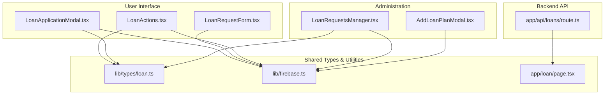
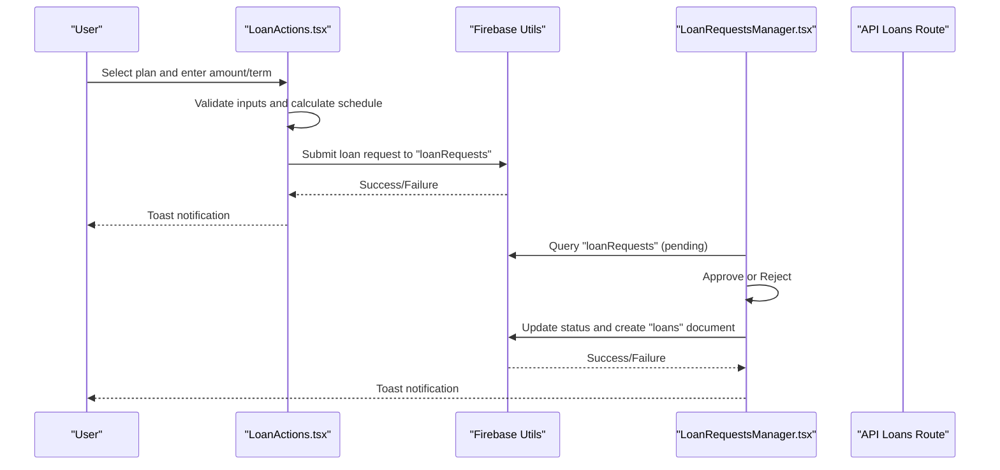
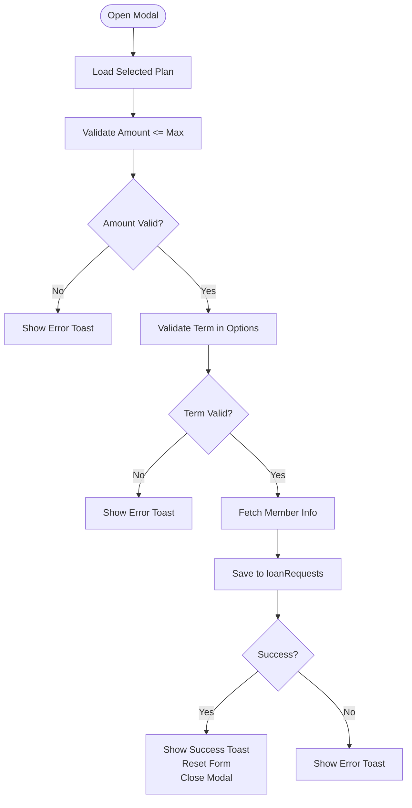
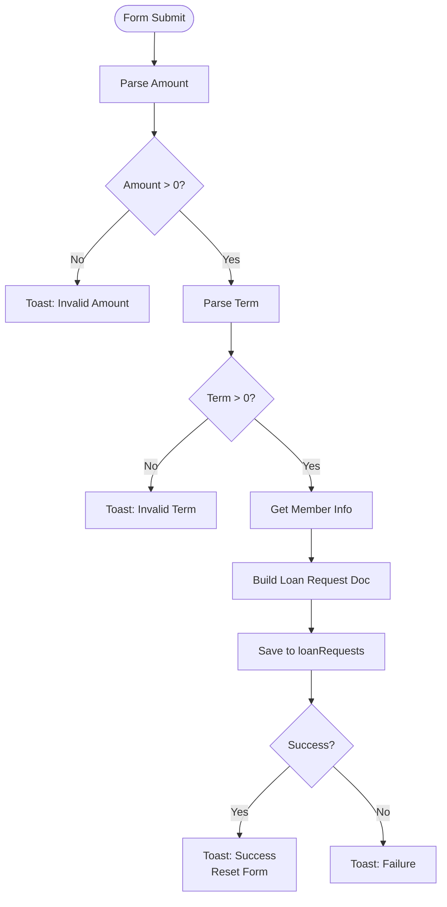
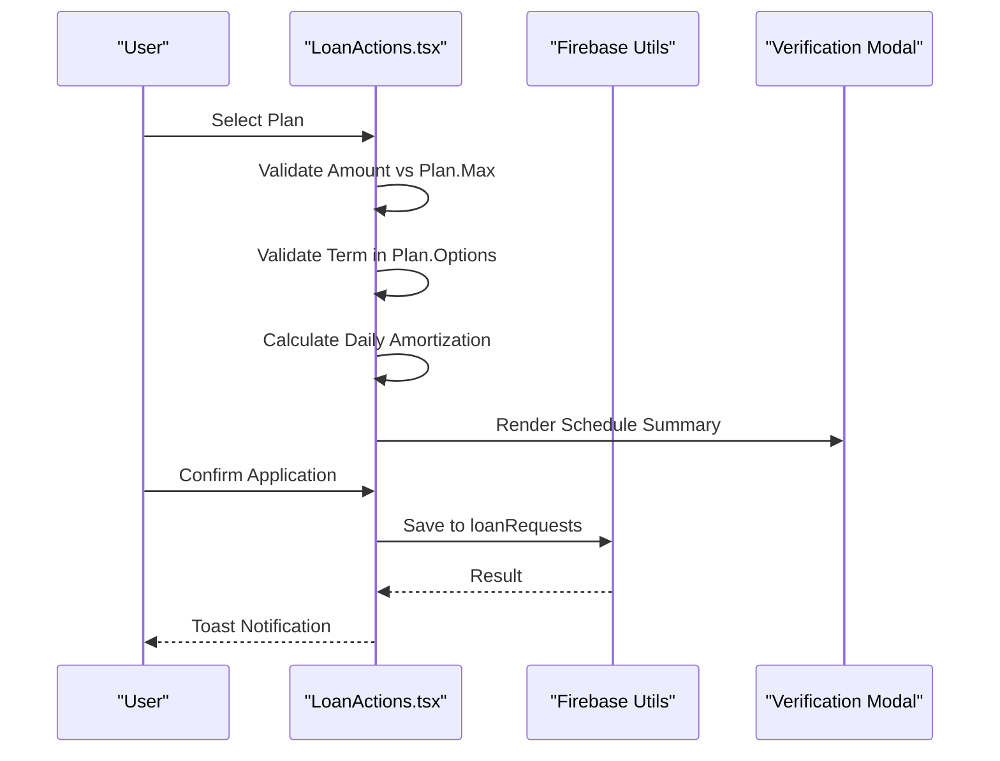
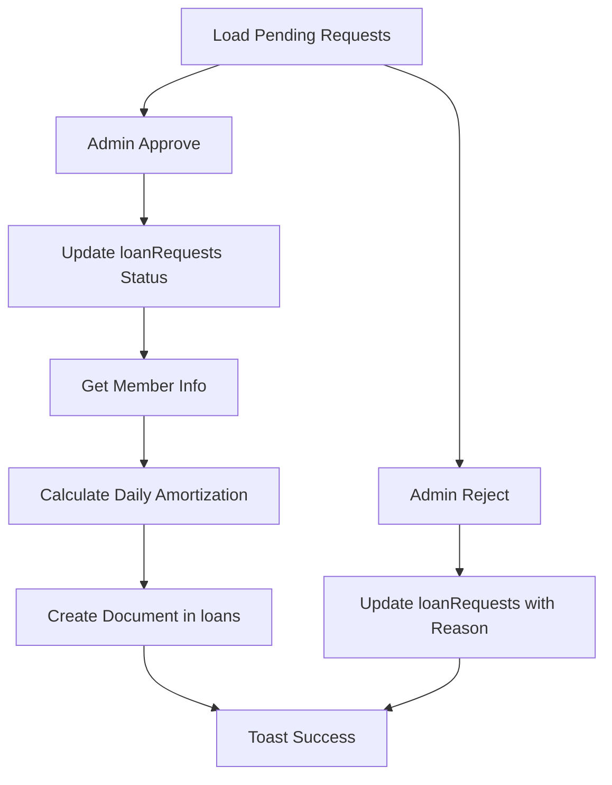
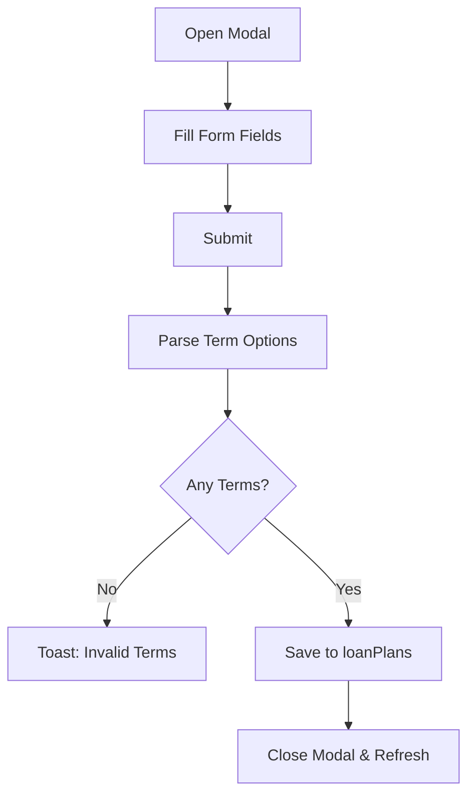
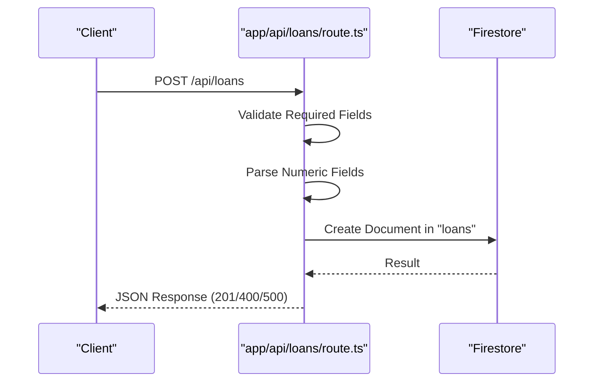
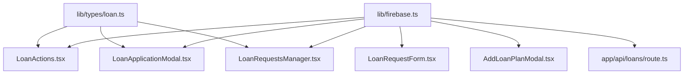

# Loan Application Workflow

<cite>
**Referenced Files in This Document**
- [LoanApplicationModal.tsx](file://components/user/LoanApplicationModal.tsx)
- [LoanRequestForm.tsx](file://components/user/LoanRequestForm.tsx)
- [LoanActions.tsx](file://components/user/actions/LoanActions.tsx)
- [LoanRequestsManager.tsx](file://components/admin/LoanRequestsManager.tsx)
- [AddLoanPlanModal.tsx](file://components/admin/AddLoanPlanModal.tsx)
- [route.ts](file://app/api/loans/route.ts)
- [loan.ts](file://lib/types/loan.ts)
- [firebase.ts](file://lib/firebase.ts)
- [page.tsx](file://app/loan/page.tsx)
</cite>

## Table of Contents
1. [Introduction](#introduction)
2. [Project Structure](#project-structure)
3. [Core Components](#core-components)
4. [Architecture Overview](#architecture-overview)
5. [Detailed Component Analysis](#detailed-component-analysis)
6. [Dependency Analysis](#dependency-analysis)
7. [Performance Considerations](#performance-considerations)
8. [Troubleshooting Guide](#troubleshooting-guide)
9. [Conclusion](#conclusion)

## Introduction
This document describes the complete loan application workflow in the SAMPA Cooperative Management System. It covers the end-to-end process from user initiation through submission, including form validation, required documentation, eligibility checks, and administrative approval. It also explains the LoanApplicationModal component implementation, the loan request form structure, API endpoint for loan creation, and practical examples of scenarios, validation errors, and user experience improvements.

## Project Structure
The loan application workflow spans several client-side components and server-side API routes:
- User-facing components for initiating and submitting loan applications
- Administrative components for reviewing and approving loan requests
- API routes for backend loan operations
- Shared types and Firebase utilities

**Diagram sources**
- [LoanApplicationModal.tsx](file://components/user/LoanApplicationModal.tsx#L1-L200)
- [LoanRequestForm.tsx](file://components/user/LoanRequestForm.tsx#L1-L223)
- [LoanActions.tsx](file://components/user/actions/LoanActions.tsx#L1-L619)
- [LoanRequestsManager.tsx](file://components/admin/LoanRequestsManager.tsx#L1-L716)
- [AddLoanPlanModal.tsx](file://components/admin/AddLoanPlanModal.tsx#L1-L244)
- [route.ts](file://app/api/loans/route.ts#L1-L133)
- [loan.ts](file://lib/types/loan.ts#L1-L19)
- [firebase.ts](file://lib/firebase.ts#L1-L309)
- [page.tsx](file://app/loan/page.tsx#L42-L83)

**Section sources**
- [LoanApplicationModal.tsx](file://components/user/LoanApplicationModal.tsx#L1-L200)
- [LoanRequestForm.tsx](file://components/user/LoanRequestForm.tsx#L1-L223)
- [LoanActions.tsx](file://components/user/actions/LoanActions.tsx#L1-L619)
- [LoanRequestsManager.tsx](file://components/admin/LoanRequestsManager.tsx#L1-L716)
- [AddLoanPlanModal.tsx](file://components/admin/AddLoanPlanModal.tsx#L1-L244)
- [route.ts](file://app/api/loans/route.ts#L1-L133)
- [loan.ts](file://lib/types/loan.ts#L1-L19)
- [firebase.ts](file://lib/firebase.ts#L1-L309)
- [page.tsx](file://app/loan/page.tsx#L42-L83)

## Core Components
- LoanApplicationModal: Presents a simplified modal for quick loan applications with plan-specific validation and submission.
- LoanRequestForm: Provides a general-purpose form for submitting loan requests with member information enrichment.
- LoanActions: Centralized component for selecting loan plans, validating inputs, calculating daily amortization schedules, and submitting applications.
- LoanRequestsManager: Administrative interface for reviewing, approving, and rejecting loan requests, including payment schedule generation.
- AddLoanPlanModal: Administrative tool for creating and updating loan plans with term options and interest rates.
- API Loans Route: Server-side endpoint for creating loans with validation and error handling.
- Types: Shared TypeScript interfaces for loan plans and requests.
- Firebase Utilities: Firestore helpers for CRUD operations and document retrieval.

**Section sources**
- [LoanApplicationModal.tsx](file://components/user/LoanApplicationModal.tsx#L1-L200)
- [LoanRequestForm.tsx](file://components/user/LoanRequestForm.tsx#L1-L223)
- [LoanActions.tsx](file://components/user/actions/LoanActions.tsx#L1-L619)
- [LoanRequestsManager.tsx](file://components/admin/LoanRequestsManager.tsx#L1-L716)
- [AddLoanPlanModal.tsx](file://components/admin/AddLoanPlanModal.tsx#L1-L244)
- [route.ts](file://app/api/loans/route.ts#L1-L133)
- [loan.ts](file://lib/types/loan.ts#L1-L19)
- [firebase.ts](file://lib/firebase.ts#L1-L309)

## Architecture Overview
The loan application workflow follows a client-server architecture:
- Users interact with React components to apply for loans and view plans.
- Components validate inputs and persist loan requests to Firestore collections.
- Administrators review and approve requests, generating payment schedules and moving data to the loans collection.
- A dedicated API route supports backend loan creation with strict validation.

**Diagram sources**
- [LoanActions.tsx](file://components/user/actions/LoanActions.tsx#L75-L222)
- [LoanRequestsManager.tsx](file://components/admin/LoanRequestsManager.tsx#L257-L378)
- [firebase.ts](file://lib/firebase.ts#L90-L200)
- [route.ts](file://app/api/loans/route.ts#L42-L112)

## Detailed Component Analysis

### LoanApplicationModal Component
The LoanApplicationModal provides a streamlined application experience for a selected loan plan:
- Pre-populates amount and term from the selected plan.
- Validates amount against plan maximum and term against plan options.
- Enriches the submission with user/member information.
- Persists the loan request to the "loanRequests" collection and notifies the user.

Key behaviors:
- Input validation for amount and term.
- Member information fallback if member record is not found.
- Submission via Firestore utility with error handling and success feedback.

**Diagram sources**
- [LoanApplicationModal.tsx](file://components/user/LoanApplicationModal.tsx#L33-L98)
- [firebase.ts](file://lib/firebase.ts#L90-L146)

**Section sources**
- [LoanApplicationModal.tsx](file://components/user/LoanApplicationModal.tsx#L1-L200)
- [firebase.ts](file://lib/firebase.ts#L90-L146)

### LoanRequestForm Component
The LoanRequestForm offers a general-purpose application form:
- Collects amount, term, and optional description.
- Validates numeric inputs for amount and term.
- Attempts to enrich the submission with member information from the "members" collection, falling back to user data if unavailable.
- Submits the loan request to "loanRequests".

**Diagram sources**
- [LoanRequestForm.tsx](file://components/user/LoanRequestForm.tsx#L19-L142)
- [firebase.ts](file://lib/firebase.ts#L115-L146)

**Section sources**
- [LoanRequestForm.tsx](file://components/user/LoanRequestForm.tsx#L1-L223)
- [firebase.ts](file://lib/firebase.ts#L115-L146)

### LoanActions Component
LoanActions centralizes the entire application flow:
- Displays available loan plans.
- Handles plan selection, amount/term validation, and daily amortization schedule calculation.
- Presents a verification modal with payment schedule summary and pagination.
- Submits the application to "loanRequests" with enriched member information.

**Diagram sources**
- [LoanActions.tsx](file://components/user/actions/LoanActions.tsx#L75-L222)
- [firebase.ts](file://lib/firebase.ts#L90-L146)

**Section sources**
- [LoanActions.tsx](file://components/user/actions/LoanActions.tsx#L1-L619)
- [firebase.ts](file://lib/firebase.ts#L90-L146)

### LoanRequestsManager Component
Administrative component for managing loan requests:
- Queries pending, approved, and rejected requests.
- Approves requests by updating status, retrieving member information, calculating daily amortization schedule, and creating a document in the "loans" collection.
- Rejects requests with a required reason and updates metadata.

**Diagram sources**
- [LoanRequestsManager.tsx](file://components/admin/LoanRequestsManager.tsx#L257-L378)
- [firebase.ts](file://lib/firebase.ts#L90-L146)

**Section sources**
- [LoanRequestsManager.tsx](file://components/admin/LoanRequestsManager.tsx#L1-L716)
- [firebase.ts](file://lib/firebase.ts#L90-L146)

### AddLoanPlanModal Component
Administrative tool for managing loan plans:
- Adds or edits loan plans with name, description, maximum amount, interest rate, and comma-separated term options.
- Parses term options into integers and validates presence.
- Creates or updates documents in the "loanPlans" collection.

**Diagram sources**
- [AddLoanPlanModal.tsx](file://components/admin/AddLoanPlanModal.tsx#L54-L117)
- [firebase.ts](file://lib/firebase.ts#L90-L146)

**Section sources**
- [AddLoanPlanModal.tsx](file://components/admin/AddLoanPlanModal.tsx#L1-L244)
- [firebase.ts](file://lib/firebase.ts#L90-L146)

### API Endpoint for Loan Creation
The API route supports backend loan creation:
- Validates presence and numeric types for required fields.
- Sanitizes numeric inputs and creates a unique loan identifier.
- Returns structured success/error responses with appropriate HTTP status codes.

**Diagram sources**
- [route.ts](file://app/api/loans/route.ts#L42-L112)
- [firebase.ts](file://lib/firebase.ts#L90-L146)

**Section sources**
- [route.ts](file://app/api/loans/route.ts#L1-L133)
- [firebase.ts](file://lib/firebase.ts#L90-L146)

## Dependency Analysis
Loan components depend on shared types and Firebase utilities:
- Types define the shape of loan plans and requests.
- Firebase utilities encapsulate Firestore operations and error handling.
- Administrative components rely on plan data to compute interest and schedule payments.

**Diagram sources**
- [loan.ts](file://lib/types/loan.ts#L1-L19)
- [firebase.ts](file://lib/firebase.ts#L1-L309)
- [LoanActions.tsx](file://components/user/actions/LoanActions.tsx#L1-L619)
- [LoanApplicationModal.tsx](file://components/user/LoanApplicationModal.tsx#L1-L200)
- [LoanRequestForm.tsx](file://components/user/LoanRequestForm.tsx#L1-L223)
- [LoanRequestsManager.tsx](file://components/admin/LoanRequestsManager.tsx#L1-L716)
- [AddLoanPlanModal.tsx](file://components/admin/AddLoanPlanModal.tsx#L1-L244)
- [route.ts](file://app/api/loans/route.ts#L1-L133)

**Section sources**
- [loan.ts](file://lib/types/loan.ts#L1-L19)
- [firebase.ts](file://lib/firebase.ts#L1-L309)
- [LoanActions.tsx](file://components/user/actions/LoanActions.tsx#L1-L619)
- [LoanApplicationModal.tsx](file://components/user/LoanApplicationModal.tsx#L1-L200)
- [LoanRequestForm.tsx](file://components/user/LoanRequestForm.tsx#L1-L223)
- [LoanRequestsManager.tsx](file://components/admin/LoanRequestsManager.tsx#L1-L716)
- [AddLoanPlanModal.tsx](file://components/admin/AddLoanPlanModal.tsx#L1-L244)
- [route.ts](file://app/api/loans/route.ts#L1-L133)

## Performance Considerations
- Real-time listeners in administrative components require Firestore composite indexes to avoid failed-precondition errors. Ensure indexes are deployed as documented.
- Daily amortization calculations for long terms can be computationally intensive; consider limiting visible schedule length and using pagination.
- Client-side sorting and filtering reduce server load but may impact responsiveness with large datasets; optimize queries and consider server-side filtering.

[No sources needed since this section provides general guidance]

## Troubleshooting Guide
Common issues and resolutions:
- Missing Firestore indexes: Administrative components may show failed-precondition errors; create required composite indexes or run deployment scripts.
- Member record not found: Components fall back to user data; ensure user records exist and are linked to members.
- Validation errors: Inputs must be positive numbers; amounts must not exceed plan maximum; terms must match plan options.
- API errors: Verify required fields and numeric types; check HTTP status codes for detailed error messages.

**Section sources**
- [LoanRequestsManager.tsx](file://components/admin/LoanRequestsManager.tsx#L10-L27)
- [LoanActions.tsx](file://components/user/actions/LoanActions.tsx#L75-L127)
- [LoanApplicationModal.tsx](file://components/user/LoanApplicationModal.tsx#L42-L52)
- [LoanRequestForm.tsx](file://components/user/LoanRequestForm.tsx#L28-L38)
- [route.ts](file://app/api/loans/route.ts#L48-L67)

## Conclusion
The SAMPA Cooperative Management System provides a robust, user-friendly loan application workflow with strong validation, clear user feedback, and administrative oversight. The modular architecture ensures maintainability and scalability, while the API and Firestore utilities support reliable data operations. Proper indexing and input validation are essential for optimal performance and user experience.