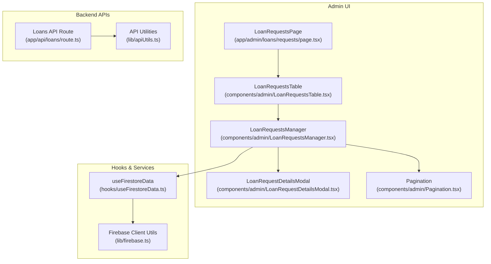
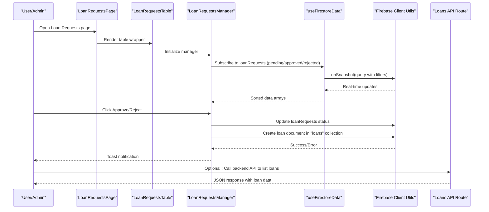
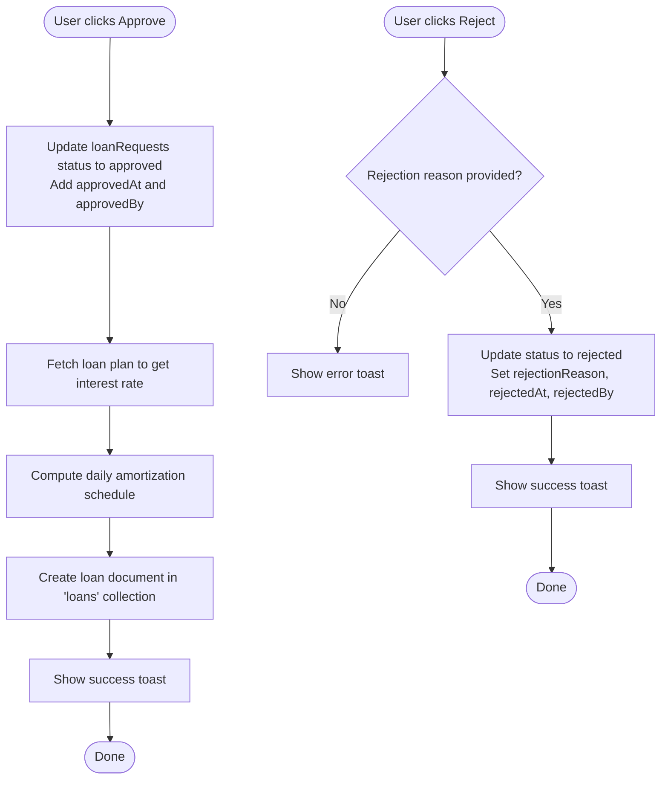
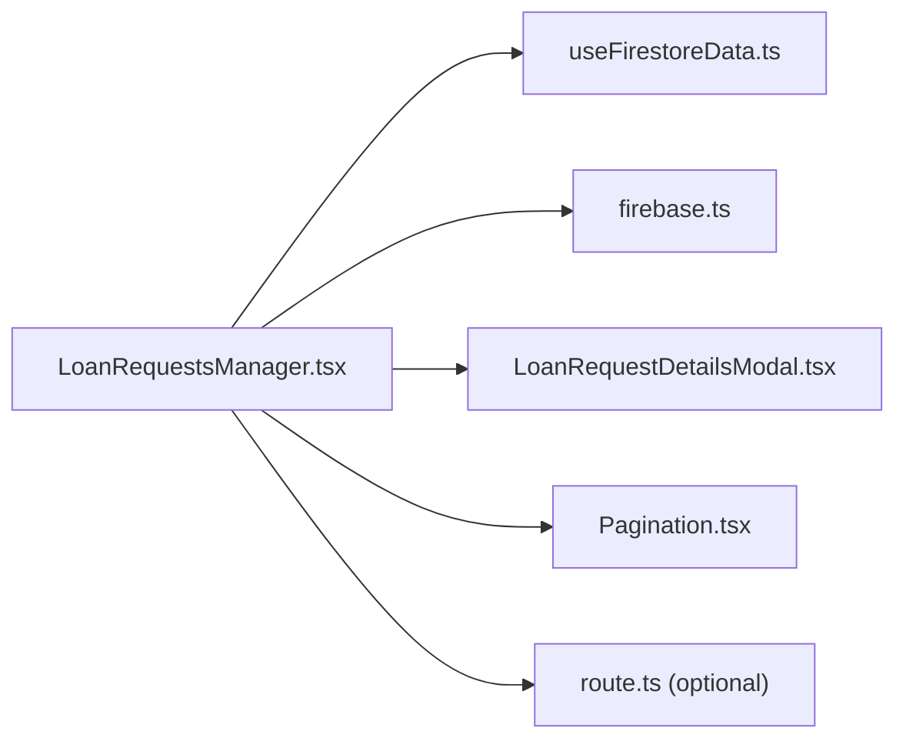

# Loan Approval Process

<cite>
**Referenced Files in This Document**
- [LoanRequestsManager.tsx](file://components/admin/LoanRequestsManager.tsx)
- [LoanRequestsManagerRefactored.tsx](file://components/admin/LoanRequestsManagerRefactored.tsx)
- [LoanRequestsTable.tsx](file://components/admin/LoanRequestsTable.tsx)
- [LoanRequestsPage.tsx](file://app/admin/loans/requests/page.tsx)
- [LoanRequestDetailsModal.tsx](file://components/admin/LoanRequestDetailsModal.tsx)
- [Pagination.tsx](file://components/admin/Pagination.tsx)
- [useFirestoreData.ts](file://hooks/useFirestoreData.ts)
- [firebase.ts](file://lib/firebase.ts)
- [FIRESTORE_INDEXES.md](file://docs/FIRESTORE_INDEXES.md)
- [route.ts](file://app/api/loans/route.ts)
- [apiUtils.ts](file://lib/apiUtils.ts)
</cite>

## Table of Contents
1. [Introduction](#introduction)
2. [Project Structure](#project-structure)
3. [Core Components](#core-components)
4. [Architecture Overview](#architecture-overview)
5. [Detailed Component Analysis](#detailed-component-analysis)
6. [Dependency Analysis](#dependency-analysis)
7. [Performance Considerations](#performance-considerations)
8. [Troubleshooting Guide](#troubleshooting-guide)
9. [Conclusion](#conclusion)
10. [Appendices](#appendices)

## Introduction
This document explains the loan approval process workflow in the cooperative management system. It covers the role-based approval mechanism, the LoanRequestsManager component’s capabilities (listing, approvals/rejections, status tracking), the approval workflow logic (automated checks, manual review, notifications), and the LoanRequestsTable implementation (sorting, filtering, pagination, and bulk actions). It also documents the refactored version improvements and migration considerations, along with approval criteria, required documentation review, risk assessment factors, compliance requirements, and examples of approval scenarios, rejection reasons, and escalation procedures for high-value loans.

## Project Structure
The loan approval UI is organized under the admin section and integrates with shared components and hooks for data fetching and presentation.

**Diagram sources**
- [LoanRequestsPage.tsx](file://app/admin/loans/requests/page.tsx#L1-L16)
- [LoanRequestsTable.tsx](file://components/admin/LoanRequestsTable.tsx#L1-L10)
- [LoanRequestsManager.tsx](file://components/admin/LoanRequestsManager.tsx#L1-L716)
- [LoanRequestDetailsModal.tsx](file://components/admin/LoanRequestDetailsModal.tsx#L1-L246)
- [Pagination.tsx](file://components/admin/Pagination.tsx#L1-L141)
- [useFirestoreData.ts](file://hooks/useFirestoreData.ts#L1-L182)
- [firebase.ts](file://lib/firebase.ts#L1-L309)
- [route.ts](file://app/api/loans/route.ts#L1-L133)
- [apiUtils.ts](file://lib/apiUtils.ts#L1-L109)

**Section sources**
- [LoanRequestsPage.tsx](file://app/admin/loans/requests/page.tsx#L1-L16)
- [LoanRequestsTable.tsx](file://components/admin/LoanRequestsTable.tsx#L1-L10)
- [LoanRequestsManager.tsx](file://components/admin/LoanRequestsManager.tsx#L1-L716)
- [LoanRequestDetailsModal.tsx](file://components/admin/LoanRequestDetailsModal.tsx#L1-L246)
- [Pagination.tsx](file://components/admin/Pagination.tsx#L1-L141)
- [useFirestoreData.ts](file://hooks/useFirestoreData.ts#L1-L182)
- [firebase.ts](file://lib/firebase.ts#L1-L309)
- [route.ts](file://app/api/loans/route.ts#L1-L133)
- [apiUtils.ts](file://lib/apiUtils.ts#L1-L109)

## Core Components
- LoanRequestsManager: Central component for managing loan requests with tabs for pending, approved, and rejected requests; supports real-time updates, search, pagination, and approval/rejection actions.
- LoanRequestDetailsModal: Detailed modal for viewing request metadata and performing approval/rejection actions.
- Pagination: Generic pagination component with ellipsis navigation.
- useFirestoreData: Hook that provides real-time data with client-side sorting and error handling, avoiding composite index requirements.
- Firebase Client Utils: Wrapper around Firestore client SDK with standardized helpers for CRUD operations.
- Loans API Route: Backend route for listing and creating loans with validation and standardized responses.

Key responsibilities:
- Role-based approval: The manager triggers approval/rejection actions; the UI enforces required rejection reasons for rejections.
- Status tracking: Requests are categorized by status and sorted by timestamps (createdAt, approvedAt, rejectedAt).
- Notification: Toast notifications provide user feedback for success/error states.
- Refactoring: A refactored version demonstrates improved maintainability using the hook-based approach.

**Section sources**
- [LoanRequestsManager.tsx](file://components/admin/LoanRequestsManager.tsx#L64-L716)
- [LoanRequestDetailsModal.tsx](file://components/admin/LoanRequestDetailsModal.tsx#L42-L246)
- [Pagination.tsx](file://components/admin/Pagination.tsx#L11-L141)
- [useFirestoreData.ts](file://hooks/useFirestoreData.ts#L19-L182)
- [firebase.ts](file://lib/firebase.ts#L90-L309)
- [route.ts](file://app/api/loans/route.ts#L1-L133)

## Architecture Overview
The loan approval workflow spans UI components, a hook-based data layer, and backend APIs. The system uses Firestore for persistence and real-time updates, with optional composite indexes for performance.

**Diagram sources**
- [LoanRequestsPage.tsx](file://app/admin/loans/requests/page.tsx#L1-L16)
- [LoanRequestsTable.tsx](file://components/admin/LoanRequestsTable.tsx#L1-L10)
- [LoanRequestsManager.tsx](file://components/admin/LoanRequestsManager.tsx#L143-L255)
- [useFirestoreData.ts](file://hooks/useFirestoreData.ts#L65-L125)
- [firebase.ts](file://lib/firebase.ts#L184-L240)
- [route.ts](file://app/api/loans/route.ts#L1-L133)

## Detailed Component Analysis

### LoanRequestsManager
Responsibilities:
- Real-time listeners for pending/approved/rejected loan requests using Firestore snapshots.
- Client-side sorting by appropriate timestamps.
- Approval flow: updates status to approved, computes a daily amortization schedule, and creates a loan record.
- Rejection flow: updates status to rejected with a required reason.
- Search/filtering across user name, email, plan name, request ID, and role.
- Pagination per tab with configurable items per page.
- Modal-driven details view for each request.

Approval workflow logic:
- On approve: set status to approved, capture approvedAt and approvedBy placeholders, fetch plan interest rate, compute daily schedule, and persist a new loan document.
- On reject: require a non-empty rejection reason, set status to rejected with rejectedAt and rejectedBy placeholders.

**Diagram sources**
- [LoanRequestsManager.tsx](file://components/admin/LoanRequestsManager.tsx#L257-L378)
- [LoanRequestsManager.tsx](file://components/admin/LoanRequestsManager.tsx#L380-L403)

**Section sources**
- [LoanRequestsManager.tsx](file://components/admin/LoanRequestsManager.tsx#L64-L716)

### LoanRequestDetailsModal
Responsibilities:
- Displays detailed information for a selected loan request.
- Provides action buttons for pending requests (approve/reject) with a required rejection reason input.
- Shows status badges and timestamps for approved/rejected requests.

**Section sources**
- [LoanRequestDetailsModal.tsx](file://components/admin/LoanRequestDetailsModal.tsx#L42-L246)

### Pagination
Responsibilities:
- Renders pagination controls with ellipsis for large page sets.
- Supports previous/next navigation and direct page selection.
- Responsive design for mobile and desktop.

**Section sources**
- [Pagination.tsx](file://components/admin/Pagination.tsx#L11-L141)

### useFirestoreData Hook
Responsibilities:
- Subscribes to Firestore collections with filters and applies client-side sorting.
- Avoids composite index requirements by fetching without orderBy and sorting locally.
- Provides loading, error, and refresh states.
- Includes a convenience hook useLoanRequests for loan request status queries.

Refactoring benefits:
- Eliminates the need for composite indexes.
- Simplifies component logic and improves maintainability.
- Centralizes error handling and data normalization.

**Section sources**
- [useFirestoreData.ts](file://hooks/useFirestoreData.ts#L19-L182)

### Firebase Client Utilities
Responsibilities:
- Wraps Firestore operations with standardized helpers (set, get, query, update, delete).
- Validates Firestore connection and provides detailed error messages.
- Used by components to perform CRUD operations safely.

**Section sources**
- [firebase.ts](file://lib/firebase.ts#L90-L309)

### Loans API Route
Responsibilities:
- Lists all loans via GET.
- Creates new loans via POST with validation for required fields and numeric types.
- Returns standardized JSON responses using API utilities.

**Section sources**
- [route.ts](file://app/api/loans/route.ts#L1-L133)
- [apiUtils.ts](file://lib/apiUtils.ts#L8-L59)

## Dependency Analysis
The LoanRequestsManager depends on:
- useFirestoreData for real-time data and sorting.
- firebase.ts for Firestore operations.
- LoanRequestDetailsModal and Pagination for UI composition.
- toast notifications for user feedback.

**Diagram sources**
- [LoanRequestsManager.tsx](file://components/admin/LoanRequestsManager.tsx#L1-L716)
- [useFirestoreData.ts](file://hooks/useFirestoreData.ts#L1-L182)
- [firebase.ts](file://lib/firebase.ts#L1-L309)
- [LoanRequestDetailsModal.tsx](file://components/admin/LoanRequestDetailsModal.tsx#L1-L246)
- [Pagination.tsx](file://components/admin/Pagination.tsx#L1-L141)
- [route.ts](file://app/api/loans/route.ts#L1-L133)

**Section sources**
- [LoanRequestsManager.tsx](file://components/admin/LoanRequestsManager.tsx#L1-L716)
- [useFirestoreData.ts](file://hooks/useFirestoreData.ts#L1-L182)
- [firebase.ts](file://lib/firebase.ts#L1-L309)
- [LoanRequestDetailsModal.tsx](file://components/admin/LoanRequestDetailsModal.tsx#L1-L246)
- [Pagination.tsx](file://components/admin/Pagination.tsx#L1-L141)
- [route.ts](file://app/api/loans/route.ts#L1-L133)

## Performance Considerations
- Composite indexes: The original implementation warns about required composite indexes for efficient querying. See the dedicated documentation for index configurations and deployment instructions.
- Client-side sorting: The refactored hook-based approach avoids composite indexes by fetching without orderBy and sorting locally, trading bandwidth for flexibility.
- Pagination: Items per page is fixed; adjust as needed for large datasets.
- Real-time listeners: Efficiently subscribe to specific status filters to minimize data transfer.

[No sources needed since this section provides general guidance]

## Troubleshooting Guide
Common issues and resolutions:
- Firestore index errors: If encountering “failed-precondition” errors, deploy the required composite indexes as documented.
- Data loading errors: The hook displays user-friendly error messages and logs details for debugging.
- UI crashes: Graceful error handling prevents UI crashes from snapshot listener failures.

Operational checks:
- Verify Firestore connection and collection existence.
- Confirm that loanRequests and loans collections exist and have proper security rules.
- Ensure the correct query scope and field ordering for indexes.

**Section sources**
- [FIRESTORE_INDEXES.md](file://docs/FIRESTORE_INDEXES.md#L71-L110)
- [useFirestoreData.ts](file://hooks/useFirestoreData.ts#L106-L116)
- [firebase.ts](file://lib/firebase.ts#L174-L181)

## Conclusion
The loan approval process combines a robust UI with real-time data synchronization, client-side sorting, and standardized backend APIs. The refactored hook-based approach simplifies maintenance and removes strict index requirements, while the original implementation remains viable with proper index deployment. The system supports role-based actions, comprehensive status tracking, and clear user feedback through notifications.

[No sources needed since this section summarizes without analyzing specific files]

## Appendices

### Role-Based Approval Mechanism
- The manager exposes approve/reject actions for pending requests.
- Rejection requires a non-empty reason; otherwise, the operation is blocked.
- Approval computes a daily amortization schedule and persists a new loan record.

**Section sources**
- [LoanRequestsManager.tsx](file://components/admin/LoanRequestsManager.tsx#L257-L378)
- [LoanRequestsManager.tsx](file://components/admin/LoanRequestsManager.tsx#L380-L403)
- [LoanRequestDetailsModal.tsx](file://components/admin/LoanRequestDetailsModal.tsx#L66-L74)

### Approval Workflow Logic
- Automated checks: Client-side validation ensures required fields are present before submission.
- Manual review: The modal presents request details and allows authorized officers to approve or reject.
- Notifications: Toast messages confirm outcomes and surface errors.

**Section sources**
- [LoanRequestsManager.tsx](file://components/admin/LoanRequestsManager.tsx#L257-L378)
- [LoanRequestsManager.tsx](file://components/admin/LoanRequestsManager.tsx#L380-L403)

### LoanRequestsTable Implementation
- Sorting: Client-side sorting by timestamps depending on status.
- Filtering: Search across user name, email, plan name, request ID, and role.
- Pagination: Per-tab pagination with ellipsis navigation.
- Bulk actions: The refactored version demonstrates how to structure bulk operations using the hook-based approach.

**Section sources**
- [LoanRequestsManager.tsx](file://components/admin/LoanRequestsManager.tsx#L428-L448)
- [LoanRequestsManager.tsx](file://components/admin/LoanRequestsManager.tsx#L479-L492)
- [Pagination.tsx](file://components/admin/Pagination.tsx#L11-L141)
- [LoanRequestsManagerRefactored.tsx](file://components/admin/LoanRequestsManagerRefactored.tsx#L47-L56)

### Refactored Version Improvements and Migration Considerations
- Improvements:
  - Eliminates composite index requirements by using client-side sorting.
  - Centralizes data fetching and error handling via a reusable hook.
  - Reduces component complexity and increases testability.
- Migration considerations:
  - Replace direct onSnapshot listeners with useLoanRequests hook.
  - Ensure consistent error handling and loading states.
  - Update UI components to consume paginated data from the hook.

**Section sources**
- [LoanRequestsManagerRefactored.tsx](file://components/admin/LoanRequestsManagerRefactored.tsx#L14-L85)
- [useFirestoreData.ts](file://hooks/useFirestoreData.ts#L154-L165)

### Approval Criteria, Required Documentation Review, Risk Assessment, and Compliance
- Approval criteria:
  - Request status is pending.
  - Sufficient collateral or income verification (as configured in the system).
  - Loan plan eligibility and term alignment.
- Required documentation review:
  - Identity verification, employment or income proof, and collateral documents.
  - Loan application form completion.
- Risk assessment factors:
  - Credit history, debt-to-income ratio, repayment capacity, and guarantor availability.
- Compliance requirements:
  - Adherence to cooperative policies, regulatory limits, and internal audit guidelines.
  - Proper authorization levels for different loan amounts and types.

[No sources needed since this section provides general guidance]

### Examples of Approval Scenarios, Rejection Reasons, and Escalation Procedures
- Approval scenarios:
  - Standard personal loan under policy limits with complete documentation and good credit history.
  - Group loan with co-signers meeting eligibility criteria.
- Rejection reasons:
  - Incomplete documentation, insufficient income verification, poor credit history, or policy violations.
- Escalation procedures:
  - High-value loans exceeding officer approval limits are escalated to higher authorities (e.g., chairman or board) for review and approval.

[No sources needed since this section provides general guidance]