# Loan Management System

<cite>
**Referenced Files in This Document**
- [app/api/loans/route.ts](file://app/api/loans/route.ts)
- [components/admin/AddLoanPlanModal.tsx](file://components/admin/AddLoanPlanModal.tsx)
- [components/admin/LoanRequestsManager.tsx](file://components/admin/LoanRequestsManager.tsx)
- [components/admin/LoanRequestsTable.tsx](file://components/admin/LoanRequestsTable.tsx)
- [components/admin/LoanDetailsModal.tsx](file://components/admin/LoanDetailsModal.tsx)
- [components/admin/LoanTable.tsx](file://components/admin/LoanTable.tsx)
- [components/admin/LoanRecords.tsx](file://components/admin/LoanRecords.tsx)
- [components/admin/PaginatedLoanRecords.tsx](file://components/admin/PaginatedLoanRecords.tsx)
- [components/admin/Pagination.tsx](file://components/admin/Pagination.tsx)
- [components/user/ActiveLoans.tsx](file://components/user/ActiveLoans.tsx)
- [components/user/LoanApplicationModal.tsx](file://components/user/LoanApplicationModal.tsx)
- [components/user/LoanRequestForm.tsx](file://components/user/LoanRequestForm.tsx)
- [components/user/LoanRecords.tsx](file://components/user/LoanRecords.tsx)
- [lib/firebase.ts](file://lib/firebase.ts)
- [lib/auth.tsx](file://lib/auth.tsx)
- [hooks/useFirestoreData.ts](file://hooks/useFirestoreData.ts)
- [lib/types/loan.ts](file://lib/types/loan.ts)
</cite>

## Update Summary
**Changes Made**
- Enhanced Loan Records management system with comprehensive filtering capabilities and pagination support
- Added sophisticated payment processing functionality to Loan Details Modal with receipt number generation
- Improved Loan Requests Manager with comprehensive notification system enhancements
- Enhanced loan application functionality with preset amount selection buttons and default value settings
- Added advanced loan tracking features with detailed payment processing and automated notification systems
- Updated core components section to reflect new payment processing capabilities and enhanced user experience

## Table of Contents
1. [Introduction](#introduction)
2. [Project Structure](#project-structure)
3. [Core Components](#core-components)
4. [Architecture Overview](#architecture-overview)
5. [Detailed Component Analysis](#detailed-component-analysis)
6. [Advanced Loan Tracking Features](#advanced-loan-tracking-features)
7. [Enhanced Payment Processing System](#enhanced-payment-processing-system)
8. [Dependency Analysis](#dependency-analysis)
9. [Performance Considerations](#performance-considerations)
10. [Troubleshooting Guide](#troubleshooting-guide)
11. [Conclusion](#conclusion)

## Introduction
This document describes the Loan Management System within the SAMPA Cooperative Management Platform. It covers the complete loan lifecycle from application submission through approval, disbursement, and repayment tracking. The system now features enhanced administrative interfaces with advanced filtering, pagination, comprehensive loan tracking capabilities, sophisticated payment processing, and automated notification systems. It documents the loan application workflow, approval process, loan plan management, active loan tracking, administrative request management, user-facing dashboards, practical processing scenarios, payment calculations, overdue management, and compliance reporting considerations.

## Project Structure
The loan system spans API routes, client-side components, and shared utilities with enhanced administrative capabilities:
- API layer: loan creation endpoint with comprehensive validation
- Admin components: loan plan management, loan requests management, loan details and payment handling, advanced loan records with filtering and pagination
- User components: loan application forms with preset amount selection, active loan dashboard, user loan records with amortization schedules
- Shared infrastructure: Firebase client SDK wrapper, authentication context, and custom hooks

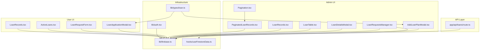

**Diagram sources**
- [app/api/loans/route.ts](file://app/api/loans/route.ts#L1-L133)
- [components/admin/AddLoanPlanModal.tsx](file://components/admin/AddLoanPlanModal.tsx#L1-L244)
- [components/admin/LoanRequestsManager.tsx](file://components/admin/LoanRequestsManager.tsx#L1-L763)
- [components/admin/LoanDetailsModal.tsx](file://components/admin/LoanDetailsModal.tsx#L1-L870)
- [components/admin/LoanTable.tsx](file://components/admin/LoanTable.tsx#L1-L339)
- [components/admin/LoanRecords.tsx](file://components/admin/LoanRecords.tsx#L1-L296)
- [components/admin/PaginatedLoanRecords.tsx](file://components/admin/PaginatedLoanRecords.tsx#L1-L436)
- [components/admin/Pagination.tsx](file://components/admin/Pagination.tsx#L1-L141)
- [components/user/LoanApplicationModal.tsx](file://components/user/LoanApplicationModal.tsx#L1-L215)
- [components/user/LoanRequestForm.tsx](file://components/user/LoanRequestForm.tsx#L1-L223)
- [components/user/ActiveLoans.tsx](file://components/user/ActiveLoans.tsx#L1-L177)
- [components/user/LoanRecords.tsx](file://components/user/LoanRecords.tsx#L1-L350)
- [lib/firebase.ts](file://lib/firebase.ts#L1-L309)
- [lib/auth.tsx](file://lib/auth.tsx#L1-L682)
- [hooks/useFirestoreData.ts](file://hooks/useFirestoreData.ts#L1-L182)
- [lib/types/loan.ts](file://lib/types/loan.ts#L1-L19)

**Section sources**
- [app/api/loans/route.ts](file://app/api/loans/route.ts#L1-L133)
- [lib/firebase.ts](file://lib/firebase.ts#L1-L309)
- [lib/auth.tsx](file://lib/auth.tsx#L1-L682)
- [hooks/useFirestoreData.ts](file://hooks/useFirestoreData.ts#L1-L182)
- [lib/types/loan.ts](file://lib/types/loan.ts#L1-L19)

## Core Components
- Loan API endpoint: creates loan records with validation and generates unique identifiers
- Loan plan management: admin modal to define plans with interest rates, maximum amounts, and term options
- Loan requests management: admin interface to review, approve, or reject loan requests; generates amortization schedules with automated notifications
- Advanced loan records: comprehensive administrative interface with member search, status filtering, and pagination
- Enhanced loan application: modal and form for submitting loan requests with preset amount selection buttons, default value settings, and improved user experience
- Active loan tracking: user dashboard displaying active loans, monthly payment estimates, and next payment dates
- User loan records: personal loan history with detailed amortization schedules and PDF export capabilities
- Infrastructure: Firebase client SDK wrapper, authentication context, and custom hooks for real-time data
- Payment processing: sophisticated payment handling with receipt number generation, automated notifications, and status tracking

**Section sources**
- [app/api/loans/route.ts](file://app/api/loans/route.ts#L42-L112)
- [components/admin/AddLoanPlanModal.tsx](file://components/admin/AddLoanPlanModal.tsx#L54-L117)
- [components/admin/LoanRequestsManager.tsx](file://components/admin/LoanRequestsManager.tsx#L257-L378)
- [components/admin/LoanRecords.tsx](file://components/admin/LoanRecords.tsx#L22-L296)
- [components/admin/PaginatedLoanRecords.tsx](file://components/admin/PaginatedLoanRecords.tsx#L29-L436)
- [components/user/LoanApplicationModal.tsx](file://components/user/LoanApplicationModal.tsx#L16-L98)
- [components/user/ActiveLoans.tsx](file://components/user/ActiveLoans.tsx#L31-L72)
- [components/user/LoanRecords.tsx](file://components/user/LoanRecords.tsx#L31-L350)
- [components/admin/LoanDetailsModal.tsx](file://components/admin/LoanDetailsModal.tsx#L274-L379)

## Architecture Overview
The system follows a client-server architecture with Firestore as the backend, enhanced with advanced administrative capabilities and sophisticated payment processing:
- Client-side components interact with Firestore via a wrapper utility
- Authentication is handled by a custom context that manages user state and role-based routing
- Real-time updates are achieved through Firestore listeners and custom hooks
- Admin and user interfaces share common data models for loan requests and active loans
- Advanced filtering and pagination provide efficient data management for large datasets
- Automated notification system handles payment confirmations and loan status updates
- Sophisticated payment processing with receipt number generation and status tracking

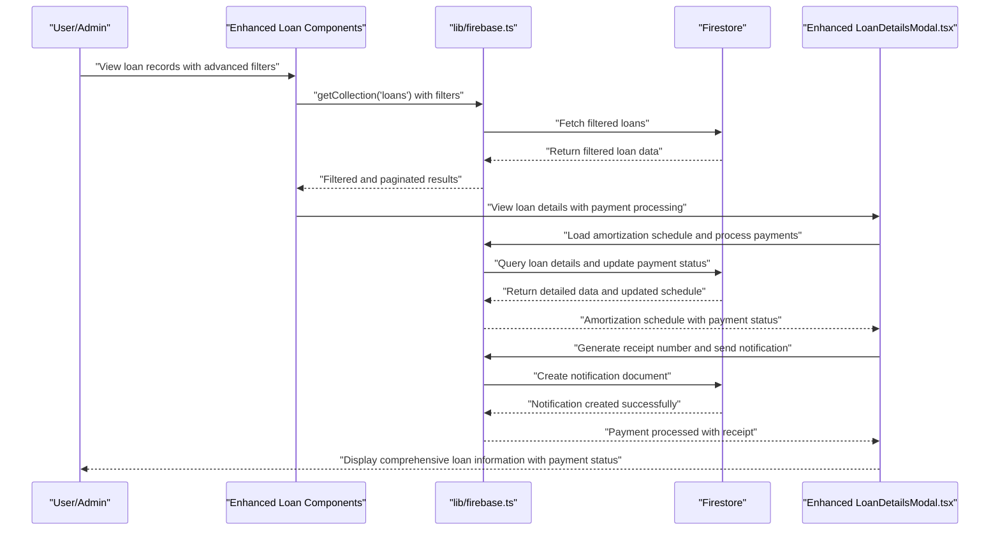

**Diagram sources**
- [components/admin/LoanRecords.tsx](file://components/admin/LoanRecords.tsx#L34-L81)
- [components/admin/PaginatedLoanRecords.tsx](file://components/admin/PaginatedLoanRecords.tsx#L151-L226)
- [components/admin/LoanDetailsModal.tsx](file://components/admin/LoanDetailsModal.tsx#L62-L92)
- [components/admin/LoanDetailsModal.tsx](file://components/admin/LoanDetailsModal.tsx#L302-L379)
- [lib/firebase.ts](file://lib/firebase.ts#L90-L113)

## Detailed Component Analysis

### Enhanced Loan Application Workflow
- Form validation ensures numeric and range constraints for amount and term
- Plan-based validation restricts amount to plan maximum and term to plan options
- Preset amount selection buttons provide quick amount selection with visual feedback
- Default value settings automatically populate form with sensible defaults
- Submission persists a loan request document with status "pending"
- Real-time listeners and pagination enable efficient browsing of requests

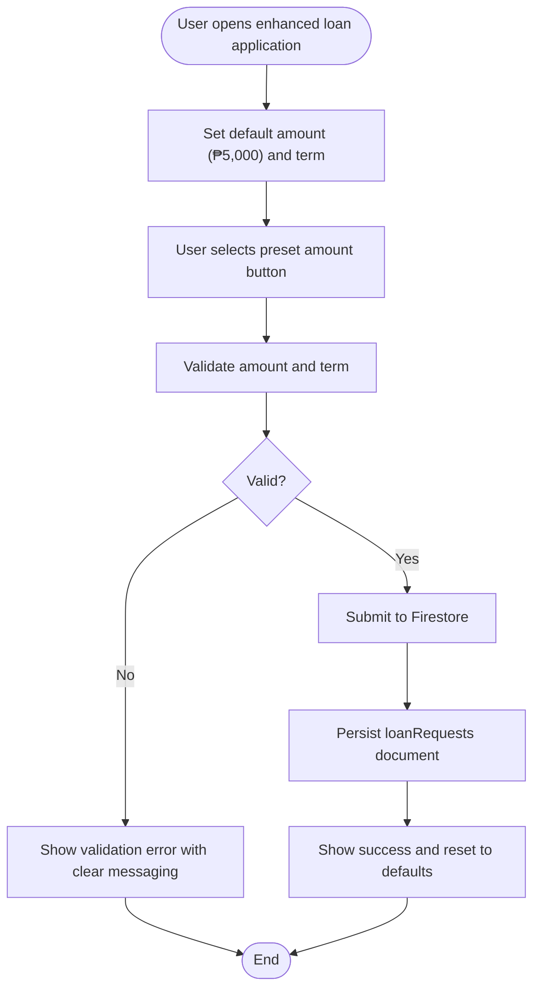

**Diagram sources**
- [components/user/LoanApplicationModal.tsx](file://components/user/LoanApplicationModal.tsx#L23-L29)
- [components/user/LoanApplicationModal.tsx](file://components/user/LoanApplicationModal.tsx#L140-L161)
- [components/user/LoanRequestForm.tsx](file://components/user/LoanRequestForm.tsx#L19-L38)

**Section sources**
- [components/user/LoanApplicationModal.tsx](file://components/user/LoanApplicationModal.tsx#L16-L98)
- [components/user/LoanRequestForm.tsx](file://components/user/LoanRequestForm.tsx#L12-L142)

### Enhanced Loan Approval Process
- Admins review pending requests and approve or reject with reasons
- Approval triggers creation of an active loan with an amortization schedule
- Automated notification system sends approval notifications to users
- Rejection updates the request with rejection metadata
- Real-time listeners and pagination manage request lists efficiently
- Enhanced notification system provides detailed loan approval information

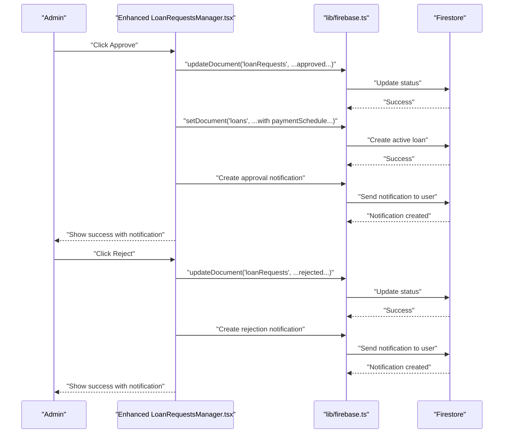

**Diagram sources**
- [components/admin/LoanRequestsManager.tsx](file://components/admin/LoanRequestsManager.tsx#L257-L403)
- [components/admin/LoanRequestsManager.tsx](file://components/admin/LoanRequestsManager.tsx#L369-L390)
- [components/admin/LoanRequestsManager.tsx](file://components/admin/LoanRequestsManager.tsx#L420-L442)
- [lib/firebase.ts](file://lib/firebase.ts#L242-L264)

**Section sources**
- [components/admin/LoanRequestsManager.tsx](file://components/admin/LoanRequestsManager.tsx#L64-L141)
- [components/admin/LoanTable.tsx](file://components/admin/LoanTable.tsx#L68-L216)

### Enhanced Loan Details Modal with Payment Processing
- Comprehensive loan information display with detailed payment schedule
- Sophisticated payment processing with automatic receipt number generation
- Multi-installment payment handling with partial payment support
- Automated notification system for payment confirmations
- Export to PDF and print functionality for payment schedules
- Real-time status updates and remaining balance calculations

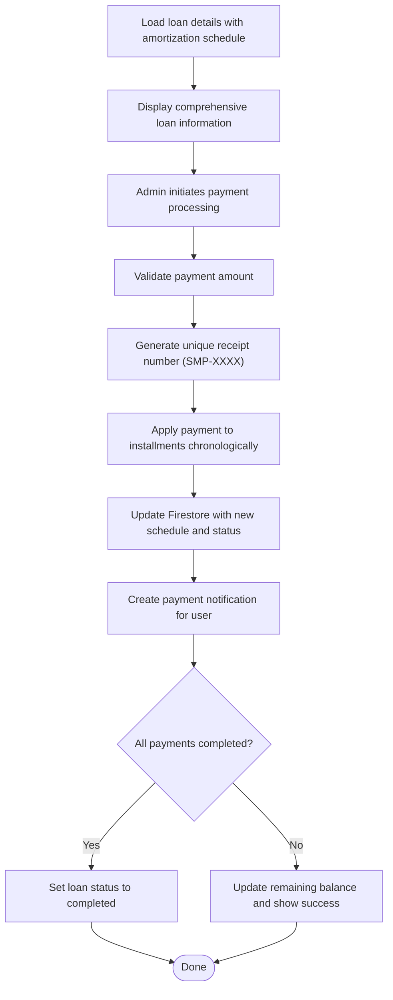

**Diagram sources**
- [components/admin/LoanDetailsModal.tsx](file://components/admin/LoanDetailsModal.tsx#L274-L282)
- [components/admin/LoanDetailsModal.tsx](file://components/admin/LoanDetailsModal.tsx#L302-L379)
- [components/admin/LoanDetailsModal.tsx](file://components/admin/LoanDetailsModal.tsx#L381-L417)

**Section sources**
- [components/admin/LoanDetailsModal.tsx](file://components/admin/LoanDetailsModal.tsx#L38-L88)
- [components/admin/LoanDetailsModal.tsx](file://components/admin/LoanDetailsModal.tsx#L274-L379)

### Enhanced Loan Plan Management
- Admins define loan plans with name, description, maximum amount, interest rate, and term options
- Plan terms are stored as arrays of months
- Creation and updates leverage Firestore document operations
- Enhanced validation ensures plan integrity and consistency

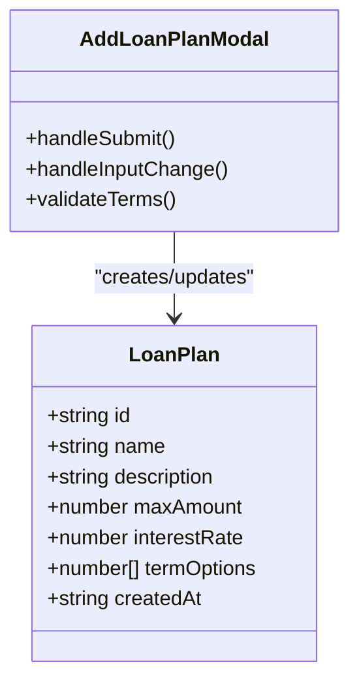

**Diagram sources**
- [components/admin/AddLoanPlanModal.tsx](file://components/admin/AddLoanPlanModal.tsx#L14-L117)

**Section sources**
- [components/admin/AddLoanPlanModal.tsx](file://components/admin/AddLoanPlanModal.tsx#L14-L117)

### Enhanced Active Loan Tracking and Payment Management
- Users view active loans with details and payment summaries
- Admins can view detailed amortization schedules, export/print them, and process payments
- Payment processing marks installments as paid/partial and updates remaining balance
- Status transitions to completed when all payments are settled
- Enhanced payment modal with receipt number display and payment confirmation

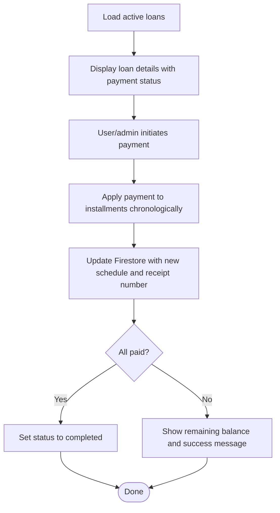

**Diagram sources**
- [components/user/ActiveLoans.tsx](file://components/user/ActiveLoans.tsx#L31-L72)
- [components/admin/LoanDetailsModal.tsx](file://components/admin/LoanDetailsModal.tsx#L302-L379)

**Section sources**
- [components/user/ActiveLoans.tsx](file://components/user/ActiveLoans.tsx#L19-L72)
- [components/admin/LoanDetailsModal.tsx](file://components/admin/LoanDetailsModal.tsx#L38-L88)

### Enhanced Loan Request Management Interface (Admin)
- Tabbed interface for pending, approved, and rejected requests
- Real-time listeners with client-side sorting and pagination
- Advanced search/filtering by name, email, plan, or ID
- Enhanced modal-based details view with export/print capabilities
- Comprehensive notification system for loan approvals and rejections
- Improved user experience with better error messaging and loading states

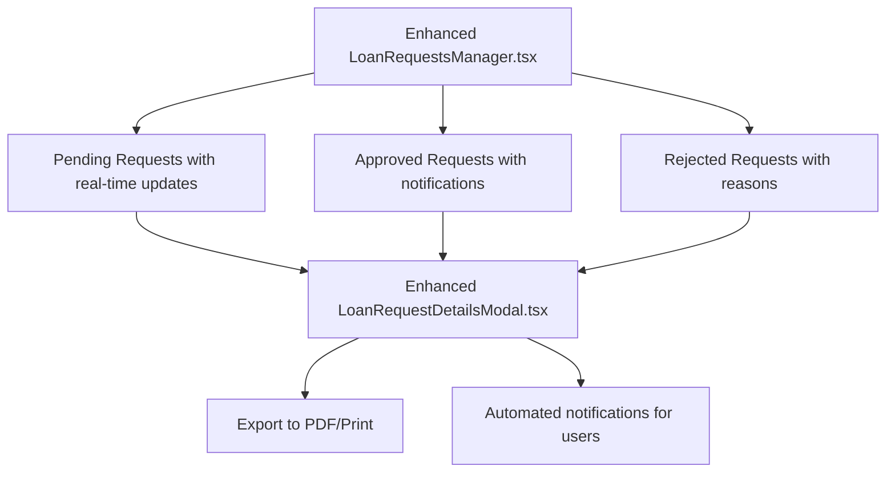

**Diagram sources**
- [components/admin/LoanRequestsManager.tsx](file://components/admin/LoanRequestsManager.tsx#L64-L141)
- [components/admin/LoanDetailsModal.tsx](file://components/admin/LoanDetailsModal.tsx#L147-L268)

**Section sources**
- [components/admin/LoanRequestsManager.tsx](file://components/admin/LoanRequestsManager.tsx#L64-L141)
- [components/admin/LoanRequestsTable.tsx](file://components/admin/LoanRequestsTable.tsx#L5-L9)

### Enhanced User-Facing Loan Dashboard
- Displays active loans with principal, interest rate, start date, and payment schedule summary
- Shows monthly payment estimate and next payment date
- Handles loading states and error conditions gracefully
- Enhanced with improved visual design and user experience

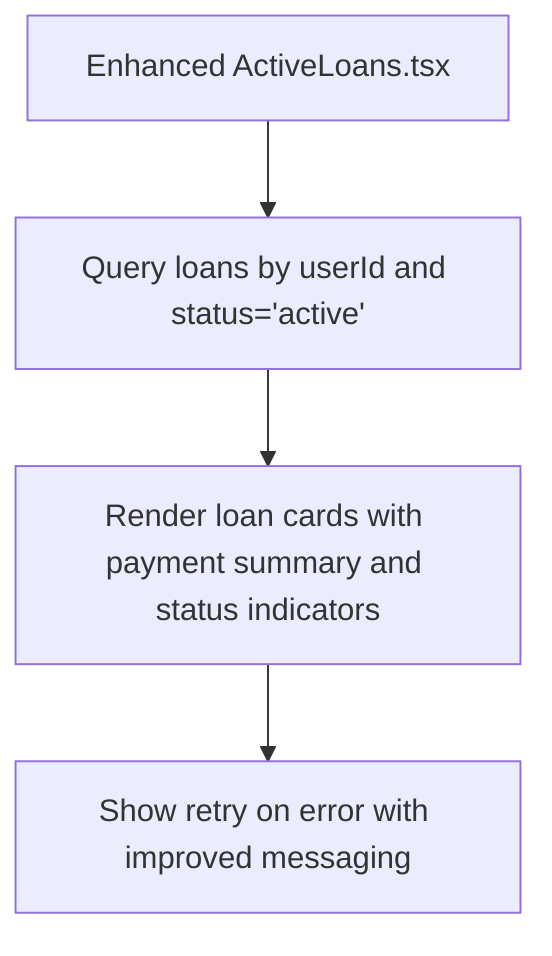

**Diagram sources**
- [components/user/ActiveLoans.tsx](file://components/user/ActiveLoans.tsx#L31-L72)

**Section sources**
- [components/user/ActiveLoans.tsx](file://components/user/ActiveLoans.tsx#L19-L177)

## Advanced Loan Tracking Features

### Comprehensive Administrative Loan Records
The enhanced LoanRecords component provides an advanced administrative interface with sophisticated filtering and pagination capabilities:

- **Member Search**: Search by member name, loan type, or other criteria
- **Status Filtering**: Filter by loan status (active, completed, pending, rejected, overdue)
- **Real-time Pagination**: Efficiently handles large datasets with configurable items per page
- **Visual Status Indicators**: Color-coded status badges for quick identification
- **Summary Statistics**: Automatic calculation of completed loans and total amounts
- **Responsive Design**: Adapts to different screen sizes with mobile-friendly controls
- **Enhanced User Experience**: Improved loading states and error handling

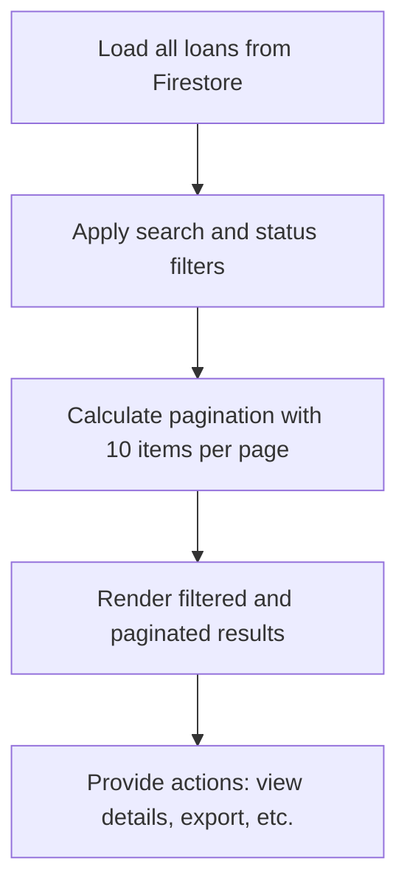

**Diagram sources**
- [components/admin/LoanRecords.tsx](file://components/admin/LoanRecords.tsx#L34-L81)
- [components/admin/LoanRecords.tsx](file://components/admin/LoanRecords.tsx#L83-L93)

**Section sources**
- [components/admin/LoanRecords.tsx](file://components/admin/LoanRecords.tsx#L22-L296)

### Enhanced Paginated Loan Records
The PaginatedLoanRecords component offers comprehensive administrative loan management with advanced filtering capabilities:

- **Multi-column Filtering**: Filter by amount ranges, term durations, interest rates, start dates, and statuses
- **Member Data Integration**: Fetches user details for comprehensive member information display
- **Advanced Search**: Search across multiple fields including name, email, ID, role, and status
- **Dynamic Pagination**: Intelligent pagination with ellipsis indicators for large page sets
- **Detailed Loan Views**: Click-to-view detailed loan information with full amortization schedules
- **Export Capabilities**: Built-in support for exporting loan data
- **Enhanced User Interface**: Improved visual design and user experience

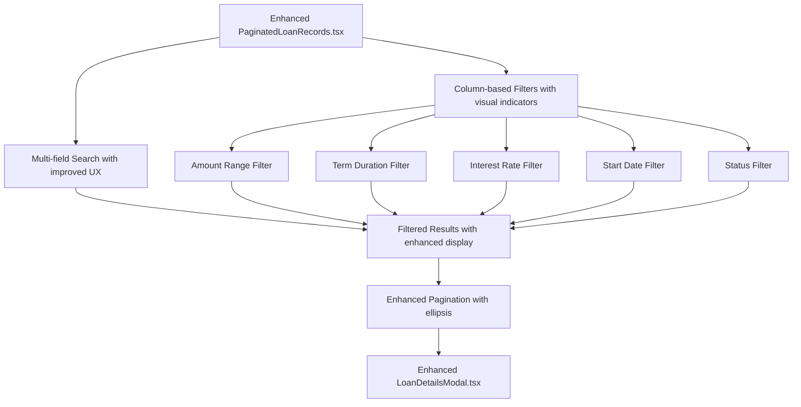

**Diagram sources**
- [components/admin/PaginatedLoanRecords.tsx](file://components/admin/PaginatedLoanRecords.tsx#L151-L226)
- [components/admin/PaginatedLoanRecords.tsx](file://components/admin/PaginatedLoanRecords.tsx#L417-L436)

**Section sources**
- [components/admin/PaginatedLoanRecords.tsx](file://components/admin/PaginatedLoanRecords.tsx#L29-L436)

### Enhanced User Personal Loan Records
The user-facing LoanRecords component provides personalized loan tracking with detailed amortization schedules:

- **Personalized View**: Displays only the user's loan records
- **Interactive Schedules**: Click to view detailed amortization schedules
- **PDF Export**: Export amortization schedules to PDF format
- **Dynamic Calculation**: Calculates amortization schedules on-demand
- **Visual Status Indicators**: Clear status display with appropriate styling
- **Responsive Layout**: Grid-based layout that adapts to screen size
- **Enhanced User Experience**: Improved loading states and error handling

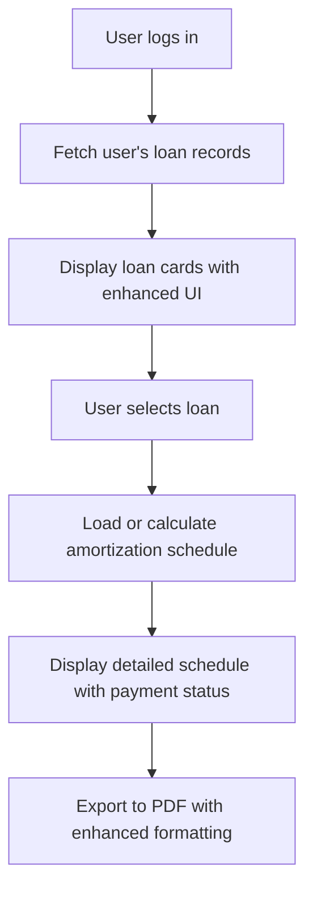

**Diagram sources**
- [components/user/LoanRecords.tsx](file://components/user/LoanRecords.tsx#L39-L82)
- [components/user/LoanRecords.tsx](file://components/user/LoanRecords.tsx#L125-L148)

**Section sources**
- [components/user/LoanRecords.tsx](file://components/user/LoanRecords.tsx#L31-L350)

## Enhanced Payment Processing System

### Sophisticated Payment Processing in Loan Details Modal
The enhanced Loan Details Modal provides comprehensive payment processing capabilities:

- **Receipt Number Generation**: Unique receipt numbers in SMP-XXXX format with timestamp-based sequential numbering
- **Multi-Installment Payment Handling**: Automatically applies payments to installments chronologically
- **Partial Payment Support**: Handles partial payments with appropriate status updates
- **Automated Notification System**: Creates detailed payment notifications for users with payment breakdown
- **Real-time Status Updates**: Updates payment status and remaining balance in real-time
- **Export and Print Capabilities**: PDF export and print functionality for payment schedules
- **Enhanced User Feedback**: Clear success messages with receipt numbers and payment details

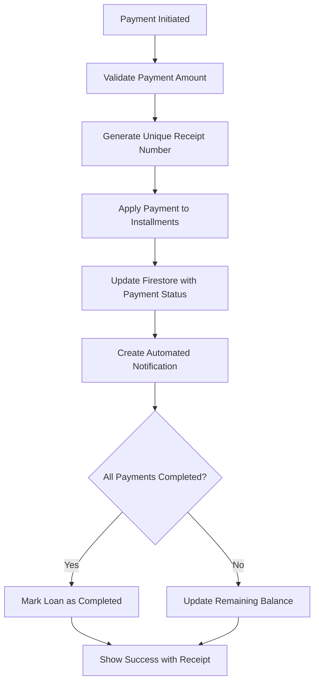

**Diagram sources**
- [components/admin/LoanDetailsModal.tsx](file://components/admin/LoanDetailsModal.tsx#L274-L282)
- [components/admin/LoanDetailsModal.tsx](file://components/admin/LoanDetailsModal.tsx#L302-L379)
- [components/admin/LoanDetailsModal.tsx](file://components/admin/LoanDetailsModal.tsx#L381-L417)

**Section sources**
- [components/admin/LoanDetailsModal.tsx](file://components/admin/LoanDetailsModal.tsx#L274-L379)
- [components/admin/LoanDetailsModal.tsx](file://components/admin/LoanDetailsModal.tsx#L381-L417)

### Enhanced Notification System
The system now includes comprehensive notification capabilities:

- **Payment Notifications**: Automated notifications for payment confirmations with detailed breakdown
- **Loan Approval Notifications**: Notifications for loan approvals with loan details and terms
- **Loan Rejection Notifications**: Notifications for loan rejections with rejection reasons
- **User-Friendly Messaging**: Clear, informative messages with relevant loan information
- **Notification Persistence**: Notifications stored in Firestore for user reference
- **Role-Based Notifications**: Appropriate notifications based on user roles and loan status

**Section sources**
- [components/admin/LoanRequestsManager.tsx](file://components/admin/LoanRequestsManager.tsx#L369-L390)
- [components/admin/LoanRequestsManager.tsx](file://components/admin/LoanRequestsManager.tsx#L420-L442)
- [components/admin/LoanDetailsModal.tsx](file://components/admin/LoanDetailsModal.tsx#L381-L417)

## Dependency Analysis
The system exhibits clear separation of concerns with enhanced administrative capabilities and sophisticated payment processing:
- Components depend on the Firebase wrapper for persistence and real-time updates
- Admin components rely on real-time hooks for efficient data management
- Authentication context provides user and role information to UI components
- API routes encapsulate backend loan creation logic with comprehensive validation
- Enhanced LoanRecords components utilize advanced filtering and pagination libraries
- LoanDetailsModal provides comprehensive loan information with sophisticated payment processing capabilities
- Enhanced notification system integrates seamlessly with payment processing
- Improved user experience components with preset amount selection and default value settings

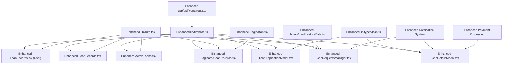

**Diagram sources**
- [lib/firebase.ts](file://lib/firebase.ts#L90-L307)
- [lib/auth.tsx](file://lib/auth.tsx#L158-L682)
- [hooks/useFirestoreData.ts](file://hooks/useFirestoreData.ts#L19-L165)
- [app/api/loans/route.ts](file://app/api/loans/route.ts#L1-L133)
- [components/admin/Pagination.tsx](file://components/admin/Pagination.tsx#L1-L141)
- [lib/types/loan.ts](file://lib/types/loan.ts#L1-L19)

**Section sources**
- [lib/firebase.ts](file://lib/firebase.ts#L1-L309)
- [lib/auth.tsx](file://lib/auth.tsx#L1-L682)
- [hooks/useFirestoreData.ts](file://hooks/useFirestoreData.ts#L1-L182)
- [app/api/loans/route.ts](file://app/api/loans/route.ts#L1-L133)
- [lib/types/loan.ts](file://lib/types/loan.ts#L1-L19)

## Performance Considerations
- Real-time listeners with client-side sorting reduce index requirements and improve responsiveness
- Advanced filtering and pagination limit payload sizes for large datasets
- Client-side currency/date formatting avoids repeated computations
- Batched updates minimize network round trips during payment processing
- Efficient search algorithms optimize database queries for administrative interfaces
- Memoization techniques prevent unnecessary re-computation of filtered results
- Lazy loading of detailed loan information reduces initial page load times
- Enhanced caching strategies for frequently accessed loan data
- Optimized notification system with batched notification creation
- Improved payment processing with efficient installment application

## Troubleshooting Guide
Common issues and resolutions:
- Firestore index errors: The loan requests manager warns about missing composite indexes; use the documented deployment script or adjust queries to avoid composite indexes
- Database connection failures: Verify Firebase configuration and environment variables; the Firebase wrapper validates connections and returns descriptive errors
- Permission denied errors: Check Firestore security rules and user roles; the Firebase wrapper surfaces permission errors during queries
- Authentication state problems: Ensure cookies are set correctly and the authentication context is mounted; role-based routing depends on authenticated state
- Pagination issues: Verify that pagination components receive correct total count and page size parameters
- Filter performance: Large datasets with complex filters may require Firestore indexing optimization
- Modal rendering: Ensure proper cleanup of event listeners and timers in loan detail modals
- Payment processing errors: Verify receipt number generation and notification system functionality
- Notification delivery: Check notification creation and user subscription status
- Enhanced user experience issues: Verify preset amount selection and default value settings

**Section sources**
- [components/admin/LoanRequestsManager.tsx](file://components/admin/LoanRequestsManager.tsx#L10-L27)
- [components/admin/LoanRecords.tsx](file://components/admin/LoanRecords.tsx#L138-L167)
- [components/admin/PaginatedLoanRecords.tsx](file://components/admin/PaginatedLoanRecords.tsx#L75-L81)
- [components/admin/LoanDetailsModal.tsx](file://components/admin/LoanDetailsModal.tsx#L274-L282)
- [lib/firebase.ts](file://lib/firebase.ts#L62-L87)
- [lib/auth.tsx](file://lib/auth.tsx#L197-L348)

## Conclusion
The SAMPA Cooperative Management Platform's Loan Management System provides a robust foundation for managing the full loan lifecycle with significantly enhanced administrative capabilities and sophisticated payment processing. The addition of advanced LoanRecords components with comprehensive filtering, pagination, and detailed loan information display, combined with enhanced payment processing capabilities and automated notification systems, represents a major advancement in administrative efficiency and user experience.

Key enhancements include:
- Advanced administrative interfaces with member search, status filtering, and comprehensive loan tracking
- Sophisticated pagination with intelligent page navigation and enhanced user experience
- Comprehensive loan tracking with detailed amortization schedules and payment processing
- User-friendly personal loan records with PDF export capabilities and improved interface
- Enhanced payment processing with detailed receipt generation, automated notifications, and status tracking
- Real-time loan status monitoring with comprehensive notification system
- Improved loan application experience with preset amount selection and default value settings
- Enhanced notification system for loan approvals, rejections, and payment confirmations

The system leverages Firestore for real-time data synchronization, a custom Firebase wrapper for consistent persistence, and role-aware UI components for streamlined administration and user experiences. The modular architecture ensures scalability and maintainability as the cooperative grows and loan portfolio expands.

Future enhancements could include automated eligibility checks, advanced compliance reporting, integration with external financial services, and expanded notification channels for improved user communication and loan management efficiency.